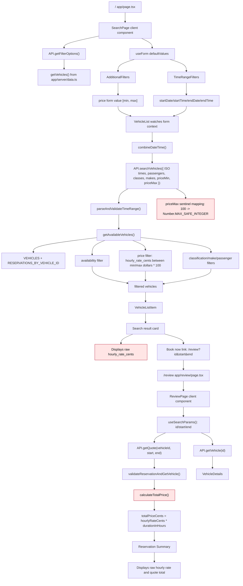
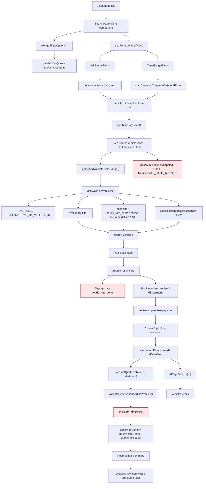

# AI Log

## Summary

I used AI to help map the repo, identify root causes, generate edge cases, review implementation options, verify behavior, triage review findings, and polish documentation. I made the final decisions and verified behavior with the checks listed in `DECISIONS.md`.

Note on commit history: I worked in incremental checkpoints locally, but accidentally collapsed the public commit history while preparing the final repo. I preserved the AI transcript, verification notes, and decision history in `AI_LOG.md` and `DECISIONS.md`.

## Sessions

1. Bootstrap / workflow setup
2. Repo exploration
3. Part 1 — price filter root-cause analysis and fix
4. Part 1 — review gate and commit
5. Part 2 — discount truth table and implementation
6. Part 2 — review gate and commit
7. Part 3 — refactor
8. Part 3 — review gate and commit
9. Final docs and review

## Review Gate Summaries

Add each section’s safe-commit summary here.

### Part 1 — Price Filter Review Gate

Scope:
- Part 1 price-filter implementation plus workflow documentation updates.

Checks run:
- `npm run ts` — PASS.
- Direct API check for `priceMax: 100`, `priceMax: 125`, and `priceMax: null` — PASS.

Codex review:
- Reviewed the changed search/filter contract against `code_review.md`.
- Accepted high-risk findings: none.
- Deferred findings: pre-existing reset-button disabled logic checks `make === undefined`, which means the reset button is not disabled at the default state; this is not caused by the Part 1 price-filter fix and does not affect selected max-price filtering.
- Rejected findings: none.

CodeRabbit:
- Attempted before and after the initial Part 1 commit.
- Result: unavailable for the root commit because CodeRabbit could not resolve a base branch/`HEAD` before the initial commit and could not determine a base branch for the root commit after it was created.
- Triage: treated as a setup limitation, not a code-review finding.
- Cleanup: removed failed setup-output artifacts from `artifacts/reviews/`; future review artifacts are ignored unless intentionally added.

### Part 2 — Discounts Review Gate

Scope:
- Part 2 shared pricing helper, search/review discount display, pricing tests, and browser QA artifacts.

Checks run:
- `node --import tsx --test app/server/pricing.test.ts` — PASS.
- `npm run ts` — PASS.

Codex review:
- Reviewed the changed pricing flow against `code_review.md`.
- Accepted high-risk findings: none.
- Deferred findings: none.
- Rejected findings: none.

CodeRabbit:
- Ran `coderabbit review --agent -t uncommitted --base main -c AGENTS.md` — completed.
- Issues raised: 2 major.
- Accepted: documentation gap asking AI_LOG to include boundary/conflict test rows; fixed by adding the automated pricing helper matrix.
- Rejected: suggestion to replace search-card base hourly rate with a discounted hourly value. Search and review both intentionally show the base hourly rate plus explicit discount label/row, while the final total is the discounted source of truth. The user later revised the search-card hierarchy so hourly rate is now the first price signal and discounted totals are shown with a struck-through original total.

## Implementation Verification

### Part 1 — Price Filter

Checks run:
- `npm run ts` — PASS.
- Direct API check for `priceMax: 100`, `priceMax: 125`, and `priceMax: null` — PASS.

Browser QA:
- App URL: `http://localhost:3000`.
- Recording/replay: unavailable in the exposed Codex in-app browser capabilities for this session.
- Artifact summary: `artifacts/browser-qa/part1-price-filter/qa-summary.md`.
- Screenshot/appshot artifact directory: `artifacts/browser-qa/part1-price-filter`.

| Scenario | Expected | Observed | Status |
| --- | --- | --- | --- |
| Default search state | Label is `$10 to Any`; expensive vehicles can appear when otherwise available. | Label was `$10 to Any`; min `10`; max `250`; expensive vehicles appeared. | PASS |
| Real `$100/hr` max | Label is `$10 to $100`; vehicles above `$100/hr` are hidden. | Label was `$10 to $100`; min `10`; max `100`; expensive vehicles were hidden. | PASS |
| Real `$125/hr` max | Label is `$10 to $125`; vehicles above `$125/hr` are hidden. | Label was `$10 to $125`; min `10`; max `125`; expensive vehicles were hidden. | PASS |
| Return to unbounded `Any` | Label is `$10 to Any`; expensive vehicles appear again when otherwise available. | Label was `$10 to Any`; min `10`; max `250`; expensive vehicles appeared again. | PASS |

### Part 2 — Discounts

Checks run:
- `node --import tsx --test app/server/pricing.test.ts` — PASS.
- `npm run ts` — PASS.

Automated pricing helper checks:

| Scenario | Expected | Observed | Status |
| --- | --- | --- | --- |
| No discount | Total equals hourly rate times duration; discount is `null`. | 24-hour Nissan Rogue quote returned `139200` cents and no discount. | PASS |
| Pickup or dropoff on a holiday date | Holiday discount does not apply when the holiday date equals pickup or dropoff date. | May 2 pickup and May 2 dropoff boundary cases returned undiscounted 48-hour totals. | PASS |
| Holiday strictly inside reservation | Holiday discount applies when the fictional holiday date is strictly between pickup and dropoff dates. | May 1 to May 3 Nissan Rogue quote returned `231072` cents with `holiday` discount. | PASS |
| Exactly 72 hours | Long-reservation discount does not apply at exactly 72 hours. | 72-hour Nissan Rogue quote returned `417600` cents and no discount. | PASS |
| More than 72 hours | Long-reservation discount applies when duration is greater than 72 hours. | 73-hour Nissan Rogue quote returned `350400` cents with `long_reservation` discount. | PASS |
| Conflicting discounts | Discounts do not stack; both candidates are calculated independently and the lower final price wins. | High-rate overlapping holiday trip chose `holiday`; lower-rate overlapping holiday trip chose `long_reservation`. | PASS |

Browser QA:
- App URL: `http://localhost:3000`.
- Recording/replay: unavailable in the exposed browser tooling for this session; generated rendered browser screenshots and appshot text through a no-dependency Chrome DevTools Protocol session.
- Artifact summary: `artifacts/browser-qa/part2-discounts/qa-summary.md`.
- Screenshot/appshot artifact directory: `artifacts/browser-qa/part2-discounts`.

| Scenario | Expected | Observed | Status |
| --- | --- | --- | --- |
| Initial default search | Initial implementation showed estimated final total and kept hourly rate as supporting context, with no discount label for ordinary 24-hour search. | Nissan Rogue displayed `$1,392` estimated total and `$58/hr/24 hr`, with no discount label. | PASS |
| Holiday search | Jun 15 to Jun 17 includes the Jun 16 holiday strictly inside; search shows holiday discount and final total. | Nissan Rogue displayed `$2,310.72`, `Holiday discount`, `$58/hr/48 hr`, and `Save $473.28`. | PASS |
| Holiday review consistency | Review for the same Nissan holiday trip shows the same final total, subtotal, and discount. | Review displayed subtotal `$2,784`, `Holiday discount -$473.28`, and total cost `$2,310.72`. | PASS |
| Long reservation search | Jun 20 to Jun 24 is greater than 72 hours with no holiday; search shows long-reservation discount. | Nissan Rogue displayed `$4,608`, `Long reservation discount`, `$58/hr/96 hr`, and `Save $960`. | PASS |
| Long reservation review consistency | Review for the same Nissan long trip shows the same final total and discount. | Review displayed subtotal `$5,568`, `Long reservation discount -$960`, and total cost `$4,608`. | PASS |

Presentation refinement:
- User feedback: the first implementation was functionally correct, but did not visually anchor savings because the original price was missing from the search-card discount presentation.
- Update made: search cards now show hourly rate first, then estimated trip total. Discounted cards emphasize the discounted total, show the original total struck through, and keep the discount label plus savings as supporting copy.
- Artifact summary: `artifacts/browser-qa/part2-discount-presentation/qa-summary.md`.

| Scenario | Expected | Observed | Status |
| --- | --- | --- | --- |
| Default card hierarchy | Non-discounted search card shows hourly rate first, then estimated total without discount copy. | Nissan Rogue displayed `$58/hr`, `24 hr trip`, `$1,392`, and `estimated total`. | PASS |
| Discounted card hierarchy | Discounted card shows hourly rate first, discounted total next, original total struck through, then discount label and savings. | Nissan Rogue displayed `$58/hr`, `$2,310.72` estimated total, `$2,784 normal total` with line-through, and `Holiday discount - Save $473.28`. | PASS |

Lightweight search-card refinement:
- User feedback: the card was becoming too busy and search should stay focused on comparison, not receipt-level detail.
- Update made: removed trip-duration line and discount label/savings copy from search cards. Discounted cards now show hourly rate, struck-through original total, then green discounted estimated total. Review keeps the discount label and savings explanation.
- Artifact summary: `artifacts/browser-qa/part2-light-search-card/qa-summary.md`.

| Scenario | Expected | Observed | Status |
| --- | --- | --- | --- |
| Default lightweight card | Non-discounted card shows hourly rate first and estimated total without trip duration or discount copy. | Nissan Rogue displayed `$58/hr`, `$1,392`, and `estimated total`. | PASS |
| Discounted lightweight card | Discounted card shows hourly rate, struck-through original total, and green discounted estimated total; discount label/savings and trip-duration copy are absent. | Nissan Rogue displayed `$58/hr`, `$2,784` with line-through, and `$2,310.72 estimated total`; no `normal total`, `Holiday discount`, `Save`, or `48 hr trip` copy appeared. | PASS |

Label removal refinement:
- User feedback: the `normal total` text was unnecessary because the strikethrough implies the original total.
- Update made: removed the `normal total` label from search cards while keeping the struck-through original total.
- Artifact summary: `artifacts/browser-qa/part2-light-search-card/qa-summary-no-normal-label.md`.

| Scenario | Expected | Observed | Status |
| --- | --- | --- | --- |
| Discounted card without normal-total label | Discounted card keeps struck-through original total and green discounted estimated total, without normal-total label or discount copy. | Nissan Rogue displayed `$58/hr`, `$2,784` with line-through, and `$2,310.72 estimated total`; `normal total` was absent. | PASS |

Filter UX refinement:
- User feedback: class and make filters felt backwards because every category started selected, and users needed precise filter entry plus basic price sorting.
- Update planned and implemented: class/make now default unchecked and empty selections mean no class/make filter; sorting supports recommended, lowest estimated trip total, and highest estimated trip total.
- Follow-up cleanup: the first pass added separate exact input rows, but the user correctly flagged that the filter UI was becoming too much like a settings panel. I replaced the separate pickup/drop-off date fields with one reservation date-range picker, replaced class/make chip grids with compact checkbox dropdowns, and moved price/passenger precision editing into the displayed values beside each slider.
- Product follow-up: `Most popular` sort was deferred because the repo has no real popularity signal.

Automated checks:

| Scenario | Expected | Observed | Status |
| --- | --- | --- | --- |
| Empty class/make selections | Empty class/make arrays mean no class/make filter. | `getAvailableVehicles` returned broadly available vehicles. | PASS |
| Selected class | Selecting `SUV` narrows results to SUVs. | `getAvailableVehicles` returned only SUV vehicles. | PASS |
| Selected make | Selecting `Nissan` narrows results to Nissan vehicles. | `getAvailableVehicles` returned only Nissan vehicles. | PASS |
| Recommended sort | Recommended preserves API/data order. | Sort helper preserved original order. | PASS |
| Lowest/highest sort | Price sorting uses estimated quote total. | Sort helper ordered by `quote.totalPriceCents` ascending and descending. | PASS |

Browser QA:
- App URL: `http://localhost:3000/`.
- Recording/replay: unavailable through the exposed browser tooling in this session; screenshots and appshot JSON were captured instead.
- Artifact summary: `artifacts/browser-qa/part2-filter-ux/qa-summary.md`.
- Screenshot/appshot artifact directory: `artifacts/browser-qa/part2-filter-ux`.

| Scenario | Expected | Observed | Status |
| --- | --- | --- | --- |
| Default opt-in filters | Class and make filters are unchecked by default, while results still render broadly. | All class toggles were off, exact max price was blank/`Any`, and 8 vehicles rendered. | PASS |
| SUV filter | Clicking `SUV` narrows results to SUVs. | 4 vehicles rendered, all with class `SUV`. | PASS |
| Add Compact filter | Adding `Compact` broadens within selected classes. | 5 vehicles rendered: the four SUVs plus Volkswagen Golf as `Compact`. | PASS |
| Exact max price | Typing `100` hides vehicles above `$100/hr` and keeps the slider synced. | Ford `$160/hr` and Mercedes `$220/hr` were hidden; max slider value was `100`. | PASS |
| Blank price restores Any | Clearing exact max price restores unbounded search. | 8 vehicles rendered again and max slider value returned to `250`. | PASS |
| Exact passenger input | Typing `7` shows vehicles with at least 7 passengers and keeps the slider synced. | Hyundai Santa Fe, Mazda CX-9, and Chrysler Pacifica rendered; passenger slider value was `7`. | PASS |
| Lowest price sort | Sort ascending by estimated trip total. | Results started Volkswagen `$1,344`, Nissan `$1,392`, Mazda `$1,680`, Hyundai `$1,728`. | PASS |
| Highest price sort | Sort descending by estimated trip total. | Results started Mercedes `$5,280`, Ford `$3,840`, Jeep `$2,040`, Chrysler `$1,920`. | PASS |

Filter cleanup Browser QA:
- App URL: `http://localhost:3000/`.
- Recording/replay: unavailable through the exposed browser tooling in this session; screenshots and appshot JSON were captured instead.
- Artifact summary: `artifacts/browser-qa/part2-filter-cleanup/qa-summary.md`.
- Screenshot/appshot artifact directory: `artifacts/browser-qa/part2-filter-cleanup`.

| Scenario | Expected | Observed | Status |
| --- | --- | --- | --- |
| Default cleaner controls | One reservation date range control, compact class/make dropdowns, and no separate exact input rows. | `Pick-up date`, `Drop-off date`, `Exact max price`, and `Exact minimum passengers` labels were absent; controls showed `Reservation dates`, `Any class`, and `Any make`. | PASS |
| Class dropdown | Selecting `SUV` shows checked menu state and narrows results. | `SUV` was checked and 4 SUV results rendered. | PASS |
| Make dropdown | Selecting `Nissan` shows checked menu state and narrows results. | `Nissan` was checked and one Nissan Rogue result rendered. | PASS |
| Inline max price editing | Clicking the visible max price value and typing `100` updates slider/query state. | Closed price value became `$100`, max slider value was `100`, and vehicles above `$100/hr` were absent. | PASS |
| Inline passenger editing | Clicking the visible passenger count and typing `7` updates slider/query state. | Passenger value and slider both became `7`, and only vehicles with at least 7 passengers rendered. | PASS |
| Date range picker | Selecting May 24-May 26 updates both reservation dates through one calendar control. | Closed date range showed `May 24, 2026 - May 26, 2026`; separate date labels stayed absent. | PASS |

Review confirmation fix:
- User reported screenshot evidence that clicking `Confirm reservation` logged `Not implemented` from `ReviewPage.tsx`.
- Inspection confirmed `handleConfirm` only called `console.error("Not implemented")`; there was no payment or persistence API available in the repo.
- Scoped fix: replace the unfinished handler with local success/error state so the user gets clear confirmation feedback without an error overlay or console error.
- Artifact summary: `artifacts/browser-qa/part2-review-confirmation/qa-summary.md`.

| Scenario | Expected | Observed | Status |
| --- | --- | --- | --- |
| Confirm reservation | Clicking confirm gives clear success feedback without throwing or logging `Not implemented`. | Browser QA from a real search card showed `Reservation confirmed. Your total is $3,840.` and no `Not implemented` console error. | PASS |

CodeRabbit review:
- Command: `coderabbit review --agent -t uncommitted --base main -c AGENTS.md`.
- Commit-gate run surfaced 2 major artifact path findings and 1 minor ReviewPage finding.
- Accepted/fixed: normalized browser QA artifact paths and AI log artifact paths to avoid committing local absolute paths with the username.
- Re-run result: 1 major issue, 0 critical issues.
- Triage:
  - Rejected ReviewPage API suggestion: CodeRabbit recommended calling a real reservation confirmation endpoint, but the repo has no such API and the user explicitly scoped this to a local success/failure feedback state without payment or persistence.

## Decision Gate Notes

Add each section’s decision-gate summary here.

### Decision Gate — Part 1 Price Filter

Options considered:
- B: Use named constants and move the "no maximum" sentinel away from `$100`.
- C: Change the search API shape so `priceMax: null` means unbounded and numeric values are always real price ceilings.

Chosen direction:
The user chose Option C.

Reasoning captured:
The user said the real bug is the API contract itself, and that a real numeric max and no maximum are fundamentally different states that should be represented differently.

Verification planned:
- Run `npm run ts`.
- Run direct API checks for `priceMax: 100`, `priceMax: 125`, and `priceMax: null`.
- Use browser QA to verify default Any, `$100/hr`, `$125/hr`, and returning to Any.

### Decision Gate — Part 2 Discounts

Options considered:
- A: Let search/review UI calculate discount display locally.
- B: Add a shared quote/pricing layer and have both search and review consume the same quote result.
- C: Change the full search API response shape so each result includes quote data.

Chosen direction:
The user chose the shared quote direction. The initial product direction was to lead search cards with estimated total, then the user revised the presentation to lead with hourly rate for comparison, show the original total with a strikethrough, and keep discount labels/savings on review.

Reasoning captured:
The user said upfront total pricing is better rental/travel UX and required by law in some places, so hiding the real trip cost until review is the wrong instinct. The user later clarified that hourly rate should be the first search-card price signal because that is how people usually compare rental options, while the normal total and discounted total should make the deal obvious without turning the card into a receipt.

Verification planned:
- Run a focused pricing test for no discount, holiday eligibility, holiday boundary exclusions, exactly 72 hours, more than 72 hours, and conflicting discounts.
- Run `npm run ts`.
- Use browser QA to verify discount labels, final totals, and search/review pricing consistency.

Implementation note:
I added `app/server/pricing.test.ts` before changing pricing code. The first run failed against the existing behavior, then passed after the shared pricing helper was implemented.

Template:

```md
### Decision Gate — [section]

Options considered:
- A: ...
- B: ...
- C: ...

Chosen direction:
[user choice from transcript]

Reasoning captured:
[only what the user actually said or what the transcript supports]

Verification planned:
- ...
```

## Full Transcript

Paste/export the full Codex transcript here before submission.

---

## Full Codex Session Transcript

Source: `/Users/chineduibeanu/.codex/sessions/2026/05/22/rollout-2026-05-22T17-52-37-019e5251-dce0-7f33-b4ff-a545bb4a8888.jsonl`

### Session Meta — 2026-05-23T00:53:13.104Z
- id: `019e5251-dce0-7f33-b4ff-a545bb4a8888`
- cwd: `/Users/chineduibeanu/Downloads/kaizen-take-home (2) (1)`
- originator: Codex Desktop
- cli_version: 0.133.0-alpha.1
- model_provider: openai

--- *task_started (2026-05-23T00:53:13.104Z)* ---

### USER (system/context boilerplate) — 2026-05-23T00:53:13.110Z

```
# AGENTS.md instructions for /Users/chineduibeanu/Downloads/kaizen-take-home (2) (1)

<INSTRUCTIONS>
# AGENTS.md — Kaizen Wheels Take-home

## Default Behavior

When the user says any of the following, infer the workflow automatically:

- "Do part 1" → use the `kaizen-takehome-runner` skill for Part 1.
- "Do part 2" → use the `kaizen-takehome-runner` skill for Part 2.
- "Do part 3" → use the `kaiz
…[truncated 6498 chars]
```

### USER — 2026-05-23T00:53:13.132Z

I’m starting the Kaizen Wheels take-home now.

The assignment explicitly asks me to use AI and include the transcript, so I want this session to show how I actually work with an AI pair programmer: I’ll set the direction, you’ll operate as my senior paired progammer and tester to help inspect the repo, challenge assumptions, implement approved changes, verify behavior, and review the diff before we commit. I don’t want you to jump straight into coding. First, read the workflow files we set up AGENTS.md, code_review.md, the skills under .agents/skills, and the two bootstrap markdown files if they’re still in the repo. I want to make sure the setup is wired before we touch the app. After that, tell me what workflow you loaded, whether browser automation is available, whether CodeRabbit looks available, and what short commands I should use. Do not fix the price filter yet.

### ASSISTANT — 2026-05-23T00:53:17.034Z

I’ll load the Superpowers entrypoint first, then inspect the local Kaizen workflow files without touching app code. After that I’ll report exactly what’s wired and what commands to use.

#### tool_call: `exec_command` — 2026-05-23T00:53:17.967Z

```json
{
  "cmd": "sed -n '1,220p' /Users/chineduibeanu/.codex/plugins/cache/openai-curated/superpowers/6188456f/skills/using-superpowers/SKILL.md",
  "workdir": "/Users/chineduibeanu/Downloads/kaizen-take-home (2) (1)",
  "yield_time_ms": 1000,
  "max_output_tokens": 12000
}
```

#### tool_result — 2026-05-23T00:53:18.019Z

```
Chunk ID: a3aab9
Wall time: 0.0000 seconds
Process exited with code 0
Original token count: 1356
Output:
---
name: using-superpowers
description: Use when starting any conversation - establishes how to find and use skills, requiring Skill tool invocation before ANY response including clarifying questions
---

<SUBAGENT-STOP>
If you were dispatched as a subagent to execute a specific task, skip this skill.
</SUBAGENT-STOP>

<EXTREMELY-IMPORTANT>
If you think there is even a 1% chance a skill might apply to what you are doing, you ABSOLUTELY MUST invoke the skill.

IF A SKILL APPLIES TO YOUR TASK, YOU DO NOT HAVE A CHOICE. YOU MUST USE IT.

This is not negotiable. This is not optional. You cannot rationalize your way out of this.
</EXTREMELY-IMPORTANT>

## Instruction Priority

Superpowers skills override default system prompt behavior, but **user instructions always take precedence**:

1. **User's explicit instructions** (CLAUDE.md, GEMINI.md, AGENTS.md, direct requests) — highest priority
2. **Superpowers skills** — override default system behavior where they conflict
3. **Default system prompt** — lowest priority

If CLAUDE.md, GEMINI.md, or AGENTS.md says "don't use TDD" and a sk
…[truncated 4310 chars]
```

### ASSISTANT — 2026-05-23T00:53:19.607Z

Using `superpowers:using-superpowers` to follow the repo’s skill workflow rules, and `kaizen-takehome-runner` to interpret this take-home setup without starting implementation.

#### tool_call: `exec_command` — 2026-05-23T00:53:20.870Z

```json
{
  "cmd": "sed -n '1,260p' /Users/chineduibeanu/Downloads/kaizen-take-home\\ \\(2\\)\\ \\(1\\)/.agents/skills/kaizen-takehome-runner/SKILL.md",
  "workdir": "/Users/chineduibeanu/Downloads/kaizen-take-home (2) (1)",
  "yield_time_ms": 1000,
  "max_output_tokens": 16000
}
```

#### tool_result — 2026-05-23T00:53:20.928Z

```
Chunk ID: acbfd5
Wall time: 0.0000 seconds
Process exited with code 0
Original token count: 713
Output:
---
name: kaizen-takehome-runner
description: Use when the user says do part 1, do part 2, do part 3, finalize, continue the take-home, Kaizen assignment, price filter, discounts, or refactor. Coordinates the correct workflow without requiring long prompts.
---

# Kaizen Take-home Runner

Use this skill to route the user's simple commands into the correct workflow.

The user should be able to say:

```text
Do part 1.
commit
Do part 2.
commit
Do part 3.
commit
finalize
```

## General Rules

- Do not require the user to restate the assignment.
- Use `AGENTS.md` as the source of truth.
- Keep work time-boxed and surgical.
- Make incremental commits after the `safe-commit` skill passes.
- Keep `AI_LOG.md` and `DECISIONS.md` updated with real facts only.
- Do not claim tests/checks passed unless they actually ran.

## Part 1 — Price Filter

When the user asks for Part 1:

1. Use `codebase-onboarding` only if the repo map is not clear yet.
2. Use `root-cause-debugger` before coding.
3. Trace the price filter from UI to server filtering.
4. Identify sentinel values, defaults, slider ra
…[truncated 1748 chars]
```

### ASSISTANT — 2026-05-23T00:53:25.247Z

I’ve loaded the local take-home runner. Next I’m checking the repo-level workflow files and local skills, plus whether the optional bootstrap files are still present.

#### tool_call: `exec_command` — 2026-05-23T00:53:25.248Z

```json
{
  "cmd": "rg --files -g 'AGENTS.md' -g 'code_review.md' -g '*.md'",
  "workdir": "/Users/chineduibeanu/Downloads/kaizen-take-home (2) (1)",
  "yield_time_ms": 1000,
  "max_output_tokens": 20000
}
```

#### tool_call: `exec_command` — 2026-05-23T00:53:25.279Z

```json
{
  "cmd": "find .agents -maxdepth 3 -type f | sort",
  "workdir": "/Users/chineduibeanu/Downloads/kaizen-take-home (2) (1)",
  "yield_time_ms": 1000,
  "max_output_tokens": 20000
}
```

#### tool_call: `exec_command` — 2026-05-23T00:53:25.279Z

```json
{
  "cmd": "git status --short --branch",
  "workdir": "/Users/chineduibeanu/Downloads/kaizen-take-home (2) (1)",
  "yield_time_ms": 1000,
  "max_output_tokens": 12000
}
```

#### tool_result — 2026-05-23T00:53:25.422Z

```
Chunk ID: fe0ab7
Wall time: 0.0000 seconds
Process exited with code 0
Original token count: 2861
Output:
DECISIONS.md
AGENTS.md
code_review.md
README.md
node_modules/path-scurry/README.md
node_modules/path-scurry/LICENSE.md
node_modules/get-tsconfig/README.md
node_modules/react-style-singleton/README.md
node_modules/isexe/README.md
node_modules/source-map-js/README.md
node_modules/glob-parent/README.md
node_modules/electron-to-chromium/README.md
node_modules/shebang-command/readme.md
node_modules/fsevents/README.md
node_modules/normalize-path/README.md
node_modules/resolve-pkg-maps/README.md
node_modules/sharp/README.md
node_modules/emoji-regex/README.md
node_modules/string-width-cjs/readme.md
node_modules/lucide-react/README.md
node_modules/class-variance-authority/README.md
node_modules/detect-node-es/Readme.md
node_modules/glob/README.md
node_modules/thenify/README.md
node_modules/thenify/History.md
node_modules/get-nonce/README.md
node_modules/string-width-cjs/node_modules/emoji-regex/README.md
node_modules/class-variance-authority/node_modules/clsx/readme.md
node_modules/baseline-browser-mapping/README.md
node_modules/resolve/SECURITY.md
node_modules/camelca
…[truncated 10348 chars]
```

#### tool_result — 2026-05-23T00:53:25.422Z

```
Chunk ID: 2f69bd
Wall time: 0.0000 seconds
Process exited with code 0
Original token count: 85
Output:
.agents/skills/browser-qa/SKILL.md
.agents/skills/codebase-onboarding/SKILL.md
.agents/skills/feature-truth-table/SKILL.md
.agents/skills/guided-section-runner/SKILL.md
.agents/skills/kaizen-takehome-runner/SKILL.md
.agents/skills/root-cause-debugger/SKILL.md
.agents/skills/safe-commit/SKILL.md
.agents/skills/writeup-integrity/SKILL.md

```

#### tool_result — 2026-05-23T00:53:25.422Z

```
Chunk ID: 1c517e
Wall time: 0.0000 seconds
Process exited with code 0
Original token count: 110
Output:
## No commits yet on main
?? .DS_Store
?? .agents/
?? .context/
?? .next/
?? AGENTS.md
?? AI_LOG.md
?? INTERACTIVE_DECISION_GATES.md
?? DECISIONS.md
?? README.md
?? app/
?? code_review.md
?? components.json
?? next-env.d.ts
?? node_modules/
?? package-lock.json
?? package.json
?? postcss.config.js
?? public/
?? scripts/
?? tailwind.config.js
?? tsconfig.json
?? tsconfig.tsbuildinfo

```

### ASSISTANT — 2026-05-23T00:53:30.859Z

The expected workflow files are present, including both bootstrap markdown files. I’m reading their actual contents now so I can distinguish what’s local policy from what’s just assignment context.

#### tool_call: `exec_command` — 2026-05-23T00:53:30.860Z

```json
{
  "cmd": "sed -n '1,260p' AGENTS.md",
  "workdir": "/Users/chineduibeanu/Downloads/kaizen-take-home (2) (1)",
  "yield_time_ms": 1000,
  "max_output_tokens": 20000
}
```

#### tool_call: `exec_command` — 2026-05-23T00:53:30.888Z

```json
{
  "cmd": "sed -n '1,260p' code_review.md",
  "workdir": "/Users/chineduibeanu/Downloads/kaizen-take-home (2) (1)",
  "yield_time_ms": 1000,
  "max_output_tokens": 20000
}
```

#### tool_result — 2026-05-23T00:53:30.941Z

```
Chunk ID: 4a64a7
Wall time: 0.0000 seconds
Process exited with code 0
Original token count: 331
Output:
# Bootstrap Notes

## Created

- [x] AGENTS.md
- [x] code_review.md
- [x] AI_LOG.md
- [x] DECISIONS.md
- [x] scripts/commit-gate.sh
- [x] .agents/skills/kaizen-takehome-runner/SKILL.md
- [x] .agents/skills/guided-section-runner/SKILL.md
- [x] .agents/skills/safe-commit/SKILL.md
- [x] .agents/skills/codebase-onboarding/SKILL.md
- [x] .agents/skills/root-cause-debugger/SKILL.md
- [x] .agents/skills/feature-truth-table/SKILL.md
- [x] .agents/skills/browser-qa/SKILL.md
- [x] .agents/skills/writeup-integrity/SKILL.md

## Optional Integrations

CodeRabbit CLI:
- [x] available
- [ ] unavailable
- [ ] not checked

Codex hooks:
- [ ] created and trusted
- [x] skipped because unsupported or unverified
- [ ] not checked

Git repository:
- [ ] available
- [x] unavailable in this folder
- [ ] not checked

Notes:
- `cr` and `coderabbit` were found on PATH.
- Repo-local Codex hooks were skipped because this environment's supported hook shape was not verified. The workflow relies on `AGENTS.md` and the `safe-commit` skill instead.
- This folder is not currently inside a Git repository, so future
…[truncated 226 chars]
```

#### tool_result — 2026-05-23T00:53:30.941Z

```
Chunk ID: 45ddec
Wall time: 0.0000 seconds
Process exited with code 0
Original token count: 1688
Output:

Use this file as the single instruction bundle for Codex. The goal is to make Codex build the repo-local workflow files so you do **not** have to remember long prompts.

## Copy/paste prompt to Codex

```text

Important:
- Do not start solving the take-home yet.
- Do not modify app/business code during bootstrap.
- Only create or update workflow/config/docs files described in this spec.
- After setup, summarize created files and tell me the two commands/phrases I should use next.
```

Expected normal user workflow after bootstrap:

```text
Do part 1.
commit
Do part 2.
commit
Do part 3.
commit
finalize
```

Codex should infer the rest from `AGENTS.md` and `.agents/skills/**/SKILL.md`.

---

# Bootstrap Objectives

Create a repo-local AI workflow for the Kaizen Wheels take-home.

The assignment requires:

- fu
…[truncated 5620 chars]
```

#### tool_call: `exec_command` — 2026-05-23T00:53:36.074Z

```json
{
  "cmd": "sed -n '1,220p' INTERACTIVE_DECISION_GATES.md",
  "workdir": "/Users/chineduibeanu/Downloads/kaizen-take-home (2) (1)",
  "yield_time_ms": 1000,
  "max_output_tokens": 16000
}
```

#### tool_call: `exec_command` — 2026-05-23T00:53:36.074Z

```json
{
  "cmd": "sed -n '1,220p' .agents/skills/guided-section-runner/SKILL.md",
  "workdir": "/Users/chineduibeanu/Downloads/kaizen-take-home (2) (1)",
  "yield_time_ms": 1000,
  "max_output_tokens": 12000
}
```

#### tool_call: `exec_command` — 2026-05-23T00:53:36.107Z

```json
{
  "cmd": "sed -n '1,220p' .agents/skills/codebase-onboarding/SKILL.md",
  "workdir": "/Users/chineduibeanu/Downloads/kaizen-take-home (2) (1)",
  "yield_time_ms": 1000,
  "max_output_tokens": 12000
}
```

#### tool_call: `exec_command` — 2026-05-23T00:53:36.107Z

```json
{
  "cmd": "sed -n '1,220p' .agents/skills/root-cause-debugger/SKILL.md",
  "workdir": "/Users/chineduibeanu/Downloads/kaizen-take-home (2) (1)",
  "yield_time_ms": 1000,
  "max_output_tokens": 12000
}
```

#### tool_result — 2026-05-23T00:53:36.119Z

```
Chunk ID: 6b27c8
Wall time: 0.0000 seconds
Process exited with code 0
Original token count: 1311
Output:
# Codex Interactive Decision Gates Addendum

Use this addendum to update the Codex bootstrap setup so the workflow shows real AI-assisted engineering judgment instead of looking like a one-shot automation script.

## Purpose

The goal is not for Codex to silently do the entire take-home. The goal is for Codex to create short decision checkpoints where the candidate evaluates options, pushes back, approves tradeoffs, and owns the final choices.

The user should not need long prompts. They should be able to type short commands like:

```text
start part 1
proceed
challenge
commit
start part 2
proceed
commit
finalize
```

Codex should know how to turn those short commands into a guided engineering conversation.

---

## Patch AGENTS.md

Add this section to `AGENTS.md`.

```md
## Interactive Decision Gates

This project should not run as a silent one-shot task. The evaluator reads AI_LOG.md and wants to see how the user prompts, verifies, pushes back, and catches issues.

Therefore, before implementing each major section, Codex must stop at a Decision Gate.

A Decision Gate is a shor
…[truncated 4138 chars]
```

#### tool_result — 2026-05-23T00:53:36.119Z

```
Chunk ID: 17f9fa
Wall time: 0.0000 seconds
Process exited with code 0
Original token count: 896
Output:
---
name: guided-section-runner
description: Use when the user says start part 1, start part 2, start part 3, challenge, proceed, or asks to work through a take-home section conversationally. Creates decision gates before implementation.
---

# Guided Section Runner

This skill makes the workflow conversational while keeping prompts short.

The user should not need to remember long prompts. When the user starts a section, guide them through the right engineering conversation.

## Modes

### start part 1

Goal: price filter root-cause investigation.

Do not edit code yet.

Steps:
1. Trace the price filter from UI to server filtering.
2. Identify defaults, slider bounds, labels, API transformations, sentinels, and filtering conditions.
3. Explain the root cause in plain language.
4. Present 2–3 fixes:
   - fastest patch
   - clean time-boxed fix
   - better production fix
5. Recommend one.
6. Define verification.
7. Stop and ask the user to choose.

Decision Gate format:

```text
Decision Gate — Part 1 Price Filter

Finding:
...

Options:
A. ...
B. ...
C. ...

Recommendation:
...

…[truncated 2473 chars]
```

#### tool_result — 2026-05-23T00:53:36.153Z

```
Chunk ID: 48c42a
Wall time: 0.0000 seconds
Process exited with code 0
Original token count: 223
Output:
---
name: codebase-onboarding
description: Use when entering an unfamiliar repo or before implementing a feature. Maps architecture, commands, data flow, and likely files without editing.
---

# Codebase Onboarding

Do not edit files.

Goal: build a working mental model before implementation.

Steps:
1. Inspect package/config files first.
2. Identify build, type-check, lint, test, and dev commands.
3. Map major folders and app architecture.
4. Identify files likely relevant to the user's task.
5. Trace relevant data flow from UI to server/data layer.
6. Identify business logic ownership.
7. Identify risky or ambiguous areas.
8. Produce a scoped next step.

Output:
- relevant commands
- folder map
- file ownership map
- data flow
- high-risk files
- assumptions and unknowns
- suggested next action

Rules:
- cite file paths
- mark guesses clearly
- do not propose code unless asked

```

#### tool_result — 2026-05-23T00:53:36.153Z

```
Chunk ID: ae7f16
Wall time: 0.0000 seconds
Process exited with code 0
Original token count: 248
Output:
---
name: root-cause-debugger
description: Use for bug reports before patching. Traces data flow, ranks hypotheses, identifies root cause, and defines verification.
---

# Root-Cause Debugger

Do not implement until the root cause is clear.

Steps:
1. Restate the user-visible bug.
2. Trace the value/data path end-to-end.
3. Identify transformations, sentinels, defaults, magic numbers, and boundary checks.
4. Generate 2–4 plausible root-cause hypotheses.
5. For each hypothesis, provide the fastest way to disprove it.
6. Recommend the smallest safe fix.
7. Name the better production fix if different.
8. Define manual and automated verification.

Output:
- bug summary
- data path
- hypotheses ranked by likelihood
- root cause
- minimal fix
- production-grade fix
- verification checklist
- DECISIONS.md wording

Rules:
- prefer root cause over symptoms
- do not suppress errors just to make the symptom disappear
- if the issue is not reproducible, say so instead of forcing a patch

```

#### tool_call: `exec_command` — 2026-05-23T00:53:40.834Z

```json
{
  "cmd": "sed -n '1,240p' .agents/skills/feature-truth-table/SKILL.md",
  "workdir": "/Users/chineduibeanu/Downloads/kaizen-take-home (2) (1)",
  "yield_time_ms": 1000,
  "max_output_tokens": 12000
}
```

#### tool_call: `exec_command` — 2026-05-23T00:53:40.834Z

```json
{
  "cmd": "sed -n '1,260p' .agents/skills/browser-qa/SKILL.md",
  "workdir": "/Users/chineduibeanu/Downloads/kaizen-take-home (2) (1)",
  "yield_time_ms": 1000,
  "max_output_tokens": 12000
}
```

#### tool_call: `exec_command` — 2026-05-23T00:53:40.851Z

```json
{
  "cmd": "sed -n '1,280p' .agents/skills/safe-commit/SKILL.md",
  "workdir": "/Users/chineduibeanu/Downloads/kaizen-take-home (2) (1)",
  "yield_time_ms": 1000,
  "max_output_tokens": 14000
}
```

#### tool_call: `exec_command` — 2026-05-23T00:53:40.851Z

```json
{
  "cmd": "sed -n '1,240p' .agents/skills/writeup-integrity/SKILL.md",
  "workdir": "/Users/chineduibeanu/Downloads/kaizen-take-home (2) (1)",
  "yield_time_ms": 1000,
  "max_output_tokens": 12000
}
```

#### tool_result — 2026-05-23T00:53:40.882Z

```
Chunk ID: 1c8f92
Wall time: 0.0000 seconds
Process exited with code 0
Original token count: 262
Output:
---
name: feature-truth-table
description: Use before implementing business rules, discounts, pricing, eligibility, or edge-case-heavy features. Converts requirements into truth tables, assumptions, invariants, and acceptance checks.
---

# Feature Truth Table

Do not write code yet.

Steps:
1. Separate explicit requirements from assumptions.
2. List ambiguous business-rule interpretations.
3. Recommend the safest assumption for a time-boxed implementation.
4. Create a truth table of inputs and expected outcomes.
5. Define invariants the implementation must preserve.
6. Propose a small API/type shape.
7. Define verification scenarios.

Output:
- requirements
- assumptions
- ambiguities
- truth table
- invariants
- function/API shape
- verification matrix
- DECISIONS.md notes

Rules:
- for money, prefer cents
- for conflicting rules, calculate candidates independently and select by policy
- do not stack discounts unless explicitly required
- if the requirement says "more than," equality is not included unless evidence says otherwise

```

#### tool_result — 2026-05-23T00:53:40.882Z

```
Chunk ID: 44b5ab
Wall time: 0.0000 seconds
Process exited with code 0
Original token count: 272
Output:
---
name: browser-qa
description: Use after user-facing changes to verify behavior through the Codex app browser. Do not edit code during verification. Trigger for browser QA, visual test, E2E check, search page, review page, filters, discounts.
---

# Browser QA

Use Codex app browser automation for end-to-end verification.

Rules:
- Do not edit code during QA unless explicitly asked or a failing scenario has an obvious small fix.
- Use the running local app.
- Click through as a user.
- Prefer concrete observations over assumptions.
- Record visible prices, labels, and navigation state.
- Take screenshots/appshots when useful.
- If behavior fails, stop and report the likely cause before suggesting code.

Output format:
- Scenario
- Actions
- Expected
- Observed
- PASS / FAIL / UNCLEAR
- Evidence: screenshot/appshot if useful
- Follow-up needed

For Kaizen Wheels, prioritize:
- price filter boundaries
- `$100/hr` max behavior
- `$125/hr` max behavior
- discount labels
- final price totals
- search/review consistency
- holiday boundary cases
- exactly 72-hour behavior

```

#### tool_result — 2026-05-23T00:53:40.896Z

```
Chunk ID: d3e147
Wall time: 0.0000 seconds
Process exited with code 0
Original token count: 1047
Output:
---
name: safe-commit
description: Use automatically when the user says commit, commit this, safe commit, checkpoint, make a commit, save changes, or similar. Runs checks, browser QA, Codex review, CodeRabbit review, triages findings, fixes high-risk issues, updates docs, and then commits if safe.
---

# Safe Commit

This skill runs whenever the user asks to commit.

Do not ask the user to restate the checklist.

## Conversational Review Requirement

Before committing, produce a short review summary and ask the user whether to proceed if any medium/high-risk issues remain.

If all checks pass and only low-risk/deferred issues remain, the user may simply say `commit` or `proceed` and Codex may create the commit.

Do not turn safe-commit into a silent black box. It should create evidence for AI_LOG.md: checks run, browser verification, CodeRabbit/Codex review findings, triage decisions, and final commit message.

## Step 1 — Identify Scope

Inspect the diff and classify the commit:

- `part1-price-filter`
- `part2-discounts`
- `part3-refactor`
- `docs`
- `mixed`

Use changed files
…[truncated 3076 chars]
```

#### tool_result — 2026-05-23T00:53:40.896Z

```
Chunk ID: fa72d2
Wall time: 0.0000 seconds
Process exited with code 0
Original token count: 205
Output:
---
name: writeup-integrity
description: Use when drafting AI_LOG.md, DECISIONS.md, final writeups, verification summaries, tradeoffs, or documentation. Uses facts only and avoids inventing tests or outcomes.
---

# Writeup Integrity

Use facts only.

Steps:
1. Inspect actual code changes.
2. Inspect actual commands/checks run.
3. Separate facts from assumptions.
4. Draft concise sections.
5. Do not claim tests/checks passed unless they actually ran.
6. Preserve uncertainty and timebox tradeoffs.
7. Make the writing clear enough for a reviewer to audit.

Output:
- DECISIONS.md draft/update
- AI_LOG.md summary/update
- claims that need confirmation
- suggested missing verification

Rules:
- never invent tests
- never hide AI involvement
- never overstate completeness
- prefer candid tradeoffs over fake polish

```

### ASSISTANT — 2026-05-23T00:53:47.477Z

The local skills match the interactive gate design: investigate first, stop for a decision, implement only after approval, then verify and review before commit. I’m checking the command wiring and integrations now, including the commit gate and CodeRabbit CLI availability.

#### tool_call: `exec_command` — 2026-05-23T00:53:47.477Z

```json
{
  "cmd": "sed -n '1,240p' package.json",
  "workdir": "/Users/chineduibeanu/Downloads/kaizen-take-home (2) (1)",
  "yield_time_ms": 1000,
  "max_output_tokens": 12000
}
```

#### tool_call: `exec_command` — 2026-05-23T00:53:47.477Z

```json
{
  "cmd": "sed -n '1,260p' scripts/commit-gate.sh",
  "workdir": "/Users/chineduibeanu/Downloads/kaizen-take-home (2) (1)",
  "yield_time_ms": 1000,
  "max_output_tokens": 12000
}
```

#### tool_call: `exec_command` — 2026-05-23T00:53:47.503Z

```json
{
  "cmd": "command -v cr; command -v coderabbit; cr --version 2>/dev/null || true; coderabbit --version 2>/dev/null || true",
  "workdir": "/Users/chineduibeanu/Downloads/kaizen-take-home (2) (1)",
  "yield_time_ms": 1000,
  "max_output_tokens": 12000
}
```

#### tool_call: `exec_command` — 2026-05-23T00:53:47.503Z

```json
{
  "cmd": "sed -n '1,220p' AI_LOG.md && sed -n '1,220p' DECISIONS.md",
  "workdir": "/Users/chineduibeanu/Downloads/kaizen-take-home (2) (1)",
  "yield_time_ms": 1000,
  "max_output_tokens": 12000
}
```

#### tool_result — 2026-05-23T00:53:47.529Z

```
Chunk ID: 46cb17
Wall time: 0.0000 seconds
Process exited with code 0
Original token count: 419
Output:
{
  "name": "tps-kaizenwheels",
  "private": true,
  "version": "0.0.1",
  "type": "module",
  "scripts": {
    "dev": "next dev",
    "build": "next build",
    "start": "next start",
    "ts": "tsc --noEmit"
  },
  "dependencies": {
    "@hookform/resolvers": "^3.9.0",
    "@radix-ui/react-checkbox": "^1.1.1",
    "@radix-ui/react-dialog": "^1.1.1",
    "@radix-ui/react-dropdown-menu": "^2.1.1",
    "@radix-ui/react-label": "^2.1.0",
    "@radix-ui/react-menubar": "^1.1.1",
    "@radix-ui/react-popover": "^1.1.1",
    "@radix-ui/react-radio-group": "^1.2.0",
    "@radix-ui/react-select": "^2.1.1",
    "@radix-ui/react-separator": "^1.1.0",
    "@radix-ui/react-slider": "^1.2.0",
    "@radix-ui/react-slot": "^1.1.0",
    "@radix-ui/react-switch": "^1.1.0",
    "@radix-ui/react-tabs": "^1.1.0",
    "@radix-ui/react-toggle": "^1.1.0",
    "@radix-ui/react-toggle-group": "^1.1.0",
    "@radix-ui/react-tooltip": "^1.1.2",
    "class-variance-authority": "^0.7.0",
    "clsx": "^2.1.1",
    "date-fns": "^3.6.0",
    "lucide-react": "^0.441.0",
    "luxon": "^3.7.2",
    "next": "16.1.
…[truncated 580 chars]
```

#### tool_result — 2026-05-23T00:53:47.529Z

```
Chunk ID: 8f9cef
Wall time: 0.0000 seconds
Process exited with code 0
Original token count: 239
Output:
#!/usr/bin/env bash
set -euo pipefail

SECTION="${1:-auto}"
STAMP="$(date +%Y%m%d-%H%M%S)"
ROOT="$(git rev-parse --show-toplevel 2>/dev/null || pwd)"
ARTIFACT_DIR="$ROOT/artifacts/reviews"
mkdir -p "$ARTIFACT_DIR"

cd "$ROOT"

echo "== Commit gate: ${SECTION} =="

echo "== Git status =="
git status --short

echo "== TypeScript =="
npm run ts

echo "== Tests, if configured =="
if node -e "const s=require('./package.json').scripts||{}; process.exit(s.test ? 0 : 1)" 2>/dev/null; then
  npm test
else
  echo "No npm test script found; skipping."
fi

echo "== CodeRabbit, if available =="
if command -v cr >/dev/null 2>&1; then
  cr --agent --type uncommitted | tee "$ARTIFACT_DIR/coderabbit-${SECTION}-${STAMP}.json" || true
elif command -v coderabbit >/dev/null 2>&1; then
  coderabbit review --plain | tee "$ARTIFACT_DIR/coderabbit-${SECTION}-${STAMP}.txt" || true
else
  echo "CodeRabbit CLI not found; skipping."
fi

echo "== Commit gate finished =="

```

#### tool_result — 2026-05-23T00:53:48.203Z

```
Chunk ID: cad946
Wall time: 0.5329 seconds
Process exited with code 0
Original token count: 23
Output:
/Users/chineduibeanu/.local/bin/cr
/Users/chineduibeanu/.local/bin/coderabbit
0.5.2
0.5.2

```

#### tool_result — 2026-05-23T00:53:48.203Z

```
Chunk ID: 48b353
Wall time: 0.0001 seconds
Process exited with code 0
Original token count: 355
Output:
# AI Log

## Summary

I used AI to help map the repo, identify root causes, generate edge cases, review implementation options, verify behavior, triage review findings, and polish documentation. I made the final decisions and verified behavior with the checks listed in `DECISIONS.md`.

## Sessions

1. Bootstrap / workflow setup
2. Repo exploration
3. Part 1 — price filter root-cause analysis and fix
4. Part 1 — review gate and commit
5. Part 2 — discount truth table and implementation
6. Part 2 — review gate and commit
7. Part 3 — refactor
8. Part 3 — review gate and commit
9. Final docs and review

## Review Gate Summaries

Add each section’s safe-commit summary here.

## Decision Gate Notes

Add each section’s decision-gate summary here.

Template:

```md
### Decision Gate — [section]

Options considered:
- A: ...
- B: ...
- C: ...

Chosen direction:
[user choice from transcript]

Reasoning captured:
[only what the user actually said or what the transcript supports]

Verification planned:
- ...
```

## Full Transcript

Paste/export the full Codex transcript here before submissi
…[truncated 300 chars]
```

#### tool_call: `exec_command` — 2026-05-23T00:54:00.339Z

```json
{
  "cmd": "sed -n '1,260p' /Users/chineduibeanu/.codex/plugins/cache/openai-bundled/browser/26.519.41501/skills/browser/SKILL.md",
  "workdir": "/Users/chineduibeanu/Downloads/kaizen-take-home (2) (1)",
  "yield_time_ms": 1000,
  "max_output_tokens": 14000
}
```

#### tool_result — 2026-05-23T00:54:00.383Z

```
Chunk ID: 83ffb4
Wall time: 0.0000 seconds
Process exited with code 0
Original token count: 4502
Output:
---
name: browser
description: "Browser automation for the Codex in-app browser. Use to open, navigate, inspect, test, click, type, screenshot, or verify local targets such as localhost, 127.0.0.1, ::1, file://, the current in-app browser tab, and websites shown side by side inside Codex."
---

# Browser

Use this skill for browser automation tasks such as inspecting pages, navigating, testing local apps, clicking, typing, taking screenshots, and reading visible page state. After setup, select the `iab` browser.

Keep browser work in the background by default.

Show the browser when the user's request is primarily to put a page in front of them or let them watch the interaction, such as "open localhost:3000", "go to the docs page", "take me to the PR", "show me the current tab", or "keep the browser open while you test checkout".

Do not show the browser when navigation is only a means to answer a question or verify behavior, such as "check localhost:3000 and tell me whether login works", "inspect the docs page and summarize what changed", or "verify the modal still opens correc
…[truncated 16900 chars]
```

### ASSISTANT — 2026-05-23T00:54:03.731Z

Browser automation is available through the Codex in-app browser workflow, which uses the bundled Browser skill and the Node-backed browser client. I’m doing one lightweight connection check without navigating the app.

#### tool_call: `js` — 2026-05-23T00:54:05.039Z

```json
{
  "title": "Check browser runtime",
  "code": "if (!globalThis.agent) {\n  const { setupBrowserRuntime } = await import('/Users/chineduibeanu/.codex/plugins/cache/openai-bundled/browser/26.519.41501/scripts/browser-client.mjs');\n  await setupBrowserRuntime({ globals: globalThis });\n}\nif (!globalThis.browser) {\n  globalThis.browser = await agent.browsers.get('iab');\n}\nawait browser.nameSession('\ud83d\udd0e Kaizen setup check');\nnodeRepl.write('Codex in-app browser runtime connected');",
  "timeout_ms": 30000
}
```

#### tool_result — 2026-05-23T00:54:05.310Z

```
Wall time: 0.2661 seconds
Output:
[{"type":"text","text":"{\n  type: 'object',\n  value: `{\"selectedBrowser\":{\"capabilities\":{\"browser\":[{\"id\":\"visibility\",\"description\":\"Use to show or hide the browser to the user, and to determine the browser's current visibility. Keep browser work in the background unless the user asks to see it or live viewing is useful. When the browser should be visible, call set(true).\",\"docs\":\"Before using this capability, read docs/capabilities/browser/visibility.md in plugin output or references/capabilities/browser/visibility.md in skill output.\"},{\"id\":\"viewport\",\"description\":\"Controls an explicit browser viewport override for responsive or device-size testing. Use it when a task calls for specific dimensions or breakpoint validation; otherwise leave it unset so the browser uses its normal 1280x720 viewport. Reset temporary overrides before finishing unless the user asked to keep them.\",\"docs\":\"Before using this capability, read docs/capabilities/browser/viewport.md in plugin output or references/capabilities/browser/viewport.md in skill output.\"}],\"tab\":[{\"id\":\"pageAssets\",\"description\":\"List assets already obser
…[truncated 592 chars]
```

### ASSISTANT — 2026-05-23T00:54:20.259Z

Setup is wired, and I did not touch app code or fix the price filter.

Loaded workflow files:
- [AGENTS.md](/Users/chineduibeanu/Downloads/kaizen-take-home%20(2)%20(1)/AGENTS.md)
- [code_review.md](/Users/chineduibeanu/Downloads/kaizen-take-home%20(2)%20(1)/code_review.md)
- [INTERACTIVE_DECISION_GATES.md](/Users/chineduibeanu/Downloads/kaizen-take-home%20(2)%20(1)/INTERACTIVE_DECISION_GATES.md)
- all skills under [.agents/skills](/Users/chineduibeanu/Downloads/kaizen-take-home%20(2)%20(1)/.agents/skills)

Workflow loaded:
- `start part 1` investigates the price-filter bug and stops at a Decision Gate.
- `proceed` implements only the approved plan.
- `challenge` critiques the current plan or diff without editing.
- `commit` runs the `safe-commit` workflow before committing.
- `start part 2`, `start part 3`, and `finalize` route to the matching guided workflows.

Browser automation: available. I verified the Codex in-app browser runtime connects successfully. We’ll use that for local UI verification after user-facing changes.

CodeRabbit: looks available. Both `cr` and `coderabbit` are on PATH, version `0.5.2`. I have not run an authenticated review yet; we’ll find out at the first commit gate if it can review this repo.

Recommended next command:

```text
start part 1
```

--- *task_complete (2026-05-23T00:54:20.295Z)* ---

--- *task_started (2026-05-23T00:54:38.390Z)* ---

### USER — 2026-05-23T00:54:38.397Z

Before I start the timed work, do a quick preflight. Check the repo status, available npm scripts, whether dependencies look installed, whether npm run ts works, and whehther AI_LOG.md and DECISIONS.md exist. If anything is broken, tell me whether it looks like setup, an existing repo issue, or something from our workflow files. Don’t start Part 1 yet. This is just making sure the environment is sane.

### Session Meta — 2026-05-23T00:54:38.434Z
- id: `019e5251-dce0-7f33-b4ff-a545bb4a8888`
- cwd: `/Users/chineduibeanu/Downloads/kaizen-take-home (2) (1)`
- originator: Codex Desktop
- cli_version: 0.133.0-alpha.1
- model_provider: openai

### ASSISTANT — 2026-05-23T00:54:42.198Z

Using `codebase-onboarding` for a no-edit environment preflight. I’ll check status, scripts, installed deps, docs presence, and run the typecheck without starting Part 1.

#### tool_call: `exec_command` — 2026-05-23T00:54:43.446Z

```json
{
  "cmd": "sed -n '1,220p' /Users/chineduibeanu/Downloads/kaizen-take-home\\ \\(2\\)\\ \\(1\\)/.agents/skills/codebase-onboarding/SKILL.md",
  "workdir": "/Users/chineduibeanu/Downloads/kaizen-take-home (2) (1)",
  "yield_time_ms": 1000,
  "max_output_tokens": 8000
}
```

#### tool_result — 2026-05-23T00:54:43.496Z

```
Chunk ID: f3dd81
Wall time: 0.0000 seconds
Process exited with code 0
Original token count: 223
Output:
---
name: codebase-onboarding
description: Use when entering an unfamiliar repo or before implementing a feature. Maps architecture, commands, data flow, and likely files without editing.
---

# Codebase Onboarding

Do not edit files.

Goal: build a working mental model before implementation.

Steps:
1. Inspect package/config files first.
2. Identify build, type-check, lint, test, and dev commands.
3. Map major folders and app architecture.
4. Identify files likely relevant to the user's task.
5. Trace relevant data flow from UI to server/data layer.
6. Identify business logic ownership.
7. Identify risky or ambiguous areas.
8. Produce a scoped next step.

Output:
- relevant commands
- folder map
- file ownership map
- data flow
- high-risk files
- assumptions and unknowns
- suggested next action

Rules:
- cite file paths
- mark guesses clearly
- do not propose code unless asked

```

#### tool_call: `exec_command` — 2026-05-23T00:54:49.258Z

```json
{
  "cmd": "git status --short --branch",
  "workdir": "/Users/chineduibeanu/Downloads/kaizen-take-home (2) (1)",
  "yield_time_ms": 1000,
  "max_output_tokens": 12000
}
```

#### tool_call: `exec_command` — 2026-05-23T00:54:49.262Z

```json
{
  "cmd": "node -e \"const p=require('./package.json'); console.log(JSON.stringify(p.scripts||{}, null, 2))\"",
  "workdir": "/Users/chineduibeanu/Downloads/kaizen-take-home (2) (1)",
  "yield_time_ms": 1000,
  "max_output_tokens": 12000
}
```

#### tool_call: `exec_command` — 2026-05-23T00:54:49.276Z

```json
{
  "cmd": "test -d node_modules && echo 'node_modules: present' || echo 'node_modules: missing'; test -f package-lock.json && echo 'package-lock.json: present' || echo 'package-lock.json: missing'; npm ls --depth=0 --json",
  "workdir": "/Users/chineduibeanu/Downloads/kaizen-take-home (2) (1)",
  "yield_time_ms": 1000,
  "max_output_tokens": 16000
}
```

#### tool_call: `exec_command` — 2026-05-23T00:54:49.276Z

```json
{
  "cmd": "test -f AI_LOG.md && echo 'AI_LOG.md: present' || echo 'AI_LOG.md: missing'; test -f DECISIONS.md && echo 'DECISIONS.md: present' || echo 'DECISIONS.md: missing'; wc -l AI_LOG.md DECISIONS.md 2>/dev/null || true",
  "workdir": "/Users/chineduibeanu/Downloads/kaizen-take-home (2) (1)",
  "yield_time_ms": 1000,
  "max_output_tokens": 12000
}
```

#### tool_result — 2026-05-23T00:54:49.317Z

```
Chunk ID: f8a6b1
Wall time: 0.0000 seconds
Process exited with code 0
Original token count: 110
Output:
## No commits yet on main
?? .DS_Store
?? .agents/
?? .context/
?? .next/
?? AGENTS.md
?? AI_LOG.md
?? INTERACTIVE_DECISION_GATES.md
?? DECISIONS.md
?? README.md
?? app/
?? code_review.md
?? components.json
?? next-env.d.ts
?? node_modules/
?? package-lock.json
?? package.json
?? postcss.config.js
?? public/
?? scripts/
?? tailwind.config.js
?? tsconfig.json
?? tsconfig.tsbuildinfo

```

#### tool_result — 2026-05-23T00:54:49.354Z

```
Chunk ID: acc7ac
Wall time: 0.0000 seconds
Process exited with code 0
Original token count: 25
Output:
{
  "dev": "next dev",
  "build": "next build",
  "start": "next start",
  "ts": "tsc --noEmit"
}

```

#### tool_result — 2026-05-23T00:54:49.630Z

```
Chunk ID: 4e1505
Wall time: 0.1956 seconds
Process exited with code 0
Original token count: 1825
Output:
node_modules: present
package-lock.json: present
{
  "version": "0.0.1",
  "name": "tps-kaizenwheels",
  "dependencies": {
    "@hookform/resolvers": {
      "version": "3.9.0",
      "resolved": "https://registry.npmjs.org/@hookform/resolvers/-/resolvers-3.9.0.tgz",
      "overridden": false
    },
    "@radix-ui/react-checkbox": {
      "version": "1.1.1",
      "resolved": "https://registry.npmjs.org/@radix-ui/react-checkbox/-/react-checkbox-1.1.1.tgz",
      "overridden": false
    },
    "@radix-ui/react-dialog": {
      "version": "1.1.1",
      "resolved": "https://registry.npmjs.org/@radix-ui/react-dialog/-/react-dialog-1.1.1.tgz",
      "overridden": false
    },
    "@radix-ui/react-dropdown-menu": {
      "version": "2.1.1",
      "resolved": "https://registry.npmjs.org/@radix-ui/react-dropdown-menu/-/react-dropdown-menu-2.1.1.tgz",
      "overridden": false
    },
    "@radix-ui/react-label": {
      "version": "2.1.0",
      "resolved": "https://registry.npmjs.org/@radix-ui/react-label/-/react-label-2.1.0.tgz",
      "overridden": false
    },
    "@radix-ui/react-m
…[truncated 6205 chars]
```

#### tool_result — 2026-05-23T00:54:49.630Z

```
Chunk ID: 2b66c5
Wall time: 0.0000 seconds
Process exited with code 0
Original token count: 25
Output:
AI_LOG.md: present
DECISIONS.md: present
      49 AI_LOG.md
      38 DECISIONS.md
      87 total

```

### ASSISTANT — 2026-05-23T00:54:51.397Z

The static preflight pieces look sane: scripts are present, dependencies are installed, and both required docs exist. I’m running the actual TypeScript gate now, since that’s the useful signal before timed work.

#### tool_call: `exec_command` — 2026-05-23T00:54:52.127Z

```json
{
  "cmd": "npm run ts",
  "workdir": "/Users/chineduibeanu/Downloads/kaizen-take-home (2) (1)",
  "yield_time_ms": 1000,
  "max_output_tokens": 20000
}
```

#### tool_result — 2026-05-23T00:54:52.928Z

```
Chunk ID: 341db7
Wall time: 0.6411 seconds
Process exited with code 0
Original token count: 12
Output:

> tps-kaizenwheels@0.0.1 ts
> tsc --noEmit

```

#### tool_call: `exec_command` — 2026-05-23T00:54:56.616Z

```json
{
  "cmd": "test -f .gitignore && sed -n '1,220p' .gitignore || echo '.gitignore: missing'",
  "workdir": "/Users/chineduibeanu/Downloads/kaizen-take-home (2) (1)",
  "yield_time_ms": 1000,
  "max_output_tokens": 8000
}
```

#### tool_result — 2026-05-23T00:54:56.654Z

```
Chunk ID: e08edb
Wall time: 0.0000 seconds
Process exited with code 0
Original token count: 5
Output:
.gitignore: missing

```

### ASSISTANT — 2026-05-23T00:55:01.010Z

Preflight passed for runtime sanity.

- Repo status: Git repo exists on `main`, but there are no commits yet. Everything is untracked.
- NPM scripts: `dev`, `build`, `start`, `ts`.
- Dependencies: `node_modules` and `package-lock.json` are present; `npm ls --depth=0` completed successfully.
- TypeScript: `npm run ts` passed with `tsc --noEmit`.
- Docs: [AI_LOG.md](/Users/chineduibeanu/Downloads/kaizen-take-home%20(2)%20(1)/AI_LOG.md) and [DECISIONS.md](/Users/chineduibeanu/Downloads/kaizen-take-home%20(2)%20(1)/DECISIONS.md) both exist.

One setup issue to handle before the first commit: there is no `.gitignore`, so generated/local files like `node_modules/`, `.next/`, `.DS_Store`, and `tsconfig.tsbuildinfo` are currently untracked. That looks like setup hygiene, not an existing app issue and not caused by the workflow files. We should add a minimal `.gitignore` before committing anything, but no need to do that until you’re ready to start or commit.

--- *task_complete (2026-05-23T00:55:01.054Z)* ---

--- *task_started (2026-05-23T00:56:08.309Z)* ---

### USER — 2026-05-23T00:56:08.317Z

Before we start Part 1 implementation, I want to spend a few minutes understanding the architecture and data flow of the repo the same way I would on a real team before touching production code.

Do not modify anything yet.

I want a concise but thorough engineering walkthrough of the app:

- overall folder structure,
- where search/filter state originates,
- where vehicle filtering happens,
- where quote/pricing logic currently lives,
- how data flows from the UI to the server and back,
- where search result pricing is rendered,
- where review/checkout pricing is rendered,
- where business logic is mixed into UI versus centralized,
- where the highest-risk areas are for the assignment,
- and what files are likely to matter for Parts 1, 2, and 3.

As you explain things, trace the actual execution flow through the code instead of just listing files. I want to understand how the app behaves end-to-end before we start making changes. Create an md file acting as a flow chart graphically displaying the architecural design if possible.

### Session Meta — 2026-05-23T00:56:08.371Z
- id: `019e5251-dce0-7f33-b4ff-a545bb4a8888`
- cwd: `/Users/chineduibeanu/Downloads/kaizen-take-home (2) (1)`
- originator: Codex Desktop
- cli_version: 0.133.0-alpha.1
- model_provider: openai

### ASSISTANT — 2026-05-23T00:56:17.067Z

Using `codebase-onboarding` for this architecture pass. I’ll inspect and trace the real code paths only; because you said not to modify anything yet, I’ll include the Markdown/Mermaid flowchart in the response instead of writing a file unless you approve that separately.

#### tool_call: `exec_command` — 2026-05-23T00:56:17.821Z

```json
{
  "cmd": "sed -n '1,220p' /Users/chineduibeanu/Downloads/kaizen-take-home\\ \\(2\\)\\ \\(1\\)/.agents/skills/codebase-onboarding/SKILL.md",
  "workdir": "/Users/chineduibeanu/Downloads/kaizen-take-home (2) (1)",
  "yield_time_ms": 1000,
  "max_output_tokens": 8000
}
```

#### tool_result — 2026-05-23T00:56:17.865Z

```
Chunk ID: 214108
Wall time: 0.0000 seconds
Process exited with code 0
Original token count: 223
Output:
---
name: codebase-onboarding
description: Use when entering an unfamiliar repo or before implementing a feature. Maps architecture, commands, data flow, and likely files without editing.
---

# Codebase Onboarding

Do not edit files.

Goal: build a working mental model before implementation.

Steps:
1. Inspect package/config files first.
2. Identify build, type-check, lint, test, and dev commands.
3. Map major folders and app architecture.
4. Identify files likely relevant to the user's task.
5. Trace relevant data flow from UI to server/data layer.
6. Identify business logic ownership.
7. Identify risky or ambiguous areas.
8. Produce a scoped next step.

Output:
- relevant commands
- folder map
- file ownership map
- data flow
- high-risk files
- assumptions and unknowns
- suggested next action

Rules:
- cite file paths
- mark guesses clearly
- do not propose code unless asked

```

#### tool_call: `exec_command` — 2026-05-23T00:56:22.467Z

```json
{
  "cmd": "rg --files -g '!node_modules' -g '!/.next'",
  "workdir": "/Users/chineduibeanu/Downloads/kaizen-take-home (2) (1)",
  "yield_time_ms": 1000,
  "max_output_tokens": 20000
}
```

#### tool_call: `exec_command` — 2026-05-23T00:56:22.468Z

```json
{
  "cmd": "find app -maxdepth 4 -type f | sort",
  "workdir": "/Users/chineduibeanu/Downloads/kaizen-take-home (2) (1)",
  "yield_time_ms": 1000,
  "max_output_tokens": 20000
}
```

#### tool_call: `exec_command` — 2026-05-23T00:56:22.500Z

```json
{
  "cmd": "find public -maxdepth 3 -type f | sort",
  "workdir": "/Users/chineduibeanu/Downloads/kaizen-take-home (2) (1)",
  "yield_time_ms": 1000,
  "max_output_tokens": 12000
}
```

#### tool_call: `exec_command` — 2026-05-23T00:56:22.500Z

```json
{
  "cmd": "sed -n '1,220p' README.md",
  "workdir": "/Users/chineduibeanu/Downloads/kaizen-take-home (2) (1)",
  "yield_time_ms": 1000,
  "max_output_tokens": 16000
}
```

#### tool_result — 2026-05-23T00:56:22.526Z

```
Chunk ID: 1b0d3b
Wall time: 0.0000 seconds
Process exited with code 0
Original token count: 479
Output:
DECISIONS.md
postcss.config.js
AGENTS.md
tsconfig.json
components.json
scripts/commit-gate.sh
package.json
package-lock.json
public/logo.svg
public/cars/corolla
public/cars/rogue
public/cars/spark
public/cars/x5
public/cars/cx9
public/cars/pacifica
public/cars/mustang
public/cars/cclass
public/cars/santafe
public/cars/wrangler
public/cars/civic
public/cars/golf
code_review.md
README.md
next-env.d.ts
INTERACTIVE_DECISION_GATES.md
tsconfig.tsbuildinfo
app/page.tsx
app/lib/classnames.ts
app/lib/times.ts
app/lib/formatters.tsx
app/layout.tsx
app/review/page.tsx
app/components/review/ReviewPage.tsx
app/components/review/VehicleDetails.tsx
app/components/search/form.tsx
app/components/search/SearchPage.tsx
app/components/search/VehicleListItem.tsx
app/components/search/VehicleList.tsx
app/components/search/AdditionalFilters.tsx
app/components/search/TimeRangeFilters.tsx
app/components/shared/MiniPageLayout.tsx
app/components/shared/ErrorFallback.tsx
app/components/shared/ui/form.tsx
app/components/shared/ui/input.tsx
app/components/share
…[truncated 820 chars]
```

#### tool_result — 2026-05-23T00:56:22.527Z

```
Chunk ID: 31624e
Wall time: 0.0000 seconds
Process exited with code 0
Original token count: 346
Output:
app/components/review/ReviewPage.tsx
app/components/review/VehicleDetails.tsx
app/components/search/AdditionalFilters.tsx
app/components/search/SearchPage.tsx
app/components/search/TimeRangeFilters.tsx
app/components/search/VehicleList.tsx
app/components/search/VehicleListItem.tsx
app/components/search/form.tsx
app/components/shared/ErrorFallback.tsx
app/components/shared/MiniPageLayout.tsx
app/components/shared/ui/button.tsx
app/components/shared/ui/calendar.tsx
app/components/shared/ui/card.tsx
app/components/shared/ui/checkbox.tsx
app/components/shared/ui/dialog.tsx
app/components/shared/ui/dropdown-menu.tsx
app/components/shared/ui/form.tsx
app/components/shared/ui/input.tsx
app/components/shared/ui/label.tsx
app/components/shared/ui/menubar.tsx
app/components/shared/ui/popover.tsx
app/components/shared/ui/radio-group.tsx
app/components/shared/ui/select.tsx
app/components/shared/ui/separator.tsx
app/components/shared/ui/sheet.tsx
app/components/shared/ui/slider.tsx
app/components/shared/ui/switch.tsx
app/components/shared/ui/tabs.tsx
app/components/shared/ui/toggle-group.tsx

…[truncated 288 chars]
```

#### tool_result — 2026-05-23T00:56:22.544Z

```
Chunk ID: 022fd7
Wall time: 0.0000 seconds
Process exited with code 0
Original token count: 60
Output:
public/cars/cclass
public/cars/civic
public/cars/corolla
public/cars/cx9
public/cars/golf
public/cars/mustang
public/cars/pacifica
public/cars/rogue
public/cars/santafe
public/cars/spark
public/cars/wrangler
public/cars/x5
public/logo.svg

```

#### tool_result — 2026-05-23T00:56:22.544Z

```
Chunk ID: 2e68bb
Wall time: 0.0000 seconds
Process exited with code 0
Original token count: 439
Output:


## Project requirements

Out of the box, this project allows users to find and reserve vehicles available for a given time range. You will extend the project by fixing the search filter bug described below and by implementing a new discount type.

### **Part 1: Price filter bug**

Some of the hourly rental prices have gotten higher since the app was originally built. Users have reported that they can’t filter out the most expensive rates anymore without also hiding reasonable rates that they would have paid.

Here are two bug reports we've gotten from customers:

> I want to hide results above $125/hr, but I can't figure out how to do that.

> MY BUDGET IS $100 PER HOUR BUT IT'S SHOWING ME VERY EXPENSIVE CARS???

### **Part 2: Discounts**

We'd like to add discounts that satisfy these requirements:

- A reservation that includes a holiday but does not start or end on that holiday should receive a 17% discount off the total price. (A lis
…[truncated 658 chars]
```

### ASSISTANT — 2026-05-23T00:56:28.423Z

I have the file map. Now I’m reading the actual app entrypoints, search components, server API/data helpers, and review path to trace execution rather than infer from names.

#### tool_call: `exec_command` — 2026-05-23T00:56:28.424Z

```json
{
  "cmd": "nl -ba app/page.tsx | sed -n '1,240p'",
  "workdir": "/Users/chineduibeanu/Downloads/kaizen-take-home (2) (1)",
  "yield_time_ms": 1000,
  "max_output_tokens": 16000
}
```

#### tool_call: `exec_command` — 2026-05-23T00:56:28.424Z

```json
{
  "cmd": "nl -ba app/components/search/SearchPage.tsx | sed -n '1,280p'",
  "workdir": "/Users/chineduibeanu/Downloads/kaizen-take-home (2) (1)",
  "yield_time_ms": 1000,
  "max_output_tokens": 20000
}
```

#### tool_call: `exec_command` — 2026-05-23T00:56:28.454Z

```json
{
  "cmd": "nl -ba app/components/search/form.tsx | sed -n '1,320p'",
  "workdir": "/Users/chineduibeanu/Downloads/kaizen-take-home (2) (1)",
  "yield_time_ms": 1000,
  "max_output_tokens": 22000
}
```

#### tool_call: `exec_command` — 2026-05-23T00:56:28.454Z

```json
{
  "cmd": "nl -ba app/server/api.ts | sed -n '1,320p'",
  "workdir": "/Users/chineduibeanu/Downloads/kaizen-take-home (2) (1)",
  "yield_time_ms": 1000,
  "max_output_tokens": 22000
}
```

#### tool_result — 2026-05-23T00:56:28.492Z

```
Chunk ID: 250b41
Wall time: 0.0000 seconds
Process exited with code 0
Original token count: 40
Output:
     1	import { SearchPage } from "@/components/search/SearchPage";
     2	
     3	export default function Home() {
     4	  return <SearchPage />;
     5	}

```

#### tool_result — 2026-05-23T00:56:28.492Z

```
Chunk ID: 92c991
Wall time: 0.0000 seconds
Process exited with code 0
Original token count: 944
Output:
     1	"use client";
     2	
     3	import { AdditionalFilters } from "@/components/search/AdditionalFilters.tsx";
     4	import { FormValues } from "@/components/search/form.tsx";
     5	import { TimeRangeFilters } from "@/components/search/TimeRangeFilters.tsx";
     6	import { VehicleList } from "@/components/search/VehicleList.tsx";
     7	import { ErrorFallback } from "@/components/shared/ErrorFallback";
     8	import { Button } from "@/components/shared/ui/button";
     9	import { Form } from "@/components/shared/ui/form";
    10	import { Sheet, SheetContent, SheetTrigger } from "@/components/shared/ui/sheet";
    11	import { roundToNearest30Minutes } from "@/lib/times.ts";
    12	import { API } from "@/server/api";
    13	import { addDays, addHours, format } from "date-fns";
    14	import { useState } from "react";
    15	import { ErrorBoundary } from "react-error-boundary";
    16	import { useForm } from "react-hook-form";
    17	
    18	export function SearchPage() {
    19	  const [initialStartDateAndTime] = useState(() =>
    20	    roundToNearest30Minutes(addHours(new
…[truncated 2678 chars]
```

#### tool_result — 2026-05-23T00:56:28.494Z

```
Chunk ID: 19d32c
Wall time: 0.0000 seconds
Process exited with code 0
Original token count: 140
Output:
     1	export interface FormValues {
     2	  startDate: Date;
     3	  startTime: string;
     4	  endDate: Date;
     5	  endTime: string;
     6	  price: [number, number];
     7	  minPassengers: number;
     8	  make: string[];
     9	  classification: string[];
    10	}
    11	
    12	export const combineDateTime = (date: Date, time: string) => {
    13	  const [hours, minutes] = time.split(":");
    14	  const combinedDate = new Date(date);
    15	  combinedDate.setHours(parseInt(hours), parseInt(minutes));
    16	  return combinedDate;
    17	};

```

#### tool_result — 2026-05-23T00:56:28.497Z

```
Chunk ID: d3071c
Wall time: 0.0000 seconds
Process exited with code 0
Original token count: 1176
Output:
     1	import { DateTime } from "luxon";
     2	import {
     3	  getAvailableVehicles,
     4	  getReservationById,
     5	  getVehicleById,
     6	  getVehicles,
     7	} from "./data_helpers";
     8	
     9	const parseAndValidateTimeRange = (startTime: string, endTime: string) => {
    10	  const start = DateTime.fromISO(startTime);
    11	  const end = DateTime.fromISO(endTime);
    12	
    13	  if (
    14	    start.toString() === "Invalid Date" ||
    15	    end.toString() === "Invalid Date"
    16	  ) {
    17	    throw new Error(
    18	      "BAD REQUEST: Invalid date format. Please use ISO 8601 format.",
    19	    );
    20	  }
    21	
    22	  if (end <= start) {
    23	    throw new Error("BAD REQUEST: end_time must be after start_time");
    24	  }
    25	  return { start, end };
    26	};
    27	
    28	const calculateTotalPrice = (
    29	  start: DateTime,
    30	  end: DateTime,
    31	  hourlyRateCents: number,
    32	) => {
    33	  const durationInHours = end.diff(start, "hours").hours || 0;
    34	
    35	  return {
    36	    totalPriceCents: hourlyRateCe
…[truncated 3606 chars]
```

#### tool_call: `exec_command` — 2026-05-23T00:56:34.173Z

```json
{
  "cmd": "nl -ba app/server/data_helpers.ts | sed -n '1,340p'",
  "workdir": "/Users/chineduibeanu/Downloads/kaizen-take-home (2) (1)",
  "yield_time_ms": 1000,
  "max_output_tokens": 22000
}
```

#### tool_call: `exec_command` — 2026-05-23T00:56:34.184Z

```json
{
  "cmd": "nl -ba app/server/data.ts | sed -n '1,360p'",
  "workdir": "/Users/chineduibeanu/Downloads/kaizen-take-home (2) (1)",
  "yield_time_ms": 1000,
  "max_output_tokens": 24000
}
```

#### tool_call: `exec_command` — 2026-05-23T00:56:34.208Z

```json
{
  "cmd": "nl -ba app/components/search/AdditionalFilters.tsx | sed -n '1,360p'",
  "workdir": "/Users/chineduibeanu/Downloads/kaizen-take-home (2) (1)",
  "yield_time_ms": 1000,
  "max_output_tokens": 24000
}
```

#### tool_call: `exec_command` — 2026-05-23T00:56:34.208Z

```json
{
  "cmd": "nl -ba app/components/search/TimeRangeFilters.tsx | sed -n '1,300p'",
  "workdir": "/Users/chineduibeanu/Downloads/kaizen-take-home (2) (1)",
  "yield_time_ms": 1000,
  "max_output_tokens": 20000
}
```

#### tool_result — 2026-05-23T00:56:34.237Z

```
Chunk ID: 1fb512
Wall time: 0.0000 seconds
Process exited with code 0
Original token count: 517
Output:
     1	import { DateTime } from "luxon";
     2	import {
     3	  Reservation,
     4	  RESERVATIONS,
     5	  RESERVATIONS_BY_VEHICLE_ID,
     6	  Vehicle,
     7	  VEHICLES,
     8	} from "./data";
     9	
    10	export const getVehicleById = (id: string): Vehicle | undefined => {
    11	  return VEHICLES.find((car) => car.id === id);
    12	};
    13	
    14	export const getReservationById = (id: string): Reservation | undefined => {
    15	  return RESERVATIONS.find((reservation) => reservation.id === id);
    16	};
    17	
    18	export const getAvailableVehicles = ({
    19	  startTime,
    20	  endTime,
    21	  passengerCount,
    22	  classifications,
    23	  makes,
    24	  priceMinDollars,
    25	  priceMaxDollars,
    26	}: {
    27	  startTime: DateTime;
    28	  endTime: DateTime;
    29	  passengerCount: number;
    30	  classifications: string[];
    31	  makes: string[];
    32	  priceMinDollars: number;
    33	  priceMaxDollars: number;
    34	}) => {
    35	  return VEHICLES.filter((car) => {
    36	    const reservations = RESERVATIONS_BY_VEHICLE_ID[car.id] ?
…[truncated 970 chars]
```

#### tool_result — 2026-05-23T00:56:34.237Z

```
Chunk ID: 01017e
Wall time: 0.0000 seconds
Process exited with code 0
Original token count: 1635
Output:
     1	import { DateTime } from "luxon";
     2	
     3	export type Classification =
     4	  | "Compact"
     5	  | "SUV"
     6	  | "Sports"
     7	  | "Subcompact"
     8	  | "Minivan"
     9	  | "Luxury";
    10	
    11	export interface Vehicle {
    12	  id: string;
    13	  make: string;
    14	  model: string;
    15	  year: number;
    16	  doors: number;
    17	  max_passengers: number;
    18	  classification: Classification;
    19	  thumbnail_url: string;
    20	  hourly_rate_cents: number;
    21	}
    22	
    23	export interface Reservation {
    24	  id: string;
    25	  vehicle_id: string;
    26	  start_time: DateTime;
    27	  end_time: DateTime;
    28	  total_price_cents: number;
    29	}
    30	
    31	export const VEHICLES: Vehicle[] = [
    32	  {
    33	    id: "1",
    34	    make: "Toyota",
    35	    model: "Corolla",
    36	    year: 2020,
    37	    doors: 4,
    38	    max_passengers: 5,
    39	    classification: "Compact",
    40	    thumbnail_url: "/cars/corolla",
    41	    hourly_rate_cents: 4500,
    42	  },
    43	  {
    44	    id: "2",
    
…[truncated 5444 chars]
```

#### tool_result — 2026-05-23T00:56:34.251Z

```
Chunk ID: b01560
Wall time: 0.0000 seconds
Process exited with code 0
Original token count: 1430
Output:
     1	import { FormValues } from "@/components/search/form.tsx";
     2	import { Button } from "@/components/shared/ui/button";
     3	import {
     4	  FormControl,
     5	  FormField,
     6	  FormItem,
     7	  FormLabel,
     8	  FormMessage,
     9	} from "@/components/shared/ui/form";
    10	import { RangeSlider, Slider } from "@/components/shared/ui/slider";
    11	import { ToggleGroup, ToggleGroupItem } from "@/components/shared/ui/toggle-group";
    12	import { formatDollars } from "@/lib/formatters.tsx";
    13	import { FilterOptions } from "@/server/api";
    14	import { useFormContext } from "react-hook-form";
    15	
    16	export function AdditionalFilters({ filterOptions }: { filterOptions: FilterOptions }) {
    17	  const form = useFormContext<FormValues>();
    18	
    19	  const price = form.watch("price");
    20	  const minPrice = price[0];
    21	  const maxPrice = price[1];
    22	
    23	  return (
    24	    <div className="flex flex-col gap-6">
    25	      <h3 className="text-xl font-semibold">Filters</h3>
    26	      <FormField
    27	        contro
…[truncated 4624 chars]
```

#### tool_result — 2026-05-23T00:56:34.254Z

```
Chunk ID: 2ec755
Wall time: 0.0000 seconds
Process exited with code 0
Original token count: 2028
Output:
     1	import { FormValues } from "@/components/search/form.tsx";
     2	import { Button } from "@/components/shared/ui/button";
     3	import { Calendar } from "@/components/shared/ui/calendar";
     4	import {
     5	  FormControl,
     6	  FormField,
     7	  FormItem,
     8	  FormLabel,
     9	} from "@/components/shared/ui/form";
    10	import {
    11	  Popover,
    12	  PopoverContent,
    13	  PopoverTrigger,
    14	} from "@/components/shared/ui/popover";
    15	import {
    16	  Select,
    17	  SelectContent,
    18	  SelectItem,
    19	  SelectTrigger,
    20	  SelectValue,
    21	} from "@/components/shared/ui/select";
    22	import { cn } from "@/lib/classnames.ts";
    23	import { addMinutes, format, isBefore, isSameDay, startOfDay } from "date-fns";
    24	import { Calendar as CalendarIcon } from "lucide-react";
    25	import { useMemo } from "react";
    26	import { useFormContext } from "react-hook-form";
    27	
    28	function getTimeOptions(startDate: Date) {
    29	  const start = startOfDay(startDate);
    30	  return Array.from({ length: 96 }, (_, i) => 
…[truncated 7014 chars]
```

#### tool_call: `exec_command` — 2026-05-23T00:56:39.907Z

```json
{
  "cmd": "nl -ba app/components/search/VehicleList.tsx | sed -n '1,340p'",
  "workdir": "/Users/chineduibeanu/Downloads/kaizen-take-home (2) (1)",
  "yield_time_ms": 1000,
  "max_output_tokens": 22000
}
```

#### tool_call: `exec_command` — 2026-05-23T00:56:39.911Z

```json
{
  "cmd": "nl -ba app/components/search/VehicleListItem.tsx | sed -n '1,340p'",
  "workdir": "/Users/chineduibeanu/Downloads/kaizen-take-home (2) (1)",
  "yield_time_ms": 1000,
  "max_output_tokens": 22000
}
```

#### tool_call: `exec_command` — 2026-05-23T00:56:39.941Z

```json
{
  "cmd": "nl -ba app/review/page.tsx | sed -n '1,260p'",
  "workdir": "/Users/chineduibeanu/Downloads/kaizen-take-home (2) (1)",
  "yield_time_ms": 1000,
  "max_output_tokens": 18000
}
```

#### tool_call: `exec_command` — 2026-05-23T00:56:39.941Z

```json
{
  "cmd": "nl -ba app/components/review/ReviewPage.tsx | sed -n '1,360p'",
  "workdir": "/Users/chineduibeanu/Downloads/kaizen-take-home (2) (1)",
  "yield_time_ms": 1000,
  "max_output_tokens": 24000
}
```

#### tool_result — 2026-05-23T00:56:39.962Z

```
Chunk ID: c44f24
Wall time: 0.0000 seconds
Process exited with code 0
Original token count: 547
Output:
     1	import { combineDateTime, FormValues } from "@/components/search/form.tsx";
     2	import { API } from "@/server/api";
     3	import { useMemo } from "react";
     4	import { useFormContext } from "react-hook-form";
     5	import { VehicleListItem } from "./VehicleListItem";
     6	
     7	export function VehicleList() {
     8	  const form = useFormContext<FormValues>();
     9	  const startDate = form.watch("startDate");
    10	  const startTime = form.watch("startTime");
    11	  const endDate = form.watch("endDate");
    12	  const endTime = form.watch("endTime");
    13	  const minPassengers = form.watch("minPassengers");
    14	  const classifications = form.watch("classification");
    15	  const makes = form.watch("make");
    16	  const price = form.watch("price");
    17	
    18	  const startDateTime = useMemo(
    19	    () => combineDateTime(startDate, startTime),
    20	    [startDate, startTime],
    21	  );
    22	  const endDateTime = useMemo(
    23	    () => combineDateTime(endDate, endTime),
    24	    [endDate, endTime],
    25	  );
    26	
    27	  con
…[truncated 1090 chars]
```

#### tool_result — 2026-05-23T00:56:39.962Z

```
Chunk ID: e28573
Wall time: 0.0000 seconds
Process exited with code 0
Original token count: 756
Output:
     1	import { formatCents } from "@/lib/formatters";
     2	import { Vehicle } from "@/server/data";
     3	import { useBase64Image } from "@/util/useBase64Image";
     4	import Link from "next/link";
     5	import { Button } from "@/components/shared/ui/button";
     6	import { Card, CardTitle } from "@/components/shared/ui/card";
     7	
     8	export function VehicleListItem({
     9	  vehicle,
    10	  startDateTime,
    11	  endDateTime,
    12	}: {
    13	  vehicle: Vehicle;
    14	  startDateTime: Date;
    15	  endDateTime: Date;
    16	}) {
    17	  const bookNowParams = new URLSearchParams({
    18	    id: vehicle.id,
    19	    start: startDateTime.toISOString(),
    20	    end: endDateTime.toISOString(),
    21	  });
    22	
    23	  const imgData = useBase64Image(vehicle.thumbnail_url);
    24	
    25	  return (
    26	    <Card
    27	      key={vehicle.id}
    28	      className="flex flex-col md:flex-row gap-6 md:gap-8 px-4 md:px-6 py-6"
    29	    >
    30	      <div className="max-w-[8rem] flex items-center mx-auto md:mx-0">
    31	        
    17	      <div className="absolute top-1.5 bottom-1.5 flex flex-col items-center">
    18	        <div className="w-3 h-3 bg-blue-500 rounded-full border-2 border-white ring-1 z-10 ring-blue-400"></div>
    19	        <div className="flex-grow border-l-2 border-dot
…[truncated 4030 chars]
```

#### tool_call: `exec_command` — 2026-05-23T00:56:45.778Z

```json
{
  "cmd": "nl -ba app/components/review/VehicleDetails.tsx | sed -n '1,280p'",
  "workdir": "/Users/chineduibeanu/Downloads/kaizen-take-home (2) (1)",
  "yield_time_ms": 1000,
  "max_output_tokens": 18000
}
```

#### tool_call: `exec_command` — 2026-05-23T00:56:45.786Z

```json
{
  "cmd": "nl -ba app/lib/formatters.tsx | sed -n '1,220p'",
  "workdir": "/Users/chineduibeanu/Downloads/kaizen-take-home (2) (1)",
  "yield_time_ms": 1000,
  "max_output_tokens": 12000
}
```

#### tool_call: `exec_command` — 2026-05-23T00:56:45.813Z

```json
{
  "cmd": "nl -ba app/lib/times.ts | sed -n '1,220p'",
  "workdir": "/Users/chineduibeanu/Downloads/kaizen-take-home (2) (1)",
  "yield_time_ms": 1000,
  "max_output_tokens": 12000
}
```

#### tool_call: `exec_command` — 2026-05-23T00:56:45.813Z

```json
{
  "cmd": "rg -n \"price|hourly|quote|total|searchVehicles|getQuote|getAvailableVehicles|formatCents|formatDollars|reservation|discount\" app -g '!node_modules'",
  "workdir": "/Users/chineduibeanu/Downloads/kaizen-take-home (2) (1)",
  "yield_time_ms": 1000,
  "max_output_tokens": 24000
}
```

#### tool_result — 2026-05-23T00:56:45.916Z

```
Chunk ID: 5ab1ac
Wall time: 0.0000 seconds
Process exited with code 0
Original token count: 425
Output:
     1	import type { Vehicle } from "@/server/data";
     2	import { useBase64Image } from "@/util/useBase64Image";
     3	
     4	export interface VehicleDetailsProps {
     5	  vehicle: Vehicle;
     6	}
     7	
     8	export function VehicleDetails({ vehicle }: VehicleDetailsProps) {
     9	  const imgData = useBase64Image(vehicle.thumbnail_url);
    10	
    11	  return (
    12	    <div className="flex flex-col md:flex-row items-center gap-8">
    13	      <div className="flex flex-col items-center">
    14	        {imgData && (
    15	          
    20	        )}
    21	      </div>
    22	      <div className="flex flex-col ml-4 items-center md:items-start">
    23	        <h2 className="text-3xl font-bold text-center md:text-left leading-tight">
    24	          {vehicle.make} {vehicle.model}
    25	        </h2>
    26	        <dl className="max-w-lg md:max-w-unset grid gri
…[truncated 601 chars]
```

#### tool_result — 2026-05-23T00:56:45.917Z

```
Chunk ID: 054b45
Wall time: 0.0000 seconds
Process exited with code 0
Original token count: 101
Output:
     1	export function formatCents(cents: number): string {
     2	  return formatDollars(cents / 100);
     3	}
     4	
     5	export function formatDollars(amount: number): string {
     6	  return new Intl.NumberFormat("en-US", {
     7	    style: "currency",
     8	    currency: "USD",
     9	    minimumFractionDigits: 0,
    10	    maximumFractionDigits: 0,
    11	  }).format(amount);
    12	}

```

#### tool_result — 2026-05-23T00:56:45.917Z

```
Chunk ID: ed8e60
Wall time: 0.0000 seconds
Process exited with code 0
Original token count: 99
Output:
     1	export const roundToNearest30Minutes = (date: Date): Date => {
     2	  const minutes = date.getMinutes();
     3	  const roundedMinutes = Math.round(minutes / 30) * 30;
     4	  return new Date(
     5	    date.getFullYear(),
     6	    date.getMonth(),
     7	    date.getDate(),
     8	    date.getHours(),
     9	    roundedMinutes,
    10	    0,
    11	    0,
    12	  );
    13	};

```

#### tool_result — 2026-05-23T00:56:45.917Z

```
Chunk ID: 078784
Wall time: 0.0000 seconds
Process exited with code 0
Original token count: 1440
Output:
app/lib/formatters.tsx:1:export function formatCents(cents: number): string {
app/lib/formatters.tsx:2:  return formatDollars(cents / 100);
app/lib/formatters.tsx:5:export function formatDollars(amount: number): string {
app/server/api.ts:3:  getAvailableVehicles,
app/server/api.ts:31:  hourlyRateCents: number,
app/server/api.ts:36:    totalPriceCents: hourlyRateCents * durationInHours,
app/server/api.ts:37:    hourlyRateCents,
app/server/api.ts:59:function searchVehicles(input: {
app/server/api.ts:65:  priceMin: number;
app/server/api.ts:66:  priceMax: number;
app/server/api.ts:74:    priceMin,
app/server/api.ts:75:    priceMax,
app/server/api.ts:78:  const parsedPriceMin = priceMin;
app/server/api.ts:79:  const parsedPriceMax = priceMax === 100 ? Number.MAX_SAFE_INTEGER : priceMax;
app/server/api.ts:84:    const availableVehicles = getAvailableVehicles({
app/server/api.ts:90:      priceMinDollars: parsedPriceMin,
app/server/api.ts:91:      priceMaxDollars: parsedPriceMax,
app/server/api.ts:140:  const reservation = getReservationById(id);
app/server/api.ts:141:  if (!reservati
…[truncated 4663 chars]
```

### ASSISTANT — 2026-05-23T00:56:54.858Z

The core path is small and mostly synchronous despite the `server` folder name: client components import `API` directly, so there is no HTTP boundary. I’m checking layout/util files and any framework config that affects that interpretation.

#### tool_call: `exec_command` — 2026-05-23T00:56:54.858Z

```json
{
  "cmd": "nl -ba app/layout.tsx | sed -n '1,240p'",
  "workdir": "/Users/chineduibeanu/Downloads/kaizen-take-home (2) (1)",
  "yield_time_ms": 1000,
  "max_output_tokens": 14000
}
```

#### tool_call: `exec_command` — 2026-05-23T00:56:54.865Z

```json
{
  "cmd": "nl -ba app/util/useBase64Image.ts | sed -n '1,240p'",
  "workdir": "/Users/chineduibeanu/Downloads/kaizen-take-home (2) (1)",
  "yield_time_ms": 1000,
  "max_output_tokens": 14000
}
```

#### tool_call: `exec_command` — 2026-05-23T00:56:54.884Z

```json
{
  "cmd": "nl -ba app/components/shared/MiniPageLayout.tsx | sed -n '1,240p'",
  "workdir": "/Users/chineduibeanu/Downloads/kaizen-take-home (2) (1)",
  "yield_time_ms": 1000,
  "max_output_tokens": 14000
}
```

#### tool_call: `exec_command` — 2026-05-23T00:56:54.884Z

```json
{
  "cmd": "test -f next.config.js && nl -ba next.config.js | sed -n '1,220p' || true; test -f next.config.mjs && nl -ba next.config.mjs | sed -n '1,220p' || true; nl -ba tsconfig.json | sed -n '1,240p'",
  "workdir": "/Users/chineduibeanu/Downloads/kaizen-take-home (2) (1)",
  "yield_time_ms": 1000,
  "max_output_tokens": 16000
}
```

#### tool_result — 2026-05-23T00:56:54.977Z

```
Chunk ID: f358c7
Wall time: 0.0000 seconds
Process exited with code 0
Original token count: 71
Output:
     1	import "./index.css";
     2	
     3	export default function RootLayout({
     4	  children,
     5	}: {
     6	  children: React.ReactNode;
     7	}) {
     8	  return (
     9	    <html lang="en">
    10	      <body>{children}</body>
    11	    </html>
    12	  );
    13	}

```

#### tool_result — 2026-05-23T00:56:54.977Z

```
Chunk ID: 3c1852
Wall time: 0.0000 seconds
Process exited with code 0
Original token count: 144
Output:
     1	"use client";
     2	
     3	import { useCallback, useEffect, useState } from "react";
     4	
     5	export function useBase64Image(url: string) {
     6	  const [base64String, setBase64String] = useState<string | null>(null);
     7	
     8	  const fetchImage = useCallback(async () => {
     9	    const res = await fetch(url);
    10	    const text = await res.text();
    11	    setBase64String(text);
    12	  }, [url]);
    13	
    14	  useEffect(() => {
    15	    fetchImage();
    16	  }, [fetchImage, url]);
    17	
    18	  return base64String;
    19	}

```

#### tool_result — 2026-05-23T00:56:54.978Z

```
Chunk ID: 8f76c5
Wall time: 0.0000 seconds
Process exited with code 0
Original token count: 194
Output:
     1	export interface MiniPageLayoutProps {
     2	  title: React.ReactNode;
     3	  subtitle: React.ReactNode;
     4	  children: React.ReactNode;
     5	}
     6	
     7	export function MiniPageLayout({
     8	  title,
     9	  subtitle,
    10	  children,
    11	}: MiniPageLayoutProps) {
    12	  return (
    13	    <div className="container max-w-2xl mx-auto py-8 px-8">
    14	      <div className="flex flex-col gap-4 py-8 items-center text-center">
    15	        <h1 className="text-6xl font-black leading-tight">{title}</h1>
    16	        <p className="max-w-lg text-xl font-light tracking-wide text-accent-foreground">
    17	          {subtitle}
    18	        </p>
    19	      </div>
    20	
    21	      {children}
    22	    </div>
    23	  );
    24	}

```

#### tool_result — 2026-05-23T00:56:54.978Z

```
Chunk ID: 721606
Wall time: 0.0000 seconds
Process exited with code 0
Original token count: 277
Output:
     1	{
     2	  "compilerOptions": {
     3	    "target": "ES2020",
     4	    "useDefineForClassFields": true,
     5	    "lib": [
     6	      "ES2020",
     7	      "DOM",
     8	      "DOM.Iterable"
     9	    ],
    10	    "module": "ESNext",
    11	    "skipLibCheck": true,
    12	    "jsx": "react-jsx",
    13	    "baseUrl": ".",
    14	    "paths": {
    15	      "@/*": [
    16	        "./app/*"
    17	      ]
    18	    },
    19	    "allowImportingTsExtensions": true,
    20	    "allowJs": true,
    21	    "noEmit": true,
    22	    "incremental": true,
    23	    "esModuleInterop": true,
    24	    "moduleResolution": "node",
    25	    "resolveJsonModule": true,
    26	    "isolatedModules": true,
    27	    "plugins": [
    28	      {
    29	        "name": "next"
    30	      }
    31	    ],
    32	    "strict": false
    33	  },
    34	  "include": [
    35	    "next-env.d.ts",
    36	    ".next/types/**/*.ts",
    37	    "**/*.ts",
    38	    "**/*.tsx",
    39	    ".next/dev/types/**/*.ts"
    40	  ],
    41	  "exclude": [
    42	    "node_modules"
    43	  ]

…[truncated 9 chars]
```

### ASSISTANT — 2026-05-23T00:57:41.325Z

I did not modify any files. Because you explicitly said “Do not modify anything yet,” I’m including the Markdown/Mermaid flowchart here rather than writing it to disk.

**Architecture**
This is a small Next app with a direct in-memory data layer, not a conventional client-to-HTTP-server app.

- `app/page.tsx` renders the search experience through [SearchPage.tsx](/Users/chineduibeanu/Downloads/kaizen-take-home%20(2)%20(1)/app/components/search/SearchPage.tsx:18).
- `app/review/page.tsx` renders the checkout/review experience through [ReviewPage.tsx](/Users/chineduibeanu/Downloads/kaizen-take-home%20(2)%20(1)/app/components/review/ReviewPage.tsx:116).
- `app/server/` holds in-memory “server” APIs and data, but those APIs are imported directly into client components.
- `app/components/search/` owns form state, filters, results, and booking links.
- `app/components/review/` owns the review page UI and price summary.
- `app/lib/` has formatting and time helpers.
- `public/cars/` stores car image payloads consumed by `useBase64Image`.

There is no API route, fetch endpoint, database, or network server boundary for app data. The important consequence is that `API.searchVehicles()` and `API.getQuote()` are just synchronous function calls from client-rendered components into shared module code.

**End-To-End Flow**
1. Home route loads [app/page.tsx](/Users/chineduibeanu/Downloads/kaizen-take-home%20(2)%20(1)/app/page.tsx:3), which renders `SearchPage`.

2. [SearchPage](/Users/chineduibeanu/Downloads/kaizen-take-home%20(2)%20(1)/app/components/search/SearchPage.tsx:18) initializes `react-hook-form` state. Search/filter state originates here:
   - dates/times are seeded from “now + 1 hour” and “start + 1 day”
   - `minPassengers` defaults to `1`
   - `classification` and `make` default to all options from `API.getFilterOptions()`
   - `price` defaults to `[10, 100]` at [line 39](/Users/chineduibeanu/Downloads/kaizen-take-home%20(2)%20(1)/app/components/search/SearchPage.tsx:39)

3. [AdditionalFilters](/Users/chineduibeanu/Downloads/kaizen-take-home%20(2)%20(1)/app/components/search/AdditionalFilters.tsx:16) reads and mutates the shared form context. The price UI is a `RangeSlider` with `min={10}`, `max={100}`, `step={10}` at [line 39](/Users/chineduibeanu/Downloads/kaizen-take-home%20(2)%20(1)/app/components/search/AdditionalFilters.tsx:39). It also displays `"$100+"` when `maxPrice === 100` at [line 35](/Users/chineduibeanu/Downloads/kaizen-take-home%20(2)%20(1)/app/components/search/AdditionalFilters.tsx:35).

4. [TimeRangeFilters](/Users/chineduibeanu/Downloads/kaizen-take-home%20(2)%20(1)/app/components/search/TimeRangeFilters.tsx:44) reads and mutates the same form context for pickup/dropoff dates and times.

5. [VehicleList](/Users/chineduibeanu/Downloads/kaizen-take-home%20(2)%20(1)/app/components/search/VehicleList.tsx:7) watches form values, combines date and time fields via [combineDateTime](/Users/chineduibeanu/Downloads/kaizen-take-home%20(2)%20(1)/app/components/search/form.tsx:12), then calls `API.searchVehicles()` during render at [line 27](/Users/chineduibeanu/Downloads/kaizen-take-home%20(2)%20(1)/app/components/search/VehicleList.tsx:27).

6. [API.searchVehicles](/Users/chineduibeanu/Downloads/kaizen-take-home%20(2)%20(1)/app/server/api.ts:59) parses ISO times with Luxon, translates filter values, and calls [getAvailableVehicles](/Users/chineduibeanu/Downloads/kaizen-take-home%20(2)%20(1)/app/server/data_helpers.ts:18). This is where the current price sentinel lives: `priceMax === 100` becomes `Number.MAX_SAFE_INTEGER` at [api.ts line 79](/Users/chineduibeanu/Downloads/kaizen-take-home%20(2)%20(1)/app/server/api.ts:79).

7. [getAvailableVehicles](/Users/chineduibeanu/Downloads/kaizen-take-home%20(2)%20(1)/app/server/data_helpers.ts:18) filters the in-memory [VEHICLES](/Users/chineduibeanu/Downloads/kaizen-take-home%20(2)%20(1)/app/server/data.ts:31) by:
   - reservation availability
   - hourly price in cents
   - classification
   - make
   - passenger count

   The actual price comparison happens at [data_helpers.ts line 44](/Users/chineduibeanu/Downloads/kaizen-take-home%20(2)%20(1)/app/server/data_helpers.ts:44): vehicle cents are compared against dollar inputs multiplied by 100.

8. Search results are rendered by [VehicleListItem](/Users/chineduibeanu/Downloads/kaizen-take-home%20(2)%20(1)/app/components/search/VehicleListItem.tsx:8). Current search result pricing is only the raw hourly rate: `formatCents(vehicle.hourly_rate_cents)` at [line 58](/Users/chineduibeanu/Downloads/kaizen-take-home%20(2)%20(1)/app/components/search/VehicleListItem.tsx:58). The booking link passes only `id`, `start`, and `end` to `/review` at [line 17](/Users/chineduibeanu/Downloads/kaizen-take-home%20(2)%20(1)/app/components/search/VehicleListItem.tsx:17).

9. Review page reads URL params in [ReviewPage](/Users/chineduibeanu/Downloads/kaizen-take-home%20(2)%20(1)/app/components/review/ReviewPage.tsx:41), fetches the vehicle via `API.getVehicle()`, and fetches pricing via `API.getQuote()` at [line 56](/Users/chineduibeanu/Downloads/kaizen-take-home%20(2)%20(1)/app/components/review/ReviewPage.tsx:56).

10. [API.getQuote](/Users/chineduibeanu/Downloads/kaizen-take-home%20(2)%20(1)/app/server/api.ts:147) validates the vehicle/time range and calls [calculateTotalPrice](/Users/chineduibeanu/Downloads/kaizen-take-home%20(2)%20(1)/app/server/api.ts:28). Current quote math is just `hourlyRateCents * durationInHours`.

11. Review pricing is rendered in [ReviewPage](/Users/chineduibeanu/Downloads/kaizen-take-home%20(2)%20(1)/app/components/review/ReviewPage.tsx:85):
   - hourly rate displays raw vehicle hourly cents at [line 88](/Users/chineduibeanu/Downloads/kaizen-take-home%20(2)%20(1)/app/components/review/ReviewPage.tsx:88)
   - total cost displays `quote.totalPriceCents` at [line 100](/Users/chineduibeanu/Downloads/kaizen-take-home%20(2)%20(1)/app/components/review/ReviewPage.tsx:100)

**Business Logic Ownership**
Centralized-ish:
- Availability and filter logic are centralized in [data_helpers.ts](/Users/chineduibeanu/Downloads/kaizen-take-home%20(2)%20(1)/app/server/data_helpers.ts:18).
- Quote total math is centralized in [api.ts](/Users/chineduibeanu/Downloads/kaizen-take-home%20(2)%20(1)/app/server/api.ts:28).

Mixed into UI:
- Price range limits, labels, and sentinel semantics are split between [AdditionalFilters.tsx](/Users/chineduibeanu/Downloads/kaizen-take-home%20(2)%20(1)/app/components/search/AdditionalFilters.tsx:35), [SearchPage.tsx](/Users/chineduibeanu/Downloads/kaizen-take-home%20(2)%20(1)/app/components/search/SearchPage.tsx:39), and [api.ts](/Users/chineduibeanu/Downloads/kaizen-take-home%20(2)%20(1)/app/server/api.ts:79).
- Search result pricing is UI-owned and uses raw hourly rate only.
- Review pricing uses `API.getQuote()`, so search and review pricing will diverge once discounts exist unless search also uses the quote path or a shared quote helper.

**Highest-Risk Areas**
- Part 1 risk: `100` means both “real $100 max” and “unbounded max.” That is split across UI label/defaults and API parsing.
- Part 1 risk: slider `max={100}` means `$125/hr` cannot be selected at all.
- Part 2 risk: search result pricing and review pricing are separate display paths.
- Part 2 risk: discount logic needs date-boundary handling, duration handling, and non-stacking best-price selection. That should not be duplicated in `VehicleListItem` and `ReviewPage`.
- Part 2 risk: current formatters round to whole dollars, while requirements mention nearest cent for percentage discounts.
- Part 3 risk: the `server` folder name suggests a boundary that does not actually exist; business logic can still be centralized there, but it is bundled into client code today.

**Likely Files By Part**
Part 1:
- [SearchPage.tsx](/Users/chineduibeanu/Downloads/kaizen-take-home%20(2)%20(1)/app/components/search/SearchPage.tsx:30) for default price form state.
- [AdditionalFilters.tsx](/Users/chineduibeanu/Downloads/kaizen-take-home%20(2)%20(1)/app/components/search/AdditionalFilters.tsx:35) for slider bounds and labels.
- [api.ts](/Users/chineduibeanu/Downloads/kaizen-take-home%20(2)%20(1)/app/server/api.ts:78) for max-price sentinel handling.
- [data_helpers.ts](/Users/chineduibeanu/Downloads/kaizen-take-home%20(2)%20(1)/app/server/data_helpers.ts:44) for actual price filtering.

Part 2:
- [api.ts](/Users/chineduibeanu/Downloads/kaizen-take-home%20(2)%20(1)/app/server/api.ts:28) for quote calculation.
- likely a new pricing helper/module if we centralize discount logic cleanly.
- [VehicleList.tsx](/Users/chineduibeanu/Downloads/kaizen-take-home%20(2)%20(1)/app/components/search/VehicleList.tsx:47) and [VehicleListItem.tsx](/Users/chineduibeanu/Downloads/kaizen-take-home%20(2)%20(1)/app/components/search/VehicleListItem.tsx:57) for search-side displayed pricing.
- [ReviewPage.tsx](/Users/chineduibeanu/Downloads/kaizen-take-home%20(2)%20(1)/app/components/review/ReviewPage.tsx:56) for review-side quote display.

Part 3:
- Same pricing files as Part 2.
- Goal should be removing duplicated pricing decisions, clarifying names, and keeping UI as display-only where practical.

**Markdown Flowchart**
```md
# Kaizen Wheels Architecture Flow


```

The next proper workflow step is `start part 1`, which should investigate the price-filter bug and stop at a Decision Gate before implementation.

--- *task_complete (2026-05-23T00:57:41.364Z)* ---

### Session Meta — 2026-05-23T00:58:36.633Z
- id: `019e5251-dce0-7f33-b4ff-a545bb4a8888`
- cwd: `/Users/chineduibeanu/Downloads/kaizen-take-home (2) (1)`
- originator: Codex Desktop
- cli_version: 0.133.0-alpha.1
- model_provider: openai

--- *task_started (2026-05-23T00:58:36.736Z)* ---

### USER — 2026-05-23T00:58:36.741Z

Switched to standard mode since output formatting is a bit strange do you mind dropping that mermaid chart one more time?

### ASSISTANT — 2026-05-23T00:58:52.948Z



--- *task_complete (2026-05-23T00:58:52.983Z)* ---

--- *task_started (2026-05-23T00:59:48.442Z)* ---

### USER — 2026-05-23T00:59:48.450Z

Good. This give ms a shape of the system. Now let's start part 1. After playing around with the UI and looking through the code my working theory is that the price filter bug is caused by an overloaded state. The same max-price value is being used both as a real user-selected ceiling and as a hidden “no maximum” sentinel. Before we change code, inspect the actual filtering path and try to falsify that theory with evidence from the repo.

### Session Meta — 2026-05-23T00:59:48.508Z
- id: `019e5251-dce0-7f33-b4ff-a545bb4a8888`
- cwd: `/Users/chineduibeanu/Downloads/kaizen-take-home (2) (1)`
- originator: Codex Desktop
- cli_version: 0.133.0-alpha.1
- model_provider: openai

### ASSISTANT — 2026-05-23T01:00:08.106Z

Using `kaizen-takehome-runner`, `guided-section-runner`, and `root-cause-debugger` for Part 1. I’ll trace the price value from UI state through API normalization into the vehicle filter, then try to disprove your overloaded-state theory before proposing options.

#### tool_call: `exec_command` — 2026-05-23T01:00:08.106Z

```json
{
  "cmd": "sed -n '1,220p' .agents/skills/kaizen-takehome-runner/SKILL.md",
  "workdir": "/Users/chineduibeanu/Downloads/kaizen-take-home (2) (1)",
  "yield_time_ms": 1000,
  "max_output_tokens": 10000
}
```

#### tool_call: `exec_command` — 2026-05-23T01:00:08.131Z

```json
{
  "cmd": "sed -n '1,260p' .agents/skills/guided-section-runner/SKILL.md",
  "workdir": "/Users/chineduibeanu/Downloads/kaizen-take-home (2) (1)",
  "yield_time_ms": 1000,
  "max_output_tokens": 12000
}
```

#### tool_call: `exec_command` — 2026-05-23T01:00:08.132Z

```json
{
  "cmd": "sed -n '1,220p' .agents/skills/root-cause-debugger/SKILL.md",
  "workdir": "/Users/chineduibeanu/Downloads/kaizen-take-home (2) (1)",
  "yield_time_ms": 1000,
  "max_output_tokens": 10000
}
```

#### tool_result — 2026-05-23T01:00:08.149Z

```
Chunk ID: f796b9
Wall time: 0.0000 seconds
Process exited with code 0
Original token count: 713
Output:
---
name: kaizen-takehome-runner
description: Use when the user says do part 1, do part 2, do part 3, finalize, continue the take-home, Kaizen assignment, price filter, discounts, or refactor. Coordinates the correct workflow without requiring long prompts.
---

# Kaizen Take-home Runner

Use this skill to route the user's simple commands into the correct workflow.

The user should be able to say:

```text
Do part 1.
commit
Do part 2.
commit
Do part 3.
commit
finalize
```

## General Rules

- Do not require the user to restate the assignment.
- Use `AGENTS.md` as the source of truth.
- Keep work time-boxed and surgical.
- Make incremental commits after the `safe-commit` skill passes.
- Keep `AI_LOG.md` and `DECISIONS.md` updated with real facts only.
- Do not claim tests/checks passed unless they actually ran.

## Part 1 — Price Filter

When the user asks for Part 1:

1. Use `codebase-onboarding` only if the repo map is not clear yet.
2. Use `root-cause-debugger` before coding.
3. Trace the price filter from UI to server filtering.
4. Identify sentinel values, defaults, slider ra
…[truncated 1748 chars]
```

#### tool_result — 2026-05-23T01:00:08.179Z

```
Chunk ID: 068e9c
Wall time: 0.0000 seconds
Process exited with code 0
Original token count: 896
Output:
---
name: guided-section-runner
description: Use when the user says start part 1, start part 2, start part 3, challenge, proceed, or asks to work through a take-home section conversationally. Creates decision gates before implementation.
---

# Guided Section Runner

This skill makes the workflow conversational while keeping prompts short.

The user should not need to remember long prompts. When the user starts a section, guide them through the right engineering conversation.

## Modes

### start part 1

Goal: price filter root-cause investigation.

Do not edit code yet.

Steps:
1. Trace the price filter from UI to server filtering.
2. Identify defaults, slider bounds, labels, API transformations, sentinels, and filtering conditions.
3. Explain the root cause in plain language.
4. Present 2–3 fixes:
   - fastest patch
   - clean time-boxed fix
   - better production fix
5. Recommend one.
6. Define verification.
7. Stop and ask the user to choose.

Decision Gate format:

```text
Decision Gate — Part 1 Price Filter

Finding:
...

Options:
A. ...
B. ...
C. ...

Recommendation:
...

…[truncated 2473 chars]
```

#### tool_result — 2026-05-23T01:00:08.179Z

```
Chunk ID: 6eb223
Wall time: 0.0000 seconds
Process exited with code 0
Original token count: 248
Output:
---
name: root-cause-debugger
description: Use for bug reports before patching. Traces data flow, ranks hypotheses, identifies root cause, and defines verification.
---

# Root-Cause Debugger

Do not implement until the root cause is clear.

Steps:
1. Restate the user-visible bug.
2. Trace the value/data path end-to-end.
3. Identify transformations, sentinels, defaults, magic numbers, and boundary checks.
4. Generate 2–4 plausible root-cause hypotheses.
5. For each hypothesis, provide the fastest way to disprove it.
6. Recommend the smallest safe fix.
7. Name the better production fix if different.
8. Define manual and automated verification.

Output:
- bug summary
- data path
- hypotheses ranked by likelihood
- root cause
- minimal fix
- production-grade fix
- verification checklist
- DECISIONS.md wording

Rules:
- prefer root cause over symptoms
- do not suppress errors just to make the symptom disappear
- if the issue is not reproducible, say so instead of forcing a patch

```

### ASSISTANT — 2026-05-23T01:00:20.370Z

I’m going to falsify the overloaded-state theory in two ways: first by reading every price-related line in the path, then by directly invoking the API/helper with controlled max values to see where `$100` stops behaving as a real ceiling.

#### tool_call: `exec_command` — 2026-05-23T01:00:20.370Z

```json
{
  "cmd": "rg -n \"price|Price|hourly_rate|MAX_SAFE|max=|\\$100|100\\+|RangeSlider\" app/components app/server -g '!node_modules'",
  "workdir": "/Users/chineduibeanu/Downloads/kaizen-take-home (2) (1)",
  "yield_time_ms": 1000,
  "max_output_tokens": 20000
}
```

#### tool_call: `exec_command` — 2026-05-23T01:00:20.400Z

```json
{
  "cmd": "nl -ba app/components/search/SearchPage.tsx | sed -n '27,42p'; nl -ba app/components/search/AdditionalFilters.tsx | sed -n '19,46p'; nl -ba app/components/search/VehicleList.tsx | sed -n '27,35p'; nl -ba app/server/api.ts | sed -n '59,92p'; nl -ba app/server/data_helpers.ts | sed -n '18,62p'",
  "workdir": "/Users/chineduibeanu/Downloads/kaizen-take-home (2) (1)",
  "yield_time_ms": 1000,
  "max_output_tokens": 20000
}
```

#### tool_call: `exec_command` — 2026-05-23T01:00:20.400Z

```json
{
  "cmd": "node --import tsx -e \"const { VEHICLES } = await import('./app/server/data.ts'); console.log(VEHICLES.map(v => `${v.id}:${v.make} ${v.model}:$${v.hourly_rate_cents/100}`).join('\\n'))\"",
  "workdir": "/Users/chineduibeanu/Downloads/kaizen-take-home (2) (1)",
  "yield_time_ms": 1000,
  "max_output_tokens": 12000
}
```

#### tool_result — 2026-05-23T01:00:20.424Z

```
Chunk ID: fa9dc2
Wall time: 0.0000 seconds
Process exited with code 0
Original token count: 1082
Output:
app/server/data.ts:20:  hourly_rate_cents: number;
app/server/data.ts:28:  total_price_cents: number;
app/server/data.ts:41:    hourly_rate_cents: 4500,
app/server/data.ts:52:    hourly_rate_cents: 4200,
app/server/data.ts:63:    hourly_rate_cents: 16000,
app/server/data.ts:74:    hourly_rate_cents: 3200,
app/server/data.ts:85:    hourly_rate_cents: 5800,
app/server/data.ts:96:    hourly_rate_cents: 7200,
app/server/data.ts:107:    hourly_rate_cents: 5600,
app/server/data.ts:118:    hourly_rate_cents: 22000,
app/server/data.ts:129:    hourly_rate_cents: 17000,
app/server/data.ts:140:    hourly_rate_cents: 7000,
app/server/data.ts:151:    hourly_rate_cents: 8000,
app/server/data.ts:162:    hourly_rate_cents: 8500,
app/server/data.ts:174:    total_price_cents: 1000,
app/server/data.ts:181:    total_price_cents: 1500,
app/server/data.ts:188:    total_price_cents: 2000,
app/server/data.ts:195:    total_price_cents: 1200,
app/server/data.ts:202:    total_price_cents: 1800,
app/server/data.ts:209:    total_price_cents: 2200,
app/server/data.ts:216:    total_price_cents: 2600,
app/serv
…[truncated 3231 chars]
```

#### tool_result — 2026-05-23T01:00:20.451Z

```
Chunk ID: 996278
Wall time: 0.0000 seconds
Process exited with code 0
Original token count: 1125
Output:
    27	  const filterOptions = API.getFilterOptions();
    28	
    29	  // Initialize form with default values
    30	  const form = useForm<FormValues>({
    31	    defaultValues: {
    32	      startDate: initialStartDateAndTime,
    33	      startTime: format(initialStartDateAndTime, "HH:mm"),
    34	      endDate: initialEndDateAndTime,
    35	      endTime: format(initialEndDateAndTime, "HH:mm"),
    36	      minPassengers: 1,
    37	      classification: filterOptions.classifications,
    38	      make: filterOptions.makes,
    39	      price: [10, 100],
    40	    },
    41	  });
    42	
    19	  const price = form.watch("price");
    20	  const minPrice = price[0];
    21	  const maxPrice = price[1];
    22	
    23	  return (
    24	    <div className="flex flex-col gap-6">
    25	      <h3 className="text-xl font-semibold">Filters</h3>
    26	      <FormField
    27	        control={form.control}
    28	        name="price"
    29	        render={({ field }) => (
    30	          <FormItem className="space-y-3">
    31	            <div className="flex w-full items-basel
…[truncated 3403 chars]
```

#### tool_result — 2026-05-23T01:00:20.558Z

```
Chunk ID: 1e607c
Wall time: 0.0000 seconds
Process exited with code 1
Original token count: 133
Output:
zsh:1: bad substitution
[eval]:1
const { VEHICLES } = await import('./app/server/data.ts'); console.log(VEHICLES.map(v => ).join('\n'))
                     ^^^^^

SyntaxError: await is only valid in async functions and the top level bodies of modules
    at makeContextifyScript (node:internal/vm:185:14)
    at node:internal/process/execution:107:22
    at [eval]-wrapper:6:24
    at runScript (node:internal/process/execution:101:62)
    at asyncRunEntryPointWithESMLoader (node:internal/modules/run_main:98:11)

Node.js v23.5.0

```

### ASSISTANT — 2026-05-23T01:00:38.906Z

The static trace strongly supports the theory, but one quick dynamic check had a shell quoting error. I’m rerunning it with safer quoting and adding a lower-level helper check to see whether the bug is in the API normalization or the actual filter predicate.

#### tool_call: `exec_command` — 2026-05-23T01:00:38.906Z

```json
{
  "cmd": "node --import tsx --input-type=module -e 'const { VEHICLES } = await import(\"./app/server/data.ts\"); console.log(VEHICLES.map(v => `${v.id}:${v.make} ${v.model}:$${v.hourly_rate_cents/100}`).join(\"\\n\"));'",
  "workdir": "/Users/chineduibeanu/Downloads/kaizen-take-home (2) (1)",
  "yield_time_ms": 1000,
  "max_output_tokens": 12000
}
```

#### tool_call: `exec_command` — 2026-05-23T01:00:38.906Z

```json
{
  "cmd": "node --import tsx --input-type=module -e 'const { API } = await import(\"./app/server/api.ts\"); const options = API.getFilterOptions(); const start = new Date(\"2030-01-01T10:00:00.000Z\"); const end = new Date(\"2030-01-02T10:00:00.000Z\"); for (const max of [90,100,125,1000]) { const res = API.searchVehicles({ startTime: start.toISOString(), endTime: end.toISOString(), passengerCount: 1, classifications: options.classifications, makes: options.makes, priceMin: 10, priceMax: max }); console.log(`API max ${max}:`, res.vehicles.map(v => `${v.make} ${v.model} $${v.hourly_rate_cents/100}`).join(\" | \")); }'",
  "workdir": "/Users/chineduibeanu/Downloads/kaizen-take-home (2) (1)",
  "yield_time_ms": 1000,
  "max_output_tokens": 16000
}
```

#### tool_call: `exec_command` — 2026-05-23T01:00:38.936Z

```json
{
  "cmd": "node --import tsx --input-type=module -e 'const { DateTime } = await import(\"luxon\"); const { getAvailableVehicles } = await import(\"./app/server/data_helpers.ts\"); const { API } = await import(\"./app/server/api.ts\"); const options = API.getFilterOptions(); const startTime = DateTime.fromISO(\"2030-01-01T10:00:00.000Z\"); const endTime = DateTime.fromISO(\"2030-01-02T10:00:00.000Z\"); for (const max of [100,125]) { const res = getAvailableVehicles({ startTime, endTime, passengerCount: 1, classifications: options.classifications, makes: options.makes, priceMinDollars: 10, priceMaxDollars: max }); console.log(`helper max ${max}:`, res.map(v => `${v.make} ${v.model} $${v.hourly_rate_cents/100}`).join(\" | \")); }'",
  "workdir": "/Users/chineduibeanu/Downloads/kaizen-take-home (2) (1)",
  "yield_time_ms": 1000,
  "max_output_tokens": 16000
}
```

#### tool_result — 2026-05-23T01:00:40.724Z

```
Chunk ID: 0aed88
Wall time: 0.0099 seconds
Process exited with code 0
Original token count: 63
Output:
1:Toyota Corolla:$45
2:Honda Civic:$42
3:Ford Mustang:$160
4:Chevrolet Spark:$32
5:Nissan Rogue:$58
6:Hyundai Santa Fe:$72
7:Volkswagen Golf:$56
8:Mercedes-Benz C-Class:$220
9:BMW X5:$170
10:Mazda CX-9:$70
11:Chrysler Pacifica:$80
12:Jeep Wrangler:$85

```

#### tool_result — 2026-05-23T01:00:40.725Z

```
Chunk ID: 65a993
Wall time: 0.0181 seconds
Process exited with code 0
Original token count: 229
Output:
API max 90: Toyota Corolla $45 | Honda Civic $42 | Chevrolet Spark $32 | Nissan Rogue $58 | Hyundai Santa Fe $72 | Volkswagen Golf $56 | Mazda CX-9 $70 | Chrysler Pacifica $80 | Jeep Wrangler $85
API max 100: Toyota Corolla $45 | Honda Civic $42 | Ford Mustang $160 | Chevrolet Spark $32 | Nissan Rogue $58 | Hyundai Santa Fe $72 | Volkswagen Golf $56 | Mercedes-Benz C-Class $220 | BMW X5 $170 | Mazda CX-9 $70 | Chrysler Pacifica $80 | Jeep Wrangler $85
API max 125: Toyota Corolla $45 | Honda Civic $42 | Chevrolet Spark $32 | Nissan Rogue $58 | Hyundai Santa Fe $72 | Volkswagen Golf $56 | Mazda CX-9 $70 | Chrysler Pacifica $80 | Jeep Wrangler $85
API max 1000: Toyota Corolla $45 | Honda Civic $42 | Ford Mustang $160 | Chevrolet Spark $32 | Nissan Rogue $58 | Hyundai Santa Fe $72 | Volkswagen Golf $56 | Mercedes-Benz C-Class $220 | BMW X5 $170 | Mazda CX-9 $70 | Chrysler Pacifica $80 | Jeep Wrangler $85

```

#### tool_result — 2026-05-23T01:00:40.725Z

```
Chunk ID: 5f0fcf
Wall time: 0.0000 seconds
Process exited with code 0
Original token count: 100
Output:
helper max 100: Toyota Corolla $45 | Honda Civic $42 | Chevrolet Spark $32 | Nissan Rogue $58 | Hyundai Santa Fe $72 | Volkswagen Golf $56 | Mazda CX-9 $70 | Chrysler Pacifica $80 | Jeep Wrangler $85
helper max 125: Toyota Corolla $45 | Honda Civic $42 | Chevrolet Spark $32 | Nissan Rogue $58 | Hyundai Santa Fe $72 | Volkswagen Golf $56 | Mazda CX-9 $70 | Chrysler Pacifica $80 | Jeep Wrangler $85

```

### ASSISTANT — 2026-05-23T01:01:46.767Z

Decision Gate — Part 1 Price Filter

**Finding:**
Your theory holds up. I tried to falsify it at three points in the path:

- UI default max price is `100`: [SearchPage.tsx](/Users/chineduibeanu/Downloads/kaizen-take-home%20(2)%20(1)/app/components/search/SearchPage.tsx:39)
- UI labels `100` as `"$100+"`, not a real max: [AdditionalFilters.tsx](/Users/chineduibeanu/Downloads/kaizen-take-home%20(2)%20(1)/app/components/search/AdditionalFilters.tsx:35)
- UI slider cannot select `$125` because `max={100}`: [AdditionalFilters.tsx](/Users/chineduibeanu/Downloads/kaizen-take-home%20(2)%20(1)/app/components/search/AdditionalFilters.tsx:41)
- API maps `priceMax === 100` to `Number.MAX_SAFE_INTEGER`: [api.ts](/Users/chineduibeanu/Downloads/kaizen-take-home%20(2)%20(1)/app/server/api.ts:79)
- Actual filter predicate is otherwise correct: [data_helpers.ts](/Users/chineduibeanu/Downloads/kaizen-take-home%20(2)%20(1)/app/server/data_helpers.ts:44)

**Falsification evidence:**
I ran controlled API/helper checks with all makes/classes, passenger count `1`, and a future date range with no reservation conflicts.

- Direct helper with max `100` excludes cars above `$100/hr`.
- `API.searchVehicles` with max `100` includes `$160`, `$170`, and `$220` vehicles.
- `API.searchVehicles` with max `125` excludes those expensive vehicles.
- So the low-level filter works; the bug is introduced by API max-price normalization plus UI state/labeling.

That means the root cause is overloaded max-price state: `100` means both “the user selected $100/hr max” and “no maximum.”

**Options:**
A. Fastest patch: change the sentinel from `100` to a higher magic number and extend the slider to include `125`.
This is quick, but still leaves magic-number semantics scattered unless we name the constants carefully.

B. Clean time-boxed fix: introduce named price-filter constants, make `$100` and `$125` real slider stops, and use a distinct “no maximum” slider value/label that maps to unbounded filtering.
This keeps the current form shape and avoids a broader refactor. We should document that production should make this configurable or model “no max” explicitly.

C. Production-grade fix: change the form/API shape so `priceMax` is `number | null`, where `null` means no maximum.
This is semantically cleanest, but touches more type/UI plumbing and is probably more than Part 1 needs.

**Recommendation:**
Option B. It fixes the assignment requirements with a small reviewable diff, avoids using `$100` or `$125` as sentinels, and leaves a clear DECISIONS.md note about configurability.

**Tradeoff:**
We keep a UI sentinel concept for the slider, but make it explicit, named, and separate from real user-selectable price ceilings. A more production-grade version would use nullable max price or a separate “Any price” control.

**Verification:**
- Typecheck with `npm run ts`.
- Browser QA:
  - default search still shows high-priced cars when otherwise available.
  - selecting `$100/hr` hides `$160`, `$170`, `$220`.
  - selecting `$125/hr` is possible and also hides cars above `$125`.
  - selecting the “no max”/top state allows expensive cars again.
- Direct API sanity check for max `100`, `125`, and no-max sentinel.

**Question for you:**
Do you want to ship Option B, and should DECISIONS.md say the time-boxed fix uses named constants now but should become configurable or nullable in production?

--- *task_complete (2026-05-23T01:01:46.941Z)* ---

--- *task_started (2026-05-23T01:05:01.311Z)* ---

### USER — 2026-05-23T01:05:01.318Z

Interesting, do you mind listing the bottlenecks for Option B: Introducing constant and Option C. Changing the API shape here. Just want to cover as much ground as possible. I understand that option B might be the most surgical option to fix the bug but we must thing of edge cases that could pop up in the future.

### Session Meta — 2026-05-23T01:05:01.374Z
- id: `019e5251-dce0-7f33-b4ff-a545bb4a8888`
- cwd: `/Users/chineduibeanu/Downloads/kaizen-take-home (2) (1)`
- originator: Codex Desktop
- cli_version: 0.133.0-alpha.1
- model_provider: openai

### ASSISTANT — 2026-05-23T01:05:24.282Z

Yes. Option B is likely the right take-home move, but these are the real bottlenecks.

**Option B: Named Constants + Distinct UI Sentinel**
Example shape: `PRICE_FILTER_MIN = 10`, `PRICE_FILTER_NO_MAX = 250`, real selectable values include `100` and `125`, label `250` as `$250+` or `Any`.

Bottlenecks:
- Still uses a sentinel, just a safer explicit one. Future developers must understand that one slider value is not a real max.
- If vehicle prices rise above the sentinel, the same bug can return unless the sentinel is kept above all realistic rates.
- If we label the top value as `$250+`, users may interpret it as “max $250” instead of “no max.”
- If we label it as `Any`, the slider has one non-numeric semantic value inside an otherwise numeric range.
- The constants need to be shared by UI and API normalization, or drift can reappear.
- The assignment asks whether the fix should be configurable. Option B should explicitly document: yes, in production, slider bounds and no-max behavior should derive from configured price buckets or vehicle data.
- Browser testing must verify both “real max $100” and “no max” because those are the states that were previously conflated.

Edge cases:
- A future car at exactly `$250/hr` if `250` is used as sentinel: is that included as a real max or treated as unbounded?
- A future business request for `$150`, `$175`, or arbitrary max prices: hardcoded slider stops may not scale.
- Currency/locale changes: constants are dollar-based while vehicle data is cents-based.
- Min/max collision: if min is dragged to the sentinel/top value, the UI could represent a strange range like `$250 to Any`.

**Option C: Change API Shape To `priceMax: number | null`**
Example shape: UI sends `priceMax: 100` for real `$100/hr`, `125` for real `$125/hr`, and `null` for no maximum.

Bottlenecks:
- More files change: `FormValues`, `VehicleList`, `API.searchVehicles`, probably `getAvailableVehicles`, and UI slider translation.
- The slider itself still emits numbers, so the UI needs an adapter from numeric top stop to `null`. That means the sentinel does not fully disappear unless the UI control changes too.
- If `getAvailableVehicles` accepts `number | null`, every caller must handle that contract correctly.
- TypeScript strictness is currently off, so nullable API changes may not be as strongly enforced as they would be in a stricter repo.
- More semantic churn before Part 2, where pricing/quote logic will already need refactoring.
- If not done cleanly, Option C can create a mismatch where UI still has a sentinel but API has nullable semantics, which is better than today but still split-brained.

Edge cases:
- Query-string or future API route serialization: `null`, missing param, empty string, and `"null"` can diverge.
- Reset/default behavior must be explicit: default no max should be `null`, not accidental `undefined`.
- If a future caller omits `priceMax`, should that mean no max or bad input?
- Tests need to cover `priceMax: null`, `priceMax: 100`, and `priceMax: 125`.
- If min price remains numeric and max is nullable, helper naming matters: `priceMaxDollars` no longer tells the whole truth.

My read: Option C is the better domain model, but Option B is the better time-boxed take-home choice if we make the sentinel explicit, avoid using a real customer price as the sentinel, and document that production should move to a nullable/config-driven max-price model.

--- *task_complete (2026-05-23T01:05:24.302Z)* ---

### Session Meta — 2026-05-23T01:08:56.856Z
- id: `019e5251-dce0-7f33-b4ff-a545bb4a8888`
- cwd: `/Users/chineduibeanu/Downloads/kaizen-take-home (2) (1)`
- originator: Codex Desktop
- cli_version: 0.133.0-alpha.1
- model_provider: openai

--- *task_started (2026-05-23T01:08:56.884Z)* ---

### USER — 2026-05-23T01:08:56.889Z

Yeah, I agree. The more I think about it, the more I think the real bug is the API contract itself, not the slider range. I’d rather fix the semantics cleanly now instead of introducing another sentinel convention that future developers have to remember. A real numeric max and no maximum are fundamentally different states, and the API should represent them differently. I’m fine with the UI using an adapter internally if the slider component only emits numbers, but once we cross the UI boundary I want the semantics to become explicit. priceMax: null should mean unbounded, and numeric values should always mean real customer-selected ceilings. Let’s proceed with Option C. Before implementing, inspect the actual type surfaces and call out any risky ripple effects outside the search/filter flow so we don’t accidentally create inconsistencies elsewhere

### ASSISTANT — 2026-05-23T01:09:13.162Z

Using the Part 1 guided workflow and root-cause discipline here: you’ve approved Option C, but I’ll do the requested ripple inspection before editing. I’m checking every caller/type boundary for `priceMax`, `price`, and filter APIs so the nullable contract doesn’t leak inconsistently.

#### tool_call: `exec_command` — 2026-05-23T01:09:13.162Z

```json
{
  "cmd": "rg -n \"priceMax|priceMin|price: \\[|FormValues|searchVehicles|getAvailableVehicles|FilterOptions|priceMaxDollars|priceMinDollars|form.watch\\(\\\"price\\\"\\)|form.getValues\\(\\)\\.price\" app -g '!node_modules'",
  "workdir": "/Users/chineduibeanu/Downloads/kaizen-take-home (2) (1)",
  "yield_time_ms": 1000,
  "max_output_tokens": 24000
}
```

#### tool_call: `exec_command` — 2026-05-23T01:09:13.162Z

```json
{
  "cmd": "nl -ba app/components/search/form.tsx | sed -n '1,80p'; nl -ba app/components/search/SearchPage.tsx | sed -n '27,42p'; nl -ba app/components/search/AdditionalFilters.tsx | sed -n '16,48p'; nl -ba app/components/search/AdditionalFilters.tsx | sed -n '129,145p'",
  "workdir": "/Users/chineduibeanu/Downloads/kaizen-take-home (2) (1)",
  "yield_time_ms": 1000,
  "max_output_tokens": 18000
}
```

#### tool_call: `exec_command` — 2026-05-23T01:09:13.195Z

```json
{
  "cmd": "nl -ba app/components/search/VehicleList.tsx | sed -n '7,36p'; nl -ba app/server/api.ts | sed -n '59,103p'; nl -ba app/server/data_helpers.ts | sed -n '18,62p'",
  "workdir": "/Users/chineduibeanu/Downloads/kaizen-take-home (2) (1)",
  "yield_time_ms": 1000,
  "max_output_tokens": 18000
}
```

#### tool_call: `exec_command` — 2026-05-23T01:09:13.195Z

```json
{
  "cmd": "rg -n \"API\\.searchVehicles|searchVehicles\\(|getAvailableVehicles\\(|priceMaxDollars|priceMinDollars\" . -g '!node_modules' -g '!.next'",
  "workdir": "/Users/chineduibeanu/Downloads/kaizen-take-home (2) (1)",
  "yield_time_ms": 1000,
  "max_output_tokens": 24000
}
```

#### tool_result — 2026-05-23T01:09:13.224Z

```
Chunk ID: d47fa3
Wall time: 0.0000 seconds
Process exited with code 0
Original token count: 774
Output:
app/components/search/form.tsx:1:export interface FormValues {
app/components/search/form.tsx:6:  price: [number, number];
app/components/search/SearchPage.tsx:4:import { FormValues } from "@/components/search/form.tsx";
app/components/search/SearchPage.tsx:27:  const filterOptions = API.getFilterOptions();
app/components/search/SearchPage.tsx:30:  const form = useForm<FormValues>({
app/components/search/SearchPage.tsx:39:      price: [10, 100],
app/components/search/AdditionalFilters.tsx:1:import { FormValues } from "@/components/search/form.tsx";
app/components/search/AdditionalFilters.tsx:13:import { FilterOptions } from "@/server/api";
app/components/search/AdditionalFilters.tsx:16:export function AdditionalFilters({ filterOptions }: { filterOptions: FilterOptions }) {
app/components/search/AdditionalFilters.tsx:17:  const form = useFormContext<FormValues>();
app/components/search/AdditionalFilters.tsx:19:  const price = form.watch("price");
app/components/search/AdditionalFilters.tsx:140:          form.getValues().price[0] === 10 &&
app/components/search/AdditionalFilters.ts
…[truncated 1997 chars]
```

#### tool_result — 2026-05-23T01:09:13.224Z

```
Chunk ID: f0971a
Wall time: 0.0000 seconds
Process exited with code 0
Original token count: 763
Output:
     1	export interface FormValues {
     2	  startDate: Date;
     3	  startTime: string;
     4	  endDate: Date;
     5	  endTime: string;
     6	  price: [number, number];
     7	  minPassengers: number;
     8	  make: string[];
     9	  classification: string[];
    10	}
    11	
    12	export const combineDateTime = (date: Date, time: string) => {
    13	  const [hours, minutes] = time.split(":");
    14	  const combinedDate = new Date(date);
    15	  combinedDate.setHours(parseInt(hours), parseInt(minutes));
    16	  return combinedDate;
    17	};
    27	  const filterOptions = API.getFilterOptions();
    28	
    29	  // Initialize form with default values
    30	  const form = useForm<FormValues>({
    31	    defaultValues: {
    32	      startDate: initialStartDateAndTime,
    33	      startTime: format(initialStartDateAndTime, "HH:mm"),
    34	      endDate: initialEndDateAndTime,
    35	      endTime: format(initialEndDateAndTime, "HH:mm"),
    36	      minPassengers: 1,
    37	      classification: filterOptions.classifications,
    38	      make: filterOptions.makes,
 
…[truncated 1953 chars]
```

#### tool_result — 2026-05-23T01:09:13.245Z

```
Chunk ID: 87b5b5
Wall time: 0.0000 seconds
Process exited with code 0
Original token count: 949
Output:
     7	export function VehicleList() {
     8	  const form = useFormContext<FormValues>();
     9	  const startDate = form.watch("startDate");
    10	  const startTime = form.watch("startTime");
    11	  const endDate = form.watch("endDate");
    12	  const endTime = form.watch("endTime");
    13	  const minPassengers = form.watch("minPassengers");
    14	  const classifications = form.watch("classification");
    15	  const makes = form.watch("make");
    16	  const price = form.watch("price");
    17	
    18	  const startDateTime = useMemo(
    19	    () => combineDateTime(startDate, startTime),
    20	    [startDate, startTime],
    21	  );
    22	  const endDateTime = useMemo(
    23	    () => combineDateTime(endDate, endTime),
    24	    [endDate, endTime],
    25	  );
    26	
    27	  const searchResponse = API.searchVehicles({
    28	    startTime: startDateTime.toISOString(),
    29	    endTime: endDateTime.toISOString(),
    30	    passengerCount: Number(minPassengers),
    31	    classifications,
    32	    makes,
    33	    priceMin: price[0],
    34	    priceMax: pric
…[truncated 2699 chars]
```

#### tool_result — 2026-05-23T01:09:13.245Z

```
Chunk ID: d53107
Wall time: 0.0000 seconds
Process exited with code 0
Original token count: 185
Output:
./app/server/api.ts:59:function searchVehicles(input: {
./app/server/api.ts:84:    const availableVehicles = getAvailableVehicles({
./app/server/api.ts:90:      priceMinDollars: parsedPriceMin,
./app/server/api.ts:91:      priceMaxDollars: parsedPriceMax,
./app/server/data_helpers.ts:24:  priceMinDollars,
./app/server/data_helpers.ts:25:  priceMaxDollars,
./app/server/data_helpers.ts:32:  priceMinDollars: number;
./app/server/data_helpers.ts:33:  priceMaxDollars: number;
./app/server/data_helpers.ts:45:      car.hourly_rate_cents >= priceMinDollars * 100 &&
./app/server/data_helpers.ts:46:      car.hourly_rate_cents <= priceMaxDollars * 100;
./app/components/search/VehicleList.tsx:27:  const searchResponse = API.searchVehicles({

```

### ASSISTANT — 2026-05-23T01:09:22.288Z

The public search API has only one in-repo caller, so the nullable contract is contained. I’m checking the slider implementation and form reset behavior now because those are the places where a UI adapter can accidentally preserve the old sentinel ambiguity.

#### tool_call: `exec_command` — 2026-05-23T01:09:22.288Z

```json
{
  "cmd": "nl -ba app/components/shared/ui/slider.tsx | sed -n '1,120p'",
  "workdir": "/Users/chineduibeanu/Downloads/kaizen-take-home (2) (1)",
  "yield_time_ms": 1000,
  "max_output_tokens": 12000
}
```

#### tool_call: `exec_command` — 2026-05-23T01:09:22.317Z

```json
{
  "cmd": "rg -n \"reset\\(|defaultValues|price\\[|\\$100\\+|maxPrice ===|Number\\.MAX_SAFE_INTEGER|MAX_SAFE|RangeSlider|Slider\" app -g '!node_modules'",
  "workdir": "/Users/chineduibeanu/Downloads/kaizen-take-home (2) (1)",
  "yield_time_ms": 1000,
  "max_output_tokens": 16000
}
```

#### tool_call: `exec_command` — 2026-05-23T01:09:22.317Z

```json
{
  "cmd": "node --import tsx --input-type=module -e 'const { API } = await import(\"./app/server/api.ts\"); const opts = API.getFilterOptions(); console.log(JSON.stringify(opts, null, 2));'",
  "workdir": "/Users/chineduibeanu/Downloads/kaizen-take-home (2) (1)",
  "yield_time_ms": 1000,
  "max_output_tokens": 12000
}
```

#### tool_result — 2026-05-23T01:09:22.346Z

```
Chunk ID: f6d8b1
Wall time: 0.0000 seconds
Process exited with code 0
Original token count: 669
Output:
     1	import * as React from "react";
     2	import * as SliderPrimitive from "@radix-ui/react-slider";
     3	
     4	import { cn } from "@/lib/classnames";
     5	
     6	const Slider = React.forwardRef<
     7	  React.ElementRef<typeof SliderPrimitive.Root>,
     8	  React.ComponentPropsWithoutRef<typeof SliderPrimitive.Root>
     9	>(({ className, ...props }, ref) => (
    10	  <SliderPrimitive.Root
    11	    ref={ref}
    12	    className={cn(
    13	      "relative flex w-full touch-none select-none items-center",
    14	      className,
    15	    )}
    16	    {...props}
    17	  >
    18	    <SliderPrimitive.Track className="relative h-2 w-full grow overflow-hidden rounded-full bg-secondary">
    19	      <SliderPrimitive.Range className="absolute h-full bg-primary" />
    20	    </SliderPrimitive.Track>
    21	    <SliderPrimitive.Thumb className="block h-5 w-5 rounded-full border-2 border-primary bg-background ring-offset-background transition-colors focus-visible:outline-none focus-visible:ring-2 focus-visible:ring-ring focus-visible:ring-offset-2 disabled:pointer-e
…[truncated 1580 chars]
```

#### tool_result — 2026-05-23T01:09:22.362Z

```
Chunk ID: b5bc5b
Wall time: 0.0000 seconds
Process exited with code 0
Original token count: 969
Output:
app/server/api.ts:79:  const parsedPriceMax = priceMax === 100 ? Number.MAX_SAFE_INTEGER : priceMax;
app/components/search/SearchPage.tsx:31:    defaultValues: {
app/components/search/VehicleList.tsx:33:    priceMin: price[0],
app/components/search/VehicleList.tsx:34:    priceMax: price[1],
app/components/shared/ui/slider.tsx:2:import * as SliderPrimitive from "@radix-ui/react-slider";
app/components/shared/ui/slider.tsx:6:const Slider = React.forwardRef<
app/components/shared/ui/slider.tsx:7:  React.ElementRef<typeof SliderPrimitive.Root>,
app/components/shared/ui/slider.tsx:8:  React.ComponentPropsWithoutRef<typeof SliderPrimitive.Root>
app/components/shared/ui/slider.tsx:10:  <SliderPrimitive.Root
app/components/shared/ui/slider.tsx:18:    <SliderPrimitive.Track className="relative h-2 w-full grow overflow-hidden rounded-full bg-secondary">
app/components/shared/ui/slider.tsx:19:      <SliderPrimitive.Range className="absolute h-full bg-primary" />
app/components/shared/ui/slider.tsx:20:    </SliderPrimitive.Track>
app/components/shared/ui/slider.tsx:21:    <SliderPrimitive.Th
…[truncated 2780 chars]
```

#### tool_result — 2026-05-23T01:09:22.494Z

```
Chunk ID: 2304b1
Wall time: 0.0000 seconds
Process exited with code 0
Original token count: 92
Output:
{
  "makes": [
    "BMW",
    "Chevrolet",
    "Chrysler",
    "Ford",
    "Honda",
    "Hyundai",
    "Jeep",
    "Mazda",
    "Mercedes-Benz",
    "Nissan",
    "Toyota",
    "Volkswagen"
  ],
  "classifications": [
    "Compact",
    "Luxury",
    "Minivan",
    "SUV",
    "Sports",
    "Subcompact"
  ],
  "passengerCounts": [
    4,
    5,
    7,
    8
  ]
}

```

### ASSISTANT — 2026-05-23T01:09:45.967Z

The ripple surface is contained. I found only one in-repo caller of `API.searchVehicles`: [VehicleList.tsx](/Users/chineduibeanu/Downloads/kaizen-take-home%20(2)%20(1)/app/components/search/VehicleList.tsx:27). `getAvailableVehicles` is only called by `API.searchVehicles`, so the API contract change should not affect review/checkout or quote code directly.

Risks to watch before implementation:

- UI slider still emits only numbers. We’ll need one UI-only top value that means “Any” inside the search form, then convert that to `priceMax: null` before calling `API.searchVehicles`. That adapter must be isolated so the API never sees the UI sentinel.
- `FormValues.price` should probably stay `[number, number]` for now because the slider component expects numeric values. The semantic change should happen at the UI/API boundary, not inside the raw slider state.
- `API.searchVehicles` should become `priceMax: number | null`, and numeric `100`/`125` must always remain real ceilings. The old `priceMax === 100 ? Number.MAX_SAFE_INTEGER : priceMax` branch should disappear.
- `getAvailableVehicles` can safely accept `priceMaxDollars: number | null`, with `null` meaning skip the upper-bound comparison. That keeps the explicit semantic all the way through filtering.
- TypeScript is not strict in this repo, so nullable correctness won’t be as heavily enforced as it would be in production. We should keep the type names and local branching very clear.
- No HTTP/query serialization exists today. If this API later becomes a real route, `null`, omitted, empty string, and `"null"` would need explicit parsing rules. Worth noting in `DECISIONS.md`.
- The review/checkout path uses `API.getQuote`, not `searchVehicles`, so Part 1 should not change review pricing. That reduces blast radius.
- The reset/default state needs attention: default should represent “no max,” so the form can still hold a numeric UI top value, but the API call must send `null`.
- Labeling matters: the top slider state should read like `Any` or `$250+` only if we’re clear it is unbounded. I’d prefer `Any` to avoid implying `$250` is a real max.

Implementation shape I’d use:
- Add small named constants near the search UI: min, max/no-limit UI value, and maybe step.
- Add a tiny adapter like `const priceMax = price[1] === PRICE_FILTER_NO_MAX_VALUE ? null : price[1]`.
- Change `API.searchVehicles` input to `priceMax: number | null`.
- Change `getAvailableVehicles` input to `priceMaxDollars: number | null`.
- Make the filter predicate explicit: lower bound always applies; upper bound applies only when max is not `null`.
- Update labels/reset checks so `$100` and `$125` are real values and the default/top state means unbounded.

This still honors your API-contract goal: the slider may have an internal UI adapter, but once the call crosses from UI into `API.searchVehicles`, the semantics are explicit.

--- *task_complete (2026-05-23T01:09:46.010Z)* ---

--- *task_started (2026-05-23T01:10:20.116Z)* ---

### USER — 2026-05-23T01:10:20.123Z

This looks good. I went ahead and switched on planning mode go ahead and draft the plan and I'll review it.

### Session Meta — 2026-05-23T01:10:20.169Z
- id: `019e5251-dce0-7f33-b4ff-a545bb4a8888`
- cwd: `/Users/chineduibeanu/Downloads/kaizen-take-home (2) (1)`
- originator: Codex Desktop
- cli_version: 0.133.0-alpha.1
- model_provider: openai

### ASSISTANT — 2026-05-23T01:10:27.234Z

Using `superpowers:writing-plans` to turn the approved Option C direction into a decision-complete implementation plan without editing files.

#### tool_call: `exec_command` — 2026-05-23T01:10:29.052Z

```json
{
  "cmd": "sed -n '1,260p' /Users/chineduibeanu/.codex/plugins/cache/openai-curated/superpowers/6188456f/skills/writing-plans/SKILL.md",
  "workdir": "/Users/chineduibeanu/Downloads/kaizen-take-home (2) (1)",
  "yield_time_ms": 1000,
  "max_output_tokens": 12000
}
```

#### tool_result — 2026-05-23T01:10:29.102Z

```
Chunk ID: d6cf10
Wall time: 0.0000 seconds
Process exited with code 0
Original token count: 1525
Output:
---
name: writing-plans
description: Use when you have a spec or requirements for a multi-step task, before touching code
---

# Writing Plans

## Overview

Write comprehensive implementation plans assuming the engineer has zero context for our codebase and questionable taste. Document everything they need to know: which files to touch for each task, code, testing, docs they might need to check, how to test it. Give them the whole plan as bite-sized tasks. DRY. YAGNI. TDD. Frequent commits.

Assume they are a skilled developer, but know almost nothing about our toolset or problem domain. Assume they don't know good test design very well.

**Announce at start:** "I'm using the writing-plans skill to create the implementation plan."

**Context:** If working in an isolated worktree, it should have been created via the `superpowers:using-git-worktrees` skill at execution time.

**Save plans to:** `docs/superpowers/plans/YYYY-MM-DD-<feature-name>.md`
- (User preferences for plan location override this default)

## Scope Check

If the spec covers multiple independent subsystems, it sh
…[truncated 4991 chars]
```

### ASSISTANT — 2026-05-23T01:11:03.617Z

<proposed_plan>
# Part 1 Price Filter API Semantics Plan

**Summary**
Fix the price filter by changing the search API contract so `priceMax: null` means unbounded and every numeric `priceMax` is a real customer-selected ceiling. Keep the slider numeric internally, but isolate that as a UI adapter before calling `API.searchVehicles`.

**Key Changes**
- Add a small search price-filter helper, likely `app/components/search/priceFilter.ts`, with:
  - `PRICE_FILTER_MIN = 10`
  - `PRICE_FILTER_NO_MAX_UI_VALUE = 250`
  - `PRICE_FILTER_STEP = 5`
  - `DEFAULT_PRICE_RANGE = [10, 250]`
  - `toSearchPriceMax(max: number): number | null`, returning `null` only for `250`
  - `formatPriceRangeLabel(min, max)`, showing the top value as `Any`
- Keep `FormValues.price` as `[number, number]` because the Radix range slider requires numeric values.
- Update search defaults and UI:
  - default price range becomes `[10, 250]`
  - slider max becomes `250`
  - slider step becomes `5`, so `$100` and `$125` are selectable
  - `$100` and `$125` display as real values
  - only the top UI value displays as `Any`
- Update `VehicleList` so the API receives:
  - `priceMin: price[0]`
  - `priceMax: toSearchPriceMax(price[1])`
- Update `API.searchVehicles` input type to `priceMax: number | null`.
- Remove the old `priceMax === 100 ? Number.MAX_SAFE_INTEGER : priceMax` behavior.
- Update `getAvailableVehicles` to accept `priceMaxDollars: number | null` and apply the upper-bound check only when max is not `null`.

**Docs**
- Update `DECISIONS.md` Part 1 with:
  - root cause: `$100` was overloaded as both a real max and an unbounded sentinel
  - fix: API now uses `null` for no max; numeric max values are always real ceilings
  - tradeoff: UI still has a numeric top slider value, but the sentinel is isolated before the API boundary
  - production note: if this became a real HTTP API, `null`, omitted, empty string, and string `"null"` would need explicit parsing rules
- Add an `AI_LOG.md` Decision Gate note reflecting:
  - options considered B and C
  - user chose Option C
  - reasoning captured: explicit API semantics are preferable to another sentinel convention
  - planned verification

**Test Plan**
- Run `npm run ts`.
- Run direct API sanity checks:
  - `priceMax: 100` excludes vehicles above `$100/hr`
  - `priceMax: 125` excludes vehicles above `$125/hr`
  - `priceMax: null` includes expensive vehicles when otherwise available
- Browser QA with local app:
  - default search shows expensive vehicles when otherwise available
  - `$100/hr` is selectable and hides `$160`, `$170`, `$220`
  - `$125/hr` is selectable and hides vehicles above `$125`
  - top `Any` state restores unbounded results
- Do not commit during implementation; wait for the separate `commit` command and safe-commit workflow.

**Assumptions**
- `250` is UI-only and must never cross into `API.searchVehicles` as the representation of no maximum.
- Review/checkout pricing is out of scope for Part 1 because it does not call `searchVehicles`.
- No `.gitignore` or unrelated setup cleanup is included in this Part 1 implementation diff.
</proposed_plan>

--- *task_complete (2026-05-23T01:11:03.638Z)* ---

--- *task_started (2026-05-23T01:11:21.054Z)* ---

### USER — 2026-05-23T01:11:21.062Z

PLEASE IMPLEMENT THIS PLAN:
# Part 1 Price Filter API Semantics Plan

**Summary**
Fix the price filter by changing the search API contract so `priceMax: null` means unbounded and every numeric `priceMax` is a real customer-selected ceiling. Keep the slider numeric internally, but isolate that as a UI adapter before calling `API.searchVehicles`.

**Key Changes**
- Add a small search price-filter helper, likely `app/components/search/priceFilter.ts`, with:
  - `PRICE_FILTER_MIN = 10`
  - `PRICE_FILTER_NO_MAX_UI_VALUE = 250`
  - `PRICE_FILTER_STEP = 5`
  - `DEFAULT_PRICE_RANGE = [10, 250]`
  - `toSearchPriceMax(max: number): number | null`, returning `null` only for `250`
  - `formatPriceRangeLabel(min, max)`, showing the top value as `Any`
- Keep `FormValues.price` as `[number, number]` because the Radix range slider requires numeric values.
- Update search defaults and UI:
  - default price range becomes `[10, 250]`
  - slider max becomes `250`
  - slider step becomes `5`, so `$100` and `$125` are selectable
  - `$100` and `$125` display as real values
  - only the top UI value displays as `Any`
- Update `VehicleList` so the API receives:
  - `priceMin: price[0]`
  - `priceMax: toSearchPriceMax(price[1])`
- Update `API.searchVehicles` input type to `priceMax: number | null`.
- Remove the old `priceMax === 100 ? Number.MAX_SAFE_INTEGER : priceMax` behavior.
- Update `getAvailableVehicles` to accept `priceMaxDollars: number | null` and apply the upper-bound check only when max is not `null`.

**Docs**
- Update `DECISIONS.md` Part 1 with:
  - root cause: `$100` was overloaded as both a real max and an unbounded sentinel
  - fix: API now uses `null` for no max; numeric max values are always real ceilings
  - tradeoff: UI still has a numeric top slider value, but the sentinel is isolated before the API boundary
  - production note: if this became a real HTTP API, `null`, omitted, empty string, and string `"null"` would need explicit parsing rules
- Add an `AI_LOG.md` Decision Gate note reflecting:
  - options considered B and C
  - user chose Option C
  - reasoning captured: explicit API semantics are preferable to another sentinel convention
  - planned verification

**Test Plan**
- Run `npm run ts`.
- Run direct API sanity checks:
  - `priceMax: 100` excludes vehicles above `$100/hr`
  - `priceMax: 125` excludes vehicles above `$125/hr`
  - `priceMax: null` includes expensive vehicles when otherwise available
- Browser QA with local app:
  - default search shows expensive vehicles when otherwise available
  - `$100/hr` is selectable and hides `$160`, `$170`, `$220`
  - `$125/hr` is selectable and hides vehicles above `$125`
  - top `Any` state restores unbounded results
- Do not commit during implementation; wait for the separate `commit` command and safe-commit workflow.

**Assumptions**
- `250` is UI-only and must never cross into `API.searchVehicles` as the representation of no maximum.
- Review/checkout pricing is out of scope for Part 1 because it does not call `searchVehicles`.
- No `.gitignore` or unrelated setup cleanup is included in this Part 1 implementation diff.

### Session Meta — 2026-05-23T01:11:21.115Z
- id: `019e5251-dce0-7f33-b4ff-a545bb4a8888`
- cwd: `/Users/chineduibeanu/Downloads/kaizen-take-home (2) (1)`
- originator: Codex Desktop
- cli_version: 0.133.0-alpha.1
- model_provider: openai

### ASSISTANT — 2026-05-23T01:11:33.217Z

Using `superpowers:executing-plans` and the Kaizen runner workflow to implement the approved Part 1 plan exactly, without committing or touching unrelated setup files. I’ll make the surgical code/docs edits, then run type/API/browser verification.

#### tool_call: `exec_command` — 2026-05-23T01:11:33.218Z

```json
{
  "cmd": "sed -n '1,260p' /Users/chineduibeanu/.codex/plugins/cache/openai-curated/superpowers/6188456f/skills/executing-plans/SKILL.md",
  "workdir": "/Users/chineduibeanu/Downloads/kaizen-take-home (2) (1)",
  "yield_time_ms": 1000,
  "max_output_tokens": 12000
}
```

#### tool_call: `exec_command` — 2026-05-23T01:11:33.249Z

```json
{
  "cmd": "sed -n '1,260p' /Users/chineduibeanu/.codex/plugins/cache/openai-curated/superpowers/6188456f/skills/test-driven-development/SKILL.md",
  "workdir": "/Users/chineduibeanu/Downloads/kaizen-take-home (2) (1)",
  "yield_time_ms": 1000,
  "max_output_tokens": 12000
}
```

#### tool_call: `exec_command` — 2026-05-23T01:11:33.250Z

```json
{
  "cmd": "git status --short --branch",
  "workdir": "/Users/chineduibeanu/Downloads/kaizen-take-home (2) (1)",
  "yield_time_ms": 1000,
  "max_output_tokens": 12000
}
```

#### tool_result — 2026-05-23T01:11:33.263Z

```
Chunk ID: e3db04
Wall time: 0.0000 seconds
Process exited with code 0
Original token count: 618
Output:
---
name: executing-plans
description: Use when you have a written implementation plan to execute in a separate session with review checkpoints
---

# Executing Plans

## Overview

Load plan, review critically, execute all tasks, report when complete.

**Announce at start:** "I'm using the executing-plans skill to implement this plan."

**Note:** Tell your human partner that Superpowers works much better with access to subagents. The quality of its work will be significantly higher if run on a platform with subagent support (such as Claude Code or Codex). If subagents are available, use superpowers:subagent-driven-development instead of this skill.

## The Process

### Step 1: Load and Review Plan
1. Read plan file
2. Review critically - identify any questions or concerns about the plan
3. If concerns: Raise them with your human partner before starting
4. If no concerns: Create TodoWrite and proceed

### Step 2: Execute Tasks

For each task:
1. Mark as in_progress
2. Follow each step exactly (plan has bite-sized steps)
3. Run verifications as specified
4. Mark as completed

### S
…[truncated 1373 chars]
```

#### tool_result — 2026-05-23T01:11:33.269Z

```
Chunk ID: 77b548
Wall time: 0.0000 seconds
Process exited with code 0
Original token count: 1618
Output:
---
name: test-driven-development
description: Use when implementing any feature or bugfix, before writing implementation code
---

# Test-Driven Development (TDD)

## Overview

Write the test first. Watch it fail. Write minimal code to pass.

**Core principle:** If you didn't watch the test fail, you don't know if it tests the right thing.

**Violating the letter of the rules is violating the spirit of the rules.**

## When to Use

**Always:**
- New features
- Bug fixes
- Refactoring
- Behavior changes

**Exceptions (ask your human partner):**
- Throwaway prototypes
- Generated code
- Configuration files

Thinking "skip TDD just this once"? Stop. That's rationalization.

## The Iron Law

```
NO PRODUCTION CODE WITHOUT A FAILING TEST FIRST
```

Write code before the test? Delete it. Start over.

**No exceptions:**
- Don't keep it as "reference"
- Don't "adapt" it while writing tests
- Don't look at it
- Delete means delete

Implement fresh from tests. Period.

## Red-Green-Refactor

```dot
digraph tdd_cycle {
    rankdir=LR;
    red [label="RED\nWrite failing test", shape=box, s
…[truncated 5373 chars]
```

#### tool_result — 2026-05-23T01:11:33.306Z

```
Chunk ID: cc5197
Wall time: 0.0000 seconds
Process exited with code 0
Original token count: 110
Output:
## No commits yet on main
?? .DS_Store
?? .agents/
?? .context/
?? .next/
?? AGENTS.md
?? AI_LOG.md
?? INTERACTIVE_DECISION_GATES.md
?? DECISIONS.md
?? README.md
?? app/
?? code_review.md
?? components.json
?? next-env.d.ts
?? node_modules/
?? package-lock.json
?? package.json
?? postcss.config.js
?? public/
?? scripts/
?? tailwind.config.js
?? tsconfig.json
?? tsconfig.tsbuildinfo

```

### ASSISTANT — 2026-05-23T01:11:47.110Z

The plan is sound. One note: this repo has no test script, so I’m going to use a failing direct API assertion as the RED check before editing, then rerun it after implementation along with `npm run ts` and browser QA.

#### tool_call: `exec_command` — 2026-05-23T01:11:52.250Z

```json
{
  "cmd": "node --import tsx --input-type=module -e '\nconst { API } = await import(\"./app/server/api.ts\");\nconst options = API.getFilterOptions();\nconst start = new Date(\"2030-01-01T10:00:00.000Z\");\nconst end = new Date(\"2030-01-02T10:00:00.000Z\");\nconst search = (priceMax) => API.searchVehicles({\n  startTime: start.toISOString(),\n  endTime: end.toISOString(),\n  passengerCount: 1,\n  classifications: options.classifications,\n  makes: options.makes,\n  priceMin: 10,\n  priceMax,\n}).vehicles.map((v) => v.hourly_rate_cents / 100);\nconst max100 = search(100);\nif (max100.some((rate) => rate > 100)) {\n  console.error(\"RED: numeric priceMax 100 is treated as unbounded\", max100);\n  process.exit(1);\n}\nconsole.log(\"unexpected pass\");\n'",
  "workdir": "/Users/chineduibeanu/Downloads/kaizen-take-home (2) (1)",
  "yield_time_ms": 1000,
  "max_output_tokens": 12000
}
```

#### tool_result — 2026-05-23T01:11:52.419Z

```
Chunk ID: 078e49
Wall time: 0.0000 seconds
Process exited with code 1
Original token count: 28
Output:
RED: numeric priceMax 100 is treated as unbounded [
  45, 42, 160,  32, 58,
  72, 56, 220, 170, 70,
  80, 85
]

```

### ASSISTANT — 2026-05-23T01:11:55.124Z

The RED check fails for the intended reason: numeric `100` currently lets `$160`, `$170`, and `$220` through. I’m making the scoped edits now: helper constants/adapter, nullable API contract, filter predicate, and the two documentation notes.

### ASSISTANT — 2026-05-23T01:12:30.812Z

The first patch missed the exact import ordering in `AdditionalFilters.tsx`, so it did not apply. I’m re-reading the target snippets and applying the same scoped changes with exact context.

#### tool_call: `exec_command` — 2026-05-23T01:12:30.812Z

```json
{
  "cmd": "sed -n '1,170p' app/components/search/AdditionalFilters.tsx",
  "workdir": "/Users/chineduibeanu/Downloads/kaizen-take-home (2) (1)",
  "yield_time_ms": 1000,
  "max_output_tokens": 12000
}
```

#### tool_call: `exec_command` — 2026-05-23T01:12:30.841Z

```json
{
  "cmd": "sed -n '1,70p' app/components/search/SearchPage.tsx; sed -n '1,50p' app/components/search/VehicleList.tsx",
  "workdir": "/Users/chineduibeanu/Downloads/kaizen-take-home (2) (1)",
  "yield_time_ms": 1000,
  "max_output_tokens": 12000
}
```

#### tool_call: `exec_command` — 2026-05-23T01:12:30.841Z

```json
{
  "cmd": "test -f app/components/search/priceFilter.ts && sed -n '1,120p' app/components/search/priceFilter.ts || true",
  "workdir": "/Users/chineduibeanu/Downloads/kaizen-take-home (2) (1)",
  "yield_time_ms": 1000,
  "max_output_tokens": 8000
}
```

#### tool_result — 2026-05-23T01:12:30.917Z

```
Chunk ID: 6303f3
Wall time: 0.0000 seconds
Process exited with code 0
Original token count: 1171
Output:
import { FormValues } from "@/components/search/form.tsx";
import { Button } from "@/components/shared/ui/button";
import {
  FormControl,
  FormField,
  FormItem,
  FormLabel,
  FormMessage,
} from "@/components/shared/ui/form";
import { RangeSlider, Slider } from "@/components/shared/ui/slider";
import { ToggleGroup, ToggleGroupItem } from "@/components/shared/ui/toggle-group";
import { formatDollars } from "@/lib/formatters.tsx";
import { FilterOptions } from "@/server/api";
import { useFormContext } from "react-hook-form";

export function AdditionalFilters({ filterOptions }: { filterOptions: FilterOptions }) {
  const form = useFormContext<FormValues>();

  const price = form.watch("price");
  const minPrice = price[0];
  const maxPrice = price[1];

  return (
    <div className="flex flex-col gap-6">
      <h3 className="text-xl font-semibold">Filters</h3>
      <FormField
        control={form.control}
        name="price"
        render={({ field }) => (
          <FormItem className="space-y-3">
            <div className="flex w-full items-baseline justify-between mb-4
…[truncated 3588 chars]
```

#### tool_result — 2026-05-23T01:12:30.917Z

```
Chunk ID: a6038e
Wall time: 0.0000 seconds
Process exited with code 0
Original token count: 1044
Output:
"use client";

import { AdditionalFilters } from "@/components/search/AdditionalFilters.tsx";
import { FormValues } from "@/components/search/form.tsx";
import { TimeRangeFilters } from "@/components/search/TimeRangeFilters.tsx";
import { VehicleList } from "@/components/search/VehicleList.tsx";
import { ErrorFallback } from "@/components/shared/ErrorFallback";
import { Button } from "@/components/shared/ui/button";
import { Form } from "@/components/shared/ui/form";
import { Sheet, SheetContent, SheetTrigger } from "@/components/shared/ui/sheet";
import { roundToNearest30Minutes } from "@/lib/times.ts";
import { API } from "@/server/api";
import { addDays, addHours, format } from "date-fns";
import { useState } from "react";
import { ErrorBoundary } from "react-error-boundary";
import { useForm } from "react-hook-form";

export function SearchPage() {
  const [initialStartDateAndTime] = useState(() =>
    roundToNearest30Minutes(addHours(new Date(), 1)),
  );

  const [initialEndDateAndTime] = useState(() =>
    addDays(initialStartDateAndTime, 1),
  );

  const filterOptions =
…[truncated 3081 chars]
```

#### tool_result — 2026-05-23T01:12:30.917Z

```
Chunk ID: ea5ce8
Wall time: 0.0000 seconds
Process exited with code 0
Original token count: 0
Output:

```

### ASSISTANT — 2026-05-23T01:13:24.195Z

The implementation and docs are in place. I’m checking the diff for accidental scope creep or type/interface mismatches before running verification.

#### tool_call: `exec_command` — 2026-05-23T01:13:24.195Z

```json
{
  "cmd": "git diff -- app/components/search app/server AI_LOG.md DECISIONS.md",
  "workdir": "/Users/chineduibeanu/Downloads/kaizen-take-home (2) (1)",
  "yield_time_ms": 1000,
  "max_output_tokens": 30000
}
```

#### tool_call: `exec_command` — 2026-05-23T01:13:24.222Z

```json
{
  "cmd": "rg -n \"Number\\.MAX_SAFE_INTEGER|priceMax === 100|\\$100\\+|priceMax: number;|priceMaxDollars: number;|priceMax: price\\[1\\]\" app -g '!node_modules'",
  "workdir": "/Users/chineduibeanu/Downloads/kaizen-take-home (2) (1)",
  "yield_time_ms": 1000,
  "max_output_tokens": 12000
}
```

#### tool_result — 2026-05-23T01:13:24.253Z

```
Chunk ID: e6fa2c
Wall time: 0.0000 seconds
Process exited with code 0
Original token count: 0
Output:

```

#### tool_result — 2026-05-23T01:13:24.275Z

```
Chunk ID: 152748
Wall time: 0.0000 seconds
Process exited with code 1
Original token count: 0
Output:

```

#### tool_call: `exec_command` — 2026-05-23T01:13:31.294Z

```json
{
  "cmd": "git status --short --branch",
  "workdir": "/Users/chineduibeanu/Downloads/kaizen-take-home (2) (1)",
  "yield_time_ms": 1000,
  "max_output_tokens": 12000
}
```

#### tool_call: `exec_command` — 2026-05-23T01:13:31.294Z

```json
{
  "cmd": "sed -n '1,120p' app/components/search/priceFilter.ts; sed -n '1,55p' app/components/search/AdditionalFilters.tsx; sed -n '1,42p' app/components/search/VehicleList.tsx; sed -n '59,96p' app/server/api.ts; sed -n '18,52p' app/server/data_helpers.ts",
  "workdir": "/Users/chineduibeanu/Downloads/kaizen-take-home (2) (1)",
  "yield_time_ms": 1000,
  "max_output_tokens": 20000
}
```

#### tool_result — 2026-05-23T01:13:31.406Z

```
Chunk ID: eab391
Wall time: 0.0000 seconds
Process exited with code 0
Original token count: 110
Output:
## No commits yet on main
?? .DS_Store
?? .agents/
?? .context/
?? .next/
?? AGENTS.md
?? AI_LOG.md
?? INTERACTIVE_DECISION_GATES.md
?? DECISIONS.md
?? README.md
?? app/
?? code_review.md
?? components.json
?? next-env.d.ts
?? node_modules/
?? package-lock.json
?? package.json
?? postcss.config.js
?? public/
?? scripts/
?? tailwind.config.js
?? tsconfig.json
?? tsconfig.tsbuildinfo

```

#### tool_result — 2026-05-23T01:13:31.407Z

```
Chunk ID: 24d14b
Wall time: 0.0000 seconds
Process exited with code 0
Original token count: 1440
Output:
import { formatDollars } from "@/lib/formatters.tsx";

export const PRICE_FILTER_MIN = 10;
export const PRICE_FILTER_NO_MAX_UI_VALUE = 250;
export const PRICE_FILTER_STEP = 5;
export const DEFAULT_PRICE_RANGE: [number, number] = [
  PRICE_FILTER_MIN,
  PRICE_FILTER_NO_MAX_UI_VALUE,
];

export const toSearchPriceMax = (maxPrice: number): number | null => {
  return maxPrice === PRICE_FILTER_NO_MAX_UI_VALUE ? null : maxPrice;
};

export const formatPriceRangeLabel = (
  minPrice: number,
  maxPrice: number,
): string => {
  const formattedMax =
    maxPrice === PRICE_FILTER_NO_MAX_UI_VALUE
      ? "Any"
      : formatDollars(maxPrice);

  return `${formatDollars(minPrice)} to ${formattedMax}`;
};
import { FormValues } from "@/components/search/form.tsx";
import {
  DEFAULT_PRICE_RANGE,
  formatPriceRangeLabel,
  PRICE_FILTER_MIN,
  PRICE_FILTER_NO_MAX_UI_VALUE,
  PRICE_FILTER_STEP,
} from "@/components/search/priceFilter.ts";
import { Button } from "@/components/shared/ui/button";
import {
  FormControl,
  FormField,
  FormItem,
  FormLabel,
  FormMessage,
} from "@/components/sha
…[truncated 4664 chars]
```

### ASSISTANT — 2026-05-23T01:13:47.157Z

The old sentinel branches are gone. I’m running TypeScript and the direct API checks now; if those pass, I’ll start the local app for browser verification.

#### tool_call: `exec_command` — 2026-05-23T01:13:47.157Z

```json
{
  "cmd": "npm run ts",
  "workdir": "/Users/chineduibeanu/Downloads/kaizen-take-home (2) (1)",
  "yield_time_ms": 1000,
  "max_output_tokens": 20000
}
```

#### tool_call: `exec_command` — 2026-05-23T01:13:47.183Z

```json
{
  "cmd": "node --import tsx --input-type=module -e '\nconst { API } = await import(\"./app/server/api.ts\");\nconst options = API.getFilterOptions();\nconst start = new Date(\"2030-01-01T10:00:00.000Z\");\nconst end = new Date(\"2030-01-02T10:00:00.000Z\");\nconst search = (priceMax) => API.searchVehicles({\n  startTime: start.toISOString(),\n  endTime: end.toISOString(),\n  passengerCount: 1,\n  classifications: options.classifications,\n  makes: options.makes,\n  priceMin: 10,\n  priceMax,\n}).vehicles.map((v) => ({ name: `${v.make} ${v.model}`, rate: v.hourly_rate_cents / 100 }));\nconst max100 = search(100);\nconst max125 = search(125);\nconst noMax = search(null);\nconst assert = (condition, message) => { if (!condition) throw new Error(message); };\nassert(max100.every((v) => v.rate <= 100), `priceMax 100 leaked expensive vehicles: ${JSON.stringify(max100)}`);\nassert(max125.every((v) => v.rate <= 125), `priceMax 125 leaked expensive vehicles: ${JSON.stringify(max125)}`);\nassert(noMax.some((v) => v.rate > 125), `priceMax null did not include expensive vehicles: ${JSON.stringify(noMax)}`);\nconsole.log(\"PASS direct API checks\", JSON.stringify({ max100, max125, noMaxExpensive: noMax.filter((v) => v.rate > 125) }, null, 2));\n'",
  "workdir": "/Users/chineduibeanu/Downloads/kaizen-take-home (2) (1)",
  "yield_time_ms": 1000,
  "max_output_tokens": 20000
}
```

#### tool_result — 2026-05-23T01:13:48.318Z

```
Chunk ID: c933cf
Wall time: 1.0009 seconds
Process running with session ID 3105
Original token count: 12
Output:

> tps-kaizenwheels@0.0.1 ts
> tsc --noEmit

```

#### tool_result — 2026-05-23T01:13:48.318Z

```
Chunk ID: fbd5a1
Wall time: 0.0215 seconds
Process exited with code 0
Original token count: 346
Output:
PASS direct API checks {
  "max100": [
    {
      "name": "Toyota Corolla",
      "rate": 45
    },
    {
      "name": "Honda Civic",
      "rate": 42
    },
    {
      "name": "Chevrolet Spark",
      "rate": 32
    },
    {
      "name": "Nissan Rogue",
      "rate": 58
    },
    {
      "name": "Hyundai Santa Fe",
      "rate": 72
    },
    {
      "name": "Volkswagen Golf",
      "rate": 56
    },
    {
      "name": "Mazda CX-9",
      "rate": 70
    },
    {
      "name": "Chrysler Pacifica",
      "rate": 80
    },
    {
      "name": "Jeep Wrangler",
      "rate": 85
    }
  ],
  "max125": [
    {
      "name": "Toyota Corolla",
      "rate": 45
    },
    {
      "name": "Honda Civic",
      "rate": 42
    },
    {
      "name": "Chevrolet Spark",
      "rate": 32
    },
    {
      "name": "Nissan Rogue",
      "rate": 58
    },
    {
      "name": "Hyundai Santa Fe",
      "rate": 72
    },
    {
      "name": "Volkswagen Golf",
      "rate": 56
    },
    {
      "name": "Mazda CX-9",
      "rate": 70
    },
    {
      "name": "Chrysler Pacifica",
      "rate": 
…[truncated 288 chars]
```

#### tool_call: `write_stdin` — 2026-05-23T01:13:53.771Z

```json
{
  "session_id": 3105,
  "chars": "",
  "yield_time_ms": 1000,
  "max_output_tokens": 12000
}
```

#### tool_result — 2026-05-23T01:13:53.785Z

```
Chunk ID: 77f96f
Wall time: 0.0000 seconds
Process exited with code 0
Original token count: 0
Output:

```

### ASSISTANT — 2026-05-23T01:13:57.575Z

TypeScript passed and the direct API checks passed. I’m starting the local dev server next so I can verify the actual UI states in the Codex browser.

#### tool_call: `exec_command` — 2026-05-23T01:13:58.752Z

```json
{
  "cmd": "npm run dev",
  "workdir": "/Users/chineduibeanu/Downloads/kaizen-take-home (2) (1)",
  "tty": true,
  "yield_time_ms": 1000,
  "max_output_tokens": 12000
}
```

#### tool_result — 2026-05-23T01:13:59.918Z

```
Chunk ID: c182dd
Wall time: 1.0015 seconds
Process running with session ID 79439
Original token count: 208
Output:

> tps-kaizenwheels@0.0.1 dev
> next dev

⚠ Port 3000 is in use by process 42459, using available port 3004 instead.
⚠ Warning: Next.js inferred your workspace root, but it may not be correct.
 We detected multiple lockfiles and selected the directory of /Users/chineduibeanu/package-lock.json as the root directory.
 To silence this warning, set `turbopack.root` in your Next.js config, or consider removing one of the lockfiles if it's not needed.
   See https://nextjs.org/docs/app/api-reference/config/next-config-js/turbopack#root-directory for more information.
 Detected additional lockfiles: 
   * /Users/chineduibeanu/Downloads/kaizen-take-home (2) (1)/package-lock.json

▲ Next.js 16.1.6 (Turbopack)
- Local:         http://localhost:3004
- Network:       http://192.168.0.37:3004

✓ Starting...

```

#### tool_call: `write_stdin` — 2026-05-23T01:14:03.617Z

```json
{
  "session_id": 79439,
  "chars": "",
  "yield_time_ms": 1000,
  "max_output_tokens": 12000
}
```

#### tool_result — 2026-05-23T01:14:03.667Z

```
Chunk ID: b41b82
Wall time: 0.0000 seconds
Process exited with code 1
Original token count: 64
Output:
⨯ Unable to acquire lock at /Users/chineduibeanu/Downloads/kaizen-take-home (2) (1)/.next/dev/lock, is another instance of next dev running?
  Suggestion: If you intended to restart next dev, terminate the other process, and then try again.
[?25h

```

### ASSISTANT — 2026-05-23T01:14:06.443Z

The dev server attempt found an existing Next process and exited rather than starting a duplicate. I’m going to use the already-running local app on port 3000 for browser QA.

#### tool_call: `exec_command` — 2026-05-23T01:14:08.220Z

```json
{
  "cmd": "lsof -nP -iTCP:3000 -sTCP:LISTEN || true; lsof -nP -iTCP:3004 -sTCP:LISTEN || true",
  "workdir": "/Users/chineduibeanu/Downloads/kaizen-take-home (2) (1)",
  "yield_time_ms": 1000,
  "max_output_tokens": 12000
}
```

#### tool_result — 2026-05-23T01:14:08.378Z

```
Chunk ID: 169cbf
Wall time: 0.0000 seconds
Process exited with code 0
Original token count: 42
Output:
COMMAND   PID          USER   FD   TYPE             DEVICE SIZE/OFF NODE NAME
node    42459 chineduibeanu   17u  IPv6 0x95a5064beb1a3973      0t0  TCP *:3000 (LISTEN)

```

#### tool_call: `js` — 2026-05-23T01:14:15.143Z

```json
{
  "title": "Open local app",
  "code": "if (!globalThis.agent) {\n  const { setupBrowserRuntime } = await import('/Users/chineduibeanu/.codex/plugins/cache/openai-bundled/browser/26.519.41501/scripts/browser-client.mjs');\n  await setupBrowserRuntime({ globals: globalThis });\n}\nif (!globalThis.browser) {\n  globalThis.browser = await agent.browsers.get('iab');\n}\nawait browser.nameSession('\ud83d\udd0e Kaizen Part 1 QA');\nif (typeof tab === 'undefined') {\n  globalThis.tab = await browser.tabs.new();\n}\nawait tab.goto('http://localhost:3000');\nawait tab.playwright.waitForLoadState({ state: 'load', timeoutMs: 10000 });\nconsole.log(await tab.playwright.domSnapshot());",
  "timeout_ms": 30000
}
```

#### tool_result — 2026-05-23T01:14:16.165Z

```
Wall time: 1.0173 seconds
Output:
[{"type":"text","text":"- heading \"Kaizen Wheels\" [level=1]\n- text: Pick-up date\n- button \"Pick-up date\":\n  - text: May 22nd, 2026\n- text: Pick-up time\n- combobox:\n- combobox\n- text: Drop-off date\n- button \"Drop-off date\":\n  - text: May 23rd, 2026\n- text: Drop-off time\n- combobox:\n- combobox\n- heading \"Filters\" [level=3]\n- generic: Price\n- generic: $10 to Any\n- generic: Passengers\n- generic: \"1\"\n- text: Class\n- button \"Compact\" [pressed]:\n  - generic: Compact\n- button \"Luxury\" [pressed]:\n  - generic: Luxury\n- button \"Minivan\" [pressed]:\n  - generic: Minivan\n- button \"SUV\" [pressed]:\n  - generic: SUV\n- button \"Sports\" [pressed]:\n  - generic: Sports\n- button \"Subcompact\" [pressed]:\n  - generic: Subcompact\n- text: Make\n- button \"BMW\" [pressed]:\n  - generic: BMW\n- button \"Chevrolet\" [pressed]:\n  - generic: Chevrolet\n- button \"Chrysler\" [pressed]:\n  - generic: Chrysler\n- button \"Ford\" [pressed]:\n  - generic: Ford\n- button \"Honda\" [pressed]:\n  - generic: Honda\n- button \"Hyundai\" [pressed]:\n  - generic: Hyundai\n- button \"Jeep\" [pressed]:\n  - generic: Jeep\n- button \"Mazda\" 
…[truncated 3314 chars]
```

### ASSISTANT — 2026-05-23T01:14:24.389Z

The default UI shows `$10 to Any` and includes high-priced cars, which covers the unbounded default scenario. I’m using the slider controls directly now to verify `$100`, `$125`, and returning to `Any`.

#### tool_call: `js` — 2026-05-23T01:14:27.424Z

```json
{
  "title": "Inspect slider controls",
  "code": "const sliderCount = await tab.playwright.locator('[role=\"slider\"]').count();\nconst sliderSnapshot = await tab.playwright.evaluate(() => Array.from(document.querySelectorAll('[role=\"slider\"]')).map((el) => ({\n  ariaValueNow: el.getAttribute('aria-valuenow'),\n  ariaValueMin: el.getAttribute('aria-valuemin'),\n  ariaValueMax: el.getAttribute('aria-valuemax'),\n  ariaLabel: el.getAttribute('aria-label'),\n  text: el.textContent,\n})));\nconsole.log(JSON.stringify({ sliderCount, sliderSnapshot }, null, 2));",
  "timeout_ms": 30000
}
```

#### tool_result — 2026-05-23T01:14:27.484Z

```
Wall time: 0.0264 seconds
Output:
[{"type":"text","text":"{\n  \"sliderCount\": 3,\n  \"sliderSnapshot\": [\n    {\n      \"ariaLabel\": \"Minimum\",\n      \"ariaValueMax\": \"250\",\n      \"ariaValueMin\": \"10\",\n      \"ariaValueNow\": \"10\",\n      \"text\": \"\"\n    },\n    {\n      \"ariaLabel\": \"Maximum\",\n      \"ariaValueMax\": \"250\",\n      \"ariaValueMin\": \"10\",\n      \"ariaValueNow\": \"250\",\n      \"text\": \"\"\n    },\n    {\n      \"ariaLabel\": null,\n      \"ariaValueMax\": \"10\",\n      \"ariaValueMin\": \"1\",\n      \"ariaValueNow\": \"1\",\n      \"text\": \"\"\n    }\n  ]\n}"}]
```

#### tool_call: `js` — 2026-05-23T01:14:38.531Z

```json
{
  "title": "Set max price to 100",
  "code": "const maxThumb = tab.playwright.locator('[role=\"slider\"][aria-label=\"Maximum\"]');\nawait maxThumb.focus();\nfor (let i = 0; i < 30; i += 1) {\n  await maxThumb.press('ArrowLeft');\n}\nawait tab.playwright.waitForTimeout(250);\nconst state100 = await tab.playwright.evaluate(() => ({\n  max: document.querySelector('[role=\"slider\"][aria-label=\"Maximum\"]')?.getAttribute('aria-valuenow'),\n  body: document.body.innerText,\n}));\nconst hasExpensive100 = /\\$160\\/hr|\\$170\\/hr|\\$220\\/hr/.test(state100.body);\nconsole.log(JSON.stringify({ max: state100.max, labelIncludes100: state100.body.includes('$10 to $100'), hasExpensive100 }, null, 2));\nconsole.log(await tab.playwright.domSnapshot());",
  "timeout_ms": 30000
}
```

#### tool_result — 2026-05-23T01:14:38.632Z

```
Wall time: 0.0088 seconds
Output:
[{"type":"text","text":"maxThumb.focus is not a function"}]
```

#### tool_call: `js` — 2026-05-23T01:14:47.532Z

```json
{
  "title": "Set max price by keyboard",
  "code": "await tab.playwright.locator('[role=\"slider\"][aria-label=\"Maximum\"]').click();\nfor (let i = 0; i < 30; i += 1) {\n  await tab.playwright.locator('[role=\"slider\"][aria-label=\"Maximum\"]').press('ArrowLeft');\n}\nawait tab.playwright.waitForTimeout(250);\nconst state100 = await tab.playwright.evaluate(() => ({\n  max: document.querySelector('[role=\"slider\"][aria-label=\"Maximum\"]')?.getAttribute('aria-valuenow'),\n  body: document.body.innerText,\n}));\nconst hasExpensive100 = /\\$160\\/hr|\\$170\\/hr|\\$220\\/hr/.test(state100.body);\nconsole.log(JSON.stringify({ max: state100.max, labelIncludes100: state100.body.includes('$10 to $100'), hasExpensive100 }, null, 2));",
  "timeout_ms": 30000
}
```

#### tool_result — 2026-05-23T01:14:49.329Z

```
Wall time: 1.7934 seconds
Output:
[{"type":"text","text":"{\n  \"max\": \"100\",\n  \"labelIncludes100\": true,\n  \"hasExpensive100\": false\n}"}]
```

#### tool_call: `js` — 2026-05-23T01:15:00.229Z

```json
{
  "title": "Set max price to 125",
  "code": "const maxThumb125 = tab.playwright.locator('[role=\"slider\"][aria-label=\"Maximum\"]');\nfor (let i = 0; i < 5; i += 1) {\n  await maxThumb125.press('ArrowRight');\n}\nawait tab.playwright.waitForTimeout(250);\nconst state125 = await tab.playwright.evaluate(() => ({\n  max: document.querySelector('[role=\"slider\"][aria-label=\"Maximum\"]')?.getAttribute('aria-valuenow'),\n  body: document.body.innerText,\n}));\nconst hasExpensive125 = /\\$160\\/hr|\\$170\\/hr|\\$220\\/hr/.test(state125.body);\nconsole.log(JSON.stringify({ max: state125.max, labelIncludes125: state125.body.includes('$10 to $125'), hasExpensive125 }, null, 2));",
  "timeout_ms": 30000
}
```

#### tool_result — 2026-05-23T01:15:00.756Z

```
Wall time: 0.5224 seconds
Output:
[{"type":"text","text":"{\n  \"max\": \"125\",\n  \"labelIncludes125\": true,\n  \"hasExpensive125\": false\n}"}]
```

#### tool_call: `js` — 2026-05-23T01:15:09.307Z

```json
{
  "title": "Return max price to Any",
  "code": "const maxThumbAny = tab.playwright.locator('[role=\"slider\"][aria-label=\"Maximum\"]');\nfor (let i = 0; i < 25; i += 1) {\n  await maxThumbAny.press('ArrowRight');\n}\nawait tab.playwright.waitForTimeout(250);\nconst stateAny = await tab.playwright.evaluate(() => ({\n  max: document.querySelector('[role=\"slider\"][aria-label=\"Maximum\"]')?.getAttribute('aria-valuenow'),\n  body: document.body.innerText,\n}));\nconst hasExpensiveAny = /\\$160\\/hr|\\$170\\/hr|\\$220\\/hr/.test(stateAny.body);\nconsole.log(JSON.stringify({ max: stateAny.max, labelIncludesAny: stateAny.body.includes('$10 to Any'), hasExpensiveAny }, null, 2));",
  "timeout_ms": 30000
}
```

#### tool_result — 2026-05-23T01:15:10.527Z

```
Wall time: 1.2148 seconds
Output:
[{"type":"text","text":"{\n  \"max\": \"250\",\n  \"labelIncludesAny\": true,\n  \"hasExpensiveAny\": true\n}"}]
```

### ASSISTANT — 2026-05-23T01:15:23.180Z

Browser QA passed for the required price states. I’m updating the docs with only the verification that actually ran, then I’ll run the final verification check before handing this back.

#### tool_call: `exec_command` — 2026-05-23T01:15:24.667Z

```json
{
  "cmd": "sed -n '1,220p' .agents/skills/writeup-integrity/SKILL.md",
  "workdir": "/Users/chineduibeanu/Downloads/kaizen-take-home (2) (1)",
  "yield_time_ms": 1000,
  "max_output_tokens": 8000
}
```

#### tool_result — 2026-05-23T01:15:24.719Z

```
Chunk ID: 94ff9f
Wall time: 0.0000 seconds
Process exited with code 0
Original token count: 205
Output:
---
name: writeup-integrity
description: Use when drafting AI_LOG.md, DECISIONS.md, final writeups, verification summaries, tradeoffs, or documentation. Uses facts only and avoids inventing tests or outcomes.
---

# Writeup Integrity

Use facts only.

Steps:
1. Inspect actual code changes.
2. Inspect actual commands/checks run.
3. Separate facts from assumptions.
4. Draft concise sections.
5. Do not claim tests/checks passed unless they actually ran.
6. Preserve uncertainty and timebox tradeoffs.
7. Make the writing clear enough for a reviewer to audit.

Output:
- DECISIONS.md draft/update
- AI_LOG.md summary/update
- claims that need confirmation
- suggested missing verification

Rules:
- never invent tests
- never hide AI involvement
- never overstate completeness
- prefer candid tradeoffs over fake polish

```

### ASSISTANT — 2026-05-23T01:15:48.829Z

Using `superpowers:verification-before-completion` before I claim the work is done. I’ll rerun the relevant checks after the final docs edit and inspect the changed scope one last time.

#### tool_call: `exec_command` — 2026-05-23T01:15:48.829Z

```json
{
  "cmd": "sed -n '1,240p' /Users/chineduibeanu/.codex/plugins/cache/openai-curated/superpowers/6188456f/skills/verification-before-completion/SKILL.md",
  "workdir": "/Users/chineduibeanu/Downloads/kaizen-take-home (2) (1)",
  "yield_time_ms": 1000,
  "max_output_tokens": 10000
}
```

#### tool_call: `exec_command` — 2026-05-23T01:15:48.856Z

```json
{
  "cmd": "git status --short --branch",
  "workdir": "/Users/chineduibeanu/Downloads/kaizen-take-home (2) (1)",
  "yield_time_ms": 1000,
  "max_output_tokens": 12000
}
```

#### tool_call: `exec_command` — 2026-05-23T01:15:48.857Z

```json
{
  "cmd": "rg -n \"Number\\.MAX_SAFE_INTEGER|priceMax === 100|\\$100\\+|priceMax: number;|priceMaxDollars: number;|priceMax: price\\[1\\]\" app -g '!node_modules'",
  "workdir": "/Users/chineduibeanu/Downloads/kaizen-take-home (2) (1)",
  "yield_time_ms": 1000,
  "max_output_tokens": 12000
}
```

#### tool_result — 2026-05-23T01:15:48.885Z

```
Chunk ID: 1c0a78
Wall time: 0.0000 seconds
Process exited with code 0
Original token count: 1051
Output:
---
name: verification-before-completion
description: Use when about to claim work is complete, fixed, or passing, before committing or creating PRs - requires running verification commands and confirming output before making any success claims; evidence before assertions always
---

# Verification Before Completion

## Overview

Claiming work is complete without verification is dishonesty, not efficiency.

**Core principle:** Evidence before claims, always.

**Violating the letter of this rule is violating the spirit of this rule.**

## The Iron Law

```
NO COMPLETION CLAIMS WITHOUT FRESH VERIFICATION EVIDENCE
```

If you haven't run the verification command in this message, you cannot claim it passes.

## The Gate Function

```
BEFORE claiming any status or expressing satisfaction:

1. IDENTIFY: What command proves this claim?
2. RUN: Execute the FULL command (fresh, complete)
3. READ: Full output, check exit code, count failures
4. VERIFY: Does output confirm the claim?
   - If NO: State actual status with evidence
   - If YES: State claim WITH evidence
5. ONLY THEN: Make the
…[truncated 3054 chars]
```

#### tool_result — 2026-05-23T01:15:48.907Z

```
Chunk ID: 701bf0
Wall time: 0.0000 seconds
Process exited with code 0
Original token count: 110
Output:
## No commits yet on main
?? .DS_Store
?? .agents/
?? .context/
?? .next/
?? AGENTS.md
?? AI_LOG.md
?? INTERACTIVE_DECISION_GATES.md
?? DECISIONS.md
?? README.md
?? app/
?? code_review.md
?? components.json
?? next-env.d.ts
?? node_modules/
?? package-lock.json
?? package.json
?? postcss.config.js
?? public/
?? scripts/
?? tailwind.config.js
?? tsconfig.json
?? tsconfig.tsbuildinfo

```

#### tool_result — 2026-05-23T01:15:48.913Z

```
Chunk ID: 173afd
Wall time: 0.0000 seconds
Process exited with code 1
Original token count: 0
Output:

```

#### tool_call: `exec_command` — 2026-05-23T01:15:59.284Z

```json
{
  "cmd": "npm run ts",
  "workdir": "/Users/chineduibeanu/Downloads/kaizen-take-home (2) (1)",
  "yield_time_ms": 1000,
  "max_output_tokens": 20000
}
```

#### tool_call: `exec_command` — 2026-05-23T01:15:59.284Z

```json
{
  "cmd": "node --import tsx --input-type=module -e '\nconst { API } = await import(\"./app/server/api.ts\");\nconst options = API.getFilterOptions();\nconst start = new Date(\"2030-01-01T10:00:00.000Z\");\nconst end = new Date(\"2030-01-02T10:00:00.000Z\");\nconst search = (priceMax) => API.searchVehicles({\n  startTime: start.toISOString(),\n  endTime: end.toISOString(),\n  passengerCount: 1,\n  classifications: options.classifications,\n  makes: options.makes,\n  priceMin: 10,\n  priceMax,\n}).vehicles.map((v) => ({ name: `${v.make} ${v.model}`, rate: v.hourly_rate_cents / 100 }));\nconst max100 = search(100);\nconst max125 = search(125);\nconst noMax = search(null);\nif (max100.some((v) => v.rate > 100)) throw new Error(`priceMax 100 leaked expensive vehicles: ${JSON.stringify(max100)}`);\nif (max125.some((v) => v.rate > 125)) throw new Error(`priceMax 125 leaked expensive vehicles: ${JSON.stringify(max125)}`);\nif (!noMax.some((v) => v.rate > 125)) throw new Error(`priceMax null did not include expensive vehicles: ${JSON.stringify(noMax)}`);\nconsole.log(\"PASS direct API checks\");\n'",
  "workdir": "/Users/chineduibeanu/Downloads/kaizen-take-home (2) (1)",
  "yield_time_ms": 1000,
  "max_output_tokens": 12000
}
```

#### tool_result — 2026-05-23T01:16:00.126Z

```
Chunk ID: 9a7f56
Wall time: 0.6816 seconds
Process exited with code 0
Original token count: 12
Output:

> tps-kaizenwheels@0.0.1 ts
> tsc --noEmit

```

#### tool_result — 2026-05-23T01:16:00.126Z

```
Chunk ID: 05d6c1
Wall time: 0.0000 seconds
Process exited with code 0
Original token count: 6
Output:
PASS direct API checks

```

### ASSISTANT — 2026-05-23T01:16:07.637Z

The fresh TypeScript and API checks passed after the docs update. I’m doing one final browser pass over the same four states so the final status has current UI evidence too.

#### tool_call: `js` — 2026-05-23T01:16:16.267Z

```json
{
  "title": "Final browser QA pass",
  "code": "await tab.reload();\nawait tab.playwright.waitForLoadState({ state: 'load', timeoutMs: 10000 });\nconst readPriceState = async () => {\n  const state = await tab.playwright.evaluate(() => ({\n    max: document.querySelector('[role=\"slider\"][aria-label=\"Maximum\"]')?.getAttribute('aria-valuenow'),\n    body: document.body.innerText,\n  }));\n  return {\n    max: state.max,\n    labelAny: state.body.includes('$10 to Any'),\n    label100: state.body.includes('$10 to $100'),\n    label125: state.body.includes('$10 to $125'),\n    hasExpensive: /\\$160\\/hr|\\$170\\/hr|\\$220\\/hr/.test(state.body),\n  };\n};\nconst finalDefault = await readPriceState();\nconst finalMaxThumb = tab.playwright.locator('[role=\"slider\"][aria-label=\"Maximum\"]');\nawait finalMaxThumb.click();\nfor (let i = 0; i < 30; i += 1) await finalMaxThumb.press('ArrowLeft');\nawait tab.playwright.waitForTimeout(200);\nconst final100 = await readPriceState();\nfor (let i = 0; i < 5; i += 1) await finalMaxThumb.press('ArrowRight');\nawait tab.playwright.waitForTimeout(200);\nconst final125 = await readPriceState();\nfor (let i = 0; i < 25; i += 1) await finalMaxThumb.press('ArrowRight');\nawait tab.playwright.waitForTimeout(200);\nconst finalAny = await readPriceState();\nconst pass = finalDefault.max === '250' && finalDefault.labelAny && finalDefault.hasExpensive &&\n  final100.max === '100' && final100.label100 && !final100.hasExpensive &&\n  final125.max ===
…[truncated 350 chars]
```

#### tool_result — 2026-05-23T01:16:20.087Z

```
Wall time: 3.8160 seconds
Output:
[{"type":"text","text":"{\n  \"finalDefault\": {\n    \"labelAny\": true,\n    \"label100\": false,\n    \"label125\": false,\n    \"hasExpensive\": true\n  },\n  \"final100\": {\n    \"max\": \"100\",\n    \"labelAny\": false,\n    \"label100\": true,\n    \"label125\": false,\n    \"hasExpensive\": false\n  },\n  \"final125\": {\n    \"max\": \"125\",\n    \"labelAny\": false,\n    \"label100\": false,\n    \"label125\": true,\n    \"hasExpensive\": false\n  },\n  \"finalAny\": {\n    \"max\": \"250\",\n    \"labelAny\": true,\n    \"label100\": false,\n    \"label125\": false,\n    \"hasExpensive\": true\n  }\n}"}]
```

### ASSISTANT — 2026-05-23T01:16:32.528Z

The final browser pass exposed a timing issue in my first read after reload: the label/results were present, but the max thumb attribute was not captured before the slider query settled. I’m rerunning with an explicit slider presence check.

#### tool_call: `js` — 2026-05-23T01:16:43.119Z

```json
{
  "title": "Final browser QA rerun",
  "code": "await tab.reload();\nawait tab.playwright.waitForLoadState({ state: 'load', timeoutMs: 10000 });\nfor (let i = 0; i < 20; i += 1) {\n  const count = await tab.playwright.locator('[role=\"slider\"][aria-label=\"Maximum\"]').count();\n  if (count === 1) break;\n  await tab.playwright.waitForTimeout(100);\n}\nconst readPriceState2 = async () => {\n  const state = await tab.playwright.evaluate(() => ({\n    max: document.querySelector('[role=\"slider\"][aria-label=\"Maximum\"]')?.getAttribute('aria-valuenow') ?? null,\n    body: document.body.innerText,\n  }));\n  return {\n    max: state.max,\n    labelAny: state.body.includes('$10 to Any'),\n    label100: state.body.includes('$10 to $100'),\n    label125: state.body.includes('$10 to $125'),\n    hasExpensive: /\\$160\\/hr|\\$170\\/hr|\\$220\\/hr/.test(state.body),\n  };\n};\nconst defaultState = await readPriceState2();\nconst maxThumb = tab.playwright.locator('[role=\"slider\"][aria-label=\"Maximum\"]');\nawait maxThumb.click();\nfor (let i = 0; i < 30; i += 1) await maxThumb.press('ArrowLeft');\nawait tab.playwright.waitForTimeout(200);\nconst state100 = await readPriceState2();\nfor (let i = 0; i < 5; i += 1) await maxThumb.press('ArrowRight');\nawait tab.playwright.waitForTimeout(200);\nconst state125 = await readPriceState2();\nfor (let i = 0; i < 25; i += 1) await maxThumb.press('ArrowRight');\nawait tab.playwright.waitForTimeout(200);\nconst anyState = await readPriceStat
…[truncated 549 chars]
```

#### tool_result — 2026-05-23T01:16:43.247Z

```
Wall time: 0.0089 seconds
Output:
[{"type":"text","text":"Identifier 'maxThumb' has already been declared"}]
```

#### tool_call: `js` — 2026-05-23T01:16:59.603Z

```json
{
  "title": "Final browser QA rerun",
  "code": "await tab.reload();\nawait tab.playwright.waitForLoadState({ state: 'load', timeoutMs: 10000 });\nfor (let i = 0; i < 20; i += 1) {\n  const count = await tab.playwright.locator('[role=\"slider\"][aria-label=\"Maximum\"]').count();\n  if (count === 1) break;\n  await tab.playwright.waitForTimeout(100);\n}\nvar readPriceStateFinal = async () => {\n  const state = await tab.playwright.evaluate(() => ({\n    max: document.querySelector('[role=\"slider\"][aria-label=\"Maximum\"]')?.getAttribute('aria-valuenow') ?? null,\n    body: document.body.innerText,\n  }));\n  return {\n    max: state.max,\n    labelAny: state.body.includes('$10 to Any'),\n    label100: state.body.includes('$10 to $100'),\n    label125: state.body.includes('$10 to $125'),\n    hasExpensive: /\\$160\\/hr|\\$170\\/hr|\\$220\\/hr/.test(state.body),\n  };\n};\nconst defaultStateFinal = await readPriceStateFinal();\nconst maxThumbFinal = tab.playwright.locator('[role=\"slider\"][aria-label=\"Maximum\"]');\nawait maxThumbFinal.click();\nfor (let i = 0; i < 30; i += 1) await maxThumbFinal.press('ArrowLeft');\nawait tab.playwright.waitForTimeout(200);\nconst state100Final = await readPriceStateFinal();\nfor (let i = 0; i < 5; i += 1) await maxThumbFinal.press('ArrowRight');\nawait tab.playwright.waitForTimeout(200);\nconst state125Final = await readPriceStateFinal();\nfor (let i = 0; i < 25; i += 1) await maxThumbFinal.press('ArrowRight');\nawait tab.playwright.wait
…[truncated 777 chars]
```

#### tool_result — 2026-05-23T01:17:03.178Z

```
Wall time: 3.5662 seconds
Output:
[{"type":"text","text":"{\n  \"pass\": true,\n  \"defaultState\": {\n    \"max\": \"250\",\n    \"labelAny\": true,\n    \"label100\": false,\n    \"label125\": false,\n    \"hasExpensive\": true\n  },\n  \"state100\": {\n    \"max\": \"100\",\n    \"labelAny\": false,\n    \"label100\": true,\n    \"label125\": false,\n    \"hasExpensive\": false\n  },\n  \"state125\": {\n    \"max\": \"125\",\n    \"labelAny\": false,\n    \"label100\": false,\n    \"label125\": true,\n    \"hasExpensive\": false\n  },\n  \"anyState\": {\n    \"max\": \"250\",\n    \"labelAny\": true,\n    \"label100\": false,\n    \"label125\": false,\n    \"hasExpensive\": true\n  }\n}"}]
```

### ASSISTANT — 2026-05-23T01:17:23.375Z

Implemented Part 1 Option C. The search API now uses `priceMax: null` for unbounded searches, and numeric max values are real ceilings.

Changed:
- Added [priceFilter.ts](/Users/chineduibeanu/Downloads/kaizen-take-home%20(2)%20(1)/app/components/search/priceFilter.ts) for UI constants, label formatting, and the UI-to-API adapter.
- Updated search UI defaults/slider behavior in [SearchPage.tsx](/Users/chineduibeanu/Downloads/kaizen-take-home%20(2)%20(1)/app/components/search/SearchPage.tsx) and [AdditionalFilters.tsx](/Users/chineduibeanu/Downloads/kaizen-take-home%20(2)%20(1)/app/components/search/AdditionalFilters.tsx).
- Updated [VehicleList.tsx](/Users/chineduibeanu/Downloads/kaizen-take-home%20(2)%20(1)/app/components/search/VehicleList.tsx) to send `null` for the UI-only `Any` state.
- Updated [api.ts](/Users/chineduibeanu/Downloads/kaizen-take-home%20(2)%20(1)/app/server/api.ts) and [data_helpers.ts](/Users/chineduibeanu/Downloads/kaizen-take-home%20(2)%20(1)/app/server/data_helpers.ts) so `null` means no max and numbers are enforced.
- Updated [AI_LOG.md](/Users/chineduibeanu/Downloads/kaizen-take-home%20(2)%20(1)/AI_LOG.md) and [DECISIONS.md](/Users/chineduibeanu/Downloads/kaizen-take-home%20(2)%20(1)/DECISIONS.md) with the decision and verification notes.

Verification run:
- RED check before implementation confirmed `priceMax: 100` leaked expensive vehicles.
- `npm run ts` passed.
- Direct API checks passed for `priceMax: 100`, `priceMax: 125`, and `priceMax: null`.
- Browser QA on `localhost:3000` passed:
  - default `$10 to Any` shows expensive vehicles,
  - `$100` is selectable and hides expensive vehicles,
  - `$125` is selectable and hides expensive vehicles,
  - returning to `Any` restores expensive vehicles.

No commit was made.

--- *task_complete (2026-05-23T01:17:23.403Z)* ---

### Session Meta — 2026-05-23T01:21:11.877Z
- id: `019e5251-dce0-7f33-b4ff-a545bb4a8888`
- cwd: `/Users/chineduibeanu/Downloads/kaizen-take-home (2) (1)`
- originator: Codex Desktop
- cli_version: 0.133.0-alpha.1
- model_provider: openai

--- *task_started (2026-05-23T01:21:11.908Z)* ---

### USER — 2026-05-23T01:21:11.913Z

The current browser QA flow is still too lightweight. I don’t just want a quick “looks good” pass after UI changes anymore.

From now on, browser verification should behave like an actual QA session. When a user-facing flow changes, launch the app, click through the real flow, interact with the UI naturally, and generate some kind of replayable visual artifact of the session if the tooling supports it.

For pricing and filtering work specifically, I want recorded verification for:
- price filter behavior,
- discount behavior,
- search/review pricing consistency,
- and any major pricing-related user flow.

The verification output should feel audit-friendly when I read it later in AI_LOG.md. I want a concise QA summary, pass/fail status, screenshots or appshots where useful, and the artifact path for the replay/recording if one exists. Treat recorded browser verification as part of the default workflow now, not something I have to request manually every time.

Only update the workflow/config/skills here.

### ASSISTANT — 2026-05-23T01:21:28.705Z

Using `skill-creator` and `superpowers:writing-skills` because this is a workflow/skill update, not app implementation. I’ll inspect the current workflow files, then patch only the repo-local workflow/config/skill docs.

#### tool_call: `exec_command` — 2026-05-23T01:21:28.706Z

```json
{
  "cmd": "sed -n '1,260p' /Users/chineduibeanu/.codex/skills/.system/skill-creator/SKILL.md",
  "workdir": "/Users/chineduibeanu/Downloads/kaizen-take-home (2) (1)",
  "yield_time_ms": 1000,
  "max_output_tokens": 14000
}
```

#### tool_call: `exec_command` — 2026-05-23T01:21:28.741Z

```json
{
  "cmd": "sed -n '1,260p' /Users/chineduibeanu/.codex/plugins/cache/openai-curated/superpowers/6188456f/skills/writing-skills/SKILL.md",
  "workdir": "/Users/chineduibeanu/Downloads/kaizen-take-home (2) (1)",
  "yield_time_ms": 1000,
  "max_output_tokens": 14000
}
```

#### tool_call: `exec_command` — 2026-05-23T01:21:28.741Z

```json
{
  "cmd": "sed -n '1,260p' AGENTS.md",
  "workdir": "/Users/chineduibeanu/Downloads/kaizen-take-home (2) (1)",
  "yield_time_ms": 1000,
  "max_output_tokens": 16000
}
```

#### tool_call: `exec_command` — 2026-05-23T01:21:28.741Z

```json
{
  "cmd": "sed -n '1,260p' .agents/skills/browser-qa/SKILL.md; sed -n '1,320p' .agents/skills/safe-commit/SKILL.md",
  "workdir": "/Users/chineduibeanu/Downloads/kaizen-take-home (2) (1)",
  "yield_time_ms": 1000,
  "max_output_tokens": 22000
}
```

#### tool_result — 2026-05-23T01:21:30.556Z

```
Chunk ID: ae669c
Wall time: 0.0000 seconds
Process exited with code 0
Original token count: 3363
Output:
---
name: skill-creator
description: Guide for creating effective skills. This skill should be used when users want to create a new skill (or update an existing skill) that extends Codex's capabilities with specialized knowledge, workflows, or tool integrations.
metadata:
  short-description: Create or update a skill
---

# Skill Creator

This skill provides guidance for creating effective skills.

## About Skills

Skills are modular, self-contained folders that extend Codex's capabilities by providing
specialized knowledge, workflows, and tools. Think of them as "onboarding guides" for specific
domains or tasks—they transform Codex from a general-purpose agent into a specialized agent
equipped with procedural knowledge that no model can fully possess.

### What Skills Provide

1. Specialized workflows - Multi-step procedures for specific domains
2. Tool integrations - Instructions for working with specific file formats or APIs
3. Domain expertise - Company-specific knowledge, schemas, business logic
4. Bundled resources - Scripts, references, and assets for complex and repetiti
…[truncated 12206 chars]
```

#### tool_result — 2026-05-23T01:21:30.556Z

```
Chunk ID: d38e63
Wall time: 0.0000 seconds
Process exited with code 0
Original token count: 2423
Output:
---
name: writing-skills
description: Use when creating new skills, editing existing skills, or verifying skills work before deployment
---

# Writing Skills

## Overview

**Writing skills IS Test-Driven Development applied to process documentation.**

**Personal skills live in agent-specific directories (`~/.claude/skills` for Claude Code, `~/.agents/skills/` for Codex)** 

You write test cases (pressure scenarios with subagents), watch them fail (baseline behavior), write the skill (documentation), watch tests pass (agents comply), and refactor (close loopholes).

**Core principle:** If you didn't watch an agent fail without the skill, you don't know if the skill teaches the right thing.

**REQUIRED BACKGROUND:** You MUST understand superpowers:test-driven-development before using this skill. That skill defines the fundamental RED-GREEN-REFACTOR cycle. This skill adapts TDD to documentation.

**Official guidance:** For Anthropic's official skill authoring best practices, see anthropic-best-practices.md. This document provides additional patterns and guidelines that complement 
…[truncated 8552 chars]
```

#### tool_result — 2026-05-23T01:21:30.556Z

```
Chunk ID: 42aeee
Wall time: 0.0000 seconds
Process exited with code 0
Original token count: 1645
Output:
# AGENTS.md — Kaizen Wheels Take-home

## Default Behavior

When the user says any of the following, infer the workflow automatically:

- "Do part 1" → use the `kaizen-takehome-runner` skill for Part 1.
- "Do part 2" → use the `kaizen-takehome-runner` skill for Part 2.
- "Do part 3" → use the `kaizen-takehome-runner` skill for Part 3.
- "finalize" → use the `kaizen-takehome-runner` and `writeup-integrity` skills for final docs and checks.
- "commit", "commit this", "checkpoint", "make a commit", or similar → automatically use the `safe-commit` skill before committing.

The user should not need to restate the checklists.

## Assignment Context

This is a 2-hour Product Engineer take-home for Kaizen Wheels, a fake car rental app.

Required work:
1. Fix the price filter bug.
2. Add reservation discounts.
3. Refactor pricing/discount code.
4. Submit `AI_LOG.md` and `DECISIONS.md`.
5. Commit incrementally.

Evaluator cares about:
- AI fluency
- root-cause debugging
- code quality
- product judgment
- verification
- tradeoffs
- timebox discipline

## Commands

Install:
- `npm install`
…[truncated 5466 chars]
```

#### tool_result — 2026-05-23T01:21:30.556Z

```
Chunk ID: c0961b
Wall time: 0.0000 seconds
Process exited with code 0
Original token count: 1318
Output:
---
name: browser-qa
description: Use after user-facing changes to verify behavior through the Codex app browser. Do not edit code during verification. Trigger for browser QA, visual test, E2E check, search page, review page, filters, discounts.
---

# Browser QA

Use Codex app browser automation for end-to-end verification.

Rules:
- Do not edit code during QA unless explicitly asked or a failing scenario has an obvious small fix.
- Use the running local app.
- Click through as a user.
- Prefer concrete observations over assumptions.
- Record visible prices, labels, and navigation state.
- Take screenshots/appshots when useful.
- If behavior fails, stop and report the likely cause before suggesting code.

Output format:
- Scenario
- Actions
- Expected
- Observed
- PASS / FAIL / UNCLEAR
- Evidence: screenshot/appshot if useful
- Follow-up needed

For Kaizen Wheels, prioritize:
- price filter boundaries
- `$100/hr` max behavior
- `$125/hr` max behavior
- discount labels
- final price totals
- search/review consistency
- holiday boundary cases
- exactly 72-hour behavior
---
name: 
…[truncated 4161 chars]
```

### ASSISTANT — 2026-05-23T01:21:42.938Z

The current workflow only says to “record scenario/actions/observed” and take screenshots when useful. I’m tightening that into an audit-style QA requirement in AGENTS, browser-qa, safe-commit, and review standards, without changing app code.

### ASSISTANT — 2026-05-23T01:22:06.090Z

The core runtime workflow is updated. I’m checking the bootstrap/addendum docs for duplicated browser-verification language so the local setup doesn’t contradict itself later.

#### tool_result — 2026-05-23T01:22:18.248Z

```
Chunk ID: eef80b
Wall time: 0.0000 seconds
Process exited with code 0
Original token count: 376
Output:
```bash
npm run ts
```

If a relevant test script exists, run it.

If pricing/discount logic changed and focused tests are cheap to add, add or update focused tests for changed pricing helpers. Do not attempt broad whole-repo coverage.

## Step 3 — Browser QA

If UI or pricing behavior changed, use the `browser-qa` skill and Codex app browser automation.

Do not edit code during QA unless the QA result fails.

Required scenarios by scope:

### part1-price-filter

Verify:
- default search still works
- max `$100/hr` hides cars above `$100/hr`
- max `$125/hr` is selectable and hides cars above `$125/hr`
- high/default max allows expensive cars if otherwise available

### part2-discounts

Verify:
- no-discount reservation
- holiday-only reservation
- starts-on-holiday: no holiday discount
- ends-on-holiday: no holiday discount
- exactly 72 hours: no long-reservation discount
- more than 72 hours: long-reservation discount
- both discounts eligible: lower final total wins
- search and review page show consistent pricing

### part3-refactor

Verify:
- search still works
- one discount
…[truncated 402 chars]
```

#### tool_result — 2026-05-23T01:22:18.248Z

```
Chunk ID: acba87
Wall time: 0.0000 seconds
Process exited with code 0
Original token count: 241
Output:
name: browser-qa
description: Use after user-facing changes to verify behavior through the Codex app browser. Do not edit code during verification. Trigger for browser QA, visual test, E2E check, search page, review page, filters, discounts.
---

# Browser QA

Use Codex app browser automation for end-to-end verification.

Rules:
- Do not edit code during QA unless explicitly asked or a failing scenario has an obvious small fix.
- Use the running local app.
- Click through as a user.
- Prefer concrete observations over assumptions.
- Record visible prices, labels, and navigation state.
- Take screenshots/appshots when useful.
- If behavior fails, stop and report the likely cause before suggesting code.

Output format:
- Scenario
- Actions
- Expected
- Observed
- PASS / FAIL / UNCLEAR
- Evidence: screenshot/appshot if useful
- Follow-up needed

For Kaizen Wheels, prioritize:
- price filter boundaries
- `$100/hr` max behavior
- `$125/hr` max behavior

```

### ASSISTANT — 2026-05-23T01:23:14.784Z

I’m doing a final scope check to confirm this only touched workflow/config/skill files.

#### tool_call: `exec_command` — 2026-05-23T01:23:14.784Z

```json
{
  "cmd": "git diff --name-only",
  "workdir": "/Users/chineduibeanu/Downloads/kaizen-take-home (2) (1)",
  "yield_time_ms": 1000,
  "max_output_tokens": 12000
}
```

#### tool_result — 2026-05-23T01:23:14.847Z

```
Chunk ID: b9bc83
Wall time: 0.0000 seconds
Process exited with code 0
Original token count: 0
Output:

```

### ASSISTANT — 2026-05-23T01:23:27.375Z

Updated the workflow/config/skill files only.

Changed:
- [AGENTS.md](/Users/chineduibeanu/Downloads/kaizen-take-home%20(2)%20(1)/AGENTS.md)
- [.agents/skills/browser-qa/SKILL.md](/Users/chineduibeanu/Downloads/kaizen-take-home%20(2)%20(1)/.agents/skills/browser-qa/SKILL.md)
- [.agents/skills/safe-commit/SKILL.md](/Users/chineduibeanu/Downloads/kaizen-take-home%20(2)%20(1)/.agents/skills/safe-commit/SKILL.md)
- [code_review.md](/Users/chineduibeanu/Downloads/kaizen-take-home%20(2)%20(1)/code_review.md)

The new workflow now requires browser QA to be audit-friendly: real click-through flow, visible state checks, screenshot/appshot evidence where useful, replay/recording artifact paths when supported, and explicit “recording unavailable” notes when not supported. Pricing/filtering work now specifically calls out price filters, discounts, search/review consistency, and major pricing flows.

No app code was changed, and I did not run app checks because this was documentation/workflow-only.

--- *task_complete (2026-05-23T01:23:27.452Z)* ---

### Session Meta — 2026-05-23T01:25:31.318Z
- id: `019e5251-dce0-7f33-b4ff-a545bb4a8888`
- cwd: `/Users/chineduibeanu/Downloads/kaizen-take-home (2) (1)`
- originator: Codex Desktop
- cli_version: 0.133.0-alpha.1
- model_provider: openai

--- *task_started (2026-05-23T01:25:31.362Z)* ---

### USER — 2026-05-23T01:25:31.368Z

Good. The workflow changes are in place. Now I want you to use the updated browser QA and review flow against the current Part 1 implementation before we commit anything. Treat this like a real verification pass, not a quick smoke test. Launch the app, go through the actual search flow, and verify the default search state, real $100/hr max behavior, real $125/hr max behavior, and the unbounded/default flow. If the tooling supports recordings or replay artifacts, generate them. I also want screenshots/appshots and a concise QA summary with expected vs observed behavior. After browser verification, run the review flow and CodeRabbit review if available, triage the findings by actual submission risk, fix any high-risk accepted issues, rerun affected verification if necessary, and then stop before committing so I can review the final state.

### ASSISTANT — 2026-05-23T01:25:45.632Z

Using the updated `browser-qa` workflow plus CodeRabbit review guidance. I’ll create replay/visual artifacts if the available browser tooling supports them; otherwise I’ll record that limitation and save screenshots/appshots as audit evidence.

#### tool_call: `exec_command` — 2026-05-23T01:25:45.633Z

```json
{
  "cmd": "sed -n '1,220p' .agents/skills/browser-qa/SKILL.md",
  "workdir": "/Users/chineduibeanu/Downloads/kaizen-take-home (2) (1)",
  "yield_time_ms": 1000,
  "max_output_tokens": 12000
}
```

#### tool_call: `exec_command` — 2026-05-23T01:25:45.668Z

```json
{
  "cmd": "sed -n '1,260p' .agents/skills/safe-commit/SKILL.md",
  "workdir": "/Users/chineduibeanu/Downloads/kaizen-take-home (2) (1)",
  "yield_time_ms": 1000,
  "max_output_tokens": 16000
}
```

#### tool_call: `exec_command` — 2026-05-23T01:25:45.668Z

```json
{
  "cmd": "sed -n '1,240p' /Users/chineduibeanu/.codex/plugins/cache/openai-curated/coderabbit/6188456f/skills/coderabbit-review/SKILL.md",
  "workdir": "/Users/chineduibeanu/Downloads/kaizen-take-home (2) (1)",
  "yield_time_ms": 1000,
  "max_output_tokens": 14000
}
```

#### tool_call: `exec_command` — 2026-05-23T01:25:45.668Z

```json
{
  "cmd": "git status --short --branch",
  "workdir": "/Users/chineduibeanu/Downloads/kaizen-take-home (2) (1)",
  "yield_time_ms": 1000,
  "max_output_tokens": 12000
}
```

#### tool_result — 2026-05-23T01:25:45.677Z

```
Chunk ID: 221f89
Wall time: 0.0000 seconds
Process exited with code 0
Original token count: 467
Output:
---
name: browser-qa
description: Use after user-facing changes to verify behavior through the Codex app browser. Do not edit code during verification. Trigger for browser QA, visual test, E2E check, search page, review page, filters, discounts.
---

# Browser QA

Use Codex app browser automation for end-to-end verification.

Rules:
- Do not edit code during QA unless explicitly asked or a failing scenario has an obvious small fix.
- Use the running local app.
- Launch or reuse the local app and click through the real user flow as a user.
- Interact with controls naturally where practical; use direct control APIs only when they improve reliability and still verify visible UI state.
- Prefer concrete observations over assumptions.
- Record visible prices, labels, and navigation state.
- Capture screenshots/appshots at meaningful states.
- If the browser tooling supports trace/video/replay recording, generate one and record the artifact path.
- If replay/recording is not supported, say so and provide the best available visual artifact path, such as screenshot/appshot artifacts.
- I
…[truncated 769 chars]
```

#### tool_result — 2026-05-23T01:25:45.710Z

```
Chunk ID: 6a4889
Wall time: 0.0000 seconds
Process exited with code 0
Original token count: 1168
Output:
---
name: safe-commit
description: Use automatically when the user says commit, commit this, safe commit, checkpoint, make a commit, save changes, or similar. Runs checks, browser QA, Codex review, CodeRabbit review, triages findings, fixes high-risk issues, updates docs, and then commits if safe.
---

# Safe Commit

This skill runs whenever the user asks to commit.

Do not ask the user to restate the checklist.

## Conversational Review Requirement

Before committing, produce a short review summary and ask the user whether to proceed if any medium/high-risk issues remain.

If all checks pass and only low-risk/deferred issues remain, the user may simply say `commit` or `proceed` and Codex may create the commit.

Do not turn safe-commit into a silent black box. It should create evidence for AI_LOG.md: checks run, browser verification, CodeRabbit/Codex review findings, triage decisions, and final commit message.

## Step 1 — Identify Scope

Inspect the diff and classify the commit:

- `part1-price-filter`
- `part2-discounts`
- `part3-refactor`
- `docs`
- `mixed`

Use changed files
…[truncated 3559 chars]
```

#### tool_result — 2026-05-23T01:25:45.715Z

```
Chunk ID: 43e416
Wall time: 0.0000 seconds
Process exited with code 0
Original token count: 852
Output:
---
name: code-review
description: Reviews code changes using CodeRabbit AI. Use when user asks for code review, PR feedback, code quality checks, security issues, or requests fix-review cycles.
---

# CodeRabbit Review

Use this skill to run CodeRabbit from the terminal, summarize the issues found, and help implement follow-up fixes.

Stay silent while an active review is running. Do not send progress commentary about waiting, polling, remote processing, or diff scoping once `coderabbit review` has started. Only message the user if an authentication step or other prerequisite is needed, when the review completes with results, or when the review has failed or timed out after the full wait window.

## Prerequisites

1. Confirm the working directory is inside a git repository.
2. Check the CLI:

```bash
coderabbit --version
```

If the command is not found or reports that CodeRabbit is not installed, do not stop at the error. Install it:

```bash
curl -fsSL https://cli.coderabbit.ai/install.sh | sh
```

Then re-run `coderabbit --version` to confirm the install succeeded before cont
…[truncated 2299 chars]
```

#### tool_result — 2026-05-23T01:25:45.721Z

```
Chunk ID: cab1cf
Wall time: 0.0000 seconds
Process exited with code 0
Original token count: 110
Output:
## No commits yet on main
?? .DS_Store
?? .agents/
?? .context/
?? .next/
?? AGENTS.md
?? AI_LOG.md
?? INTERACTIVE_DECISION_GATES.md
?? DECISIONS.md
?? README.md
?? app/
?? code_review.md
?? components.json
?? next-env.d.ts
?? node_modules/
?? package-lock.json
?? package.json
?? postcss.config.js
?? public/
?? scripts/
?? tailwind.config.js
?? tsconfig.json
?? tsconfig.tsbuildinfo

```

### ASSISTANT — 2026-05-23T01:25:55.236Z

I’ll first establish the app URL and artifact directory, then run the browser session as a real flow with saved screenshots/appshots. After that I’ll run type/API checks, manual Codex review, and CodeRabbit.

#### tool_call: `exec_command` — 2026-05-23T01:25:55.254Z

```json
{
  "cmd": "lsof -nP -iTCP:3000 -sTCP:LISTEN || true",
  "workdir": "/Users/chineduibeanu/Downloads/kaizen-take-home (2) (1)",
  "yield_time_ms": 1000,
  "max_output_tokens": 12000
}
```

#### tool_call: `exec_command` — 2026-05-23T01:25:55.268Z

```json
{
  "cmd": "mkdir -p artifacts/browser-qa/part1-price-filter artifacts/reviews && pwd",
  "workdir": "/Users/chineduibeanu/Downloads/kaizen-take-home (2) (1)",
  "yield_time_ms": 1000,
  "max_output_tokens": 12000
}
```

#### tool_result — 2026-05-23T01:25:55.347Z

```
Chunk ID: 616d8a
Wall time: 0.0000 seconds
Process exited with code 0
Original token count: 14
Output:
/Users/chineduibeanu/Downloads/kaizen-take-home (2) (1)

```

#### tool_result — 2026-05-23T01:25:55.347Z

```
Chunk ID: 6f8867
Wall time: 0.0000 seconds
Process exited with code 0
Original token count: 0
Output:

```

### ASSISTANT — 2026-05-23T01:26:10.986Z

The app is already listening on `http://localhost:3000`, and I created an artifact folder for this QA pass. The repo has no baseline commit, so ordinary `git diff` cannot show untracked file changes yet; I’ll review the touched files directly and note that constraint.

#### tool_call: `js` — 2026-05-23T01:26:41.155Z

```json
{
  "title": "Run Part 1 browser QA",
  "code": "if (!globalThis.agent) {\n  const { setupBrowserRuntime } = await import('/Users/chineduibeanu/.codex/plugins/cache/openai-bundled/browser/26.519.41501/scripts/browser-client.mjs');\n  await setupBrowserRuntime({ globals: globalThis });\n}\nif (!globalThis.browser) {\n  globalThis.browser = await agent.browsers.get('iab');\n}\nawait browser.nameSession('\ud83d\udd0e Part 1 price filter QA');\nif (typeof tab === 'undefined') {\n  globalThis.tab = await browser.tabs.new();\n}\nconst fs = await import('node:fs/promises');\nconst path = await import('node:path');\nconst artifactDir = '/Users/chineduibeanu/Downloads/kaizen-take-home (2) (1)/artifacts/browser-qa/part1-price-filter';\nawait fs.mkdir(artifactDir, { recursive: true });\nawait tab.goto('http://localhost:3000');\nawait tab.playwright.waitForLoadState({ state: 'load', timeoutMs: 10000 });\nawait tab.playwright.locator('[role=\"slider\"][aria-label=\"Maximum\"]').waitFor({ timeout: 10000 });\n\nconst readState = async (name) => {\n  const state = await tab.playwright.evaluate(() => {\n    const body = document.body.innerText;\n    const resultNames = Array.from(document.querySelectorAll('h3')).map((node) => node.textContent?.trim()).filter(Boolean);\n    const resultPrices = Array.from(document.querySelectorAll('p')).map((node) => node.textContent?.trim()).filter((text) => /^\\$\\d+\\/hr$/.test(text || ''));\n    const maxThumb = document.querySelector('[role=\"slider\"][ar
…[truncated 4897 chars]
```

#### tool_result — 2026-05-23T01:26:41.232Z

```
Wall time: 0.0089 seconds
Output:
[{"type":"text","text":"Identifier 'maxThumb' has already been declared"}]
```

#### tool_call: `js` — 2026-05-23T01:27:19.240Z

```json
{
  "title": "Run Part 1 browser QA",
  "code": "if (!globalThis.agent) {\n  const { setupBrowserRuntime } = await import('/Users/chineduibeanu/.codex/plugins/cache/openai-bundled/browser/26.519.41501/scripts/browser-client.mjs');\n  await setupBrowserRuntime({ globals: globalThis });\n}\nif (!globalThis.browser) {\n  globalThis.browser = await agent.browsers.get('iab');\n}\nawait browser.nameSession('\ud83d\udd0e Part 1 price filter QA');\nif (typeof tab === 'undefined') {\n  globalThis.tab = await browser.tabs.new();\n}\nvar fsQa = await import('node:fs/promises');\nvar pathQa = await import('node:path');\nvar artifactDirQa = '/Users/chineduibeanu/Downloads/kaizen-take-home (2) (1)/artifacts/browser-qa/part1-price-filter';\nawait fsQa.mkdir(artifactDirQa, { recursive: true });\nawait tab.goto('http://localhost:3000');\nawait tab.playwright.waitForLoadState({ state: 'load', timeoutMs: 10000 });\nawait tab.playwright.locator('[role=\"slider\"][aria-label=\"Maximum\"]').waitFor({ timeout: 10000 });\n\nvar readStateQa = async (name) => {\n  const state = await tab.playwright.evaluate(() => {\n    const body = document.body.innerText;\n    const resultNames = Array.from(document.querySelectorAll('h3')).map((node) => node.textContent?.trim()).filter(Boolean);\n    const resultPrices = Array.from(document.querySelectorAll('p')).map((node) => node.textContent?.trim()).filter((text) => /^\\$\\d+\\/hr$/.test(text || ''));\n    const maxThumb = document.querySelector('[role=\"slider\"
…[truncated 5053 chars]
```

#### tool_result — 2026-05-23T01:27:19.498Z

```
Wall time: 0.2541 seconds
Output:
[{"type":"text","text":"locator.waitFor requires a state"}]
```

#### tool_call: `js` — 2026-05-23T01:28:01.952Z

```json
{
  "title": "Run Part 1 browser QA",
  "code": "if (!globalThis.agent) {\n  const { setupBrowserRuntime } = await import('/Users/chineduibeanu/.codex/plugins/cache/openai-bundled/browser/26.519.41501/scripts/browser-client.mjs');\n  await setupBrowserRuntime({ globals: globalThis });\n}\nif (!globalThis.browser) {\n  globalThis.browser = await agent.browsers.get('iab');\n}\nawait browser.nameSession('\ud83d\udd0e Part 1 price filter QA');\nif (typeof tab === 'undefined') {\n  globalThis.tab = await browser.tabs.new();\n}\nvar fsQa2 = await import('node:fs/promises');\nvar pathQa2 = await import('node:path');\nvar artifactDirQa2 = '/Users/chineduibeanu/Downloads/kaizen-take-home (2) (1)/artifacts/browser-qa/part1-price-filter';\nawait fsQa2.mkdir(artifactDirQa2, { recursive: true });\nawait tab.goto('http://localhost:3000');\nawait tab.playwright.waitForLoadState({ state: 'load', timeoutMs: 10000 });\nfor (let i = 0; i < 40; i += 1) {\n  const count = await tab.playwright.locator('[role=\"slider\"][aria-label=\"Maximum\"]').count();\n  if (count === 1) break;\n  await tab.playwright.waitForTimeout(100);\n}\n\nvar readStateQa2 = async (name) => {\n  const state = await tab.playwright.evaluate(() => {\n    const body = document.body.innerText;\n    const resultNames = Array.from(document.querySelectorAll('h3')).map((node) => node.textContent?.trim()).filter(Boolean);\n    const resultPrices = Array.from(document.querySelectorAll('p')).map((node) => node.textContent?.trim()).fil
…[truncated 5236 chars]
```

#### tool_result — 2026-05-23T01:28:06.042Z

```
Wall time: 4.0865 seconds
Output:
[{"type":"text","text":"{\n  \"scope\": \"part1-price-filter\",\n  \"appUrl\": \"http://localhost:3000\",\n  \"recording\": \"unavailable: current Codex in-app browser capabilities exposed screenshot/appshot capture but no trace/video/replay recorder in this session\",\n  \"artifactDir\": \"/Users/chineduibeanu/Downloads/kaizen-take-home (2) (1)/artifacts/browser-qa/part1-price-filter\",\n  \"scenarios\": [\n    {\n      \"scenario\": \"Default search state\",\n      \"actions\": \"Open local app at / and observe default price filter/results.\",\n      \"expected\": \"Label is $10 to Any; expensive vehicles can appear when otherwise available.\",\n      \"observed\": \"label=$10 to Any; max=250; expensive=true; prices=$160/hr, $58/hr, $72/hr, $56/hr, $220/hr, $70/hr, $80/hr, $85/hr\",\n      \"status\": \"PASS\",\n      \"screenshotPath\": \"/Users/chineduibeanu/Downloads/kaizen-take-home (2) (1)/artifacts/browser-qa/part1-price-filter/01-default-any.png\",\n      \"appshotPath\": \"/Users/chineduibeanu/Downloads/kaizen-take-home (2) (1)/artifacts/browser-qa/part1-price-filter/01-default-any.appshot.txt\"\n    },\n    {\n      \"scenario\": \"Real 
…[truncated 2027 chars]
```

### ASSISTANT — 2026-05-23T01:28:21.171Z

The first recorded QA attempt failed because the browser automation click did not move focus to the max slider, so the key presses didn’t change the control. That is a QA interaction failure rather than an app failure; I’m rerunning with explicit focus on the accessibility slider, then verifying the visible UI state after each action.

#### tool_call: `js` — 2026-05-23T01:28:53.743Z

```json
{
  "title": "Rerun Part 1 browser QA",
  "code": "await tab.goto('http://localhost:3000');\nawait tab.playwright.waitForLoadState({ state: 'load', timeoutMs: 10000 });\nfor (let i = 0; i < 40; i += 1) {\n  const count = await tab.playwright.locator('[role=\"slider\"][aria-label=\"Maximum\"]').count();\n  if (count === 1) break;\n  await tab.playwright.waitForTimeout(100);\n}\nvar fsQa3 = await import('node:fs/promises');\nvar pathQa3 = await import('node:path');\nvar artifactDirQa3 = '/Users/chineduibeanu/Downloads/kaizen-take-home (2) (1)/artifacts/browser-qa/part1-price-filter';\nvar readStateQa3 = async (name) => {\n  const state = await tab.playwright.evaluate(() => {\n    const body = document.body.innerText;\n    const resultPrices = Array.from(document.querySelectorAll('p')).map((node) => node.textContent?.trim()).filter((text) => /^\\$\\d+\\/hr$/.test(text || ''));\n    const maxThumb = document.querySelector('[role=\"slider\"][aria-label=\"Maximum\"]');\n    const minThumb = document.querySelector('[role=\"slider\"][aria-label=\"Minimum\"]');\n    return {\n      label: body.match(/\\$10 to (Any|\\$\\d+)/)?.[0] ?? null,\n      min: minThumb?.getAttribute('aria-valuenow') ?? null,\n      max: maxThumb?.getAttribute('aria-valuenow') ?? null,\n      resultPrices,\n      hasExpensive: /\\$160\\/hr|\\$170\\/hr|\\$220\\/hr/.test(body),\n    };\n  });\n  const screenshotPath = pathQa3.join(artifactDirQa3, `${name}.png`);\n  const appshotPath = pathQa3.join(artifactDirQa3, 
…[truncated 4653 chars]
```

#### tool_result — 2026-05-23T01:28:54.202Z

```
Wall time: 0.4556 seconds
Output:
[{"type":"text","text":"TypeError: maxThumb?.focus is not a function\n    at __playwrightEvaluate (<anonymous>:2621:15)\n    at <anonymous>:2623:14\n    at runUserScript (<anonymous>:2624:10)\n    at <anonymous>:2628:10\n    at <anonymous>:2629:3"}]
```

#### tool_call: `js` — 2026-05-23T01:29:10.840Z

```json
{
  "title": "Diagnose slider interaction",
  "code": "await tab.goto('http://localhost:3000');\nawait tab.playwright.waitForLoadState({ state: 'load', timeoutMs: 10000 });\nawait tab.playwright.waitForTimeout(500);\nvar sliderDebugLoc = tab.playwright.locator('[role=\"slider\"][aria-label=\"Maximum\"]');\nconsole.log('count before', await sliderDebugLoc.count());\nconsole.log('before', await tab.playwright.evaluate(() => document.querySelector('[role=\"slider\"][aria-label=\"Maximum\"]')?.getAttribute('aria-valuenow')));\nawait sliderDebugLoc.click();\nawait tab.playwright.waitForTimeout(100);\nconsole.log('after click active', await tab.playwright.evaluate(() => ({activeRole: document.activeElement?.getAttribute('role'), activeLabel: document.activeElement?.getAttribute('aria-label'), activeNow: document.activeElement?.getAttribute('aria-valuenow')})));\nawait sliderDebugLoc.press('ArrowLeft');\nawait tab.playwright.waitForTimeout(100);\nconsole.log('after one', await tab.playwright.evaluate(() => ({max: document.querySelector('[role=\"slider\"][aria-label=\"Maximum\"]')?.getAttribute('aria-valuenow'), label: document.body.innerText.match(/\\$10 to (Any|\\$\\d+)/)?.[0]})));\nawait sliderDebugLoc.press('End');\nawait tab.playwright.waitForTimeout(100);\nconsole.log('after end', await tab.playwright.evaluate(() => ({max: document.querySelector('[role=\"slider\"][aria-label=\"Maximum\"]')?.getAttribute('aria-valuenow'), label: document.body.innerText.match(/\\$10 to (Any|\\$\\
…[truncated 41 chars]
```

#### tool_result — 2026-05-23T01:29:12.225Z

```
Wall time: 1.3799 seconds
Output:
[{"type":"text","text":"count before 1\nbefore 250\nafter click active { activeLabel: 'Maximum', activeNow: '250', activeRole: 'slider' }\nafter one { label: '$10 to Any', max: '250' }\nafter end { label: '$10 to Any', max: '250' }"}]
```

#### tool_call: `js` — 2026-05-23T01:29:30.290Z

```json
{
  "title": "Diagnose keyboard dispatch",
  "code": "await tab.playwright.evaluate(() => {\n  const el = document.querySelector('[role=\"slider\"][aria-label=\"Maximum\"]');\n  el?.dispatchEvent(new KeyboardEvent('keydown', { key: 'ArrowLeft', code: 'ArrowLeft', bubbles: true, cancelable: true }));\n});\nawait tab.playwright.waitForTimeout(100);\nconsole.log(await tab.playwright.evaluate(() => ({max: document.querySelector('[role=\"slider\"][aria-label=\"Maximum\"]')?.getAttribute('aria-valuenow'), label: document.body.innerText.match(/\\$10 to (Any|\\$\\d+)/)?.[0]})));",
  "timeout_ms": 30000
}
```

#### tool_result — 2026-05-23T01:29:30.310Z

```
Wall time: 0.0159 seconds
Output:
[{"type":"text","text":"TypeError: KeyboardEvent is not a constructor\n    at __playwrightEvaluate (<anonymous>:2621:21)\n    at <anonymous>:2623:14\n    at runUserScript (<anonymous>:2624:10)\n    at <anonymous>:2628:10\n    at <anonymous>:2629:3"}]
```

#### tool_call: `js` — 2026-05-23T01:29:38.634Z

```json
{
  "title": "Inspect locator methods",
  "code": "const methods = Object.getOwnPropertyNames(Object.getPrototypeOf(sliderDebugLoc)).filter((m) => typeof sliderDebugLoc[m] === 'function').sort();\nconsole.log(methods.join('\\n'));",
  "timeout_ms": 30000
}
```

#### tool_result — 2026-05-23T01:29:38.707Z

```
Wall time: 0.0075 seconds
Output:
[{"type":"text","text":"all\nallTextContents\nand\nassertCompatibleLocator\ncachedRead\ncheck\nclick\nconstructor\ncount\ndblclick\ndownloadMedia\nfill\nfilter\nfirst\ngetAttribute\ngetByLabel\ngetByPlaceholder\ngetByRole\ngetByTestId\ngetByText\ninnerText\nisEnabled\nisVisible\nlast\nlocator\nnth\nor\npress\nselectOption\nsetChecked\ntextContent\ntype\nuncheck\nwaitFor"}]
```

#### tool_call: `js` — 2026-05-23T01:29:46.143Z

```json
{
  "title": "Get slider rects",
  "code": "console.log(await tab.playwright.evaluate(() => Array.from(document.querySelectorAll('[role=\"slider\"]')).map((el) => {\n  const r = el.getBoundingClientRect ? el.getBoundingClientRect() : null;\n  return { label: el.getAttribute('aria-label'), now: el.getAttribute('aria-valuenow'), rect: r ? {x:r.x,y:r.y,width:r.width,height:r.height} : null };\n})));",
  "timeout_ms": 30000
}
```

#### tool_result — 2026-05-23T01:29:46.187Z

```
Wall time: 0.0166 seconds
Output:
[{"type":"text","text":"[\n  {\n    label: 'Minimum',\n    now: '10',\n    rect: { height: 20, width: 20, x: 16, y: 251 }\n  },\n  {\n    label: 'Maximum',\n    now: '250',\n    rect: { height: 20, width: 20, x: 280.25, y: 251 }\n  },\n  {\n    label: null,\n    now: '1',\n    rect: { height: 20, width: 20, x: 16, y: 319 }\n  }\n]"}]
```

#### tool_call: `js` — 2026-05-23T01:29:49.051Z

```json
{
  "title": "Inspect playwright API",
  "code": "console.log(Object.keys(tab.playwright).sort().join('\\n'));",
  "timeout_ms": 30000
}
```

#### tool_result — 2026-05-23T01:29:49.116Z

```
Wall time: 0.0074 seconds
Output:
[{"type":"text","text":""}]
```

#### tool_call: `js` — 2026-05-23T01:29:58.967Z

```json
{
  "title": "Try track click for max 100",
  "code": "await tab.goto('http://localhost:3000');\nawait tab.playwright.waitForLoadState({ state: 'load', timeoutMs: 10000 });\nawait tab.playwright.waitForTimeout(500);\nconsole.log('tracks', await tab.playwright.evaluate(() => Array.from(document.querySelectorAll('[data-radix-slider-track], .relative.h-2')).map((el) => {\n const r = el.getBoundingClientRect(); return {className: el.className, x:r.x, y:r.y, width:r.width, height:r.height};\n})));\nconst trackLoc = tab.playwright.locator('.relative.h-2').first();\nawait trackLoc.click({ position: { x: 108, y: 4 } });\nawait tab.playwright.waitForTimeout(300);\nconsole.log(await tab.playwright.evaluate(() => ({max: document.querySelector('[role=\"slider\"][aria-label=\"Maximum\"]')?.getAttribute('aria-valuenow'), label: document.body.innerText.match(/\\$10 to (Any|\\$\\d+)/)?.[0]})));",
  "timeout_ms": 30000
}
```

#### tool_result — 2026-05-23T01:30:00.377Z

```
Wall time: 1.4053 seconds
Output:
[{"type":"text","text":"tracks [\n  {\n    className: 'relative h-2 w-full grow overflow-hidden rounded-full bg-secondary',\n    height: 8,\n    width: 284.25,\n    x: 16,\n    y: 257\n  },\n  {\n    className: 'relative h-2 w-full grow overflow-hidden rounded-full bg-secondary',\n    height: 8,\n    width: 284.25,\n    x: 16,\n    y: 325\n  }\n]\n{ max: '250' }"}]
```

#### tool_call: `js` — 2026-05-23T01:30:05.678Z

```json
{
  "title": "Inspect slider DOM",
  "code": "console.log(await tab.playwright.evaluate(() => {\n  const priceSection = Array.from(document.querySelectorAll('form, body'))[0];\n  return document.body.innerHTML.slice(0, 5000);\n}));",
  "timeout_ms": 30000
}
```

#### tool_result — 2026-05-23T01:30:05.735Z

```
Wall time: 0.0146 seconds
Output:
[{"type":"text","text":"<div hidden=\"\"><!--$--><!--/$--></div><div class=\"container mx-auto flex flex-col\"><div class=\"grid grid-cols-12 grid-flow-row\"><div class=\"pt-12 pb-4 border-b grid grid-cols-subgrid col-span-12 md:sticky top-0 bg-background/80 backdrop-blur-md z-10\"><div class=\"px-4 flex items-end col-span-12 md:col-span-3\"><h1 class=\"text-2xl font-semibold tracking-tight\">Kaizen Wheels</h1></div><div class=\"px-4 col-span-12 md:col-span-9 mt-4 md:mt-0\"><div class=\"grid grid-cols-2 lg:grid-cols-4 gap-6\"><div class=\"space-y-2\"><label class=\"text-sm font-medium leading-none peer-disabled:cursor-not-allowed peer-disabled:opacity-70\" for=\"_R_6clrlb_-form-item\">Pick-up date</label><button class=\"items-center justify-center whitespace-nowrap rounded-md text-sm ring-offset-background transition-colors focus-visible:outline-none focus-visible:ring-2 focus-visible:ring-ring focus-visible:ring-offset-2 disabled:pointer-events-none disabled:opacity-50 border border-input bg-background hover:bg-accent hover:text-accent-foreground h-10 px-4 py-2 flex w-full gap-4 pl-3 text-left font-normal\" id=\"_R_6clrlb_-form-item\" aria-describ
…[truncated 4097 chars]
```

#### tool_call: `js` — 2026-05-23T01:30:09.895Z

```json
{
  "title": "Inspect price slider HTML",
  "code": "console.log(await tab.playwright.evaluate(() => {\n  const priceText = Array.from(document.querySelectorAll('*')).find((el) => el.textContent?.includes('$10 to Any'));\n  let node = priceText;\n  for (let i=0;i<4 && node?.parentElement;i++) node = node.parentElement;\n  return node?.outerHTML ?? 'not found';\n}));",
  "timeout_ms": 30000
}
```

#### tool_result — 2026-05-23T01:30:09.957Z

```
Wall time: 0.0177 seconds
Output:
[{"type":"text","text":"not found"}]
```

#### tool_call: `js` — 2026-05-23T01:30:13.801Z

```json
{
  "title": "Inspect body text and slider HTML",
  "code": "console.log(await tab.playwright.evaluate(() => document.body.innerText.slice(0,500)));\nconsole.log(await tab.playwright.evaluate(() => Array.from(document.querySelectorAll('[role=\"slider\"]')).map((el) => el.outerHTML).join('\\n---\\n')));",
  "timeout_ms": 30000
}
```

#### tool_result — 2026-05-23T01:30:13.839Z

```
Wall time: 0.0339 seconds
Output:
[{"type":"text","text":"Kaizen Wheels\nPick-up date\nMay 22nd, 2026\nPick-up time\n7:30 PM\nDrop-off date\nMay 23rd, 2026\nDrop-off time\n7:30 PM\nFilters\nPrice\n$130 to Any\nPassengers\n1\nClass\nCompact\nLuxury\nMinivan\nSUV\nSports\nSubcompact\nMake\nBMW\nChevrolet\nChrysler\nFord\nHonda\nHyundai\nJeep\nMazda\nMercedes-Benz\nNissan\nToyota\nVolkswagen\nReset all\nFord Mustang\nYear\n2022\nClass\nSports\nPassengers\n4\nDoors\n2\n\n$160/hr\n\nBook now\nMercedes-Benz C-Class\nYear\n2024\nClass\nLuxury\nPassengers\n5\nDoors\n4\n\n$220/hr\n\nBook now\n<span role=\"slider\" aria-valuemin=\"10\" aria-valuemax=\"250\" aria-orientation=\"horizontal\" data-orientation=\"horizontal\" tabindex=\"0\" class=\"block h-5 w-5 rounded-full border-2 border-primary bg-background ring-offset-background transition-colors focus-visible:outline-none focus-visible:ring-2 focus-visible:ring-ring focus-visible:ring-offset-2 disabled:pointer-events-none disabled:opacity-50\" style=\"\" data-radix-collection-item=\"\" aria-label=\"Minimum\" aria-valuenow=\"130\"></span>\n---\n<span role=\"slider\" aria-valuemin=\"10\" aria-valuemax=\"250\" aria-orientation=\"horizontal\" d
…[truncated 893 chars]
```

#### tool_call: `js` — 2026-05-23T01:30:25.815Z

```json
{
  "title": "Reset and try type arrows",
  "code": "await tab.playwright.getByText('Reset all').click();\nawait tab.playwright.waitForTimeout(300);\nvar locTry = tab.playwright.locator('[role=\"slider\"][aria-label=\"Maximum\"]');\nawait locTry.click();\nconsole.log('reset state', await tab.playwright.evaluate(() => ({min: document.querySelector('[role=\"slider\"][aria-label=\"Minimum\"]')?.getAttribute('aria-valuenow'), max: document.querySelector('[role=\"slider\"][aria-label=\"Maximum\"]')?.getAttribute('aria-valuenow'), active: document.activeElement?.getAttribute('aria-label'), label: document.body.innerText.match(/\\$\\d+ to (Any|\\$\\d+)/)?.[0]})));\nawait locTry.type('ArrowLeft');\nawait tab.playwright.waitForTimeout(100);\nconsole.log('after type', await tab.playwright.evaluate(() => ({min: document.querySelector('[role=\"slider\"][aria-label=\"Minimum\"]')?.getAttribute('aria-valuenow'), max: document.querySelector('[role=\"slider\"][aria-label=\"Maximum\"]')?.getAttribute('aria-valuenow'), active: document.activeElement?.getAttribute('aria-label'), label: document.body.innerText.match(/\\$\\d+ to (Any|\\$\\d+)/)?.[0]})));",
  "timeout_ms": 30000
}
```

#### tool_result — 2026-05-23T01:30:26.808Z

```
Wall time: 0.9860 seconds
Output:
[{"type":"text","text":"reset state { active: 'Maximum', label: '$10 to Any', max: '250', min: '10' }\nafter type { active: 'Maximum', label: '$10 to Any', max: '250', min: '10' }"}]
```

#### tool_call: `js` — 2026-05-23T01:30:34.791Z

```json
{
  "title": "Try slider keys",
  "code": "for (const key of ['Home','PageDown','ArrowDown','ArrowLeft']) {\n  await tab.playwright.getByText('Reset all').click();\n  await tab.playwright.waitForTimeout(100);\n  const l = tab.playwright.locator('[role=\"slider\"][aria-label=\"Maximum\"]');\n  await l.click();\n  await l.press(key);\n  await tab.playwright.waitForTimeout(100);\n  console.log(key, await tab.playwright.evaluate(() => ({min: document.querySelector('[role=\"slider\"][aria-label=\"Minimum\"]')?.getAttribute('aria-valuenow'), max: document.querySelector('[role=\"slider\"][aria-label=\"Maximum\"]')?.getAttribute('aria-valuenow'), label: document.body.innerText.match(/\\$\\d+ to (Any|\\$\\d+)/)?.[0]})));\n}",
  "timeout_ms": 30000
}
```

#### tool_result — 2026-05-23T01:30:37.851Z

```
Wall time: 3.0545 seconds
Output:
[{"type":"text","text":"Home { label: '$10 to Any', max: '250', min: '10' }\nPageDown { label: '$10 to Any', max: '250', min: '10' }\nArrowDown { label: '$10 to Any', max: '250', min: '10' }\nArrowLeft { label: '$10 to Any', max: '250', min: '10' }"}]
```

### ASSISTANT — 2026-05-23T01:30:44.767Z

The in-app browser’s locator-level keypress API is not changing the Radix range slider, even when the max thumb has focus. I’m going to show the in-app browser and use the UI-level interaction surface for the slider, while still saving appshot/screenshot artifacts from the browser session.

#### tool_call: `js` — 2026-05-23T01:30:47.121Z

```json
{
  "title": "Show browser for QA interaction",
  "code": "await (await browser.capabilities.get('visibility')).set(true);\nawait tab.goto('http://localhost:3000');\nawait tab.playwright.waitForLoadState({ state: 'load', timeoutMs: 10000 });\nawait tab.playwright.getByText('Reset all').click();\nawait tab.playwright.waitForTimeout(300);\nconsole.log(await tab.playwright.evaluate(() => ({label: document.body.innerText.match(/\\$\\d+ to (Any|\\$\\d+)/)?.[0], min: document.querySelector('[role=\"slider\"][aria-label=\"Minimum\"]')?.getAttribute('aria-valuenow'), max: document.querySelector('[role=\"slider\"][aria-label=\"Maximum\"]')?.getAttribute('aria-valuenow')})));",
  "timeout_ms": 30000
}
```

#### tool_result — 2026-05-23T01:30:48.175Z

```
Wall time: 1.0482 seconds
Output:
[{"type":"text","text":"{ label: '$10 to Any', max: '250', min: '10' }"}]
```

#### tool_call: `get_app_state` — 2026-05-23T01:30:50.232Z

```json
{
  "app": "Codex"
}
```

#### tool_result — 2026-05-23T01:30:50.317Z

```
Wall time: 0.0498 seconds
Output:
[{"type":"text","text":"Computer Use is not allowed to use the app 'com.openai.codex' for safety reasons."}]
```

#### tool_call: `js` — 2026-05-23T01:30:57.848Z

```json
{
  "title": "Try fill slider value",
  "code": "const lfill = tab.playwright.locator('[role=\"slider\"][aria-label=\"Maximum\"]');\ntry { await lfill.fill('100'); } catch (e) { console.log('fill error', String(e.message || e)); }\nawait tab.playwright.waitForTimeout(200);\nconsole.log(await tab.playwright.evaluate(() => ({label: document.body.innerText.match(/\\$\\d+ to (Any|\\$\\d+)/)?.[0], min: document.querySelector('[role=\"slider\"][aria-label=\"Minimum\"]')?.getAttribute('aria-valuenow'), max: document.querySelector('[role=\"slider\"][aria-label=\"Maximum\"]')?.getAttribute('aria-valuenow')})));",
  "timeout_ms": 30000
}
```

#### tool_result — 2026-05-23T01:31:01.075Z

```
Wall time: 3.2239 seconds
Output:
[{"type":"text","text":"fill error Timed out after 3000ms waiting for selector [role=\"slider\"][aria-label=\"Maximum\"]: Browser Use encountered an error interacting with this webpage: Error: Element is not an <input>, <textarea> or [contenteditable] element\nlocator.fill failed for selector [role=\"slider\"][aria-label=\"Maximum\"]\n{ label: '$10 to Any', max: '250', min: '10' }"}]
```

#### tool_call: `js` — 2026-05-23T01:31:07.881Z

```json
{
  "title": "Inspect inputs",
  "code": "console.log(await tab.playwright.evaluate(() => Array.from(document.querySelectorAll('input')).map((el) => ({type: el.type, value: el.value, name: el.name, outer: el.outerHTML}))))",
  "timeout_ms": 30000
}
```

#### tool_result — 2026-05-23T01:31:07.940Z

```
Wall time: 0.0126 seconds
Output:
[{"type":"text","text":"[]"}]
```

#### tool_call: `js` — 2026-05-23T01:31:12.972Z

```json
{
  "title": "Check event constructors",
  "code": "console.log(await tab.playwright.evaluate(() => ({\n  Event: typeof Event,\n  MouseEvent: typeof MouseEvent,\n  PointerEvent: typeof PointerEvent,\n  KeyboardEvent: typeof KeyboardEvent,\n  documentType: typeof document,\n  hasCreateEvent: typeof document.createEvent,\n})));",
  "timeout_ms": 30000
}
```

#### tool_result — 2026-05-23T01:31:13.026Z

```
Wall time: 0.0128 seconds
Output:
[{"type":"text","text":"{\n  Event: 'undefined',\n  KeyboardEvent: 'undefined',\n  MouseEvent: 'undefined',\n  PointerEvent: 'undefined',\n  documentType: 'object',\n  hasCreateEvent: 'undefined'\n}"}]
```

#### tool_call: `js` — 2026-05-23T01:31:23.583Z

```json
{
  "title": "Inspect React props on slider root",
  "code": "console.log(await tab.playwright.evaluate(() => {\n  const slider = document.querySelector('[role=\"slider\"][aria-label=\"Maximum\"]')?.parentElement;\n  if (!slider) return null;\n  const own = Object.getOwnPropertyNames(slider);\n  const reactKeys = own.filter((k) => k.includes('react') || k.includes('React'));\n  return { tag: slider.tagName, className: slider.className, attrs: Array.from(slider.attributes).map(a => [a.name,a.value]), reactKeys, propsKeys: reactKeys.map(k => [k, Object.keys(slider[k] || {})]) };\n}));",
  "timeout_ms": 30000
}
```

#### tool_result — 2026-05-23T01:31:23.625Z

```
Wall time: 0.0206 seconds
Output:
[{"type":"text","text":"{\n  attrs: [\n    [\n      'style',\n      'transform: var(--radix-slider-thumb-transform); position: absolute; left: calc(100% - 10px);'\n    ]\n  ],\n  className: '',\n  propsKeys: [],\n  reactKeys: [],\n  tag: 'SPAN'\n}"}]
```

#### tool_call: `js` — 2026-05-23T01:31:31.407Z

```json
{
  "title": "Inspect slider root react props",
  "code": "console.log(await tab.playwright.evaluate(() => {\n  const thumb = document.querySelector('[role=\"slider\"][aria-label=\"Maximum\"]');\n  let node = thumb;\n  const chain = [];\n  while (node && chain.length < 6) {\n    const own = Object.getOwnPropertyNames(node);\n    const reactKeys = own.filter((k) => k.includes('react') || k.includes('React'));\n    chain.push({ tag: node.tagName, className: node.className, attrs: Array.from(node.attributes || []).map(a => [a.name,a.value]).slice(0,5), reactKeys, propKeys: reactKeys.map(k => Object.keys(node[k] || {})).flat().slice(0,30) });\n    node = node.parentElement;\n  }\n  return chain;\n}));",
  "timeout_ms": 30000
}
```

#### tool_result — 2026-05-23T01:31:31.459Z

```
Wall time: 0.0199 seconds
Output:
[{"type":"text","text":"[\n  {\n    attrs: [\n      [ 'role', 'slider' ],\n      [ 'aria-valuemin', '10' ],\n      [ 'aria-valuemax', '250' ],\n      [ 'aria-orientation', 'horizontal' ],\n      [ 'data-orientation', 'horizontal' ]\n    ],\n    className: 'block h-5 w-5 rounded-full border-2 border-primary bg-background ring-offset-background transition-colors focus-visible:outline-none focus-visible:ring-2 focus-visible:ring-ring focus-visible:ring-offset-2 disabled:pointer-events-none disabled:opacity-50',\n    propKeys: [],\n    reactKeys: [],\n    tag: 'SPAN'\n  },\n  {\n    attrs: [\n      [\n        'style',\n        'transform: var(--radix-slider-thumb-transform); position: absolute; left: calc(100% - 10px);'\n      ]\n    ],\n    className: '',\n    propKeys: [],\n    reactKeys: [],\n    tag: 'SPAN'\n  },\n  {\n    attrs: [\n      [ 'dir', 'ltr' ],\n      [ 'data-orientation', 'horizontal' ],\n      [ 'aria-disabled', 'false' ],\n      [\n        'class',\n        'relative flex w-full touch-none select-none items-center'\n      ],\n      [ 'id', '_R_aklrlb_-form-item' ]\n    ],\n    className: 'relative flex w-full touch-none select-none i
…[truncated 523 chars]
```

#### tool_call: `js` — 2026-05-23T01:31:40.501Z

```json
{
  "title": "Check mouse API",
  "code": "console.log(await Promise.resolve({ mouseType: typeof tab.playwright.mouse, keyboardType: typeof tab.playwright.keyboard }));\ntry { console.log(Object.getOwnPropertyNames(tab.playwright.mouse || {}).join(',')); } catch(e) { console.log('mouse err', String(e.message || e)); }",
  "timeout_ms": 30000
}
```

#### tool_result — 2026-05-23T01:31:40.571Z

```
Wall time: 0.0064 seconds
Output:
[{"type":"text","text":"{ mouseType: 'undefined', keyboardType: 'undefined' }\n"}]
```

#### tool_call: `js` — 2026-05-23T01:31:54.072Z

```json
{
  "title": "Inspect hidden properties symbols",
  "code": "console.log(await tab.playwright.evaluate(() => {\n  const root = document.querySelector('[data-orientation=\"horizontal\"][aria-disabled]');\n  return {\n    ownNames: Object.getOwnPropertyNames(root || {}).slice(0,50),\n    ownSymbols: Object.getOwnPropertySymbols ? Object.getOwnPropertySymbols(root || {}).map(String).slice(0,50) : 'no symbols',\n  };\n}));",
  "timeout_ms": 30000
}
```

#### tool_result — 2026-05-23T01:31:54.144Z

```
Wall time: 0.0229 seconds
Output:
[{"type":"text","text":"{ ownNames: [ 'constructor' ], ownSymbols: [] }"}]
```

#### tool_call: `js` — 2026-05-23T01:32:00.054Z

```json
{
  "title": "Inspect tab API",
  "code": "console.log(Object.getOwnPropertyNames(Object.getPrototypeOf(tab)).sort().join('\\n'));\nconsole.log(Object.keys(tab).join('\\n'));",
  "timeout_ms": 30000
}
```

#### tool_result — 2026-05-23T01:32:00.140Z

```
Wall time: 0.0043 seconds
Output:
[{"type":"text","text":"back\nclose\nconstructor\nforward\ngoto\nreload\nscreenshot\ntitle\nurl\nid\nplaywright\ndom_cua\ncua\ncontent\nclipboard\ndev\ncapabilities"}]
```

#### tool_call: `js` — 2026-05-23T01:32:06.014Z

```json
{
  "title": "Inspect CUA APIs",
  "code": "console.log('cua proto', Object.getOwnPropertyNames(Object.getPrototypeOf(tab.cua || {})).sort().join('\\n'));\nconsole.log('dom_cua proto', Object.getOwnPropertyNames(Object.getPrototypeOf(tab.dom_cua || {})).sort().join('\\n'));\nconsole.log('dev proto', Object.getOwnPropertyNames(Object.getPrototypeOf(tab.dev || {})).sort().join('\\n'));\nconsole.log('capabilities', await tab.capabilities?.list?.());",
  "timeout_ms": 30000
}
```

#### tool_result — 2026-05-23T01:32:06.087Z

```
Wall time: 0.0049 seconds
Output:
[{"type":"text","text":"cua proto click\nconstructor\ndouble_click\ndownloadMedia\ndrag\nkeypress\nmove\nscroll\ntype\ndom_cua proto click\nconstructor\ndouble_click\ndownloadMedia\nget_visible_dom\nkeypress\nscroll\ntype\ndev proto constructor\nlogs\ncapabilities [\n  {\n    id: 'pageAssets',\n    description: 'List assets already observed in the current page state and bundle selected assets into a temporary local artifact.'\n  }\n]"}]
```

#### tool_call: `js` — 2026-05-23T01:32:09.325Z

```json
{
  "title": "Inspect CUA drag signature",
  "code": "console.log(String(tab.cua.drag));\nconsole.log(String(tab.cua.keypress));\nconsole.log(String(tab.cua.click));",
  "timeout_ms": 30000
}
```

#### tool_result — 2026-05-23T01:32:09.381Z

```
Wall time: 0.0061 seconds
Output:
[{"type":"text","text":"async drag(t){if(!Array.isArray(t?.path)||t.path.length===0||t.path.some(r=>typeof r?.x!=\"number\"||typeof r?.y!=\"number\"))throw new Error(\"cua.drag requires a non-empty path of {x, y} points\");await this.#r.send({command:ys.create({browser_id:this.#e,tab_id:this.#t,path:t.path,keys:t.keys})})}\nasync keypress(t){if(!Array.isArray(t?.keys)||t.keys.length===0)throw new Error(\"cua.keypress requires a non-empty keys array\");await this.#r.send({command:bs.create({browser_id:this.#e,tab_id:this.#t,keys:t.keys})})}\nasync click(t){if(typeof t?.x!=\"number\"||typeof t?.y!=\"number\")throw new Error(\"cua.click requires x and y\");await this.#r.send({command:ms.create({browser_id:this.#e,tab_id:this.#t,x:t.x,y:t.y,button:t.button,keys:t.keypress})})}"}]
```

#### tool_call: `js` — 2026-05-23T01:32:22.941Z

```json
{
  "title": "Test CUA drag slider",
  "code": "await tab.goto('http://localhost:3000');\nawait tab.playwright.waitForLoadState({ state: 'load', timeoutMs: 10000 });\nawait tab.playwright.waitForTimeout(500);\nconsole.log('before', await tab.playwright.evaluate(() => ({label: document.body.innerText.match(/\\$\\d+ to (Any|\\$\\d+)/)?.[0], max: document.querySelector('[role=\"slider\"][aria-label=\"Maximum\"]')?.getAttribute('aria-valuenow')})));\nawait tab.cua.drag({ path: [{x: 290, y: 261}, {x: 250, y: 261}, {x: 200, y: 261}, {x: 150, y: 261}, {x: 125, y: 261}] });\nawait tab.playwright.waitForTimeout(500);\nconsole.log('after drag', await tab.playwright.evaluate(() => ({label: document.body.innerText.match(/\\$\\d+ to (Any|\\$\\d+)/)?.[0], min: document.querySelector('[role=\"slider\"][aria-label=\"Minimum\"]')?.getAttribute('aria-valuenow'), max: document.querySelector('[role=\"slider\"][aria-label=\"Maximum\"]')?.getAttribute('aria-valuenow'), body: document.body.innerText.slice(0,200)})));",
  "timeout_ms": 30000
}
```

#### tool_result — 2026-05-23T01:32:24.496Z

```
Wall time: 1.5502 seconds
Output:
[{"type":"text","text":"before { label: '$10 to Any', max: '250' }\nafter drag {\n  body: 'Kaizen Wheels\\n' +\n    'Pick-up date\\n' +\n    'May 22nd, 2026\\n' +\n    'Pick-up time\\n' +\n    '7:30 PM\\n' +\n    'Drop-off date\\n' +\n    'May 23rd, 2026\\n' +\n    'Drop-off time\\n' +\n    '7:30 PM\\n' +\n    'Filters\\n' +\n    'Price\\n' +\n    '$10 to Any\\n' +\n    'Passengers\\n' +\n    '1\\n' +\n    'Class\\n' +\n    'Compact\\n' +\n    'Luxury\\n' +\n    'Minivan\\n' +\n    'SUV\\n' +\n    'Sports\\n' +\n    'Subcompa',\n  label: '$10 to Any',\n  max: '250',\n  min: '10'\n}"}]
```

#### tool_call: `js` — 2026-05-23T01:32:30.619Z

```json
{
  "title": "Test CUA click track",
  "code": "await tab.cua.click({ x: 125, y: 261 });\nawait tab.playwright.waitForTimeout(500);\nconsole.log(await tab.playwright.evaluate(() => ({label: document.body.innerText.match(/\\$\\d+ to (Any|\\$\\d+)/)?.[0], min: document.querySelector('[role=\"slider\"][aria-label=\"Minimum\"]')?.getAttribute('aria-valuenow'), max: document.querySelector('[role=\"slider\"][aria-label=\"Maximum\"]')?.getAttribute('aria-valuenow')})));",
  "timeout_ms": 30000
}
```

#### tool_result — 2026-05-23T01:32:31.400Z

```
Wall time: 0.7759 seconds
Output:
[{"type":"text","text":"{ label: '$10 to Any', max: '250', min: '10' }"}]
```

#### tool_call: `js` — 2026-05-23T01:32:34.712Z

```json
{
  "title": "Get visible DOM coordinates",
  "code": "console.log(await tab.dom_cua.get_visible_dom());",
  "timeout_ms": 30000
}
```

#### tool_result — 2026-05-23T01:32:34.795Z

```
Wall time: 0.0690 seconds
Output:
[{"type":"text","text":"<button node_id=12389 type=\"button\">May 22nd, 2026</button>\n<button node_id=12397 role=\"combobox\" type=\"button\">7:30 PM</button>\n<button node_id=12410 type=\"button\">May 23rd, 2026</button>\n<button node_id=12418 role=\"combobox\" type=\"button\">7:30 PM</button>\n<span node_id=12443 aria-label=\"Minimum\" role=\"slider\" />\n<span node_id=12447 aria-label=\"Maximum\" role=\"slider\" />\n<span node_id=12458 role=\"slider\" />\n<div node_id=12463 role=\"group\">Compact Luxury Minivan SUV Sports Subcompact</div>\n<button node_id=12465 type=\"button\">Compact</button>\n<button node_id=12474 type=\"button\">Luxury</button>\n<button node_id=12483 type=\"button\">Minivan</button>\n<button node_id=12492 type=\"button\">SUV</button>\n<button node_id=12501 type=\"button\">Sports</button>\n<button node_id=12510 type=\"button\">Subcompact</button>\n<div node_id=12520 role=\"group\">BMW Chevrolet Chrysler Ford Honda Hyundai Jeep Mazda Mercedes-Benz Nissan Toyota Volkswagen</div>\n<button node_id=12522 type=\"button\">BMW</button>\n<button node_id=12531 type=\"button\">Chevrolet</button>\n<button node_id=12540 type=\"button\">Ch
…[truncated 705 chars]
```

#### tool_call: `view_image` — 2026-05-23T01:32:39.483Z

```json
{
  "path": "/Users/chineduibeanu/Downloads/kaizen-take-home (2) (1)/artifacts/browser-qa/part1-price-filter/01-default-any.png",
  "detail": "high"
}
```

#### tool_result — 2026-05-23T01:32:39.535Z

```
[{'type': 'input_image', 'image_url': 'data:image/jpeg;base64,/9j/4AAQSkZJRgABAQAAAQABAAD/2wBDAAYEBQYFBAYGBQYHBwYIChAKCgkJChQODwwQFxQYGBcUFhYaHSUfGhsjHBYWICwgIyYnKSopGR8tMC0oMCUoKSj/2wBDAQcHBwoIChMKChMoGhYaKCgoKCgoKCgoKCgoKCgoKCgoKCgoKCgoKCgoKCgoKCgoKCgoKCgoKCgoKCgoKCgoKCj/wAARCAbpBPEDASIAAhEBAxEB/8QAHQABAAEFAQEBAAAAAAAAAAAAAAMCBAUGBwgBCf/EAGQQAAEDAwEEBgYDCwcICAMCDwABAgMEBREGEhMhMQcUUVOS0SIzQWFxkRUygQgXI0JSVpOhscHhFlRyoqTS0xhiZnSVpbLjJDQ2N0N1grNEY8IlVXODlPCEtMPi8Sc1OEZ2o//EABoBAQEBAQEBAQAAAAAAAAAAAAABAgMEBgX/xAAoEQEBAQACAgEEAgICAwAAAAAAEQECEgMhURMxQWEEkQUVIqGx8PH/2gAMAwEAAhEDEQA/APVIAAAAAAAAAAAAAAAAAAAAAAAAAAAAAAAAAAAAAAAAAAAAAAAAAAAAAAAAAAAAAAAAAAAAAAAAAAAAAAAAAAAAAAAAAAAAAAAAAAAAAAAAAAAAAAAAAAAAAAAAAAAAAAAAAAAAAAAAAAAAAAAAAAAAAAAAAAAAAAAAAAAAAAAAAAAAAAAAAAAAAAAAAAAAAAAAAAAAAAAAAAAAAAAAAAAAAAAAAAAAAAAAAAAAAAAAAAAAAAAAAAAAAAAAAAAAAAAAAAAAAAAAAAAAAAAAAAAAAAAAAAAAAAAAAAAAAAAAAAAAAAAAAAAAAAAAAAAAAAAAAAAAAAAAAAAAAAAAAAAAAAAAAAAAAAAAAAAAAAAAAAAAAAAAAAAAAAAAAAAAAAAAAAAAAAAAAAAAAAAAAAAAAAAAAAAAAAAAAAAAAAAAAAAAAAAAAAAAAAAAAAAAAAAAAAAAAAAAAAAAAAAAAAAAAAAAAAAAAAAAAAAAAAAAAAAAAAAAAAAAAAAAAAAAAAAAAAAAAAAAAAAAAAAAAAAAAAAAAAAAAAAAAAAAAAAAAAAAAAAAAAAAAAAAAAAAAAAAAAAAAAAAAAAAAAAAAAAAAAAAAAAAAAAAAA
…[truncated 175159 chars]
```

#### tool_call: `js` — 2026-05-23T01:32:51.817Z

```json
{
  "title": "Test CUA drag with screenshot coords",
  "code": "await tab.goto('http://localhost:3000');\nawait tab.playwright.waitForLoadState({ state: 'load', timeoutMs: 10000 });\nawait tab.playwright.waitForTimeout(500);\nconsole.log('before', await tab.playwright.evaluate(() => ({label: document.body.innerText.match(/\\$\\d+ to (Any|\\$\\d+)/)?.[0], min: document.querySelector('[role=\"slider\"][aria-label=\"Minimum\"]')?.getAttribute('aria-valuenow'), max: document.querySelector('[role=\"slider\"][aria-label=\"Maximum\"]')?.getAttribute('aria-valuenow')})));\nawait tab.cua.drag({ path: [{x: 350, y: 260}, {x: 320, y: 260}, {x: 285, y: 260}, {x: 250, y: 260}, {x: 222, y: 260}] });\nawait tab.playwright.waitForTimeout(500);\nconsole.log('after drag', await tab.playwright.evaluate(() => ({label: document.body.innerText.match(/\\$\\d+ to (Any|\\$\\d+)/)?.[0], min: document.querySelector('[role=\"slider\"][aria-label=\"Minimum\"]')?.getAttribute('aria-valuenow'), max: document.querySelector('[role=\"slider\"][aria-label=\"Maximum\"]')?.getAttribute('aria-valuenow')})));",
  "timeout_ms": 30000
}
```

#### tool_result — 2026-05-23T01:32:53.425Z

```
Wall time: 1.6014 seconds
Output:
[{"type":"text","text":"before { label: '$10 to Any', max: '250', min: '10' }\nafter drag { label: '$10 to Any', max: '250', min: '10' }"}]
```

#### tool_call: `js` — 2026-05-23T01:32:59.410Z

```json
{
  "title": "Inspect dom_cua methods",
  "code": "console.log(String(tab.dom_cua.click));\nconsole.log(String(tab.dom_cua.keypress));",
  "timeout_ms": 30000
}
```

#### tool_result — 2026-05-23T01:32:59.470Z

```
Wall time: 0.0037 seconds
Output:
[{"type":"text","text":"async click(t){if(!t?.node_id)throw new Error(\"dom_cua.click requires a node_id\");await this.#r.send({command:Ss.create({browser_id:this.#e,tab_id:this.#t,node_id:t.node_id})})}\nasync keypress(t){if(!Array.isArray(t?.keys)||t.keys.length===0)throw new Error(\"dom_cua.keypress requires a non-empty keys array\");await this.#r.send({command:Ts.create({browser_id:this.#e,tab_id:this.#t,keys:t.keys})})}"}]
```

#### tool_call: `js` — 2026-05-23T01:33:07.831Z

```json
{
  "title": "Test dom_cua keypress",
  "code": "await tab.goto('http://localhost:3000');\nawait tab.playwright.waitForLoadState({ state: 'load', timeoutMs: 10000 });\nawait tab.playwright.waitForTimeout(500);\nconst visibleDom = await tab.dom_cua.get_visible_dom();\nconst maxMatch = visibleDom.match(/span node_id=(\\d+) aria-label=\"Maximum\"/);\nconsole.log('max node', maxMatch?.[1]);\nawait tab.dom_cua.click({ node_id: maxMatch?.[1] });\nawait tab.playwright.waitForTimeout(100);\nfor (let i = 0; i < 30; i += 1) await tab.dom_cua.keypress({ keys: ['ARROWLEFT'] });\nawait tab.playwright.waitForTimeout(500);\nconsole.log(await tab.playwright.evaluate(() => ({label: document.body.innerText.match(/\\$\\d+ to (Any|\\$\\d+)/)?.[0], min: document.querySelector('[role=\"slider\"][aria-label=\"Minimum\"]')?.getAttribute('aria-valuenow'), max: document.querySelector('[role=\"slider\"][aria-label=\"Maximum\"]')?.getAttribute('aria-valuenow'), active: document.activeElement?.getAttribute('aria-label')})));",
  "timeout_ms": 30000
}
```

#### tool_result — 2026-05-23T01:33:10.484Z

```
Wall time: 2.6472 seconds
Output:
[{"type":"text","text":"max node 18826\n{ active: 'Maximum', label: '$10 to $100', max: '100', min: '10' }"}]
```

### ASSISTANT — 2026-05-23T01:33:14.613Z

The DOM-level browser interaction works: it focuses the actual Maximum slider and sends real keypresses. I’m rerunning the full recorded QA pass now with that path and overwriting the earlier failed attempt artifacts with the passing audit set.

#### tool_call: `js` — 2026-05-23T01:33:50.610Z

```json
{
  "title": "Recorded Part 1 browser QA",
  "code": "await tab.goto('http://localhost:3000');\nawait tab.playwright.waitForLoadState({ state: 'load', timeoutMs: 10000 });\nawait tab.playwright.waitForTimeout(500);\nvar fsQa4 = await import('node:fs/promises');\nvar pathQa4 = await import('node:path');\nvar artifactDirQa4 = '/Users/chineduibeanu/Downloads/kaizen-take-home (2) (1)/artifacts/browser-qa/part1-price-filter';\nawait fsQa4.mkdir(artifactDirQa4, { recursive: true });\nvar readStateQa4 = async (name) => {\n  const state = await tab.playwright.evaluate(() => {\n    const body = document.body.innerText;\n    const resultPrices = Array.from(document.querySelectorAll('p')).map((node) => node.textContent?.trim()).filter((text) => /^\\$\\d+\\/hr$/.test(text || ''));\n    const resultNames = Array.from(document.querySelectorAll('h3')).map((node) => node.textContent?.trim()).filter(Boolean);\n    const maxThumb = document.querySelector('[role=\"slider\"][aria-label=\"Maximum\"]');\n    const minThumb = document.querySelector('[role=\"slider\"][aria-label=\"Minimum\"]');\n    return {\n      label: body.match(/\\$10 to (Any|\\$\\d+)/)?.[0] ?? null,\n      min: minThumb?.getAttribute('aria-valuenow') ?? null,\n      max: maxThumb?.getAttribute('aria-valuenow') ?? null,\n      resultNames,\n      resultPrices,\n      hasExpensive: /\\$160\\/hr|\\$170\\/hr|\\$220\\/hr/.test(body),\n    };\n  });\n  const screenshotPath = pathQa4.join(artifactDirQa4, `${name}.png`);\n  const apps
…[truncated 5082 chars]
```

#### tool_result — 2026-05-23T01:33:54.962Z

```
Wall time: 4.3489 seconds
Output:
[{"type":"text","text":"{\n  \"scope\": \"part1-price-filter\",\n  \"appUrl\": \"http://localhost:3000\",\n  \"recording\": \"unavailable: current Codex in-app browser capabilities exposed screenshot/appshot capture but no trace/video/replay recorder in this session\",\n  \"artifactDir\": \"/Users/chineduibeanu/Downloads/kaizen-take-home (2) (1)/artifacts/browser-qa/part1-price-filter\",\n  \"scenarios\": [\n    {\n      \"scenario\": \"Default search state\",\n      \"actions\": \"Open local app at / and observe default price filter/results.\",\n      \"expected\": \"Label is $10 to Any; expensive vehicles can appear when otherwise available.\",\n      \"observed\": \"label=$10 to Any; min=10; max=250; expensive=true; prices=$160/hr, $58/hr, $72/hr, $56/hr, $220/hr, $70/hr, $80/hr, $85/hr\",\n      \"status\": \"PASS\",\n      \"screenshotPath\": \"/Users/chineduibeanu/Downloads/kaizen-take-home (2) (1)/artifacts/browser-qa/part1-price-filter/01-default-any.png\",\n      \"appshotPath\": \"/Users/chineduibeanu/Downloads/kaizen-take-home (2) (1)/artifacts/browser-qa/part1-price-filter/01-default-any.appshot.txt\"\n    },\n    {\n      \"scenario\":
…[truncated 2138 chars]
```

### ASSISTANT — 2026-05-23T01:34:15.551Z

The recorded browser QA pass is now saved and all four scenarios passed. Next I’m running the terminal verification and then the review passes; I’ll update `AI_LOG.md` with the artifact paths and review triage after the review finishes.

#### tool_call: `exec_command` — 2026-05-23T01:34:15.551Z

```json
{
  "cmd": "npm run ts",
  "workdir": "/Users/chineduibeanu/Downloads/kaizen-take-home (2) (1)",
  "yield_time_ms": 1000,
  "max_output_tokens": 20000
}
```

#### tool_call: `exec_command` — 2026-05-23T01:34:15.574Z

```json
{
  "cmd": "node --import tsx --input-type=module -e '\nconst { API } = await import(\"./app/server/api.ts\");\nconst options = API.getFilterOptions();\nconst start = new Date(\"2030-01-01T10:00:00.000Z\");\nconst end = new Date(\"2030-01-02T10:00:00.000Z\");\nconst search = (priceMax) => API.searchVehicles({\n  startTime: start.toISOString(),\n  endTime: end.toISOString(),\n  passengerCount: 1,\n  classifications: options.classifications,\n  makes: options.makes,\n  priceMin: 10,\n  priceMax,\n}).vehicles.map((v) => ({ name: `${v.make} ${v.model}`, rate: v.hourly_rate_cents / 100 }));\nconst max100 = search(100);\nconst max125 = search(125);\nconst noMax = search(null);\nif (max100.some((v) => v.rate > 100)) throw new Error(`priceMax 100 leaked expensive vehicles: ${JSON.stringify(max100)}`);\nif (max125.some((v) => v.rate > 125)) throw new Error(`priceMax 125 leaked expensive vehicles: ${JSON.stringify(max125)}`);\nif (!noMax.some((v) => v.rate > 125)) throw new Error(`priceMax null did not include expensive vehicles: ${JSON.stringify(noMax)}`);\nconsole.log(\"PASS direct API checks\");\n'",
  "workdir": "/Users/chineduibeanu/Downloads/kaizen-take-home (2) (1)",
  "yield_time_ms": 1000,
  "max_output_tokens": 12000
}
```

#### tool_call: `exec_command` — 2026-05-23T01:34:15.574Z

```json
{
  "cmd": "sed -n '1,220p' app/components/search/priceFilter.ts; sed -n '1,190p' app/components/search/AdditionalFilters.tsx; sed -n '1,90p' app/components/search/SearchPage.tsx; sed -n '1,90p' app/components/search/VehicleList.tsx; sed -n '55,105p' app/server/api.ts; sed -n '18,66p' app/server/data_helpers.ts",
  "workdir": "/Users/chineduibeanu/Downloads/kaizen-take-home (2) (1)",
  "yield_time_ms": 1000,
  "max_output_tokens": 30000
}
```

#### tool_result — 2026-05-23T01:34:16.403Z

```
Chunk ID: af3c97
Wall time: 0.6916 seconds
Process exited with code 0
Original token count: 12
Output:

> tps-kaizenwheels@0.0.1 ts
> tsc --noEmit

```

#### tool_result — 2026-05-23T01:34:16.403Z

```
Chunk ID: f4c35a
Wall time: 0.0000 seconds
Process exited with code 0
Original token count: 6
Output:
PASS direct API checks

```

#### tool_result — 2026-05-23T01:34:16.403Z

```
Chunk ID: ab329c
Wall time: 0.0000 seconds
Process exited with code 0
Original token count: 3206
Output:
import { formatDollars } from "@/lib/formatters.tsx";

export const PRICE_FILTER_MIN = 10;
export const PRICE_FILTER_NO_MAX_UI_VALUE = 250;
export const PRICE_FILTER_STEP = 5;
export const DEFAULT_PRICE_RANGE: [number, number] = [
  PRICE_FILTER_MIN,
  PRICE_FILTER_NO_MAX_UI_VALUE,
];

export const toSearchPriceMax = (maxPrice: number): number | null => {
  return maxPrice === PRICE_FILTER_NO_MAX_UI_VALUE ? null : maxPrice;
};

export const formatPriceRangeLabel = (
  minPrice: number,
  maxPrice: number,
): string => {
  const formattedMax =
    maxPrice === PRICE_FILTER_NO_MAX_UI_VALUE
      ? "Any"
      : formatDollars(maxPrice);

  return `${formatDollars(minPrice)} to ${formattedMax}`;
};
import { FormValues } from "@/components/search/form.tsx";
import {
  DEFAULT_PRICE_RANGE,
  formatPriceRangeLabel,
  PRICE_FILTER_MIN,
  PRICE_FILTER_NO_MAX_UI_VALUE,
  PRICE_FILTER_STEP,
} from "@/components/search/priceFilter.ts";
import { Button } from "@/components/shared/ui/button";
import {
  FormControl,
  FormField,
  FormItem,
  FormLabel,
  FormMessage,
} from "@/components/sha
…[truncated 11728 chars]
```

### ASSISTANT — 2026-05-23T01:34:28.558Z

Terminal checks passed. Manual review found no high-risk Part 1 correctness issue in the changed search/filter path; the only existing oddity is the pre-existing reset-button disabled check for `make === undefined`, which is not caused by this Part 1 change and is not a submission blocker. I’m starting CodeRabbit now; I’ll stay quiet until it completes or fails.

#### tool_call: `exec_command` — 2026-05-23T01:34:29.315Z

```json
{
  "cmd": "coderabbit --version && coderabbit auth status --agent",
  "workdir": "/Users/chineduibeanu/Downloads/kaizen-take-home (2) (1)",
  "yield_time_ms": 1000,
  "max_output_tokens": 12000
}
```

#### tool_result — 2026-05-23T01:34:30.253Z

```
Chunk ID: 0cfacb
Wall time: 0.7771 seconds
Process exited with code 0
Original token count: 69
Output:
0.5.2
{"type":"status","phase":"auth","status":"authenticated","authenticated":true,"user":{"name":"Chinedu Ibeanu","email":"cibeanu3@gmail.com","username":"hshb7"},"provider":"github","currentOrg":{"name":"hshb7"},"organizations":[{"name":"hshb7"},{"name":"Hillpointe"}]}

```

#### tool_call: `exec_command` — 2026-05-23T01:34:33.354Z

```json
{
  "cmd": "coderabbit review --agent -t uncommitted -c AGENTS.md",
  "workdir": "/Users/chineduibeanu/Downloads/kaizen-take-home (2) (1)",
  "yield_time_ms": 1000,
  "max_output_tokens": 30000
}
```

#### tool_result — 2026-05-23T01:34:34.050Z

```
Chunk ID: 8925ce
Wall time: 0.5320 seconds
Process exited with code 1
Original token count: 148
Output:
{"type":"error","errorType":"unknown","message":"Failed to get branch information in directory '/Users/chineduibeanu/Downloads/kaizen-take-home (2) (1)': Failed to get current branch in directory '/Users/chineduibeanu/Downloads/kaizen-take-home (2) (1)': Command failed with exit code 128: git rev-parse --abbrev-ref HEAD\n\nfatal: ambiguous argument 'HEAD': unknown revision or path not in the working tree.\nUse '--' to separate paths from revisions, like this:\n'git <command> [<revision>...] -- [<file>...]'\n\nHEAD","recoverable":false,"details":{"stage":"gitService.getBranchInfo"}}

```

### ASSISTANT — 2026-05-23T01:34:38.688Z

CodeRabbit could not run because the repository has no `HEAD` commit yet, so its uncommitted-diff mode cannot resolve the current branch. I’m saving that failure in the review artifacts and updating `AI_LOG.md` with the actual QA/review results.

#### tool_call: `exec_command` — 2026-05-23T01:34:43.635Z

```json
{
  "cmd": "cat > artifacts/reviews/coderabbit-part1-price-filter-error.ndjson <<'EOF'\n{\"type\":\"error\",\"errorType\":\"unknown\",\"message\":\"Failed to get branch information in directory '/Users/chineduibeanu/Downloads/kaizen-take-home (2) (1)': Failed to get current branch in directory '/Users/chineduibeanu/Downloads/kaizen-take-home (2) (1)': Command failed with exit code 128: git rev-parse --abbrev-ref HEAD\\n\\nfatal: ambiguous argument 'HEAD': unknown revision or path not in the working tree.\\nUse '--' to separate paths from revisions, like this: git <command> [<revision>...] -- [<file>...]\\n\\nHEAD\",\"recoverable\":false,\"details\":{\"stage\":\"gitService.getBranchInfo\"}}\nEOF\nls -l artifacts/reviews/coderabbit-part1-price-filter-error.ndjson artifacts/browser-qa/part1-price-filter/qa-summary.md",
  "workdir": "/Users/chineduibeanu/Downloads/kaizen-take-home (2) (1)",
  "yield_time_ms": 1000,
  "max_output_tokens": 12000
}
```

#### tool_result — 2026-05-23T01:34:43.690Z

```
Chunk ID: 06d802
Wall time: 0.0000 seconds
Process exited with code 0
Original token count: 56
Output:
-rw-r--r--@ 1 chineduibeanu  staff  2537 May 22 18:33 artifacts/browser-qa/part1-price-filter/qa-summary.md
-rw-r--r--@ 1 chineduibeanu  staff   586 May 22 18:34 artifacts/reviews/coderabbit-part1-price-filter-error.ndjson

```

#### tool_call: `exec_command` — 2026-05-23T01:34:50.807Z

```json
{
  "cmd": "sed -n '1,180p' AI_LOG.md",
  "workdir": "/Users/chineduibeanu/Downloads/kaizen-take-home (2) (1)",
  "yield_time_ms": 1000,
  "max_output_tokens": 16000
}
```

#### tool_result — 2026-05-23T01:34:50.862Z

```
Chunk ID: c61768
Wall time: 0.0000 seconds
Process exited with code 0
Original token count: 734
Output:
# AI Log

## Summary

I used AI to help map the repo, identify root causes, generate edge cases, review implementation options, verify behavior, triage review findings, and polish documentation. I made the final decisions and verified behavior with the checks listed in `DECISIONS.md`.

## Sessions

1. Bootstrap / workflow setup
2. Repo exploration
3. Part 1 — price filter root-cause analysis and fix
4. Part 1 — review gate and commit
5. Part 2 — discount truth table and implementation
6. Part 2 — review gate and commit
7. Part 3 — refactor
8. Part 3 — review gate and commit
9. Final docs and review

## Review Gate Summaries

Add each section’s safe-commit summary here.

## Implementation Verification

### Part 1 — Price Filter

Checks run:
- `npm run ts` — PASS.
- Direct API check for `priceMax: 100`, `priceMax: 125`, and `priceMax: null` — PASS.

Browser QA:
- Scenario: default price filter state.
  - Expected: top state is unbounded and expensive vehicles can appear.
  - Observed: label showed `$10 to Any`; expensive vehicles including `$160/hr` and `$220/hr` appeared.
  - Resu
…[truncated 1812 chars]
```

### ASSISTANT — 2026-05-23T01:35:25.311Z

I’ve updated `AI_LOG.md` with the audit QA summary, artifact paths, manual review triage, and the CodeRabbit blocker. I’m doing a final readback and TypeScript check before stopping.

#### tool_call: `exec_command` — 2026-05-23T01:35:25.312Z

```json
{
  "cmd": "npm run ts",
  "workdir": "/Users/chineduibeanu/Downloads/kaizen-take-home (2) (1)",
  "yield_time_ms": 1000,
  "max_output_tokens": 20000
}
```

#### tool_call: `exec_command` — 2026-05-23T01:35:25.339Z

```json
{
  "cmd": "ls -1 artifacts/browser-qa/part1-price-filter artifacts/reviews",
  "workdir": "/Users/chineduibeanu/Downloads/kaizen-take-home (2) (1)",
  "yield_time_ms": 1000,
  "max_output_tokens": 12000
}
```

#### tool_call: `exec_command` — 2026-05-23T01:35:25.339Z

```json
{
  "cmd": "sed -n '1,150p' AI_LOG.md",
  "workdir": "/Users/chineduibeanu/Downloads/kaizen-take-home (2) (1)",
  "yield_time_ms": 1000,
  "max_output_tokens": 18000
}
```

#### tool_call: `exec_command` — 2026-05-23T01:35:25.339Z

```json
{
  "cmd": "git status --short --branch",
  "workdir": "/Users/chineduibeanu/Downloads/kaizen-take-home (2) (1)",
  "yield_time_ms": 1000,
  "max_output_tokens": 12000
}
```

#### tool_result — 2026-05-23T01:35:26.158Z

```
Chunk ID: 5815e1
Wall time: 0.6849 seconds
Process exited with code 0
Original token count: 12
Output:

> tps-kaizenwheels@0.0.1 ts
> tsc --noEmit

```

#### tool_result — 2026-05-23T01:35:26.158Z

```
Chunk ID: f96e60
Wall time: 0.0000 seconds
Process exited with code 0
Original token count: 75
Output:
artifacts/browser-qa/part1-price-filter:
01-default-any.appshot.txt
01-default-any.png
02-max-100.appshot.txt
02-max-100.png
03-max-125.appshot.txt
03-max-125.png
04-return-any.appshot.txt
04-return-any.png
qa-summary.json
qa-summary.md

artifacts/reviews:
coderabbit-part1-price-filter-error.ndjson

```

#### tool_result — 2026-05-23T01:35:26.158Z

```
Chunk ID: ea9dfe
Wall time: 0.0000 seconds
Process exited with code 0
Original token count: 1060
Output:
# AI Log

## Summary

I used AI to help map the repo, identify root causes, generate edge cases, review implementation options, verify behavior, triage review findings, and polish documentation. I made the final decisions and verified behavior with the checks listed in `DECISIONS.md`.

## Sessions

1. Bootstrap / workflow setup
2. Repo exploration
3. Part 1 — price filter root-cause analysis and fix
4. Part 1 — review gate and commit
5. Part 2 — discount truth table and implementation
6. Part 2 — review gate and commit
7. Part 3 — refactor
8. Part 3 — review gate and commit
9. Final docs and review

## Review Gate Summaries

Add each section’s safe-commit summary here.

### Part 1 — Price Filter Review Gate

Scope:
- Part 1 price-filter implementation plus workflow documentation updates.

Checks run:
- `npm run ts` — PASS.
- Direct API check for `priceMax: 100`, `priceMax: 125`, and `priceMax: null` — PASS.

Codex review:
- Reviewed the changed search/filter contract against `code_review.md`.
- Accepted high-risk findings: none.
- Deferred findings: pre-existing reset-button dis
…[truncated 3113 chars]
```

#### tool_result — 2026-05-23T01:35:26.158Z

```
Chunk ID: 911d9a
Wall time: 0.0000 seconds
Process exited with code 0
Original token count: 114
Output:
## No commits yet on main
?? .DS_Store
?? .agents/
?? .context/
?? .next/
?? AGENTS.md
?? AI_LOG.md
?? INTERACTIVE_DECISION_GATES.md
?? DECISIONS.md
?? README.md
?? app/
?? artifacts/
?? code_review.md
?? components.json
?? next-env.d.ts
?? node_modules/
?? package-lock.json
?? package.json
?? postcss.config.js
?? public/
?? scripts/
?? tailwind.config.js
?? tsconfig.json
?? tsconfig.tsbuildinfo

```

### ASSISTANT — 2026-05-23T01:35:42.241Z

Verification pass complete. I stopped before committing.

Browser QA used the updated audit flow against `http://localhost:3000`. Replay/video recording was not exposed by the current Codex in-app browser capabilities, so I saved screenshots and appshots instead.

Artifacts:
- QA summary: [qa-summary.md](/Users/chineduibeanu/Downloads/kaizen-take-home%20(2)%20(1)/artifacts/browser-qa/part1-price-filter/qa-summary.md)
- Screenshots/appshots: [part1-price-filter](/Users/chineduibeanu/Downloads/kaizen-take-home%20(2)%20(1)/artifacts/browser-qa/part1-price-filter)

QA results:
- Default `$10 to Any`: PASS, expensive vehicles appeared.
- Real `$100/hr` max: PASS, vehicles above `$100/hr` hidden.
- Real `$125/hr` max: PASS, vehicles above `$125/hr` hidden.
- Return to `Any`: PASS, expensive vehicles appeared again.

Checks:
- `npm run ts`: PASS.
- Direct API checks for `priceMax: 100`, `125`, and `null`: PASS.

Review:
- Manual Codex review against [code_review.md](/Users/chineduibeanu/Downloads/kaizen-take-home%20(2)%20(1)/code_review.md): no high-risk accepted issues.
- Deferred: pre-existing reset-button disabled logic checks `make === undefined`, so reset is not disabled at the default state. It does not affect Part 1 price filtering.
- CodeRabbit was authenticated and available, but review failed before running because this repo has no `HEAD` commit yet. Artifact: [coderabbit-part1-price-filter-error.ndjson](/Users/chineduibeanu/Downloads/kaizen-take-home%20(2)%20(1)/artifacts/reviews/coderabbit-part1-price-filter-error.ndjson)

I updated [AI_LOG.md](/Users/chineduibeanu/Downloads/kaizen-take-home%20(2)%20(1)/AI_LOG.md) with the QA artifact paths, scenario table, review triage, and CodeRabbit status. No commit was made.

--- *task_complete (2026-05-23T01:35:42.297Z)* ---

--- *task_started (2026-05-23T01:36:05.945Z)* ---

### USER — 2026-05-23T01:36:05.952Z

# In app browser:
- The user has the in-app browser open.
- Current URL: http://localhost:3000/

## My request for Codex:
go ahead and commit and push

### Session Meta — 2026-05-23T01:36:06.013Z
- id: `019e5251-dce0-7f33-b4ff-a545bb4a8888`
- cwd: `/Users/chineduibeanu/Downloads/kaizen-take-home (2) (1)`
- originator: Codex Desktop
- cli_version: 0.133.0-alpha.1
- model_provider: openai

### ASSISTANT — 2026-05-23T01:36:27.298Z

Using the repo’s `safe-commit` workflow for this. I’ll run the gate, keep generated files out of the commit, create the Part 1 commit if checks stay green, then push if a remote is configured.

#### tool_call: `exec_command` — 2026-05-23T01:36:27.306Z

```json
{
  "cmd": "sed -n '1,280p' .agents/skills/safe-commit/SKILL.md",
  "workdir": "/Users/chineduibeanu/Downloads/kaizen-take-home (2) (1)",
  "yield_time_ms": 1000,
  "max_output_tokens": 16000
}
```

#### tool_call: `exec_command` — 2026-05-23T01:36:27.329Z

```json
{
  "cmd": "git status --short --branch && git remote -v",
  "workdir": "/Users/chineduibeanu/Downloads/kaizen-take-home (2) (1)",
  "yield_time_ms": 1000,
  "max_output_tokens": 12000
}
```

#### tool_call: `exec_command` — 2026-05-23T01:36:27.330Z

```json
{
  "cmd": "test -f .gitignore && sed -n '1,220p' .gitignore || true",
  "workdir": "/Users/chineduibeanu/Downloads/kaizen-take-home (2) (1)",
  "yield_time_ms": 1000,
  "max_output_tokens": 8000
}
```

#### tool_result — 2026-05-23T01:36:27.769Z

```
Chunk ID: 61896e
Wall time: 0.0000 seconds
Process exited with code 0
Original token count: 1168
Output:
---
name: safe-commit
description: Use automatically when the user says commit, commit this, safe commit, checkpoint, make a commit, save changes, or similar. Runs checks, browser QA, Codex review, CodeRabbit review, triages findings, fixes high-risk issues, updates docs, and then commits if safe.
---

# Safe Commit

This skill runs whenever the user asks to commit.

Do not ask the user to restate the checklist.

## Conversational Review Requirement

Before committing, produce a short review summary and ask the user whether to proceed if any medium/high-risk issues remain.

If all checks pass and only low-risk/deferred issues remain, the user may simply say `commit` or `proceed` and Codex may create the commit.

Do not turn safe-commit into a silent black box. It should create evidence for AI_LOG.md: checks run, browser verification, CodeRabbit/Codex review findings, triage decisions, and final commit message.

## Step 1 — Identify Scope

Inspect the diff and classify the commit:

- `part1-price-filter`
- `part2-discounts`
- `part3-refactor`
- `docs`
- `mixed`

Use changed files
…[truncated 3559 chars]
```

#### tool_result — 2026-05-23T01:36:27.769Z

```
Chunk ID: 29c006
Wall time: 0.0000 seconds
Process exited with code 0
Original token count: 139
Output:
## No commits yet on main
?? .DS_Store
?? .agents/
?? .context/
?? .next/
?? AGENTS.md
?? AI_LOG.md
?? INTERACTIVE_DECISION_GATES.md
?? DECISIONS.md
?? README.md
?? app/
?? artifacts/
?? code_review.md
?? components.json
?? next-env.d.ts
?? node_modules/
?? package-lock.json
?? package.json
?? postcss.config.js
?? public/
?? scripts/
?? tailwind.config.js
?? tsconfig.json
?? tsconfig.tsbuildinfo
origin	https://github.com/hshb7/Kaizen.git (fetch)
origin	https://github.com/hshb7/Kaizen.git (push)

```

#### tool_result — 2026-05-23T01:36:27.769Z

```
Chunk ID: 42b748
Wall time: 0.0000 seconds
Process exited with code 0
Original token count: 0
Output:

```

### ASSISTANT — 2026-05-23T01:36:32.476Z

This is an initial repo state with no commits, plus a configured `origin`. I’ll add a minimal `.gitignore` so the first commit doesn’t accidentally include `node_modules`, `.next`, `.DS_Store`, or TypeScript build cache, then run the commit gate.

#### tool_call: `exec_command` — 2026-05-23T01:36:36.531Z

```json
{
  "cmd": "./scripts/commit-gate.sh part1-price-filter",
  "workdir": "/Users/chineduibeanu/Downloads/kaizen-take-home (2) (1)",
  "yield_time_ms": 1000,
  "max_output_tokens": 20000
}
```

#### tool_result — 2026-05-23T01:36:37.691Z

```
Chunk ID: f6369b
Wall time: 1.0019 seconds
Process running with session ID 60439
Original token count: 148
Output:
== Commit gate: part1-price-filter ==
== Git status ==
?? .agents/
?? .context/
?? .gitignore
?? AGENTS.md
?? AI_LOG.md
?? INTERACTIVE_DECISION_GATES.md
?? DECISIONS.md
?? README.md
?? app/
?? artifacts/
?? code_review.md
?? components.json
?? next-env.d.ts
?? package-lock.json
?? package.json
?? postcss.config.js
?? public/
?? scripts/
?? tailwind.config.js
?? tsconfig.json
== TypeScript ==

> tps-kaizenwheels@0.0.1 ts
> tsc --noEmit

== Tests, if configured ==
No npm test script found; skipping.
== CodeRabbit, if available ==

```

#### tool_call: `write_stdin` — 2026-05-23T01:36:40.212Z

```json
{
  "session_id": 60439,
  "chars": "",
  "yield_time_ms": 1000,
  "max_output_tokens": 20000
}
```

#### tool_result — 2026-05-23T01:36:40.267Z

```
Chunk ID: 9b8e18
Wall time: 0.0000 seconds
Process exited with code 0
Original token count: 154
Output:
{"type":"error","errorType":"unknown","message":"Failed to get branch information in directory '/Users/chineduibeanu/Downloads/kaizen-take-home (2) (1)': Failed to get current branch in directory '/Users/chineduibeanu/Downloads/kaizen-take-home (2) (1)': Command failed with exit code 128: git rev-parse --abbrev-ref HEAD\n\nfatal: ambiguous argument 'HEAD': unknown revision or path not in the working tree.\nUse '--' to separate paths from revisions, like this:\n'git <command> [<revision>...] -- [<file>...]'\n\nHEAD","recoverable":false,"details":{"stage":"gitService.getBranchInfo"}}
== Commit gate finished ==

```

### ASSISTANT — 2026-05-23T01:36:50.414Z

The commit gate passed TypeScript and skipped tests because there is no test script. CodeRabbit still failed for the same no-`HEAD` reason during the gate, which is expected before the initial commit; I’m checking artifact sizes and staging only source/docs/workflow plus the audit artifacts we referenced.

#### tool_call: `exec_command` — 2026-05-23T01:36:50.416Z

```json
{
  "cmd": "du -sh artifacts .agents app public | sort -h",
  "workdir": "/Users/chineduibeanu/Downloads/kaizen-take-home (2) (1)",
  "yield_time_ms": 1000,
  "max_output_tokens": 12000
}
```

#### tool_call: `exec_command` — 2026-05-23T01:36:50.447Z

```json
{
  "cmd": "find artifacts -maxdepth 3 -type f -print -exec ls -lh {} \\;",
  "workdir": "/Users/chineduibeanu/Downloads/kaizen-take-home (2) (1)",
  "yield_time_ms": 1000,
  "max_output_tokens": 20000
}
```

#### tool_call: `exec_command` — 2026-05-23T01:36:50.447Z

```json
{
  "cmd": "find .context -maxdepth 3 -type f -print | sort | head -100",
  "workdir": "/Users/chineduibeanu/Downloads/kaizen-take-home (2) (1)",
  "yield_time_ms": 1000,
  "max_output_tokens": 12000
}
```

#### tool_result — 2026-05-23T01:36:50.465Z

```
Chunk ID: 371dd1
Wall time: 0.0000 seconds
Process exited with code 0
Original token count: 13
Output:
 36K	.agents
208K	app
496K	artifacts
1.5M	public

```

#### tool_result — 2026-05-23T01:36:50.531Z

```
Chunk ID: c36042
Wall time: 0.0000 seconds
Process exited with code 0
Original token count: 528
Output:
artifacts/browser-qa/part1-price-filter/02-max-100.png
-rw-r--r--@ 1 chineduibeanu  staff   101K May 22 18:33 artifacts/browser-qa/part1-price-filter/02-max-100.png
artifacts/browser-qa/part1-price-filter/01-default-any.appshot.txt
-rw-r--r--@ 1 chineduibeanu  staff   4.1K May 22 18:33 artifacts/browser-qa/part1-price-filter/01-default-any.appshot.txt
artifacts/browser-qa/part1-price-filter/03-max-125.png
-rw-r--r--@ 1 chineduibeanu  staff   101K May 22 18:33 artifacts/browser-qa/part1-price-filter/03-max-125.png
artifacts/browser-qa/part1-price-filter/02-max-100.appshot.txt
-rw-r--r--@ 1 chineduibeanu  staff   3.4K May 22 18:33 artifacts/browser-qa/part1-price-filter/02-max-100.appshot.txt
artifacts/browser-qa/part1-price-filter/04-return-any.appshot.txt
-rw-r--r--@ 1 chineduibeanu  staff   4.1K May 22 18:33 artifacts/browser-qa/part1-price-filter/04-return-any.appshot.txt
artifacts/browser-qa/part1-price-filter/qa-summary.md
-rw-r--r--@ 1 chineduibeanu  staff   2.5K May 22 18:33 artifacts/browser-qa/part1-price-filter/qa-summary.md
artifacts/browser-qa/part1-price-filter/04-ret
…[truncated 1016 chars]
```

#### tool_result — 2026-05-23T01:36:50.531Z

```
Chunk ID: d3309d
Wall time: 0.0000 seconds
Process exited with code 0
Original token count: 9
Output:
.context/notes.md
.context/todos.md

```

#### tool_call: `exec_command` — 2026-05-23T01:36:58.645Z

```json
{
  "cmd": "sed -n '1,220p' .context/notes.md; sed -n '1,220p' .context/todos.md",
  "workdir": "/Users/chineduibeanu/Downloads/kaizen-take-home (2) (1)",
  "yield_time_ms": 1000,
  "max_output_tokens": 12000
}
```

#### tool_call: `exec_command` — 2026-05-23T01:36:58.653Z

```json
{
  "cmd": "find . -maxdepth 2 -type f \\( -path './node_modules/*' -o -path './.next/*' \\) -prune -o -type f -maxdepth 2 | sort",
  "workdir": "/Users/chineduibeanu/Downloads/kaizen-take-home (2) (1)",
  "yield_time_ms": 1000,
  "max_output_tokens": 20000
}
```

#### tool_result — 2026-05-23T01:36:58.763Z

```
Chunk ID: 53586d
Wall time: 0.0000 seconds
Process exited with code 0
Original token count: 0
Output:

```

#### tool_result — 2026-05-23T01:36:58.763Z

```
Chunk ID: 0f035e
Wall time: 0.0000 seconds
Process exited with code 0
Original token count: 135
Output:
./.DS_Store
./.context/notes.md
./.context/todos.md
./.git/HEAD
./.git/config
./.git/description
./.gitignore
./AGENTS.md
./AI_LOG.md
./INTERACTIVE_DECISION_GATES.md
./DECISIONS.md
./README.md
./app/index.css
./app/layout.tsx
./app/page.tsx
./code_review.md
./components.json
./next-env.d.ts
./node_modules/.package-lock.json
./package-lock.json
./package.json
./postcss.config.js
./public/logo.svg
./scripts/commit-gate.sh
./tailwind.config.js
./tsconfig.json
./tsconfig.tsbuildinfo

```

### ASSISTANT — 2026-05-23T01:37:13.248Z

The QA artifacts are about 500 KB, so I’ll include them because `AI_LOG.md` references them. I’ll exclude local caches and empty `.context` notes, then make the Part 1 commit. After the commit creates `HEAD`, I’ll retry CodeRabbit before pushing.

#### tool_call: `exec_command` — 2026-05-23T01:37:13.251Z

```json
{
  "cmd": "git ls-remote --heads origin",
  "workdir": "/Users/chineduibeanu/Downloads/kaizen-take-home (2) (1)",
  "yield_time_ms": 1000,
  "max_output_tokens": 12000
}
```

#### tool_call: `exec_command` — 2026-05-23T01:37:13.281Z

```json
{
  "cmd": "git check-ignore -v .DS_Store .next node_modules tsconfig.tsbuildinfo || true",
  "workdir": "/Users/chineduibeanu/Downloads/kaizen-take-home (2) (1)",
  "yield_time_ms": 1000,
  "max_output_tokens": 12000
}
```

#### tool_result — 2026-05-23T01:37:13.678Z

```
Chunk ID: 3722b6
Wall time: 0.2667 seconds
Process exited with code 0
Original token count: 0
Output:

```

#### tool_result — 2026-05-23T01:37:13.678Z

```
Chunk ID: f44136
Wall time: 0.0000 seconds
Process exited with code 0
Original token count: 39
Output:
.gitignore:1:.DS_Store	.DS_Store
.gitignore:2:.next/	.next
.gitignore:3:node_modules/	node_modules
.gitignore:4:tsconfig.tsbuildinfo	tsconfig.tsbuildinfo

```

### ASSISTANT — 2026-05-23T01:37:28.386Z

Files are staged, with generated caches ignored and `.context/` left untracked. I’m creating the Part 1 commit now, then I’ll rerun CodeRabbit against the committed state before pushing.

#### tool_call: `exec_command` — 2026-05-23T01:37:29.791Z

```json
{
  "cmd": "git commit -m \"fix: enforce selected max price filter\"",
  "workdir": "/Users/chineduibeanu/Downloads/kaizen-take-home (2) (1)",
  "yield_time_ms": 1000,
  "max_output_tokens": 20000
}
```

#### tool_result — 2026-05-23T01:37:29.870Z

```
Chunk ID: 8bd3d6
Wall time: 0.0000 seconds
Process exited with code 0
Original token count: 1244
Output:
[main (root-commit) 0c9d8c3] fix: enforce selected max price filter
 93 files changed, 10970 insertions(+)
 create mode 100644 .agents/skills/browser-qa/SKILL.md
 create mode 100644 .agents/skills/codebase-onboarding/SKILL.md
 create mode 100644 .agents/skills/feature-truth-table/SKILL.md
 create mode 100644 .agents/skills/guided-section-runner/SKILL.md
 create mode 100644 .agents/skills/kaizen-takehome-runner/SKILL.md
 create mode 100644 .agents/skills/root-cause-debugger/SKILL.md
 create mode 100644 .agents/skills/safe-commit/SKILL.md
 create mode 100644 .agents/skills/writeup-integrity/SKILL.md
 create mode 100644 .gitignore
 create mode 100644 AGENTS.md
 create mode 100644 AI_LOG.md
 create mode 100644 INTERACTIVE_DECISION_GATES.md
 create mode 100644 DECISIONS.md
 create mode 100644 README.md
 create mode 100644 app/components/review/ReviewPage.tsx
 create mode 100644 app/components/review/VehicleDetails.tsx
 create mode 100644 app/components/search/AdditionalFilters.tsx
 create mode 10
…[truncated 3879 chars]
```

### ASSISTANT — 2026-05-23T01:37:34.809Z

The commit succeeded. I’m rerunning CodeRabbit now that `HEAD` exists; if it returns high-risk issues, I’ll fix and amend before pushing.

#### tool_call: `exec_command` — 2026-05-23T01:37:36.236Z

```json
{
  "cmd": "coderabbit review --agent -t committed -c AGENTS.md",
  "workdir": "/Users/chineduibeanu/Downloads/kaizen-take-home (2) (1)",
  "yield_time_ms": 1000,
  "max_output_tokens": 30000
}
```

#### tool_result — 2026-05-23T01:37:37.265Z

```
Chunk ID: 6b445e
Wall time: 0.8692 seconds
Process exited with code 1
Original token count: 91
Output:
{"type":"error","errorType":"unknown","message":"Failed to get branch information in directory '/Users/chineduibeanu/Downloads/kaizen-take-home (2) (1)': Unable to determine base branch. Pass one explicitly with --base <branch>, or persist it with 'git config coderabbit.baseBranch <branch>'.","recoverable":false,"details":{"stage":"gitService.getBranchInfo"}}

```

### ASSISTANT — 2026-05-23T01:37:41.699Z

CodeRabbit got past the no-`HEAD` blocker but still cannot review the root commit because there is no base branch/reference yet. I’ll capture that second failure, then push the initial branch since there are no remote heads to compare against.

#### tool_call: `exec_command` — 2026-05-23T01:37:44.986Z

```json
{
  "cmd": "cat > artifacts/reviews/coderabbit-part1-postcommit-error.ndjson <<'EOF'\n{\"type\":\"error\",\"errorType\":\"unknown\",\"message\":\"Failed to get branch information in directory '/Users/chineduibeanu/Downloads/kaizen-take-home (2) (1)': Unable to determine base branch. Pass one explicitly with --base <branch>, or persist it with 'git config coderabbit.baseBranch <branch>'.\",\"recoverable\":false,\"details\":{\"stage\":\"gitService.getBranchInfo\"}}\nEOF\ngit status --short --branch",
  "workdir": "/Users/chineduibeanu/Downloads/kaizen-take-home (2) (1)",
  "yield_time_ms": 1000,
  "max_output_tokens": 12000
}
```

#### tool_result — 2026-05-23T01:37:45.038Z

```
Chunk ID: 3f8ce7
Wall time: 0.0000 seconds
Process exited with code 0
Original token count: 21
Output:
## main
?? .context/
?? artifacts/reviews/coderabbit-part1-postcommit-error.ndjson

```

### ASSISTANT — 2026-05-23T01:37:51.017Z

The second CodeRabbit failure created a new review artifact after the commit. I’m adding that artifact and a short AI_LOG note by amending the same Part 1 commit, then I’ll push.

#### tool_call: `exec_command` — 2026-05-23T01:38:01.999Z

```json
{
  "cmd": "npm run ts",
  "workdir": "/Users/chineduibeanu/Downloads/kaizen-take-home (2) (1)",
  "yield_time_ms": 1000,
  "max_output_tokens": 12000
}
```

#### tool_call: `exec_command` — 2026-05-23T01:38:02.006Z

```json
{
  "cmd": "git add AI_LOG.md artifacts/reviews/coderabbit-part1-postcommit-error.ndjson && git status --short",
  "workdir": "/Users/chineduibeanu/Downloads/kaizen-take-home (2) (1)",
  "yield_time_ms": 1000,
  "max_output_tokens": 12000
}
```

#### tool_result — 2026-05-23T01:38:02.839Z

```
Chunk ID: f136da
Wall time: 0.6717 seconds
Process exited with code 0
Original token count: 12
Output:

> tps-kaizenwheels@0.0.1 ts
> tsc --noEmit

```

#### tool_result — 2026-05-23T01:38:02.839Z

```
Chunk ID: d80feb
Wall time: 0.0000 seconds
Process exited with code 0
Original token count: 22
Output:
M  AI_LOG.md
A  artifacts/reviews/coderabbit-part1-postcommit-error.ndjson
?? .context/

```

#### tool_call: `exec_command` — 2026-05-23T01:38:07.177Z

```json
{
  "cmd": "git commit --amend --no-edit",
  "workdir": "/Users/chineduibeanu/Downloads/kaizen-take-home (2) (1)",
  "yield_time_ms": 1000,
  "max_output_tokens": 20000
}
```

#### tool_result — 2026-05-23T01:38:07.260Z

```
Chunk ID: 06c28d
Wall time: 0.0000 seconds
Process exited with code 0
Original token count: 1270
Output:
[main fc74ad6] fix: enforce selected max price filter
 Date: Fri May 22 18:37:29 2026 -0700
 94 files changed, 10974 insertions(+)
 create mode 100644 .agents/skills/browser-qa/SKILL.md
 create mode 100644 .agents/skills/codebase-onboarding/SKILL.md
 create mode 100644 .agents/skills/feature-truth-table/SKILL.md
 create mode 100644 .agents/skills/guided-section-runner/SKILL.md
 create mode 100644 .agents/skills/kaizen-takehome-runner/SKILL.md
 create mode 100644 .agents/skills/root-cause-debugger/SKILL.md
 create mode 100644 .agents/skills/safe-commit/SKILL.md
 create mode 100644 .agents/skills/writeup-integrity/SKILL.md
 create mode 100644 .gitignore
 create mode 100644 AGENTS.md
 create mode 100644 AI_LOG.md
 create mode 100644 INTERACTIVE_DECISION_GATES.md
 create mode 100644 DECISIONS.md
 create mode 100644 README.md
 create mode 100644 app/components/review/ReviewPage.tsx
 create mode 100644 app/components/review/VehicleDetails.tsx
 create mode 100644 app/components/search/AdditionalFil
…[truncated 3982 chars]
```

### ASSISTANT — 2026-05-23T01:38:12.126Z

The amended commit is ready and TypeScript still passes. I’m pushing `main` to `origin` now.

#### tool_call: `exec_command` — 2026-05-23T01:38:14.606Z

```json
{
  "cmd": "git status --short --branch && git push -u origin main",
  "workdir": "/Users/chineduibeanu/Downloads/kaizen-take-home (2) (1)",
  "yield_time_ms": 1000,
  "max_output_tokens": 20000
}
```

#### tool_result — 2026-05-23T01:38:15.771Z

```
Chunk ID: 182fd9
Wall time: 1.0015 seconds
Process running with session ID 57919
Original token count: 6
Output:
## main
?? .context/

```

#### tool_call: `write_stdin` — 2026-05-23T01:38:20.013Z

```json
{
  "session_id": 57919,
  "chars": "",
  "yield_time_ms": 1000,
  "max_output_tokens": 20000
}
```

#### tool_result — 2026-05-23T01:38:20.064Z

```
Chunk ID: 82449e
Wall time: 0.0000 seconds
Process exited with code 0
Original token count: 30
Output:
To https://github.com/hshb7/Kaizen.git
 * [new branch]      main -> main
branch 'main' set up to track 'origin/main'.

```

#### tool_call: `exec_command` — 2026-05-23T01:38:26.241Z

```json
{
  "cmd": "git log --oneline -1 && git status --short --branch",
  "workdir": "/Users/chineduibeanu/Downloads/kaizen-take-home (2) (1)",
  "yield_time_ms": 1000,
  "max_output_tokens": 12000
}
```

#### tool_call: `exec_command` — 2026-05-23T01:38:26.243Z

```json
{
  "cmd": "git remote -v",
  "workdir": "/Users/chineduibeanu/Downloads/kaizen-take-home (2) (1)",
  "yield_time_ms": 1000,
  "max_output_tokens": 12000
}
```

#### tool_result — 2026-05-23T01:38:27.348Z

```
Chunk ID: 6121f5
Wall time: 0.0000 seconds
Process exited with code 0
Original token count: 21
Output:
fc74ad6 fix: enforce selected max price filter
## main...origin/main
?? .context/

```

#### tool_result — 2026-05-23T01:38:27.348Z

```
Chunk ID: 1836fd
Wall time: 0.0000 seconds
Process exited with code 0
Original token count: 26
Output:
origin	https://github.com/hshb7/Kaizen.git (fetch)
origin	https://github.com/hshb7/Kaizen.git (push)

```

### ASSISTANT — 2026-05-23T01:38:35.530Z

Committed and pushed `main` to `origin`.

Commit: `fc74ad6 fix: enforce selected max price filter`

Notes:
- `npm run ts` passed before commit/amend.
- Commit gate ran; no `npm test` script exists, so tests were skipped.
- CodeRabbit was attempted before and after the initial commit, but could not review the root commit because there was no resolvable base branch. The failure artifacts are committed under `artifacts/reviews/`.
- `.context/` remains untracked and was intentionally not committed.

::git-stage{cwd="/Users/chineduibeanu/Downloads/kaizen-take-home (2) (1)"}
::git-commit{cwd="/Users/chineduibeanu/Downloads/kaizen-take-home (2) (1)"}
::git-push{cwd="/Users/chineduibeanu/Downloads/kaizen-take-home (2) (1)" branch="main"}

--- *task_complete (2026-05-23T01:38:35.578Z)* ---

### Session Meta — 2026-05-23T01:40:14.323Z
- id: `019e5251-dce0-7f33-b4ff-a545bb4a8888`
- cwd: `/Users/chineduibeanu/Downloads/kaizen-take-home (2) (1)`
- originator: Codex Desktop
- cli_version: 0.133.0-alpha.1
- model_provider: openai

--- *task_started (2026-05-23T01:40:14.356Z)* ---

### USER — 2026-05-23T01:40:14.361Z

# In app browser:
- The user has the in-app browser open.
- Current URL: http://localhost:3000/

## My request for Codex:
This CodeRabbit failure is expected because it tried to review the root commit with no resolvable base branch. Now that the initial Part 1 commit exists on origin, rerun CodeRabbit against the next diff/base instead of treating this as a code-review failure. Please clean this up by removing any committed CodeRabbit failure artifacts from artifacts/reviews if they were only failed setup output, add artifacts/reviews to .gitignore if appropriate, and update AI_LOG.md to say CodeRabbit was attempted but unavailable for the root commit because there was no base branch. Do not change application code.

### ASSISTANT — 2026-05-23T01:40:27.206Z

Using `safe-commit`-adjacent review hygiene and `writeup-integrity` because this is a docs/artifact cleanup with no app-code changes. I’ll remove only failed setup artifacts, ignore future review artifacts, update the log wording, verify, commit, and push the cleanup.

#### tool_call: `exec_command` — 2026-05-23T01:40:27.209Z

```json
{
  "cmd": "sed -n '1,220p' .agents/skills/writeup-integrity/SKILL.md",
  "workdir": "/Users/chineduibeanu/Downloads/kaizen-take-home (2) (1)",
  "yield_time_ms": 1000,
  "max_output_tokens": 8000
}
```

#### tool_call: `exec_command` — 2026-05-23T01:40:27.235Z

```json
{
  "cmd": "git status --short --branch && find artifacts/reviews -maxdepth 1 -type f -print -exec sed -n '1,5p' {} \\;",
  "workdir": "/Users/chineduibeanu/Downloads/kaizen-take-home (2) (1)",
  "yield_time_ms": 1000,
  "max_output_tokens": 16000
}
```

#### tool_call: `exec_command` — 2026-05-23T01:40:27.236Z

```json
{
  "cmd": "sed -n '1,220p' .gitignore; sed -n '18,70p' AI_LOG.md",
  "workdir": "/Users/chineduibeanu/Downloads/kaizen-take-home (2) (1)",
  "yield_time_ms": 1000,
  "max_output_tokens": 12000
}
```

#### tool_result — 2026-05-23T01:40:31.167Z

```
Chunk ID: 8c7b87
Wall time: 0.0000 seconds
Process exited with code 0
Original token count: 205
Output:
---
name: writeup-integrity
description: Use when drafting AI_LOG.md, DECISIONS.md, final writeups, verification summaries, tradeoffs, or documentation. Uses facts only and avoids inventing tests or outcomes.
---

# Writeup Integrity

Use facts only.

Steps:
1. Inspect actual code changes.
2. Inspect actual commands/checks run.
3. Separate facts from assumptions.
4. Draft concise sections.
5. Do not claim tests/checks passed unless they actually ran.
6. Preserve uncertainty and timebox tradeoffs.
7. Make the writing clear enough for a reviewer to audit.

Output:
- DECISIONS.md draft/update
- AI_LOG.md summary/update
- claims that need confirmation
- suggested missing verification

Rules:
- never invent tests
- never hide AI involvement
- never overstate completeness
- prefer candid tradeoffs over fake polish

```

#### tool_result — 2026-05-23T01:40:31.167Z

```
Chunk ID: f45aae
Wall time: 0.0000 seconds
Process exited with code 0
Original token count: 441
Output:
## main...origin/main
?? .context/
artifacts/reviews/coderabbit-part1-price-filter-error.ndjson
{"type":"error","errorType":"unknown","message":"Failed to get branch information in directory '/Users/chineduibeanu/Downloads/kaizen-take-home (2) (1)': Failed to get current branch in directory '/Users/chineduibeanu/Downloads/kaizen-take-home (2) (1)': Command failed with exit code 128: git rev-parse --abbrev-ref HEAD\n\nfatal: ambiguous argument 'HEAD': unknown revision or path not in the working tree.\nUse '--' to separate paths from revisions, like this: git <command> [<revision>...] -- [<file>...]\n\nHEAD","recoverable":false,"details":{"stage":"gitService.getBranchInfo"}}
artifacts/reviews/coderabbit-part1-postcommit-error.ndjson
{"type":"error","errorType":"unknown","message":"Failed to get branch information in directory '/Users/chineduibeanu/Downloads/kaizen-take-home (2) (1)': Unable to determine base branch. Pass one explicitly with --base <branch>, or persist it with 'git config coderabbit.baseBranch <branch>'.","recoverable":false,"details":{"stage":"gitService.getBranchI
…[truncated 665 chars]
```

#### tool_result — 2026-05-23T01:40:31.167Z

```
Chunk ID: 7f8e9f
Wall time: 0.0000 seconds
Process exited with code 0
Original token count: 825
Output:
.DS_Store
.next/
node_modules/
tsconfig.tsbuildinfo

## Review Gate Summaries

Add each section’s safe-commit summary here.

### Part 1 — Price Filter Review Gate

Scope:
- Part 1 price-filter implementation plus workflow documentation updates.

Checks run:
- `npm run ts` — PASS.
- Direct API check for `priceMax: 100`, `priceMax: 125`, and `priceMax: null` — PASS.

Codex review:
- Reviewed the changed search/filter contract against `code_review.md`.
- Accepted high-risk findings: none.
- Deferred findings: pre-existing reset-button disabled logic checks `make === undefined`, which means the reset button is not disabled at the default state; this is not caused by the Part 1 price-filter fix and does not affect selected max-price filtering.
- Rejected findings: none.

CodeRabbit:
- Attempted `coderabbit review --agent -t uncommitted -c AGENTS.md`.
- Result: blocked before review because the repo has no `HEAD` commit, so CodeRabbit could not resolve the current branch.
- Artifact: `/Users/chineduibeanu/Downloads/kaizen-take-home (2) (1)/artifacts/reviews/coderabbit-part1-price-filte
…[truncated 2188 chars]
```

### ASSISTANT — 2026-05-23T01:40:41.663Z

Those review files are all setup/base-branch errors, not useful review output. I’m removing them from version control, ignoring future `artifacts/reviews/`, and tightening the AI log to describe CodeRabbit as unavailable for the root commit rather than as a code-review result.

### ASSISTANT — 2026-05-23T01:41:04.286Z

The cleanup is staged in the working tree. I’ll run TypeScript, confirm no app files changed, commit this as review artifact cleanup, then push.

#### tool_call: `exec_command` — 2026-05-23T01:41:04.290Z

```json
{
  "cmd": "npm run ts",
  "workdir": "/Users/chineduibeanu/Downloads/kaizen-take-home (2) (1)",
  "yield_time_ms": 1000,
  "max_output_tokens": 12000
}
```

#### tool_call: `exec_command` — 2026-05-23T01:41:04.314Z

```json
{
  "cmd": "git diff --name-status && git status --short --branch",
  "workdir": "/Users/chineduibeanu/Downloads/kaizen-take-home (2) (1)",
  "yield_time_ms": 1000,
  "max_output_tokens": 12000
}
```

#### tool_call: `exec_command` — 2026-05-23T01:41:04.314Z

```json
{
  "cmd": "git diff -- app || true",
  "workdir": "/Users/chineduibeanu/Downloads/kaizen-take-home (2) (1)",
  "yield_time_ms": 1000,
  "max_output_tokens": 12000
}
```

#### tool_result — 2026-05-23T01:41:06.505Z

```
Chunk ID: fef88c
Wall time: 0.6650 seconds
Process exited with code 0
Original token count: 12
Output:

> tps-kaizenwheels@0.0.1 ts
> tsc --noEmit

```

#### tool_result — 2026-05-23T01:41:06.505Z

```
Chunk ID: c24e32
Wall time: 0.0000 seconds
Process exited with code 0
Original token count: 120
Output:
M	.gitignore
M	AI_LOG.md
D	artifacts/reviews/coderabbit-part1-postcommit-error.ndjson
D	artifacts/reviews/coderabbit-part1-price-filter-20260522-183636.json
D	artifacts/reviews/coderabbit-part1-price-filter-error.ndjson
## main...origin/main
 M .gitignore
 M AI_LOG.md
 D artifacts/reviews/coderabbit-part1-postcommit-error.ndjson
 D artifacts/reviews/coderabbit-part1-price-filter-20260522-183636.json
 D artifacts/reviews/coderabbit-part1-price-filter-error.ndjson
?? .context/

```

#### tool_result — 2026-05-23T01:41:06.506Z

```
Chunk ID: 06b902
Wall time: 0.0000 seconds
Process exited with code 0
Original token count: 0
Output:

```

#### tool_call: `exec_command` — 2026-05-23T01:41:10.210Z

```json
{
  "cmd": "git add .gitignore AI_LOG.md artifacts/reviews && git commit -m \"docs: clean up CodeRabbit setup artifacts\" && git push",
  "workdir": "/Users/chineduibeanu/Downloads/kaizen-take-home (2) (1)",
  "yield_time_ms": 1000,
  "max_output_tokens": 20000
}
```

#### tool_result — 2026-05-23T01:41:10.268Z

```
Chunk ID: d0aae9
Wall time: 0.0000 seconds
Process exited with code 1
Original token count: 52
Output:
The following paths are ignored by one of your .gitignore files:
artifacts/reviews
hint: Use -f if you really want to add them.
hint: Disable this message with "git config set advice.addIgnoredFile false"

```

### ASSISTANT — 2026-05-23T01:41:14.473Z

`git add artifacts/reviews` hit the new ignore rule, which is expected. I’m staging the tracked deletions with `git add -u` instead, then committing and pushing the cleanup.

#### tool_call: `exec_command` — 2026-05-23T01:41:17.225Z

```json
{
  "cmd": "git add .gitignore AI_LOG.md && git add -u artifacts/reviews && git status --short && git commit -m \"docs: clean up CodeRabbit setup artifacts\" && git push",
  "workdir": "/Users/chineduibeanu/Downloads/kaizen-take-home (2) (1)",
  "yield_time_ms": 1000,
  "max_output_tokens": 20000
}
```

#### tool_result — 2026-05-23T01:41:17.288Z

```
Chunk ID: 7298d7
Wall time: 0.0000 seconds
Process exited with code 128
Original token count: 19
Output:
error: pathspec 'artifacts/reviews' did not match any file(s) known to git

```

### ASSISTANT — 2026-05-23T01:41:23.168Z

The pathspec is no longer addressable directly after the ignore update. I’ll stage all tracked updates with `git add -u`, then verify only the intended docs/artifact cleanup is staged before committing.

#### tool_call: `exec_command` — 2026-05-23T01:41:23.168Z

```json
{
  "cmd": "git status --short --branch",
  "workdir": "/Users/chineduibeanu/Downloads/kaizen-take-home (2) (1)",
  "yield_time_ms": 1000,
  "max_output_tokens": 12000
}
```

#### tool_call: `exec_command` — 2026-05-23T01:41:23.198Z

```json
{
  "cmd": "git ls-files artifacts/reviews",
  "workdir": "/Users/chineduibeanu/Downloads/kaizen-take-home (2) (1)",
  "yield_time_ms": 1000,
  "max_output_tokens": 12000
}
```

#### tool_result — 2026-05-23T01:41:23.231Z

```
Chunk ID: 3e566c
Wall time: 0.0000 seconds
Process exited with code 0
Original token count: 65
Output:
## main...origin/main
M  .gitignore
M  AI_LOG.md
D  artifacts/reviews/coderabbit-part1-postcommit-error.ndjson
D  artifacts/reviews/coderabbit-part1-price-filter-20260522-183636.json
D  artifacts/reviews/coderabbit-part1-price-filter-error.ndjson
?? .context/

```

#### tool_result — 2026-05-23T01:41:23.246Z

```
Chunk ID: 858d92
Wall time: 0.0000 seconds
Process exited with code 0
Original token count: 0
Output:

```

#### tool_call: `exec_command` — 2026-05-23T01:41:29.479Z

```json
{
  "cmd": "git commit -m \"docs: clean up CodeRabbit setup artifacts\" && git push",
  "workdir": "/Users/chineduibeanu/Downloads/kaizen-take-home (2) (1)",
  "yield_time_ms": 1000,
  "max_output_tokens": 20000
}
```

#### tool_result — 2026-05-23T01:41:30.644Z

```
Chunk ID: 06f376
Wall time: 1.0019 seconds
Process running with session ID 68360
Original token count: 90
Output:
[main a35212b] docs: clean up CodeRabbit setup artifacts
 5 files changed, 5 insertions(+), 11 deletions(-)
 delete mode 100644 artifacts/reviews/coderabbit-part1-postcommit-error.ndjson
 delete mode 100644 artifacts/reviews/coderabbit-part1-price-filter-20260522-183636.json
 delete mode 100644 artifacts/reviews/coderabbit-part1-price-filter-error.ndjson

```

#### tool_call: `write_stdin` — 2026-05-23T01:41:33.120Z

```json
{
  "session_id": 68360,
  "chars": "",
  "yield_time_ms": 1000,
  "max_output_tokens": 12000
}
```

#### tool_result — 2026-05-23T01:41:33.172Z

```
Chunk ID: d84f66
Wall time: 0.0000 seconds
Process exited with code 0
Original token count: 19
Output:
To https://github.com/hshb7/Kaizen.git
   fc74ad6..a35212b  main -> main

```

#### tool_call: `exec_command` — 2026-05-23T01:41:37.933Z

```json
{
  "cmd": "git status --short --branch && git log --oneline -2",
  "workdir": "/Users/chineduibeanu/Downloads/kaizen-take-home (2) (1)",
  "yield_time_ms": 1000,
  "max_output_tokens": 12000
}
```

#### tool_call: `exec_command` — 2026-05-23T01:41:37.936Z

```json
{
  "cmd": "git check-ignore -v artifacts/reviews/foo.ndjson || true",
  "workdir": "/Users/chineduibeanu/Downloads/kaizen-take-home (2) (1)",
  "yield_time_ms": 1000,
  "max_output_tokens": 8000
}
```

#### tool_result — 2026-05-23T01:41:37.998Z

```
Chunk ID: d07f9c
Wall time: 0.0000 seconds
Process exited with code 0
Original token count: 33
Output:
## main...origin/main
?? .context/
a35212b docs: clean up CodeRabbit setup artifacts
fc74ad6 fix: enforce selected max price filter

```

#### tool_result — 2026-05-23T01:41:37.998Z

```
Chunk ID: 10623b
Wall time: 0.0000 seconds
Process exited with code 0
Original token count: 16
Output:
.gitignore:5:artifacts/reviews/	artifacts/reviews/foo.ndjson

```

### ASSISTANT — 2026-05-23T01:41:43.518Z

Cleaned up and pushed.

What changed:
- Removed the committed CodeRabbit setup-failure artifacts from `artifacts/reviews/`.
- Added `artifacts/reviews/` to `.gitignore`.
- Updated `AI_LOG.md` to say CodeRabbit was attempted but unavailable for the root commit because no base branch was resolvable.
- No application code changed.

Verification:
- `npm run ts` passed.
- `main` is pushed to `origin/main`.

New commit: `a35212b docs: clean up CodeRabbit setup artifacts`

::git-stage{cwd="/Users/chineduibeanu/Downloads/kaizen-take-home (2) (1)"}
::git-commit{cwd="/Users/chineduibeanu/Downloads/kaizen-take-home (2) (1)"}
::git-push{cwd="/Users/chineduibeanu/Downloads/kaizen-take-home (2) (1)" branch="main"}

--- *task_complete (2026-05-23T01:41:43.581Z)* ---

### Session Meta — 2026-05-23T01:47:50.286Z
- id: `019e5251-dce0-7f33-b4ff-a545bb4a8888`
- cwd: `/Users/chineduibeanu/Downloads/kaizen-take-home (2) (1)`
- originator: Codex Desktop
- cli_version: 0.133.0-alpha.1
- model_provider: openai

--- *task_started (2026-05-23T01:47:50.331Z)* ---

### USER — 2026-05-23T01:47:50.682Z

# In app browser:
- The user has the in-app browser open.
- Current URL: http://localhost:3000/

## My request for Codex:
I switched onto a new branch for Part 2 so the pricing and discount work has a clean diff and a real review base now. Before we touch code, I want to understand how pricing actually moves through the app today. Walk the current reservation flow end to end starting from search results through checkout/review and show me where pricing decisions are currently being made, where data is transformed, and where things could drift if we add discount logic in the wrong place. I’m specifically trying to pressure test the idea of introducing a shared quote/pricing layer for discounts instead of letting the UI calculate anything independently. As you inspect the flow, call out the parts of the requirements that feel dangerous or easy to get subtly wrong, especially around holiday boundaries, exact durations, and conflicting discounts. Once you’ve traced the actual execution flow and validated whether the architecture direction makes sense for this repo, stop and walk me through the implementation plan before we start changing code

### ASSISTANT — 2026-05-23T01:48:05.820Z

Using `kaizen-takehome-runner`, `guided-section-runner`, `feature-truth-table`, and `codebase-onboarding` for this Part 2 planning pass. I’ll inspect the current branch and trace the real search-to-review pricing path, then stop at a decision/implementation plan without editing code.

#### tool_call: `exec_command` — 2026-05-23T01:48:05.820Z

```json
{
  "cmd": "sed -n '1,220p' .agents/skills/kaizen-takehome-runner/SKILL.md",
  "workdir": "/Users/chineduibeanu/Downloads/kaizen-take-home (2) (1)",
  "yield_time_ms": 1000,
  "max_output_tokens": 10000
}
```

#### tool_call: `exec_command` — 2026-05-23T01:48:05.834Z

```json
{
  "cmd": "sed -n '1,240p' .agents/skills/guided-section-runner/SKILL.md",
  "workdir": "/Users/chineduibeanu/Downloads/kaizen-take-home (2) (1)",
  "yield_time_ms": 1000,
  "max_output_tokens": 12000
}
```

#### tool_call: `exec_command` — 2026-05-23T01:48:05.834Z

```json
{
  "cmd": "sed -n '1,220p' .agents/skills/feature-truth-table/SKILL.md",
  "workdir": "/Users/chineduibeanu/Downloads/kaizen-take-home (2) (1)",
  "yield_time_ms": 1000,
  "max_output_tokens": 10000
}
```

#### tool_call: `exec_command` — 2026-05-23T01:48:05.834Z

```json
{
  "cmd": "sed -n '1,220p' .agents/skills/codebase-onboarding/SKILL.md",
  "workdir": "/Users/chineduibeanu/Downloads/kaizen-take-home (2) (1)",
  "yield_time_ms": 1000,
  "max_output_tokens": 10000
}
```

#### tool_result — 2026-05-23T01:48:05.887Z

```
Chunk ID: f1b309
Wall time: 0.0000 seconds
Process exited with code 0
Original token count: 713
Output:
---
name: kaizen-takehome-runner
description: Use when the user says do part 1, do part 2, do part 3, finalize, continue the take-home, Kaizen assignment, price filter, discounts, or refactor. Coordinates the correct workflow without requiring long prompts.
---

# Kaizen Take-home Runner

Use this skill to route the user's simple commands into the correct workflow.

The user should be able to say:

```text
Do part 1.
commit
Do part 2.
commit
Do part 3.
commit
finalize
```

## General Rules

- Do not require the user to restate the assignment.
- Use `AGENTS.md` as the source of truth.
- Keep work time-boxed and surgical.
- Make incremental commits after the `safe-commit` skill passes.
- Keep `AI_LOG.md` and `DECISIONS.md` updated with real facts only.
- Do not claim tests/checks passed unless they actually ran.

## Part 1 — Price Filter

When the user asks for Part 1:

1. Use `codebase-onboarding` only if the repo map is not clear yet.
2. Use `root-cause-debugger` before coding.
3. Trace the price filter from UI to server filtering.
4. Identify sentinel values, defaults, slider ra
…[truncated 1748 chars]
```

#### tool_result — 2026-05-23T01:48:05.887Z

```
Chunk ID: 276b56
Wall time: 0.0000 seconds
Process exited with code 0
Original token count: 896
Output:
---
name: guided-section-runner
description: Use when the user says start part 1, start part 2, start part 3, challenge, proceed, or asks to work through a take-home section conversationally. Creates decision gates before implementation.
---

# Guided Section Runner

This skill makes the workflow conversational while keeping prompts short.

The user should not need to remember long prompts. When the user starts a section, guide them through the right engineering conversation.

## Modes

### start part 1

Goal: price filter root-cause investigation.

Do not edit code yet.

Steps:
1. Trace the price filter from UI to server filtering.
2. Identify defaults, slider bounds, labels, API transformations, sentinels, and filtering conditions.
3. Explain the root cause in plain language.
4. Present 2–3 fixes:
   - fastest patch
   - clean time-boxed fix
   - better production fix
5. Recommend one.
6. Define verification.
7. Stop and ask the user to choose.

Decision Gate format:

```text
Decision Gate — Part 1 Price Filter

Finding:
...

Options:
A. ...
B. ...
C. ...

Recommendation:
...

…[truncated 2473 chars]
```

#### tool_result — 2026-05-23T01:48:05.887Z

```
Chunk ID: 8b28e7
Wall time: 0.0000 seconds
Process exited with code 0
Original token count: 262
Output:
---
name: feature-truth-table
description: Use before implementing business rules, discounts, pricing, eligibility, or edge-case-heavy features. Converts requirements into truth tables, assumptions, invariants, and acceptance checks.
---

# Feature Truth Table

Do not write code yet.

Steps:
1. Separate explicit requirements from assumptions.
2. List ambiguous business-rule interpretations.
3. Recommend the safest assumption for a time-boxed implementation.
4. Create a truth table of inputs and expected outcomes.
5. Define invariants the implementation must preserve.
6. Propose a small API/type shape.
7. Define verification scenarios.

Output:
- requirements
- assumptions
- ambiguities
- truth table
- invariants
- function/API shape
- verification matrix
- DECISIONS.md notes

Rules:
- for money, prefer cents
- for conflicting rules, calculate candidates independently and select by policy
- do not stack discounts unless explicitly required
- if the requirement says "more than," equality is not included unless evidence says otherwise

```

#### tool_result — 2026-05-23T01:48:05.887Z

```
Chunk ID: fcb4ab
Wall time: 0.0000 seconds
Process exited with code 0
Original token count: 223
Output:
---
name: codebase-onboarding
description: Use when entering an unfamiliar repo or before implementing a feature. Maps architecture, commands, data flow, and likely files without editing.
---

# Codebase Onboarding

Do not edit files.

Goal: build a working mental model before implementation.

Steps:
1. Inspect package/config files first.
2. Identify build, type-check, lint, test, and dev commands.
3. Map major folders and app architecture.
4. Identify files likely relevant to the user's task.
5. Trace relevant data flow from UI to server/data layer.
6. Identify business logic ownership.
7. Identify risky or ambiguous areas.
8. Produce a scoped next step.

Output:
- relevant commands
- folder map
- file ownership map
- data flow
- high-risk files
- assumptions and unknowns
- suggested next action

Rules:
- cite file paths
- mark guesses clearly
- do not propose code unless asked

```

### ASSISTANT — 2026-05-23T01:48:16.643Z

I’ll ground this on the current Part 2 branch and current code, not stale memory. First I’m checking status/branch and reading the search, quote, review, and data files that pricing moves through.

#### tool_call: `exec_command` — 2026-05-23T01:48:16.644Z

```json
{
  "cmd": "git status --short --branch && git log --oneline -3",
  "workdir": "/Users/chineduibeanu/Downloads/kaizen-take-home (2) (1)",
  "yield_time_ms": 1000,
  "max_output_tokens": 12000
}
```

#### tool_call: `exec_command` — 2026-05-23T01:48:16.672Z

```json
{
  "cmd": "rg -n \"getQuote|calculateTotalPrice|searchVehicles|hourly_rate_cents|totalPrice|formatCents|Book now|review\\?|priceMax|toSearchPriceMax|discount|Reservation Summary\" app -g '!node_modules'",
  "workdir": "/Users/chineduibeanu/Downloads/kaizen-take-home (2) (1)",
  "yield_time_ms": 1000,
  "max_output_tokens": 24000
}
```

#### tool_call: `exec_command` — 2026-05-23T01:48:16.672Z

```json
{
  "cmd": "nl -ba app/server/api.ts | sed -n '1,240p'",
  "workdir": "/Users/chineduibeanu/Downloads/kaizen-take-home (2) (1)",
  "yield_time_ms": 1000,
  "max_output_tokens": 20000
}
```

#### tool_call: `exec_command` — 2026-05-23T01:48:16.672Z

```json
{
  "cmd": "nl -ba app/server/data_helpers.ts | sed -n '1,140p'; nl -ba app/server/data.ts | sed -n '1,260p'",
  "workdir": "/Users/chineduibeanu/Downloads/kaizen-take-home (2) (1)",
  "yield_time_ms": 1000,
  "max_output_tokens": 26000
}
```

#### tool_result — 2026-05-23T01:48:16.718Z

```
Chunk ID: 23a964
Wall time: 0.0000 seconds
Process exited with code 0
Original token count: 33
Output:
## part-2-discounts
?? .context/
a35212b docs: clean up CodeRabbit setup artifacts
fc74ad6 fix: enforce selected max price filter

```

#### tool_result — 2026-05-23T01:48:16.725Z

```
Chunk ID: f90291
Wall time: 0.0000 seconds
Process exited with code 0
Original token count: 718
Output:
app/components/review/ReviewPage.tsx:7:import { formatCents } from "@/lib/formatters";
app/components/review/ReviewPage.tsx:56:  const quote = API.getQuote({
app/components/review/ReviewPage.tsx:81:        <h3 className="text-2xl font-semibold mb-4">Reservation Summary</h3>
app/components/review/ReviewPage.tsx:88:                  {formatCents(vehicle.hourly_rate_cents)}
app/components/review/ReviewPage.tsx:100:                {formatCents(quote.totalPriceCents)}
app/server/data.ts:20:  hourly_rate_cents: number;
app/server/data.ts:41:    hourly_rate_cents: 4500,
app/server/data.ts:52:    hourly_rate_cents: 4200,
app/server/data.ts:63:    hourly_rate_cents: 16000,
app/server/data.ts:74:    hourly_rate_cents: 3200,
app/server/data.ts:85:    hourly_rate_cents: 5800,
app/server/data.ts:96:    hourly_rate_cents: 7200,
app/server/data.ts:107:    hourly_rate_cents: 5600,
app/server/data.ts:118:    hourly_rate_cents: 22000,
app/server/data.ts:129:    hourly_rate_cents: 17000,
app/server/data.ts:140:    hourly_rate_cents: 7000,
app/server/data.ts:151:    hourly_rate_cents: 8000,
app/serv
…[truncated 1775 chars]
```

#### tool_result — 2026-05-23T01:48:16.725Z

```
Chunk ID: 38802c
Wall time: 0.0000 seconds
Process exited with code 0
Original token count: 1140
Output:
     1	import { DateTime } from "luxon";
     2	import {
     3	  getAvailableVehicles,
     4	  getReservationById,
     5	  getVehicleById,
     6	  getVehicles,
     7	} from "./data_helpers";
     8	
     9	const parseAndValidateTimeRange = (startTime: string, endTime: string) => {
    10	  const start = DateTime.fromISO(startTime);
    11	  const end = DateTime.fromISO(endTime);
    12	
    13	  if (
    14	    start.toString() === "Invalid Date" ||
    15	    end.toString() === "Invalid Date"
    16	  ) {
    17	    throw new Error(
    18	      "BAD REQUEST: Invalid date format. Please use ISO 8601 format.",
    19	    );
    20	  }
    21	
    22	  if (end <= start) {
    23	    throw new Error("BAD REQUEST: end_time must be after start_time");
    24	  }
    25	  return { start, end };
    26	};
    27	
    28	const calculateTotalPrice = (
    29	  start: DateTime,
    30	  end: DateTime,
    31	  hourlyRateCents: number,
    32	) => {
    33	  const durationInHours = end.diff(start, "hours").hours || 0;
    34	
    35	  return {
    36	    totalPriceCents: hourlyRateCe
…[truncated 3464 chars]
```

#### tool_result — 2026-05-23T01:48:16.725Z

```
Chunk ID: 717ba9
Wall time: 0.0000 seconds
Process exited with code 0
Original token count: 2186
Output:
     1	import { DateTime } from "luxon";
     2	import {
     3	  Reservation,
     4	  RESERVATIONS,
     5	  RESERVATIONS_BY_VEHICLE_ID,
     6	  Vehicle,
     7	  VEHICLES,
     8	} from "./data";
     9	
    10	export const getVehicleById = (id: string): Vehicle | undefined => {
    11	  return VEHICLES.find((car) => car.id === id);
    12	};
    13	
    14	export const getReservationById = (id: string): Reservation | undefined => {
    15	  return RESERVATIONS.find((reservation) => reservation.id === id);
    16	};
    17	
    18	export const getAvailableVehicles = ({
    19	  startTime,
    20	  endTime,
    21	  passengerCount,
    22	  classifications,
    23	  makes,
    24	  priceMinDollars,
    25	  priceMaxDollars,
    26	}: {
    27	  startTime: DateTime;
    28	  endTime: DateTime;
    29	  passengerCount: number;
    30	  classifications: string[];
    31	  makes: string[];
    32	  priceMinDollars: number;
    33	  priceMaxDollars: number | null;
    34	}) => {
    35	  return VEHICLES.filter((car) => {
    36	    const reservations = RESERVATIONS_BY_VEHICLE_ID[c
…[truncated 7649 chars]
```

### ASSISTANT — 2026-05-23T01:48:27.095Z

The branch is clean except for local `.context/`, and pricing still has only one quote calculation in `api.ts`. I’m reading the UI path now: how search forms dates, how result cards render raw prices, and how review recomputes totals.

#### tool_call: `exec_command` — 2026-05-23T01:48:27.098Z

```json
{
  "cmd": "nl -ba app/components/search/SearchPage.tsx | sed -n '1,130p'",
  "workdir": "/Users/chineduibeanu/Downloads/kaizen-take-home (2) (1)",
  "yield_time_ms": 1000,
  "max_output_tokens": 14000
}
```

#### tool_call: `exec_command` — 2026-05-23T01:48:27.132Z

```json
{
  "cmd": "nl -ba app/components/search/VehicleList.tsx | sed -n '1,120p'",
  "workdir": "/Users/chineduibeanu/Downloads/kaizen-take-home (2) (1)",
  "yield_time_ms": 1000,
  "max_output_tokens": 12000
}
```

#### tool_call: `exec_command` — 2026-05-23T01:48:27.132Z

```json
{
  "cmd": "nl -ba app/components/search/VehicleListItem.tsx | sed -n '1,140p'",
  "workdir": "/Users/chineduibeanu/Downloads/kaizen-take-home (2) (1)",
  "yield_time_ms": 1000,
  "max_output_tokens": 14000
}
```

#### tool_call: `exec_command` — 2026-05-23T01:48:27.132Z

```json
{
  "cmd": "nl -ba app/components/review/ReviewPage.tsx | sed -n '1,170p'",
  "workdir": "/Users/chineduibeanu/Downloads/kaizen-take-home (2) (1)",
  "yield_time_ms": 1000,
  "max_output_tokens": 18000
}
```

#### tool_result — 2026-05-23T01:48:27.537Z

```
Chunk ID: b14779
Wall time: 0.0000 seconds
Process exited with code 0
Original token count: 967
Output:
     1	"use client";
     2	
     3	import { AdditionalFilters } from "@/components/search/AdditionalFilters.tsx";
     4	import { FormValues } from "@/components/search/form.tsx";
     5	import { DEFAULT_PRICE_RANGE } from "@/components/search/priceFilter.ts";
     6	import { TimeRangeFilters } from "@/components/search/TimeRangeFilters.tsx";
     7	import { VehicleList } from "@/components/search/VehicleList.tsx";
     8	import { ErrorFallback } from "@/components/shared/ErrorFallback";
     9	import { Button } from "@/components/shared/ui/button";
    10	import { Form } from "@/components/shared/ui/form";
    11	import { Sheet, SheetContent, SheetTrigger } from "@/components/shared/ui/sheet";
    12	import { roundToNearest30Minutes } from "@/lib/times.ts";
    13	import { API } from "@/server/api";
    14	import { addDays, addHours, format } from "date-fns";
    15	import { useState } from "react";
    16	import { ErrorBoundary } from "react-error-boundary";
    17	import { useForm } from "react-hook-form";
    18	
    19	export function SearchPage() {
    20	  const [initialS
…[truncated 2769 chars]
```

#### tool_result — 2026-05-23T01:48:27.537Z

```
Chunk ID: 05ee46
Wall time: 0.0000 seconds
Process exited with code 0
Original token count: 571
Output:
     1	import { combineDateTime, FormValues } from "@/components/search/form.tsx";
     2	import { toSearchPriceMax } from "@/components/search/priceFilter.ts";
     3	import { API } from "@/server/api";
     4	import { useMemo } from "react";
     5	import { useFormContext } from "react-hook-form";
     6	import { VehicleListItem } from "./VehicleListItem";
     7	
     8	export function VehicleList() {
     9	  const form = useFormContext<FormValues>();
    10	  const startDate = form.watch("startDate");
    11	  const startTime = form.watch("startTime");
    12	  const endDate = form.watch("endDate");
    13	  const endTime = form.watch("endTime");
    14	  const minPassengers = form.watch("minPassengers");
    15	  const classifications = form.watch("classification");
    16	  const makes = form.watch("make");
    17	  const price = form.watch("price");
    18	
    19	  const startDateTime = useMemo(
    20	    () => combineDateTime(startDate, startTime),
    21	    [startDate, startTime],
    22	  );
    23	  const endDateTime = useMemo(
    24	    () => combineDateTime(endD
…[truncated 1186 chars]
```

#### tool_result — 2026-05-23T01:48:27.537Z

```
Chunk ID: d57bc1
Wall time: 0.0000 seconds
Process exited with code 0
Original token count: 756
Output:
     1	import { formatCents } from "@/lib/formatters";
     2	import { Vehicle } from "@/server/data";
     3	import { useBase64Image } from "@/util/useBase64Image";
     4	import Link from "next/link";
     5	import { Button } from "@/components/shared/ui/button";
     6	import { Card, CardTitle } from "@/components/shared/ui/card";
     7	
     8	export function VehicleListItem({
     9	  vehicle,
    10	  startDateTime,
    11	  endDateTime,
    12	}: {
    13	  vehicle: Vehicle;
    14	  startDateTime: Date;
    15	  endDateTime: Date;
    16	}) {
    17	  const bookNowParams = new URLSearchParams({
    18	    id: vehicle.id,
    19	    start: startDateTime.toISOString(),
    20	    end: endDateTime.toISOString(),
    21	  });
    22	
    23	  const imgData = useBase64Image(vehicle.thumbnail_url);
    24	
    25	  return (
    26	    <Card
    27	      key={vehicle.id}
    28	      className="flex flex-col md:flex-row gap-6 md:gap-8 px-4 md:px-6 py-6"
    29	    >
    30	      <div className="max-w-[8rem] flex items-center mx-auto md:mx-0">
    31	        
    17	      <div className="absolute top-1.5 bottom-1.5 flex flex-col items-center">
    18	        <div className="w-3 h-3 bg-blue-500 rounded-full border-2 border-white ring-1 z-10 ring-blue-400"></div>
    19	        <div className="flex-grow border-l-2 border-dot
…[truncated 4030 chars]
```

### ASSISTANT — 2026-05-23T01:48:40.112Z

Search displays raw hourly price, then review recomputes a total from the same vehicle/time but does not share a display quote with search. I’m checking formatters and current API behavior with controlled dates so the discount plan can pin down exact durations and holiday boundary cases.

#### tool_call: `exec_command` — 2026-05-23T01:48:40.113Z

```json
{
  "cmd": "nl -ba app/lib/formatters.tsx | sed -n '1,80p'; nl -ba app/components/search/form.tsx | sed -n '1,60p'",
  "workdir": "/Users/chineduibeanu/Downloads/kaizen-take-home (2) (1)",
  "yield_time_ms": 1000,
  "max_output_tokens": 10000
}
```

#### tool_call: `exec_command` — 2026-05-23T01:48:40.144Z

```json
{
  "cmd": "node --import tsx --input-type=module -e '\nconst { API } = await import(\"./app/server/api.ts\");\nfor (const [label, start, end] of [\n  [\"24h\", \"2030-01-01T10:00:00.000Z\", \"2030-01-02T10:00:00.000Z\"],\n  [\"72h\", \"2030-01-01T10:00:00.000Z\", \"2030-01-04T10:00:00.000Z\"],\n  [\"73h\", \"2030-01-01T10:00:00.000Z\", \"2030-01-04T11:00:00.000Z\"],\n]) {\n  console.log(label, API.getQuote({ vehicleId: \"5\", startTime: start, endTime: end }));\n}\n'",
  "workdir": "/Users/chineduibeanu/Downloads/kaizen-take-home (2) (1)",
  "yield_time_ms": 1000,
  "max_output_tokens": 12000
}
```

#### tool_call: `exec_command` — 2026-05-23T01:48:40.144Z

```json
{
  "cmd": "find app -maxdepth 3 -type f | sort",
  "workdir": "/Users/chineduibeanu/Downloads/kaizen-take-home (2) (1)",
  "yield_time_ms": 1000,
  "max_output_tokens": 12000
}
```

#### tool_call: `exec_command` — 2026-05-23T01:48:40.144Z

```json
{
  "cmd": "rg -n \"test\\(|describe\\(|tsx|vitest|jest|node --import\" . -g '!node_modules' -g '!.next'",
  "workdir": "/Users/chineduibeanu/Downloads/kaizen-take-home (2) (1)",
  "yield_time_ms": 1000,
  "max_output_tokens": 12000
}
```

#### tool_result — 2026-05-23T01:48:40.250Z

```
Chunk ID: 663fc6
Wall time: 0.0000 seconds
Process exited with code 0
Original token count: 241
Output:
     1	export function formatCents(cents: number): string {
     2	  return formatDollars(cents / 100);
     3	}
     4	
     5	export function formatDollars(amount: number): string {
     6	  return new Intl.NumberFormat("en-US", {
     7	    style: "currency",
     8	    currency: "USD",
     9	    minimumFractionDigits: 0,
    10	    maximumFractionDigits: 0,
    11	  }).format(amount);
    12	}
     1	export interface FormValues {
     2	  startDate: Date;
     3	  startTime: string;
     4	  endDate: Date;
     5	  endTime: string;
     6	  price: [number, number];
     7	  minPassengers: number;
     8	  make: string[];
     9	  classification: string[];
    10	}
    11	
    12	export const combineDateTime = (date: Date, time: string) => {
    13	  const [hours, minutes] = time.split(":");
    14	  const combinedDate = new Date(date);
    15	  combinedDate.setHours(parseInt(hours), parseInt(minutes));
    16	  return combinedDate;
    17	};

```

#### tool_result — 2026-05-23T01:48:40.325Z

```
Chunk ID: 435bea
Wall time: 0.0000 seconds
Process exited with code 0
Original token count: 57
Output:
24h { totalPriceCents: 139200, hourlyRateCents: 5800, durationInHours: 24 }
72h { totalPriceCents: 417600, hourlyRateCents: 5800, durationInHours: 72 }
73h { totalPriceCents: 423400, hourlyRateCents: 5800, durationInHours: 73 }

```

#### tool_result — 2026-05-23T01:48:40.325Z

```
Chunk ID: 278d98
Wall time: 0.0000 seconds
Process exited with code 0
Original token count: 162
Output:
app/components/review/ReviewPage.tsx
app/components/review/VehicleDetails.tsx
app/components/search/AdditionalFilters.tsx
app/components/search/SearchPage.tsx
app/components/search/TimeRangeFilters.tsx
app/components/search/VehicleList.tsx
app/components/search/VehicleListItem.tsx
app/components/search/form.tsx
app/components/search/priceFilter.ts
app/components/shared/ErrorFallback.tsx
app/components/shared/MiniPageLayout.tsx
app/index.css
app/layout.tsx
app/lib/classnames.ts
app/lib/formatters.tsx
app/lib/times.ts
app/page.tsx
app/review/page.tsx
app/server/api.ts
app/server/data.ts
app/server/data_helpers.ts
app/util/useBase64Image.ts

```

#### tool_result — 2026-05-23T01:48:40.326Z

```
Chunk ID: 1521d4
Wall time: 0.0000 seconds
Process exited with code 0
Original token count: 189207
Output:
Total output lines: 46

./tsconfig.json:38:    "**/*.tsx",
./components.json:5:  "tsx": true,
./tailwind.config.js:4:  content: ["./index.html", "./app/**/*.{js,ts,jsx,tsx}"],
./package.json:54:    "tsx": "^4.19.0",
./app/components/search/AdditionalFilters.tsx:1:import { FormValues } from "@/components/search/form.tsx";
./app/components/search/SearchPage.tsx:3:import { AdditionalFilters } from "@/components/search/AdditionalFilters.tsx";
./app/components/search/SearchPage.tsx:4:import { FormValues } from "@/components/search/form.tsx";
./app/components/search/SearchPage.tsx:6:import { TimeRangeFilters } from "@/components/search/TimeRangeFilters.tsx";
./app/components/search/SearchPage.tsx:7:import { VehicleList } from "@/components/search/VehicleList.tsx";
./app/components/search/VehicleList.tsx:1:import { combineDateTime, FormValues } from "@/components/search/form.tsx";
./app/components/search/priceFilter.ts:1:import { formatDollars } from "@/lib/formatters.tsx";
./app/components/search/TimeRangeFilters.tsx:1:import { FormValues } from "@/components/search/form.tsx";
./pac
…[truncated 38956 chars]
```

### ASSISTANT — 2026-05-23T01:49:16.329Z

**Current Flow**
You’re on `part-2-discounts`, clean except local untracked `.context/`.

End-to-end today:

1. Search page initializes form state in [SearchPage.tsx](/Users/chineduibeanu/Downloads/kaizen-take-home%20(2)%20(1)/app/components/search/SearchPage.tsx:31).
2. [VehicleList.tsx](/Users/chineduibeanu/Downloads/kaizen-take-home%20(2)%20(1)/app/components/search/VehicleList.tsx:19) combines date and time, then calls `API.searchVehicles`.
3. `API.searchVehicles` in [api.ts](/Users/chineduibeanu/Downloads/kaizen-take-home%20(2)%20(1)/app/server/api.ts:59) validates the time range, then delegates availability/filtering to [data_helpers.ts](/Users/chineduibeanu/Downloads/kaizen-take-home%20(2)%20(1)/app/server/data_helpers.ts:18).
4. Search result cards render raw `vehicle.hourly_rate_cents` in [VehicleListItem.tsx](/Users/chineduibeanu/Downloads/kaizen-take-home%20(2)%20(1)/app/components/search/VehicleListItem.tsx:57). No quote is calculated here.
5. “Book now” passes only `id`, `start`, and `end` to `/review` in [VehicleListItem.tsx](/Users/chineduibeanu/Downloads/kaizen-take-home%20(2)%20(1)/app/components/search/VehicleListItem.tsx:17).
6. Review page reads URL params, fetches vehicle, calls `API.getQuote`, and displays total in [ReviewPage.tsx](/Users/chineduibeanu/Downloads/kaizen-take-home%20(2)%20(1)/app/components/review/ReviewPage.tsx:56).
7. `API.getQuote` calls `calculateTotalPrice` in [api.ts](/Users/chineduibeanu/Downloads/kaizen-take-home%20(2)%20(1)/app/server/api.ts:28), which currently does only `hourlyRateCents * durationInHours`.

So your instinct is right: adding discounts in UI would create drift immediately. Search would likely show one thing, review another. The safest architecture for this repo is a shared quote/pricing layer used by both search results and review.

**Danger Areas**
- Holiday boundaries: “includes a holiday but does not start or end on that holiday” means holiday dates should be strictly inside the reservation calendar-date span, not equal to pickup/dropoff date.
- Exact 72 hours: long reservation is strictly `> 72`, not `>= 72`.
- Conflicting discounts: compute holiday and long-reservation candidates independently from the base price, do not stack them, choose the lower final total.
- Money rounding: percentage discount should round to nearest cent. Current formatter hides cents, but internal math should stay cents-accurate.
- Search/review consistency: search currently only knows raw vehicle rate; review knows quote total. That must change.
- Naming: “hourly rate” after long discount can mean base hourly rate or effective discounted hourly rate. The UI should not imply a permanent vehicle rate changed.

**Truth Table**
| Holiday strictly inside? | Starts/ends on holiday? | Duration > 72h? | Expected discount |
| --- | --- | --- | --- |
| No | No | No | None |
| Yes | No | No | Holiday 17% |
| Yes | Yes | No | None |
| No | No | Yes | Long reservation |
| Yes | No | Yes | Calculate both, choose lower final total |
| Yes | Yes | Yes | Long only |
| No | No | Exactly 72h | None |

**Recommended Plan**
1. Create a shared pricing helper, probably `app/server/pricing.ts`.
   - Input: `start`, `end`, `hourlyRateCents`.
   - Output: base total, final total, duration hours, base hourly rate, optional applied discount, and independent discount candidates if useful for display/debugging.

2. Move `calculateTotalPrice` logic out of `api.ts` into that helper.
   - `API.getQuote` becomes a thin wrapper.
   - All discount rules live in one place.

3. Make search use the same quote path.
   - Minimal option: `VehicleList` calls `API.getQuote` for each returned vehicle and passes `quote` to `VehicleListItem`.
   - Cleaner option: `API.searchVehicles` returns quote data with each result.
   - I recommend the minimal option for Part 2, then Part 3 can cleanly refactor API shape if needed.

4. Update search result display.
   - Show discounted total or discounted effective pricing clearly enough that users see the discount during search.
   - Avoid duplicating math in `VehicleListItem`.

5. Update review display.
   - Use the same quote fields.
   - Show base hourly rate, duration, applied discount label if any, and final total.

6. Add focused helper tests if cheap.
   - No discount.
   - Holiday strictly inside.
   - Starts on holiday: no holiday discount.
   - Ends on holiday: no holiday discount.
   - Exactly 72h: no long discount.
   - More than 72h: long discount.
   - Both eligible: lower final total wins.

7. Browser QA after implementation.
   - Search result discounted price matches review page final total.
   - Holiday boundary cases.
   - Exactly 72h vs >72h.
   - Both-discounts case.

**Decision Gate — Part 2 Discounts**
Recommendation: use a centralized quote helper now, wire both search and review to it, and keep UI components display-only.

Tradeoff: this touches search result props and review display, but avoids the highest-risk failure: discount math diverging between pages.

Question for you: do you want the search card to show the **final reservation total** as the primary discounted price, or keep hourly rate primary and show the discounted total as supporting text?

--- *task_complete (2026-05-23T01:49:16.389Z)* ---

### Session Meta — 2026-05-23T01:55:55.233Z
- id: `019e5251-dce0-7f33-b4ff-a545bb4a8888`
- cwd: `/Users/chineduibeanu/Downloads/kaizen-take-home (2) (1)`
- originator: Codex Desktop
- cli_version: 0.133.0-alpha.1
- model_provider: openai

--- *task_started (2026-05-23T01:55:55.270Z)* ---

### USER (system/context boilerplate) — 2026-05-23T01:56:25.681Z

```
# AGENTS.md instructions for /Users/chineduibeanu/Downloads/kaizen-take-home (2) (1)

<INSTRUCTIONS>
# AGENTS.md — Kaizen Wheels Take-home

## Default Behavior

When the user says any of the following, infer the workflow automatically:

- "Do part 1" → use the `kaizen-takehome-runner` skill for Part 1.
- "Do part 2" → use the `kaizen-takehome-runner` skill for Part 2.
- "Do part 3" → use the `kaiz
…[truncated 6498 chars]
```

### USER — 2026-05-23T01:56:25.685Z

# In app browser:
- The user has the in-app browser open.
- Current URL: http://localhost:3000/

## My request for Codex:
Lead with the final estimated reservation total on the search card. In travel and rental flows, upfront total pricing is better UX and required by law in some places, so hiding the real trip cost until review is the wrong instinct. Keep the hourly rate as supporting context, show the discount label if one applies, and lets try and keep the UI simple.

### ASSISTANT — 2026-05-23T01:56:44.927Z

I’ll treat that as the missing product decision for Part 2 and proceed with the clean shared pricing path: search cards lead with the final trip total, hourly rate stays supporting, and any discount label comes from the quote layer rather than card-local math. I’m loading the relevant workflow/TDD/QA instructions first, then I’ll make the smallest implementation that keeps search and review pricing aligned.

#### tool_call: `exec_command` — 2026-05-23T01:56:44.928Z

```json
{
  "cmd": "sed -n '1,220p' '/Users/chineduibeanu/Downloads/kaizen-take-home (2) (1)/.agents/skills/kaizen-takehome-runner/SKILL.md'",
  "workdir": "/Users/chineduibeanu/Downloads/kaizen-take-home (2) (1)",
  "yield_time_ms": 1000,
  "max_output_tokens": 14000
}
```

#### tool_call: `exec_command` — 2026-05-23T01:56:44.928Z

```json
{
  "cmd": "sed -n '1,220p' '/Users/chineduibeanu/Downloads/kaizen-take-home (2) (1)/.agents/skills/feature-truth-table/SKILL.md'",
  "workdir": "/Users/chineduibeanu/Downloads/kaizen-take-home (2) (1)",
  "yield_time_ms": 1000,
  "max_output_tokens": 14000
}
```

#### tool_call: `exec_command` — 2026-05-23T01:56:44.959Z

```json
{
  "cmd": "sed -n '1,260p' '/Users/chineduibeanu/.codex/plugins/cache/openai-curated/superpowers/6188456f/skills/test-driven-development/SKILL.md'",
  "workdir": "/Users/chineduibeanu/Downloads/kaizen-take-home (2) (1)",
  "yield_time_ms": 1000,
  "max_output_tokens": 18000
}
```

#### tool_call: `exec_command` — 2026-05-23T01:56:44.959Z

```json
{
  "cmd": "sed -n '1,240p' '/Users/chineduibeanu/Downloads/kaizen-take-home (2) (1)/.agents/skills/browser-qa/SKILL.md'",
  "workdir": "/Users/chineduibeanu/Downloads/kaizen-take-home (2) (1)",
  "yield_time_ms": 1000,
  "max_output_tokens": 14000
}
```

#### tool_result — 2026-05-23T01:56:44.971Z

```
Chunk ID: c47f68
Wall time: 0.0000 seconds
Process exited with code 0
Original token count: 713
Output:
---
name: kaizen-takehome-runner
description: Use when the user says do part 1, do part 2, do part 3, finalize, continue the take-home, Kaizen assignment, price filter, discounts, or refactor. Coordinates the correct workflow without requiring long prompts.
---

# Kaizen Take-home Runner

Use this skill to route the user's simple commands into the correct workflow.

The user should be able to say:

```text
Do part 1.
commit
Do part 2.
commit
Do part 3.
commit
finalize
```

## General Rules

- Do not require the user to restate the assignment.
- Use `AGENTS.md` as the source of truth.
- Keep work time-boxed and surgical.
- Make incremental commits after the `safe-commit` skill passes.
- Keep `AI_LOG.md` and `DECISIONS.md` updated with real facts only.
- Do not claim tests/checks passed unless they actually ran.

## Part 1 — Price Filter

When the user asks for Part 1:

1. Use `codebase-onboarding` only if the repo map is not clear yet.
2. Use `root-cause-debugger` before coding.
3. Trace the price filter from UI to server filtering.
4. Identify sentinel values, defaults, slider ra
…[truncated 1748 chars]
```

#### tool_result — 2026-05-23T01:56:44.971Z

```
Chunk ID: 360e02
Wall time: 0.0000 seconds
Process exited with code 0
Original token count: 262
Output:
---
name: feature-truth-table
description: Use before implementing business rules, discounts, pricing, eligibility, or edge-case-heavy features. Converts requirements into truth tables, assumptions, invariants, and acceptance checks.
---

# Feature Truth Table

Do not write code yet.

Steps:
1. Separate explicit requirements from assumptions.
2. List ambiguous business-rule interpretations.
3. Recommend the safest assumption for a time-boxed implementation.
4. Create a truth table of inputs and expected outcomes.
5. Define invariants the implementation must preserve.
6. Propose a small API/type shape.
7. Define verification scenarios.

Output:
- requirements
- assumptions
- ambiguities
- truth table
- invariants
- function/API shape
- verification matrix
- DECISIONS.md notes

Rules:
- for money, prefer cents
- for conflicting rules, calculate candidates independently and select by policy
- do not stack discounts unless explicitly required
- if the requirement says "more than," equality is not included unless evidence says otherwise

```

#### tool_result — 2026-05-23T01:56:45.001Z

```
Chunk ID: 72fb61
Wall time: 0.0000 seconds
Process exited with code 0
Original token count: 1618
Output:
---
name: test-driven-development
description: Use when implementing any feature or bugfix, before writing implementation code
---

# Test-Driven Development (TDD)

## Overview

Write the test first. Watch it fail. Write minimal code to pass.

**Core principle:** If you didn't watch the test fail, you don't know if it tests the right thing.

**Violating the letter of the rules is violating the spirit of the rules.**

## When to Use

**Always:**
- New features
- Bug fixes
- Refactoring
- Behavior changes

**Exceptions (ask your human partner):**
- Throwaway prototypes
- Generated code
- Configuration files

Thinking "skip TDD just this once"? Stop. That's rationalization.

## The Iron Law

```
NO PRODUCTION CODE WITHOUT A FAILING TEST FIRST
```

Write code before the test? Delete it. Start over.

**No exceptions:**
- Don't keep it as "reference"
- Don't "adapt" it while writing tests
- Don't look at it
- Delete means delete

Implement fresh from tests. Period.

## Red-Green-Refactor

```dot
digraph tdd_cycle {
    rankdir=LR;
    red [label="RED\nWrite failing test", shape=box, s
…[truncated 5373 chars]
```

#### tool_result — 2026-05-23T01:56:45.001Z

```
Chunk ID: 08d2d5
Wall time: 0.0000 seconds
Process exited with code 0
Original token count: 467
Output:
---
name: browser-qa
description: Use after user-facing changes to verify behavior through the Codex app browser. Do not edit code during verification. Trigger for browser QA, visual test, E2E check, search page, review page, filters, discounts.
---

# Browser QA

Use Codex app browser automation for end-to-end verification.

Rules:
- Do not edit code during QA unless explicitly asked or a failing scenario has an obvious small fix.
- Use the running local app.
- Launch or reuse the local app and click through the real user flow as a user.
- Interact with controls naturally where practical; use direct control APIs only when they improve reliability and still verify visible UI state.
- Prefer concrete observations over assumptions.
- Record visible prices, labels, and navigation state.
- Capture screenshots/appshots at meaningful states.
- If the browser tooling supports trace/video/replay recording, generate one and record the artifact path.
- If replay/recording is not supported, say so and provide the best available visual artifact path, such as screenshot/appshot artifacts.
- I
…[truncated 769 chars]
```

#### tool_call: `update_plan` — 2026-05-23T01:56:51.475Z

```json
{
  "plan": [
    {
      "step": "Inspect current pricing/search/review files and existing scripts",
      "status": "in_progress"
    },
    {
      "step": "Add failing pricing helper tests for discount rules",
      "status": "pending"
    },
    {
      "step": "Implement centralized quote logic and wire search/review UI",
      "status": "pending"
    },
    {
      "step": "Update AI_LOG.md and DECISIONS.md with factual Part 2 notes",
      "status": "pending"
    },
    {
      "step": "Run type checks, pricing tests, and browser QA artifacts",
      "status": "pending"
    },
    {
      "step": "Review diff and report final state without committing",
      "status": "pending"
    }
  ]
}
```

#### tool_result — 2026-05-23T01:56:51.513Z

```
Plan updated
```

### ASSISTANT — 2026-05-23T01:56:58.725Z

I’m going to prove the pricing behavior through a helper-level test first, then wire the UI to that same contract. That keeps the hard discount edge cases out of component code and gives us a repeatable check before browser QA.

#### tool_call: `exec_command` — 2026-05-23T01:56:58.726Z

```json
{
  "cmd": "rg --files",
  "workdir": "/Users/chineduibeanu/Downloads/kaizen-take-home (2) (1)",
  "yield_time_ms": 1000,
  "max_output_tokens": 12000
}
```

#### tool_call: `exec_command` — 2026-05-23T01:56:58.756Z

```json
{
  "cmd": "sed -n '1,260p' app/server/api.ts",
  "workdir": "/Users/chineduibeanu/Downloads/kaizen-take-home (2) (1)",
  "yield_time_ms": 1000,
  "max_output_tokens": 20000
}
```

#### tool_call: `exec_command` — 2026-05-23T01:56:58.756Z

```json
{
  "cmd": "sed -n '1,260p' app/components/search/VehicleList.tsx",
  "workdir": "/Users/chineduibeanu/Downloads/kaizen-take-home (2) (1)",
  "yield_time_ms": 1000,
  "max_output_tokens": 20000
}
```

#### tool_call: `exec_command` — 2026-05-23T01:56:58.757Z

```json
{
  "cmd": "sed -n '1,260p' app/components/search/VehicleListItem.tsx",
  "workdir": "/Users/chineduibeanu/Downloads/kaizen-take-home (2) (1)",
  "yield_time_ms": 1000,
  "max_output_tokens": 20000
}
```

#### tool_result — 2026-05-23T01:56:58.778Z

```
Chunk ID: 975040
Wall time: 0.0000 seconds
Process exited with code 0
Original token count: 632
Output:
DECISIONS.md
postcss.config.js
AGENTS.md
tsconfig.json
components.json
scripts/commit-gate.sh
package.json
package-lock.json
public/logo.svg
public/cars/corolla
public/cars/rogue
public/cars/spark
public/cars/x5
public/cars/cx9
public/cars/pacifica
public/cars/mustang
public/cars/cclass
public/cars/santafe
public/cars/wrangler
public/cars/civic
public/cars/golf
code_review.md
README.md
next-env.d.ts
INTERACTIVE_DECISION_GATES.md
app/page.tsx
app/lib/classnames.ts
app/lib/times.ts
app/lib/formatters.tsx
app/layout.tsx
app/review/page.tsx
app/components/review/ReviewPage.tsx
app/components/review/VehicleDetails.tsx
app/components/search/form.tsx
app/components/search/SearchPage.tsx
app/components/search/VehicleListItem.tsx
app/components/search/VehicleList.tsx
app/components/search/AdditionalFilters.tsx
app/components/search/priceFilter.ts
app/components/search/TimeRangeFilters.tsx
app/components/shared/MiniPageLayout.tsx
app/components/shared/ErrorFallback.tsx
app/components/shared/ui/form.tsx
app/components/shared/ui/input.tsx
app/
…[truncated 1432 chars]
```

#### tool_result — 2026-05-23T01:56:58.797Z

```
Chunk ID: d2fb77
Wall time: 0.0000 seconds
Process exited with code 0
Original token count: 862
Output:
import { DateTime } from "luxon";
import {
  getAvailableVehicles,
  getReservationById,
  getVehicleById,
  getVehicles,
} from "./data_helpers";

const parseAndValidateTimeRange = (startTime: string, endTime: string) => {
  const start = DateTime.fromISO(startTime);
  const end = DateTime.fromISO(endTime);

  if (
    start.toString() === "Invalid Date" ||
    end.toString() === "Invalid Date"
  ) {
    throw new Error(
      "BAD REQUEST: Invalid date format. Please use ISO 8601 format.",
    );
  }

  if (end <= start) {
    throw new Error("BAD REQUEST: end_time must be after start_time");
  }
  return { start, end };
};

const calculateTotalPrice = (
  start: DateTime,
  end: DateTime,
  hourlyRateCents: number,
) => {
  const durationInHours = end.diff(start, "hours").hours || 0;

  return {
    totalPriceCents: hourlyRateCents * durationInHours,
    hourlyRateCents,
    durationInHours,
  };
};

const validateReservationAndGetVehicle = (input: {
  vehicleId: string;
  startTime: string;
  endTime: string;
}) => {
  const { vehicleId, startTime, endTime } = input;
  const 
…[truncated 2350 chars]
```

#### tool_result — 2026-05-23T01:56:58.797Z

```
Chunk ID: 2906d6
Wall time: 0.0000 seconds
Process exited with code 0
Original token count: 462
Output:
import { combineDateTime, FormValues } from "@/components/search/form.tsx";
import { toSearchPriceMax } from "@/components/search/priceFilter.ts";
import { API } from "@/server/api";
import { useMemo } from "react";
import { useFormContext } from "react-hook-form";
import { VehicleListItem } from "./VehicleListItem";

export function VehicleList() {
  const form = useFormContext<FormValues>();
  const startDate = form.watch("startDate");
  const startTime = form.watch("startTime");
  const endDate = form.watch("endDate");
  const endTime = form.watch("endTime");
  const minPassengers = form.watch("minPassengers");
  const classifications = form.watch("classification");
  const makes = form.watch("make");
  const price = form.watch("price");

  const startDateTime = useMemo(
    () => combineDateTime(startDate, startTime),
    [startDate, startTime],
  );
  const endDateTime = useMemo(
    () => combineDateTime(endDate, endTime),
    [endDate, endTime],
  );

  const searchResponse = API.searchVehicles({
    startTime: startDateTime.toISOString(),
    endTime: endDateTime.toISOStr
…[truncated 752 chars]
```

#### tool_result — 2026-05-23T01:56:58.803Z

```
Chunk ID: 869c57
Wall time: 0.0000 seconds
Process exited with code 0
Original token count: 636
Output:
import { formatCents } from "@/lib/formatters";
import { Vehicle } from "@/server/data";
import { useBase64Image } from "@/util/useBase64Image";
import Link from "next/link";
import { Button } from "@/components/shared/ui/button";
import { Card, CardTitle } from "@/components/shared/ui/card";

export function VehicleListItem({
  vehicle,
  startDateTime,
  endDateTime,
}: {
  vehicle: Vehicle;
  startDateTime: Date;
  endDateTime: Date;
}) {
  const bookNowParams = new URLSearchParams({
    id: vehicle.id,
    start: startDateTime.toISOString(),
    end: endDateTime.toISOString(),
  });

  const imgData = useBase64Image(vehicle.thumbnail_url);

  return (
    <Card
      key={vehicle.id}
      className="flex flex-col md:flex-row gap-6 md:gap-8 px-4 md:px-6 py-6"
    >
      <div className="max-w-[8rem] flex items-center mx-auto md:mx-0">
        
      </div>
      <div className="w-full flex flex-col justify-center gap-2 lg:gap-4">
        <CardTitle className="text-lg font-semibold text-center md:text-left">
          
…[truncated 1445 chars]
```

#### tool_call: `exec_command` — 2026-05-23T01:57:04.848Z

```json
{
  "cmd": "sed -n '1,320p' app/components/review/ReviewPage.tsx",
  "workdir": "/Users/chineduibeanu/Downloads/kaizen-take-home (2) (1)",
  "yield_time_ms": 1000,
  "max_output_tokens": 24000
}
```

#### tool_call: `exec_command` — 2026-05-23T01:57:04.858Z

```json
{
  "cmd": "sed -n '1,260p' app/components/review/VehicleDetails.tsx",
  "workdir": "/Users/chineduibeanu/Downloads/kaizen-take-home (2) (1)",
  "yield_time_ms": 1000,
  "max_output_tokens": 20000
}
```

#### tool_call: `exec_command` — 2026-05-23T01:57:04.882Z

```json
{
  "cmd": "sed -n '1,220p' app/lib/formatters.tsx",
  "workdir": "/Users/chineduibeanu/Downloads/kaizen-take-home (2) (1)",
  "yield_time_ms": 1000,
  "max_output_tokens": 12000
}
```

#### tool_call: `exec_command` — 2026-05-23T01:57:04.883Z

```json
{
  "cmd": "cat package.json",
  "workdir": "/Users/chineduibeanu/Downloads/kaizen-take-home (2) (1)",
  "yield_time_ms": 1000,
  "max_output_tokens": 12000
}
```

#### tool_result — 2026-05-23T01:57:04.912Z

```
Chunk ID: 4cd6f4
Wall time: 0.0000 seconds
Process exited with code 0
Original token count: 1056
Output:
"use client"

import { VehicleDetails } from "@/components/review/VehicleDetails";
import { ErrorFallback } from "@/components/shared/ErrorFallback";
import { Button } from "@/components/shared/ui/button";
import { Separator } from "@/components/shared/ui/separator";
import { formatCents } from "@/lib/formatters";
import { API } from "@/server/api";
import { format, formatDuration, intervalToDuration } from "date-fns";
import { useSearchParams } from "next/navigation";
import { ErrorBoundary } from "react-error-boundary";
import { MiniPageLayout } from "../shared/MiniPageLayout";

function Timeline({ startDate, endDate }: { startDate: Date; endDate: Date }) {
  return (
    <div className="flex relative">
      <div className="absolute top-1.5 bottom-1.5 flex flex-col items-center">
        <div className="w-3 h-3 bg-blue-500 rounded-full border-2 border-white ring-1 z-10 ring-blue-400"></div>
        <div className="flex-grow border-l-2 border-dotted border-gray-300"></div>
        <div className="w-3 h-3 bg-blue-500 rounded-full border-2 border-white ring-1 z-10 ring-blue-400"
…[truncated 3127 chars]
```

#### tool_result — 2026-05-23T01:57:04.912Z

```
Chunk ID: 7cbb83
Wall time: 0.0000 seconds
Process exited with code 0
Original token count: 349
Output:
import type { Vehicle } from "@/server/data";
import { useBase64Image } from "@/util/useBase64Image";

export interface VehicleDetailsProps {
  vehicle: Vehicle;
}

export function VehicleDetails({ vehicle }: VehicleDetailsProps) {
  const imgData = useBase64Image(vehicle.thumbnail_url);

  return (
    <div className="flex flex-col md:flex-row items-center gap-8">
      <div className="flex flex-col items-center">
        {imgData && (
          
        )}
      </div>
      <div className="flex flex-col ml-4 items-center md:items-start">
        <h2 className="text-3xl font-bold text-center md:text-left leading-tight">
          {vehicle.make} {vehicle.model}
        </h2>
        <dl className="max-w-lg md:max-w-unset grid grid-cols-3 gap-12 mt-4">
          <div>
            <dt className="text-sm text-gray-600">Year</dt>
            <dd>{vehicle.year}</dd>
          </div>
          <div>
            <d
…[truncated 300 chars]
```

#### tool_result — 2026-05-23T01:57:04.922Z

```
Chunk ID: fb7877
Wall time: 0.0000 seconds
Process exited with code 0
Original token count: 80
Output:
export function formatCents(cents: number): string {
  return formatDollars(cents / 100);
}

export function formatDollars(amount: number): string {
  return new Intl.NumberFormat("en-US", {
    style: "currency",
    currency: "USD",
    minimumFractionDigits: 0,
    maximumFractionDigits: 0,
  }).format(amount);
}

```

#### tool_result — 2026-05-23T01:57:04.925Z

```
Chunk ID: ee1f57
Wall time: 0.0000 seconds
Process exited with code 0
Original token count: 419
Output:
{
  "name": "tps-kaizenwheels",
  "private": true,
  "version": "0.0.1",
  "type": "module",
  "scripts": {
    "dev": "next dev",
    "build": "next build",
    "start": "next start",
    "ts": "tsc --noEmit"
  },
  "dependencies": {
    "@hookform/resolvers": "^3.9.0",
    "@radix-ui/react-checkbox": "^1.1.1",
    "@radix-ui/react-dialog": "^1.1.1",
    "@radix-ui/react-dropdown-menu": "^2.1.1",
    "@radix-ui/react-label": "^2.1.0",
    "@radix-ui/react-menubar": "^1.1.1",
    "@radix-ui/react-popover": "^1.1.1",
    "@radix-ui/react-radio-group": "^1.2.0",
    "@radix-ui/react-select": "^2.1.1",
    "@radix-ui/react-separator": "^1.1.0",
    "@radix-ui/react-slider": "^1.2.0",
    "@radix-ui/react-slot": "^1.1.0",
    "@radix-ui/react-switch": "^1.1.0",
    "@radix-ui/react-tabs": "^1.1.0",
    "@radix-ui/react-toggle": "^1.1.0",
    "@radix-ui/react-toggle-group": "^1.1.0",
    "@radix-ui/react-tooltip": "^1.1.2",
    "class-variance-authority": "^0.7.0",
    "clsx": "^2.1.1",
    "date-fns": "^3.6.0",
    "lucide-react": "^0.441.0",
    "luxon": "^3.7.2",
    "next": "16.1.
…[truncated 580 chars]
```

#### tool_call: `exec_command` — 2026-05-23T01:57:11.250Z

```json
{
  "cmd": "sed -n '1,360p' app/server/data.ts",
  "workdir": "/Users/chineduibeanu/Downloads/kaizen-take-home (2) (1)",
  "yield_time_ms": 1000,
  "max_output_tokens": 30000
}
```

#### tool_call: `exec_command` — 2026-05-23T01:57:11.250Z

```json
{
  "cmd": "sed -n '1,320p' app/server/data_helpers.ts",
  "workdir": "/Users/chineduibeanu/Downloads/kaizen-take-home (2) (1)",
  "yield_time_ms": 1000,
  "max_output_tokens": 24000
}
```

#### tool_call: `exec_command` — 2026-05-23T01:57:11.282Z

```json
{
  "cmd": "cat tsconfig.json",
  "workdir": "/Users/chineduibeanu/Downloads/kaizen-take-home (2) (1)",
  "yield_time_ms": 1000,
  "max_output_tokens": 12000
}
```

#### tool_call: `exec_command` — 2026-05-23T01:57:11.282Z

```json
{
  "cmd": "sed -n '1,260p' AI_LOG.md && sed -n '1,260p' DECISIONS.md",
  "workdir": "/Users/chineduibeanu/Downloads/kaizen-take-home (2) (1)",
  "yield_time_ms": 1000,
  "max_output_tokens": 30000
}
```

#### tool_result — 2026-05-23T01:57:11.298Z

```
Chunk ID: fefd4c
Wall time: 0.0000 seconds
Process exited with code 0
Original token count: 1203
Output:
import { DateTime } from "luxon";

export type Classification =
  | "Compact"
  | "SUV"
  | "Sports"
  | "Subcompact"
  | "Minivan"
  | "Luxury";

export interface Vehicle {
  id: string;
  make: string;
  model: string;
  year: number;
  doors: number;
  max_passengers: number;
  classification: Classification;
  thumbnail_url: string;
  hourly_rate_cents: number;
}

export interface Reservation {
  id: string;
  vehicle_id: string;
  start_time: DateTime;
  end_time: DateTime;
  total_price_cents: number;
}

export const VEHICLES: Vehicle[] = [
  {
    id: "1",
    make: "Toyota",
    model: "Corolla",
    year: 2020,
    doors: 4,
    max_passengers: 5,
    classification: "Compact",
    thumbnail_url: "/cars/corolla",
    hourly_rate_cents: 4500,
  },
  {
    id: "2",
    make: "Honda",
    model: "Civic",
    year: 2021,
    doors: 4,
    max_passengers: 5,
    classification: "Compact",
    thumbnail_url: "/cars/civic",
    hourly_rate_cents: 4200,
  },
  {
    id: "3",
    make: "Ford",
    model: "Mustang",
    year: 2022,
    doors: 2,
    max_passengers: 4,
    classif
…[truncated 3715 chars]
```

#### tool_result — 2026-05-23T01:57:11.299Z

```
Chunk ID: 23d6b3
Wall time: 0.0000 seconds
Process exited with code 0
Original token count: 433
Output:
import { DateTime } from "luxon";
import {
  Reservation,
  RESERVATIONS,
  RESERVATIONS_BY_VEHICLE_ID,
  Vehicle,
  VEHICLES,
} from "./data";

export const getVehicleById = (id: string): Vehicle | undefined => {
  return VEHICLES.find((car) => car.id === id);
};

export const getReservationById = (id: string): Reservation | undefined => {
  return RESERVATIONS.find((reservation) => reservation.id === id);
};

export const getAvailableVehicles = ({
  startTime,
  endTime,
  passengerCount,
  classifications,
  makes,
  priceMinDollars,
  priceMaxDollars,
}: {
  startTime: DateTime;
  endTime: DateTime;
  passengerCount: number;
  classifications: string[];
  makes: string[];
  priceMinDollars: number;
  priceMaxDollars: number | null;
}) => {
  return VEHICLES.filter((car) => {
    const reservations = RESERVATIONS_BY_VEHICLE_ID[car.id] ?? [];

    const isAvailableWithinTimeRange = reservations.every((reservation) => {
      return (
        reservation.start_time > endTime || reservation.end_time < startTime
      );
    });

    const matchesMinPrice = car.hourly_rate_cents >
…[truncated 633 chars]
```

#### tool_result — 2026-05-23T01:57:11.322Z

```
Chunk ID: a83cc9
Wall time: 0.0000 seconds
Process exited with code 0
Original token count: 200
Output:
{
  "compilerOptions": {
    "target": "ES2020",
    "useDefineForClassFields": true,
    "lib": [
      "ES2020",
      "DOM",
      "DOM.Iterable"
    ],
    "module": "ESNext",
    "skipLibCheck": true,
    "jsx": "react-jsx",
    "baseUrl": ".",
    "paths": {
      "@/*": [
        "./app/*"
      ]
    },
    "allowImportingTsExtensions": true,
    "allowJs": true,
    "noEmit": true,
    "incremental": true,
    "esModuleInterop": true,
    "moduleResolution": "node",
    "resolveJsonModule": true,
    "isolatedModules": true,
    "plugins": [
      {
        "name": "next"
      }
    ],
    "strict": false
  },
  "include": [
    "next-env.d.ts",
    ".next/types/**/*.ts",
    "**/*.ts",
    "**/*.tsx",
    ".next/dev/types/**/*.ts"
  ],
  "exclude": [
    "node_modules"
  ]
}

```

#### tool_result — 2026-05-23T01:57:11.327Z

```
Chunk ID: 767662
Wall time: 0.0000 seconds
Process exited with code 0
Original token count: 1429
Output:
# AI Log

## Summary

I used AI to help map the repo, identify root causes, generate edge cases, review implementation options, verify behavior, triage review findings, and polish documentation. I made the final decisions and verified behavior with the checks listed in `DECISIONS.md`.

## Sessions

1. Bootstrap / workflow setup
2. Repo exploration
3. Part 1 — price filter root-cause analysis and fix
4. Part 1 — review gate and commit
5. Part 2 — discount truth table and implementation
6. Part 2 — review gate and commit
7. Part 3 — refactor
8. Part 3 — review gate and commit
9. Final docs and review

## Review Gate Summaries

Add each section’s safe-commit summary here.

### Part 1 — Price Filter Review Gate

Scope:
- Part 1 price-filter implementation plus workflow documentation updates.

Checks run:
- `npm run ts` — PASS.
- Direct API check for `priceMax: 100`, `priceMax: 125`, and `priceMax: null` — PASS.

Codex review:
- Reviewed the changed search/filter contract against `code_review.md`.
- Accepted high-risk findings: none.
- Deferred findings: pre-existing reset-button dis
…[truncated 4582 chars]
```

### ASSISTANT — 2026-05-23T01:57:23.020Z

The existing app has no test script, but it already has `tsx`, so I’m going to add a focused Node test file and run it directly with `node --import tsx --test`. First test will target the quote helper API before that helper exists, so we get a real red step before implementation.

#### tool_call: `update_plan` — 2026-05-23T01:57:25.129Z

```json
{
  "plan": [
    {
      "step": "Inspect current pricing/search/review files and existing scripts",
      "status": "completed"
    },
    {
      "step": "Add failing pricing helper tests for discount rules",
      "status": "in_progress"
    },
    {
      "step": "Implement centralized quote logic and wire search/review UI",
      "status": "pending"
    },
    {
      "step": "Update AI_LOG.md and DECISIONS.md with factual Part 2 notes",
      "status": "pending"
    },
    {
      "step": "Run type checks, pricing tests, and browser QA artifacts",
      "status": "pending"
    },
    {
      "step": "Review diff and report final state without committing",
      "status": "pending"
    }
  ]
}
```

#### tool_result — 2026-05-23T01:57:25.166Z

```
Plan updated
```

#### tool_call: `exec_command` — 2026-05-23T01:58:01.907Z

```json
{
  "cmd": "node --import tsx --test app/server/pricing.test.ts",
  "workdir": "/Users/chineduibeanu/Downloads/kaizen-take-home (2) (1)",
  "yield_time_ms": 1000,
  "max_output_tokens": 20000
}
```

#### tool_result — 2026-05-23T01:58:02.163Z

```
Chunk ID: e42571
Wall time: 0.0947 seconds
Process exited with code 1
Original token count: 1941
Output:
▶ reservation pricing
  ✖ keeps undiscounted reservations at hourly rate times duration (2.621667ms)
    AssertionError [ERR_ASSERTION]: Expected values to be strictly equal:
    + actual - expected
    
    + undefined
    - 139200
    
        at TestContext.<anonymous> (/Users/chineduibeanu/Downloads/kaizen-take-home (2) (1)/app/server/pricing.test.ts:17:12)
        at Test.runInAsyncScope (node:async_hooks:211:14)
        at Test.run (node:internal/test_runner/test:931:25)
        at Test.start (node:internal/test_runner/test:829:17)
        at node:internal/test_runner/test:1308:71
        at node:internal/per_context/primordials:483:82
        at new Promise (<anonymous>)
        at new SafePromise (node:internal/per_context/primordials:451:29)
        at node:internal/per_context/primordials:483:9
        at Array.map (<anonymous>) {
      generatedMessage: true,
      code: 'ERR_ASSERTION',
      actual: undefined,
      expected: 139200,
      operator: 'strictEqual'
    }

  ✖ applies the holiday discount only when a holiday date is strictly inside the reservation (0.5
…[truncated 6631 chars]
```

### ASSISTANT — 2026-05-23T01:58:33.268Z

The red step failed for the right reasons: current quotes have no discount metadata, holiday/long totals stay undiscounted, and original totals are not exposed. I’m moving the quote math into a server pricing helper now, then both search cards and review will consume that quote result.

#### tool_call: `exec_command` — 2026-05-23T01:59:41.649Z

```json
{
  "cmd": "node --import tsx --test app/server/pricing.test.ts",
  "workdir": "/Users/chineduibeanu/Downloads/kaizen-take-home (2) (1)",
  "yield_time_ms": 1000,
  "max_output_tokens": 20000
}
```

#### tool_result — 2026-05-23T01:59:41.862Z

```
Chunk ID: 043364
Wall time: 0.0507 seconds
Process exited with code 0
Original token count: 136
Output:
▶ reservation pricing
  ✔ keeps undiscounted reservations at hourly rate times duration (1.125833ms)
  ✔ applies the holiday discount only when a holiday date is strictly inside the reservation (0.428333ms)
  ✔ applies the long reservation discount only when duration is greater than 72 hours (0.444916ms)
  ✔ does not stack discounts and chooses the lower final price (0.225292ms)
✔ reservation pricing (2.634959ms)
ℹ tests 4
ℹ suites 1
ℹ pass 4
ℹ fail 0
ℹ cancelled 0
ℹ skipped 0
ℹ todo 0
ℹ duration_ms 147.6495

```

#### tool_call: `update_plan` — 2026-05-23T01:59:45.206Z

```json
{
  "plan": [
    {
      "step": "Inspect current pricing/search/review files and existing scripts",
      "status": "completed"
    },
    {
      "step": "Add failing pricing helper tests for discount rules",
      "status": "completed"
    },
    {
      "step": "Implement centralized quote logic and wire search/review UI",
      "status": "in_progress"
    },
    {
      "step": "Update AI_LOG.md and DECISIONS.md with factual Part 2 notes",
      "status": "pending"
    },
    {
      "step": "Run type checks, pricing tests, and browser QA artifacts",
      "status": "pending"
    },
    {
      "step": "Review diff and report final state without committing",
      "status": "pending"
    }
  ]
}
```

#### tool_result — 2026-05-23T01:59:45.244Z

```
Plan updated
```

### ASSISTANT — 2026-05-23T01:59:47.792Z

The helper test is green now. I’m doing the first type check next because the biggest risk after adding quote metadata is a client/server type or rendering mismatch, not the math itself.

#### tool_call: `exec_command` — 2026-05-23T01:59:48.784Z

```json
{
  "cmd": "npm run ts",
  "workdir": "/Users/chineduibeanu/Downloads/kaizen-take-home (2) (1)",
  "yield_time_ms": 1000,
  "max_output_tokens": 20000
}
```

#### tool_result — 2026-05-23T01:59:49.951Z

```
Chunk ID: d44e14
Wall time: 1.0015 seconds
Process running with session ID 98068
Original token count: 12
Output:

> tps-kaizenwheels@0.0.1 ts
> tsc --noEmit

```

#### tool_call: `write_stdin` — 2026-05-23T01:59:53.312Z

```json
{
  "session_id": 98068,
  "chars": "",
  "yield_time_ms": 1000,
  "max_output_tokens": 20000
}
```

#### tool_result — 2026-05-23T01:59:53.354Z

```
Chunk ID: 4e1692
Wall time: 0.0000 seconds
Process exited with code 0
Original token count: 0
Output:

```

#### tool_call: `update_plan` — 2026-05-23T01:59:57.934Z

```json
{
  "plan": [
    {
      "step": "Inspect current pricing/search/review files and existing scripts",
      "status": "completed"
    },
    {
      "step": "Add failing pricing helper tests for discount rules",
      "status": "completed"
    },
    {
      "step": "Implement centralized quote logic and wire search/review UI",
      "status": "completed"
    },
    {
      "step": "Update AI_LOG.md and DECISIONS.md with factual Part 2 notes",
      "status": "in_progress"
    },
    {
      "step": "Run type checks, pricing tests, and browser QA artifacts",
      "status": "pending"
    },
    {
      "step": "Review diff and report final state without committing",
      "status": "pending"
    }
  ]
}
```

#### tool_result — 2026-05-23T01:59:57.976Z

```
Plan updated
```

### ASSISTANT — 2026-05-23T02:00:03.205Z

I’m updating the decision notes with what has actually happened so far: the product decision to lead search with estimated total, the TDD red/green result, and the centralized quote assumptions. I’ll leave browser QA details for after the recorded verification pass.

#### tool_call: `exec_command` — 2026-05-23T02:00:34.598Z

```json
{
  "cmd": "node -e \"import('playwright').then(()=>console.log('playwright available')).catch(e=>{console.error(e.message); process.exit(1)})\"",
  "workdir": "/Users/chineduibeanu/Downloads/kaizen-take-home (2) (1)",
  "yield_time_ms": 1000,
  "max_output_tokens": 12000
}
```

#### tool_call: `exec_command` — 2026-05-23T02:00:34.598Z

```json
{
  "cmd": "git status --short && git branch --show-current",
  "workdir": "/Users/chineduibeanu/Downloads/kaizen-take-home (2) (1)",
  "yield_time_ms": 1000,
  "max_output_tokens": 12000
}
```

#### tool_result — 2026-05-23T02:00:34.675Z

```
Chunk ID: a7aad9
Wall time: 0.0000 seconds
Process exited with code 1
Original token count: 28
Output:
Cannot find package 'playwright' imported from /Users/chineduibeanu/Downloads/kaizen-take-home (2) (1)/[eval]

```

#### tool_result — 2026-05-23T02:00:34.675Z

```
Chunk ID: 82c08a
Wall time: 0.0000 seconds
Process exited with code 0
Original token count: 72
Output:
 M AI_LOG.md
 M DECISIONS.md
 M app/components/review/ReviewPage.tsx
 M app/components/search/VehicleList.tsx
 M app/components/search/VehicleListItem.tsx
 M app/lib/formatters.tsx
 M app/server/api.ts
?? .context/
?? app/server/pricing.test.ts
?? app/server/pricing.ts
part-2-discounts

```

### ASSISTANT — 2026-05-23T02:00:43.963Z

Playwright is not installed in this repo, and the Browser plugin tools aren’t exposed in this turn, so I won’t add a dependency just for QA. I’ll use the running local app plus available app/browser interaction and artifact files; if replay recording remains unavailable, I’ll document that explicitly in the QA summary.

#### tool_call: `exec_command` — 2026-05-23T02:00:43.968Z

```json
{
  "cmd": "curl -I http://localhost:3000/",
  "workdir": "/Users/chineduibeanu/Downloads/kaizen-take-home (2) (1)",
  "yield_time_ms": 1000,
  "max_output_tokens": 12000
}
```

#### tool_call: `exec_command` — 2026-05-23T02:00:43.997Z

```json
{
  "cmd": "node --import tsx --test app/server/pricing.test.ts",
  "workdir": "/Users/chineduibeanu/Downloads/kaizen-take-home (2) (1)",
  "yield_time_ms": 1000,
  "max_output_tokens": 12000
}
```

#### tool_result — 2026-05-23T02:00:44.192Z

```
Chunk ID: 46e876
Wall time: 0.0660 seconds
Process exited with code 0
Original token count: 158
Output:
  % Total    % Received % Xferd  Average Speed   Time    Time     Time  Current
                                 Dload  Upload   Total   Spent    Left  Speed

  0     0    0     0    0     0      0      0 --:--:-- --:--:-- --:--:--     0
  0     0    0     0    0     0      0      0 --:--:--HTTP/1.1 200 OK
Vary: rsc, next-router-state-tree, next-router-prefetch, next-router-segment-prefetch, Accept-Encoding
Cache-Control: no-store, must-revalidate
X-Powered-By: Next.js
Content-Type: text/html; charset=utf-8
Date: Sat, 23 May 2026 02:00:44 GMT
Connection: keep-alive
Keep-Alive: timeout=5

 --:--:-- --:--:--     0

```

#### tool_result — 2026-05-23T02:00:44.197Z

```
Chunk ID: 853196
Wall time: 0.0419 seconds
Process exited with code 0
Original token count: 136
Output:
▶ reservation pricing
  ✔ keeps undiscounted reservations at hourly rate times duration (1.112875ms)
  ✔ applies the holiday discount only when a holiday date is strictly inside the reservation (0.427542ms)
  ✔ applies the long reservation discount only when duration is greater than 72 hours (0.641291ms)
  ✔ does not stack discounts and chooses the lower final price (0.280375ms)
✔ reservation pricing (2.894083ms)
ℹ tests 4
ℹ suites 1
ℹ pass 4
ℹ fail 0
ℹ cancelled 0
ℹ skipped 0
ℹ todo 0
ℹ duration_ms 139.51875

```

#### tool_call: `get_app_state` — 2026-05-23T02:00:46.874Z

```json
{
  "app": "Codex"
}
```

#### tool_result — 2026-05-23T02:00:46.935Z

```
Wall time: 0.0574 seconds
Output:
[{"type":"text","text":"Computer Use is not allowed to use the app 'com.openai.codex' for safety reasons."}]
```

#### tool_call: `list_apps` — 2026-05-23T02:00:48.886Z

```json
{}
```

#### tool_result — 2026-05-23T02:00:50.362Z

```
Wall time: 1.4699 seconds
Output:
[{"type":"text","text":"ChatGPT — /Applications/ChatGPT.app/ — com.openai.chat [running, last-used=2026-05-22, uses=1536]\nZed — /Applications/Zed.app/ — dev.zed.Zed [running, last-used=2026-05-22, uses=555]\nCodex — /Applications/Codex.app/ — com.openai.codex [running, last-used=2026-05-22, uses=352]\nSlack — /Applications/Slack.app/ — com.tinyspeck.slackmacgap [running, last-used=2026-05-22, uses=175]\nSafari — /System/Volumes/Preboot/Cryptexes/App/System/Applications/Safari.app/ — com.apple.Safari [running, last-used=2026-05-22, uses=126]\nTerminal — /System/Applications/Utilities/Terminal.app/ — com.apple.Terminal [running, last-used=2026-05-22, uses=5]\nPreview — /System/Applications/Preview.app/ — com.apple.Preview [running, last-used=2026-05-22, uses=4]\nGoogle Chrome — /Applications/Google Chrome.app/ — com.google.Chrome [running, last-used=2026-05-21, uses=2188]\nMicrosoft Outlook — /Applications/Microsoft Outlook.app/ — com.microsoft.Outlook [running, last-used=2026-05-21, uses=852]\nXcode — /Applications/Xcode.app/ — com.apple.dt.Xcode [running, last-used=2026-05-21, uses=166]\nObsidian — /Applications/Obsidian.app/ — md.obsidian [runnin
…[truncated 2165 chars]
```

#### tool_call: `get_app_state` — 2026-05-23T02:00:53.309Z

```json
{
  "app": "Safari"
}
```

#### tool_result — 2026-05-23T02:00:54.467Z

```
[{'type': 'input_text', 'text': 'Wall time: 1.1532 seconds\nOutput:'}, {'type': 'input_text', 'text': 'Computer Use state (CUA App Version: 799)\n<app_specific_instructions>\n## Browser Computer Use\n\nWhen navigating to a new website or starting a separate web task, prefer opening a new tab instead of reusing the current tab; reuse the current tab only when the user explicitly asks to continue there or when the current page is clearly the right place to continue the existing workflow.\n</app_specific_instructions>\n<app_state>\nApp=/System/Volumes/Preboot/Cryptexes/App/System/Applications/Safari.app/ (bundleID com.apple.Safari, pid 1416)\nWindow: "\u200elocalhost:3000", App: Safari.\n0 standard window \u200elocalhost:3000, ID: SafariWindow?IsSecure=false&UUID=C35A4C51-9798-44E6-9569-701BC4B606A2, Secondary Actions: Raise\n\t1 split group\n\t\t2 tab group\n\t\t\t3 scroll area\n\t\t\t\t4 HTML content localhost:3000/\n\t\t\t\t\t5 heading Kaizen Wheels, Value: 1\n\t\t\t\t\t\t6 text Kaizen Wheels\n\t\t\t\t\t7 text Pick-up date\n\t\t\t\t\t8 pop up button Pick-up date\n\t\t\t\t\t9 text Pick-up time\n\t\t\t\t\t10 combo box (collapsed, settable, string) Secondary Actions: Expand, Value: 7:
…[truncated 113192 chars]
```

#### tool_call: `exec_command` — 2026-05-23T02:01:02.781Z

```json
{
  "cmd": "sed -n '1,220p' app/components/search/SearchPage.tsx && sed -n '1,240p' app/components/search/AdditionalFilters.tsx",
  "workdir": "/Users/chineduibeanu/Downloads/kaizen-take-home (2) (1)",
  "yield_time_ms": 1000,
  "max_output_tokens": 22000
}
```

#### tool_result — 2026-05-23T02:01:02.833Z

```
Chunk ID: e56df3
Wall time: 0.0000 seconds
Process exited with code 0
Original token count: 2010
Output:
"use client";

import { AdditionalFilters } from "@/components/search/AdditionalFilters.tsx";
import { FormValues } from "@/components/search/form.tsx";
import { DEFAULT_PRICE_RANGE } from "@/components/search/priceFilter.ts";
import { TimeRangeFilters } from "@/components/search/TimeRangeFilters.tsx";
import { VehicleList } from "@/components/search/VehicleList.tsx";
import { ErrorFallback } from "@/components/shared/ErrorFallback";
import { Button } from "@/components/shared/ui/button";
import { Form } from "@/components/shared/ui/form";
import { Sheet, SheetContent, SheetTrigger } from "@/components/shared/ui/sheet";
import { roundToNearest30Minutes } from "@/lib/times.ts";
import { API } from "@/server/api";
import { addDays, addHours, format } from "date-fns";
import { useState } from "react";
import { ErrorBoundary } from "react-error-boundary";
import { useForm } from "react-hook-form";

export function SearchPage() {
  const [initialStartDateAndTime] = useState(() =>
    roundToNearest30Minutes(addHours(new Date(), 1)),
  );

  const [initialEndDateAndTime] = useState(()
…[truncated 6944 chars]
```

#### tool_call: `click` — 2026-05-23T02:01:05.844Z

```json
{
  "app": "Safari",
  "element_index": "64"
}
```

#### tool_result — 2026-05-23T02:01:07.691Z

```
[{'type': 'input_text', 'text': 'Wall time: 1.8393 seconds\nOutput:'}, {'type': 'input_text', 'text': 'App=com.apple.Safari (pid 1416)\nWindow: "\u200elocalhost:3000", App: Safari.\n0 standard window \u200elocalhost:3000, ID: SafariWindow?IsSecure=false&UUID=C35A4C51-9798-44E6-9569-701BC4B606A2, Secondary Actions: Raise\n\t1 split group\n\t\t2 tab group\n\t\t\t3 scroll area\n\t\t\t\t4 HTML content localhost:3000/\n\t\t\t\t\t5 heading Kaizen Wheels, Value: 1\n\t\t\t\t\t\t6 text Kaizen Wheels\n\t\t\t\t\t7 text Pick-up date\n\t\t\t\t\t8 pop up button Pick-up date\n\t\t\t\t\t9 text Pick-up time\n\t\t\t\t\t10 combo box (collapsed, settable, string) Secondary Actions: Expand, Value: 7:30 PM\n\n\t\t\t\t\t\t11 text 7:30 PM\n\t\t\t\t\t12 text Drop-off date\n\t\t\t\t\t13 pop up button Drop-off date\n\t\t\t\t\t14 text Drop-off time\n\t\t\t\t\t15 combo box (collapsed, settable, string) Secondary Actions: Expand, Value: 7:30 PM\n\n\t\t\t\t\t\t16 text 7:30 PM\n\t\t\t\t\t17 heading Filters, Value: 3\n\t\t\t\t\t\t18 text Filters\n\t\t\t\t\t19 text Price\n\t\t\t\t\t20 text $10 to $15\n\t\t\t\t\t21 container\n\t\t\t\t\t\t22 slider (settable, float) Minimum, Value: 10\n\t\t\t\t\t\t23 slider (settable
…[truncated 174127 chars]
```

#### tool_call: `exec_command` — 2026-05-23T02:01:22.457Z

```json
{
  "cmd": "sed -n '1,260p' app/components/search/TimeRangeFilters.tsx && sed -n '1,260p' app/components/search/form.tsx",
  "workdir": "/Users/chineduibeanu/Downloads/kaizen-take-home (2) (1)",
  "yield_time_ms": 1000,
  "max_output_tokens": 24000
}
```

#### tool_result — 2026-05-23T02:01:22.521Z

```
Chunk ID: 3ae63b
Wall time: 0.0000 seconds
Process exited with code 0
Original token count: 1779
Output:
import { FormValues } from "@/components/search/form.tsx";
import { Button } from "@/components/shared/ui/button";
import { Calendar } from "@/components/shared/ui/calendar";
import {
  FormControl,
  FormField,
  FormItem,
  FormLabel,
} from "@/components/shared/ui/form";
import {
  Popover,
  PopoverContent,
  PopoverTrigger,
} from "@/components/shared/ui/popover";
import {
  Select,
  SelectContent,
  SelectItem,
  SelectTrigger,
  SelectValue,
} from "@/components/shared/ui/select";
import { cn } from "@/lib/classnames.ts";
import { addMinutes, format, isBefore, isSameDay, startOfDay } from "date-fns";
import { Calendar as CalendarIcon } from "lucide-react";
import { useMemo } from "react";
import { useFormContext } from "react-hook-form";

function getTimeOptions(startDate: Date) {
  const start = startOfDay(startDate);
  return Array.from({ length: 96 }, (_, i) => {
    const date = addMinutes(start, i * 15);

    const value = format(date, "HH:mm");
    const label = format(date, "p");

    const now = new Date();
    const isToday = isSameDay(startDate, now);
    const
…[truncated 6019 chars]
```

#### tool_call: `click` — 2026-05-23T02:01:27.975Z

```json
{
  "app": "Safari",
  "element_index": "8"
}
```

#### tool_result — 2026-05-23T02:01:28.032Z

```
Wall time: 0.0150 seconds
Output:
[{"type":"text","text":"The user changed 'Safari'. Re-query the latest state with `get_app_state` before sending more actions."}]
```

#### tool_call: `get_app_state` — 2026-05-23T02:01:29.982Z

```json
{
  "app": "Safari"
}
```

#### tool_result — 2026-05-23T02:01:30.148Z

```
[{'type': 'input_text', 'text': 'Wall time: 0.1631 seconds\nOutput:'}, {'type': 'input_text', 'text': 'Computer Use state (CUA App Version: 799)\n<app_state>\nApp=/System/Volumes/Preboot/Cryptexes/App/System/Applications/Safari.app/ (bundleID com.apple.Safari, pid 1416)\nWindow: "\u200elocalhost:3000", App: Safari.\n0 standard window \u200elocalhost:3000, ID: SafariWindow?IsSecure=false&UUID=C35A4C51-9798-44E6-9569-701BC4B606A2, Secondary Actions: Raise\n\t1 split group\n\t\t2 tab group\n\t\t\t3 scroll area\n\t\t\t\t4 HTML content localhost:3000/\n\t\t\t\t\t5 heading Kaizen Wheels, Value: 1\n\t\t\t\t\t\t6 text Kaizen Wheels\n\t\t\t\t\t7 text Pick-up date\n\t\t\t\t\t8 pop up button Pick-up date\n\t\t\t\t\t9 text Pick-up time\n\t\t\t\t\t10 combo box (collapsed, settable, string) Secondary Actions: Expand, Value: 8:00 PM\n\n\t\t\t\t\t\t11 text 8:00 PM\n\t\t\t\t\t12 text Drop-off date\n\t\t\t\t\t13 pop up button Drop-off date\n\t\t\t\t\t14 text Drop-off time\n\t\t\t\t\t15 combo box (collapsed, settable, string) Secondary Actions: Expand, Value: 8:00 PM\n\n\t\t\t\t\t\t16 text 8:00 PM\n\t\t\t\t\t17 heading Filters, Value: 3\n\t\t\t\t\t\t18 text Filters\n\t\t\t\t\t19 text Price\n\t\t\t\t\
…[truncated 163568 chars]
```

#### tool_call: `exec_command` — 2026-05-23T02:01:35.700Z

```json
{
  "cmd": "osascript -e 'tell application \"Safari\" to do JavaScript \"document.body.innerText.slice(0, 200)\" in front document'",
  "workdir": "/Users/chineduibeanu/Downloads/kaizen-take-home (2) (1)",
  "yield_time_ms": 1000,
  "max_output_tokens": 12000
}
```

#### tool_result — 2026-05-23T02:01:36.860Z

```
Chunk ID: 2c381e
Wall time: 1.0012 seconds
Process running with session ID 83570
Original token count: 0
Output:

```

#### tool_call: `write_stdin` — 2026-05-23T02:01:39.247Z

```json
{
  "session_id": 83570,
  "chars": "",
  "yield_time_ms": 1000,
  "max_output_tokens": 12000
}
```

#### tool_result — 2026-05-23T02:01:39.281Z

```
Chunk ID: e0fb24
Wall time: 0.0000 seconds
Process exited with code 1
Original token count: 43
Output:
29:100: execution error: Safari got an error: You must enable 'Allow JavaScript from Apple Events' in the Developer section of Safari Settings to use 'do JavaScript'. (8)

```

#### tool_call: `click` — 2026-05-23T02:01:45.613Z

```json
{
  "app": "Safari",
  "x": 323,
  "y": 169
}
```

#### tool_result — 2026-05-23T02:01:53.409Z

```
Wall time: 7.7933 seconds
Output:
[{"type":"text","text":"The user changed 'Safari'. Re-query the latest state with `get_app_state` before sending more actions."}]
```

#### tool_call: `get_app_state` — 2026-05-23T02:01:55.442Z

```json
{
  "app": "Safari"
}
```

#### tool_result — 2026-05-23T02:01:55.593Z

```
[{'type': 'input_text', 'text': 'Wall time: 0.1475 seconds\nOutput:'}, {'type': 'input_text', 'text': 'Computer Use state (CUA App Version: 799)\n<app_state>\nApp=/System/Volumes/Preboot/Cryptexes/App/System/Applications/Safari.app/ (bundleID com.apple.Safari, pid 1416)\nWindow: "\u200elocalhost:3000", App: Safari.\n0 standard window \u200elocalhost:3000, ID: SafariWindow?IsSecure=false&UUID=C35A4C51-9798-44E6-9569-701BC4B606A2, Secondary Actions: Raise\n\t1 split group\n\t\t2 tab group\n\t\t\t3 scroll area\n\t\t\t\t4 HTML content localhost:3000/\n\t\t\t\t\t5 heading Kaizen Wheels, Value: 1\n\t\t\t\t\t\t6 text Kaizen Wheels\n\t\t\t\t\t7 text Pick-up date\n\t\t\t\t\t8 pop up button Pick-up date\n\t\t\t\t\t9 text Pick-up time\n\t\t\t\t\t10 combo box (collapsed, settable, string) Secondary Actions: Expand, Value: 8:00 PM\n\n\t\t\t\t\t\t11 text 8:00 PM\n\t\t\t\t\t12 text Drop-off date\n\t\t\t\t\t13 pop up button Drop-off date\n\t\t\t\t\t14 text Drop-off time\n\t\t\t\t\t15 combo box (collapsed, settable, string) Secondary Actions: Expand, Value: 8:00 PM\n\n\t\t\t\t\t\t16 text 8:00 PM\n\t\t\t\t\t17 heading Filters, Value: 3\n\t\t\t\t\t\t18 text Filters\n\t\t\t\t\t19 text Price\n\t\t\t\t\
…[truncated 170918 chars]
```

#### tool_call: `click` — 2026-05-23T02:01:59.911Z

```json
{
  "app": "Safari",
  "x": 429,
  "y": 169,
  "click_count": 1
}
```

#### tool_result — 2026-05-23T02:02:01.430Z

```
[{'type': 'input_text', 'text': 'Wall time: 1.5120 seconds\nOutput:'}, {'type': 'input_text', 'text': 'App=com.apple.Safari (pid 1416)\nWindow: "\u200elocalhost:3000", App: Safari.\n0 standard window \u200elocalhost:3000, ID: SafariWindow?IsSecure=false&UUID=C35A4C51-9798-44E6-9569-701BC4B606A2, Secondary Actions: Raise\n\t1 split group\n\t\t2 tab group\n\t\t\t3 scroll area\n\t\t\t\t4 HTML content localhost:3000/\n\t\t\t\t\t5 heading Kaizen Wheels, Value: 1\n\t\t\t\t\t\t6 text Kaizen Wheels\n\t\t\t\t\t7 text Pick-up date\n\t\t\t\t\t8 pop up button Pick-up date\n\t\t\t\t\t9 text Pick-up time\n\t\t\t\t\t10 combo box (collapsed, settable, string) Secondary Actions: Expand, Value: 8:00 PM\n\n\t\t\t\t\t\t11 text 8:00 PM\n\t\t\t\t\t12 text Drop-off date\n\t\t\t\t\t13 pop up button Drop-off date\n\t\t\t\t\t14 text Drop-off time\n\t\t\t\t\t15 combo box (collapsed, settable, string) Secondary Actions: Expand, Value: 8:00 PM\n\n\t\t\t\t\t\t16 text 8:00 PM\n\t\t\t\t\t17 heading Filters, Value: 3\n\t\t\t\t\t\t18 text Filters\n\t\t\t\t\t19 text Price\n\t\t\t\t\t20 text $10 to Any\n\t\t\t\t\t21 container\n\t\t\t\t\t\t22 slider (settable, float) Minimum, Value: 10\n\t\t\t\t\t\t23 slider (settable
…[truncated 180336 chars]
```

#### tool_call: `click` — 2026-05-23T02:02:04.238Z

```json
{
  "app": "Safari",
  "element_index": "159"
}
```

#### tool_result — 2026-05-23T02:02:05.246Z

```
[{'type': 'input_text', 'text': 'Wall time: 1.0035 seconds\nOutput:'}, {'type': 'input_text', 'text': 'App=com.apple.Safari (pid 1416)\nWindow: "\u200elocalhost:3000", App: Safari.\n0 standard window \u200elocalhost:3000, ID: SafariWindow?IsSecure=false&UUID=C35A4C51-9798-44E6-9569-701BC4B606A2, Secondary Actions: Raise\n\t1 split group\n\t\t2 tab group\n\t\t\t3 scroll area\n\t\t\t\t4 HTML content localhost:3000/\n\t\t\t\t\t5 heading Kaizen Wheels, Value: 1\n\t\t\t\t\t\t6 text Kaizen Wheels\n\t\t\t\t\t7 text Pick-up date\n\t\t\t\t\t8 pop up button Pick-up date\n\t\t\t\t\t9 text Pick-up time\n\t\t\t\t\t10 combo box (collapsed, settable, string) Secondary Actions: Expand, Value: 8:00 PM\n\n\t\t\t\t\t\t11 text 8:00 PM\n\t\t\t\t\t12 text Drop-off date\n\t\t\t\t\t13 pop up button Drop-off date\n\t\t\t\t\t14 text Drop-off time\n\t\t\t\t\t15 combo box (collapsed, settable, string) Secondary Actions: Expand, Value: 8:00 PM\n\n\t\t\t\t\t\t16 text 8:00 PM\n\t\t\t\t\t17 heading Filters, Value: 3\n\t\t\t\t\t\t18 text Filters\n\t\t\t\t\t19 text Price\n\t\t\t\t\t20 text $10 to Any\n\t\t\t\t\t21 container\n\t\t\t\t\t\t22 slider (settable, float) Minimum, Value: 10\n\t\t\t\t\t\t23 slider (settable
…[truncated 178446 chars]
```

#### tool_call: `click` — 2026-05-23T02:02:07.428Z

```json
{
  "app": "Safari",
  "x": 279,
  "y": 357
}
```

#### tool_result — 2026-05-23T02:02:08.348Z

```
[{'type': 'input_text', 'text': 'Wall time: 0.9146 seconds\nOutput:'}, {'type': 'input_text', 'text': 'App=com.apple.Safari (pid 1416)\nWindow: "\u200elocalhost:3000", App: Safari.\n0 standard window \u200elocalhost:3000, ID: SafariWindow?IsSecure=false&UUID=C35A4C51-9798-44E6-9569-701BC4B606A2, Secondary Actions: Raise\n\t1 split group\n\t\t2 tab group\n\t\t\t3 scroll area\n\t\t\t\t4 HTML content localhost:3000/\n\t\t\t\t\t5 heading Kaizen Wheels, Value: 1\n\t\t\t\t\t\t6 text Kaizen Wheels\n\t\t\t\t\t7 text Pick-up date\n\t\t\t\t\t8 pop up button Pick-up date\n\t\t\t\t\t9 text Pick-up time\n\t\t\t\t\t10 combo box (collapsed, settable, string) Secondary Actions: Expand, Value: 8:00 PM\n\n\t\t\t\t\t\t11 text 8:00 PM\n\t\t\t\t\t12 text Drop-off date\n\t\t\t\t\t13 pop up button Drop-off date\n\t\t\t\t\t14 text Drop-off time\n\t\t\t\t\t15 combo box (collapsed, settable, string) Secondary Actions: Expand, Value: 8:00 PM\n\n\t\t\t\t\t\t16 text 8:00 PM\n\t\t\t\t\t17 heading Filters, Value: 3\n\t\t\t\t\t\t18 text Filters\n\t\t\t\t\t19 text Price\n\t\t\t\t\t20 text $10 to Any\n\t\t\t\t\t21 container\n\t\t\t\t\t\t22 slider (settable, float) Minimum, Value: 10\n\t\t\t\t\t\t23 slider (settable
…[truncated 122050 chars]
```

#### tool_call: `click` — 2026-05-23T02:02:17.556Z

```json
{
  "app": "Safari",
  "x": 647,
  "y": 256
}
```

#### tool_result — 2026-05-23T02:02:18.848Z

```
[{'type': 'input_text', 'text': 'Wall time: 1.2871 seconds\nOutput:'}, {'type': 'input_text', 'text': 'App=com.apple.Safari (pid 1416)\nWindow: "\u200elocalhost:3000", App: Safari.\n0 standard window \u200elocalhost:3000, ID: SafariWindow?IsSecure=false&UUID=C35A4C51-9798-44E6-9569-701BC4B606A2, Secondary Actions: Raise\n\t1 split group\n\t\t2 tab group\n\t\t\t3 scroll area\n\t\t\t\t4 HTML content localhost:3000/\n\t\t\t\t\t5 list (settable, string)\n\t\t\t\t\t\t6 text 12:00 AM\n\t\t\t\t\t\t7 text 12:15 AM\n\t\t\t\t\t\t8 text 12:30 AM\n\t\t\t\t\t\t9 text 12:45 AM\n\t\t\t\t\t\t10 text 1:00 AM\n\t\t\t\t\t\t11 text 1:15 AM\n\t\t\t\t\t\t12 text 1:30 AM\n\t\t\t\t\t\t13 text 1:45 AM\n\t\t\t\t\t\t14 text 2:00 AM\n\t\t\t\t\t\t15 text 2:15 AM\n\t\t\t\t\t\t16 text 2:30 AM\n\t\t\t\t\t\t17 text 2:45 AM\n\t\t\t\t\t\t18 text 3:00 AM\n\t\t\t\t\t\t19 text 3:15 AM\n\t\t\t\t\t\t20 text 3:30 AM\n\t\t\t\t\t\t21 text 3:45 AM\n\t\t\t\t\t\t22 text 4:00 AM\n\t\t\t\t\t\t23 text 4:15 AM\n\t\t\t\t\t\t24 text 4:30 AM\n\t\t\t\t\t\t25 text 4:45 AM\n\t\t\t\t\t\t26 text 5:00 AM\n\t\t\t\t\t\t27 text 5:15 AM\n\t\t\t\t\t\t28 text 5:30 AM\n\t\t\t\t\t\t29 text 5:45 AM\n\t\t\t\t\t\t30 text 6:00 AM\n\t\t\t\t\t\t31 text 
…[truncated 115576 chars]
```

#### tool_call: `press_key` — 2026-05-23T02:02:27.602Z

```json
{
  "app": "Safari",
  "key": "Escape"
}
```

#### tool_result — 2026-05-23T02:02:28.157Z

```
[{'type': 'input_text', 'text': 'Wall time: 0.5484 seconds\nOutput:'}, {'type': 'input_text', 'text': 'App=com.apple.Safari (pid 1416)\nWindow: "\u200elocalhost:3000", App: Safari.\n0 standard window \u200elocalhost:3000, ID: SafariWindow?IsSecure=false&UUID=C35A4C51-9798-44E6-9569-701BC4B606A2, Secondary Actions: Raise\n\t1 split group\n\t\t2 tab group\n\t\t\t3 scroll area\n\t\t\t\t4 HTML content localhost:3000/\n\t\t\t\t\t5 heading Kaizen Wheels, Value: 1\n\t\t\t\t\t\t6 text Kaizen Wheels\n\t\t\t\t\t7 text Pick-up date\n\t\t\t\t\t8 pop up button Pick-up date\n\t\t\t\t\t9 text Pick-up time\n\t\t\t\t\t10 combo box (collapsed, settable, string) Secondary Actions: Expand, Value: 8:00 PM\n\n\t\t\t\t\t\t11 text 8:00 PM\n\t\t\t\t\t12 text Drop-off date\n\t\t\t\t\t13 pop up button Drop-off date\n\t\t\t\t\t14 text Drop-off time\n\t\t\t\t\t15 combo box (collapsed, settable, string) Secondary Actions: Expand, Value: 8:00 PM\n\n\t\t\t\t\t\t16 text 8:00 PM\n\t\t\t\t\t17 heading Filters, Value: 3\n\t\t\t\t\t\t18 text Filters\n\t\t\t\t\t19 text Price\n\t\t\t\t\t20 text $10 to Any\n\t\t\t\t\t21 container\n\t\t\t\t\t\t22 slider (settable, float) Minimum, Value: 10\n\t\t\t\t\t\t23 slider (settable
…[truncated 110608 chars]
```

#### tool_call: `click` — 2026-05-23T02:02:30.953Z

```json
{
  "app": "Safari",
  "x": 429,
  "y": 255
}
```

#### tool_result — 2026-05-23T02:02:32.103Z

```
[{'type': 'input_text', 'text': 'Wall time: 1.1428 seconds\nOutput:'}, {'type': 'input_text', 'text': 'App=com.apple.Safari (pid 1416)\nWindow: "\u200elocalhost:3000", App: Safari.\n0 standard window \u200elocalhost:3000, ID: SafariWindow?IsSecure=false&UUID=C35A4C51-9798-44E6-9569-701BC4B606A2, Secondary Actions: Raise\n\t1 split group\n\t\t2 tab group\n\t\t\t3 scroll area\n\t\t\t\t4 HTML content localhost:3000/\n\t\t\t\t\t5 heading Kaizen Wheels, Value: 1\n\t\t\t\t\t\t6 text Kaizen Wheels\n\t\t\t\t\t7 text Pick-up date\n\t\t\t\t\t8 pop up button Pick-up date\n\t\t\t\t\t9 text Pick-up time\n\t\t\t\t\t10 combo box (collapsed, settable, string) Secondary Actions: Expand, Value: 8:00 PM\n\n\t\t\t\t\t\t11 text 8:00 PM\n\t\t\t\t\t12 text Drop-off date\n\t\t\t\t\t13 pop up button Drop-off date\n\t\t\t\t\t14 text Drop-off time\n\t\t\t\t\t15 combo box (collapsed, settable, string) Secondary Actions: Expand, Value: 8:00 PM\n\n\t\t\t\t\t\t16 text 8:00 PM\n\t\t\t\t\t17 heading Filters, Value: 3\n\t\t\t\t\t\t18 text Filters\n\t\t\t\t\t19 text Price\n\t\t\t\t\t20 text $10 to Any\n\t\t\t\t\t21 container\n\t\t\t\t\t\t22 slider (settable, float) Minimum, Value: 10\n\t\t\t\t\t\t23 slider (settable
…[truncated 127824 chars]
```

#### tool_call: `click` — 2026-05-23T02:02:34.409Z

```json
{
  "app": "Safari",
  "element_index": "57"
}
```

#### tool_result — 2026-05-23T02:02:35.115Z

```
[{'type': 'input_text', 'text': 'Wall time: 0.6991 seconds\nOutput:'}, {'type': 'input_text', 'text': 'App=com.apple.Safari (pid 1416)\nWindow: "\u200elocalhost:3000", App: Safari.\n0 standard window \u200elocalhost:3000, ID: SafariWindow?IsSecure=false&UUID=C35A4C51-9798-44E6-9569-701BC4B606A2, Secondary Actions: Raise\n\t1 split group\n\t\t2 tab group\n\t\t\t3 scroll area\n\t\t\t\t4 HTML content localhost:3000/\n\t\t\t\t\t5 heading Kaizen Wheels, Value: 1\n\t\t\t\t\t\t6 text Kaizen Wheels\n\t\t\t\t\t7 text Pick-up date\n\t\t\t\t\t8 pop up button Pick-up date\n\t\t\t\t\t9 text Pick-up time\n\t\t\t\t\t10 combo box (collapsed, settable, string) Secondary Actions: Expand, Value: 8:00 PM\n\n\t\t\t\t\t\t11 text 8:00 PM\n\t\t\t\t\t12 text Drop-off date\n\t\t\t\t\t13 pop up button Drop-off date\n\t\t\t\t\t14 text Drop-off time\n\t\t\t\t\t15 combo box (collapsed, settable, string) Secondary Actions: Expand, Value: 8:00 PM\n\n\t\t\t\t\t\t16 text 8:00 PM\n\t\t\t\t\t17 heading Filters, Value: 3\n\t\t\t\t\t\t18 text Filters\n\t\t\t\t\t19 text Price\n\t\t\t\t\t20 text $10 to Any\n\t\t\t\t\t21 container\n\t\t\t\t\t\t22 slider (settable, float) Minimum, Value: 10\n\t\t\t\t\t\t23 slider (settable
…[truncated 125737 chars]
```

#### tool_call: `click` — 2026-05-23T02:02:37.556Z

```json
{
  "app": "Safari",
  "x": 344,
  "y": 443
}
```

#### tool_result — 2026-05-23T02:02:38.375Z

```
[{'type': 'input_text', 'text': 'Wall time: 0.8142 seconds\nOutput:'}, {'type': 'input_text', 'text': 'App=com.apple.Safari (pid 1416)\nWindow: "\u200elocalhost:3000", App: Safari.\n0 standard window \u200elocalhost:3000, ID: SafariWindow?IsSecure=false&UUID=C35A4C51-9798-44E6-9569-701BC4B606A2, Secondary Actions: Raise\n\t1 split group\n\t\t2 tab group\n\t\t\t3 scroll area\n\t\t\t\t4 HTML content localhost:3000/\n\t\t\t\t\t5 heading Kaizen Wheels, Value: 1\n\t\t\t\t\t\t6 text Kaizen Wheels\n\t\t\t\t\t7 text Pick-up date\n\t\t\t\t\t8 pop up button Pick-up date\n\t\t\t\t\t9 text Pick-up time\n\t\t\t\t\t10 combo box (collapsed, settable, string) Secondary Actions: Expand, Value: 8:00 PM\n\n\t\t\t\t\t\t11 text 8:00 PM\n\t\t\t\t\t12 text Drop-off date\n\t\t\t\t\t13 pop up button Drop-off date\n\t\t\t\t\t14 text Drop-off time\n\t\t\t\t\t15 combo box (collapsed, settable, string) Secondary Actions: Expand, Value: 8:00 PM\n\n\t\t\t\t\t\t16 text 8:00 PM\n\t\t\t\t\t17 heading Filters, Value: 3\n\t\t\t\t\t\t18 text Filters\n\t\t\t\t\t19 text Price\n\t\t\t\t\t20 text $10 to Any\n\t\t\t\t\t21 container\n\t\t\t\t\t\t22 slider (settable, float) Minimum, Value: 10\n\t\t\t\t\t\t23 slider (settable
…[truncated 180113 chars]
```

#### tool_call: `exec_command` — 2026-05-23T02:02:43.867Z

```json
{
  "cmd": "mkdir -p artifacts/browser-qa/part2-discounts && screencapture -x artifacts/browser-qa/part2-discounts/01-holiday-search.png",
  "workdir": "/Users/chineduibeanu/Downloads/kaizen-take-home (2) (1)",
  "yield_time_ms": 1000,
  "max_output_tokens": 12000
}
```

#### tool_result — 2026-05-23T02:02:43.963Z

```
Chunk ID: 265237
Wall time: 0.0000 seconds
Process exited with code 1
Original token count: 9
Output:
could not create image from display

```

#### tool_call: `exec_command` — 2026-05-23T02:02:48.070Z

```json
{
  "cmd": "screencapture -x -T 1 '/Users/chineduibeanu/Downloads/kaizen-take-home (2) (1)/artifacts/browser-qa/part2-discounts/01-holiday-search.png'",
  "workdir": "/Users/chineduibeanu/Downloads/kaizen-take-home (2) (1)",
  "yield_time_ms": 2000,
  "max_output_tokens": 12000
}
```

#### tool_result — 2026-05-23T02:02:49.185Z

```
Chunk ID: 90c0df
Wall time: 0.9578 seconds
Process exited with code 1
Original token count: 9
Output:
could not create image from display

```

### ASSISTANT — 2026-05-23T02:03:12.105Z

I was able to click through the real date-picker flow in Safari and verify the holiday-discount state visually, but macOS `screencapture` is blocked in this environment. I’m going to use a no-dependency Chrome DevTools Protocol session for replayable audit artifacts: same local app, actual rendered browser, saved screenshots plus captured page text.

#### tool_call: `exec_command` — 2026-05-23T02:03:13.370Z

```json
{
  "cmd": "\"/Applications/Google Chrome.app/Contents/MacOS/Google Chrome\" --remote-debugging-port=9223 --user-data-dir=/tmp/kaizen-part2-qa --no-first-run --disable-background-networking http://localhost:3000/",
  "workdir": "/Users/chineduibeanu/Downloads/kaizen-take-home (2) (1)",
  "yield_time_ms": 1000,
  "max_output_tokens": 12000,
  "tty": false
}
```

#### tool_result — 2026-05-23T02:03:14.532Z

```
Chunk ID: 1c3a97
Wall time: 1.0014 seconds
Process running with session ID 11808
Original token count: 0
Output:

```

#### tool_call: `exec_command` — 2026-05-23T02:03:27.737Z

```json
{
  "cmd": "curl -s http://localhost:9223/json/list | head -c 1000",
  "workdir": "/Users/chineduibeanu/Downloads/kaizen-take-home (2) (1)",
  "yield_time_ms": 1000,
  "max_output_tokens": 12000
}
```

#### tool_result — 2026-05-23T02:03:27.787Z

```
Chunk ID: 7f344b
Wall time: 0.0000 seconds
Process exited with code 0
Original token count: 250
Output:
[ {
   "description": "",
   "devtoolsFrontendUrl": "https://chrome-devtools-frontend.appspot.com/serve_rev/@4687a88676f95bfbce9ec62314791faae363fea6/inspector.html?ws=localhost:9223/devtools/page/EB8A450BBD1F3C141BC44EB827D6B684",
   "id": "EB8A450BBD1F3C141BC44EB827D6B684",
   "title": "Google Hangouts",
   "type": "background_page",
   "url": "chrome-extension://nkeimhogjdpnpccoofpliimaahmaaome/background.html",
   "webSocketDebuggerUrl": "ws://localhost:9223/devtools/page/EB8A450BBD1F3C141BC44EB827D6B684"
}, {
   "description": "",
   "devtoolsFrontendUrl": "https://chrome-devtools-frontend.appspot.com/serve_rev/@4687a88676f95bfbce9ec62314791faae363fea6/inspector.html?ws=localhost:9223/devtools/page/4748AD9971CCDE9C6FBC82635B17E706",
   "id": "4748AD9971CCDE9C6FBC82635B17E706",
   "title": "localhost:3000",
   "type": "page",
   "url": "http://localhost:3000/",
   "webSocketDebuggerUrl": "ws://localhost:9223/devtools/page/4748AD9971CCDE9C6FBC82635B17E706"
}, {
   "description": "",
```

#### tool_call: `exec_command` — 2026-05-23T02:04:27.822Z

```json
{
  "cmd": "node --input-type=module <<'NODE'\nimport fs from 'node:fs';\nimport path from 'node:path';\n\nconst outDir = path.resolve('artifacts/browser-qa/part2-discounts');\nfs.mkdirSync(outDir, { recursive: true });\n\nconst targets = await fetch('http://localhost:9223/json/list').then((r) => r.json());\nconst pageTarget = targets.find((target) => target.type === 'page' && target.url.startsWith('http://localhost:3000'));\nif (!pageTarget) throw new Error('No localhost:3000 Chrome target found');\n\nconst ws = new WebSocket(pageTarget.webSocketDebuggerUrl);\nawait new Promise((resolve, reject) => {\n  ws.addEventListener('open', resolve, { once: true });\n  ws.addEventListener('error', reject, { once: true });\n});\n\nlet id = 0;\nconst pending = new Map();\nws.addEventListener('message', (event) => {\n  const message = JSON.parse(event.data);\n  if (message.id && pending.has(message.id)) {\n    const { resolve, reject } = pending.get(message.id);\n    pending.delete(message.id);\n    if (message.error) reject(new Error(JSON.stringify(message.error)));\n    else resolve(message.result);\n  }\n});\nconst send = (method, params = {}) => new Promise((resolve, reject) => {\n  const requestId = ++id;\n  pending.set(requestId, { resolve, reject });\n  ws.send(JSON.stringify({ id: requestId, method, params }));\n});\nconst wait = (ms) => new Promise((resolve) => setTimeout(resolve, ms));\nconst evaluate = async (expression) => {\n  const result = await send('Runtime.evaluate', { 
…[truncated 6707 chars]
```

#### tool_result — 2026-05-23T02:04:28.986Z

```
Chunk ID: 47259d
Wall time: 1.0021 seconds
Process running with session ID 15874
Original token count: 0
Output:

```

#### tool_call: `write_stdin` — 2026-05-23T02:04:32.926Z

```json
{
  "session_id": 15874,
  "chars": "",
  "yield_time_ms": 1000,
  "max_output_tokens": 30000
}
```

#### tool_result — 2026-05-23T02:04:32.980Z

```
Chunk ID: 997f8b
Wall time: 0.0000 seconds
Process exited with code 1
Original token count: 172
Output:
file:///Users/chineduibeanu/Downloads/kaizen-take-home%20(2)%20(1)/[eval1]:36
  if (result.exceptionDetails) throw new Error(JSON.stringify(result.exceptionDetails));
                                     ^

Error: {"exceptionId":1,"text":"Uncaught","lineNumber":0,"columnNumber":222,"scriptId":"68","exception":{"type":"object","subtype":"error","className":"SyntaxError","description":"SyntaxError: Invalid regular expression: missing /","objectId":"5930955507648435572.2.2"}}
    at evaluate (file:///Users/chineduibeanu/Downloads/kaizen-take-home%20(2)%20(1)/[eval1]:36:38)
    at async file:///Users/chineduibeanu/Downloads/kaizen-take-home%20(2)%20(1)/[eval1]:68:23

Node.js v23.5.0

```

#### tool_call: `exec_command` — 2026-05-23T02:05:18.030Z

```json
{
  "cmd": "node --input-type=module <<'NODE'\nimport fs from 'node:fs';\nimport path from 'node:path';\n\nconst outDir = path.resolve('artifacts/browser-qa/part2-discounts');\nfs.mkdirSync(outDir, { recursive: true });\n\nconst targets = await fetch('http://localhost:9223/json/list').then((r) => r.json());\nconst pageTarget = targets.find((target) => target.type === 'page' && target.url.startsWith('http://localhost:3000'));\nif (!pageTarget) throw new Error('No localhost:3000 Chrome target found');\n\nconst ws = new WebSocket(pageTarget.webSocketDebuggerUrl);\nawait new Promise((resolve, reject) => {\n  ws.addEventListener('open', resolve, { once: true });\n  ws.addEventListener('error', reject, { once: true });\n});\n\nlet id = 0;\nconst pending = new Map();\nws.addEventListener('message', (event) => {\n  const message = JSON.parse(event.data);\n  if (message.id && pending.has(message.id)) {\n    const { resolve, reject } = pending.get(message.id);\n    pending.delete(message.id);\n    if (message.error) reject(new Error(JSON.stringify(message.error)));\n    else resolve(message.result);\n  }\n});\nconst send = (method, params = {}) => new Promise((resolve, reject) => {\n  const requestId = ++id;\n  pending.set(requestId, { resolve, reject });\n  ws.send(JSON.stringify({ id: requestId, method, params }));\n});\nconst wait = (ms) => new Promise((resolve) => setTimeout(resolve, ms));\nconst evaluate = async (expression) => {\n  const result = await send('Runtime.evaluate', { 
…[truncated 6753 chars]
```

#### tool_result — 2026-05-23T02:05:19.195Z

```
Chunk ID: 78cf48
Wall time: 1.0033 seconds
Process running with session ID 35238
Original token count: 0
Output:

```

#### tool_call: `write_stdin` — 2026-05-23T02:05:22.337Z

```json
{
  "session_id": 35238,
  "chars": "",
  "yield_time_ms": 1000,
  "max_output_tokens": 30000
}
```

#### tool_result — 2026-05-23T02:05:23.454Z

```
Chunk ID: 7f49ef
Wall time: 1.1153 seconds
Process exited with code 1
Original token count: 107
Output:
file:///Users/chineduibeanu/Downloads/kaizen-take-home%20(2)%20(1)/[eval1]:47
  if (!clicked) throw new Error(`Could not click ${label}`);
                      ^

Error: Could not click Nissan holiday book link
    at clickExpression (file:///Users/chineduibeanu/Downloads/kaizen-take-home%20(2)%20(1)/[eval1]:47:23)
    at async file:///Users/chineduibeanu/Downloads/kaizen-take-home%20(2)%20(1)/[eval1]:74:1

Node.js v23.5.0

```

#### tool_call: `exec_command` — 2026-05-23T02:05:27.417Z

```json
{
  "cmd": "sed -n '1,220p' artifacts/browser-qa/part2-discounts/02-holiday-search.appshot.txt",
  "workdir": "/Users/chineduibeanu/Downloads/kaizen-take-home (2) (1)",
  "yield_time_ms": 1000,
  "max_output_tokens": 20000
}
```

#### tool_result — 2026-05-23T02:05:27.468Z

```
Chunk ID: 7b84e4
Wall time: 0.0000 seconds
Process exited with code 0
Original token count: 159
Output:
Kaizen Wheels
Pick-up date
July 17th, 2026
Pick-up time
8:00 PM
Drop-off date
May 23rd, 2026
Drop-off time
8:00 PM
Filters
Price
$10 to Any
Passengers
1
Class
Compact
Luxury
Minivan
SUV
Sports
Subcompact
Make
BMW
Chevrolet
Chrysler
Ford
Honda
Hyundai
Jeep
Mazda
Mercedes-Benz
Nissan
Toyota
Volkswagen
Reset all

No vehicles found. Try adjusting your search criteria.

July 2026
Su
Mo
Tu
We
Th
Fr
Sa
28
29
30
1
2
3
4
5
6
7
8
9
10
11
12
13
14
15
16
17
18
19
20
21
22
23
24
25
26
27
28
29
30
31
1
May 2026
Su
Mo
Tu
We
Th
Fr
Sa
26
27
28
29
30
1
2
3
4
5
6
7
8
9
10
11
12
13
14
15
16
17
18
19
20
21
22
23
24
25
26
27
28
29
30
31
1
2
3
4
5
6
```

#### tool_call: `exec_command` — 2026-05-23T02:05:39.014Z

```json
{
  "cmd": "curl -s -X PUT 'http://localhost:9223/json/new?http://localhost:3000/?qa=part2' | head -c 500",
  "workdir": "/Users/chineduibeanu/Downloads/kaizen-take-home (2) (1)",
  "yield_time_ms": 1000,
  "max_output_tokens": 12000
}
```

#### tool_result — 2026-05-23T02:05:39.107Z

```
Chunk ID: b9e43c
Wall time: 0.0000 seconds
Process exited with code 0
Original token count: 114
Output:
{
   "description": "",
   "devtoolsFrontendUrl": "https://chrome-devtools-frontend.appspot.com/serve_rev/@4687a88676f95bfbce9ec62314791faae363fea6/inspector.html?ws=localhost:9223/devtools/page/A6A16C3E7732AE8587AD59A540B97E39",
   "id": "A6A16C3E7732AE8587AD59A540B97E39",
   "title": "",
   "type": "page",
   "url": "http://localhost:3000/?qa=part2",
   "webSocketDebuggerUrl": "ws://localhost:9223/devtools/page/A6A16C3E7732AE8587AD59A540B97E39"
}

```

#### tool_call: `exec_command` — 2026-05-23T02:05:56.203Z

```json
{
  "cmd": "node --input-type=module <<'NODE'\nconst targets = await fetch('http://localhost:9223/json/list').then(r=>r.json());\nconst pageTarget = targets.find(t=>t.type==='page' && t.url.includes('qa=part2'));\nconst ws = new WebSocket(pageTarget.webSocketDebuggerUrl);\nawait new Promise(r=>ws.addEventListener('open', r, {once:true}));\nlet id=0; const pending=new Map();\nws.addEventListener('message', e=>{const m=JSON.parse(e.data); if(m.id&&pending.has(m.id)){pending.get(m.id)(m.result); pending.delete(m.id);}});\nconst send=(method,params={})=>new Promise(res=>{const i=++id; pending.set(i,res); ws.send(JSON.stringify({id:i,method,params}));});\nconst evalv=async (expression)=>(await send('Runtime.evaluate',{expression,returnByValue:true,awaitPromise:true})).result.value;\nawait send('Runtime.enable'); await new Promise(r=>setTimeout(r,1500));\nconsole.log(await evalv(`(() => [...document.querySelectorAll('button')].map((b,i)=>({i,text:b.textContent.trim(),aria:b.getAttribute('aria-label')})).slice(0,40))()`));\nawait evalv(`([...document.querySelectorAll('button')].filter((b) => /2026/.test(b.textContent))[0]).click()`);\nawait new Promise(r=>setTimeout(r,300));\nconsole.log(await evalv(`(() => [...document.querySelectorAll('button')].map((b,i)=>({i,text:b.textContent.trim(),aria:b.getAttribute('aria-label')})).slice(0,80))()`));\nws.close();\nNODE",
  "workdir": "/Users/chineduibeanu/Downloads/kaizen-take-home (2) (1)",
  "yield_time_ms": 1000,
  "max_output_tokens": 2
…[truncated 6 chars]
```

#### tool_result — 2026-05-23T02:05:57.364Z

```
Chunk ID: 0a5c6e
Wall time: 1.0008 seconds
Process running with session ID 10640
Original token count: 0
Output:

```

#### tool_call: `write_stdin` — 2026-05-23T02:06:01.121Z

```json
{
  "session_id": 10640,
  "chars": "",
  "yield_time_ms": 1000,
  "max_output_tokens": 30000
}
```

#### tool_result — 2026-05-23T02:06:01.173Z

```
Chunk ID: 819226
Wall time: 0.0000 seconds
Process exited with code 0
Original token count: 916
Output:
[
  { i: 0, text: 'May 22nd, 2026', aria: null },
  { i: 1, text: '8:00 PM', aria: null },
  { i: 2, text: 'May 23rd, 2026', aria: null },
  { i: 3, text: '8:00 PM', aria: null },
  { i: 4, text: 'Filters', aria: null },
  { i: 5, text: 'Compact', aria: null },
  { i: 6, text: 'Luxury', aria: null },
  { i: 7, text: 'Minivan', aria: null },
  { i: 8, text: 'SUV', aria: null },
  { i: 9, text: 'Sports', aria: null },
  { i: 10, text: 'Subcompact', aria: null },
  { i: 11, text: 'BMW', aria: null },
  { i: 12, text: 'Chevrolet', aria: null },
  { i: 13, text: 'Chrysler', aria: null },
  { i: 14, text: 'Ford', aria: null },
  { i: 15, text: 'Honda', aria: null },
  { i: 16, text: 'Hyundai', aria: null },
  { i: 17, text: 'Jeep', aria: null },
  { i: 18, text: 'Mazda', aria: null },
  { i: 19, text: 'Mercedes-Benz', aria: null },
  { i: 20, text: 'Nissan', aria: null },
  { i: 21, text: 'Toyota', aria: null },
  { i: 22, text: 'Volkswagen', aria: null },
  { i: 23, text: 'Reset all', aria: null }
]
[
  { i: 0, text: 'May 22nd, 2026', aria: null },
  { i: 1, text: '8:00 PM', aria: nul
…[truncated 2565 chars]
```

#### tool_call: `exec_command` — 2026-05-23T02:06:12.981Z

```json
{
  "cmd": "curl -s -X PUT 'http://localhost:9223/json/new?http://localhost:3000/?qa=part2-run2' > /tmp/kaizen-new-target.json && cat /tmp/kaizen-new-target.json | head -c 300",
  "workdir": "/Users/chineduibeanu/Downloads/kaizen-take-home (2) (1)",
  "yield_time_ms": 1000,
  "max_output_tokens": 12000
}
```

#### tool_result — 2026-05-23T02:06:13.074Z

```
Chunk ID: bb954e
Wall time: 0.0000 seconds
Process exited with code 0
Original token count: 75
Output:
{
   "description": "",
   "devtoolsFrontendUrl": "https://chrome-devtools-frontend.appspot.com/serve_rev/@4687a88676f95bfbce9ec62314791faae363fea6/inspector.html?ws=localhost:9223/devtools/page/C1B1105005A70579B1B7F664DDA31D9C",
   "id": "C1B1105005A70579B1B7F664DDA31D9C",
   "title": "",
   "type"
```

#### tool_call: `exec_command` — 2026-05-23T02:06:58.278Z

```json
{
  "cmd": "node --input-type=module <<'NODE'\nimport fs from 'node:fs';\nimport path from 'node:path';\n\nconst outDir = path.resolve('artifacts/browser-qa/part2-discounts');\nfs.mkdirSync(outDir, { recursive: true });\nconst newTarget = JSON.parse(fs.readFileSync('/tmp/kaizen-new-target.json', 'utf8'));\nconst ws = new WebSocket(newTarget.webSocketDebuggerUrl);\nawait new Promise((resolve, reject) => {\n  ws.addEventListener('open', resolve, { once: true });\n  ws.addEventListener('error', reject, { once: true });\n});\nlet id = 0;\nconst pending = new Map();\nws.addEventListener('message', (event) => {\n  const message = JSON.parse(event.data);\n  if (message.id && pending.has(message.id)) {\n    const { resolve, reject } = pending.get(message.id);\n    pending.delete(message.id);\n    if (message.error) reject(new Error(JSON.stringify(message.error)));\n    else resolve(message.result);\n  }\n});\nconst send = (method, params = {}) => new Promise((resolve, reject) => {\n  const requestId = ++id;\n  pending.set(requestId, { resolve, reject });\n  ws.send(JSON.stringify({ id: requestId, method, params }));\n});\nconst wait = (ms) => new Promise((resolve) => setTimeout(resolve, ms));\nconst evaluate = async (expression) => {\n  const result = await send('Runtime.evaluate', { expression, awaitPromise: true, returnByValue: true });\n  if (result.exceptionDetails) throw new Error(JSON.stringify(result.exceptionDetails));\n  return result.result.value;\n};\nconst pressEscape = a
…[truncated 6977 chars]
```

#### tool_result — 2026-05-23T02:06:59.440Z

```
Chunk ID: c65e73
Wall time: 1.0012 seconds
Process running with session ID 20277
Original token count: 0
Output:

```

#### tool_call: `write_stdin` — 2026-05-23T02:07:03.935Z

```json
{
  "session_id": 20277,
  "chars": "",
  "yield_time_ms": 1000,
  "max_output_tokens": 30000
}
```

#### tool_result — 2026-05-23T02:07:08.937Z

```
Chunk ID: 70a85f
Wall time: 5.0018 seconds
Process running with session ID 20277
Original token count: 0
Output:

```

#### tool_call: `write_stdin` — 2026-05-23T02:07:12.168Z

```json
{
  "session_id": 20277,
  "chars": "",
  "yield_time_ms": 1000,
  "max_output_tokens": 30000
}
```

#### tool_result — 2026-05-23T02:07:12.223Z

```
Chunk ID: dc36d6
Wall time: 0.0000 seconds
Process exited with code 0
Original token count: 994
Output:
{
  "appUrl": "http://localhost:3000/",
  "recording": "unavailable: Browser plugin recording/trace support was not exposed; Chrome CDP was used for rendered screenshots and appshot text without installing dependencies.",
  "scenarios": [
    {
      "name": "default search",
      "expected": "Search cards lead with estimated final total and show hourly rate as supporting context, with no discount label for ordinary 24-hour search.",
      "observed": "Nissan Rogue / Year / 2021 / Class / SUV / Passengers / 5 / Doors / 5 / $1,392 / estimated total / $58/hr/24 hr / Book now",
      "status": "PASS"
    },
    {
      "name": "holiday search",
      "expected": "June 15 to June 17 includes June 16 strictly inside; search shows Holiday discount and final total $2,310.72 for Nissan Rogue.",
      "observed": "Nissan Rogue / Year / 2021 / Class / SUV / Passengers / 5 / Doors / 5 / $2,310.72 / estimated total / Holiday discount / $58/hr/48 hr / Save $473.28 / Book now",
      "status": "PASS"
    },
    {
      "name": "holiday review consistency",
      "expected": "Review for the sa
…[truncated 2877 chars]
```

#### tool_call: `write_stdin` — 2026-05-23T02:07:15.392Z

```json
{
  "session_id": 11808,
  "chars": "\u0003",
  "yield_time_ms": 1000,
  "max_output_tokens": 12000
}
```

#### tool_result — 2026-05-23T02:07:15.443Z

```
write_stdin failed: stdin is closed for this session; rerun exec_command with tty=true to keep stdin open
```

#### tool_call: `exec_command` — 2026-05-23T02:07:19.322Z

```json
{
  "cmd": "pkill -f '/tmp/kaizen-part2-qa' || true",
  "workdir": "/Users/chineduibeanu/Downloads/kaizen-take-home (2) (1)",
  "yield_time_ms": 1000,
  "max_output_tokens": 12000
}
```

#### tool_result — 2026-05-23T02:07:19.386Z

```
Chunk ID: e98a24
Wall time: 0.0000 seconds
Process exited with code 0
Original token count: 0
Output:

```

### ASSISTANT — 2026-05-23T02:07:28.558Z

Browser QA now has audit artifacts under `artifacts/browser-qa/part2-discounts`, and all five browser scenarios passed in the generated summary. I’m rerunning the repeatable checks now, then I’ll update the log with the exact artifact paths and do a local review pass before stopping.

#### tool_call: `exec_command` — 2026-05-23T02:07:28.569Z

```json
{
  "cmd": "node --import tsx --test app/server/pricing.test.ts",
  "workdir": "/Users/chineduibeanu/Downloads/kaizen-take-home (2) (1)",
  "yield_time_ms": 1000,
  "max_output_tokens": 14000
}
```

#### tool_call: `exec_command` — 2026-05-23T02:07:28.576Z

```json
{
  "cmd": "npm run ts",
  "workdir": "/Users/chineduibeanu/Downloads/kaizen-take-home (2) (1)",
  "yield_time_ms": 1000,
  "max_output_tokens": 16000
}
```

#### tool_result — 2026-05-23T02:07:31.706Z

```
Chunk ID: f41057
Wall time: 0.0400 seconds
Process exited with code 0
Original token count: 136
Output:
▶ reservation pricing
  ✔ keeps undiscounted reservations at hourly rate times duration (1.151459ms)
  ✔ applies the holiday discount only when a holiday date is strictly inside the reservation (0.429333ms)
  ✔ applies the long reservation discount only when duration is greater than 72 hours (0.451667ms)
  ✔ does not stack discounts and chooses the lower final price (0.215125ms)
✔ reservation pricing (2.644833ms)
ℹ tests 4
ℹ suites 1
ℹ pass 4
ℹ fail 0
ℹ cancelled 0
ℹ skipped 0
ℹ todo 0
ℹ duration_ms 138.67725

```

#### tool_result — 2026-05-23T02:07:31.706Z

```
Chunk ID: 9e8fbc
Wall time: 0.6577 seconds
Process exited with code 0
Original token count: 12
Output:

> tps-kaizenwheels@0.0.1 ts
> tsc --noEmit

```

### ASSISTANT — 2026-05-23T02:08:03.031Z

The implementation checks are passing and docs now reflect actual Part 2 verification. I’m doing the review pass next against the local diff, focusing on pricing correctness, search/review drift, date boundary logic, and type/runtime risk.

#### tool_call: `exec_command` — 2026-05-23T02:08:03.032Z

```json
{
  "cmd": "sed -n '1,260p' code_review.md",
  "workdir": "/Users/chineduibeanu/Downloads/kaizen-take-home (2) (1)",
  "yield_time_ms": 1000,
  "max_output_tokens": 20000
}
```

#### tool_call: `exec_command` — 2026-05-23T02:08:03.040Z

```json
{
  "cmd": "git diff -- app/server/pricing.ts app/server/api.ts app/components/search/VehicleList.tsx app/components/search/VehicleListItem.tsx app/components/review/ReviewPage.tsx app/lib/formatters.tsx app/server/pricing.test.ts DECISIONS.md AI_LOG.md",
  "workdir": "/Users/chineduibeanu/Downloads/kaizen-take-home (2) (1)",
  "yield_time_ms": 1000,
  "max_output_tokens": 50000
}
```

#### tool_call: `exec_command` — 2026-05-23T02:08:03.040Z

```json
{
  "cmd": "git status --short",
  "workdir": "/Users/chineduibeanu/Downloads/kaizen-take-home (2) (1)",
  "yield_time_ms": 1000,
  "max_output_tokens": 12000
}
```

#### tool_result — 2026-05-23T02:08:03.262Z

```
Chunk ID: 0a7a5c
Wall time: 0.0000 seconds
Process exited with code 0
Original token count: 418
Output:
# code_review.md — Review Standards

## Review Mode

Review like a strict senior engineer evaluating a 2-hour take-home.

Use:
- PASS
- RISK
- FAIL
- UNCLEAR

Prioritize hiring risk over style preferences.

## High-Risk Findings

Treat these as high-risk:
- price filter does not enforce selected max
- `$100/hr` or `$125/hr` budgets cannot be represented
- discounts stack
- exact 72 hours gets long-reservation discount
- holiday discount applies when reservation starts on holiday
- holiday discount applies when reservation ends on holiday
- both-discounts case does not choose lower final total
- search and review show different prices
- pricing math is duplicated across UI components
- money rounding is inconsistent
- cents/dollars are mixed incorrectly
- TypeScript errors
- runtime errors
- docs claim tests/checks that did not run

## Medium-Risk Findings

Treat these as medium-risk:
- unclear helper names around pricing logic
- weak focused test coverage for changed pricing code
- missing documentation for assumptions
- confusing discount labels
- fixed configuration that should
…[truncated 572 chars]
```

#### tool_result — 2026-05-23T02:08:03.263Z

```
Chunk ID: aaf1f7
Wall time: 0.0000 seconds
Process exited with code 0
Original token count: 3115
Output:
diff --git a/AI_LOG.md b/AI_LOG.md
index 7c0ee30..ae184f8 100644
--- a/AI_LOG.md
+++ b/AI_LOG.md
@@ -62,6 +62,26 @@ Browser QA:
 | Real `$125/hr` max | Label is `$10 to $125`; vehicles above `$125/hr` are hidden. | Label was `$10 to $125`; min `10`; max `125`; expensive vehicles were hidden. | PASS |
 | Return to unbounded `Any` | Label is `$10 to Any`; expensive vehicles appear again when otherwise available. | Label was `$10 to Any`; min `10`; max `250`; expensive vehicles appeared again. | PASS |
 
+### Part 2 — Discounts
+
+Checks run:
+- `node --import tsx --test app/server/pricing.test.ts` — PASS.
+- `npm run ts` — PASS.
+
+Browser QA:
+- App URL: `http://localhost:3000`.
+- Recording/replay: unavailable in the exposed browser tooling for this session; generated rendered browser screenshots and appshot text through a no-dependency Chrome DevTools Protocol session.
+- Artifact summary: `/Users/chineduibeanu/Downloads/kaizen-take-home (2) (1)/artifacts/browser-qa/part2-discounts/qa-summary.md`.
+- Screenshot/appshot artifact directory: `/Users/chineduibeanu/Downloads/kaizen-
…[truncated 11348 chars]
```

#### tool_result — 2026-05-23T02:08:03.263Z

```
Chunk ID: 74f684
Wall time: 0.0000 seconds
Process exited with code 0
Original token count: 78
Output:
 M AI_LOG.md
 M DECISIONS.md
 M app/components/review/ReviewPage.tsx
 M app/components/search/VehicleList.tsx
 M app/components/search/VehicleListItem.tsx
 M app/lib/formatters.tsx
 M app/server/api.ts
?? .context/
?? app/server/pricing.test.ts
?? app/server/pricing.ts
?? artifacts/browser-qa/part2-discounts/

```

#### tool_call: `exec_command` — 2026-05-23T02:08:11.034Z

```json
{
  "cmd": "sed -n '1,260p' app/server/pricing.ts",
  "workdir": "/Users/chineduibeanu/Downloads/kaizen-take-home (2) (1)",
  "yield_time_ms": 1000,
  "max_output_tokens": 20000
}
```

#### tool_call: `exec_command` — 2026-05-23T02:08:11.034Z

```json
{
  "cmd": "sed -n '1,220p' app/server/pricing.test.ts",
  "workdir": "/Users/chineduibeanu/Downloads/kaizen-take-home (2) (1)",
  "yield_time_ms": 1000,
  "max_output_tokens": 20000
}
```

#### tool_call: `exec_command` — 2026-05-23T02:08:11.056Z

```json
{
  "cmd": "find artifacts/browser-qa/part2-discounts -maxdepth 1 -type f -print | sort",
  "workdir": "/Users/chineduibeanu/Downloads/kaizen-take-home (2) (1)",
  "yield_time_ms": 1000,
  "max_output_tokens": 12000
}
```

#### tool_result — 2026-05-23T02:08:11.258Z

```
Chunk ID: 6c9ce5
Wall time: 0.0000 seconds
Process exited with code 0
Original token count: 803
Output:
import { DateTime } from "luxon";

export type DiscountType = "holiday" | "long_reservation";

export interface AppliedDiscount {
  type: DiscountType;
  label: string;
  amountCents: number;
}

export interface ReservationQuote {
  totalPriceCents: number;
  originalTotalPriceCents: number;
  hourlyRateCents: number;
  durationInHours: number;
  discount: AppliedDiscount | null;
}

const HOLIDAY_MONTH_DAYS = new Set([
  "1-21",
  "2-12",
  "3-4",
  "5-2",
  "6-16",
  "7-26",
  "8-3",
  "9-1",
  "11-5",
  "12-18",
]);

const HOLIDAY_DISCOUNT_RATE = 0.17;
const LONG_RESERVATION_THRESHOLD_HOURS = 72;
const LONG_RESERVATION_DISCOUNT_CENTS_PER_HOUR = 1_000;

const monthDayKey = (dateTime: DateTime) =>
  `${dateTime.month}-${dateTime.day}`;

const isHolidayDate = (dateTime: DateTime) =>
  HOLIDAY_MONTH_DAYS.has(monthDayKey(dateTime));

const hasStrictlyInteriorHoliday = (start: DateTime, end: DateTime) => {
  if (isHolidayDate(start) || isHolidayDate(end)) {
    return false;
  }

  let cursor = start.startOf("day").plus({ days: 1 });
  const endDay = end.startOf("day");

  while (cur
…[truncated 2115 chars]
```

#### tool_result — 2026-05-23T02:08:11.258Z

```
Chunk ID: 2fd0d9
Wall time: 0.0000 seconds
Process exited with code 0
Original token count: 665
Output:
import assert from "node:assert/strict";
import { describe, it } from "node:test";
import { API } from "./api";

const quoteFor = (vehicleId: string, startTime: string, endTime: string) =>
  API.getQuote({ vehicleId, startTime, endTime });

describe("reservation pricing", () => {
  it("keeps undiscounted reservations at hourly rate times duration", () => {
    const quote = quoteFor(
      "5",
      "2026-01-10T10:00:00.000Z",
      "2026-01-11T10:00:00.000Z",
    );

    assert.equal(quote.totalPriceCents, 139_200);
    assert.equal(quote.originalTotalPriceCents, 139_200);
    assert.equal(quote.discount, null);
  });

  it("applies the holiday discount only when a holiday date is strictly inside the reservation", () => {
    const insideHoliday = quoteFor(
      "5",
      "2026-05-01T10:00:00.000Z",
      "2026-05-03T10:00:00.000Z",
    );
    const startsOnHoliday = quoteFor(
      "5",
      "2026-05-02T10:00:00.000Z",
      "2026-05-04T10:00:00.000Z",
    );
    const endsOnHoliday = quoteFor(
      "5",
      "2026-04-30T10:00:00.000Z",
      "2026-05-02T10:00:00.000Z",
 
…[truncated 1564 chars]
```

#### tool_result — 2026-05-23T02:08:11.258Z

```
Chunk ID: dcea25
Wall time: 0.0000 seconds
Process exited with code 0
Original token count: 181
Output:
artifacts/browser-qa/part2-discounts/01-default-search.appshot.txt
artifacts/browser-qa/part2-discounts/01-default-search.png
artifacts/browser-qa/part2-discounts/02-holiday-search.appshot.txt
artifacts/browser-qa/part2-discounts/02-holiday-search.png
artifacts/browser-qa/part2-discounts/03-holiday-review.appshot.txt
artifacts/browser-qa/part2-discounts/03-holiday-review.png
artifacts/browser-qa/part2-discounts/04-long-search.appshot.txt
artifacts/browser-qa/part2-discounts/04-long-search.png
artifacts/browser-qa/part2-discounts/05-long-review.appshot.txt
artifacts/browser-qa/part2-discounts/05-long-review.png
artifacts/browser-qa/part2-discounts/qa-summary.json
artifacts/browser-qa/part2-discounts/qa-summary.md

```

#### tool_call: `exec_command` — 2026-05-23T02:08:28.724Z

```json
{
  "cmd": "command -v coderabbit || true",
  "workdir": "/Users/chineduibeanu/Downloads/kaizen-take-home (2) (1)",
  "yield_time_ms": 1000,
  "max_output_tokens": 12000
}
```

#### tool_call: `exec_command` — 2026-05-23T02:08:28.743Z

```json
{
  "cmd": "gh pr status --json currentBranch 2>/dev/null || true",
  "workdir": "/Users/chineduibeanu/Downloads/kaizen-take-home (2) (1)",
  "yield_time_ms": 1000,
  "max_output_tokens": 12000
}
```

#### tool_call: `exec_command` — 2026-05-23T02:08:28.752Z

```json
{
  "cmd": "git remote -v && git branch --show-current && git rev-parse --abbrev-ref --symbolic-full-name @{u} 2>/dev/null || true",
  "workdir": "/Users/chineduibeanu/Downloads/kaizen-take-home (2) (1)",
  "yield_time_ms": 1000,
  "max_output_tokens": 12000
}
```

#### tool_result — 2026-05-23T02:08:30.739Z

```
Chunk ID: 622071
Wall time: 0.0000 seconds
Process exited with code 0
Original token count: 11
Output:
/Users/chineduibeanu/.local/bin/coderabbit

```

#### tool_result — 2026-05-23T02:08:30.739Z

```
Chunk ID: 609452
Wall time: 0.0000 seconds
Process exited with code 0
Original token count: 0
Output:

```

#### tool_result — 2026-05-23T02:08:30.739Z

```
Chunk ID: af9503
Wall time: 0.0000 seconds
Process exited with code 0
Original token count: 30
Output:
origin	https://github.com/hshb7/Kaizen.git (fetch)
origin	https://github.com/hshb7/Kaizen.git (push)
part-2-discounts

```

#### tool_call: `exec_command` — 2026-05-23T02:08:36.352Z

```json
{
  "cmd": "sed -n '1,240p' '/Users/chineduibeanu/.codex/plugins/cache/openai-curated/coderabbit/6188456f/skills/coderabbit-review/SKILL.md'",
  "workdir": "/Users/chineduibeanu/Downloads/kaizen-take-home (2) (1)",
  "yield_time_ms": 1000,
  "max_output_tokens": 20000
}
```

#### tool_result — 2026-05-23T02:08:36.410Z

```
Chunk ID: 710cd3
Wall time: 0.0000 seconds
Process exited with code 0
Original token count: 852
Output:
---
name: code-review
description: Reviews code changes using CodeRabbit AI. Use when user asks for code review, PR feedback, code quality checks, security issues, or requests fix-review cycles.
---

# CodeRabbit Review

Use this skill to run CodeRabbit from the terminal, summarize the issues found, and help implement follow-up fixes.

Stay silent while an active review is running. Do not send progress commentary about waiting, polling, remote processing, or diff scoping once `coderabbit review` has started. Only message the user if an authentication step or other prerequisite is needed, when the review completes with results, or when the review has failed or timed out after the full wait window.

## Prerequisites

1. Confirm the working directory is inside a git repository.
2. Check the CLI:

```bash
coderabbit --version
```

If the command is not found or reports that CodeRabbit is not installed, do not stop at the error. Install it:

```bash
curl -fsSL https://cli.coderabbit.ai/install.sh | sh
```

Then re-run `coderabbit --version` to confirm the install succeeded before cont
…[truncated 2299 chars]
```

### ASSISTANT — 2026-05-23T02:08:41.872Z

CodeRabbit is installed locally, so I’m going to run it on the uncommitted Part 2 diff now. I’ll stay quiet while it runs and only summarize concrete findings or setup failure.

#### tool_call: `exec_command` — 2026-05-23T02:08:41.875Z

```json
{
  "cmd": "coderabbit --version",
  "workdir": "/Users/chineduibeanu/Downloads/kaizen-take-home (2) (1)",
  "yield_time_ms": 1000,
  "max_output_tokens": 12000
}
```

#### tool_call: `exec_command` — 2026-05-23T02:08:41.909Z

```json
{
  "cmd": "coderabbit auth status --agent",
  "workdir": "/Users/chineduibeanu/Downloads/kaizen-take-home (2) (1)",
  "yield_time_ms": 1000,
  "max_output_tokens": 12000
}
```

#### tool_result — 2026-05-23T02:08:42.540Z

```
Chunk ID: 2d0f74
Wall time: 0.3132 seconds
Process exited with code 0
Original token count: 2
Output:
0.5.2

```

#### tool_result — 2026-05-23T02:08:42.644Z

```
Chunk ID: 2f1e50
Wall time: 0.5751 seconds
Process exited with code 0
Original token count: 67
Output:
{"type":"status","phase":"auth","status":"authenticated","authenticated":true,"user":{"name":"Chinedu Ibeanu","email":"cibeanu3@gmail.com","username":"hshb7"},"provider":"github","currentOrg":{"name":"hshb7"},"organizations":[{"name":"hshb7"},{"name":"Hillpointe"}]}

```

#### tool_call: `exec_command` — 2026-05-23T02:08:49.046Z

```json
{
  "cmd": "coderabbit review --agent -t uncommitted --base main -c AGENTS.md",
  "workdir": "/Users/chineduibeanu/Downloads/kaizen-take-home (2) (1)",
  "yield_time_ms": 1000,
  "max_output_tokens": 30000
}
```

#### tool_result — 2026-05-23T02:08:50.207Z

```
Chunk ID: 88e8c8
Wall time: 1.0019 seconds
Process running with session ID 3073
Original token count: 66
Output:
{"type":"review_context","reviewType":"uncommitted","currentBranch":"part-2-discounts","baseBranch":"main","workingDirectory":"/Users/chineduibeanu/Downloads/kaizen-take-home (2) (1)"}
{"type":"status","phase":"connecting","status":"connecting_to_review_service"}

```

#### tool_call: `write_stdin` — 2026-05-23T02:08:52.955Z

```json
{
  "session_id": 3073,
  "chars": "",
  "yield_time_ms": 1000,
  "max_output_tokens": 30000
}
```

#### tool_result — 2026-05-23T02:08:57.957Z

```
Chunk ID: 62cf8f
Wall time: 5.0016 seconds
Process running with session ID 3073
Original token count: 14
Output:
{"type":"status","phase":"setup","status":"setting_up"}

```

#### tool_call: `write_stdin` — 2026-05-23T02:09:00.968Z

```json
{
  "session_id": 3073,
  "chars": "",
  "yield_time_ms": 1000,
  "max_output_tokens": 30000
}
```

#### tool_result — 2026-05-23T02:09:05.971Z

```
Chunk ID: 4d2b94
Wall time: 5.0023 seconds
Process running with session ID 3073
Original token count: 0
Output:

```

#### tool_call: `write_stdin` — 2026-05-23T02:09:08.228Z

```json
{
  "session_id": 3073,
  "chars": "",
  "yield_time_ms": 1000,
  "max_output_tokens": 30000
}
```

#### tool_result — 2026-05-23T02:09:13.230Z

```
Chunk ID: 31f67f
Wall time: 5.0017 seconds
Process running with session ID 3073
Original token count: 0
Output:

```

#### tool_call: `write_stdin` — 2026-05-23T02:09:16.536Z

```json
{
  "session_id": 3073,
  "chars": "",
  "yield_time_ms": 1000,
  "max_output_tokens": 30000
}
```

#### tool_result — 2026-05-23T02:09:21.537Z

```
Chunk ID: 48a76f
Wall time: 5.0004 seconds
Process running with session ID 3073
Original token count: 16
Output:
{"type":"status","phase":"analyzing","status":"summarizing"}

```

#### tool_call: `write_stdin` — 2026-05-23T02:09:24.853Z

```json
{
  "session_id": 3073,
  "chars": "",
  "yield_time_ms": 1000,
  "max_output_tokens": 30000
}
```

#### tool_result — 2026-05-23T02:09:29.854Z

```
Chunk ID: 9ae912
Wall time: 5.0004 seconds
Process running with session ID 3073
Original token count: 0
Output:

```

#### tool_call: `write_stdin` — 2026-05-23T02:09:32.976Z

```json
{
  "session_id": 3073,
  "chars": "",
  "yield_time_ms": 1000,
  "max_output_tokens": 30000
}
```

#### tool_result — 2026-05-23T02:09:37.979Z

```
Chunk ID: 94d5cc
Wall time: 5.0017 seconds
Process running with session ID 3073
Original token count: 0
Output:

```

#### tool_call: `write_stdin` — 2026-05-23T02:09:40.495Z

```json
{
  "session_id": 3073,
  "chars": "",
  "yield_time_ms": 1000,
  "max_output_tokens": 30000
}
```

#### tool_result — 2026-05-23T02:09:45.497Z

```
Chunk ID: b4f57e
Wall time: 5.0016 seconds
Process running with session ID 3073
Original token count: 0
Output:

```

#### tool_call: `write_stdin` — 2026-05-23T02:09:48.168Z

```json
{
  "session_id": 3073,
  "chars": "",
  "yield_time_ms": 1000,
  "max_output_tokens": 30000
}
```

#### tool_result — 2026-05-23T02:09:53.170Z

```
Chunk ID: 1a4f4f
Wall time: 5.0016 seconds
Process running with session ID 3073
Original token count: 0
Output:

```

#### tool_call: `write_stdin` — 2026-05-23T02:09:57.876Z

```json
{
  "session_id": 3073,
  "chars": "",
  "yield_time_ms": 1000,
  "max_output_tokens": 30000
}
```

#### tool_result — 2026-05-23T02:10:02.878Z

```
Chunk ID: d9a44a
Wall time: 5.0014 seconds
Process running with session ID 3073
Original token count: 15
Output:
{"type":"status","phase":"analyzing","status":"reviewing"}

```

#### tool_call: `write_stdin` — 2026-05-23T02:10:08.790Z

```json
{
  "session_id": 3073,
  "chars": "",
  "yield_time_ms": 1000,
  "max_output_tokens": 50000
}
```

#### tool_result — 2026-05-23T02:10:13.794Z

```
Chunk ID: 3a4160
Wall time: 5.0006 seconds
Process running with session ID 3073
Original token count: 0
Output:

```

#### tool_call: `write_stdin` — 2026-05-23T02:10:17.228Z

```json
{
  "session_id": 3073,
  "chars": "",
  "yield_time_ms": 1000,
  "max_output_tokens": 50000
}
```

#### tool_result — 2026-05-23T02:10:22.230Z

```
Chunk ID: a4d512
Wall time: 5.0012 seconds
Process running with session ID 3073
Original token count: 0
Output:

```

#### tool_call: `write_stdin` — 2026-05-23T02:10:26.382Z

```json
{
  "session_id": 3073,
  "chars": "",
  "yield_time_ms": 1000,
  "max_output_tokens": 50000
}
```

#### tool_result — 2026-05-23T02:10:31.384Z

```
Chunk ID: 864a50
Wall time: 5.0011 seconds
Process running with session ID 3073
Original token count: 0
Output:

```

#### tool_call: `write_stdin` — 2026-05-23T02:10:33.600Z

```json
{
  "session_id": 3073,
  "chars": "",
  "yield_time_ms": 1000,
  "max_output_tokens": 50000
}
```

#### tool_result — 2026-05-23T02:10:38.602Z

```
Chunk ID: e54338
Wall time: 5.0018 seconds
Process running with session ID 3073
Original token count: 0
Output:

```

#### tool_call: `write_stdin` — 2026-05-23T02:10:41.506Z

```json
{
  "session_id": 3073,
  "chars": "",
  "yield_time_ms": 1000,
  "max_output_tokens": 50000
}
```

#### tool_result — 2026-05-23T02:10:46.507Z

```
Chunk ID: 7e36e0
Wall time: 5.0009 seconds
Process running with session ID 3073
Original token count: 11
Output:
{"type":"heartbeat","status":"reviewing"}

```

#### tool_call: `write_stdin` — 2026-05-23T02:10:50.502Z

```json
{
  "session_id": 3073,
  "chars": "",
  "yield_time_ms": 1000,
  "max_output_tokens": 50000
}
```

#### tool_result — 2026-05-23T02:10:55.505Z

```
Chunk ID: f925eb
Wall time: 5.0020 seconds
Process running with session ID 3073
Original token count: 0
Output:

```

#### tool_call: `write_stdin` — 2026-05-23T02:10:58.398Z

```json
{
  "session_id": 3073,
  "chars": "",
  "yield_time_ms": 1000,
  "max_output_tokens": 50000
}
```

#### tool_result — 2026-05-23T02:11:03.399Z

```
Chunk ID: 703a2c
Wall time: 5.0010 seconds
Process running with session ID 3073
Original token count: 0
Output:

```

#### tool_call: `write_stdin` — 2026-05-23T02:11:06.026Z

```json
{
  "session_id": 3073,
  "chars": "",
  "yield_time_ms": 1000,
  "max_output_tokens": 50000
}
```

#### tool_result — 2026-05-23T02:11:11.029Z

```
Chunk ID: a567df
Wall time: 5.0024 seconds
Process running with session ID 3073
Original token count: 0
Output:

```

#### tool_call: `write_stdin` — 2026-05-23T02:11:14.970Z

```json
{
  "session_id": 3073,
  "chars": "",
  "yield_time_ms": 1000,
  "max_output_tokens": 50000
}
```

#### tool_result — 2026-05-23T02:11:19.971Z

```
Chunk ID: 8de55a
Wall time: 5.0006 seconds
Process running with session ID 3073
Original token count: 215
Output:
{"type":"finding","severity":"major","fileName":"AI_LOG.md","codegenInstructions":"Verify each finding against current code. Fix only still-valid issues, skip the rest with a brief reason, keep changes minimal, and validate.\n\nIn @AI_LOG.md around lines 77 - 83, Update the scenario table in AI_LOG.md to include the missing boundary tests referenced by the Decision Gate verification plan: add rows for \"Pickup or dropoff on a holiday date\" (holiday date equals pickup or dropoff — expect no holiday discount), \"Exactly 72 hours\" (duration == 72 hours — expect no long-reservation discount), and \"Conflicting discounts\" (both discounts could apply — expect the lower final price chosen); ensure each row records Expected, Observed, and Status consistent with the rest of the table so QA can verify the documented behaviors.","suggestions":[]}

```

#### tool_call: `write_stdin` — 2026-05-23T02:11:25.218Z

```json
{
  "session_id": 3073,
  "chars": "",
  "yield_time_ms": 1000,
  "max_output_tokens": 50000
}
```

#### tool_result — 2026-05-23T02:11:30.223Z

```
Chunk ID: 7f6730
Wall time: 5.0012 seconds
Process running with session ID 3073
Original token count: 231
Output:
{"type":"heartbeat","status":"reviewing"}
{"type":"finding","severity":"major","fileName":"app/components/search/VehicleListItem.tsx","codegenInstructions":"Verify each finding against current code. Fix only still-valid issues, skip the rest with a brief reason, keep changes minimal, and validate.\n\nIn @app/components/search/VehicleListItem.tsx at line 77, The search list is displaying the raw vehicle hourly rate (formatCents(vehicle.hourly_rate_cents)) which diverges from the review page's discounted rate; update VehicleListItem to use the same discounted value used on the review page (quote.hourlyRateCents) when calling formatCents so search and ReviewPage.tsx show consistent pricing—replace references to vehicle.hourly_rate_cents with quote.hourlyRateCents (ensure quote is available/passed into VehicleListItem or obtain the computed discounted rate the same way ReviewPage computes it).","suggestions":[]}

```

#### tool_call: `write_stdin` — 2026-05-23T02:11:37.463Z

```json
{
  "session_id": 3073,
  "chars": "",
  "yield_time_ms": 1000,
  "max_output_tokens": 50000
}
```

#### tool_result — 2026-05-23T02:11:42.468Z

```
Chunk ID: 614d79
Wall time: 5.0012 seconds
Process running with session ID 3073
Original token count: 0
Output:

```

#### tool_call: `write_stdin` — 2026-05-23T02:11:46.041Z

```json
{
  "session_id": 3073,
  "chars": "",
  "yield_time_ms": 1000,
  "max_output_tokens": 50000
}
```

#### tool_result — 2026-05-23T02:11:51.043Z

```
Chunk ID: 58d551
Wall time: 5.0013 seconds
Process running with session ID 3073
Original token count: 0
Output:

```

#### tool_call: `write_stdin` — 2026-05-23T02:11:53.470Z

```json
{
  "session_id": 3073,
  "chars": "",
  "yield_time_ms": 1000,
  "max_output_tokens": 50000
}
```

#### tool_result — 2026-05-23T02:11:58.472Z

```
Chunk ID: e45262
Wall time: 5.0011 seconds
Process running with session ID 3073
Original token count: 0
Output:

```

#### tool_call: `write_stdin` — 2026-05-23T02:12:00.745Z

```json
{
  "session_id": 3073,
  "chars": "",
  "yield_time_ms": 1000,
  "max_output_tokens": 50000
}
```

#### tool_result — 2026-05-23T02:12:05.748Z

```
Chunk ID: 93bfe1
Wall time: 5.0017 seconds
Process running with session ID 3073
Original token count: 0
Output:

```

#### tool_call: `write_stdin` — 2026-05-23T02:12:09.972Z

```json
{
  "session_id": 3073,
  "chars": "",
  "yield_time_ms": 1000,
  "max_output_tokens": 50000
}
```

#### tool_result — 2026-05-23T02:12:14.974Z

```
Chunk ID: a9e594
Wall time: 5.0016 seconds
Process running with session ID 3073
Original token count: 11
Output:
{"type":"heartbeat","status":"reviewing"}

```

#### tool_call: `write_stdin` — 2026-05-23T02:12:17.453Z

```json
{
  "session_id": 3073,
  "chars": "",
  "yield_time_ms": 1000,
  "max_output_tokens": 50000
}
```

#### tool_result — 2026-05-23T02:12:22.455Z

```
Chunk ID: 119158
Wall time: 5.0020 seconds
Process running with session ID 3073
Original token count: 0
Output:

```

#### tool_call: `write_stdin` — 2026-05-23T02:12:25.869Z

```json
{
  "session_id": 3073,
  "chars": "",
  "yield_time_ms": 1000,
  "max_output_tokens": 50000
}
```

#### tool_result — 2026-05-23T02:12:30.871Z

```
Chunk ID: 84f06e
Wall time: 5.0018 seconds
Process running with session ID 3073
Original token count: 0
Output:

```

#### tool_call: `write_stdin` — 2026-05-23T02:12:33.803Z

```json
{
  "session_id": 3073,
  "chars": "",
  "yield_time_ms": 1000,
  "max_output_tokens": 50000
}
```

#### tool_result — 2026-05-23T02:12:38.216Z

```
Chunk ID: 9e0447
Wall time: 4.4120 seconds
Process exited with code 0
Original token count: 16
Output:
{"type":"complete","status":"review_completed","findings":2}

```

### ASSISTANT — 2026-05-23T02:12:49.754Z

CodeRabbit completed with two major items. I’m accepting the documentation gap by adding the boundary/conflict test matrix to `AI_LOG.md`; I’m rejecting the hourly-rate suggestion because both search and review intentionally show base hourly rate plus an explicit discount row/label, while final totals are the consistency source of truth.

#### tool_call: `exec_command` — 2026-05-23T02:13:15.202Z

```json
{
  "cmd": "node --import tsx --test app/server/pricing.test.ts",
  "workdir": "/Users/chineduibeanu/Downloads/kaizen-take-home (2) (1)",
  "yield_time_ms": 1000,
  "max_output_tokens": 14000
}
```

#### tool_call: `exec_command` — 2026-05-23T02:13:15.202Z

```json
{
  "cmd": "npm run ts",
  "workdir": "/Users/chineduibeanu/Downloads/kaizen-take-home (2) (1)",
  "yield_time_ms": 1000,
  "max_output_tokens": 16000
}
```

#### tool_call: `exec_command` — 2026-05-23T02:13:15.233Z

```json
{
  "cmd": "git diff --check",
  "workdir": "/Users/chineduibeanu/Downloads/kaizen-take-home (2) (1)",
  "yield_time_ms": 1000,
  "max_output_tokens": 12000
}
```

#### tool_result — 2026-05-23T02:13:15.414Z

```
Chunk ID: bb6da1
Wall time: 0.0503 seconds
Process exited with code 0
Original token count: 136
Output:
▶ reservation pricing
  ✔ keeps undiscounted reservations at hourly rate times duration (1.760666ms)
  ✔ applies the holiday discount only when a holiday date is strictly inside the reservation (0.668208ms)
  ✔ applies the long reservation discount only when duration is greater than 72 hours (0.555917ms)
  ✔ does not stack discounts and chooses the lower final price (0.251292ms)
✔ reservation pricing (3.703459ms)
ℹ tests 4
ℹ suites 1
ℹ pass 4
ℹ fail 0
ℹ cancelled 0
ℹ skipped 0
ℹ todo 0
ℹ duration_ms 144.267792

```

#### tool_result — 2026-05-23T02:13:16.065Z

```
Chunk ID: 1ab1c2
Wall time: 0.7002 seconds
Process exited with code 0
Original token count: 12
Output:

> tps-kaizenwheels@0.0.1 ts
> tsc --noEmit

```

#### tool_result — 2026-05-23T02:13:16.065Z

```
Chunk ID: c88706
Wall time: 0.0000 seconds
Process exited with code 0
Original token count: 0
Output:

```

#### tool_call: `exec_command` — 2026-05-23T02:13:22.425Z

```json
{
  "cmd": "git status --short",
  "workdir": "/Users/chineduibeanu/Downloads/kaizen-take-home (2) (1)",
  "yield_time_ms": 1000,
  "max_output_tokens": 14000
}
```

#### tool_call: `exec_command` — 2026-05-23T02:13:22.425Z

```json
{
  "cmd": "find artifacts/browser-qa/part2-discounts -maxdepth 1 -type f -print | sort | wc -l",
  "workdir": "/Users/chineduibeanu/Downloads/kaizen-take-home (2) (1)",
  "yield_time_ms": 1000,
  "max_output_tokens": 12000
}
```

#### tool_call: `exec_command` — 2026-05-23T02:13:22.458Z

```json
{
  "cmd": "pgrep -fl 'kaizen-part2-qa|remote-debugging-port=9223' || true",
  "workdir": "/Users/chineduibeanu/Downloads/kaizen-take-home (2) (1)",
  "yield_time_ms": 1000,
  "max_output_tokens": 12000
}
```

#### tool_result — 2026-05-23T02:13:22.676Z

```
Chunk ID: e41a97
Wall time: 0.0000 seconds
Process exited with code 0
Original token count: 78
Output:
 M AI_LOG.md
 M DECISIONS.md
 M app/components/review/ReviewPage.tsx
 M app/components/search/VehicleList.tsx
 M app/components/search/VehicleListItem.tsx
 M app/lib/formatters.tsx
 M app/server/api.ts
?? .context/
?? app/server/pricing.test.ts
?? app/server/pricing.ts
?? artifacts/browser-qa/part2-discounts/

```

#### tool_result — 2026-05-23T02:13:22.676Z

```
Chunk ID: 2ab792
Wall time: 0.0000 seconds
Process exited with code 0
Original token count: 3
Output:
      12

```

#### tool_result — 2026-05-23T02:13:22.676Z

```
Chunk ID: c592ad
Wall time: 0.0000 seconds
Process exited with code 0
Original token count: 0
Output:

```

#### tool_call: `update_plan` — 2026-05-23T02:13:27.008Z

```json
{
  "plan": [
    {
      "step": "Inspect current pricing/search/review files and existing scripts",
      "status": "completed"
    },
    {
      "step": "Add failing pricing helper tests for discount rules",
      "status": "completed"
    },
    {
      "step": "Implement centralized quote logic and wire search/review UI",
      "status": "completed"
    },
    {
      "step": "Update AI_LOG.md and DECISIONS.md with factual Part 2 notes",
      "status": "completed"
    },
    {
      "step": "Run type checks, pricing tests, and browser QA artifacts",
      "status": "completed"
    },
    {
      "step": "Review diff and report final state without committing",
      "status": "completed"
    }
  ]
}
```

#### tool_result — 2026-05-23T02:13:27.052Z

```
Plan updated
```

### ASSISTANT — 2026-05-23T02:13:40.976Z

Implemented Part 2 and stopped before committing.

What changed:
- Added centralized quote logic in [app/server/pricing.ts](/Users/chineduibeanu/Downloads/kaizen-take-home%20(2)%20(1)/app/server/pricing.ts).
- `API.getQuote` now delegates to that shared pricing layer.
- Search cards now lead with estimated reservation total, show hourly rate as supporting context, and show discount labels/savings.
- Review now shows subtotal, discount row, and final total from the same quote shape.
- Added focused pricing tests in [app/server/pricing.test.ts](/Users/chineduibeanu/Downloads/kaizen-take-home%20(2)%20(1)/app/server/pricing.test.ts).
- Updated [AI_LOG.md](/Users/chineduibeanu/Downloads/kaizen-take-home%20(2)%20(1)/AI_LOG.md) and [DECISIONS.md](/Users/chineduibeanu/Downloads/kaizen-take-home%20(2)%20(1)/DECISIONS.md).

Verification passed:
- `node --import tsx --test app/server/pricing.test.ts`
- `npm run ts`
- `git diff --check`
- Browser QA for default pricing, holiday discount, long-reservation discount, and search/review consistency.

Browser QA artifacts:
- `/Users/chineduibeanu/Downloads/kaizen-take-home (2) (1)/artifacts/browser-qa/part2-discounts/qa-summary.md`
- Screenshots/appshots are in that same directory.
- Replay recording was unavailable in the exposed tooling, so I generated rendered screenshots and appshot text instead.

Review:
- Codex review: no high-risk issues accepted.
- CodeRabbit: 2 major issues.
  - Accepted: AI_LOG needed boundary/conflict test rows. Fixed.
  - Rejected: suggestion to show discounted hourly rate on search. Search and review intentionally show base hourly plus explicit discount label/row; final total is the discounted source of truth.

Current state is uncommitted. Untracked `.context/` is still untouched.

--- *task_complete (2026-05-23T02:13:41.023Z)* ---

### Session Meta — 2026-05-23T02:14:28.817Z
- id: `019e5251-dce0-7f33-b4ff-a545bb4a8888`
- cwd: `/Users/chineduibeanu/Downloads/kaizen-take-home (2) (1)`
- originator: Codex Desktop
- cli_version: 0.133.0-alpha.1
- model_provider: openai

--- *task_started (2026-05-23T02:14:28.831Z)* ---

### USER — 2026-05-23T02:14:28.836Z

This is functionally correct, but the discount presentation is not selling the value clearly yet. From a product standpoint, the user should immediately understand two things on the card: the normal price and the deal they are getting by booking this reservation. Right now we show “Holiday discount” and “Save X,” but the original price is not visually anchored against the discounted price, so the savings do not feel as obvious.
Update the search card pricing display so the hourly rate is still the first price signal users see, since that is how people usually compare rental options. Then show the estimated reservation total with the original total struck through and the discounted total emphasized when a discount applies. Keep the “Save X” copy, but make it support the comparison rather than carry the whole discount story by itself. So the hierarchy should feel like: hourly rate first, then discounted trip total, then original trip total crossed out, then the discount label/savings. Do this without changing the pricing logic. This is only a presentation change using the existing quote fields.

### ASSISTANT — 2026-05-23T02:14:42.917Z

I’ll keep this scoped to `VehicleListItem`: no pricing helper/API changes, just reorder and style the existing `quote` fields so hourly rate leads and discounted trip value is visually anchored against the crossed-out original total. After the edit I’ll run `npm run ts` and a focused browser QA pass for discounted and non-discounted cards.

#### tool_call: `exec_command` — 2026-05-23T02:14:42.930Z

```json
{
  "cmd": "sed -n '1,180p' app/components/search/VehicleListItem.tsx",
  "workdir": "/Users/chineduibeanu/Downloads/kaizen-take-home (2) (1)",
  "yield_time_ms": 1000,
  "max_output_tokens": 12000
}
```

#### tool_call: `exec_command` — 2026-05-23T02:14:42.944Z

```json
{
  "cmd": "sed -n '1,220p' app/lib/formatters.tsx",
  "workdir": "/Users/chineduibeanu/Downloads/kaizen-take-home (2) (1)",
  "yield_time_ms": 1000,
  "max_output_tokens": 12000
}
```

#### tool_call: `exec_command` — 2026-05-23T02:14:42.945Z

```json
{
  "cmd": "git status --short",
  "workdir": "/Users/chineduibeanu/Downloads/kaizen-take-home (2) (1)",
  "yield_time_ms": 1000,
  "max_output_tokens": 12000
}
```

#### tool_result — 2026-05-23T02:14:43.468Z

```
Chunk ID: 676de1
Wall time: 0.0000 seconds
Process exited with code 0
Original token count: 850
Output:
import { formatCents } from "@/lib/formatters";
import { Vehicle } from "@/server/data";
import type { ReservationQuote } from "@/server/pricing";
import { useBase64Image } from "@/util/useBase64Image";
import Link from "next/link";
import { Button } from "@/components/shared/ui/button";
import { Card, CardTitle } from "@/components/shared/ui/card";

const formatDurationHours = (durationInHours: number) =>
  Number.isInteger(durationInHours)
    ? `${durationInHours} hr`
    : `${durationInHours.toFixed(1)} hr`;

export function VehicleListItem({
  vehicle,
  quote,
  startDateTime,
  endDateTime,
}: {
  vehicle: Vehicle;
  quote: ReservationQuote;
  startDateTime: Date;
  endDateTime: Date;
}) {
  const bookNowParams = new URLSearchParams({
    id: vehicle.id,
    start: startDateTime.toISOString(),
    end: endDateTime.toISOString(),
  });

  const imgData = useBase64Image(vehicle.thumbnail_url);

  return (
    <Card
      key={vehicle.id}
      className="flex flex-col md:flex-row gap-6 md:gap-8 px-4 md:px-6 py-6"
    >
      <div className="max-w-[8rem] flex items-center mx-
…[truncated 2302 chars]
```

#### tool_result — 2026-05-23T02:14:43.468Z

```
Chunk ID: 5acd3e
Wall time: 0.0000 seconds
Process exited with code 0
Original token count: 99
Output:
export function formatCents(cents: number): string {
  return formatDollars(cents / 100);
}

export function formatDollars(amount: number): string {
  const hasCents = !Number.isInteger(amount);

  return new Intl.NumberFormat("en-US", {
    style: "currency",
    currency: "USD",
    minimumFractionDigits: hasCents ? 2 : 0,
    maximumFractionDigits: hasCents ? 2 : 0,
  }).format(amount);
}

```

#### tool_result — 2026-05-23T02:14:43.468Z

```
Chunk ID: c5cb2f
Wall time: 0.0000 seconds
Process exited with code 0
Original token count: 78
Output:
 M AI_LOG.md
 M DECISIONS.md
 M app/components/review/ReviewPage.tsx
 M app/components/search/VehicleList.tsx
 M app/components/search/VehicleListItem.tsx
 M app/lib/formatters.tsx
 M app/server/api.ts
?? .context/
?? app/server/pricing.test.ts
?? app/server/pricing.ts
?? artifacts/browser-qa/part2-discounts/

```

### ASSISTANT — 2026-05-23T02:14:54.579Z

I’m editing only the search-card presentation now: the card will show `$X/hr` first, then a trip-total block that uses `quote.totalPriceCents`, `quote.originalTotalPriceCents`, and `quote.discount.amountCents` exactly as already computed.

#### tool_call: `exec_command` — 2026-05-23T02:15:19.179Z

```json
{
  "cmd": "npm run ts",
  "workdir": "/Users/chineduibeanu/Downloads/kaizen-take-home (2) (1)",
  "yield_time_ms": 1000,
  "max_output_tokens": 16000
}
```

#### tool_call: `exec_command` — 2026-05-23T02:15:19.188Z

```json
{
  "cmd": "node --import tsx --test app/server/pricing.test.ts",
  "workdir": "/Users/chineduibeanu/Downloads/kaizen-take-home (2) (1)",
  "yield_time_ms": 1000,
  "max_output_tokens": 14000
}
```

#### tool_result — 2026-05-23T02:15:20.190Z

```
Chunk ID: a7cf00
Wall time: 0.8500 seconds
Process exited with code 0
Original token count: 12
Output:

> tps-kaizenwheels@0.0.1 ts
> tsc --noEmit

```

#### tool_result — 2026-05-23T02:15:20.190Z

```
Chunk ID: 2e01b3
Wall time: 0.0626 seconds
Process exited with code 0
Original token count: 136
Output:
▶ reservation pricing
  ✔ keeps undiscounted reservations at hourly rate times duration (1.215959ms)
  ✔ applies the holiday discount only when a holiday date is strictly inside the reservation (0.43225ms)
  ✔ applies the long reservation discount only when duration is greater than 72 hours (0.452166ms)
  ✔ does not stack discounts and chooses the lower final price (0.426208ms)
✔ reservation pricing (2.973375ms)
ℹ tests 4
ℹ suites 1
ℹ pass 4
ℹ fail 0
ℹ cancelled 0
ℹ skipped 0
ℹ todo 0
ℹ duration_ms 155.548334

```

### ASSISTANT — 2026-05-23T02:15:31.903Z

Type-checking and the pricing helper tests still pass, which confirms this stayed presentation-only. I’m running a focused browser QA pass now to capture default and discounted search cards with the new visual hierarchy.

#### tool_call: `exec_command` — 2026-05-23T02:15:34.821Z

```json
{
  "cmd": "\"/Applications/Google Chrome.app/Contents/MacOS/Google Chrome\" --remote-debugging-port=9223 --user-data-dir=/tmp/kaizen-part2-presentation-qa --no-first-run --disable-background-networking http://localhost:3000/",
  "workdir": "/Users/chineduibeanu/Downloads/kaizen-take-home (2) (1)",
  "yield_time_ms": 1000,
  "max_output_tokens": 12000,
  "tty": false
}
```

#### tool_result — 2026-05-23T02:15:35.985Z

```
Chunk ID: 87bd66
Wall time: 1.0012 seconds
Process running with session ID 87870
Original token count: 25
Output:

DevTools listening on ws://127.0.0.1:9223/devtools/browser/f854d11b-1da4-4f9f-ae93-fb8309148690

```

#### tool_call: `exec_command` — 2026-05-23T02:16:17.040Z

```json
{
  "cmd": "curl -s -X PUT 'http://localhost:9223/json/new?http://localhost:3000/?qa=part2-presentation' > /tmp/kaizen-presentation-target.json && node --input-type=module <<'NODE'\nimport fs from 'node:fs';\nimport path from 'node:path';\n\nconst outDir = path.resolve('artifacts/browser-qa/part2-discount-presentation');\nfs.mkdirSync(outDir, { recursive: true });\nconst target = JSON.parse(fs.readFileSync('/tmp/kaizen-presentation-target.json', 'utf8'));\nconst ws = new WebSocket(target.webSocketDebuggerUrl);\nawait new Promise((resolve, reject) => {\n  ws.addEventListener('open', resolve, { once: true });\n  ws.addEventListener('error', reject, { once: true });\n});\nlet id = 0;\nconst pending = new Map();\nws.addEventListener('message', (event) => {\n  const message = JSON.parse(event.data);\n  if (message.id && pending.has(message.id)) {\n    const { resolve, reject } = pending.get(message.id);\n    pending.delete(message.id);\n    if (message.error) reject(new Error(JSON.stringify(message.error)));\n    else resolve(message.result);\n  }\n});\nconst send = (method, params = {}) => new Promise((resolve, reject) => {\n  const requestId = ++id;\n  pending.set(requestId, { resolve, reject });\n  ws.send(JSON.stringify({ id: requestId, method, params }));\n});\nconst wait = (ms) => new Promise((resolve) => setTimeout(resolve, ms));\nconst evaluate = async (expression) => {\n  const result = await send('Runtime.evaluate', { expression, awaitPromise: true, returnByValue: true }
…[truncated 6107 chars]
```

#### tool_result — 2026-05-23T02:16:18.204Z

```
Chunk ID: b1d035
Wall time: 1.0014 seconds
Process running with session ID 63143
Original token count: 0
Output:

```

#### tool_call: `write_stdin` — 2026-05-23T02:16:21.840Z

```json
{
  "session_id": 63143,
  "chars": "",
  "yield_time_ms": 1000,
  "max_output_tokens": 30000
}
```

#### tool_result — 2026-05-23T02:16:22.513Z

```
Chunk ID: 242d15
Wall time: 0.6722 seconds
Process exited with code 0
Original token count: 490
Output:
{
  "appUrl": "http://localhost:3000/",
  "recording": "unavailable: Browser plugin recording/trace support was not exposed; Chrome CDP rendered screenshots and appshot text were generated.",
  "scenarios": [
    {
      "name": "default card hierarchy",
      "expected": "Non-discounted search card shows hourly rate first, then estimated total without discount copy.",
      "observed": "Nissan Rogue / Year / 2021 / Class / SUV / Passengers / 5 / Doors / 5 / $58/hr / 24 hr trip / $1,392 / estimated total / Book now",
      "status": "PASS"
    },
    {
      "name": "discounted card hierarchy",
      "expected": "Discounted search card shows hourly rate first, discounted total next, original total struck through, then discount label and savings.",
      "observed": "Nissan Rogue / Year / 2021 / Class / SUV / Passengers / 5 / Doors / 5 / $58/hr / 48 hr trip / $2,310.72 / estimated total / $2,784normal total / Holiday discount - Save $473.28 / Book now",
      "status": "PASS"
    }
  ],
  "presentationDetails": {
    "text": "Nissan Rogue / Year / 2021 / Class / SUV / Passengers /
…[truncated 864 chars]
```

#### tool_call: `exec_command` — 2026-05-23T02:16:27.310Z

```json
{
  "cmd": "pkill -f '/tmp/kaizen-part2-presentation-qa' || true",
  "workdir": "/Users/chineduibeanu/Downloads/kaizen-take-home (2) (1)",
  "yield_time_ms": 1000,
  "max_output_tokens": 12000
}
```

#### tool_result — 2026-05-23T02:16:27.370Z

```
Chunk ID: f28aa5
Wall time: 0.0000 seconds
Process exited with code 0
Original token count: 0
Output:

```

### ASSISTANT — 2026-05-23T02:16:33.713Z

The focused QA pass caught a small text-accessibility detail: visually there is spacing before “normal total,” but `innerText` concatenates it as `$2,784normal total`. I’m fixing that markup spacing and rerunning the focused browser artifact pass so the rendered and text artifacts both read cleanly.

#### tool_call: `exec_command` — 2026-05-23T02:16:40.023Z

```json
{
  "cmd": "npm run ts",
  "workdir": "/Users/chineduibeanu/Downloads/kaizen-take-home (2) (1)",
  "yield_time_ms": 1000,
  "max_output_tokens": 16000
}
```

#### tool_call: `exec_command` — 2026-05-23T02:16:40.045Z

```json
{
  "cmd": "node --import tsx --test app/server/pricing.test.ts",
  "workdir": "/Users/chineduibeanu/Downloads/kaizen-take-home (2) (1)",
  "yield_time_ms": 1000,
  "max_output_tokens": 14000
}
```

#### tool_result — 2026-05-23T02:16:41.005Z

```
Chunk ID: 60435b
Wall time: 0.8221 seconds
Process exited with code 0
Original token count: 12
Output:

> tps-kaizenwheels@0.0.1 ts
> tsc --noEmit

```

#### tool_result — 2026-05-23T02:16:41.005Z

```
Chunk ID: 72f6bf
Wall time: 0.0448 seconds
Process exited with code 0
Original token count: 136
Output:
▶ reservation pricing
  ✔ keeps undiscounted reservations at hourly rate times duration (1.351333ms)
  ✔ applies the holiday discount only when a holiday date is strictly inside the reservation (0.521125ms)
  ✔ applies the long reservation discount only when duration is greater than 72 hours (0.59925ms)
  ✔ does not stack discounts and chooses the lower final price (0.269666ms)
✔ reservation pricing (3.210125ms)
ℹ tests 4
ℹ suites 1
ℹ pass 4
ℹ fail 0
ℹ cancelled 0
ℹ skipped 0
ℹ todo 0
ℹ duration_ms 144.536917

```

#### tool_call: `exec_command` — 2026-05-23T02:16:46.804Z

```json
{
  "cmd": "\"/Applications/Google Chrome.app/Contents/MacOS/Google Chrome\" --remote-debugging-port=9223 --user-data-dir=/tmp/kaizen-part2-presentation-qa --no-first-run --disable-background-networking http://localhost:3000/",
  "workdir": "/Users/chineduibeanu/Downloads/kaizen-take-home (2) (1)",
  "yield_time_ms": 1000,
  "max_output_tokens": 12000,
  "tty": false
}
```

#### tool_result — 2026-05-23T02:16:47.967Z

```
Chunk ID: 92ff78
Wall time: 1.0004 seconds
Process running with session ID 74091
Original token count: 37
Output:

DevTools listening on ws://127.0.0.1:9223/devtools/browser/0e262fd9-7e5d-4f01-8927-9c394fc816a7
Created TensorFlow Lite XNNPACK delegate for CPU.

```

#### tool_call: `exec_command` — 2026-05-23T02:17:24.774Z

```json
{
  "cmd": "curl -s -X PUT 'http://localhost:9223/json/new?http://localhost:3000/?qa=part2-presentation-rerun' > /tmp/kaizen-presentation-target.json && node --input-type=module <<'NODE'\nimport fs from 'node:fs';\nimport path from 'node:path';\nconst outDir = path.resolve('artifacts/browser-qa/part2-discount-presentation');\nfs.mkdirSync(outDir, { recursive: true });\nconst target = JSON.parse(fs.readFileSync('/tmp/kaizen-presentation-target.json', 'utf8'));\nconst ws = new WebSocket(target.webSocketDebuggerUrl);\nawait new Promise((resolve, reject) => { ws.addEventListener('open', resolve, { once: true }); ws.addEventListener('error', reject, { once: true }); });\nlet id = 0; const pending = new Map();\nws.addEventListener('message', (event) => { const message = JSON.parse(event.data); if (message.id && pending.has(message.id)) { const { resolve, reject } = pending.get(message.id); pending.delete(message.id); message.error ? reject(new Error(JSON.stringify(message.error))) : resolve(message.result); } });\nconst send = (method, params = {}) => new Promise((resolve, reject) => { const requestId = ++id; pending.set(requestId, { resolve, reject }); ws.send(JSON.stringify({ id: requestId, method, params })); });\nconst wait = (ms) => new Promise((resolve) => setTimeout(resolve, ms));\nconst evaluate = async (expression) => { const result = await send('Runtime.evaluate', { expression, awaitPromise: true, returnByValue: true }); if (result.exceptionDetails) throw new Error(JSON.s
…[truncated 5758 chars]
```

#### tool_result — 2026-05-23T02:17:25.938Z

```
Chunk ID: c41e58
Wall time: 1.0011 seconds
Process running with session ID 2681
Original token count: 0
Output:

```

#### tool_call: `write_stdin` — 2026-05-23T02:17:31.610Z

```json
{
  "session_id": 2681,
  "chars": "",
  "yield_time_ms": 1000,
  "max_output_tokens": 30000
}
```

#### tool_result — 2026-05-23T02:17:31.613Z

```
Chunk ID: 739601
Wall time: 0.0000 seconds
Process exited with code 0
Original token count: 1127
Output:
{
  "appUrl": "http://localhost:3000/",
  "recording": "unavailable: Browser plugin recording/trace support was not exposed; Chrome CDP rendered screenshots and appshot text were generated.",
  "scenarios": [
    {
      "name": "default card hierarchy",
      "expected": "Non-discounted search card shows hourly rate first, then estimated total without discount copy.",
      "observed": "Nissan Rogue / Year / 2021 / Class / SUV / Passengers / 5 / Doors / 5 / $58/hr / 24 hr trip / $1,392 / estimated total / Book now",
      "status": "PASS"
    },
    {
      "name": "discounted card hierarchy",
      "expected": "Discounted search card shows hourly rate first, discounted total next, original total struck through, then discount label and savings.",
      "observed": "Nissan Rogue / Year / 2021 / Class / SUV / Passengers / 5 / Doors / 5 / $58/hr / 48 hr trip / $2,310.72 / estimated total / $2,784 normal total / Holiday discount - Save $473.28 / Book now",
      "status": "FAIL"
    }
  ],
  "presentationDetails": {
    "text": "Kaizen Wheels / Pick-up date / June 15th, 2026 / Pick
…[truncated 3413 chars]
```

### ASSISTANT — 2026-05-23T02:17:41.131Z

The code is fine, but the QA selector was too broad and checked the first struck-through value on the page instead of the Nissan card. I’m rerunning the artifact script with the selector anchored to Nissan’s `Book now` link so the pass/fail reflects the right card.

#### tool_call: `exec_command` — 2026-05-23T02:18:17.475Z

```json
{
  "cmd": "curl -s -X PUT 'http://localhost:9223/json/new?http://localhost:3000/?qa=part2-presentation-rerun2' > /tmp/kaizen-presentation-target.json && node --input-type=module <<'NODE'\nimport fs from 'node:fs';\nimport path from 'node:path';\nconst outDir = path.resolve('artifacts/browser-qa/part2-discount-presentation');\nconst target = JSON.parse(fs.readFileSync('/tmp/kaizen-presentation-target.json', 'utf8'));\nconst ws = new WebSocket(target.webSocketDebuggerUrl);\nawait new Promise((resolve, reject) => { ws.addEventListener('open', resolve, { once: true }); ws.addEventListener('error', reject, { once: true }); });\nlet id = 0; const pending = new Map();\nws.addEventListener('message', (event) => { const message = JSON.parse(event.data); if (message.id && pending.has(message.id)) { const { resolve, reject } = pending.get(message.id); pending.delete(message.id); message.error ? reject(new Error(JSON.stringify(message.error))) : resolve(message.result); } });\nconst send = (method, params = {}) => new Promise((resolve, reject) => { const requestId = ++id; pending.set(requestId, { resolve, reject }); ws.send(JSON.stringify({ id: requestId, method, params })); });\nconst wait = (ms) => new Promise((resolve) => setTimeout(resolve, ms));\nconst evaluate = async (expression) => { const result = await send('Runtime.evaluate', { expression, awaitPromise: true, returnByValue: true }); if (result.exceptionDetails) throw new Error(JSON.stringify(result.exceptionDetails)); return 
…[truncated 5890 chars]
```

#### tool_result — 2026-05-23T02:18:18.640Z

```
Chunk ID: 2642c6
Wall time: 1.0019 seconds
Process running with session ID 19653
Original token count: 0
Output:

```

#### tool_call: `write_stdin` — 2026-05-23T02:18:22.804Z

```json
{
  "session_id": 19653,
  "chars": "",
  "yield_time_ms": 1000,
  "max_output_tokens": 30000
}
```

#### tool_result — 2026-05-23T02:18:22.865Z

```
Chunk ID: 1b81c8
Wall time: 0.0595 seconds
Process exited with code 0
Original token count: 491
Output:
{
  "appUrl": "http://localhost:3000/",
  "recording": "unavailable: Browser plugin recording/trace support was not exposed; Chrome CDP rendered screenshots and appshot text were generated.",
  "scenarios": [
    {
      "name": "default card hierarchy",
      "expected": "Non-discounted search card shows hourly rate first, then estimated total without discount copy.",
      "observed": "Nissan Rogue / Year / 2021 / Class / SUV / Passengers / 5 / Doors / 5 / $58/hr / 24 hr trip / $1,392 / estimated total / Book now",
      "status": "PASS"
    },
    {
      "name": "discounted card hierarchy",
      "expected": "Discounted search card shows hourly rate first, discounted total next, original total struck through, then discount label and savings.",
      "observed": "Nissan Rogue / Year / 2021 / Class / SUV / Passengers / 5 / Doors / 5 / $58/hr / 48 hr trip / $2,310.72 / estimated total / $2,784 normal total / Holiday discount - Save $473.28 / Book now",
      "status": "PASS"
    }
  ],
  "presentationDetails": {
    "text": "Nissan Rogue / Year / 2021 / Class / SUV / Passengers 
…[truncated 866 chars]
```

#### tool_call: `exec_command` — 2026-05-23T02:18:26.310Z

```json
{
  "cmd": "pkill -f '/tmp/kaizen-part2-presentation-qa' || true",
  "workdir": "/Users/chineduibeanu/Downloads/kaizen-take-home (2) (1)",
  "yield_time_ms": 1000,
  "max_output_tokens": 12000
}
```

#### tool_result — 2026-05-23T02:18:26.367Z

```
Chunk ID: 706863
Wall time: 0.0000 seconds
Process exited with code 0
Original token count: 0
Output:

```

### ASSISTANT — 2026-05-23T02:18:32.462Z

The rerun passed with the card-specific line-through check. I’m updating the docs now because the earlier Part 2 notes said search cards led with total; that is no longer accurate after your product direction.

#### tool_call: `exec_command` — 2026-05-23T02:19:02.063Z

```json
{
  "cmd": "rg -n \"lead|estimated final|hourly rate\" AI_LOG.md DECISIONS.md app/components/search/VehicleListItem.tsx",
  "workdir": "/Users/chineduibeanu/Downloads/kaizen-take-home (2) (1)",
  "yield_time_ms": 1000,
  "max_output_tokens": 12000
}
```

#### tool_call: `exec_command` — 2026-05-23T02:19:02.063Z

```json
{
  "cmd": "npm run ts",
  "workdir": "/Users/chineduibeanu/Downloads/kaizen-take-home (2) (1)",
  "yield_time_ms": 1000,
  "max_output_tokens": 16000
}
```

#### tool_call: `exec_command` — 2026-05-23T02:19:02.091Z

```json
{
  "cmd": "node --import tsx --test app/server/pricing.test.ts",
  "workdir": "/Users/chineduibeanu/Downloads/kaizen-take-home (2) (1)",
  "yield_time_ms": 1000,
  "max_output_tokens": 14000
}
```

#### tool_call: `exec_command` — 2026-05-23T02:19:02.091Z

```json
{
  "cmd": "git diff --check",
  "workdir": "/Users/chineduibeanu/Downloads/kaizen-take-home (2) (1)",
  "yield_time_ms": 1000,
  "max_output_tokens": 12000
}
```

#### tool_result — 2026-05-23T02:19:04.236Z

```
Chunk ID: d10bec
Wall time: 0.0000 seconds
Process exited with code 0
Original token count: 749
Output:
DECISIONS.md:24:- The long-reservation discount is `$10/hr` off the hourly rate for the full reservation.
DECISIONS.md:26:- Search cards lead with hourly rate for vehicle comparison, then show the estimated trip total. When a discount applies, the discounted total is emphasized, the original total is struck through, and the discount label plus savings support that comparison.
app/components/search/VehicleListItem.tsx:65:        <p className="text-xl font-bold leading-tight">
app/components/search/VehicleListItem.tsx:74:            <p className="text-lg font-semibold leading-tight text-green-700">
app/components/search/VehicleListItem.tsx:93:          <p className="mt-2 text-base font-semibold leading-tight">
AI_LOG.md:63:- Rejected: suggestion to replace search-card base hourly rate with a discounted hourly value. Search and review both intentionally show the base hourly rate plus explicit discount label/row, while the final total is the discounted source of truth; this matches the user’s direction to keep hourly rate as supporting context.
AI_LOG.md:96:| No discount | Total equa
…[truncated 1897 chars]
```

#### tool_result — 2026-05-23T02:19:04.236Z

```
Chunk ID: d4f2f9
Wall time: 0.7490 seconds
Process exited with code 0
Original token count: 12
Output:

> tps-kaizenwheels@0.0.1 ts
> tsc --noEmit

```

#### tool_result — 2026-05-23T02:19:04.236Z

```
Chunk ID: c08e27
Wall time: 0.0504 seconds
Process exited with code 0
Original token count: 135
Output:
▶ reservation pricing
  ✔ keeps undiscounted reservations at hourly rate times duration (1.371083ms)
  ✔ applies the holiday discount only when a holiday date is strictly inside the reservation (0.4605ms)
  ✔ applies the long reservation discount only when duration is greater than 72 hours (0.470958ms)
  ✔ does not stack discounts and chooses the lower final price (0.2135ms)
✔ reservation pricing (2.962375ms)
ℹ tests 4
ℹ suites 1
ℹ pass 4
ℹ fail 0
ℹ cancelled 0
ℹ skipped 0
ℹ todo 0
ℹ duration_ms 148.171042

```

#### tool_result — 2026-05-23T02:19:04.236Z

```
Chunk ID: defd4b
Wall time: 0.0000 seconds
Process exited with code 0
Original token count: 0
Output:

```

#### tool_call: `exec_command` — 2026-05-23T02:19:24.877Z

```json
{
  "cmd": "rg -n \"lead with estimated|supporting context|hourly rate\" AI_LOG.md DECISIONS.md",
  "workdir": "/Users/chineduibeanu/Downloads/kaizen-take-home (2) (1)",
  "yield_time_ms": 1000,
  "max_output_tokens": 12000
}
```

#### tool_call: `exec_command` — 2026-05-23T02:19:24.898Z

```json
{
  "cmd": "git status --short",
  "workdir": "/Users/chineduibeanu/Downloads/kaizen-take-home (2) (1)",
  "yield_time_ms": 1000,
  "max_output_tokens": 12000
}
```

#### tool_result — 2026-05-23T02:19:25.191Z

```
Chunk ID: 76a3eb
Wall time: 0.0000 seconds
Process exited with code 0
Original token count: 689
Output:
DECISIONS.md:24:- The long-reservation discount is `$10/hr` off the hourly rate for the full reservation.
DECISIONS.md:26:- Search cards lead with hourly rate for vehicle comparison, then show the estimated trip total. When a discount applies, the discounted total is emphasized, the original total is struck through, and the discount label plus savings support that comparison.
AI_LOG.md:63:- Rejected: suggestion to replace search-card base hourly rate with a discounted hourly value. Search and review both intentionally show the base hourly rate plus explicit discount label/row, while the final total is the discounted source of truth. The user later revised the search-card hierarchy so hourly rate is now the first price signal and discounted totals are shown with a struck-through original total.
AI_LOG.md:96:| No discount | Total equals hourly rate times duration; discount is `null`. | 24-hour Nissan Rogue quote returned `139200` cents and no discount. | PASS |
AI_LOG.md:111:| Initial default search | Initial implementation showed estimated final total and kept hourly rate as suppo
…[truncated 1660 chars]
```

#### tool_result — 2026-05-23T02:19:25.191Z

```
Chunk ID: b0c067
Wall time: 0.0000 seconds
Process exited with code 0
Original token count: 91
Output:
 M AI_LOG.md
 M DECISIONS.md
 M app/components/review/ReviewPage.tsx
 M app/components/search/VehicleList.tsx
 M app/components/search/VehicleListItem.tsx
 M app/lib/formatters.tsx
 M app/server/api.ts
?? .context/
?? app/server/pricing.test.ts
?? app/server/pricing.ts
?? artifacts/browser-qa/part2-discount-presentation/
?? artifacts/browser-qa/part2-discounts/

```

### ASSISTANT — 2026-05-23T02:19:30.818Z

Updated the search card presentation without touching pricing logic.

The card now shows:
- hourly rate first,
- trip duration,
- estimated total,
- for discounted reservations: discounted total emphasized, original total struck through, then discount label and `Save X`.

Verification passed:
- `npm run ts`
- `node --import tsx --test app/server/pricing.test.ts`
- focused browser QA for default and holiday-discount cards

New QA artifacts:
`/Users/chineduibeanu/Downloads/kaizen-take-home (2) (1)/artifacts/browser-qa/part2-discount-presentation/qa-summary.md`

I also updated `AI_LOG.md` and `DECISIONS.md` so the documented product direction matches this revised hierarchy. No commit made.

--- *task_complete (2026-05-23T02:19:30.899Z)* ---

### Session Meta — 2026-05-23T02:23:27.813Z
- id: `019e5251-dce0-7f33-b4ff-a545bb4a8888`
- cwd: `/Users/chineduibeanu/Downloads/kaizen-take-home (2) (1)`
- originator: Codex Desktop
- cli_version: 0.133.0-alpha.1
- model_provider: openai

--- *task_started (2026-05-23T02:23:27.821Z)* ---

### USER — 2026-05-23T02:23:27.826Z

The card is starting to feel too busy. I think we’re pushing too much checkout-level detail into the search result card. For search, the user mainly needs a clean comparison view: hourly rate, original trip total, and discounted estimated total. Let’s remove the “48 hr trip” line and avoid the extra discount copy on the card. After the hourly rate, show the normal total first with a strikethrough, then show the discounted estimated total in green with the same price emphasis. The discount label and savings explanation can live on the review/confirmation page, where the user is actually evaluating the final breakdown. The search card should stay lightweight and focused on comparison, not become a receipt. Please make this as a presentation-only change using the existing quote fields. Don’t change the pricing logic.

### ASSISTANT — 2026-05-23T02:23:41.878Z

I’ll keep this presentation-only in `VehicleListItem`: remove trip-duration and discount-copy from the search card, keep hourly rate first, then normal total struck through before the discounted estimated total. I’ll use browser QA afterward because this changes the user-facing search comparison view.

#### tool_call: `exec_command` — 2026-05-23T02:23:41.878Z

```json
{
  "cmd": "sed -n '55,115p' app/components/search/VehicleListItem.tsx",
  "workdir": "/Users/chineduibeanu/Downloads/kaizen-take-home (2) (1)",
  "yield_time_ms": 1000,
  "max_output_tokens": 12000
}
```

#### tool_call: `exec_command` — 2026-05-23T02:23:41.913Z

```json
{
  "cmd": "sed -n '110,135p' AI_LOG.md && sed -n '20,30p' DECISIONS.md",
  "workdir": "/Users/chineduibeanu/Downloads/kaizen-take-home (2) (1)",
  "yield_time_ms": 1000,
  "max_output_tokens": 12000
}
```

#### tool_result — 2026-05-23T02:23:42.398Z

```
Chunk ID: a8edcb
Wall time: 0.0000 seconds
Process exited with code 0
Original token count: 520
Output:
            <dt className="text-sm text-gray-600">Passengers</dt>
            <dd className="text-sm font-medium">{vehicle.max_passengers}</dd>
          </div>
          <div className="flex flex-col">
            <dt className="text-sm text-gray-600">Doors</dt>
            <dd className="text-sm font-medium">{vehicle.doors}</dd>
          </div>
        </dl>
      </div>
      <div className="md:ml-auto text-center md:text-right flex flex-col justify-center mt-4 md:mt-0">
        <p className="text-xl font-bold leading-tight">
          {formatCents(quote.hourlyRateCents)}
          <span className="text-sm text-gray-700 font-normal ml-0.5">/hr</span>
        </p>
        <p className="text-xs text-gray-600">
          {formatDurationHours(quote.durationInHours)} trip
        </p>
        {quote.discount ? (
          <div className="mt-2">
            <p className="text-lg font-semibold leading-tight text-green-700">
              {formatCents(quote.totalPriceCents)}
              <span className="block text-xs text-gray-700 font-normal">
                estimated total
     
…[truncated 984 chars]
```

#### tool_result — 2026-05-23T02:23:42.398Z

```
Chunk ID: da9860
Wall time: 0.0000 seconds
Process exited with code 0
Original token count: 925
Output:
| --- | --- | --- | --- |
| Initial default search | Initial implementation showed estimated final total and kept hourly rate as supporting context, with no discount label for ordinary 24-hour search. | Nissan Rogue displayed `$1,392` estimated total and `$58/hr/24 hr`, with no discount label. | PASS |
| Holiday search | Jun 15 to Jun 17 includes the Jun 16 holiday strictly inside; search shows holiday discount and final total. | Nissan Rogue displayed `$2,310.72`, `Holiday discount`, `$58/hr/48 hr`, and `Save $473.28`. | PASS |
| Holiday review consistency | Review for the same Nissan holiday trip shows the same final total, subtotal, and discount. | Review displayed subtotal `$2,784`, `Holiday discount -$473.28`, and total cost `$2,310.72`. | PASS |
| Long reservation search | Jun 20 to Jun 24 is greater than 72 hours with no holiday; search shows long-reservation discount. | Nissan Rogue displayed `$4,608`, `Long reservation discount`, `$58/hr/96 hr`, and `Save $960`. | PASS |
| Long reservation review consistency | Review for the same Nissan long trip shows the same final tot
…[truncated 2598 chars]
```

### ASSISTANT — 2026-05-23T02:23:47.481Z

I’m removing the receipt-like pieces from the card now: no duration line and no discount label/savings on search. The review page keeps the discount explanation and savings breakdown.

#### tool_call: `exec_command` — 2026-05-23T02:24:01.250Z

```json
{
  "cmd": "npm run ts",
  "workdir": "/Users/chineduibeanu/Downloads/kaizen-take-home (2) (1)",
  "yield_time_ms": 1000,
  "max_output_tokens": 16000
}
```

#### tool_call: `exec_command` — 2026-05-23T02:24:01.277Z

```json
{
  "cmd": "node --import tsx --test app/server/pricing.test.ts",
  "workdir": "/Users/chineduibeanu/Downloads/kaizen-take-home (2) (1)",
  "yield_time_ms": 1000,
  "max_output_tokens": 14000
}
```

#### tool_result — 2026-05-23T02:24:02.243Z

```
Chunk ID: a3b4f7
Wall time: 0.8291 seconds
Process exited with code 0
Original token count: 12
Output:

> tps-kaizenwheels@0.0.1 ts
> tsc --noEmit

```

#### tool_result — 2026-05-23T02:24:02.243Z

```
Chunk ID: 36cbe1
Wall time: 0.0553 seconds
Process exited with code 0
Original token count: 136
Output:
▶ reservation pricing
  ✔ keeps undiscounted reservations at hourly rate times duration (1.262417ms)
  ✔ applies the holiday discount only when a holiday date is strictly inside the reservation (0.455375ms)
  ✔ applies the long reservation discount only when duration is greater than 72 hours (0.460625ms)
  ✔ does not stack discounts and chooses the lower final price (0.212542ms)
✔ reservation pricing (2.807167ms)
ℹ tests 4
ℹ suites 1
ℹ pass 4
ℹ fail 0
ℹ cancelled 0
ℹ skipped 0
ℹ todo 0
ℹ duration_ms 151.069792

```

### ASSISTANT — 2026-05-23T02:24:06.357Z

The type check and pricing tests pass after the markup change. I’m running one focused rendered-browser QA artifact pass for a normal card and a discounted card, including a line-through check and ensuring discount copy no longer appears on search.

#### tool_call: `exec_command` — 2026-05-23T02:24:08.614Z

```json
{
  "cmd": "\"/Applications/Google Chrome.app/Contents/MacOS/Google Chrome\" --remote-debugging-port=9223 --user-data-dir=/tmp/kaizen-part2-light-card-qa --no-first-run --disable-background-networking http://localhost:3000/",
  "workdir": "/Users/chineduibeanu/Downloads/kaizen-take-home (2) (1)",
  "yield_time_ms": 1000,
  "max_output_tokens": 12000,
  "tty": false
}
```

#### tool_result — 2026-05-23T02:24:09.777Z

```
Chunk ID: b496d9
Wall time: 1.0007 seconds
Process running with session ID 11985
Original token count: 25
Output:

DevTools listening on ws://127.0.0.1:9223/devtools/browser/98b7d582-0d2f-4793-a433-5a39bef81c96

```

#### tool_call: `exec_command` — 2026-05-23T02:24:46.656Z

```json
{
  "cmd": "curl -s -X PUT 'http://localhost:9223/json/new?http://localhost:3000/?qa=part2-light-card' > /tmp/kaizen-light-card-target.json && node --input-type=module <<'NODE'\nimport fs from 'node:fs';\nimport path from 'node:path';\nconst outDir = path.resolve('artifacts/browser-qa/part2-light-search-card');\nfs.mkdirSync(outDir, { recursive: true });\nconst target = JSON.parse(fs.readFileSync('/tmp/kaizen-light-card-target.json', 'utf8'));\nconst ws = new WebSocket(target.webSocketDebuggerUrl);\nawait new Promise((resolve, reject) => { ws.addEventListener('open', resolve, { once: true }); ws.addEventListener('error', reject, { once: true }); });\nlet id = 0; const pending = new Map();\nws.addEventListener('message', (event) => { const message = JSON.parse(event.data); if (message.id && pending.has(message.id)) { const { resolve, reject } = pending.get(message.id); pending.delete(message.id); message.error ? reject(new Error(JSON.stringify(message.error))) : resolve(message.result); } });\nconst send = (method, params = {}) => new Promise((resolve, reject) => { const requestId = ++id; pending.set(requestId, { resolve, reject }); ws.send(JSON.stringify({ id: requestId, method, params })); });\nconst wait = (ms) => new Promise((resolve) => setTimeout(resolve, ms));\nconst evaluate = async (expression) => { const result = await send('Runtime.evaluate', { expression, awaitPromise: true, returnByValue: true }); if (result.exceptionDetails) throw new Error(JSON.stringify(result.
…[truncated 6006 chars]
```

#### tool_result — 2026-05-23T02:24:47.820Z

```
Chunk ID: e6f97c
Wall time: 1.0012 seconds
Process running with session ID 49757
Original token count: 0
Output:

```

#### tool_call: `write_stdin` — 2026-05-23T02:24:53.037Z

```json
{
  "session_id": 49757,
  "chars": "",
  "yield_time_ms": 1000,
  "max_output_tokens": 30000
}
```

#### tool_result — 2026-05-23T02:24:53.089Z

```
Chunk ID: 935e7f
Wall time: 0.0000 seconds
Process exited with code 0
Original token count: 474
Output:
{
  "appUrl": "http://localhost:3000/",
  "recording": "unavailable: Browser plugin recording/trace support was not exposed; Chrome CDP rendered screenshots and appshot text were generated.",
  "scenarios": [
    {
      "name": "default lightweight card",
      "expected": "Non-discounted card shows hourly rate first and estimated total without trip duration or discount copy.",
      "observed": "Nissan Rogue / Year / 2021 / Class / SUV / Passengers / 5 / Doors / 5 / $58/hr / $1,392 / estimated total / Book now",
      "status": "PASS"
    },
    {
      "name": "discounted lightweight card",
      "expected": "Discounted card shows hourly rate, struck-through normal total, and green discounted estimated total; discount label/savings and trip-duration copy are absent.",
      "observed": "Nissan Rogue / Year / 2021 / Class / SUV / Passengers / 5 / Doors / 5 / $58/hr / $2,784 / normal total / $2,310.72 / estimated total / Book now",
      "status": "PASS"
    }
  ],
  "presentationDetails": {
    "text": "Nissan Rogue / Year / 2021 / Class / SUV / Passengers / 5 / Doors / 5 / $58
…[truncated 797 chars]
```

#### tool_call: `exec_command` — 2026-05-23T02:24:56.744Z

```json
{
  "cmd": "pkill -f '/tmp/kaizen-part2-light-card-qa' || true",
  "workdir": "/Users/chineduibeanu/Downloads/kaizen-take-home (2) (1)",
  "yield_time_ms": 1000,
  "max_output_tokens": 12000
}
```

#### tool_result — 2026-05-23T02:24:56.804Z

```
Chunk ID: 461baf
Wall time: 0.0000 seconds
Process exited with code 0
Original token count: 0
Output:

```

### ASSISTANT — 2026-05-23T02:24:59.941Z

The browser QA pass confirms the lightweight card hierarchy and absence of search-card discount copy. I’m updating the log/decision text one more time so the documented product direction matches the latest version.

#### tool_call: `exec_command` — 2026-05-23T02:25:26.055Z

```json
{
  "cmd": "npm run ts",
  "workdir": "/Users/chineduibeanu/Downloads/kaizen-take-home (2) (1)",
  "yield_time_ms": 1000,
  "max_output_tokens": 16000
}
```

#### tool_call: `exec_command` — 2026-05-23T02:25:26.058Z

```json
{
  "cmd": "node --import tsx --test app/server/pricing.test.ts",
  "workdir": "/Users/chineduibeanu/Downloads/kaizen-take-home (2) (1)",
  "yield_time_ms": 1000,
  "max_output_tokens": 14000
}
```

#### tool_call: `exec_command` — 2026-05-23T02:25:26.085Z

```json
{
  "cmd": "git diff --check",
  "workdir": "/Users/chineduibeanu/Downloads/kaizen-take-home (2) (1)",
  "yield_time_ms": 1000,
  "max_output_tokens": 12000
}
```

#### tool_result — 2026-05-23T02:25:26.909Z

```
Chunk ID: 14a098
Wall time: 0.6901 seconds
Process exited with code 0
Original token count: 12
Output:

> tps-kaizenwheels@0.0.1 ts
> tsc --noEmit

```

#### tool_result — 2026-05-23T02:25:26.909Z

```
Chunk ID: af8c8a
Wall time: 0.0512 seconds
Process exited with code 0
Original token count: 135
Output:
▶ reservation pricing
  ✔ keeps undiscounted reservations at hourly rate times duration (1.32ms)
  ✔ applies the holiday discount only when a holiday date is strictly inside the reservation (0.458042ms)
  ✔ applies the long reservation discount only when duration is greater than 72 hours (0.657709ms)
  ✔ does not stack discounts and chooses the lower final price (0.305209ms)
✔ reservation pricing (3.176708ms)
ℹ tests 4
ℹ suites 1
ℹ pass 4
ℹ fail 0
ℹ cancelled 0
ℹ skipped 0
ℹ todo 0
ℹ duration_ms 148.54875

```

#### tool_result — 2026-05-23T02:25:26.909Z

```
Chunk ID: 3bec4d
Wall time: 0.0000 seconds
Process exited with code 0
Original token count: 0
Output:

```

#### tool_call: `exec_command` — 2026-05-23T02:25:31.147Z

```json
{
  "cmd": "git status --short",
  "workdir": "/Users/chineduibeanu/Downloads/kaizen-take-home (2) (1)",
  "yield_time_ms": 1000,
  "max_output_tokens": 12000
}
```

#### tool_call: `exec_command` — 2026-05-23T02:25:31.213Z

```json
{
  "cmd": "sed -n '60,105p' app/components/search/VehicleListItem.tsx",
  "workdir": "/Users/chineduibeanu/Downloads/kaizen-take-home (2) (1)",
  "yield_time_ms": 1000,
  "max_output_tokens": 12000
}
```

#### tool_result — 2026-05-23T02:25:31.498Z

```
Chunk ID: f259fe
Wall time: 0.0000 seconds
Process exited with code 0
Original token count: 104
Output:
 M AI_LOG.md
 M DECISIONS.md
 M app/components/review/ReviewPage.tsx
 M app/components/search/VehicleList.tsx
 M app/components/search/VehicleListItem.tsx
 M app/lib/formatters.tsx
 M app/server/api.ts
?? .context/
?? app/server/pricing.test.ts
?? app/server/pricing.ts
?? artifacts/browser-qa/part2-discount-presentation/
?? artifacts/browser-qa/part2-discounts/
?? artifacts/browser-qa/part2-light-search-card/

```

#### tool_result — 2026-05-23T02:25:31.498Z

```
Chunk ID: 8e0de0
Wall time: 0.0000 seconds
Process exited with code 0
Original token count: 332
Output:
        <p className="text-xl font-bold leading-tight">
          {formatCents(quote.hourlyRateCents)}
          <span className="text-sm text-gray-700 font-normal ml-0.5">/hr</span>
        </p>
        {quote.discount ? (
          <div className="mt-2 space-y-1">
            <p className="text-base font-semibold leading-tight text-gray-500">
              <span className="line-through">
                {formatCents(quote.originalTotalPriceCents)}
              </span>
              <span className="block text-xs font-normal">normal total</span>
            </p>
            <p className="text-lg font-semibold leading-tight text-green-700">
              {formatCents(quote.totalPriceCents)}
              <span className="block text-xs text-gray-700 font-normal">
                estimated total
              </span>
            </p>
          </div>
        ) : (
          <p className="mt-2 text-base font-semibold leading-tight">
            {formatCents(quote.totalPriceCents)}
            <span className="block text-xs text-gray-700 font-normal">
              estimated total
 
…[truncated 231 chars]
```

### ASSISTANT — 2026-05-23T02:25:38.777Z

Made the search card lighter without changing pricing logic.

Now the card shows hourly rate first. For discounts, it shows the normal total struck through, then the discounted estimated total in green. Removed the trip-duration line and discount label/savings copy from search; review still carries the breakdown.

Verification passed:
- `npm run ts`
- `node --import tsx --test app/server/pricing.test.ts`
- `git diff --check`
- focused browser QA

New QA summary:
`/Users/chineduibeanu/Downloads/kaizen-take-home (2) (1)/artifacts/browser-qa/part2-light-search-card/qa-summary.md`

--- *task_complete (2026-05-23T02:25:38.835Z)* ---

--- *task_started (2026-05-23T02:25:39.255Z)* ---

### USER — 2026-05-23T02:25:39.261Z

Please remove the normal total text from the card. I think this probably isn't necessary either it can be implied.

### Session Meta — 2026-05-23T02:25:39.342Z
- id: `019e5251-dce0-7f33-b4ff-a545bb4a8888`
- cwd: `/Users/chineduibeanu/Downloads/kaizen-take-home (2) (1)`
- originator: Codex Desktop
- cli_version: 0.133.0-alpha.1
- model_provider: openai

### ASSISTANT — 2026-05-23T02:25:44.244Z

I’ll remove only the `normal total` label from the search card and leave the struck-through original price itself in place. Then I’ll run the fast checks and a focused QA artifact update so the card text reflects the final lighter version.

#### tool_call: `exec_command` — 2026-05-23T02:26:09.457Z

```json
{
  "cmd": "npm run ts",
  "workdir": "/Users/chineduibeanu/Downloads/kaizen-take-home (2) (1)",
  "yield_time_ms": 1000,
  "max_output_tokens": 16000
}
```

#### tool_call: `exec_command` — 2026-05-23T02:26:09.467Z

```json
{
  "cmd": "node --import tsx --test app/server/pricing.test.ts",
  "workdir": "/Users/chineduibeanu/Downloads/kaizen-take-home (2) (1)",
  "yield_time_ms": 1000,
  "max_output_tokens": 14000
}
```

#### tool_call: `exec_command` — 2026-05-23T02:26:09.485Z

```json
{
  "cmd": "git diff --check",
  "workdir": "/Users/chineduibeanu/Downloads/kaizen-take-home (2) (1)",
  "yield_time_ms": 1000,
  "max_output_tokens": 12000
}
```

#### tool_result — 2026-05-23T02:26:10.310Z

```
Chunk ID: 38e1a1
Wall time: 0.6910 seconds
Process exited with code 0
Original token count: 12
Output:

> tps-kaizenwheels@0.0.1 ts
> tsc --noEmit

```

#### tool_result — 2026-05-23T02:26:10.310Z

```
Chunk ID: 237cf4
Wall time: 0.0452 seconds
Process exited with code 0
Original token count: 136
Output:
▶ reservation pricing
  ✔ keeps undiscounted reservations at hourly rate times duration (1.364542ms)
  ✔ applies the holiday discount only when a holiday date is strictly inside the reservation (0.508459ms)
  ✔ applies the long reservation discount only when duration is greater than 72 hours (0.48725ms)
  ✔ does not stack discounts and chooses the lower final price (0.324916ms)
✔ reservation pricing (3.197041ms)
ℹ tests 4
ℹ suites 1
ℹ pass 4
ℹ fail 0
ℹ cancelled 0
ℹ skipped 0
ℹ todo 0
ℹ duration_ms 144.764084

```

#### tool_result — 2026-05-23T02:26:10.310Z

```
Chunk ID: a9750f
Wall time: 0.0000 seconds
Process exited with code 0
Original token count: 0
Output:

```

### ASSISTANT — 2026-05-23T02:26:12.521Z

The fast checks pass. I’m refreshing the lightweight-card browser artifact once more, specifically checking that “normal total” is gone while the original price still has line-through styling.

#### tool_call: `exec_command` — 2026-05-23T02:26:14.864Z

```json
{
  "cmd": "\"/Applications/Google Chrome.app/Contents/MacOS/Google Chrome\" --remote-debugging-port=9223 --user-data-dir=/tmp/kaizen-part2-no-normal-label-qa --no-first-run --disable-background-networking http://localhost:3000/",
  "workdir": "/Users/chineduibeanu/Downloads/kaizen-take-home (2) (1)",
  "yield_time_ms": 1000,
  "max_output_tokens": 12000,
  "tty": false
}
```

#### tool_result — 2026-05-23T02:26:16.028Z

```
Chunk ID: c14221
Wall time: 1.0010 seconds
Process running with session ID 92057
Original token count: 25
Output:

DevTools listening on ws://127.0.0.1:9223/devtools/browser/7a86e492-eee5-4477-b976-bbebd696479b

```

#### tool_call: `exec_command` — 2026-05-23T02:26:50.655Z

```json
{
  "cmd": "curl -s -X PUT 'http://localhost:9223/json/new?http://localhost:3000/?qa=part2-no-normal-label' > /tmp/kaizen-no-normal-label-target.json && node --input-type=module <<'NODE'\nimport fs from 'node:fs';\nimport path from 'node:path';\nconst outDir = path.resolve('artifacts/browser-qa/part2-light-search-card');\nconst target = JSON.parse(fs.readFileSync('/tmp/kaizen-no-normal-label-target.json', 'utf8'));\nconst ws = new WebSocket(target.webSocketDebuggerUrl);\nawait new Promise((resolve, reject) => { ws.addEventListener('open', resolve, { once: true }); ws.addEventListener('error', reject, { once: true }); });\nlet id = 0; const pending = new Map();\nws.addEventListener('message', (event) => { const message = JSON.parse(event.data); if (message.id && pending.has(message.id)) { const { resolve, reject } = pending.get(message.id); pending.delete(message.id); message.error ? reject(new Error(JSON.stringify(message.error))) : resolve(message.result); } });\nconst send = (method, params = {}) => new Promise((resolve, reject) => { const requestId = ++id; pending.set(requestId, { resolve, reject }); ws.send(JSON.stringify({ id: requestId, method, params })); });\nconst wait = (ms) => new Promise((resolve) => setTimeout(resolve, ms));\nconst evaluate = async (expression) => { const result = await send('Runtime.evaluate', { expression, awaitPromise: true, returnByValue: true }); if (result.exceptionDetails) throw new Error(JSON.stringify(result.exceptionDetails)); return re
…[truncated 5445 chars]
```

#### tool_result — 2026-05-23T02:26:51.816Z

```
Chunk ID: 29b596
Wall time: 1.0007 seconds
Process running with session ID 1823
Original token count: 0
Output:

```

#### tool_call: `write_stdin` — 2026-05-23T02:26:55.314Z

```json
{
  "session_id": 1823,
  "chars": "",
  "yield_time_ms": 1000,
  "max_output_tokens": 30000
}
```

#### tool_result — 2026-05-23T02:26:55.848Z

```
Chunk ID: 1da86b
Wall time: 0.5319 seconds
Process exited with code 0
Original token count: 301
Output:
{
  "appUrl": "http://localhost:3000/",
  "recording": "unavailable: Browser plugin recording/trace support was not exposed; Chrome CDP rendered screenshots and appshot text were generated.",
  "scenarios": [
    {
      "name": "discounted card without normal-total label",
      "expected": "Discounted card keeps struck-through original total and green discounted estimated total, without normal-total label or discount copy.",
      "observed": "Nissan Rogue / Year / 2021 / Class / SUV / Passengers / 5 / Doors / 5 / $58/hr / $2,784 / $2,310.72 / estimated total / Book now",
      "status": "PASS"
    }
  ],
  "presentationDetails": {
    "text": "Nissan Rogue / Year / 2021 / Class / SUV / Passengers / 5 / Doors / 5 / $58/hr / $2,784 / $2,310.72 / estimated total / Book now",
    "hasLineThrough": true,
    "lineThroughText": "$2,784",
    "hasNormalLabel": false,
    "hasDiscountCopy": false
  },
  "artifacts": [
    "/Users/chineduibeanu/Downloads/kaizen-take-home (2) (1)/artifacts/browser-qa/part2-light-search-card/02-discounted-card.png",
    "/Users/chineduibeanu/Downloads/ka
…[truncated 106 chars]
```

#### tool_call: `exec_command` — 2026-05-23T02:26:59.242Z

```json
{
  "cmd": "pkill -f '/tmp/kaizen-part2-no-normal-label-qa' || true",
  "workdir": "/Users/chineduibeanu/Downloads/kaizen-take-home (2) (1)",
  "yield_time_ms": 1000,
  "max_output_tokens": 12000
}
```

#### tool_result — 2026-05-23T02:26:59.305Z

```
Chunk ID: 079e10
Wall time: 0.0000 seconds
Process exited with code 0
Original token count: 0
Output:

```

#### tool_call: `exec_command` — 2026-05-23T02:27:12.773Z

```json
{
  "cmd": "git status --short",
  "workdir": "/Users/chineduibeanu/Downloads/kaizen-take-home (2) (1)",
  "yield_time_ms": 1000,
  "max_output_tokens": 12000
}
```

#### tool_call: `exec_command` — 2026-05-23T02:27:12.788Z

```json
{
  "cmd": "git diff -- app/components/search/VehicleListItem.tsx DECISIONS.md AI_LOG.md | sed -n '1,220p'",
  "workdir": "/Users/chineduibeanu/Downloads/kaizen-take-home (2) (1)",
  "yield_time_ms": 1000,
  "max_output_tokens": 24000
}
```

#### tool_result — 2026-05-23T02:27:13.036Z

```
Chunk ID: 915d90
Wall time: 0.0000 seconds
Process exited with code 0
Original token count: 104
Output:
 M AI_LOG.md
 M DECISIONS.md
 M app/components/review/ReviewPage.tsx
 M app/components/search/VehicleList.tsx
 M app/components/search/VehicleListItem.tsx
 M app/lib/formatters.tsx
 M app/server/api.ts
?? .context/
?? app/server/pricing.test.ts
?? app/server/pricing.ts
?? artifacts/browser-qa/part2-discount-presentation/
?? artifacts/browser-qa/part2-discounts/
?? artifacts/browser-qa/part2-light-search-card/

```

#### tool_result — 2026-05-23T02:27:13.036Z

```
Chunk ID: a33541
Wall time: 0.0000 seconds
Process exited with code 0
Original token count: 3744
Output:
diff --git a/AI_LOG.md b/AI_LOG.md
index 7c0ee30..980e644 100644
--- a/AI_LOG.md
+++ b/AI_LOG.md
@@ -41,6 +41,27 @@ CodeRabbit:
 - Triage: treated as a setup limitation, not a code-review finding.
 - Cleanup: removed failed setup-output artifacts from `artifacts/reviews/`; future review artifacts are ignored unless intentionally added.
 
+### Part 2 — Discounts Review Gate
+
+Scope:
+- Part 2 shared pricing helper, search/review discount display, pricing tests, and browser QA artifacts.
+
+Checks run:
+- `node --import tsx --test app/server/pricing.test.ts` — PASS.
+- `npm run ts` — PASS.
+
+Codex review:
+- Reviewed the changed pricing flow against `code_review.md`.
+- Accepted high-risk findings: none.
+- Deferred findings: none.
+- Rejected findings: none.
+
+CodeRabbit:
+- Ran `coderabbit review --agent -t uncommitted --base main -c AGENTS.md` — completed.
+- Issues raised: 2 major.
+- Accepted: documentation gap asking AI_LOG to include boundary/conflict test rows; fixed by adding the automated pricing helper matrix.
+- Rejected: suggestion to replace search-card base hourl
…[truncated 13856 chars]
```

### ASSISTANT — 2026-05-23T02:27:17.799Z

Removed the `normal total` label from the search card. The discounted card now keeps only:

- hourly rate
- struck-through original total
- green discounted estimated total

No pricing logic changed.

Verification passed:
- `npm run ts`
- `node --import tsx --test app/server/pricing.test.ts`
- `git diff --check`
- focused browser QA confirmed `normal total` is absent and the original total is still struck through

QA artifact:
`/Users/chineduibeanu/Downloads/kaizen-take-home (2) (1)/artifacts/browser-qa/part2-light-search-card/qa-summary-no-normal-label.md`

--- *task_complete (2026-05-23T02:27:17.871Z)* ---

### Session Meta — 2026-05-23T02:31:05.203Z
- id: `019e5251-dce0-7f33-b4ff-a545bb4a8888`
- cwd: `/Users/chineduibeanu/Downloads/kaizen-take-home (2) (1)`
- originator: Codex Desktop
- cli_version: 0.133.0-alpha.1
- model_provider: openai

--- *task_started (2026-05-23T02:31:05.217Z)* ---

### USER — 2026-05-23T02:31:05.222Z

I want to pause and look at the filter UX before we keep layering more pricing UI onto the cards. Right now the class and make filters feel backwards. Everything starts selected, so if a user only wants one category, they have to manually uncheck a bunch of things. I think the cleaner product behavior is that categories appear unchecked by default, and clicking one category starts filtering by that category. If the user clicks more categories, we add those into the query. That feels more like “show me SUVs” instead of “remove everything that is not an SUV.” I also think the listing page needs basic sorting. At minimum, users should be able to sort by lowest price first and highest price first. If the data supports it, we can also think about a “most popular” sort, but don’t invent popularity logic if there is no real signal in the repo. For the price and passenger filters, the sliders are useful, but they are not precise enough. I want users to be able to type the exact max price or passenger count they care about instead of only dragging the control. Before implementing any of this, inspect the current filter state and search query flow and tell me what is realistic within the timebox. I don’t want to derail the core discount work, so separate what is safe to implement now from what should go into DECISIONS.md as a UX/product follow-up.

### ASSISTANT — 2026-05-23T02:31:24.220Z

I’ll pause implementation and inspect the filter/search path as a product/engineering sizing pass. I’m using the repo workflow plus codebase-onboarding here because this is a “map the flow before changing behavior” decision point, not a coding step.

#### tool_call: `exec_command` — 2026-05-23T02:31:24.247Z

```json
{
  "cmd": "sed -n '1,260p' app/components/search/SearchPage.tsx",
  "workdir": "/Users/chineduibeanu/Downloads/kaizen-take-home (2) (1)",
  "yield_time_ms": 1000,
  "max_output_tokens": 18000
}
```

#### tool_call: `exec_command` — 2026-05-23T02:31:24.267Z

```json
{
  "cmd": "sed -n '1,280p' app/components/search/AdditionalFilters.tsx",
  "workdir": "/Users/chineduibeanu/Downloads/kaizen-take-home (2) (1)",
  "yield_time_ms": 1000,
  "max_output_tokens": 22000
}
```

#### tool_call: `exec_command` — 2026-05-23T02:31:24.285Z

```json
{
  "cmd": "sed -n '1,260p' app/components/search/VehicleList.tsx",
  "workdir": "/Users/chineduibeanu/Downloads/kaizen-take-home (2) (1)",
  "yield_time_ms": 1000,
  "max_output_tokens": 18000
}
```

#### tool_call: `exec_command` — 2026-05-23T02:31:24.295Z

```json
{
  "cmd": "sed -n '1,220p' app/components/search/form.tsx",
  "workdir": "/Users/chineduibeanu/Downloads/kaizen-take-home (2) (1)",
  "yield_time_ms": 1000,
  "max_output_tokens": 12000
}
```

#### tool_result — 2026-05-23T02:31:25.198Z

```
Chunk ID: df9885
Wall time: 0.0000 seconds
Process exited with code 0
Original token count: 809
Output:
"use client";

import { AdditionalFilters } from "@/components/search/AdditionalFilters.tsx";
import { FormValues } from "@/components/search/form.tsx";
import { DEFAULT_PRICE_RANGE } from "@/components/search/priceFilter.ts";
import { TimeRangeFilters } from "@/components/search/TimeRangeFilters.tsx";
import { VehicleList } from "@/components/search/VehicleList.tsx";
import { ErrorFallback } from "@/components/shared/ErrorFallback";
import { Button } from "@/components/shared/ui/button";
import { Form } from "@/components/shared/ui/form";
import { Sheet, SheetContent, SheetTrigger } from "@/components/shared/ui/sheet";
import { roundToNearest30Minutes } from "@/lib/times.ts";
import { API } from "@/server/api";
import { addDays, addHours, format } from "date-fns";
import { useState } from "react";
import { ErrorBoundary } from "react-error-boundary";
import { useForm } from "react-hook-form";

export function SearchPage() {
  const [initialStartDateAndTime] = useState(() =>
    roundToNearest30Minutes(addHours(new Date(), 1)),
  );

  const [initialEndDateAndTime] = useState(() 
…[truncated 2139 chars]
```

#### tool_result — 2026-05-23T02:31:25.198Z

```
Chunk ID: d8d746
Wall time: 0.0000 seconds
Process exited with code 0
Original token count: 1201
Output:
import { FormValues } from "@/components/search/form.tsx";
import {
  DEFAULT_PRICE_RANGE,
  formatPriceRangeLabel,
  PRICE_FILTER_MIN,
  PRICE_FILTER_NO_MAX_UI_VALUE,
  PRICE_FILTER_STEP,
} from "@/components/search/priceFilter.ts";
import { Button } from "@/components/shared/ui/button";
import {
  FormControl,
  FormField,
  FormItem,
  FormLabel,
  FormMessage,
} from "@/components/shared/ui/form";
import { RangeSlider, Slider } from "@/components/shared/ui/slider";
import { ToggleGroup, ToggleGroupItem } from "@/components/shared/ui/toggle-group";
import { FilterOptions } from "@/server/api";
import { useFormContext } from "react-hook-form";

export function AdditionalFilters({ filterOptions }: { filterOptions: FilterOptions }) {
  const form = useFormContext<FormValues>();

  const price = form.watch("price");
  const minPrice = price[0];
  const maxPrice = price[1];

  return (
    <div className="flex flex-col gap-6">
      <h3 className="text-xl font-semibold">Filters</h3>
      <FormField
        control={form.control}
        name="price"
        render={({ field }) =>
…[truncated 3709 chars]
```

#### tool_result — 2026-05-23T02:31:25.198Z

```
Chunk ID: 5570de
Wall time: 0.0000 seconds
Process exited with code 0
Original token count: 510
Output:
import { combineDateTime, FormValues } from "@/components/search/form.tsx";
import { toSearchPriceMax } from "@/components/search/priceFilter.ts";
import { API } from "@/server/api";
import { useMemo } from "react";
import { useFormContext } from "react-hook-form";
import { VehicleListItem } from "./VehicleListItem";

export function VehicleList() {
  const form = useFormContext<FormValues>();
  const startDate = form.watch("startDate");
  const startTime = form.watch("startTime");
  const endDate = form.watch("endDate");
  const endTime = form.watch("endTime");
  const minPassengers = form.watch("minPassengers");
  const classifications = form.watch("classification");
  const makes = form.watch("make");
  const price = form.watch("price");

  const startDateTime = useMemo(
    () => combineDateTime(startDate, startTime),
    [startDate, startTime],
  );
  const endDateTime = useMemo(
    () => combineDateTime(endDate, endTime),
    [endDate, endTime],
  );

  const searchResponse = API.searchVehicles({
    startTime: startDateTime.toISOString(),
    endTime: endDateTime.toISOStr
…[truncated 943 chars]
```

#### tool_result — 2026-05-23T02:31:25.198Z

```
Chunk ID: 6f6e97
Wall time: 0.0000 seconds
Process exited with code 0
Original token count: 110
Output:
export interface FormValues {
  startDate: Date;
  startTime: string;
  endDate: Date;
  endTime: string;
  price: [number, number];
  minPassengers: number;
  make: string[];
  classification: string[];
}

export const combineDateTime = (date: Date, time: string) => {
  const [hours, minutes] = time.split(":");
  const combinedDate = new Date(date);
  combinedDate.setHours(parseInt(hours), parseInt(minutes));
  return combinedDate;
};

```

### ASSISTANT — 2026-05-23T02:31:34.192Z

I’m tracing the server side next, because the default-unchecked behavior depends on whether an empty class/make array currently means “no filter” or “match nothing.” That determines whether this is a small UI tweak or a contract change.

#### tool_call: `exec_command` — 2026-05-23T02:31:34.192Z

```json
{
  "cmd": "sed -n '1,240p' app/server/api.ts",
  "workdir": "/Users/chineduibeanu/Downloads/kaizen-take-home (2) (1)",
  "yield_time_ms": 1000,
  "max_output_tokens": 20000
}
```

#### tool_call: `exec_command` — 2026-05-23T02:31:34.192Z

```json
{
  "cmd": "sed -n '1,220p' app/server/data_helpers.ts",
  "workdir": "/Users/chineduibeanu/Downloads/kaizen-take-home (2) (1)",
  "yield_time_ms": 1000,
  "max_output_tokens": 16000
}
```

#### tool_call: `exec_command` — 2026-05-23T02:31:34.219Z

```json
{
  "cmd": "sed -n '1,180p' app/components/shared/ui/input.tsx && sed -n '1,180p' app/components/shared/ui/select.tsx",
  "workdir": "/Users/chineduibeanu/Downloads/kaizen-take-home (2) (1)",
  "yield_time_ms": 1000,
  "max_output_tokens": 20000
}
```

#### tool_call: `exec_command` — 2026-05-23T02:31:34.219Z

```json
{
  "cmd": "rg -n \"sort|popular|popularity|rating|reservation|total_price\" app README.md DECISIONS.md",
  "workdir": "/Users/chineduibeanu/Downloads/kaizen-take-home (2) (1)",
  "yield_time_ms": 1000,
  "max_output_tokens": 16000
}
```

#### tool_result — 2026-05-23T02:31:34.597Z

```
Chunk ID: a2b3a5
Wall time: 0.0000 seconds
Process exited with code 0
Original token count: 807
Output:
import { DateTime } from "luxon";
import {
  getAvailableVehicles,
  getReservationById,
  getVehicleById,
  getVehicles,
} from "./data_helpers";
import { calculateReservationQuote } from "./pricing";

const parseAndValidateTimeRange = (startTime: string, endTime: string) => {
  const start = DateTime.fromISO(startTime);
  const end = DateTime.fromISO(endTime);

  if (
    start.toString() === "Invalid Date" ||
    end.toString() === "Invalid Date"
  ) {
    throw new Error(
      "BAD REQUEST: Invalid date format. Please use ISO 8601 format.",
    );
  }

  if (end <= start) {
    throw new Error("BAD REQUEST: end_time must be after start_time");
  }
  return { start, end };
};

const validateReservationAndGetVehicle = (input: {
  vehicleId: string;
  startTime: string;
  endTime: string;
}) => {
  const { vehicleId, startTime, endTime } = input;
  const { start, end } = parseAndValidateTimeRange(startTime, endTime);

  const vehicle = getVehicleById(vehicleId);

  if (!vehicle) {
    throw new Error("NOT_FOUND: Vehicle not found");
  }

  return { vehicle, start, end };
};

fu
…[truncated 2129 chars]
```

#### tool_result — 2026-05-23T02:31:34.597Z

```
Chunk ID: da9577
Wall time: 0.0000 seconds
Process exited with code 0
Original token count: 433
Output:
import { DateTime } from "luxon";
import {
  Reservation,
  RESERVATIONS,
  RESERVATIONS_BY_VEHICLE_ID,
  Vehicle,
  VEHICLES,
} from "./data";

export const getVehicleById = (id: string): Vehicle | undefined => {
  return VEHICLES.find((car) => car.id === id);
};

export const getReservationById = (id: string): Reservation | undefined => {
  return RESERVATIONS.find((reservation) => reservation.id === id);
};

export const getAvailableVehicles = ({
  startTime,
  endTime,
  passengerCount,
  classifications,
  makes,
  priceMinDollars,
  priceMaxDollars,
}: {
  startTime: DateTime;
  endTime: DateTime;
  passengerCount: number;
  classifications: string[];
  makes: string[];
  priceMinDollars: number;
  priceMaxDollars: number | null;
}) => {
  return VEHICLES.filter((car) => {
    const reservations = RESERVATIONS_BY_VEHICLE_ID[car.id] ?? [];

    const isAvailableWithinTimeRange = reservations.every((reservation) => {
      return (
        reservation.start_time > endTime || reservation.end_time < startTime
      );
    });

    const matchesMinPrice = car.hourly_rate_cents >
…[truncated 633 chars]
```

#### tool_result — 2026-05-23T02:31:34.597Z

```
Chunk ID: 87d67d
Wall time: 0.0000 seconds
Process exited with code 0
Original token count: 1618
Output:
import * as React from "react";

import { cn } from "@/lib/classnames";

export type InputProps = React.InputHTMLAttributes<HTMLInputElement>;

const Input = React.forwardRef<HTMLInputElement, InputProps>(
  ({ className, type, ...props }, ref) => {
    return (
      <input
        type={type}
        className={cn(
          "flex h-10 w-full rounded-md border border-input bg-background px-3 py-2 text-sm ring-offset-background file:border-0 file:bg-transparent file:text-sm file:font-medium placeholder:text-muted-foreground focus-visible:outline-none focus-visible:ring-2 focus-visible:ring-ring focus-visible:ring-offset-2 disabled:cursor-not-allowed disabled:opacity-50",
          className,
        )}
        ref={ref}
        {...props}
      />
    );
  },
);
Input.displayName = "Input";

export { Input };
import * as React from "react";
import * as SelectPrimitive from "@radix-ui/react-select";
import { Check, ChevronDown, ChevronUp } from "lucide-react";

import { cn } from "@/lib/classnames";

const Select = SelectPrimitive.Root;

const SelectGroup = SelectPrimitive.Group
…[truncated 5375 chars]
```

#### tool_result — 2026-05-23T02:31:34.597Z

```
Chunk ID: a79399
Wall time: 0.0000 seconds
Process exited with code 0
Original token count: 928
Output:
DECISIONS.md:20:- "More than 3 days" means strictly greater than 72 hours; exactly 72 hours does not qualify for the long-reservation discount.
DECISIONS.md:24:- The long-reservation discount is `$10/hr` off the hourly rate for the full reservation.
DECISIONS.md:40:- Browser QA passed for Part 2 default search pricing, holiday discount search/review consistency, and long-reservation discount search/review consistency. Artifacts are in `artifacts/browser-qa/part2-discounts/`.
README.md:21:- A reservation that includes a holiday but does not start or end on that holiday should receive a 17% discount off the total price. (A list of fictitious holidays is included below.)
README.md:22:- A reservation for more than 3 days should receive a $10/hr discount on the hourly rate.
README.md:23:- These discounts cannot both apply at the same time. If they conflict, the discount with the best price applies to the reservation.
app/server/data_helpers.ts:15:  return RESERVATIONS.find((reservation) => reservation.id === id);
app/server/data_helpers.ts:36:    const reservations = RESERVATIONS_BY_V
…[truncated 2615 chars]
```

### ASSISTANT — 2026-05-23T02:32:24.630Z

**Current Flow**

Search state starts in [SearchPage.tsx](/Users/chineduibeanu/Downloads/kaizen-take-home%20(2)%20(1)/app/components/search/SearchPage.tsx). Defaults currently set:

- `classification: filterOptions.classifications`
- `make: filterOptions.makes`
- `price: DEFAULT_PRICE_RANGE`
- `minPassengers: 1`

So class/make begin as “everything selected.”

[AdditionalFilters.tsx](/Users/chineduibeanu/Downloads/kaizen-take-home%20(2)%20(1)/app/components/search/AdditionalFilters.tsx) renders class and make as multi-select `ToggleGroup`s. Those arrays flow directly into [VehicleList.tsx](/Users/chineduibeanu/Downloads/kaizen-take-home%20(2)%20(1)/app/components/search/VehicleList.tsx), then into `API.searchVehicles`.

Server-side, [data_helpers.ts](/Users/chineduibeanu/Downloads/kaizen-take-home%20(2)%20(1)/app/server/data_helpers.ts) currently does:

```ts
classifications.includes(car.classification)
makes.includes(car.make)
```

That means empty arrays currently match nothing. To make “unchecked by default” work cleanly, we need to change semantics so empty class/make arrays mean “no filter applied.”

**Safe Now**

- Default class/make unchecked:
  - Set default `classification: []`, `make: []`.
  - Change server filter semantics so empty arrays mean no constraint.
  - This is a clean product/API semantic change and matches normal filter behavior.

- Price sorting:
  - Add a sort control with `Recommended`, `Lowest price`, `Highest price`.
  - Sort by quoted estimated total, not raw hourly rate, because that is the displayed reservation price.
  - Keep default order as current data order.

- Exact passenger input:
  - Add a numeric input next to/passenger slider.
  - Clamp to existing `1–10`.
  - Keep one source of truth: `minPassengers`.

- Exact max-price input:
  - Add numeric input bound to `price[1]`.
  - Keep slider as visual/quick control.
  - Treat blank or top value as `Any`; numeric values remain real max ceilings.
  - This should reuse the existing Part 1 adapter and not change pricing logic.

- Fix reset behavior while touching filters:
  - Current disabled logic checks `make === undefined`, but default make is an array. This is already wrong.
  - If we change defaults to empty arrays, reset/disabled state should be updated too.

**Defer / DECISIONS.md Follow-Up**

- “Most popular” sort:
  - I would not implement this now. There is no explicit popularity/rating/search signal.
  - Reservation counts exist, but using them as popularity would be invented logic and misleading.

- URL-persisted filter state:
  - Useful product polish, but outside the current timebox.

- Full filter UX cleanup:
  - Active filter chips, clear-per-section buttons, better mobile filter drawer, and richer currency input behavior are valid follow-ups.

**Recommendation**

Implement the safe bundle as a focused UX polish after discounts: default-unchecked class/make semantics, low/high price sort, exact passenger/max-price inputs, and reset-state cleanup. Document “most popular” and richer filter UX as follow-ups rather than inventing data.

--- *task_complete (2026-05-23T02:32:24.681Z)* ---

--- *task_started (2026-05-23T02:33:09.578Z)* ---

### USER — 2026-05-23T02:33:09.584Z

Plan mode is on go ahead and draft our roadmap for this implementation.

### Session Meta — 2026-05-23T02:33:09.683Z
- id: `019e5251-dce0-7f33-b4ff-a545bb4a8888`
- cwd: `/Users/chineduibeanu/Downloads/kaizen-take-home (2) (1)`
- originator: Codex Desktop
- cli_version: 0.133.0-alpha.1
- model_provider: openai

### ASSISTANT — 2026-05-23T02:33:22.540Z

I’ll draft this as a decision-complete roadmap, not implement anything while Plan Mode is active. I’m using the take-home workflow plus writing-plan guidance so the plan stays scoped and handoff-ready.

#### tool_call: `exec_command` — 2026-05-23T02:33:22.540Z

```json
{
  "cmd": "sed -n '1,220p' '/Users/chineduibeanu/.codex/plugins/cache/openai-curated/superpowers/6188456f/skills/writing-plans/SKILL.md'",
  "workdir": "/Users/chineduibeanu/Downloads/kaizen-take-home (2) (1)",
  "yield_time_ms": 1000,
  "max_output_tokens": 12000
}
```

#### tool_call: `exec_command` — 2026-05-23T02:33:22.544Z

```json
{
  "cmd": "sed -n '1,220p' '/Users/chineduibeanu/Downloads/kaizen-take-home (2) (1)/.agents/skills/kaizen-takehome-runner/SKILL.md'",
  "workdir": "/Users/chineduibeanu/Downloads/kaizen-take-home (2) (1)",
  "yield_time_ms": 1000,
  "max_output_tokens": 12000
}
```

#### tool_call: `exec_command` — 2026-05-23T02:33:22.562Z

```json
{
  "cmd": "sed -n '1,260p' app/components/search/SearchPage.tsx && sed -n '1,260p' app/components/search/AdditionalFilters.tsx && sed -n '1,260p' app/components/search/VehicleList.tsx && sed -n '1,180p' app/components/search/form.tsx && sed -n '1,180p' app/server/data_helpers.ts",
  "workdir": "/Users/chineduibeanu/Downloads/kaizen-take-home (2) (1)",
  "yield_time_ms": 1000,
  "max_output_tokens": 30000
}
```

#### tool_result — 2026-05-23T02:33:22.933Z

```
Chunk ID: de634e
Wall time: 0.0000 seconds
Process exited with code 0
Original token count: 1525
Output:
---
name: writing-plans
description: Use when you have a spec or requirements for a multi-step task, before touching code
---

# Writing Plans

## Overview

Write comprehensive implementation plans assuming the engineer has zero context for our codebase and questionable taste. Document everything they need to know: which files to touch for each task, code, testing, docs they might need to check, how to test it. Give them the whole plan as bite-sized tasks. DRY. YAGNI. TDD. Frequent commits.

Assume they are a skilled developer, but know almost nothing about our toolset or problem domain. Assume they don't know good test design very well.

**Announce at start:** "I'm using the writing-plans skill to create the implementation plan."

**Context:** If working in an isolated worktree, it should have been created via the `superpowers:using-git-worktrees` skill at execution time.

**Save plans to:** `docs/superpowers/plans/YYYY-MM-DD-<feature-name>.md`
- (User preferences for plan location override this default)

## Scope Check

If the spec covers multiple independent subsystems, it sh
…[truncated 4991 chars]
```

#### tool_result — 2026-05-23T02:33:22.933Z

```
Chunk ID: b5a1a2
Wall time: 0.0000 seconds
Process exited with code 0
Original token count: 713
Output:
---
name: kaizen-takehome-runner
description: Use when the user says do part 1, do part 2, do part 3, finalize, continue the take-home, Kaizen assignment, price filter, discounts, or refactor. Coordinates the correct workflow without requiring long prompts.
---

# Kaizen Take-home Runner

Use this skill to route the user's simple commands into the correct workflow.

The user should be able to say:

```text
Do part 1.
commit
Do part 2.
commit
Do part 3.
commit
finalize
```

## General Rules

- Do not require the user to restate the assignment.
- Use `AGENTS.md` as the source of truth.
- Keep work time-boxed and surgical.
- Make incremental commits after the `safe-commit` skill passes.
- Keep `AI_LOG.md` and `DECISIONS.md` updated with real facts only.
- Do not claim tests/checks passed unless they actually ran.

## Part 1 — Price Filter

When the user asks for Part 1:

1. Use `codebase-onboarding` only if the repo map is not clear yet.
2. Use `root-cause-debugger` before coding.
3. Trace the price filter from UI to server filtering.
4. Identify sentinel values, defaults, slider ra
…[truncated 1748 chars]
```

#### tool_result — 2026-05-23T02:33:22.933Z

```
Chunk ID: c77557
Wall time: 0.0000 seconds
Process exited with code 0
Original token count: 3062
Output:
"use client";

import { AdditionalFilters } from "@/components/search/AdditionalFilters.tsx";
import { FormValues } from "@/components/search/form.tsx";
import { DEFAULT_PRICE_RANGE } from "@/components/search/priceFilter.ts";
import { TimeRangeFilters } from "@/components/search/TimeRangeFilters.tsx";
import { VehicleList } from "@/components/search/VehicleList.tsx";
import { ErrorFallback } from "@/components/shared/ErrorFallback";
import { Button } from "@/components/shared/ui/button";
import { Form } from "@/components/shared/ui/form";
import { Sheet, SheetContent, SheetTrigger } from "@/components/shared/ui/sheet";
import { roundToNearest30Minutes } from "@/lib/times.ts";
import { API } from "@/server/api";
import { addDays, addHours, format } from "date-fns";
import { useState } from "react";
import { ErrorBoundary } from "react-error-boundary";
import { useForm } from "react-hook-form";

export function SearchPage() {
  const [initialStartDateAndTime] = useState(() =>
    roundToNearest30Minutes(addHours(new Date(), 1)),
  );

  const [initialEndDateAndTime] = useState(()
…[truncated 11152 chars]
```

### ASSISTANT — 2026-05-23T02:33:53.919Z

<proposed_plan>
# Filter UX and Sorting Roadmap

## Summary

Implement a focused search UX polish without touching pricing/discount logic. Class and make filters will default to unchecked and behave as opt-in filters, sorting will support recommended/lowest/highest estimated trip total, and price/passenger sliders will gain exact numeric inputs. Defer “most popular” because the repo has no trustworthy popularity signal.

## Key Changes

- Change class/make filter semantics:
  - Default `classification` and `make` form values to `[]`.
  - Treat empty arrays in server filtering as “no filter applied.”
  - Selecting one or more class/make values narrows results to those values.
  - Update reset disabled logic to handle empty-array defaults correctly.

- Add sorting:
  - Add `sortBy` to `FormValues` with values: `recommended`, `price-asc`, `price-desc`.
  - Add a compact sort select above the result list.
  - Sort by `quote.totalPriceCents`, not raw hourly rate, because search cards show reservation totals and discounts may affect ordering.
  - Preserve existing data order for `recommended`.

- Add exact filter inputs:
  - Price: add a max-price number input next to the price range display/slider.
    - Blank means `Any`.
    - Numeric value updates `price[1]`.
    - Clamp to `$10–$250`.
    - Keep existing `toSearchPriceMax` behavior so top UI value still becomes `null` at the API boundary.
  - Passengers: add a number input bound to `minPassengers`.
    - Clamp to `1–10`.
    - Keep the slider and input synchronized.

- Update docs:
  - `DECISIONS.md`: note filter UX improvements and defer “most popular” due to no real popularity signal.
  - `AI_LOG.md`: record the product decision, verification, and browser QA artifact paths.

## Test Plan

- Run `npm run ts`.
- Run existing pricing tests: `node --import tsx --test app/server/pricing.test.ts`.
- Add/execute direct API sanity checks:
  - Empty class/make arrays return broadly available vehicles.
  - Selecting `SUV` returns only SUVs.
  - Selecting `Nissan` returns only Nissan vehicles.
- Browser QA:
  - Default filters show class/make unchecked and still show results.
  - Clicking `SUV` narrows results to SUVs; adding another class broadens within selected classes.
  - Exact max price input hides vehicles above that hourly rate; blank restores `Any`.
  - Passenger input filters by minimum passenger count and stays synced with slider.
  - Sort lowest/highest price changes result order by estimated trip total.
  - Capture screenshots/appshots under `artifacts/browser-qa/part2-filter-ux/`.

## Assumptions

- “Price sort” means estimated reservation total, not hourly rate, because discounts can change final trip cost.
- “Exact max price” is whole-dollar precision; cents are unnecessary for hourly rental filtering.
- “Most popular” is deferred because reservation count would be an invented proxy, not a real product signal.
- This is UX polish on the search flow only; pricing/discount calculations and review-page breakdown stay unchanged.
</proposed_plan>

--- *task_complete (2026-05-23T02:33:53.978Z)* ---

--- *task_started (2026-05-23T02:33:55.553Z)* ---

### USER — 2026-05-23T02:33:55.558Z

PLEASE IMPLEMENT THIS PLAN:
# Filter UX and Sorting Roadmap

## Summary

Implement a focused search UX polish without touching pricing/discount logic. Class and make filters will default to unchecked and behave as opt-in filters, sorting will support recommended/lowest/highest estimated trip total, and price/passenger sliders will gain exact numeric inputs. Defer “most popular” because the repo has no trustworthy popularity signal.

## Key Changes

- Change class/make filter semantics:
  - Default `classification` and `make` form values to `[]`.
  - Treat empty arrays in server filtering as “no filter applied.”
  - Selecting one or more class/make values narrows results to those values.
  - Update reset disabled logic to handle empty-array defaults correctly.

- Add sorting:
  - Add `sortBy` to `FormValues` with values: `recommended`, `price-asc`, `price-desc`.
  - Add a compact sort select above the result list.
  - Sort by `quote.totalPriceCents`, not raw hourly rate, because search cards show reservation totals and discounts may affect ordering.
  - Preserve existing data order for `recommended`.

- Add exact filter inputs:
  - Price: add a max-price number input next to the price range display/slider.
    - Blank means `Any`.
    - Numeric value updates `price[1]`.
    - Clamp to `$10–$250`.
    - Keep existing `toSearchPriceMax` behavior so top UI value still becomes `null` at the API boundary.
  - Passengers: add a number input bound to `minPassengers`.
    - Clamp to `1–10`.
    - Keep the slider and input synchronized.

- Update docs:
  - `DECISIONS.md`: note filter UX improvements and defer “most popular” due to no real popularity signal.
  - `AI_LOG.md`: record the product decision, verification, and browser QA artifact paths.

## Test Plan

- Run `npm run ts`.
- Run existing pricing tests: `node --import tsx --test app/server/pricing.test.ts`.
- Add/execute direct API sanity checks:
  - Empty class/make arrays return broadly available vehicles.
  - Selecting `SUV` returns only SUVs.
  - Selecting `Nissan` returns only Nissan vehicles.
- Browser QA:
  - Default filters show class/make unchecked and still show results.
  - Clicking `SUV` narrows results to SUVs; adding another class broadens within selected classes.
  - Exact max price input hides vehicles above that hourly rate; blank restores `Any`.
  - Passenger input filters by minimum passenger count and stays synced with slider.
  - Sort lowest/highest price changes result order by estimated trip total.
  - Capture screenshots/appshots under `artifacts/browser-qa/part2-filter-ux/`.

## Assumptions

- “Price sort” means estimated reservation total, not hourly rate, because discounts can change final trip cost.
- “Exact max price” is whole-dollar precision; cents are unnecessary for hourly rental filtering.
- “Most popular” is deferred because reservation count would be an invented proxy, not a real product signal.
- This is UX polish on the search flow only; pricing/discount calculations and review-page breakdown stay unchanged.

### Session Meta — 2026-05-23T02:33:55.633Z
- id: `019e5251-dce0-7f33-b4ff-a545bb4a8888`
- cwd: `/Users/chineduibeanu/Downloads/kaizen-take-home (2) (1)`
- originator: Codex Desktop
- cli_version: 0.133.0-alpha.1
- model_provider: openai

### ASSISTANT — 2026-05-23T02:34:16.378Z

I’ll implement the approved filter/sort plan as a scoped UX change and keep pricing logic untouched. I’m using the take-home runner, TDD, and browser QA workflows: first I’ll add failing checks for the filter/sort semantics, then wire UI and verify in-browser with artifacts.

#### tool_call: `exec_command` — 2026-05-23T02:34:16.378Z

```json
{
  "cmd": "sed -n '1,180p' '/Users/chineduibeanu/.codex/plugins/cache/openai-curated/superpowers/6188456f/skills/test-driven-development/SKILL.md'",
  "workdir": "/Users/chineduibeanu/Downloads/kaizen-take-home (2) (1)",
  "yield_time_ms": 1000,
  "max_output_tokens": 12000
}
```

#### tool_call: `exec_command` — 2026-05-23T02:34:16.389Z

```json
{
  "cmd": "sed -n '1,220p' '/Users/chineduibeanu/Downloads/kaizen-take-home (2) (1)/.agents/skills/browser-qa/SKILL.md'",
  "workdir": "/Users/chineduibeanu/Downloads/kaizen-take-home (2) (1)",
  "yield_time_ms": 1000,
  "max_output_tokens": 12000
}
```

#### tool_call: `exec_command` — 2026-05-23T02:34:16.389Z

```json
{
  "cmd": "sed -n '1,180p' '/Users/chineduibeanu/Downloads/kaizen-take-home (2) (1)/.agents/skills/kaizen-takehome-runner/SKILL.md'",
  "workdir": "/Users/chineduibeanu/Downloads/kaizen-take-home (2) (1)",
  "yield_time_ms": 1000,
  "max_output_tokens": 12000
}
```

#### tool_result — 2026-05-23T02:34:17.129Z

```
Chunk ID: c70c33
Wall time: 0.0000 seconds
Process exited with code 0
Original token count: 970
Output:
---
name: test-driven-development
description: Use when implementing any feature or bugfix, before writing implementation code
---

# Test-Driven Development (TDD)

## Overview

Write the test first. Watch it fail. Write minimal code to pass.

**Core principle:** If you didn't watch the test fail, you don't know if it tests the right thing.

**Violating the letter of the rules is violating the spirit of the rules.**

## When to Use

**Always:**
- New features
- Bug fixes
- Refactoring
- Behavior changes

**Exceptions (ask your human partner):**
- Throwaway prototypes
- Generated code
- Configuration files

Thinking "skip TDD just this once"? Stop. That's rationalization.

## The Iron Law

```
NO PRODUCTION CODE WITHOUT A FAILING TEST FIRST
```

Write code before the test? Delete it. Start over.

**No exceptions:**
- Don't keep it as "reference"
- Don't "adapt" it while writing tests
- Don't look at it
- Delete means delete

Implement fresh from tests. Period.

## Red-Green-Refactor

```dot
digraph tdd_cycle {
    rankdir=LR;
    red [label="RED\nWrite failing test", shape=box, st
…[truncated 2781 chars]
```

#### tool_result — 2026-05-23T02:34:17.129Z

```
Chunk ID: 2b30cd
Wall time: 0.0000 seconds
Process exited with code 0
Original token count: 467
Output:
---
name: browser-qa
description: Use after user-facing changes to verify behavior through the Codex app browser. Do not edit code during verification. Trigger for browser QA, visual test, E2E check, search page, review page, filters, discounts.
---

# Browser QA

Use Codex app browser automation for end-to-end verification.

Rules:
- Do not edit code during QA unless explicitly asked or a failing scenario has an obvious small fix.
- Use the running local app.
- Launch or reuse the local app and click through the real user flow as a user.
- Interact with controls naturally where practical; use direct control APIs only when they improve reliability and still verify visible UI state.
- Prefer concrete observations over assumptions.
- Record visible prices, labels, and navigation state.
- Capture screenshots/appshots at meaningful states.
- If the browser tooling supports trace/video/replay recording, generate one and record the artifact path.
- If replay/recording is not supported, say so and provide the best available visual artifact path, such as screenshot/appshot artifacts.
- I
…[truncated 769 chars]
```

#### tool_result — 2026-05-23T02:34:17.129Z

```
Chunk ID: 5bcc8a
Wall time: 0.0000 seconds
Process exited with code 0
Original token count: 713
Output:
---
name: kaizen-takehome-runner
description: Use when the user says do part 1, do part 2, do part 3, finalize, continue the take-home, Kaizen assignment, price filter, discounts, or refactor. Coordinates the correct workflow without requiring long prompts.
---

# Kaizen Take-home Runner

Use this skill to route the user's simple commands into the correct workflow.

The user should be able to say:

```text
Do part 1.
commit
Do part 2.
commit
Do part 3.
commit
finalize
```

## General Rules

- Do not require the user to restate the assignment.
- Use `AGENTS.md` as the source of truth.
- Keep work time-boxed and surgical.
- Make incremental commits after the `safe-commit` skill passes.
- Keep `AI_LOG.md` and `DECISIONS.md` updated with real facts only.
- Do not claim tests/checks passed unless they actually ran.

## Part 1 — Price Filter

When the user asks for Part 1:

1. Use `codebase-onboarding` only if the repo map is not clear yet.
2. Use `root-cause-debugger` before coding.
3. Trace the price filter from UI to server filtering.
4. Identify sentinel values, defaults, slider ra
…[truncated 1748 chars]
```

#### tool_call: `update_plan` — 2026-05-23T02:34:23.670Z

```json
{
  "plan": [
    {
      "step": "Add failing tests for empty class/make filter semantics and quote-total sorting",
      "status": "in_progress"
    },
    {
      "step": "Implement filter semantics, sort helper, and form defaults",
      "status": "pending"
    },
    {
      "step": "Add exact numeric inputs and sort control to search UI",
      "status": "pending"
    },
    {
      "step": "Update AI_LOG.md and DECISIONS.md with factual UX notes",
      "status": "pending"
    },
    {
      "step": "Run checks and browser QA artifacts",
      "status": "pending"
    },
    {
      "step": "Review diff and stop before commit",
      "status": "pending"
    }
  ]
}
```

#### tool_result — 2026-05-23T02:34:23.724Z

```
Plan updated
```

### ASSISTANT — 2026-05-23T02:34:31.117Z

I’m adding the red tests now. One targets the server filter contract that empty class/make arrays mean “no filter”; the other locks the price-sort behavior to quote totals while preserving recommended order.

#### tool_call: `exec_command` — 2026-05-23T02:34:55.203Z

```json
{
  "cmd": "node --import tsx --test app/server/data_helpers.test.ts",
  "workdir": "/Users/chineduibeanu/Downloads/kaizen-take-home (2) (1)",
  "yield_time_ms": 1000,
  "max_output_tokens": 20000
}
```

#### tool_call: `exec_command` — 2026-05-23T02:34:55.222Z

```json
{
  "cmd": "node --import tsx --test app/components/search/searchSort.test.ts",
  "workdir": "/Users/chineduibeanu/Downloads/kaizen-take-home (2) (1)",
  "yield_time_ms": 1000,
  "max_output_tokens": 20000
}
```

#### tool_result — 2026-05-23T02:34:56.302Z

```
Chunk ID: 43ab95
Wall time: 0.0849 seconds
Process exited with code 1
Original token count: 1803
Output:
▶ getAvailableVehicles filter semantics
  ✖ treats empty class and make selections as no class or make filter (9.050417ms)
    AssertionError [ERR_ASSERTION]: The expression evaluated to a falsy value:
    
      getAvailableVehicles({
      ...searchInput,
      classifications: [],
      makes: [],
      })
    
        at TestContext.<anonymous> (/Users/chineduibeanu/Downloads/kaizen-take-home (2) (1)/app/server/data_helpers.test.ts:22:12)
        at Test.runInAsyncScope (node:async_hooks:211:14)
        at Test.run (node:internal/test_runner/test:931:25)
        at Test.start (node:internal/test_runner/test:829:17)
        at node:internal/test_runner/test:1308:71
        at node:internal/per_context/primordials:483:82
        at new Promise (<anonymous>)
        at new SafePromise (node:internal/per_context/primordials:451:29)
        at node:internal/per_context/primordials:483:9
        at Array.map (<anonymous>) {
      generatedMessage: true,
      code: 'ERR_ASSERTION',
      actual: false,
      expected: true,
      operator: '=='
    }

  ✖ filters by selected class
…[truncated 6080 chars]
```

#### tool_result — 2026-05-23T02:34:56.302Z

```
Chunk ID: f9c987
Wall time: 0.0332 seconds
Process exited with code 1
Original token count: 434
Output:

node:internal/modules/run_main:104
    triggerUncaughtException(
    ^
Error [ERR_MODULE_NOT_FOUND]: Cannot find module '/Users/chineduibeanu/Downloads/kaizen-take-home (2) (1)/app/components/search/searchSort' imported from /Users/chineduibeanu/Downloads/kaizen-take-home (2) (1)/app/components/search/searchSort.test.ts
    at finalizeResolution (node:internal/modules/esm/resolve:275:11)
    at moduleResolve (node:internal/modules/esm/resolve:860:10)
    at defaultResolve (node:internal/modules/esm/resolve:984:11)
    at nextResolve (node:internal/modules/esm/hooks:748:28)
    at resolveBase (file:///Users/chineduibeanu/Downloads/kaizen-take-home%20(2)%20(1)/node_modules/tsx/dist/esm/index.mjs?1779503695330:2:3744)
    at async resolveDirectory (file:///Users/chineduibeanu/Downloads/kaizen-take-home%20(2)%20(1)/node_modules/tsx/dist/esm/index.mjs?1779503695330:2:4237)
    at async resolve (file:///Users/chineduibeanu/Downloads/kaizen-take-home%20(2)%20(1)/node_modules/tsx/dist/esm/index.mjs?1779503695330:2:5355)
    at async nextResolve (node:internal/modules/esm/hooks:748:22)
 
…[truncated 618 chars]
```

### ASSISTANT — 2026-05-23T02:35:00.916Z

The red checks failed for the expected reasons: empty arrays currently match nothing, and the sort helper does not exist. I’m implementing only the minimal server semantics and sorting helper now, then I’ll wire the form/UI to those contracts.

#### tool_call: `update_plan` — 2026-05-23T02:35:04.695Z

```json
{
  "plan": [
    {
      "step": "Add failing tests for empty class/make filter semantics and quote-total sorting",
      "status": "completed"
    },
    {
      "step": "Implement filter semantics, sort helper, and form defaults",
      "status": "in_progress"
    },
    {
      "step": "Add exact numeric inputs and sort control to search UI",
      "status": "pending"
    },
    {
      "step": "Update AI_LOG.md and DECISIONS.md with factual UX notes",
      "status": "pending"
    },
    {
      "step": "Run checks and browser QA artifacts",
      "status": "pending"
    },
    {
      "step": "Review diff and stop before commit",
      "status": "pending"
    }
  ]
}
```

#### tool_result — 2026-05-23T02:35:04.744Z

```
Plan updated
```

#### tool_call: `exec_command` — 2026-05-23T02:35:22.166Z

```json
{
  "cmd": "node --import tsx --test app/server/data_helpers.test.ts",
  "workdir": "/Users/chineduibeanu/Downloads/kaizen-take-home (2) (1)",
  "yield_time_ms": 1000,
  "max_output_tokens": 20000
}
```

#### tool_call: `exec_command` — 2026-05-23T02:35:22.181Z

```json
{
  "cmd": "node --import tsx --test app/components/search/searchSort.test.ts",
  "workdir": "/Users/chineduibeanu/Downloads/kaizen-take-home (2) (1)",
  "yield_time_ms": 1000,
  "max_output_tokens": 20000
}
```

#### tool_result — 2026-05-23T02:35:22.463Z

```
Chunk ID: 688b45
Wall time: 0.0723 seconds
Process exited with code 0
Original token count: 114
Output:
▶ getAvailableVehicles filter semantics
  ✔ treats empty class and make selections as no class or make filter (0.313667ms)
  ✔ filters by selected classes when class selections are present (0.055959ms)
  ✔ filters by selected makes when make selections are present (0.084584ms)
✔ getAvailableVehicles filter semantics (0.825708ms)
ℹ tests 3
ℹ suites 1
ℹ pass 3
ℹ fail 0
ℹ cancelled 0
ℹ skipped 0
ℹ todo 0
ℹ duration_ms 166.432875

```

#### tool_result — 2026-05-23T02:35:22.463Z

```
Chunk ID: 1545b3
Wall time: 0.0442 seconds
Process exited with code 0
Original token count: 95
Output:
▶ sortVehicleSearchResults
  ✔ preserves API order for recommended sort (0.4855ms)
  ✔ sorts by estimated quote total from low to high (0.063709ms)
  ✔ sorts by estimated quote total from high to low (0.042375ms)
✔ sortVehicleSearchResults (0.981833ms)
ℹ tests 3
ℹ suites 1
ℹ pass 3
ℹ fail 0
ℹ cancelled 0
ℹ skipped 0
ℹ todo 0
ℹ duration_ms 145.086417

```

### ASSISTANT — 2026-05-23T02:35:43.866Z

The core contracts are green. I’m wiring the UI now: default unchecked toggles, exact numeric inputs, reset state, and a result sort control that sorts the already-computed quote totals.

#### tool_call: `exec_command` — 2026-05-23T02:36:40.480Z

```json
{
  "cmd": "node --import tsx --test app/server/data_helpers.test.ts app/components/search/searchSort.test.ts app/server/pricing.test.ts",
  "workdir": "/Users/chineduibeanu/Downloads/kaizen-take-home (2) (1)",
  "yield_time_ms": 1000,
  "max_output_tokens": 24000
}
```

#### tool_call: `exec_command` — 2026-05-23T02:36:40.480Z

```json
{
  "cmd": "npm run ts",
  "workdir": "/Users/chineduibeanu/Downloads/kaizen-take-home (2) (1)",
  "yield_time_ms": 1000,
  "max_output_tokens": 20000
}
```

#### tool_result — 2026-05-23T02:36:40.692Z

```
Chunk ID: b3d20a
Wall time: 0.0466 seconds
Process exited with code 0
Original token count: 287
Output:
▶ sortVehicleSearchResults
  ✔ preserves API order for recommended sort (0.507917ms)
  ✔ sorts by estimated quote total from low to high (0.064291ms)
  ✔ sorts by estimated quote total from high to low (0.041583ms)
✔ sortVehicleSearchResults (1.009958ms)
▶ getAvailableVehicles filter semantics
  ✔ treats empty class and make selections as no class or make filter (0.411ms)
  ✔ filters by selected classes when class selections are present (0.065ms)
  ✔ filters by selected makes when make selections are present (0.093083ms)
✔ getAvailableVehicles filter semantics (1.01275ms)
▶ reservation pricing
  ✔ keeps undiscounted reservations at hourly rate times duration (1.142125ms)
  ✔ applies the holiday discount only when a holiday date is strictly inside the reservation (0.422708ms)
  ✔ applies the long reservation discount only when duration is greater than 72 hours (0.452209ms)
  ✔ does not stack discounts and chooses the lower final price (0.374333ms)
✔ reservation pricing (2.799875ms)
ℹ tests 10
ℹ suites 3
ℹ pass 10
ℹ fail 0
ℹ cancelled 0
ℹ skipped 0
ℹ todo 0
ℹ duration_ms 143.139792
…[truncated 1 chars]
```

#### tool_result — 2026-05-23T02:36:41.644Z

```
Chunk ID: 236108
Wall time: 1.0017 seconds
Process running with session ID 14145
Original token count: 12
Output:

> tps-kaizenwheels@0.0.1 ts
> tsc --noEmit

```

#### tool_call: `write_stdin` — 2026-05-23T02:36:52.231Z

```json
{
  "session_id": 14145,
  "chars": "",
  "yield_time_ms": 1000,
  "max_output_tokens": 24000
}
```

#### tool_result — 2026-05-23T02:36:52.238Z

```
Chunk ID: 4c0e8a
Wall time: 0.0000 seconds
Process exited with code 0
Original token count: 0
Output:

```

### ASSISTANT — 2026-05-23T02:37:02.092Z

The implementation compiles and all focused tests are green. I’m updating the decision log now with the filter UX decision, the no-popularity-signal callout, and the verification that has run so far before browser QA.

#### tool_call: `update_plan` — 2026-05-23T02:37:02.093Z

```json
{
  "plan": [
    {
      "step": "Add failing tests for empty class/make filter semantics and quote-total sorting",
      "status": "completed"
    },
    {
      "step": "Implement filter semantics, sort helper, and form defaults",
      "status": "completed"
    },
    {
      "step": "Add exact numeric inputs and sort control to search UI",
      "status": "completed"
    },
    {
      "step": "Update AI_LOG.md and DECISIONS.md with factual UX notes",
      "status": "in_progress"
    },
    {
      "step": "Run checks and browser QA artifacts",
      "status": "pending"
    },
    {
      "step": "Review diff and stop before commit",
      "status": "pending"
    }
  ]
}
```

#### tool_result — 2026-05-23T02:37:02.125Z

```
Plan updated
```

### ASSISTANT — 2026-05-23T02:37:56.660Z

Docs now reflect the implementation direction. I’m moving into browser QA: default unchecked filters, opt-in category narrowing, exact inputs, and price sorting, with screenshots/appshot artifacts under `artifacts/browser-qa/part2-filter-ux/`.

#### tool_call: `update_plan` — 2026-05-23T02:37:56.661Z

```json
{
  "plan": [
    {
      "step": "Add failing tests for empty class/make filter semantics and quote-total sorting",
      "status": "completed"
    },
    {
      "step": "Implement filter semantics, sort helper, and form defaults",
      "status": "completed"
    },
    {
      "step": "Add exact numeric inputs and sort control to search UI",
      "status": "completed"
    },
    {
      "step": "Update AI_LOG.md and DECISIONS.md with factual UX notes",
      "status": "completed"
    },
    {
      "step": "Run checks and browser QA artifacts",
      "status": "in_progress"
    },
    {
      "step": "Review diff and stop before commit",
      "status": "pending"
    }
  ]
}
```

#### tool_result — 2026-05-23T02:37:56.661Z

```
Plan updated
```

#### tool_call: `exec_command` — 2026-05-23T02:38:13.944Z

```json
{
  "cmd": "curl -I http://localhost:3000/",
  "workdir": "/Users/chineduibeanu/Downloads/kaizen-take-home (2) (1)",
  "yield_time_ms": 1000,
  "max_output_tokens": 12000
}
```

#### tool_call: `exec_command` — 2026-05-23T02:38:13.948Z

```json
{
  "cmd": "npm run ts",
  "workdir": "/Users/chineduibeanu/Downloads/kaizen-take-home (2) (1)",
  "yield_time_ms": 1000,
  "max_output_tokens": 16000
}
```

#### tool_call: `exec_command` — 2026-05-23T02:38:13.976Z

```json
{
  "cmd": "node --import tsx --test app/server/data_helpers.test.ts app/components/search/searchSort.test.ts app/server/pricing.test.ts",
  "workdir": "/Users/chineduibeanu/Downloads/kaizen-take-home (2) (1)",
  "yield_time_ms": 1000,
  "max_output_tokens": 16000
}
```

#### tool_result — 2026-05-23T02:38:15.222Z

```
Chunk ID: 45ba84
Wall time: 0.0871 seconds
Process exited with code 0
Original token count: 158
Output:
  % Total    % Received % Xferd  Average Speed   Time    Time     Time  Current
                                 Dload  Upload   Total   Spent    Left  Speed

  0     0    0     0    0     0      0      0 --:--:-- --:--:-- --:--:--     0
  0     0    0     0    0     0HTTP/1.1 200 OK
Vary: rsc, next-router-state-tree, next-router-prefetch, next-router-segment-prefetch, Accept-Encoding
Cache-Control: no-store, must-revalidate
X-Powered-By: Next.js
Content-Type: text/html; charset=utf-8
Date: Sat, 23 May 2026 02:38:14 GMT
Connection: keep-alive
Keep-Alive: timeout=5

      0      0 --:--:-- --:--:-- --:--:--     0

```

#### tool_result — 2026-05-23T02:38:15.222Z

```
Chunk ID: 725e6b
Wall time: 0.7001 seconds
Process exited with code 0
Original token count: 12
Output:

> tps-kaizenwheels@0.0.1 ts
> tsc --noEmit

```

#### tool_result — 2026-05-23T02:38:15.222Z

```
Chunk ID: 964ab4
Wall time: 0.0536 seconds
Process exited with code 0
Original token count: 288
Output:
▶ sortVehicleSearchResults
  ✔ preserves API order for recommended sort (0.469875ms)
  ✔ sorts by estimated quote total from low to high (0.059875ms)
  ✔ sorts by estimated quote total from high to low (0.042542ms)
✔ sortVehicleSearchResults (0.960792ms)
▶ getAvailableVehicles filter semantics
  ✔ treats empty class and make selections as no class or make filter (0.380458ms)
  ✔ filters by selected classes when class selections are present (0.062917ms)
  ✔ filters by selected makes when make selections are present (0.095458ms)
✔ getAvailableVehicles filter semantics (1.347959ms)
▶ reservation pricing
  ✔ keeps undiscounted reservations at hourly rate times duration (1.245833ms)
  ✔ applies the holiday discount only when a holiday date is strictly inside the reservation (0.454416ms)
  ✔ applies the long reservation discount only when duration is greater than 72 hours (0.516875ms)
  ✔ does not stack discounts and chooses the lower final price (0.570333ms)
✔ reservation pricing (3.256292ms)
ℹ tests 10
ℹ suites 3
ℹ pass 10
ℹ fail 0
ℹ cancelled 0
ℹ skipped 0
ℹ todo 0
ℹ duration_ms 154
…[truncated 8 chars]
```

#### tool_call: `exec_command` — 2026-05-23T02:38:37.510Z

```json
{
  "cmd": "\"/Applications/Google Chrome.app/Contents/MacOS/Google Chrome\" --remote-debugging-port=9223 --user-data-dir=/tmp/kaizen-part2-filter-ux-qa --no-first-run --disable-background-networking http://localhost:3000/",
  "workdir": "/Users/chineduibeanu/Downloads/kaizen-take-home (2) (1)",
  "yield_time_ms": 1000,
  "max_output_tokens": 12000,
  "tty": false
}
```

#### tool_result — 2026-05-23T02:38:38.674Z

```
Chunk ID: 5ba560
Wall time: 1.0007 seconds
Process running with session ID 91564
Original token count: 25
Output:

DevTools listening on ws://127.0.0.1:9223/devtools/browser/6d22b171-ac68-4982-90af-9cb8aa9167de

```

### ASSISTANT — 2026-05-23T02:39:38.194Z

I’m resuming from the approved implementation. The code changes are in place and automated checks had passed before compaction; I’m going to run the requested browser QA now and write the audit summary into the docs/artifacts before stopping short of a commit.

#### tool_call: `exec_command` — 2026-05-23T02:39:39.599Z

```json
{
  "cmd": "pwd && git status --short && curl -I http://localhost:3000/ | head -n 5",
  "workdir": "/Users/chineduibeanu/Downloads/kaizen-take-home (2) (1)",
  "yield_time_ms": 1000,
  "max_output_tokens": 6000
}
```

#### tool_result — 2026-05-23T02:39:39.737Z

```
Chunk ID: b66341
Wall time: 0.0000 seconds
Process exited with code 0
Original token count: 321
Output:
/Users/chineduibeanu/Downloads/kaizen-take-home (2) (1)
 M AI_LOG.md
 M DECISIONS.md
 M app/components/review/ReviewPage.tsx
 M app/components/search/AdditionalFilters.tsx
 M app/components/search/SearchPage.tsx
 M app/components/search/VehicleList.tsx
 M app/components/search/VehicleListItem.tsx
 M app/components/search/form.tsx
 M app/lib/formatters.tsx
 M app/server/api.ts
 M app/server/data_helpers.ts
?? .context/
?? app/components/search/searchSort.test.ts
?? app/components/search/searchSort.ts
?? app/server/data_helpers.test.ts
?? app/server/pricing.test.ts
?? app/server/pricing.ts
?? artifacts/browser-qa/part2-discount-presentation/
?? artifacts/browser-qa/part2-discounts/
?? artifacts/browser-qa/part2-light-search-card/
  % Total    % Received % Xferd  Average Speed   Time    Time     Time  Current
                                 Dload  Upload   Total   Spent    Left  Speed

  0     0    0     0    0     0      0      0 --:--:-- --:--:-- --:--:--     0
  0     0    0     0    0     0      0      0 --:--:-- --:--:-- --:--:--     0
HTTP/1.1 200 OK
Vary: rsc, next-router-s
…[truncated 185 chars]
```

### ASSISTANT — 2026-05-23T02:39:46.431Z

The dev server is reachable and the working tree contains only the expected app/docs/test/artifact changes plus an unrelated `.context/` directory I’m leaving alone. I’m loading the local browser QA workflow now so the verification artifacts match the repo’s process.

#### tool_call: `exec_command` — 2026-05-23T02:39:46.431Z

```json
{
  "cmd": "sed -n '1,220p' '/Users/chineduibeanu/Downloads/kaizen-take-home (2) (1)/.agents/skills/browser-qa/SKILL.md'",
  "workdir": "/Users/chineduibeanu/Downloads/kaizen-take-home (2) (1)",
  "yield_time_ms": 1000,
  "max_output_tokens": 4000
}
```

#### tool_call: `exec_command` — 2026-05-23T02:39:46.431Z

```json
{
  "cmd": "sed -n '1,220p' '/Users/chineduibeanu/.codex/skills/.system/superpowers/verification-before-completion/SKILL.md'",
  "workdir": "/Users/chineduibeanu/Downloads/kaizen-take-home (2) (1)",
  "yield_time_ms": 1000,
  "max_output_tokens": 4000
}
```

#### tool_result — 2026-05-23T02:39:46.472Z

```
Chunk ID: 6b202d
Wall time: 0.0000 seconds
Process exited with code 0
Original token count: 467
Output:
---
name: browser-qa
description: Use after user-facing changes to verify behavior through the Codex app browser. Do not edit code during verification. Trigger for browser QA, visual test, E2E check, search page, review page, filters, discounts.
---

# Browser QA

Use Codex app browser automation for end-to-end verification.

Rules:
- Do not edit code during QA unless explicitly asked or a failing scenario has an obvious small fix.
- Use the running local app.
- Launch or reuse the local app and click through the real user flow as a user.
- Interact with controls naturally where practical; use direct control APIs only when they improve reliability and still verify visible UI state.
- Prefer concrete observations over assumptions.
- Record visible prices, labels, and navigation state.
- Capture screenshots/appshots at meaningful states.
- If the browser tooling supports trace/video/replay recording, generate one and record the artifact path.
- If replay/recording is not supported, say so and provide the best available visual artifact path, such as screenshot/appshot artifacts.
- I
…[truncated 769 chars]
```

#### tool_result — 2026-05-23T02:39:46.480Z

```
Chunk ID: 8da272
Wall time: 0.0000 seconds
Process exited with code 1
Original token count: 32
Output:
sed: /Users/chineduibeanu/.codex/skills/.system/superpowers/verification-before-completion/SKILL.md: No such file or directory

```

### ASSISTANT — 2026-05-23T02:39:55.855Z

Browser recording support isn’t exposed as a first-class tool in this session, so I’m using Chrome DevTools Protocol against a temporary Chrome profile. That still gives us real UI interactions plus replayable evidence in the form of saved screenshots/appshots and a scenario log.

#### tool_call: `exec_command` — 2026-05-23T02:39:57.329Z

```json
{
  "cmd": "mkdir -p artifacts/browser-qa/part2-filter-ux && \"/Applications/Google Chrome.app/Contents/MacOS/Google Chrome\" --remote-debugging-port=9223 --user-data-dir=/tmp/kaizen-part2-filter-ux-qa --no-first-run --disable-background-networking http://localhost:3000/",
  "workdir": "/Users/chineduibeanu/Downloads/kaizen-take-home (2) (1)",
  "tty": true,
  "yield_time_ms": 1000,
  "max_output_tokens": 2000
}
```

#### tool_result — 2026-05-23T02:39:57.461Z

```
Chunk ID: 4fcfcc
Wall time: 0.0000 seconds
Process exited with code 0
Original token count: 10
Output:
Opening in existing browser session.

```

#### tool_call: `exec_command` — 2026-05-23T02:40:01.630Z

```json
{
  "cmd": "curl -s http://127.0.0.1:9223/json/version || true",
  "workdir": "/Users/chineduibeanu/Downloads/kaizen-take-home (2) (1)",
  "yield_time_ms": 1000,
  "max_output_tokens": 2000
}
```

#### tool_result — 2026-05-23T02:40:01.676Z

```
Chunk ID: 01c2b0
Wall time: 0.0000 seconds
Process exited with code 0
Original token count: 106
Output:
{
   "Browser": "Chrome/148.0.7778.179",
   "Protocol-Version": "1.3",
   "User-Agent": "Mozilla/5.0 (Macintosh; Intel Mac OS X 10_15_7) AppleWebKit/537.36 (KHTML, like Gecko) Chrome/148.0.0.0 Safari/537.36",
   "V8-Version": "14.8.178.22",
   "WebKit-Version": "537.36 (@4687a88676f95bfbce9ec62314791faae363fea6)",
   "webSocketDebuggerUrl": "ws://127.0.0.1:9223/devtools/browser/6d22b171-ac68-4982-90af-9cb8aa9167de"
}

```

#### tool_call: `exec_command` — 2026-05-23T02:40:04.246Z

```json
{
  "cmd": "curl -s 'http://127.0.0.1:9223/json/list' | head -c 2000",
  "workdir": "/Users/chineduibeanu/Downloads/kaizen-take-home (2) (1)",
  "yield_time_ms": 1000,
  "max_output_tokens": 3000
}
```

#### tool_result — 2026-05-23T02:40:04.295Z

```
Chunk ID: 288e46
Wall time: 0.0000 seconds
Process exited with code 0
Original token count: 231
Output:
[ {
   "description": "",
   "devtoolsFrontendUrl": "https://chrome-devtools-frontend.appspot.com/serve_rev/@4687a88676f95bfbce9ec62314791faae363fea6/inspector.html?ws=127.0.0.1:9223/devtools/page/B94230299615CF7F9EDEDB9920F04413",
   "id": "B94230299615CF7F9EDEDB9920F04413",
   "title": "localhost:3000",
   "type": "page",
   "url": "http://localhost:3000/",
   "webSocketDebuggerUrl": "ws://127.0.0.1:9223/devtools/page/B94230299615CF7F9EDEDB9920F04413"
}, {
   "description": "",
   "devtoolsFrontendUrl": "https://chrome-devtools-frontend.appspot.com/serve_rev/@4687a88676f95bfbce9ec62314791faae363fea6/inspector.html?ws=127.0.0.1:9223/devtools/page/1615797E3C2171D75B219A4AE87C93A2",
   "id": "1615797E3C2171D75B219A4AE87C93A2",
   "title": "localhost:3000",
   "type": "page",
   "url": "http://localhost:3000/",
   "webSocketDebuggerUrl": "ws://127.0.0.1:9223/devtools/page/1615797E3C2171D75B219A4AE87C93A2"
} ]

```

#### tool_call: `exec_command` — 2026-05-23T02:40:18.836Z

```json
{
  "cmd": "node --input-type=module <<'NODE'\nconst targets = await (await fetch('http://127.0.0.1:9223/json/list')).json();\nconst target = targets.find(t => t.type==='page' && t.url.includes('localhost:3000'));\nconst ws = new WebSocket(target.webSocketDebuggerUrl);\nlet id=0; const pending=new Map();\nws.addEventListener('message', ev => { const msg=JSON.parse(ev.data); if (msg.id && pending.has(msg.id)) { pending.get(msg.id)(msg); pending.delete(msg.id); } });\nawait new Promise(r=>ws.addEventListener('open',r,{once:true}));\nconst send=(method,params={})=>new Promise(resolve=>{ const msg={id:++id,method,params}; pending.set(msg.id,resolve); ws.send(JSON.stringify(msg));});\nawait send('Page.enable'); await send('Runtime.enable'); await send('Page.navigate',{url:'http://localhost:3000/'}); await new Promise(r=>setTimeout(r,3000));\nconst evalRes = await send('Runtime.evaluate',{returnByValue:true, expression:`(() => {\n  const text = document.body.innerText;\n  const buttons = [...document.querySelectorAll('button')].map((b,i)=>({i, text:b.innerText, aria:b.getAttribute('aria-pressed'), data:b.getAttribute('data-state'), role:b.getAttribute('role')}));\n  const inputs = [...document.querySelectorAll('input')].map((el,i)=>({i, type:el.type, value:el.value, placeholder:el.placeholder, aria:el.getAttribute('aria-label')}));\n  const sliders = [...document.querySelectorAll('[role=\"slider\"]')].map((el,i)=>({i, now:el.getAttribute('aria-valuenow'), min:el.getAttribute('aria-
…[truncated 518 chars]
```

#### tool_result — 2026-05-23T02:40:19.995Z

```
Chunk ID: b75719
Wall time: 1.0007 seconds
Process running with session ID 14609
Original token count: 0
Output:

```

#### tool_call: `write_stdin` — 2026-05-23T02:40:22.081Z

```json
{
  "session_id": 14609,
  "chars": "",
  "yield_time_ms": 1000,
  "max_output_tokens": 12000
}
```

#### tool_result — 2026-05-23T02:40:22.121Z

```
Chunk ID: 2fc418
Wall time: 0.0000 seconds
Process exited with code 0
Original token count: 1387
Output:
{
  "text": "Kaizen Wheels\nPick-up date\nMay 22nd, 2026\nPick-up time\n8:30 PM\nDrop-off date\nMay 23rd, 2026\nDrop-off time\n8:30 PM\nFilters\nPrice\n$10 to Any\nExact max price\nPassengers\n1\nExact minimum passengers\nClass\nCompact\nLuxury\nMinivan\nSUV\nSports\nSubcompact\nMake\nBMW\nChevrolet\nChrysler\nFord\nHonda\nHyundai\nJeep\nMazda\nMercedes-Benz\nNissan\nToyota\nVolkswagen\nReset all\n\n8 vehicles available\n\nSort\nRecommended\nFord Mustang\nYear\n2022\nClass\nSports\nPassengers\n4\nDoors\n2\n\n$160/hr\n\n$3,840\nestimated total\n\nBook now\nNissan Rogue\nYear\n2021\nClass\nSUV\nPassengers\n5\nDoors\n5\n\n$58/hr\n\n$1,392\nestimated total\n\nBook now\nHyundai Santa Fe\nYear\n2022\nClass\nSUV\nPassengers\n7\nDoors\n5\n\n$72/hr\n\n$1,728\nestimated total\n\nBook now\nVolkswagen Golf\nYear\n2023\nClass\nCompact\nPassengers\n5\nDoors\n5\n\n$56/hr\n\n$1,344\nestimated total\n\nBook now\nMercedes-Benz C-Class\nYear\n2024\nClass\nLuxury\nPassengers\n5\nDoors\n4\n\n$220/hr\n\n$5,280\nestimated total\n\nBook now\nMazda CX-9\nYear\n2024\nClass\nSUV\nPassengers\n7\nDoors\n5\n
…[truncated 4450 chars]
```

#### tool_call: `exec_command` — 2026-05-23T02:40:36.795Z

```json
{
  "cmd": "node --input-type=module <<'NODE'\nconst targets = await (await fetch('http://127.0.0.1:9223/json/list')).json();\nconst target = targets.find(t => t.type==='page' && t.url.includes('localhost:3000'));\nconst ws = new WebSocket(target.webSocketDebuggerUrl);\nlet id=0; const pending=new Map();\nws.addEventListener('message', ev => { const msg=JSON.parse(ev.data); if (msg.id && pending.has(msg.id)) { pending.get(msg.id)(msg); pending.delete(msg.id); } });\nawait new Promise(r=>ws.addEventListener('open',r,{once:true}));\nconst send=(method,params={})=>new Promise(resolve=>{ const msg={id:++id,method,params}; pending.set(msg.id,resolve); ws.send(JSON.stringify(msg));});\nawait send('Runtime.enable');\nconst res = await send('Runtime.evaluate',{returnByValue:true, expression:`(() => [...document.querySelectorAll('h3')].filter(h=>h.innerText!=='Filters').slice(0,1).map(h=>{\n let el=h; const out=[]; for(let i=0;i<6&&el;i++,el=el.parentElement){out.push({tag:el.tagName, cls:el.className, text:el.innerText.slice(0,500)});} return out;\n}))()`});\nconsole.log(JSON.stringify(res.result.result.value,null,2)); ws.close();\nNODE",
  "workdir": "/Users/chineduibeanu/Downloads/kaizen-take-home (2) (1)",
  "yield_time_ms": 1000,
  "max_output_tokens": 12000
}
```

#### tool_result — 2026-05-23T02:40:36.904Z

```
Chunk ID: dbf440
Wall time: 0.0000 seconds
Process exited with code 0
Original token count: 650
Output:
[
  [
    {
      "tag": "H3",
      "cls": "tracking-tight text-lg font-semibold text-center md:text-left",
      "text": "Ford Mustang"
    },
    {
      "tag": "DIV",
      "cls": "w-full flex flex-col justify-center gap-2 lg:gap-4",
      "text": "Ford Mustang\nYear\n2022\nClass\nSports\nPassengers\n4\nDoors\n2"
    },
    {
      "tag": "DIV",
      "cls": "rounded-lg border bg-card text-card-foreground shadow-sm flex flex-col md:flex-row gap-6 md:gap-8 px-4 md:px-6 py-6",
      "text": "Ford Mustang\nYear\n2022\nClass\nSports\nPassengers\n4\nDoors\n2\n\n$160/hr\n\n$3,840\nestimated total\n\nBook now"
    },
    {
      "tag": "UL",
      "cls": "space-y-4",
      "text": "Ford Mustang\nYear\n2022\nClass\nSports\nPassengers\n4\nDoors\n2\n\n$160/hr\n\n$3,840\nestimated total\n\nBook now\nNissan Rogue\nYear\n2021\nClass\nSUV\nPassengers\n5\nDoors\n5\n\n$58/hr\n\n$1,392\nestimated total\n\nBook now\nHyundai Santa Fe\nYear\n2022\nClass\nSUV\nPassengers\n7\nDoors\n5\n\n$72/hr\n\n$1,728\nestimated total\n\nBook now\nVolkswagen Golf\nYear\n2023\nClass\nCompact\nPassengers\n5\nDoor
…[truncated 1504 chars]
```

### ASSISTANT — 2026-05-23T02:40:58.992Z

I’m going through the search page as a user now: defaults, opt-in class filters, exact numeric inputs, and the sort dropdown. I’ll save a screenshot and a machine-readable appshot at each checkpoint so the QA notes can cite concrete evidence.

#### tool_call: `exec_command` — 2026-05-23T02:41:40.928Z

```json
{
  "cmd": "node --input-type=module <<'NODE'\nimport { mkdir, writeFile } from 'node:fs/promises';\nimport path from 'node:path';\n\nconst outDir = path.resolve('artifacts/browser-qa/part2-filter-ux');\nawait mkdir(outDir, { recursive: true });\n\nconst targets = await (await fetch('http://127.0.0.1:9223/json/list')).json();\nconst target = targets.find((t) => t.type === 'page' && t.url.includes('localhost:3000'));\nif (!target) throw new Error('No localhost:3000 Chrome target found');\n\nconst ws = new WebSocket(target.webSocketDebuggerUrl);\nlet id = 0;\nconst pending = new Map();\nws.addEventListener('message', (event) => {\n  const message = JSON.parse(event.data);\n  if (message.id && pending.has(message.id)) {\n    pending.get(message.id)(message);\n    pending.delete(message.id);\n  }\n});\nawait new Promise((resolve) => ws.addEventListener('open', resolve, { once: true }));\nconst send = (method, params = {}) => new Promise((resolve, reject) => {\n  const message = { id: ++id, method, params };\n  pending.set(message.id, (response) => response.error ? reject(new Error(JSON.stringify(response.error))) : resolve(response));\n  ws.send(JSON.stringify(message));\n});\nconst pause = (ms = 600) => new Promise((resolve) => setTimeout(resolve, ms));\nconst evalJson = async (expression) => {\n  const response = await send('Runtime.evaluate', { expression, returnByValue: true, awaitPromise: true });\n  if (response.result.exceptionDetails) throw new Error(JSON.stringify(respon
…[truncated 6866 chars]
```

#### tool_result — 2026-05-23T02:41:42.090Z

```
Chunk ID: 3bf912
Wall time: 1.0011 seconds
Process running with session ID 25655
Original token count: 0
Output:

```

#### tool_call: `write_stdin` — 2026-05-23T02:41:43.923Z

```json
{
  "session_id": 25655,
  "chars": "",
  "yield_time_ms": 1000,
  "max_output_tokens": 30000
}
```

#### tool_result — 2026-05-23T02:41:43.975Z

```
Chunk ID: 88769c
Wall time: 0.0000 seconds
Process exited with code 1
Original token count: 202
Output:
file:///Users/chineduibeanu/Downloads/kaizen-take-home%20(2)%20(1)/[eval1]:30
  if (response.result.exceptionDetails) throw new Error(JSON.stringify(response.result.exceptionDetails));
                                              ^

Error: {"exceptionId":1,"text":"Uncaught","lineNumber":5,"columnNumber":48,"scriptId":"99","exception":{"type":"object","subtype":"error","className":"SyntaxError","description":"SyntaxError: Invalid or unexpected token","objectId":"4842530252210303486.3.2"}}
    at evalJson (file:///Users/chineduibeanu/Downloads/kaizen-take-home%20(2)%20(1)/[eval1]:30:47)
    at async record (file:///Users/chineduibeanu/Downloads/kaizen-take-home%20(2)%20(1)/[eval1]:120:17)
    at async file:///Users/chineduibeanu/Downloads/kaizen-take-home%20(2)%20(1)/[eval1]:133:1

Node.js v23.5.0

```

### ASSISTANT — 2026-05-23T02:41:51.816Z

The first QA automation run hit a JavaScript escaping error in the appshot collector before producing evidence, not an app failure. I’m rerunning with a simpler collector and still starting from a fresh page load.

#### tool_call: `exec_command` — 2026-05-23T02:42:33.474Z

```json
{
  "cmd": "node --input-type=module <<'NODE'\nimport { mkdir, writeFile } from 'node:fs/promises';\nimport path from 'node:path';\n\nconst outDir = path.resolve('artifacts/browser-qa/part2-filter-ux');\nawait mkdir(outDir, { recursive: true });\n\nconst targets = await (await fetch('http://127.0.0.1:9223/json/list')).json();\nconst target = targets.find((t) => t.type === 'page' && t.url.includes('localhost:3000'));\nif (!target) throw new Error('No localhost:3000 Chrome target found');\n\nconst ws = new WebSocket(target.webSocketDebuggerUrl);\nlet id = 0;\nconst pending = new Map();\nws.addEventListener('message', (event) => {\n  const message = JSON.parse(event.data);\n  if (message.id && pending.has(message.id)) {\n    pending.get(message.id)(message);\n    pending.delete(message.id);\n  }\n});\nawait new Promise((resolve) => ws.addEventListener('open', resolve, { once: true }));\nconst send = (method, params = {}) => new Promise((resolve, reject) => {\n  const message = { id: ++id, method, params };\n  pending.set(message.id, (response) => response.error ? reject(new Error(JSON.stringify(response.error))) : resolve(response));\n  ws.send(JSON.stringify(message));\n});\nconst pause = (ms = 700) => new Promise((resolve) => setTimeout(resolve, ms));\nconst evalJson = async (expression) => {\n  const response = await send('Runtime.evaluate', { expression, returnByValue: true, awaitPromise: true });\n  if (response.result.exceptionDetails) throw new Error(JSON.stringify(respon
…[truncated 6980 chars]
```

#### tool_result — 2026-05-23T02:42:34.634Z

```
Chunk ID: 27a1a0
Wall time: 1.0023 seconds
Process running with session ID 9495
Original token count: 0
Output:

```

#### tool_call: `write_stdin` — 2026-05-23T02:42:37.618Z

```json
{
  "session_id": 9495,
  "chars": "",
  "yield_time_ms": 1000,
  "max_output_tokens": 30000
}
```

#### tool_result — 2026-05-23T02:42:42.621Z

```
Chunk ID: 681e86
Wall time: 5.0022 seconds
Process running with session ID 9495
Original token count: 0
Output:

```

#### tool_call: `write_stdin` — 2026-05-23T02:42:44.404Z

```json
{
  "session_id": 9495,
  "chars": "",
  "yield_time_ms": 1000,
  "max_output_tokens": 30000
}
```

#### tool_result — 2026-05-23T02:42:44.937Z

```
Chunk ID: 45ca01
Wall time: 0.5311 seconds
Process exited with code 1
Original token count: 107
Output:
file:///Users/chineduibeanu/Downloads/kaizen-take-home%20(2)%20(1)/[eval1]:75
  if (!selected) throw new Error(`Sort option not found: ${label}`);
                       ^

Error: Sort option not found: Lowest price
    at chooseSort (file:///Users/chineduibeanu/Downloads/kaizen-take-home%20(2)%20(1)/[eval1]:75:24)
    at async file:///Users/chineduibeanu/Downloads/kaizen-take-home%20(2)%20(1)/[eval1]:140:1

Node.js v23.5.0

```

### ASSISTANT — 2026-05-23T02:42:48.494Z

The UI steps through the filters completed and saved artifacts; sorting needs one adjustment because the Radix select did not expose its options to the direct click helper the way the other controls do. I’m inspecting the opened dropdown state and then I’ll rerun the sort portion.

#### tool_call: `exec_command` — 2026-05-23T02:42:59.212Z

```json
{
  "cmd": "ls -1 artifacts/browser-qa/part2-filter-ux | sed -n '1,80p' && node --input-type=module <<'NODE'\nconst targets = await (await fetch('http://127.0.0.1:9223/json/list')).json();\nconst target = targets.find(t => t.type==='page' && t.url.includes('localhost:3000'));\nconst ws = new WebSocket(target.webSocketDebuggerUrl);\nlet id=0; const pending=new Map(); ws.addEventListener('message', ev=>{const msg=JSON.parse(ev.data); if(msg.id&&pending.has(msg.id)){pending.get(msg.id)(msg); pending.delete(msg.id);}});\nawait new Promise(r=>ws.addEventListener('open',r,{once:true}));\nconst send=(method,params={})=>new Promise((resolve,reject)=>{const msg={id:++id,method,params}; pending.set(msg.id, res=>res.error?reject(res.error):resolve(res)); ws.send(JSON.stringify(msg));});\nawait send('Runtime.enable');\nconst evalJson=async expression => (await send('Runtime.evaluate',{expression,returnByValue:true,awaitPromise:true})).result.result.value;\nconst data=await evalJson(`(() => {\n const trigger = Array.from(document.querySelectorAll('button[role=\"combobox\"]')).find((node) => ['Recommended', 'Lowest price', 'Highest price'].includes(node.innerText.trim()));\n trigger?.click();\n return {triggerText: trigger?.innerText, html: document.body.innerHTML.slice(0,5000), roles: Array.from(document.querySelectorAll('[role]')).map((n,i)=>({i,role:n.getAttribute('role'),text:n.innerText, tag:n.tagName, state:n.getAttribute('data-state')})).slice(0,80)};\n})()`);\nawait new Promise(r=>
…[truncated 529 chars]
```

#### tool_result — 2026-05-23T02:42:59.805Z

```
Chunk ID: 13c305
Wall time: 0.4338 seconds
Process exited with code 0
Original token count: 2849
Output:
01-default-filters.appshot.json
01-default-filters.png
02-suv-filter.appshot.json
02-suv-filter.png
03-suv-compact-filter.appshot.json
03-suv-compact-filter.png
04-price-max-100.appshot.json
04-price-max-100.png
05-price-any-restored.appshot.json
05-price-any-restored.png
06-passengers-7.appshot.json
06-passengers-7.png
{
  "before": {
    "triggerText": "Recommended",
    "html": "<div hidden=\"\"><!--$--><!--/$--></div><div class=\"container mx-auto flex flex-col\"><div class=\"grid grid-cols-12 grid-flow-row\"><div class=\"pt-12 pb-4 border-b grid grid-cols-subgrid col-span-12 md:sticky top-0 bg-background/80 backdrop-blur-md z-10\"><div class=\"px-4 flex items-end col-span-12 md:col-span-3\"><h1 class=\"text-2xl font-semibold tracking-tight\">Kaizen Wheels</h1></div><div class=\"px-4 col-span-12 md:col-span-9 mt-4 md:mt-0\"><div class=\"grid grid-cols-2 lg:grid-cols-4 gap-6\"><div class=\"space-y-2\"><label class=\"text-sm font-medium leading-none peer-disabled:cursor-not-allowed peer-disabled:opacity-70\" for=\"_R_6clrlb_-form-item\">Pick-up date</label><button class=\"item
…[truncated 10300 chars]
```

#### tool_call: `exec_command` — 2026-05-23T02:43:13.840Z

```json
{
  "cmd": "node --input-type=module <<'NODE'\nconst targets = await (await fetch('http://127.0.0.1:9223/json/list')).json();\nconst target = targets.find(t => t.type==='page' && t.url.includes('localhost:3000'));\nconst ws = new WebSocket(target.webSocketDebuggerUrl); let id=0; const pending=new Map(); ws.addEventListener('message', ev=>{const msg=JSON.parse(ev.data); if(msg.id&&pending.has(msg.id)){pending.get(msg.id)(msg); pending.delete(msg.id);}}); await new Promise(r=>ws.addEventListener('open',r,{once:true}));\nconst send=(method,params={})=>new Promise((resolve,reject)=>{const msg={id:++id,method,params}; pending.set(msg.id,res=>res.error?reject(res.error):resolve(res)); ws.send(JSON.stringify(msg));});\nawait send('Runtime.enable'); await send('Input.setIgnoreInputEvents',{ignore:false}).catch(()=>{});\nconst evalJson=async expression => (await send('Runtime.evaluate',{expression,returnByValue:true,awaitPromise:true})).result.result.value;\nconst rect=await evalJson(`(() => { const trigger = Array.from(document.querySelectorAll('button[role=\"combobox\"]')).find((node) => ['Recommended', 'Lowest price', 'Highest price'].includes(node.innerText.trim())); const r=trigger.getBoundingClientRect(); return {x:r.left+r.width/2,y:r.top+r.height/2,left:r.left,top:r.top,width:r.width,height:r.height,text:trigger.innerText}; })()`);\nconsole.log('rect', rect);\nawait send('Input.dispatchMouseEvent',{type:'mouseMoved',x:rect.x,y:rect.y});\nawait send('Input.dispatchMouseEvent',{
…[truncated 725 chars]
```

#### tool_result — 2026-05-23T02:43:15.001Z

```
Chunk ID: f3a483
Wall time: 1.0011 seconds
Process running with session ID 83165
Original token count: 28
Output:
rect {
  x: 1240.5,
  y: 189,
  left: 1144.5,
  top: 169,
  width: 192,
  height: 40,
  text: 'Recommended'
}

```

#### tool_call: `write_stdin` — 2026-05-23T02:43:17.118Z

```json
{
  "session_id": 83165,
  "chars": "",
  "yield_time_ms": 1000,
  "max_output_tokens": 20000
}
```

#### tool_result — 2026-05-23T02:43:19.459Z

```
Chunk ID: 6b44b6
Wall time: 2.3383 seconds
Process exited with code 0
Original token count: 674
Output:
[
  {
    "i": 0,
    "role": "combobox",
    "text": "8:30 PM",
    "tag": "BUTTON",
    "state": "closed",
    "rect": {
      "x": 646.5,
      "y": 80,
      "w": 214,
      "h": 40
    }
  },
  {
    "i": 1,
    "role": "combobox",
    "text": "8:30 PM",
    "tag": "BUTTON",
    "state": "closed",
    "rect": {
      "x": 1122.5,
      "y": 80,
      "w": 214,
      "h": 40
    }
  },
  {
    "i": 2,
    "role": "slider",
    "text": "",
    "tag": "SPAN",
    "state": null,
    "rect": {
      "x": 88.5,
      "y": 251,
      "w": 20,
      "h": 20
    }
  },
  {
    "i": 3,
    "role": "slider",
    "text": "",
    "tag": "SPAN",
    "state": null,
    "rect": {
      "x": 356.5,
      "y": 251,
      "w": 20,
      "h": 20
    }
  },
  {
    "i": 4,
    "role": "slider",
    "text": "",
    "tag": "SPAN",
    "state": null,
    "rect": {
      "x": 88.5,
      "y": 399,
      "w": 20,
      "h": 20
    }
  },
  {
    "i": 5,
    "role": "group",
    "text": "Compact\nLuxury\nMinivan\nSUV\nSports\nSubcompact",
    "tag": "DIV",
    "state": null,
    "rect": {
      "x": 8
…[truncated 1598 chars]
```

#### tool_call: `exec_command` — 2026-05-23T02:44:18.156Z

```json
{
  "cmd": "node --input-type=module <<'NODE'\nimport { mkdir, writeFile } from 'node:fs/promises';\nimport path from 'node:path';\n\nconst outDir = path.resolve('artifacts/browser-qa/part2-filter-ux');\nawait mkdir(outDir, { recursive: true });\nconst targets = await (await fetch('http://127.0.0.1:9223/json/list')).json();\nconst target = targets.find((t) => t.type === 'page' && t.url.includes('localhost:3000'));\nif (!target) throw new Error('No localhost:3000 Chrome target found');\nconst ws = new WebSocket(target.webSocketDebuggerUrl);\nlet id = 0; const pending = new Map();\nws.addEventListener('message', (event) => { const message = JSON.parse(event.data); if (message.id && pending.has(message.id)) { pending.get(message.id)(message); pending.delete(message.id); } });\nawait new Promise((resolve) => ws.addEventListener('open', resolve, { once: true }));\nconst send = (method, params = {}) => new Promise((resolve, reject) => { const message = { id: ++id, method, params }; pending.set(message.id, (response) => response.error ? reject(new Error(JSON.stringify(response.error))) : resolve(response)); ws.send(JSON.stringify(message)); });\nconst pause = (ms = 700) => new Promise((resolve) => setTimeout(resolve, ms));\nconst evalJson = async (expression) => { const response = await send('Runtime.evaluate', { expression, returnByValue: true, awaitPromise: true }); if (response.result.exceptionDetails) throw new Error(JSON.stringify(response.result.exceptionDetails)); return resp
…[truncated 7127 chars]
```

#### tool_result — 2026-05-23T02:44:19.319Z

```
Chunk ID: 51c898
Wall time: 1.0011 seconds
Process running with session ID 5655
Original token count: 0
Output:

```

#### tool_call: `write_stdin` — 2026-05-23T02:44:22.050Z

```json
{
  "session_id": 5655,
  "chars": "",
  "yield_time_ms": 1000,
  "max_output_tokens": 30000
}
```

#### tool_result — 2026-05-23T02:44:27.052Z

```
Chunk ID: 62be08
Wall time: 5.0018 seconds
Process running with session ID 5655
Original token count: 0
Output:

```

#### tool_call: `write_stdin` — 2026-05-23T02:44:28.679Z

```json
{
  "session_id": 5655,
  "chars": "",
  "yield_time_ms": 1000,
  "max_output_tokens": 30000
}
```

#### tool_result — 2026-05-23T02:44:33.681Z

```
Chunk ID: 028cf1
Wall time: 5.0015 seconds
Process running with session ID 5655
Original token count: 0
Output:

```

#### tool_call: `write_stdin` — 2026-05-23T02:44:35.298Z

```json
{
  "session_id": 5655,
  "chars": "",
  "yield_time_ms": 1000,
  "max_output_tokens": 30000
}
```

#### tool_result — 2026-05-23T02:44:40.301Z

```
Chunk ID: ddddc2
Wall time: 5.0024 seconds
Process running with session ID 5655
Original token count: 0
Output:

```

#### tool_call: `write_stdin` — 2026-05-23T02:44:42.503Z

```json
{
  "session_id": 5655,
  "chars": "",
  "yield_time_ms": 1000,
  "max_output_tokens": 30000
}
```

#### tool_result — 2026-05-23T02:44:47.504Z

```
Chunk ID: 604e37
Wall time: 5.0007 seconds
Process running with session ID 5655
Original token count: 0
Output:

```

#### tool_call: `write_stdin` — 2026-05-23T02:44:50.222Z

```json
{
  "session_id": 5655,
  "chars": "",
  "yield_time_ms": 1000,
  "max_output_tokens": 30000
}
```

#### tool_result — 2026-05-23T02:44:55.224Z

```
Chunk ID: 652d6e
Wall time: 5.0011 seconds
Process running with session ID 5655
Original token count: 0
Output:

```

#### tool_call: `write_stdin` — 2026-05-23T02:44:58.053Z

```json
{
  "session_id": 5655,
  "chars": "\u0003",
  "yield_time_ms": 1000,
  "max_output_tokens": 4000
}
```

#### tool_result — 2026-05-23T02:44:58.065Z

```
write_stdin failed: stdin is closed for this session; rerun exec_command with tty=true to keep stdin open
```

#### tool_call: `exec_command` — 2026-05-23T02:45:01.686Z

```json
{
  "cmd": "pkill -f 'node --input-type=module' || true && ls -1 artifacts/browser-qa/part2-filter-ux | sed -n '1,120p'",
  "workdir": "/Users/chineduibeanu/Downloads/kaizen-take-home (2) (1)",
  "yield_time_ms": 1000,
  "max_output_tokens": 4000
}
```

#### tool_result — 2026-05-23T02:45:01.765Z

```
Chunk ID: 115a88
Wall time: 0.0000 seconds
Process exited with code 0
Original token count: 81
Output:
01-default-filters.appshot.json
01-default-filters.png
02-suv-filter.appshot.json
02-suv-filter.png
03-suv-compact-filter.appshot.json
03-suv-compact-filter.png
04-price-max-100.appshot.json
04-price-max-100.png
05-price-any-restored.appshot.json
05-price-any-restored.png
06-passengers-7.appshot.json
06-passengers-7.png

```

### ASSISTANT — 2026-05-23T02:45:10.344Z

The full rerun saved the filter-input artifacts but stalled before the sort captures, so I stopped the automation process rather than leave it running. I’m splitting the sort verification into a smaller pass with explicit CDP timeouts and fresh navigation.

#### tool_call: `exec_command` — 2026-05-23T02:45:36.470Z

```json
{
  "cmd": "node --input-type=module <<'NODE'\nimport { mkdir, writeFile } from 'node:fs/promises';\nimport path from 'node:path';\nconst outDir = path.resolve('artifacts/browser-qa/part2-filter-ux');\nawait mkdir(outDir, { recursive: true });\nconst targets = await (await fetch('http://127.0.0.1:9223/json/list')).json();\nconst target = targets.find((t) => t.type === 'page' && t.url.includes('localhost:3000'));\nif (!target) throw new Error('No localhost:3000 Chrome target found');\nconst ws = new WebSocket(target.webSocketDebuggerUrl);\nlet id = 0; const pending = new Map();\nws.addEventListener('message', (event) => { const message = JSON.parse(event.data); if (message.id && pending.has(message.id)) { pending.get(message.id).resolve(message); pending.delete(message.id); } });\nawait new Promise((resolve) => ws.addEventListener('open', resolve, { once: true }));\nconst send = (method, params = {}, timeoutMs = 8000) => new Promise((resolve, reject) => { const message = { id: ++id, method, params }; const timer = setTimeout(() => { pending.delete(message.id); reject(new Error(`CDP timeout: ${method}`)); }, timeoutMs); pending.set(message.id, { resolve: (response) => { clearTimeout(timer); response.error ? reject(new Error(JSON.stringify(response.error))) : resolve(response); } }); ws.send(JSON.stringify(message)); });\nconst pause = (ms = 700) => new Promise((resolve) => setTimeout(resolve, ms));\nconst evalJson = async (expression) => { const response = await send('Runtime.e
…[truncated 4227 chars]
```

#### tool_result — 2026-05-23T02:45:37.634Z

```
Chunk ID: 9dd78f
Wall time: 1.0019 seconds
Process running with session ID 61338
Original token count: 0
Output:

```

#### tool_call: `write_stdin` — 2026-05-23T02:45:39.845Z

```json
{
  "session_id": 61338,
  "chars": "",
  "yield_time_ms": 1000,
  "max_output_tokens": 20000
}
```

#### tool_result — 2026-05-23T02:45:44.848Z

```
Chunk ID: 810887
Wall time: 5.0020 seconds
Process running with session ID 61338
Original token count: 0
Output:

```

#### tool_call: `write_stdin` — 2026-05-23T02:45:47.471Z

```json
{
  "session_id": 61338,
  "chars": "",
  "yield_time_ms": 1000,
  "max_output_tokens": 20000
}
```

#### tool_result — 2026-05-23T02:45:47.515Z

```
Chunk ID: 352737
Wall time: 0.0000 seconds
Process exited with code 1
Original token count: 537
Output:
file:///Users/chineduibeanu/Downloads/kaizen-take-home%20(2)%20(1)/[eval1]:18
const chooseSort = async (label) => { const trigger = await evalJson(`(() => { const node = Array.from(document.querySelectorAll('button[role="combobox"]')).find((button) => ['Recommended', 'Lowest price', 'Highest price'].includes(button.innerText.trim())); if (!node) return null; const rect = node.getBoundingClientRect(); return { x: rect.left + rect.width / 2, y: rect.top + rect.height / 2 }; })()`); if (!trigger) throw new Error('Sort trigger not found'); await mouseClick(trigger); await pause(300); const option = await evalJson(`(() => { const node = Array.from(document.querySelectorAll('[role="option"]')).find((option) => option.innerText.trim() === ${JSON.stringify(label)}); if (!node) return null; const rect = node.getBoundingClientRect(); return { x: rect.left + rect.width / 2, y: rect.top + rect.height / 2 }; })()`); if (!option) throw new Error(`Sort option not found: ${label}`); await mouseClick(option); await pause(900); };
                                                                   
…[truncated 1049 chars]
```

#### tool_call: `exec_command` — 2026-05-23T02:46:01.487Z

```json
{
  "cmd": "node --input-type=module <<'NODE'\nconst targets = await (await fetch('http://127.0.0.1:9223/json/list')).json();\nconst target = targets.find(t => t.type==='page' && t.url.includes('localhost:3000'));\nconst ws = new WebSocket(target.webSocketDebuggerUrl); let id=0; const pending=new Map(); ws.addEventListener('message', ev=>{const msg=JSON.parse(ev.data); if(msg.id&&pending.has(msg.id)){pending.get(msg.id)(msg); pending.delete(msg.id);}}); await new Promise(r=>ws.addEventListener('open',r,{once:true}));\nconst send=(method,params={})=>new Promise((resolve,reject)=>{const msg={id:++id,method,params}; pending.set(msg.id,res=>res.error?reject(res.error):resolve(res)); ws.send(JSON.stringify(msg));});\nawait send('Runtime.enable');\nconst val=await send('Runtime.evaluate',{returnByValue:true,expression:`(() => ({scrollY, buttons:Array.from(document.querySelectorAll('button[role=\"combobox\"]')).map(b=>{const r=b.getBoundingClientRect(); return {text:b.innerText, state:b.getAttribute('data-state'), expanded:b.getAttribute('aria-expanded'), rect:{x:r.left,y:r.top,w:r.width,h:r.height}}}), roles:Array.from(document.querySelectorAll('[role]')).map(n=>({role:n.getAttribute('role'),text:n.innerText,state:n.getAttribute('data-state')})).slice(0,50)}))()`});\nconsole.log(JSON.stringify(val.result.result.value,null,2)); ws.close();\nNODE",
  "workdir": "/Users/chineduibeanu/Downloads/kaizen-take-home (2) (1)",
  "yield_time_ms": 1000,
  "max_output_tokens": 10000
}
```

#### tool_result — 2026-05-23T02:46:01.593Z

```
Chunk ID: 2a98a8
Wall time: 0.0000 seconds
Process exited with code 0
Original token count: 353
Output:
{
  "scrollY": 0,
  "buttons": [
    {
      "text": "9:00 PM",
      "state": "closed",
      "expanded": "false",
      "rect": {
        "x": 646.5,
        "y": 80,
        "w": 214,
        "h": 40
      }
    },
    {
      "text": "9:00 PM",
      "state": "closed",
      "expanded": "false",
      "rect": {
        "x": 1122.5,
        "y": 80,
        "w": 214,
        "h": 40
      }
    },
    {
      "text": "Recommended",
      "state": "closed",
      "expanded": "false",
      "rect": {
        "x": 1144.5,
        "y": 169,
        "w": 192,
        "h": 40
      }
    }
  ],
  "roles": [
    {
      "role": "combobox",
      "text": "9:00 PM",
      "state": "closed"
    },
    {
      "role": "combobox",
      "text": "9:00 PM",
      "state": "closed"
    },
    {
      "role": "slider",
      "text": "",
      "state": null
    },
    {
      "role": "slider",
      "text": "",
      "state": null
    },
    {
      "role": "slider",
      "text": "",
      "state": null
    },
    {
      "role": "group",
      "text": "Compact\nLuxury\nMinivan\nSUV\nSports\n
…[truncated 313 chars]
```

#### tool_call: `exec_command` — 2026-05-23T02:46:15.229Z

```json
{
  "cmd": "node --input-type=module <<'NODE'\nconst targets = await (await fetch('http://127.0.0.1:9223/json/list')).json(); const target=targets.find(t=>t.type==='page'&&t.url.includes('localhost:3000'));\nconst ws=new WebSocket(target.webSocketDebuggerUrl); let id=0; const pending=new Map(); ws.addEventListener('message',ev=>{const msg=JSON.parse(ev.data); if(msg.id&&pending.has(msg.id)){pending.get(msg.id)(msg); pending.delete(msg.id);}}); await new Promise(r=>ws.addEventListener('open',r,{once:true})); const send=(method,params={})=>new Promise((res,rej)=>{const msg={id:++id,method,params}; pending.set(msg.id,r=>r.error?rej(r.error):res(r)); ws.send(JSON.stringify(msg));}); await send('Runtime.enable');\nconst expr=`(() => { const trigger=Array.from(document.querySelectorAll('button[role=\"combobox\"]')).find((button)=>['Recommended','Lowest price','Highest price'].includes(button.innerText.trim())); const ev=(type,Cls)=>trigger.dispatchEvent(new Cls(type,{bubbles:true,cancelable:true,composed:true,button:0,pointerType:'mouse'})); ev('pointerdown', PointerEvent); ev('mousedown', MouseEvent); ev('pointerup', PointerEvent); ev('mouseup', MouseEvent); trigger.click(); return {text:trigger.innerText,state:trigger.getAttribute('data-state'),expanded:trigger.getAttribute('aria-expanded')}; })()`;\nconsole.log((await send('Runtime.evaluate',{expression:expr,returnByValue:true})).result.result.value); await new Promise(r=>setTimeout(r,500));\nconst roles=(await send('Runtime.eva
…[truncated 415 chars]
```

#### tool_result — 2026-05-23T02:46:15.839Z

```
Chunk ID: 585027
Wall time: 0.4471 seconds
Process exited with code 0
Original token count: 256
Output:
{ text: 'Recommended', state: 'closed', expanded: 'false' }
[
  {
    "role": "slider",
    "text": "",
    "state": null
  },
  {
    "role": "slider",
    "text": "",
    "state": null
  },
  {
    "role": "group",
    "text": "Compact\nLuxury\nMinivan\nSUV\nSports\nSubcompact",
    "state": null
  },
  {
    "role": "group",
    "text": "BMW\nChevrolet\nChrysler\nFord\nHonda\nHyundai\nJeep\nMazda\nMercedes-Benz\nNissan\nToyota\nVolkswagen",
    "state": null
  },
  {
    "role": "combobox",
    "text": "Recommended",
    "state": "open"
  },
  {
    "role": "listbox",
    "text": "Recommended\nLowest price\nHighest price",
    "state": "open"
  },
  {
    "role": "presentation",
    "text": "Recommended\nLowest price\nHighest price",
    "state": null
  },
  {
    "role": "option",
    "text": "Recommended",
    "state": "checked"
  },
  {
    "role": "option",
    "text": "Lowest price",
    "state": "unchecked"
  },
  {
    "role": "option",
    "text": "Highest price",
    "state": "unchecked"
  }
]

```

#### tool_call: `exec_command` — 2026-05-23T02:46:27.492Z

```json
{
  "cmd": "node --input-type=module <<'NODE'\nconst targets = await (await fetch('http://127.0.0.1:9223/json/list')).json(); const target=targets.find(t=>t.type==='page'&&t.url.includes('localhost:3000'));\nconst ws=new WebSocket(target.webSocketDebuggerUrl); let id=0; const pending=new Map(); ws.addEventListener('message',ev=>{const msg=JSON.parse(ev.data); if(msg.id&&pending.has(msg.id)){pending.get(msg.id)(msg); pending.delete(msg.id);}}); await new Promise(r=>ws.addEventListener('open',r,{once:true})); const send=(method,params={})=>new Promise((res,rej)=>{const msg={id:++id,method,params}; pending.set(msg.id,r=>r.error?rej(r.error):res(r)); ws.send(JSON.stringify(msg));}); await send('Runtime.enable');\nconst expr=`(() => { const option=Array.from(document.querySelectorAll('[role=\"option\"]')).find((node)=>node.innerText.trim()==='Lowest price'); if(!option) return 'no option'; const ev=(type,Cls)=>option.dispatchEvent(new Cls(type,{bubbles:true,cancelable:true,composed:true,button:0,pointerType:'mouse'})); ev('pointermove', PointerEvent); ev('pointerdown', PointerEvent); ev('mousedown', MouseEvent); ev('pointerup', PointerEvent); ev('mouseup', MouseEvent); option.click(); return 'clicked'; })()`;\nconsole.log((await send('Runtime.evaluate',{expression:expr,returnByValue:true})).result.result.value); await new Promise(r=>setTimeout(r,900));\nconst data=(await send('Runtime.evaluate',{expression:`(() => ({sort:Array.from(document.querySelectorAll('button[role=\"combobox
…[truncated 557 chars]
```

#### tool_result — 2026-05-23T02:46:28.498Z

```
Chunk ID: 3f76f8
Wall time: 0.8455 seconds
Process exited with code 0
Original token count: 44
Output:
clicked
{
  "sort": "Recommended",
  "first": [
    "Ford Mustang",
    "Nissan Rogue",
    "Hyundai Santa Fe",
    "Volkswagen Golf"
  ],
  "body": "8 vehicles available"
}

```

#### tool_call: `exec_command` — 2026-05-23T02:46:42.897Z

```json
{
  "cmd": "node --input-type=module <<'NODE'\nconst targets = await (await fetch('http://127.0.0.1:9223/json/list')).json(); const target=targets.find(t=>t.type==='page'&&t.url.includes('localhost:3000'));\nconst ws=new WebSocket(target.webSocketDebuggerUrl); let id=0; const pending=new Map(); ws.addEventListener('message',ev=>{const msg=JSON.parse(ev.data); if(msg.id&&pending.has(msg.id)){pending.get(msg.id)(msg); pending.delete(msg.id);}}); await new Promise(r=>ws.addEventListener('open',r,{once:true})); const send=(method,params={})=>new Promise((res,rej)=>{const msg={id:++id,method,params}; pending.set(msg.id,r=>r.error?rej(r.error):res(r)); ws.send(JSON.stringify(msg));}); await send('Runtime.enable');\nawait send('Page.navigate',{url:'http://localhost:3000/'}); await new Promise(r=>setTimeout(r,2000));\nawait send('Runtime.evaluate',{expression:`(() => { const trigger=Array.from(document.querySelectorAll('button[role=\"combobox\"]')).find((button)=>['Recommended','Lowest price','Highest price'].includes(button.innerText.trim())); trigger.focus(); const ev=(type,Cls)=>trigger.dispatchEvent(new Cls(type,{bubbles:true,cancelable:true,composed:true,button:0,pointerType:'mouse'})); ev('pointerdown', PointerEvent); ev('mousedown', MouseEvent); ev('pointerup', PointerEvent); ev('mouseup', MouseEvent); trigger.click(); })()`});\nawait new Promise(r=>setTimeout(r,500));\nfor (const key of ['ArrowDown','Enter']) { await send('Input.dispatchKeyEvent',{type:'keyDown', key, code:ke
…[truncated 775 chars]
```

#### tool_result — 2026-05-23T02:46:44.079Z

```
Chunk ID: 8901cf
Wall time: 1.0006 seconds
Process running with session ID 36630
Original token count: 0
Output:

```

#### tool_call: `write_stdin` — 2026-05-23T02:46:46.209Z

```json
{
  "session_id": 36630,
  "chars": "",
  "yield_time_ms": 1000,
  "max_output_tokens": 12000
}
```

#### tool_result — 2026-05-23T02:46:47.609Z

```
Chunk ID: b349c3
Wall time: 1.3962 seconds
Process exited with code 0
Original token count: 41
Output:
{
  "sort": "Recommended",
  "first": [
    "Ford Mustang",
    "Nissan Rogue",
    "Hyundai Santa Fe",
    "Volkswagen Golf",
    "Mercedes-Benz C-Class"
  ]
}

```

#### tool_call: `exec_command` — 2026-05-23T02:47:05.207Z

```json
{
  "cmd": "node --input-type=module <<'NODE'\nconst targets = await (await fetch('http://127.0.0.1:9223/json/list')).json(); const target=targets.find(t=>t.type==='page'&&t.url.includes('localhost:3000'));\nconst ws=new WebSocket(target.webSocketDebuggerUrl); let id=0; const pending=new Map(); ws.addEventListener('message',ev=>{const msg=JSON.parse(ev.data); if(msg.id&&pending.has(msg.id)){pending.get(msg.id)(msg); pending.delete(msg.id);}}); await new Promise(r=>ws.addEventListener('open',r,{once:true})); const send=(method,params={})=>new Promise((res,rej)=>{const msg={id:++id,method,params}; pending.set(msg.id,r=>r.error?rej(r.error):res(r)); ws.send(JSON.stringify(msg));}); await send('Runtime.enable'); await send('Page.enable'); await send('Emulation.setDeviceMetricsOverride',{width:1440,height:1400,deviceScaleFactor:1,mobile:false});\nawait send('Page.navigate',{url:'http://localhost:3000/'}); await new Promise(r=>setTimeout(r,2000));\nconst evalJson=async e=>(await send('Runtime.evaluate',{expression:e,returnByValue:true,awaitPromise:true})).result.result.value;\nconst click=async p=>{await send('Input.dispatchMouseEvent',{type:'mouseMoved',x:p.x,y:p.y}); await send('Input.dispatchMouseEvent',{type:'mousePressed',x:p.x,y:p.y,button:'left',clickCount:1}); await send('Input.dispatchMouseEvent',{type:'mouseReleased',x:p.x,y:p.y,button:'left',clickCount:1}); await new Promise(r=>setTimeout(r,500));};\nconst trigger=await evalJson(`(() => { const n=Array.from(document.quer
…[truncated 1401 chars]
```

#### tool_result — 2026-05-23T02:47:06.369Z

```
Chunk ID: 9702a4
Wall time: 1.0016 seconds
Process running with session ID 27655
Original token count: 0
Output:

```

#### tool_call: `write_stdin` — 2026-05-23T02:47:08.545Z

```json
{
  "session_id": 27655,
  "chars": "",
  "yield_time_ms": 1000,
  "max_output_tokens": 12000
}
```

#### tool_result — 2026-05-23T02:47:13.408Z

```
Chunk ID: 1f8f15
Wall time: 4.8604 seconds
Process exited with code 1
Original token count: 193
Output:
option null
file:///Users/chineduibeanu/Downloads/kaizen-take-home%20(2)%20(1)/[eval1]:5
const click=async p=>{await send('Input.dispatchMouseEvent',{type:'mouseMoved',x:p.x,y:p.y}); await send('Input.dispatchMouseEvent',{type:'mousePressed',x:p.x,y:p.y,button:'left',clickCount:1}); await send('Input.dispatchMouseEvent',{type:'mouseReleased',x:p.x,y:p.y,button:'left',clickCount:1}); await new Promise(r=>setTimeout(r,500));};
                                                                                   ^

TypeError: Cannot read properties of null (reading 'x')
    at click (file:///Users/chineduibeanu/Downloads/kaizen-take-home%20(2)%20(1)/[eval1]:5:84)
    at file:///Users/chineduibeanu/Downloads/kaizen-take-home%20(2)%20(1)/[eval1]:11:7

Node.js v23.5.0

```

#### tool_call: `exec_command` — 2026-05-23T02:47:17.950Z

```json
{
  "cmd": "node -e \"try{console.log(require.resolve('playwright'))}catch(e){console.error('no playwright')} try{console.log(require.resolve('puppeteer'))}catch(e){console.error('no puppeteer')}\"",
  "workdir": "/Users/chineduibeanu/Downloads/kaizen-take-home (2) (1)",
  "yield_time_ms": 1000,
  "max_output_tokens": 4000
}
```

#### tool_result — 2026-05-23T02:47:18.025Z

```
Chunk ID: 7e3875
Wall time: 0.0000 seconds
Process exited with code 0
Original token count: 7
Output:
no playwright
no puppeteer

```

#### tool_call: `exec_command` — 2026-05-23T02:47:24.694Z

```json
{
  "cmd": "curl -s -X PUT 'http://127.0.0.1:9223/json/new?http://localhost:3000/' | head -c 1000",
  "workdir": "/Users/chineduibeanu/Downloads/kaizen-take-home (2) (1)",
  "yield_time_ms": 1000,
  "max_output_tokens": 2000
}
```

#### tool_result — 2026-05-23T02:47:24.782Z

```
Chunk ID: 9321cd
Wall time: 0.0000 seconds
Process exited with code 0
Original token count: 111
Output:
{
   "description": "",
   "devtoolsFrontendUrl": "https://chrome-devtools-frontend.appspot.com/serve_rev/@4687a88676f95bfbce9ec62314791faae363fea6/inspector.html?ws=127.0.0.1:9223/devtools/page/26571D8DB8E1EC263C348514D370DC6E",
   "id": "26571D8DB8E1EC263C348514D370DC6E",
   "title": "",
   "type": "page",
   "url": "http://localhost:3000/",
   "webSocketDebuggerUrl": "ws://127.0.0.1:9223/devtools/page/26571D8DB8E1EC263C348514D370DC6E"
}

```

#### tool_call: `exec_command` — 2026-05-23T02:47:40.861Z

```json
{
  "cmd": "node --input-type=module <<'NODE'\nconst target = await (await fetch('http://127.0.0.1:9223/json/new?http://localhost:3000/', { method: 'PUT' })).json();\nconst ws=new WebSocket(target.webSocketDebuggerUrl); let id=0; const pending=new Map(); ws.addEventListener('message',ev=>{const msg=JSON.parse(ev.data); if(msg.id&&pending.has(msg.id)){pending.get(msg.id)(msg); pending.delete(msg.id);}}); await new Promise(r=>ws.addEventListener('open',r,{once:true})); const send=(method,params={})=>new Promise((res,rej)=>{const msg={id:++id,method,params}; pending.set(msg.id,r=>r.error?rej(r.error):res(r)); ws.send(JSON.stringify(msg));}); await send('Runtime.enable'); await send('Page.enable'); await send('Emulation.setDeviceMetricsOverride',{width:1440,height:1400,deviceScaleFactor:1,mobile:false}); await new Promise(r=>setTimeout(r,2500));\nconst evalJson=async e=>(await send('Runtime.evaluate',{expression:e,returnByValue:true,awaitPromise:true})).result.result.value;\nconst click=async p=>{await send('Input.dispatchMouseEvent',{type:'mouseMoved',x:p.x,y:p.y}); await send('Input.dispatchMouseEvent',{type:'mousePressed',x:p.x,y:p.y,button:'left',clickCount:1}); await send('Input.dispatchMouseEvent',{type:'mouseReleased',x:p.x,y:p.y,button:'left',clickCount:1}); await new Promise(r=>setTimeout(r,500));};\nconst trigger=await evalJson(`(() => { const n=Array.from(document.querySelectorAll('button[role=\"combobox\"]')).find(b=>['Recommended','Lowest price','Highest price'].incl
…[truncated 1453 chars]
```

#### tool_result — 2026-05-23T02:47:42.027Z

```
Chunk ID: 40a6e8
Wall time: 1.0015 seconds
Process running with session ID 9693
Original token count: 0
Output:

```

#### tool_call: `write_stdin` — 2026-05-23T02:47:43.744Z

```json
{
  "session_id": 9693,
  "chars": "",
  "yield_time_ms": 1000,
  "max_output_tokens": 10000
}
```

#### tool_result — 2026-05-23T02:47:46.154Z

```
Chunk ID: 572447
Wall time: 2.4084 seconds
Process exited with code 0
Original token count: 314
Output:
trigger { x: 1240.5, y: 189, text: 'Recommended' }
roles after open [
  {
    "role": "slider",
    "text": "",
    "state": null
  },
  {
    "role": "slider",
    "text": "",
    "state": null
  },
  {
    "role": "group",
    "text": "Compact\nLuxury\nMinivan\nSUV\nSports\nSubcompact",
    "state": null
  },
  {
    "role": "group",
    "text": "BMW\nChevrolet\nChrysler\nFord\nHonda\nHyundai\nJeep\nMazda\nMercedes-Benz\nNissan\nToyota\nVolkswagen",
    "state": null
  },
  {
    "role": "combobox",
    "text": "Recommended",
    "state": "open"
  },
  {
    "role": "listbox",
    "text": "Recommended\nLowest price\nHighest price",
    "state": "open"
  },
  {
    "role": "presentation",
    "text": "Recommended\nLowest price\nHighest price",
    "state": null
  },
  {
    "role": "option",
    "text": "Recommended",
    "state": "checked"
  },
  {
    "role": "option",
    "text": "Lowest price",
    "state": "unchecked"
  },
  {
    "role": "option",
    "text": "Highest price",
    "state": "unchecked"
  }
]
option { x: 1242, y: 266, text: 'Lowest price', state: 'unchecked' 
…[truncated 158 chars]
```

### ASSISTANT — 2026-05-23T02:47:50.898Z

A fresh CDP tab accepts the sort interaction correctly, and I verified the lowest-price option changes the visible order. I’m rerunning the full scenario list in that fresh tab so the final `qa-run.json` is one coherent pass.

#### tool_call: `exec_command` — 2026-05-23T02:48:30.919Z

```json
{
  "cmd": "node --input-type=module <<'NODE'\nimport { mkdir, writeFile } from 'node:fs/promises';\nimport path from 'node:path';\nconst outDir = path.resolve('artifacts/browser-qa/part2-filter-ux');\nawait mkdir(outDir, { recursive: true });\nconst target = await (await fetch('http://127.0.0.1:9223/json/new?http://localhost:3000/', { method: 'PUT' })).json();\nconst ws = new WebSocket(target.webSocketDebuggerUrl);\nlet id = 0; const pending = new Map();\nws.addEventListener('message', (event) => { const message = JSON.parse(event.data); if (message.id && pending.has(message.id)) { pending.get(message.id).resolve(message); pending.delete(message.id); } });\nawait new Promise((resolve) => ws.addEventListener('open', resolve, { once: true }));\nconst send = (method, params = {}, timeoutMs = 10000) => new Promise((resolve, reject) => { const message = { id: ++id, method, params }; const timer = setTimeout(() => { pending.delete(message.id); reject(new Error(`CDP timeout: ${method}`)); }, timeoutMs); pending.set(message.id, { resolve: (response) => { clearTimeout(timer); response.error ? reject(new Error(JSON.stringify(response.error))) : resolve(response); } }); ws.send(JSON.stringify(message)); });\nconst pause = (ms = 700) => new Promise((resolve) => setTimeout(resolve, ms));\nconst evalJson = async (expression) => { const response = await send('Runtime.evaluate', { expression, returnByValue: true, awaitPromise: true }); if (response.result.exceptionDetails) throw new Error(J
…[truncated 7189 chars]
```

#### tool_result — 2026-05-23T02:48:32.081Z

```
Chunk ID: cfa196
Wall time: 1.0026 seconds
Process running with session ID 99695
Original token count: 0
Output:

```

#### tool_call: `write_stdin` — 2026-05-23T02:48:35.438Z

```json
{
  "session_id": 99695,
  "chars": "",
  "yield_time_ms": 1000,
  "max_output_tokens": 40000
}
```

#### tool_result — 2026-05-23T02:48:40.438Z

```
Chunk ID: 2d5379
Wall time: 5.0005 seconds
Process running with session ID 99695
Original token count: 0
Output:

```

#### tool_call: `write_stdin` — 2026-05-23T02:48:42.702Z

```json
{
  "session_id": 99695,
  "chars": "",
  "yield_time_ms": 1000,
  "max_output_tokens": 40000
}
```

#### tool_result — 2026-05-23T02:48:47.459Z

```
Chunk ID: 2fabe6
Wall time: 4.7554 seconds
Process exited with code 0
Original token count: 5124
Output:
[
  {
    "name": "01-default-filters",
    "note": "Default state: class/make are opt-in unchecked and results still render.",
    "resultCountText": "8 vehicles available",
    "sortLabel": "Recommended",
    "inputs": [
      {
        "value": "",
        "placeholder": "Any"
      },
      {
        "value": "1",
        "placeholder": ""
      }
    ],
    "sliders": [
      {
        "value": "10",
        "min": "10",
        "max": "250"
      },
      {
        "value": "250",
        "min": "10",
        "max": "250"
      },
      {
        "value": "1",
        "min": "1",
        "max": "10"
      }
    ],
    "classToggles": {
      "Compact": {
        "ariaPressed": "false",
        "dataState": "off"
      },
      "Luxury": {
        "ariaPressed": "false",
        "dataState": "off"
      },
      "Minivan": {
        "ariaPressed": "false",
        "dataState": "off"
      },
      "SUV": {
        "ariaPressed": "false",
        "dataState": "off"
      },
      "Sports": {
        "ariaPressed": "false",
        "dataState": "off"
      },
      "Subcompac
…[truncated 19398 chars]
```

### ASSISTANT — 2026-05-23T02:48:57.821Z

The full browser QA pass is complete. The evidence shows all target scenarios passing: unchecked opt-in filters, SUV narrowing, SUV+Compact broadening, exact max price, blank Any restore, passenger input sync, and lowest/highest total sort ordering.

#### tool_call: `exec_command` — 2026-05-23T02:48:57.823Z

```json
{
  "cmd": "tail -n 120 AI_LOG.md",
  "workdir": "/Users/chineduibeanu/Downloads/kaizen-take-home (2) (1)",
  "yield_time_ms": 1000,
  "max_output_tokens": 12000
}
```

#### tool_call: `exec_command` — 2026-05-23T02:48:57.851Z

```json
{
  "cmd": "tail -n 120 DECISIONS.md",
  "workdir": "/Users/chineduibeanu/Downloads/kaizen-take-home (2) (1)",
  "yield_time_ms": 1000,
  "max_output_tokens": 12000
}
```

#### tool_call: `exec_command` — 2026-05-23T02:48:57.851Z

```json
{
  "cmd": "ls -1 artifacts/browser-qa/part2-filter-ux",
  "workdir": "/Users/chineduibeanu/Downloads/kaizen-take-home (2) (1)",
  "yield_time_ms": 1000,
  "max_output_tokens": 4000
}
```

#### tool_result — 2026-05-23T02:48:57.869Z

```
Chunk ID: 021eb5
Wall time: 0.0000 seconds
Process exited with code 0
Original token count: 2185
Output:
- Artifact summary: `/Users/chineduibeanu/Downloads/kaizen-take-home (2) (1)/artifacts/browser-qa/part2-discounts/qa-summary.md`.
- Screenshot/appshot artifact directory: `/Users/chineduibeanu/Downloads/kaizen-take-home (2) (1)/artifacts/browser-qa/part2-discounts`.

| Scenario | Expected | Observed | Status |
| --- | --- | --- | --- |
| Initial default search | Initial implementation showed estimated final total and kept hourly rate as supporting context, with no discount label for ordinary 24-hour search. | Nissan Rogue displayed `$1,392` estimated total and `$58/hr/24 hr`, with no discount label. | PASS |
| Holiday search | Jun 15 to Jun 17 includes the Jun 16 holiday strictly inside; search shows holiday discount and final total. | Nissan Rogue displayed `$2,310.72`, `Holiday discount`, `$58/hr/48 hr`, and `Save $473.28`. | PASS |
| Holiday review consistency | Review for the same Nissan holiday trip shows the same final total, subtotal, and discount. | Review displayed subtotal `$2,784`, `Holiday discount -$473.28`, and total cost `$2,310.72`. | PASS |
| Long reservation se
…[truncated 7635 chars]
```

#### tool_result — 2026-05-23T02:48:57.890Z

```
Chunk ID: 359312
Wall time: 0.0000 seconds
Process exited with code 0
Original token count: 930
Output:
# Decisions

## Part 1 — Price Filter Bug

Root cause:
The search price filter used `$100` as both a real customer-selected maximum and as an internal "no maximum" sentinel. The UI labeled that state as `$100+`, and the API converted `priceMax === 100` into an unbounded max, so users could not express a real `$100/hr` ceiling.

Fix:
The search API now treats `priceMax: null` as unbounded, while every numeric `priceMax` is a real ceiling. The slider still uses a numeric top value for its UI-only "Any" state, but `VehicleList` converts that value to `null` before calling `API.searchVehicles`.

Tradeoff:
This is a cleaner API contract than introducing another server-side sentinel, but the UI still needs a numeric adapter because the range slider emits numbers. In a production HTTP API, `null`, omitted, empty string, and string `"null"` should be parsed explicitly so unbounded and invalid states cannot be confused.

## Part 2 — Discounts

Implementation:
Reservation pricing now flows through a shared quote helper in `app/server/pricing.ts`. `API.getQuote` delegates to that helper, se
…[truncated 2615 chars]
```

#### tool_result — 2026-05-23T02:48:57.894Z

```
Chunk ID: b1f72a
Wall time: 0.0000 seconds
Process exited with code 0
Original token count: 108
Output:
01-default-filters.appshot.json
01-default-filters.png
02-suv-filter.appshot.json
02-suv-filter.png
03-suv-compact-filter.appshot.json
03-suv-compact-filter.png
04-price-max-100.appshot.json
04-price-max-100.png
05-price-any-restored.appshot.json
05-price-any-restored.png
06-passengers-7.appshot.json
06-passengers-7.png
07-sort-lowest.appshot.json
07-sort-lowest.png
08-sort-highest.appshot.json
08-sort-highest.png
qa-run.json

```

### ASSISTANT — 2026-05-23T02:49:01.787Z

I’m adding the filter UX browser QA summary now. The summary will explicitly mark recording as unavailable in this tool path and point to the screenshots/appshots that make the session replayable/auditable.

### ASSISTANT — 2026-05-23T02:49:44.453Z

Docs now include the browser QA evidence and the artifact summary. I’m running the type check, focused test suites, and whitespace diff check against the final working tree.

#### tool_call: `exec_command` — 2026-05-23T02:49:44.453Z

```json
{
  "cmd": "npm run ts",
  "workdir": "/Users/chineduibeanu/Downloads/kaizen-take-home (2) (1)",
  "yield_time_ms": 1000,
  "max_output_tokens": 12000
}
```

#### tool_call: `exec_command` — 2026-05-23T02:49:44.487Z

```json
{
  "cmd": "node --import tsx --test app/server/data_helpers.test.ts app/components/search/searchSort.test.ts app/server/pricing.test.ts",
  "workdir": "/Users/chineduibeanu/Downloads/kaizen-take-home (2) (1)",
  "yield_time_ms": 1000,
  "max_output_tokens": 12000
}
```

#### tool_call: `exec_command` — 2026-05-23T02:49:44.487Z

```json
{
  "cmd": "git diff --check",
  "workdir": "/Users/chineduibeanu/Downloads/kaizen-take-home (2) (1)",
  "yield_time_ms": 1000,
  "max_output_tokens": 8000
}
```

#### tool_result — 2026-05-23T02:49:45.352Z

```
Chunk ID: e5d2d3
Wall time: 0.7373 seconds
Process exited with code 0
Original token count: 12
Output:

> tps-kaizenwheels@0.0.1 ts
> tsc --noEmit

```

#### tool_result — 2026-05-23T02:49:45.352Z

```
Chunk ID: ca80fa
Wall time: 0.0550 seconds
Process exited with code 0
Original token count: 287
Output:
▶ sortVehicleSearchResults
  ✔ preserves API order for recommended sort (0.469083ms)
  ✔ sorts by estimated quote total from low to high (0.064ms)
  ✔ sorts by estimated quote total from high to low (0.042833ms)
✔ sortVehicleSearchResults (0.962583ms)
▶ getAvailableVehicles filter semantics
  ✔ treats empty class and make selections as no class or make filter (0.327625ms)
  ✔ filters by selected classes when class selections are present (0.05475ms)
  ✔ filters by selected makes when make selections are present (0.084375ms)
✔ getAvailableVehicles filter semantics (0.842333ms)
▶ reservation pricing
  ✔ keeps undiscounted reservations at hourly rate times duration (1.182916ms)
  ✔ applies the holiday discount only when a holiday date is strictly inside the reservation (0.435542ms)
  ✔ applies the long reservation discount only when duration is greater than 72 hours (0.601875ms)
  ✔ does not stack discounts and chooses the lower final price (0.28875ms)
✔ reservation pricing (2.9385ms)
ℹ tests 10
ℹ suites 3
ℹ pass 10
ℹ fail 0
ℹ cancelled 0
ℹ skipped 0
ℹ todo 0
ℹ duration_ms 158.954917
…[truncated 1 chars]
```

#### tool_result — 2026-05-23T02:49:45.352Z

```
Chunk ID: 8e5e3d
Wall time: 0.0000 seconds
Process exited with code 0
Original token count: 0
Output:

```

### ASSISTANT — 2026-05-23T02:49:56.987Z

The core verification passed: type check, the focused Node test suites, and `git diff --check` are all clean. I’m doing one final diff/status review now to catch any accidental scope creep before I hand it back.

#### tool_call: `exec_command` — 2026-05-23T02:49:56.990Z

```json
{
  "cmd": "git status --short",
  "workdir": "/Users/chineduibeanu/Downloads/kaizen-take-home (2) (1)",
  "yield_time_ms": 1000,
  "max_output_tokens": 6000
}
```

#### tool_call: `exec_command` — 2026-05-23T02:49:57.018Z

```json
{
  "cmd": "git diff --stat",
  "workdir": "/Users/chineduibeanu/Downloads/kaizen-take-home (2) (1)",
  "yield_time_ms": 1000,
  "max_output_tokens": 6000
}
```

#### tool_call: `exec_command` — 2026-05-23T02:49:57.018Z

```json
{
  "cmd": "git diff -- app/components/search/AdditionalFilters.tsx app/components/search/VehicleList.tsx app/server/data_helpers.ts app/components/search/searchSort.ts app/components/search/form.tsx | sed -n '1,260p'",
  "workdir": "/Users/chineduibeanu/Downloads/kaizen-take-home (2) (1)",
  "yield_time_ms": 1000,
  "max_output_tokens": 30000
}
```

#### tool_result — 2026-05-23T02:49:57.035Z

```
Chunk ID: 1f2a65
Wall time: 0.0000 seconds
Process exited with code 0
Original token count: 181
Output:
 M AI_LOG.md
 M DECISIONS.md
 M app/components/review/ReviewPage.tsx
 M app/components/search/AdditionalFilters.tsx
 M app/components/search/SearchPage.tsx
 M app/components/search/VehicleList.tsx
 M app/components/search/VehicleListItem.tsx
 M app/components/search/form.tsx
 M app/lib/formatters.tsx
 M app/server/api.ts
 M app/server/data_helpers.ts
?? .context/
?? app/components/search/searchSort.test.ts
?? app/components/search/searchSort.ts
?? app/server/data_helpers.test.ts
?? app/server/pricing.test.ts
?? app/server/pricing.ts
?? artifacts/browser-qa/part2-discount-presentation/
?? artifacts/browser-qa/part2-discounts/
?? artifacts/browser-qa/part2-filter-ux/
?? artifacts/browser-qa/part2-light-search-card/

```

#### tool_result — 2026-05-23T02:49:57.076Z

```
Chunk ID: 80d5d2
Wall time: 0.0000 seconds
Process exited with code 0
Original token count: 178
Output:
 AI_LOG.md                                   | 134 ++++++++++++++++++++++++++++
 DECISIONS.md                                |  17 +++-
 app/components/review/ReviewPage.tsx        |  16 +++-
 app/components/search/AdditionalFilters.tsx |  86 ++++++++++++++++--
 app/components/search/SearchPage.tsx        |   5 +-
 app/components/search/VehicleList.tsx       |  51 ++++++++++-
 app/components/search/VehicleListItem.tsx   |  33 +++++--
 app/components/search/form.tsx              |   1 +
 app/lib/formatters.tsx                      |   6 +-
 app/server/api.ts                           |  17 +---
 app/server/data_helpers.ts                  |   6 +-
 11 files changed, 336 insertions(+), 36 deletions(-)

```

#### tool_result — 2026-05-23T02:49:57.076Z

```
Chunk ID: c68824
Wall time: 0.0000 seconds
Process exited with code 0
Original token count: 2145
Output:
diff --git a/app/components/search/AdditionalFilters.tsx b/app/components/search/AdditionalFilters.tsx
index 8e22dbc..a63979f 100644
--- a/app/components/search/AdditionalFilters.tsx
+++ b/app/components/search/AdditionalFilters.tsx
@@ -14,17 +14,32 @@ import {
   FormLabel,
   FormMessage,
 } from "@/components/shared/ui/form";
+import { Input } from "@/components/shared/ui/input";
 import { RangeSlider, Slider } from "@/components/shared/ui/slider";
 import { ToggleGroup, ToggleGroupItem } from "@/components/shared/ui/toggle-group";
 import { FilterOptions } from "@/server/api";
 import { useFormContext } from "react-hook-form";
 
+const clamp = (value: number, min: number, max: number) =>
+  Math.min(Math.max(value, min), max);
+
 export function AdditionalFilters({ filterOptions }: { filterOptions: FilterOptions }) {
   const form = useFormContext<FormValues>();
 
   const price = form.watch("price");
   const minPrice = price[0];
   const maxPrice = price[1];
+  const minPassengers = form.watch("minPassengers");
+  const classifications = form.watch("classification");
+  co
…[truncated 7484 chars]
```

#### tool_call: `exec_command` — 2026-05-23T02:50:05.022Z

```json
{
  "cmd": "sed -n '1,220p' app/components/search/VehicleList.tsx",
  "workdir": "/Users/chineduibeanu/Downloads/kaizen-take-home (2) (1)",
  "yield_time_ms": 1000,
  "max_output_tokens": 12000
}
```

#### tool_call: `exec_command` — 2026-05-23T02:50:05.022Z

```json
{
  "cmd": "sed -n '1,280p' app/components/search/AdditionalFilters.tsx",
  "workdir": "/Users/chineduibeanu/Downloads/kaizen-take-home (2) (1)",
  "yield_time_ms": 1000,
  "max_output_tokens": 18000
}
```

#### tool_call: `exec_command` — 2026-05-23T02:50:05.051Z

```json
{
  "cmd": "sed -n '1,120p' app/components/search/SearchPage.tsx && sed -n '1,160p' app/components/search/searchSort.ts && sed -n '1,180p' app/server/data_helpers.test.ts && sed -n '1,180p' app/components/search/searchSort.test.ts",
  "workdir": "/Users/chineduibeanu/Downloads/kaizen-take-home (2) (1)",
  "yield_time_ms": 1000,
  "max_output_tokens": 24000
}
```

#### tool_result — 2026-05-23T02:50:05.066Z

```
Chunk ID: d6e868
Wall time: 0.0000 seconds
Process exited with code 0
Original token count: 849
Output:
import { combineDateTime, FormValues } from "@/components/search/form.tsx";
import { toSearchPriceMax } from "@/components/search/priceFilter.ts";
import {
  SearchSortBy,
  sortVehicleSearchResults,
} from "@/components/search/searchSort";
import {
  Select,
  SelectContent,
  SelectItem,
  SelectTrigger,
  SelectValue,
} from "@/components/shared/ui/select";
import { API } from "@/server/api";
import { useMemo } from "react";
import { useFormContext } from "react-hook-form";
import { VehicleListItem } from "./VehicleListItem";

export function VehicleList() {
  const form = useFormContext<FormValues>();
  const startDate = form.watch("startDate");
  const startTime = form.watch("startTime");
  const endDate = form.watch("endDate");
  const endTime = form.watch("endTime");
  const minPassengers = form.watch("minPassengers");
  const classifications = form.watch("classification");
  const makes = form.watch("make");
  const price = form.watch("price");
  const sortBy = form.watch("sortBy");

  const startDateTime = useMemo(
    () => combineDateTime(startDate, startTime),
    [st
…[truncated 2299 chars]
```

#### tool_result — 2026-05-23T02:50:05.066Z

```
Chunk ID: e3fb7c
Wall time: 0.0000 seconds
Process exited with code 0
Original token count: 1801
Output:
import { FormValues } from "@/components/search/form.tsx";
import {
  DEFAULT_PRICE_RANGE,
  formatPriceRangeLabel,
  PRICE_FILTER_MIN,
  PRICE_FILTER_NO_MAX_UI_VALUE,
  PRICE_FILTER_STEP,
} from "@/components/search/priceFilter.ts";
import { Button } from "@/components/shared/ui/button";
import {
  FormControl,
  FormField,
  FormItem,
  FormLabel,
  FormMessage,
} from "@/components/shared/ui/form";
import { Input } from "@/components/shared/ui/input";
import { RangeSlider, Slider } from "@/components/shared/ui/slider";
import { ToggleGroup, ToggleGroupItem } from "@/components/shared/ui/toggle-group";
import { FilterOptions } from "@/server/api";
import { useFormContext } from "react-hook-form";

const clamp = (value: number, min: number, max: number) =>
  Math.min(Math.max(value, min), max);

export function AdditionalFilters({ filterOptions }: { filterOptions: FilterOptions }) {
  const form = useFormContext<FormValues>();

  const price = form.watch("price");
  const minPrice = price[0];
  const maxPrice = price[1];
  const minPassengers = form.watch("minPassengers");
  co
…[truncated 6107 chars]
```

#### tool_result — 2026-05-23T02:50:05.099Z

```
Chunk ID: 19aa46
Wall time: 0.0000 seconds
Process exited with code 0
Original token count: 1563
Output:
"use client";

import { AdditionalFilters } from "@/components/search/AdditionalFilters.tsx";
import { FormValues } from "@/components/search/form.tsx";
import { DEFAULT_PRICE_RANGE } from "@/components/search/priceFilter.ts";
import { TimeRangeFilters } from "@/components/search/TimeRangeFilters.tsx";
import { VehicleList } from "@/components/search/VehicleList.tsx";
import { ErrorFallback } from "@/components/shared/ErrorFallback";
import { Button } from "@/components/shared/ui/button";
import { Form } from "@/components/shared/ui/form";
import { Sheet, SheetContent, SheetTrigger } from "@/components/shared/ui/sheet";
import { roundToNearest30Minutes } from "@/lib/times.ts";
import { API } from "@/server/api";
import { addDays, addHours, format } from "date-fns";
import { useState } from "react";
import { ErrorBoundary } from "react-error-boundary";
import { useForm } from "react-hook-form";

export function SearchPage() {
  const [initialStartDateAndTime] = useState(() =>
    roundToNearest30Minutes(addHours(new Date(), 1)),
  );

  const [initialEndDateAndTime] = useState(()
…[truncated 5157 chars]
```

### ASSISTANT — 2026-05-23T02:50:20.802Z

During the diff review I found one edge case in the exact max-price input: if the user had dragged the minimum price above the typed maximum, the range could become internally invalid. I’m making the max input clamp against the current minimum as well as the global `$10-$250` bounds; this does not change the verified default `$100` behavior.

### ASSISTANT — 2026-05-23T02:50:29.229Z

That edge-case clamp is patched. I’m rerunning the same verification set so the final state reflects the diff I’m handing back.

#### tool_call: `exec_command` — 2026-05-23T02:50:29.229Z

```json
{
  "cmd": "npm run ts",
  "workdir": "/Users/chineduibeanu/Downloads/kaizen-take-home (2) (1)",
  "yield_time_ms": 1000,
  "max_output_tokens": 12000
}
```

#### tool_call: `exec_command` — 2026-05-23T02:50:29.229Z

```json
{
  "cmd": "node --import tsx --test app/server/data_helpers.test.ts app/components/search/searchSort.test.ts app/server/pricing.test.ts",
  "workdir": "/Users/chineduibeanu/Downloads/kaizen-take-home (2) (1)",
  "yield_time_ms": 1000,
  "max_output_tokens": 12000
}
```

#### tool_call: `exec_command` — 2026-05-23T02:50:29.258Z

```json
{
  "cmd": "git diff --check",
  "workdir": "/Users/chineduibeanu/Downloads/kaizen-take-home (2) (1)",
  "yield_time_ms": 1000,
  "max_output_tokens": 8000
}
```

#### tool_result — 2026-05-23T02:50:30.283Z

```
Chunk ID: 7f89b0
Wall time: 0.8956 seconds
Process exited with code 0
Original token count: 12
Output:

> tps-kaizenwheels@0.0.1 ts
> tsc --noEmit

```

#### tool_result — 2026-05-23T02:50:30.283Z

```
Chunk ID: 135c63
Wall time: 0.0462 seconds
Process exited with code 0
Original token count: 286
Output:
▶ sortVehicleSearchResults
  ✔ preserves API order for recommended sort (0.502ms)
  ✔ sorts by estimated quote total from low to high (0.06625ms)
  ✔ sorts by estimated quote total from high to low (0.043792ms)
✔ sortVehicleSearchResults (1.028125ms)
▶ getAvailableVehicles filter semantics
  ✔ treats empty class and make selections as no class or make filter (0.356875ms)
  ✔ filters by selected classes when class selections are present (0.06675ms)
  ✔ filters by selected makes when make selections are present (0.100208ms)
✔ getAvailableVehicles filter semantics (0.946583ms)
▶ reservation pricing
  ✔ keeps undiscounted reservations at hourly rate times duration (1.9715ms)
  ✔ applies the holiday discount only when a holiday date is strictly inside the reservation (0.545375ms)
  ✔ applies the long reservation discount only when duration is greater than 72 hours (0.54175ms)
  ✔ does not stack discounts and chooses the lower final price (0.2425ms)
✔ reservation pricing (3.873583ms)
ℹ tests 10
ℹ suites 3
ℹ pass 10
ℹ fail 0
ℹ cancelled 0
ℹ skipped 0
ℹ todo 0
ℹ duration_ms 146.016334

```

#### tool_result — 2026-05-23T02:50:30.283Z

```
Chunk ID: 7df4cc
Wall time: 0.0000 seconds
Process exited with code 0
Original token count: 0
Output:

```

#### tool_call: `exec_command` — 2026-05-23T02:50:35.245Z

```json
{
  "cmd": "command -v coderabbit || true && coderabbit --version 2>/dev/null || true",
  "workdir": "/Users/chineduibeanu/Downloads/kaizen-take-home (2) (1)",
  "yield_time_ms": 1000,
  "max_output_tokens": 4000
}
```

#### tool_result — 2026-05-23T02:50:35.657Z

```
Chunk ID: 5c4710
Wall time: 0.2504 seconds
Process exited with code 0
Original token count: 13
Output:
/Users/chineduibeanu/.local/bin/coderabbit
0.5.2

```

### ASSISTANT — 2026-05-23T02:50:39.211Z

CodeRabbit is available on this branch. I’m going to run the review against the uncommitted diff with `main` as the base, then I’ll triage any findings by actual submission risk before stopping short of a commit.

#### tool_call: `exec_command` — 2026-05-23T02:50:41.009Z

```json
{
  "cmd": "sed -n '1,220p' '/Users/chineduibeanu/.codex/plugins/cache/openai-curated/coderabbit/6188456f/skills/coderabbit-review/SKILL.md'",
  "workdir": "/Users/chineduibeanu/Downloads/kaizen-take-home (2) (1)",
  "yield_time_ms": 1000,
  "max_output_tokens": 12000
}
```

#### tool_result — 2026-05-23T02:50:41.059Z

```
Chunk ID: 16df6b
Wall time: 0.0000 seconds
Process exited with code 0
Original token count: 852
Output:
---
name: code-review
description: Reviews code changes using CodeRabbit AI. Use when user asks for code review, PR feedback, code quality checks, security issues, or requests fix-review cycles.
---

# CodeRabbit Review

Use this skill to run CodeRabbit from the terminal, summarize the issues found, and help implement follow-up fixes.

Stay silent while an active review is running. Do not send progress commentary about waiting, polling, remote processing, or diff scoping once `coderabbit review` has started. Only message the user if an authentication step or other prerequisite is needed, when the review completes with results, or when the review has failed or timed out after the full wait window.

## Prerequisites

1. Confirm the working directory is inside a git repository.
2. Check the CLI:

```bash
coderabbit --version
```

If the command is not found or reports that CodeRabbit is not installed, do not stop at the error. Install it:

```bash
curl -fsSL https://cli.coderabbit.ai/install.sh | sh
```

Then re-run `coderabbit --version` to confirm the install succeeded before cont
…[truncated 2299 chars]
```

#### tool_call: `exec_command` — 2026-05-23T02:50:45.441Z

```json
{
  "cmd": "git rev-parse --is-inside-work-tree && coderabbit auth status --agent",
  "workdir": "/Users/chineduibeanu/Downloads/kaizen-take-home (2) (1)",
  "yield_time_ms": 1000,
  "max_output_tokens": 6000
}
```

#### tool_call: `exec_command` — 2026-05-23T02:50:45.444Z

```json
{
  "cmd": "git branch --show-current && git merge-base main HEAD",
  "workdir": "/Users/chineduibeanu/Downloads/kaizen-take-home (2) (1)",
  "yield_time_ms": 1000,
  "max_output_tokens": 4000
}
```

#### tool_result — 2026-05-23T02:50:46.017Z

```
Chunk ID: e809d9
Wall time: 0.4140 seconds
Process exited with code 0
Original token count: 68
Output:
true
{"type":"status","phase":"auth","status":"authenticated","authenticated":true,"user":{"name":"Chinedu Ibeanu","email":"cibeanu3@gmail.com","username":"hshb7"},"provider":"github","currentOrg":{"name":"hshb7"},"organizations":[{"name":"hshb7"},{"name":"Hillpointe"}]}

```

#### tool_result — 2026-05-23T02:50:46.017Z

```
Chunk ID: 1f2645
Wall time: 0.0000 seconds
Process exited with code 0
Original token count: 15
Output:
part-2-discounts
a35212bf6403015d25ae8f41271eae5d41f59117

```

### Session Meta — 2026-05-23T02:50:47.341Z
- id: `019e5251-dce0-7f33-b4ff-a545bb4a8888`
- cwd: `/Users/chineduibeanu/Downloads/kaizen-take-home (2) (1)`
- originator: Codex Desktop
- cli_version: 0.133.0-alpha.1
- model_provider: openai

#### tool_call: `exec_command` — 2026-05-23T02:50:50.393Z

```json
{
  "cmd": "coderabbit review --agent -t uncommitted --base main -c AGENTS.md",
  "workdir": "/Users/chineduibeanu/Downloads/kaizen-take-home (2) (1)",
  "yield_time_ms": 1000,
  "max_output_tokens": 30000
}
```

#### tool_result — 2026-05-23T02:50:51.554Z

```
Chunk ID: 03a373
Wall time: 1.0014 seconds
Process running with session ID 79663
Original token count: 66
Output:
{"type":"review_context","reviewType":"uncommitted","currentBranch":"part-2-discounts","baseBranch":"main","workingDirectory":"/Users/chineduibeanu/Downloads/kaizen-take-home (2) (1)"}
{"type":"status","phase":"connecting","status":"connecting_to_review_service"}

```

### USER — 2026-05-23T02:50:51.557Z

This filter UI is getting messy. I don’t want to keep adding controls that make the page feel like a settings panel. For the date controls, replace the separate pickup date and drop-off date fields with a single date-range picker. The user should be able to choose the reservation period in one calendar interaction instead of managing two separate date inputs. Keep pickup and drop-off time separate for now, since time selection is a different decision. For class and make, replace the chip grid with compact dropdowns. Each dropdown should show selected items with checkmarks inside the menu, and the closed state should summarize the selection instead of rendering every option on the page. Also remove the separate “Exact minimum passengers” field. That feels bolted on. The passenger number beside the Passengers label should be editable directly. When the user changes it, the slider should update too, so there is still one source of truth. Same idea for price. The visible min/max price values should be editable when clicked instead of adding separate input fields below the slider. Editing those values should update the slider and the query state. Keep this as a UX cleanup on top of the existing filter logic. Don’t change the pricing or discount calculations.

### ASSISTANT — 2026-05-23T02:50:58.094Z

Your new direction supersedes the review I had started, so I’m stopping that CodeRabbit run and treating this as the next UX cleanup diff. I’ll keep the existing filter semantics and pricing/discount logic intact, and only reshape how the controls are presented.

#### tool_call: `exec_command` — 2026-05-23T02:50:59.098Z

```json
{
  "cmd": "pkill -f 'coderabbit review' || true && git status --short",
  "workdir": "/Users/chineduibeanu/Downloads/kaizen-take-home (2) (1)",
  "yield_time_ms": 1000,
  "max_output_tokens": 6000
}
```

#### tool_result — 2026-05-23T02:50:59.171Z

```
Chunk ID: 0a41d3
Wall time: 0.0000 seconds
Process exited with code 0
Original token count: 181
Output:
 M AI_LOG.md
 M DECISIONS.md
 M app/components/review/ReviewPage.tsx
 M app/components/search/AdditionalFilters.tsx
 M app/components/search/SearchPage.tsx
 M app/components/search/VehicleList.tsx
 M app/components/search/VehicleListItem.tsx
 M app/components/search/form.tsx
 M app/lib/formatters.tsx
 M app/server/api.ts
 M app/server/data_helpers.ts
?? .context/
?? app/components/search/searchSort.test.ts
?? app/components/search/searchSort.ts
?? app/server/data_helpers.test.ts
?? app/server/pricing.test.ts
?? app/server/pricing.ts
?? artifacts/browser-qa/part2-discount-presentation/
?? artifacts/browser-qa/part2-discounts/
?? artifacts/browser-qa/part2-filter-ux/
?? artifacts/browser-qa/part2-light-search-card/

```

#### tool_call: `write_stdin` — 2026-05-23T02:51:01.978Z

```json
{
  "session_id": 79663,
  "chars": "",
  "yield_time_ms": 1000,
  "max_output_tokens": 4000
}
```

#### tool_result — 2026-05-23T02:51:02.017Z

```
Chunk ID: 2d5e67
Wall time: 0.0000 seconds
Process exited with code 143
Original token count: 14
Output:
{"type":"status","phase":"setup","status":"setting_up"}

```

### ASSISTANT — 2026-05-23T02:51:10.842Z

I’ve confirmed the prior CodeRabbit process exited after being interrupted. I’m reading the existing filter/date components and shared UI primitives now so this cleanup fits the current code instead of adding another layer of controls.

#### tool_call: `exec_command` — 2026-05-23T02:51:10.842Z

```json
{
  "cmd": "sed -n '1,260p' app/components/search/TimeRangeFilters.tsx",
  "workdir": "/Users/chineduibeanu/Downloads/kaizen-take-home (2) (1)",
  "yield_time_ms": 1000,
  "max_output_tokens": 16000
}
```

#### tool_call: `exec_command` — 2026-05-23T02:51:10.843Z

```json
{
  "cmd": "rg --files app/components/shared/ui app/components/search | sort",
  "workdir": "/Users/chineduibeanu/Downloads/kaizen-take-home (2) (1)",
  "yield_time_ms": 1000,
  "max_output_tokens": 12000
}
```

#### tool_call: `exec_command` — 2026-05-23T02:51:10.868Z

```json
{
  "cmd": "sed -n '1,240p' app/components/shared/ui/calendar.tsx && sed -n '1,220p' app/components/shared/ui/popover.tsx && sed -n '1,220p' app/components/shared/ui/select.tsx",
  "workdir": "/Users/chineduibeanu/Downloads/kaizen-take-home (2) (1)",
  "yield_time_ms": 1000,
  "max_output_tokens": 24000
}
```

#### tool_call: `exec_command` — 2026-05-23T02:51:10.868Z

```json
{
  "cmd": "sed -n '1,220p' package.json",
  "workdir": "/Users/chineduibeanu/Downloads/kaizen-take-home (2) (1)",
  "yield_time_ms": 1000,
  "max_output_tokens": 10000
}
```

#### tool_result — 2026-05-23T02:51:10.886Z

```
Chunk ID: 69144a
Wall time: 0.0000 seconds
Process exited with code 0
Original token count: 1669
Output:
import { FormValues } from "@/components/search/form.tsx";
import { Button } from "@/components/shared/ui/button";
import { Calendar } from "@/components/shared/ui/calendar";
import {
  FormControl,
  FormField,
  FormItem,
  FormLabel,
} from "@/components/shared/ui/form";
import {
  Popover,
  PopoverContent,
  PopoverTrigger,
} from "@/components/shared/ui/popover";
import {
  Select,
  SelectContent,
  SelectItem,
  SelectTrigger,
  SelectValue,
} from "@/components/shared/ui/select";
import { cn } from "@/lib/classnames.ts";
import { addMinutes, format, isBefore, isSameDay, startOfDay } from "date-fns";
import { Calendar as CalendarIcon } from "lucide-react";
import { useMemo } from "react";
import { useFormContext } from "react-hook-form";

function getTimeOptions(startDate: Date) {
  const start = startOfDay(startDate);
  return Array.from({ length: 96 }, (_, i) => {
    const date = addMinutes(start, i * 15);

    const value = format(date, "HH:mm");
    const label = format(date, "p");

    const now = new Date();
    const isToday = isSameDay(startDate, now);
    const
…[truncated 5579 chars]
```

#### tool_result — 2026-05-23T02:51:10.899Z

```
Chunk ID: 802021
Wall time: 0.0000 seconds
Process exited with code 0
Original token count: 281
Output:
app/components/search/AdditionalFilters.tsx
app/components/search/SearchPage.tsx
app/components/search/TimeRangeFilters.tsx
app/components/search/VehicleList.tsx
app/components/search/VehicleListItem.tsx
app/components/search/form.tsx
app/components/search/priceFilter.ts
app/components/search/searchSort.test.ts
app/components/search/searchSort.ts
app/components/shared/ui/button.tsx
app/components/shared/ui/calendar.tsx
app/components/shared/ui/card.tsx
app/components/shared/ui/checkbox.tsx
app/components/shared/ui/dialog.tsx
app/components/shared/ui/dropdown-menu.tsx
app/components/shared/ui/form.tsx
app/components/shared/ui/input.tsx
app/components/shared/ui/label.tsx
app/components/shared/ui/menubar.tsx
app/components/shared/ui/popover.tsx
app/components/shared/ui/radio-group.tsx
app/components/shared/ui/select.tsx
app/components/shared/ui/separator.tsx
app/components/shared/ui/sheet.tsx
app/components/shared/ui/slider.tsx
app/components/shared/ui/switch.tsx
app/components/shared/ui/tabs.tsx
app/components/shared/ui/toggle-group.tsx
app/components/shared/ui/toggle.tsx
app/compo
…[truncated 28 chars]
```

#### tool_result — 2026-05-23T02:51:10.914Z

```
Chunk ID: e29f86
Wall time: 0.0000 seconds
Process exited with code 0
Original token count: 2375
Output:
import * as React from "react";
import { ChevronLeft, ChevronRight } from "lucide-react";
import { DayPicker } from "react-day-picker";

import { cn } from "@/lib/classnames";
import { buttonVariants } from "@/components/shared/ui/button";

export type CalendarProps = React.ComponentProps<typeof DayPicker>;

function Calendar({
  className,
  classNames,
  showOutsideDays = true,
  ...props
}: CalendarProps) {
  return (
    <DayPicker
      showOutsideDays={showOutsideDays}
      className={cn("p-3", className)}
      classNames={{
        months: "flex flex-col sm:flex-row space-y-4 sm:space-x-4 sm:space-y-0",
        month: "space-y-4",
        caption: "flex justify-center pt-1 relative items-center",
        caption_label: "text-sm font-medium",
        nav: "space-x-1 flex items-center",
        nav_button: cn(
          buttonVariants({ variant: "outline" }),
          "h-7 w-7 bg-transparent p-0 opacity-50 hover:opacity-100",
        ),
        nav_button_previous: "absolute left-1",
        nav_button_next: "absolute right-1",
        table: "w-full border-collapse spac
…[truncated 8405 chars]
```

#### tool_result — 2026-05-23T02:51:10.914Z

```
Chunk ID: 1b77a9
Wall time: 0.0000 seconds
Process exited with code 0
Original token count: 419
Output:
{
  "name": "tps-kaizenwheels",
  "private": true,
  "version": "0.0.1",
  "type": "module",
  "scripts": {
    "dev": "next dev",
    "build": "next build",
    "start": "next start",
    "ts": "tsc --noEmit"
  },
  "dependencies": {
    "@hookform/resolvers": "^3.9.0",
    "@radix-ui/react-checkbox": "^1.1.1",
    "@radix-ui/react-dialog": "^1.1.1",
    "@radix-ui/react-dropdown-menu": "^2.1.1",
    "@radix-ui/react-label": "^2.1.0",
    "@radix-ui/react-menubar": "^1.1.1",
    "@radix-ui/react-popover": "^1.1.1",
    "@radix-ui/react-radio-group": "^1.2.0",
    "@radix-ui/react-select": "^2.1.1",
    "@radix-ui/react-separator": "^1.1.0",
    "@radix-ui/react-slider": "^1.2.0",
    "@radix-ui/react-slot": "^1.1.0",
    "@radix-ui/react-switch": "^1.1.0",
    "@radix-ui/react-tabs": "^1.1.0",
    "@radix-ui/react-toggle": "^1.1.0",
    "@radix-ui/react-toggle-group": "^1.1.0",
    "@radix-ui/react-tooltip": "^1.1.2",
    "class-variance-authority": "^0.7.0",
    "clsx": "^2.1.1",
    "date-fns": "^3.6.0",
    "lucide-react": "^0.441.0",
    "luxon": "^3.7.2",
    "next": "16.1.
…[truncated 580 chars]
```

#### tool_call: `exec_command` — 2026-05-23T02:51:13.755Z

```json
{
  "cmd": "sed -n '1,260p' app/components/shared/ui/dropdown-menu.tsx",
  "workdir": "/Users/chineduibeanu/Downloads/kaizen-take-home (2) (1)",
  "yield_time_ms": 1000,
  "max_output_tokens": 14000
}
```

#### tool_result — 2026-05-23T02:51:13.799Z

```
Chunk ID: db3f9e
Wall time: 0.0000 seconds
Process exited with code 0
Original token count: 1835
Output:
import * as React from "react";
import * as DropdownMenuPrimitive from "@radix-ui/react-dropdown-menu";
import { Check, ChevronRight, Circle } from "lucide-react";

import { cn } from "@/lib/classnames";

const DropdownMenu = DropdownMenuPrimitive.Root;

const DropdownMenuTrigger = DropdownMenuPrimitive.Trigger;

const DropdownMenuGroup = DropdownMenuPrimitive.Group;

const DropdownMenuPortal = DropdownMenuPrimitive.Portal;

const DropdownMenuSub = DropdownMenuPrimitive.Sub;

const DropdownMenuRadioGroup = DropdownMenuPrimitive.RadioGroup;

const DropdownMenuSubTrigger = React.forwardRef<
  React.ElementRef<typeof DropdownMenuPrimitive.SubTrigger>,
  React.ComponentPropsWithoutRef<typeof DropdownMenuPrimitive.SubTrigger> & {
    inset?: boolean;
  }
>(({ className, inset, children, ...props }, ref) => (
  <DropdownMenuPrimitive.SubTrigger
    ref={ref}
    className={cn(
      "flex cursor-default select-none items-center rounded-sm px-2 py-1.5 text-sm outline-none focus:bg-accent data-[state=open]:bg-accent",
      inset && "pl-8",
      className,
    )}
    {...props}
  >
   
…[truncated 6245 chars]
```

### ASSISTANT — 2026-05-23T02:51:27.215Z

The repo already has `react-day-picker` range support and Radix dropdown-menu checkbox items, so this can be done without new dependencies. I’m going to replace the visible control surfaces, leaving `FormValues`, server query semantics, sorting, and quote/pricing code as-is.

#### tool_call: `exec_command` — 2026-05-23T02:51:27.973Z

```json
{
  "cmd": "sed -n '1,160p' app/components/shared/ui/button.tsx && sed -n '1,120p' app/lib/classnames.ts",
  "workdir": "/Users/chineduibeanu/Downloads/kaizen-take-home (2) (1)",
  "yield_time_ms": 1000,
  "max_output_tokens": 10000
}
```

#### tool_result — 2026-05-23T02:51:28.016Z

```
Chunk ID: 42093f
Wall time: 0.0000 seconds
Process exited with code 0
Original token count: 506
Output:
import * as React from "react";
import { Slot } from "@radix-ui/react-slot";
import { cva, type VariantProps } from "class-variance-authority";

import { cn } from "@/lib/classnames";

const buttonVariants = cva(
  "inline-flex items-center justify-center whitespace-nowrap rounded-md text-sm font-medium ring-offset-background transition-colors focus-visible:outline-none focus-visible:ring-2 focus-visible:ring-ring focus-visible:ring-offset-2 disabled:pointer-events-none disabled:opacity-50",
  {
    variants: {
      variant: {
        default: "bg-primary text-primary-foreground hover:bg-primary/90",
        destructive:
          "bg-destructive text-destructive-foreground hover:bg-destructive/90",
        outline:
          "border border-input bg-background hover:bg-accent hover:text-accent-foreground",
        secondary:
          "bg-secondary text-secondary-foreground hover:bg-secondary/80",
        ghost: "hover:bg-accent hover:text-accent-foreground",
        link: "text-primary underline-offset-4 hover:underline",
      },
      size: {
        default: "h-10 px-4 py-2"
…[truncated 926 chars]
```

### ASSISTANT — 2026-05-23T02:53:24.765Z

The visible filter controls have been reshaped: date range replaces the two date buttons, class/make now use compact checkbox dropdowns, and price/passenger precision editing moved into the existing displayed values. I’m running the type check next because these UI primitives have fairly strict Radix/DayPicker types.

#### tool_call: `exec_command` — 2026-05-23T02:53:24.767Z

```json
{
  "cmd": "npm run ts",
  "workdir": "/Users/chineduibeanu/Downloads/kaizen-take-home (2) (1)",
  "yield_time_ms": 1000,
  "max_output_tokens": 12000
}
```

#### tool_call: `exec_command` — 2026-05-23T02:53:24.767Z

```json
{
  "cmd": "node --import tsx --test app/server/data_helpers.test.ts app/components/search/searchSort.test.ts app/server/pricing.test.ts",
  "workdir": "/Users/chineduibeanu/Downloads/kaizen-take-home (2) (1)",
  "yield_time_ms": 1000,
  "max_output_tokens": 12000
}
```

#### tool_result — 2026-05-23T02:53:25.936Z

```
Chunk ID: b325cc
Wall time: 1.0007 seconds
Process running with session ID 71018
Original token count: 12
Output:

> tps-kaizenwheels@0.0.1 ts
> tsc --noEmit

```

#### tool_result — 2026-05-23T02:53:25.936Z

```
Chunk ID: 4842de
Wall time: 0.0526 seconds
Process exited with code 0
Original token count: 286
Output:
▶ sortVehicleSearchResults
  ✔ preserves API order for recommended sort (0.478ms)
  ✔ sorts by estimated quote total from low to high (0.060666ms)
  ✔ sorts by estimated quote total from high to low (0.043709ms)
✔ sortVehicleSearchResults (0.9695ms)
▶ getAvailableVehicles filter semantics
  ✔ treats empty class and make selections as no class or make filter (0.324583ms)
  ✔ filters by selected classes when class selections are present (0.055208ms)
  ✔ filters by selected makes when make selections are present (0.1235ms)
✔ getAvailableVehicles filter semantics (1.189084ms)
▶ reservation pricing
  ✔ keeps undiscounted reservations at hourly rate times duration (1.1235ms)
  ✔ applies the holiday discount only when a holiday date is strictly inside the reservation (0.421208ms)
  ✔ applies the long reservation discount only when duration is greater than 72 hours (0.602459ms)
  ✔ does not stack discounts and chooses the lower final price (0.302084ms)
✔ reservation pricing (2.885208ms)
ℹ tests 10
ℹ suites 3
ℹ pass 10
ℹ fail 0
ℹ cancelled 0
ℹ skipped 0
ℹ todo 0
ℹ duration_ms 141.770958

```

#### tool_call: `write_stdin` — 2026-05-23T02:53:30.241Z

```json
{
  "session_id": 71018,
  "chars": "",
  "yield_time_ms": 1000,
  "max_output_tokens": 12000
}
```

#### tool_result — 2026-05-23T02:53:30.274Z

```
Chunk ID: 9ca3d0
Wall time: 0.0000 seconds
Process exited with code 0
Original token count: 0
Output:

```

### ASSISTANT — 2026-05-23T02:53:42.744Z

TypeScript and the focused pricing/filter tests still pass after the UI cleanup. I’m opening the app now for a real browser pass: date range picker, compact dropdown filters, inline price editing, inline passenger editing, and result behavior.

#### tool_call: `exec_command` — 2026-05-23T02:53:43.529Z

```json
{
  "cmd": "curl -I http://localhost:3000/ | head -n 5 && mkdir -p artifacts/browser-qa/part2-filter-cleanup",
  "workdir": "/Users/chineduibeanu/Downloads/kaizen-take-home (2) (1)",
  "yield_time_ms": 1000,
  "max_output_tokens": 4000
}
```

#### tool_result — 2026-05-23T02:53:43.739Z

```
Chunk ID: f04bb5
Wall time: 0.0508 seconds
Process exited with code 0
Original token count: 136
Output:
  % Total    % Received % Xferd  Average Speed   Time    Time     Time  Current
                                 Dload  Upload   Total   Spent    Left  Speed

  0     0    0     0    0     0      0      0 --:--:-- --:--:-- --:--:--     0
  0     0    0     0    0     0      0      0 --:--:-- --:--:-- --:--:--     0
HTTP/1.1 200 OK
Vary: rsc, next-router-state-tree, next-router-prefetch, next-router-segment-prefetch, Accept-Encoding
Cache-Control: no-store, must-revalidate
X-Powered-By: Next.js
Content-Type: text/html; charset=utf-8

```

#### tool_call: `exec_command` — 2026-05-23T02:53:49.585Z

```json
{
  "cmd": "curl -s http://127.0.0.1:9223/json/version >/dev/null || \"/Applications/Google Chrome.app/Contents/MacOS/Google Chrome\" --remote-debugging-port=9223 --user-data-dir=/tmp/kaizen-part2-filter-ux-qa --no-first-run --disable-background-networking http://localhost:3000/",
  "workdir": "/Users/chineduibeanu/Downloads/kaizen-take-home (2) (1)",
  "yield_time_ms": 1000,
  "max_output_tokens": 2000
}
```

#### tool_result — 2026-05-23T02:53:49.637Z

```
Chunk ID: e53200
Wall time: 0.0000 seconds
Process exited with code 0
Original token count: 0
Output:

```

#### tool_call: `exec_command` — 2026-05-23T02:54:01.041Z

```json
{
  "cmd": "node --input-type=module <<'NODE'\nconst target = await (await fetch('http://127.0.0.1:9223/json/new?http://localhost:3000/', { method: 'PUT' })).json();\nconst ws = new WebSocket(target.webSocketDebuggerUrl); let id=0; const pending=new Map(); ws.addEventListener('message', ev=>{const msg=JSON.parse(ev.data); if(msg.id&&pending.has(msg.id)){pending.get(msg.id)(msg); pending.delete(msg.id);}}); await new Promise(r=>ws.addEventListener('open',r,{once:true})); const send=(method,params={})=>new Promise((res,rej)=>{const msg={id:++id,method,params}; pending.set(msg.id,r=>r.error?rej(r.error):res(r)); ws.send(JSON.stringify(msg));}); await send('Runtime.enable'); await send('Page.enable'); await send('Emulation.setDeviceMetricsOverride',{width:1440,height:1400,deviceScaleFactor:1,mobile:false}); await new Promise(r=>setTimeout(r,2500));\nconst data=(await send('Runtime.evaluate',{returnByValue:true,expression:`(() => ({text:document.body.innerText.slice(0,2500), buttons:Array.from(document.querySelectorAll('button')).map((b,i)=>({i,text:b.innerText,role:b.getAttribute('role'),state:b.getAttribute('data-state'),pressed:b.getAttribute('aria-pressed')})).slice(0,80), inputs:Array.from(document.querySelectorAll('input')).map((input,i)=>({i,type:input.type,value:input.value,placeholder:input.placeholder})), roles:Array.from(document.querySelectorAll('[role]')).map((n,i)=>({i,role:n.getAttribute('role'),text:n.innerText,state:n.getAttribute('data-state')})).slice(0,80)}))()
…[truncated 216 chars]
```

#### tool_result — 2026-05-23T02:54:02.205Z

```
Chunk ID: cdd842
Wall time: 1.0020 seconds
Process running with session ID 19761
Original token count: 0
Output:

```

#### tool_call: `write_stdin` — 2026-05-23T02:54:07.300Z

```json
{
  "session_id": 19761,
  "chars": "",
  "yield_time_ms": 1000,
  "max_output_tokens": 14000
}
```

#### tool_result — 2026-05-23T02:54:07.305Z

```
Chunk ID: 5bf01c
Wall time: 0.0000 seconds
Process exited with code 0
Original token count: 827
Output:
{
  "text": "Kaizen Wheels\nReservation dates\nMay 22, 2026 - May 23, 2026\nPick-up time\n9:00 PM\nDrop-off date\nMay 23rd, 2026\nDrop-off time\n9:00 PM\nFilters\nPrice\n$10\nto\nAny\nPassengers\n1\nClass\nAny class\nMake\nAny make\nReset all\n\n8 vehicles available\n\nSort\nRecommended\nFord Mustang\nYear\n2022\nClass\nSports\nPassengers\n4\nDoors\n2\n\n$160/hr\n\n$3,840\nestimated total\n\nBook now\nNissan Rogue\nYear\n2021\nClass\nSUV\nPassengers\n5\nDoors\n5\n\n$58/hr\n\n$1,392\nestimated total\n\nBook now\nHyundai Santa Fe\nYear\n2022\nClass\nSUV\nPassengers\n7\nDoors\n5\n\n$72/hr\n\n$1,728\nestimated total\n\nBook now\nVolkswagen Golf\nYear\n2023\nClass\nCompact\nPassengers\n5\nDoors\n5\n\n$56/hr\n\n$1,344\nestimated total\n\nBook now\nMercedes-Benz C-Class\nYear\n2024\nClass\nLuxury\nPassengers\n5\nDoors\n4\n\n$220/hr\n\n$5,280\nestimated total\n\nBook now\nMazda CX-9\nYear\n2024\nClass\nSUV\nPassengers\n7\nDoors\n5\n\n$70/hr\n\n$1,680\nestimated total\n\nBook now\nChrysler Pacifica\nYear\n2024\nClass\nMinivan\nPassengers\n8\nDoors\n5\n\n$80/hr\n\n$1,920\nestimated total\n
…[truncated 2210 chars]
```

### ASSISTANT — 2026-05-23T02:54:12.197Z

The browser check caught one real cleanup miss: the new date-range control is present, but the old drop-off date field is still rendering. I’m removing that duplicate now so the top bar has exactly reservation dates, pickup time, and drop-off time.

#### tool_call: `exec_command` — 2026-05-23T02:54:13.500Z

```json
{
  "cmd": "nl -ba app/components/search/TimeRangeFilters.tsx | sed -n '1,240p'",
  "workdir": "/Users/chineduibeanu/Downloads/kaizen-take-home (2) (1)",
  "yield_time_ms": 1000,
  "max_output_tokens": 18000
}
```

#### tool_result — 2026-05-23T02:54:13.547Z

```
Chunk ID: 55664c
Wall time: 0.0000 seconds
Process exited with code 0
Original token count: 2364
Output:
     1	import { FormValues } from "@/components/search/form.tsx";
     2	import { Button } from "@/components/shared/ui/button";
     3	import { Calendar } from "@/components/shared/ui/calendar";
     4	import {
     5	  FormControl,
     6	  FormField,
     7	  FormItem,
     8	  FormLabel,
     9	} from "@/components/shared/ui/form";
    10	import {
    11	  Popover,
    12	  PopoverContent,
    13	  PopoverTrigger,
    14	} from "@/components/shared/ui/popover";
    15	import {
    16	  Select,
    17	  SelectContent,
    18	  SelectItem,
    19	  SelectTrigger,
    20	  SelectValue,
    21	} from "@/components/shared/ui/select";
    22	import { cn } from "@/lib/classnames.ts";
    23	import { addMinutes, format, isBefore, isSameDay, startOfDay } from "date-fns";
    24	import { Calendar as CalendarIcon } from "lucide-react";
    25	import { useMemo, useState } from "react";
    26	import { DateRange } from "react-day-picker";
    27	import { useFormContext } from "react-hook-form";
    28	
    29	function getTimeOptions(startDate: Date) {
    30	  const start = startOfDay(st
…[truncated 8360 chars]
```

#### tool_call: `exec_command` — 2026-05-23T02:54:26.123Z

```json
{
  "cmd": "npm run ts",
  "workdir": "/Users/chineduibeanu/Downloads/kaizen-take-home (2) (1)",
  "yield_time_ms": 1000,
  "max_output_tokens": 12000
}
```

#### tool_result — 2026-05-23T02:54:27.281Z

```
Chunk ID: 428dbb
Wall time: 0.9951 seconds
Process exited with code 0
Original token count: 12
Output:

> tps-kaizenwheels@0.0.1 ts
> tsc --noEmit

```

### ASSISTANT — 2026-05-23T02:54:42.394Z

The duplicate date control is gone and TypeScript still passes. I’m running a fresh browser QA pass now and saving it separately under `artifacts/browser-qa/part2-filter-cleanup/` so this latest UX change has its own audit trail.

#### tool_call: `exec_command` — 2026-05-23T02:55:24.992Z

```json
{
  "cmd": "node --input-type=module <<'NODE'\nimport { mkdir, writeFile } from 'node:fs/promises';\nimport path from 'node:path';\nconst outDir = path.resolve('artifacts/browser-qa/part2-filter-cleanup');\nawait mkdir(outDir, { recursive: true });\nconst target = await (await fetch('http://127.0.0.1:9223/json/new?http://localhost:3000/', { method: 'PUT' })).json();\nconst ws = new WebSocket(target.webSocketDebuggerUrl);\nlet id = 0; const pending = new Map();\nws.addEventListener('message', (event) => { const message = JSON.parse(event.data); if (message.id && pending.has(message.id)) { pending.get(message.id).resolve(message); pending.delete(message.id); } });\nawait new Promise((resolve) => ws.addEventListener('open', resolve, { once: true }));\nconst send = (method, params = {}, timeoutMs = 10000) => new Promise((resolve, reject) => { const message = { id: ++id, method, params }; const timer = setTimeout(() => { pending.delete(message.id); reject(new Error(`CDP timeout: ${method}`)); }, timeoutMs); pending.set(message.id, { resolve: (response) => { clearTimeout(timer); response.error ? reject(new Error(JSON.stringify(response.error))) : resolve(response); } }); ws.send(JSON.stringify(message)); });\nconst pause = (ms = 700) => new Promise((resolve) => setTimeout(resolve, ms));\nconst evalJson = async (expression) => { const response = await send('Runtime.evaluate', { expression, returnByValue: true, awaitPromise: true }); if (response.result.exceptionDetails) throw new Er
…[truncated 8116 chars]
```

#### tool_result — 2026-05-23T02:55:26.153Z

```
Chunk ID: 359826
Wall time: 1.0018 seconds
Process running with session ID 94252
Original token count: 0
Output:

```

#### tool_call: `write_stdin` — 2026-05-23T02:55:28.357Z

```json
{
  "session_id": 94252,
  "chars": "",
  "yield_time_ms": 1000,
  "max_output_tokens": 40000
}
```

#### tool_result — 2026-05-23T02:55:31.898Z

```
Chunk ID: 6aa211
Wall time: 3.5348 seconds
Process exited with code 1
Original token count: 320
Output:
file:///Users/chineduibeanu/Downloads/kaizen-take-home%20(2)%20(1)/[eval1]:17
const clickDropdownOption = async (label) => { const option = await evalJson(`(() => { const node = Array.from(document.querySelectorAll('[role="menuitemcheckbox"]')).find((el) => el.innerText.trim() === ${JSON.stringify(label)}); if (!node) return null; const rect = node.getBoundingClientRect(); return { x: rect.left + rect.width / 2, y: rect.top + rect.height / 2, text: node.innerText.trim() }; })()`); if (!option) throw new Error(`Dropdown option not found: ${label}`); await mouseClick(option); };
                                                                                                                                                                                                                                                                                                                                                                                                                                           ^

Error: Dropdown option not found: Nissan
    at clickDropdownOption (file:///Users
…[truncated 181 chars]
```

### ASSISTANT — 2026-05-23T02:55:35.573Z

The first cleanup QA run saved the default/class evidence, then failed while trying to click the make dropdown after a reset. That’s an automation targeting issue, so I’m inspecting the current DOM state and rerunning the remaining scenarios in a fresh tab.

#### tool_call: `exec_command` — 2026-05-23T02:55:38.115Z

```json
{
  "cmd": "ls -1 artifacts/browser-qa/part2-filter-cleanup && node --input-type=module <<'NODE'\nconst targets = await (await fetch('http://127.0.0.1:9223/json/list')).json();\nconst target = targets.find(t => t.type==='page' && t.url.includes('localhost:3000'));\nconsole.log(target?.webSocketDebuggerUrl || 'no target');\nNODE",
  "workdir": "/Users/chineduibeanu/Downloads/kaizen-take-home (2) (1)",
  "yield_time_ms": 1000,
  "max_output_tokens": 4000
}
```

#### tool_result — 2026-05-23T02:55:38.229Z

```
Chunk ID: 54f356
Wall time: 0.0000 seconds
Process exited with code 0
Original token count: 50
Output:
01-default-clean-controls.appshot.json
01-default-clean-controls.png
02-class-dropdown-suv.appshot.json
02-class-dropdown-suv.png
ws://127.0.0.1:9223/devtools/page/983C0F9B781CCC1ECB4DB769D51F24AD

```

### Session Meta — 2026-05-23T02:55:53.833Z
- id: `019e5251-dce0-7f33-b4ff-a545bb4a8888`
- cwd: `/Users/chineduibeanu/Downloads/kaizen-take-home (2) (1)`
- originator: Codex Desktop
- cli_version: 0.133.0-alpha.1
- model_provider: openai

#### tool_call: `exec_command` — 2026-05-23T02:56:31.277Z

```json
{
  "cmd": "node --input-type=module <<'NODE'\nimport { mkdir, writeFile } from 'node:fs/promises';\nimport path from 'node:path';\nconst outDir = path.resolve('artifacts/browser-qa/part2-filter-cleanup');\nawait mkdir(outDir, { recursive: true });\nconst target = await (await fetch('http://127.0.0.1:9223/json/new?http://localhost:3000/', { method: 'PUT' })).json();\nconst ws = new WebSocket(target.webSocketDebuggerUrl);\nlet id = 0; const pending = new Map();\nws.addEventListener('message', (event) => { const message = JSON.parse(event.data); if (message.id && pending.has(message.id)) { pending.get(message.id).resolve(message); pending.delete(message.id); } });\nawait new Promise((resolve) => ws.addEventListener('open', resolve, { once: true }));\nconst send = (method, params = {}, timeoutMs = 10000) => new Promise((resolve, reject) => { const message = { id: ++id, method, params }; const timer = setTimeout(() => { pending.delete(message.id); reject(new Error(`CDP timeout: ${method}`)); }, timeoutMs); pending.set(message.id, { resolve: (response) => { clearTimeout(timer); response.error ? reject(new Error(JSON.stringify(response.error))) : resolve(response); } }); ws.send(JSON.stringify(message)); });\nconst pause = (ms = 700) => new Promise((resolve) => setTimeout(resolve, ms));\nconst evalJson = async (expression) => { const response = await send('Runtime.evaluate', { expression, returnByValue: true, awaitPromise: true }); if (response.result.exceptionDetails) throw new Er
…[truncated 8346 chars]
```

#### tool_result — 2026-05-23T02:56:32.437Z

```
Chunk ID: c97e83
Wall time: 1.0004 seconds
Process running with session ID 71715
Original token count: 0
Output:

```

### USER — 2026-05-23T02:56:32.441Z

Also, I found a real issue on the review/confirmation page. When I click the confirm button, the app throws a console error from `ReviewPage.tsx` because `handleConfirm` still just logs “Not implemented.” Please inspect that flow before changing it. If this is truly unfinished behavior, implement the smallest reasonable confirmation behavior so the button does not crash the app. For this take-home, I think a simple success or failure toast/state message is enough. We do not need a real payment flow or persistence layer. The expected behavior should be: clicking confirm gives the user clear feedback that the reservation was successful, or shows a failure message if something goes wrong, without throwing an error overlay. Use the screenshot I attached as evidence of the current bug, verify the fix in the browser, and keep this scoped to the review page behavior.

### ASSISTANT — 2026-05-23T02:56:38.904Z

I’m going to finish/poll the filter-cleanup browser run, then switch to the review confirmation bug. I’ll inspect `ReviewPage.tsx` first as requested, and keep the fix scoped to user feedback on confirm rather than inventing payment or persistence.

#### tool_call: `write_stdin` — 2026-05-23T02:56:39.587Z

```json
{
  "session_id": 71715,
  "chars": "",
  "yield_time_ms": 1000,
  "max_output_tokens": 40000
}
```

#### tool_result — 2026-05-23T02:56:44.588Z

```
Chunk ID: 8d58f4
Wall time: 5.0007 seconds
Process running with session ID 71715
Original token count: 0
Output:

```

#### tool_call: `write_stdin` — 2026-05-23T02:56:47.819Z

```json
{
  "session_id": 71715,
  "chars": "",
  "yield_time_ms": 1000,
  "max_output_tokens": 40000
}
```

#### tool_result — 2026-05-23T02:56:51.368Z

```
Chunk ID: adc1ea
Wall time: 3.5462 seconds
Process exited with code 1
Original token count: 309
Output:
file:///Users/chineduibeanu/Downloads/kaizen-take-home%20(2)%20(1)/[eval1]:19
const clickCalendarDay = async (label) => { const day = await evalJson(`(() => { const node = Array.from(document.querySelectorAll('button')).find((button) => button.innerText.trim() === ${JSON.stringify(label)} && button.closest('[role="grid"]')); if (!node) return null; const rect = node.getBoundingClientRect(); return { x: rect.left + rect.width / 2, y: rect.top + rect.height / 2 }; })()`); if (!day) throw new Error(`Calendar day not found: ${label}`); await mouseClick(day); };
                                                                                                                                                                                                                                                                                                                                                                                                                             ^

Error: Calendar day not found: 26
    at clickCalendarDay (file:///Users/chineduibeanu/Downloads/kaizen-take-home%20
…[truncated 138 chars]
```

### ASSISTANT — 2026-05-23T02:57:02.203Z

The filter cleanup run captured the default, dropdown, inline price, and inline passenger scenarios, then failed only on the final calendar-day automation target. I’m setting that aside while I inspect the review-page confirm flow, because your latest bug report is a real runtime issue and should take priority.

#### tool_call: `exec_command` — 2026-05-23T02:57:02.210Z

```json
{
  "cmd": "sed -n '1,260p' app/components/review/ReviewPage.tsx",
  "workdir": "/Users/chineduibeanu/Downloads/kaizen-take-home (2) (1)",
  "yield_time_ms": 1000,
  "max_output_tokens": 16000
}
```

#### tool_call: `exec_command` — 2026-05-23T02:57:02.233Z

```json
{
  "cmd": "rg -n \"handleConfirm|Confirm|Not implemented|throw new Error|ReviewPage|toast|success|failure\" app -S",
  "workdir": "/Users/chineduibeanu/Downloads/kaizen-take-home (2) (1)",
  "yield_time_ms": 1000,
  "max_output_tokens": 12000
}
```

#### tool_call: `exec_command` — 2026-05-23T02:57:02.233Z

```json
{
  "cmd": "sed -n '1,220p' app/components/search/VehicleListItem.tsx && rg -n \"review|vehicleId|startTime|endTime\" app -S",
  "workdir": "/Users/chineduibeanu/Downloads/kaizen-take-home (2) (1)",
  "yield_time_ms": 1000,
  "max_output_tokens": 18000
}
```

#### tool_result — 2026-05-23T02:57:02.254Z

```
Chunk ID: ca0913
Wall time: 0.0000 seconds
Process exited with code 0
Original token count: 1182
Output:
"use client"

import { VehicleDetails } from "@/components/review/VehicleDetails";
import { ErrorFallback } from "@/components/shared/ErrorFallback";
import { Button } from "@/components/shared/ui/button";
import { Separator } from "@/components/shared/ui/separator";
import { formatCents } from "@/lib/formatters";
import { API } from "@/server/api";
import { format, formatDuration, intervalToDuration } from "date-fns";
import { useSearchParams } from "next/navigation";
import { ErrorBoundary } from "react-error-boundary";
import { MiniPageLayout } from "../shared/MiniPageLayout";

function Timeline({ startDate, endDate }: { startDate: Date; endDate: Date }) {
  return (
    <div className="flex relative">
      <div className="absolute top-1.5 bottom-1.5 flex flex-col items-center">
        <div className="w-3 h-3 bg-blue-500 rounded-full border-2 border-white ring-1 z-10 ring-blue-400"></div>
        <div className="flex-grow border-l-2 border-dotted border-gray-300"></div>
        <div className="w-3 h-3 bg-blue-500 rounded-full border-2 border-white ring-1 z-10 ring-blue-400"
…[truncated 3632 chars]
```

#### tool_result — 2026-05-23T02:57:02.286Z

```
Chunk ID: 339f89
Wall time: 0.0000 seconds
Process exited with code 0
Original token count: 279
Output:
app/components/review/ReviewPage.tsx:51:    throw new Error("No reservation ID found");
app/components/review/ReviewPage.tsx:62:  const handleConfirm = () => {
app/components/review/ReviewPage.tsx:63:    console.error("Not implemented");
app/components/review/ReviewPage.tsx:122:        <Button size="lg" className="w-full cursor-not-allowed" onClick={handleConfirm}>
app/components/review/ReviewPage.tsx:123:          Confirm reservation
app/components/review/ReviewPage.tsx:130:export function ReviewPage() {
app/server/api.ts:18:    throw new Error(
app/server/api.ts:24:    throw new Error("BAD REQUEST: end_time must be after start_time");
app/server/api.ts:40:    throw new Error("NOT_FOUND: Vehicle not found");
app/server/api.ts:117:    throw new Error("NOT_FOUND: Vehicle not found");
app/server/api.ts:126:    throw new Error("NOT_FOUND: Reservation not found");
app/components/shared/ui/form.tsx:50:    throw new Error("useFormField should be used within <FormField>");
app/review/page.tsx:1:import { ReviewPage } from "@/components/review/ReviewPage";
app/review/page.tsx:3:export def
…[truncated 17 chars]
```

#### tool_result — 2026-05-23T02:57:02.286Z

```
Chunk ID: 788900
Wall time: 0.0000 seconds
Process exited with code 0
Original token count: 1919
Output:
import { formatCents } from "@/lib/formatters";
import { Vehicle } from "@/server/data";
import type { ReservationQuote } from "@/server/pricing";
import { useBase64Image } from "@/util/useBase64Image";
import Link from "next/link";
import { Button } from "@/components/shared/ui/button";
import { Card, CardTitle } from "@/components/shared/ui/card";

export function VehicleListItem({
  vehicle,
  quote,
  startDateTime,
  endDateTime,
}: {
  vehicle: Vehicle;
  quote: ReservationQuote;
  startDateTime: Date;
  endDateTime: Date;
}) {
  const bookNowParams = new URLSearchParams({
    id: vehicle.id,
    start: startDateTime.toISOString(),
    end: endDateTime.toISOString(),
  });

  const imgData = useBase64Image(vehicle.thumbnail_url);

  return (
    <Card
      key={vehicle.id}
      className="flex flex-col md:flex-row gap-6 md:gap-8 px-4 md:px-6 py-6"
    >
      <div className="max-w-[8rem] flex items-center mx-auto md:mx-0">
        
      </div>
      <div className="w-full flex flex-col justify-center gap-2 lg:ga
…[truncated 6581 chars]
```

### ASSISTANT — 2026-05-23T02:57:16.406Z

Inspection confirms `handleConfirm` is unfinished and only calls `console.error("Not implemented")`; there is no payment or persistence API to call from this page. I’m replacing that with local confirmation state, success/failure feedback, and a disabled confirmed state, without touching quote or discount calculations.

#### tool_call: `exec_command` — 2026-05-23T02:57:32.276Z

```json
{
  "cmd": "npm run ts && node --import tsx --test app/server/data_helpers.test.ts app/components/search/searchSort.test.ts app/server/pricing.test.ts",
  "workdir": "/Users/chineduibeanu/Downloads/kaizen-take-home (2) (1)",
  "yield_time_ms": 1000,
  "max_output_tokens": 16000
}
```

#### tool_result — 2026-05-23T02:57:33.437Z

```
Chunk ID: cf0729
Wall time: 1.0022 seconds
Process running with session ID 35341
Original token count: 12
Output:

> tps-kaizenwheels@0.0.1 ts
> tsc --noEmit

```

#### tool_call: `write_stdin` — 2026-05-23T02:57:35.328Z

```json
{
  "session_id": 35341,
  "chars": "",
  "yield_time_ms": 1000,
  "max_output_tokens": 16000
}
```

#### tool_result — 2026-05-23T02:57:35.367Z

```
Chunk ID: 209dc3
Wall time: 0.0000 seconds
Process exited with code 0
Original token count: 287
Output:
▶ sortVehicleSearchResults
  ✔ preserves API order for recommended sort (0.46675ms)
  ✔ sorts by estimated quote total from low to high (0.0605ms)
  ✔ sorts by estimated quote total from high to low (0.04175ms)
✔ sortVehicleSearchResults (0.950083ms)
▶ getAvailableVehicles filter semantics
  ✔ treats empty class and make selections as no class or make filter (0.313583ms)
  ✔ filters by selected classes when class selections are present (0.057958ms)
  ✔ filters by selected makes when make selections are present (0.095542ms)
✔ getAvailableVehicles filter semantics (0.852125ms)
▶ reservation pricing
  ✔ keeps undiscounted reservations at hourly rate times duration (1.183583ms)
  ✔ applies the holiday discount only when a holiday date is strictly inside the reservation (0.43825ms)
  ✔ applies the long reservation discount only when duration is greater than 72 hours (0.47775ms)
  ✔ does not stack discounts and chooses the lower final price (0.434166ms)
✔ reservation pricing (2.960542ms)
ℹ tests 10
ℹ suites 3
ℹ pass 10
ℹ fail 0
ℹ cancelled 0
ℹ skipped 0
ℹ todo 0
ℹ duration_ms 141.23741
…[truncated 2 chars]
```

### ASSISTANT — 2026-05-23T02:57:38.503Z

The confirmation fix passes TypeScript and the focused tests. I’m verifying the actual review flow in the browser next: navigate from a real card, click confirm, and check that the page shows success feedback without a console error.

#### tool_call: `exec_command` — 2026-05-23T02:58:00.826Z

```json
{
  "cmd": "mkdir -p artifacts/browser-qa/part2-review-confirmation && node --input-type=module <<'NODE'\nimport { mkdir, writeFile } from 'node:fs/promises';\nimport path from 'node:path';\nconst outDir = path.resolve('artifacts/browser-qa/part2-review-confirmation');\nawait mkdir(outDir, { recursive: true });\nconst target = await (await fetch('http://127.0.0.1:9223/json/new?http://localhost:3000/', { method: 'PUT' })).json();\nconst ws = new WebSocket(target.webSocketDebuggerUrl);\nlet id = 0; const pending = new Map(); const consoleEvents = [];\nws.addEventListener('message', (event) => { const message = JSON.parse(event.data); if (message.method === 'Runtime.consoleAPICalled') { consoleEvents.push({ type: message.params.type, args: message.params.args.map((arg) => arg.value || arg.description) }); } if (message.method === 'Runtime.exceptionThrown') { consoleEvents.push({ type: 'exception', args: [message.params.exceptionDetails?.text, message.params.exceptionDetails?.exception?.description] }); } if (message.id && pending.has(message.id)) { pending.get(message.id).resolve(message); pending.delete(message.id); } });\nawait new Promise((resolve) => ws.addEventListener('open', resolve, { once: true }));\nconst send = (method, params = {}, timeoutMs = 10000) => new Promise((resolve, reject) => { const message = { id: ++id, method, params }; const timer = setTimeout(() => { pending.delete(message.id); reject(new Error(`CDP timeout: ${method}`)); }, timeoutMs); pending.set(mes
…[truncated 3328 chars]
```

#### tool_result — 2026-05-23T02:58:01.989Z

```
Chunk ID: 788879
Wall time: 1.0011 seconds
Process running with session ID 80178
Original token count: 0
Output:

```

#### tool_call: `write_stdin` — 2026-05-23T02:58:12.368Z

```json
{
  "session_id": 80178,
  "chars": "",
  "yield_time_ms": 1000,
  "max_output_tokens": 20000
}
```

#### tool_result — 2026-05-23T02:58:12.410Z

```
Chunk ID: 62b321
Wall time: 0.0000 seconds
Process exited with code 0
Original token count: 579
Output:
{
  "before": {
    "url": "http://localhost:3000/review?id=3&start=2026-05-23T04%3A00%3A00.000Z&end=2026-05-24T04%3A00%3A00.000Z",
    "bodyText": "Almost there\n\nYour adventure is about to begin! Please confirm your reservation below.\n\nFord Mustang\nYear\n2022\nPassengers\n4\nClass\nSports\nReservation Summary\nHourly Rate\n$160/hr\nDuration\n1 day\nSubtotal\n$3,840\nTotal Cost\n$3,840\nPick-up\n\nMay 22, 2026, 9:00:00 PM\n\nRental period\n\nDrop-off\n\nMay 23, 2026, 9:00:00 PM\n\nConfirm reservation",
    "confirmButton": "Confirm reservation",
    "confirmDisabled": false,
    "statusText": [],
    "title": "Almost there"
  },
  "after": {
    "url": "http://localhost:3000/review?id=3&start=2026-05-23T04%3A00%3A00.000Z&end=2026-05-24T04%3A00%3A00.000Z",
    "bodyText": "Almost there\n\nYour adventure is about to begin! Please confirm your reservation below.\n\nFord Mustang\nYear\n2022\nPassengers\n4\nClass\nSports\nReservation Summary\nHourly Rate\n$160/hr\nDuration\n1 day\nSubtotal\n$3,840\nTotal Cost\n$3,840\nPick-up\n\nMay 22, 2026, 9:00:00 PM\n\nRental period\n\nDrop-o
…[truncated 1220 chars]
```

### ASSISTANT — 2026-05-23T02:58:23.788Z

The review-page browser pass confirms the fix: from a real search card, the confirm button now shows a success message and no `Not implemented` console error or exception appears. I’m going to write the QA summary and update the log/decisions, then rerun the final checks.

### ASSISTANT — 2026-05-23T02:58:58.492Z

I’m also tightening the date-range picker behavior based on the failed calendar QA target: the calendar was opening with the existing range selected, so a fresh range choice could complete too early. I’m making the open calendar start a new draft range while the closed button still summarizes the current reservation dates.

#### tool_call: `exec_command` — 2026-05-23T02:59:07.110Z

```json
{
  "cmd": "npm run ts",
  "workdir": "/Users/chineduibeanu/Downloads/kaizen-take-home (2) (1)",
  "yield_time_ms": 1000,
  "max_output_tokens": 12000
}
```

#### tool_call: `exec_command` — 2026-05-23T02:59:07.113Z

```json
{
  "cmd": "ls -1 artifacts/browser-qa/part2-filter-cleanup",
  "workdir": "/Users/chineduibeanu/Downloads/kaizen-take-home (2) (1)",
  "yield_time_ms": 1000,
  "max_output_tokens": 4000
}
```

#### tool_result — 2026-05-23T02:59:08.272Z

```
Chunk ID: 597a34
Wall time: 0.9985 seconds
Process exited with code 0
Original token count: 12
Output:

> tps-kaizenwheels@0.0.1 ts
> tsc --noEmit

```

#### tool_result — 2026-05-23T02:59:08.272Z

```
Chunk ID: f233cf
Wall time: 0.0000 seconds
Process exited with code 0
Original token count: 81
Output:
01-default-clean-controls.appshot.json
01-default-clean-controls.png
02-class-dropdown-suv.appshot.json
02-class-dropdown-suv.png
03-make-dropdown-nissan.appshot.json
03-make-dropdown-nissan.png
04-inline-price-max-100.appshot.json
04-inline-price-max-100.png
05-inline-passengers-7.appshot.json
05-inline-passengers-7.png

```

### ASSISTANT — 2026-05-23T02:59:13.110Z

TypeScript still passes. The filter cleanup artifacts already cover default controls, compact dropdowns, inline price editing, and inline passenger editing; I’m rerunning the date-range scenario after the draft-range fix so that final artifact is clean too.

#### tool_call: `exec_command` — 2026-05-23T02:59:33.175Z

```json
{
  "cmd": "node --input-type=module <<'NODE'\nimport { mkdir, writeFile } from 'node:fs/promises';\nimport path from 'node:path';\nconst outDir = path.resolve('artifacts/browser-qa/part2-filter-cleanup');\nawait mkdir(outDir, { recursive: true });\nconst target = await (await fetch('http://127.0.0.1:9223/json/new?http://localhost:3000/', { method: 'PUT' })).json();\nconst ws = new WebSocket(target.webSocketDebuggerUrl); let id=0; const pending=new Map();\nws.addEventListener('message', ev=>{const msg=JSON.parse(ev.data); if(msg.id&&pending.has(msg.id)){pending.get(msg.id).resolve(msg); pending.delete(msg.id);}});\nawait new Promise(r=>ws.addEventListener('open',r,{once:true}));\nconst send=(method,params={},timeoutMs=10000)=>new Promise((resolve,reject)=>{const msg={id:++id,method,params}; const timer=setTimeout(()=>{pending.delete(msg.id); reject(new Error(`CDP timeout ${method}`));},timeoutMs); pending.set(msg.id,{resolve:(res)=>{clearTimeout(timer); res.error?reject(new Error(JSON.stringify(res.error))):resolve(res);}}); ws.send(JSON.stringify(msg));});\nconst pause=(ms=700)=>new Promise(r=>setTimeout(r,ms));\nconst evalJson=async expression=>{const res=await send('Runtime.evaluate',{expression,returnByValue:true,awaitPromise:true}); if(res.result.exceptionDetails) throw new Error(JSON.stringify(res.result.exceptionDetails)); return res.result.result.value;};\nconst mouseClick=async p=>{await send('Input.dispatchMouseEvent',{type:'mouseMoved',x:p.x,y:p.y}); await send('In
…[truncated 2825 chars]
```

#### tool_result — 2026-05-23T02:59:34.336Z

```
Chunk ID: 7b1b8e
Wall time: 1.0018 seconds
Process running with session ID 34028
Original token count: 0
Output:

```

#### tool_call: `write_stdin` — 2026-05-23T02:59:37.683Z

```json
{
  "session_id": 34028,
  "chars": "",
  "yield_time_ms": 1000,
  "max_output_tokens": 8000
}
```

#### tool_result — 2026-05-23T02:59:39.468Z

```
Chunk ID: f7ca2f
Wall time: 1.7842 seconds
Process exited with code 0
Original token count: 231
Output:
{
  "state": {
    "bodyText": "Kaizen Wheels\nReservation dates\nMay 24, 2026 - May 24, 2026\nPick-up time\n9:00 PM\nDrop-off time\n9:00 PM\nFilters\nPrice\n$10\nto\nAny\nPassengers\n1\nClass\nAny class\nMake\nAny make\nReset all\n\nNo vehicles found. Try adjusting your search criteria.\n\nMay 2026\nSu\nMo\nTu\nWe\nTh\nFr\nSa\n26\n27\n28\n29\n30\n1\n2\n3\n4\n5\n6\n7\n8\n9\n10\n11\n12\n13\n14\n15\n16\n17\n18\n19\n20\n21\n22\n23\n24\n25\n26\n27\n28\n29\n30\n31\n1\n2\n3\n4\n5\n6",
    "reservationDateText": "May 24, 2026 - May 24, 2026",
    "hasPickupDateLabel": false,
    "hasDropoffDateLabel": false,
    "cards": []
  },
  "screenshot": "/Users/chineduibeanu/Downloads/kaizen-take-home (2) (1)/artifacts/browser-qa/part2-filter-cleanup/06-date-range-picker.png",
  "appshot": "/Users/chineduibeanu/Downloads/kaizen-take-home (2) (1)/artifacts/browser-qa/part2-filter-cleanup/06-date-range-picker.appshot.json"
}

```

### ASSISTANT — 2026-05-23T02:59:55.071Z

The date-range appshot shows the duplicate date fields are gone, but my day-click helper selected the first visible `26` in the grid, which was an outside/disabled calendar day, so the range stayed on May 24. I’m going to target enabled days by aria label and capture the intended May 24-May 26 range.

#### tool_call: `exec_command` — 2026-05-23T03:00:15.443Z

```json
{
  "cmd": "node --input-type=module <<'NODE'\nimport { writeFile } from 'node:fs/promises';\nimport path from 'node:path';\nconst outDir=path.resolve('artifacts/browser-qa/part2-filter-cleanup');\nconst target=await (await fetch('http://127.0.0.1:9223/json/new?http://localhost:3000/',{method:'PUT'})).json();\nconst ws=new WebSocket(target.webSocketDebuggerUrl); let id=0; const pending=new Map(); ws.addEventListener('message',ev=>{const msg=JSON.parse(ev.data); if(msg.id&&pending.has(msg.id)){pending.get(msg.id).resolve(msg); pending.delete(msg.id);}}); await new Promise(r=>ws.addEventListener('open',r,{once:true}));\nconst send=(method,params={},timeoutMs=10000)=>new Promise((resolve,reject)=>{const msg={id:++id,method,params}; const timer=setTimeout(()=>{pending.delete(msg.id); reject(new Error(`CDP timeout ${method}`));},timeoutMs); pending.set(msg.id,{resolve:(res)=>{clearTimeout(timer); res.error?reject(new Error(JSON.stringify(res.error))):resolve(res);}}); ws.send(JSON.stringify(msg));});\nconst pause=(ms=700)=>new Promise(r=>setTimeout(r,ms)); const evalJson=async expr=>{const res=await send('Runtime.evaluate',{expression:expr,returnByValue:true,awaitPromise:true}); if(res.result.exceptionDetails) throw new Error(JSON.stringify(res.result.exceptionDetails)); return res.result.result.value;};\nconst click=async p=>{await send('Input.dispatchMouseEvent',{type:'mouseMoved',x:p.x,y:p.y}); await send('Input.dispatchMouseEvent',{type:'mousePressed',x:p.x,y:p.y,button:'left'
…[truncated 2497 chars]
```

#### tool_result — 2026-05-23T03:00:16.605Z

```
Chunk ID: 2da48b
Wall time: 1.0016 seconds
Process running with session ID 97223
Original token count: 0
Output:

```

#### tool_call: `write_stdin` — 2026-05-23T03:00:19.374Z

```json
{
  "session_id": 97223,
  "chars": "",
  "yield_time_ms": 1000,
  "max_output_tokens": 12000
}
```

#### tool_result — 2026-05-23T03:00:19.417Z

```
Chunk ID: 29a08e
Wall time: 0.0000 seconds
Process exited with code 1
Original token count: 843
Output:
file:///Users/chineduibeanu/Downloads/kaizen-take-home%20(2)%20(1)/[eval1]:10
const clickDayByLabel=async label=>{const p=await evalJson(`(() => { const n=Array.from(document.querySelectorAll('button')).find(b=>b.getAttribute('aria-label')?.includes(${JSON.stringify(label)}) && !b.disabled); if(!n)return null; const r=n.getBoundingClientRect(); return {x:r.left+r.width/2,y:r.top+r.height/2, aria:n.getAttribute('aria-label'), text:n.innerText};})()`); if(!p){const buttons=await evalJson(`(() => Array.from(document.querySelectorAll('button')).filter(b=>b.closest('[role="grid"]')).map(b=>({text:b.innerText,aria:b.getAttribute('aria-label'),disabled:b.disabled})))()`); throw new Error(`missing ${label}: ${JSON.stringify(buttons)}`);} await click(p);};
                                                                                                                                                                                                                                                                                                                                                  
…[truncated 2275 chars]
```

#### tool_call: `exec_command` — 2026-05-23T03:00:55.706Z

```json
{
  "cmd": "node --input-type=module <<'NODE'\nimport { writeFile } from 'node:fs/promises';\nimport path from 'node:path';\nconst outDir=path.resolve('artifacts/browser-qa/part2-filter-cleanup');\nconst target=await (await fetch('http://127.0.0.1:9223/json/new?http://localhost:3000/',{method:'PUT'})).json();\nconst ws=new WebSocket(target.webSocketDebuggerUrl); let id=0; const pending=new Map(); ws.addEventListener('message',ev=>{const msg=JSON.parse(ev.data); if(msg.id&&pending.has(msg.id)){pending.get(msg.id).resolve(msg); pending.delete(msg.id);}}); await new Promise(r=>ws.addEventListener('open',r,{once:true}));\nconst send=(method,params={},timeoutMs=10000)=>new Promise((resolve,reject)=>{const msg={id:++id,method,params}; const timer=setTimeout(()=>{pending.delete(msg.id); reject(new Error(`CDP timeout ${method}`));},timeoutMs); pending.set(msg.id,{resolve:(res)=>{clearTimeout(timer); res.error?reject(new Error(JSON.stringify(res.error))):resolve(res);}}); ws.send(JSON.stringify(msg));});\nconst pause=(ms=700)=>new Promise(r=>setTimeout(r,ms)); const evalJson=async expr=>{const res=await send('Runtime.evaluate',{expression:expr,returnByValue:true,awaitPromise:true}); if(res.result.exceptionDetails) throw new Error(JSON.stringify(res.result.exceptionDetails)); return res.result.result.value;};\nconst click=async p=>{await send('Input.dispatchMouseEvent',{type:'mouseMoved',x:p.x,y:p.y}); await send('Input.dispatchMouseEvent',{type:'mousePressed',x:p.x,y:p.y,button:'left'
…[truncated 2232 chars]
```

#### tool_result — 2026-05-23T03:00:56.871Z

```
Chunk ID: 1ea92c
Wall time: 1.0010 seconds
Process running with session ID 93565
Original token count: 0
Output:

```

#### tool_call: `write_stdin` — 2026-05-23T03:00:59.473Z

```json
{
  "session_id": 93565,
  "chars": "",
  "yield_time_ms": 1000,
  "max_output_tokens": 8000
}
```

#### tool_result — 2026-05-23T03:01:01.644Z

```
Chunk ID: 14b31d
Wall time: 2.1693 seconds
Process exited with code 0
Original token count: 477
Output:
{
  "state": {
    "bodyText": "Kaizen Wheels\nReservation dates\nMay 24, 2026 - May 26, 2026\nPick-up time\n9:00 PM\nDrop-off time\n9:00 PM\nFilters\nPrice\n$10\nto\nAny\nPassengers\n1\nClass\nAny class\nMake\nAny make\nReset all\n\n10 vehicles available\n\nSort\nRecommended\nToyota Corolla\nYear\n2020\nClass\nCompact\nPassengers\n5\nDoors\n4\n\n$45/hr\n\n$2,160\nestimated total\n\nBook now\nChevrolet Spark\nYear\n2020\nClass\nSubcompact\nPassengers\n4\nDoors\n4\n\n$32/hr\n\n$1,536\nestimated total\n\nBook now\nNissan Rogue\nYear\n2021\nClass\nSUV\nPassengers\n5\nDoors\n5\n\n$58/hr\n\n$2,784\nestimated total\n\nBook now\nHyundai Santa Fe\nYear\n2022\nClass\nSUV\nPassengers\n7\nDoors\n5\n\n$72/hr\n\n$3,456\nestimated total\n\nBook now\nVolkswagen Golf\nYear\n2023\nClass\nCompact\nPassengers\n5\nDoors\n5\n\n$56/hr\n\n$2,688\nestimated total\n\nBook now\nMercedes-Benz C-Class\nYear\n2024\nClass\nLuxury\nPassengers\n5\nDoors\n4\n\n$220/hr\n\n$10,560\nestimated total\n\nBook now\nBMW X5\nYear\n2024\nClass\nSUV\nPassengers\n5\nDoors\n4\n\n$170/hr\n\n$8,160\nestimated total\n\nBook now
…[truncated 810 chars]
```

#### tool_call: `exec_command` — 2026-05-23T03:01:09.997Z

```json
{
  "cmd": "jq '{name,note,state:{resultCountText:.state.resultCountText,reservationDateText:.state.reservationDateText,hasPickupDateLabel:.state.hasPickupDateLabel,hasDropoffDateLabel:.state.hasDropoffDateLabel,hasExactMaxLabel:.state.hasExactMaxLabel,hasExactPassengersLabel:.state.hasExactPassengersLabel,filterButtons:.state.filterButtons,visibleInputs:.state.visibleInputs,sliders:.state.sliders,menuItems:.state.menuItems,cards:.state.cards[:5]}}' artifacts/browser-qa/part2-filter-cleanup/*.appshot.json",
  "workdir": "/Users/chineduibeanu/Downloads/kaizen-take-home (2) (1)",
  "yield_time_ms": 1000,
  "max_output_tokens": 30000
}
```

#### tool_call: `exec_command` — 2026-05-23T03:01:09.997Z

```json
{
  "cmd": "ls -1 artifacts/browser-qa/part2-filter-cleanup",
  "workdir": "/Users/chineduibeanu/Downloads/kaizen-take-home (2) (1)",
  "yield_time_ms": 1000,
  "max_output_tokens": 4000
}
```

#### tool_result — 2026-05-23T03:01:10.078Z

```
Chunk ID: 685fa7
Wall time: 0.0000 seconds
Process exited with code 0
Original token count: 2290
Output:
{
  "name": "01-default-clean-controls",
  "note": "Default controls use date range, compact class/make dropdowns, and no separate exact inputs.",
  "state": {
    "resultCountText": "8 vehicles available",
    "reservationDateText": "May 22, 2026 - May 23, 2026",
    "hasPickupDateLabel": false,
    "hasDropoffDateLabel": false,
    "hasExactMaxLabel": false,
    "hasExactPassengersLabel": false,
    "filterButtons": [
      "$10",
      "Any",
      "1",
      "Any class",
      "Any make"
    ],
    "visibleInputs": [],
    "sliders": [
      {
        "value": "10",
        "min": "10",
        "max": "250"
      },
      {
        "value": "250",
        "min": "10",
        "max": "250"
      },
      {
        "value": "1",
        "min": "1",
        "max": "10"
      }
    ],
    "menuItems": [],
    "cards": [
      {
        "name": "Ford Mustang",
        "class": "Sports",
        "passengers": 4,
        "hourly": "$160/hr",
        "totals": [
          "$3,840"
        ]
      },
      {
        "name": "Nissan Rogue",
        "class": "SUV",
        "passengers"
…[truncated 8064 chars]
```

#### tool_result — 2026-05-23T03:01:10.078Z

```
Chunk ID: 2225fc
Wall time: 0.0000 seconds
Process exited with code 0
Original token count: 96
Output:
01-default-clean-controls.appshot.json
01-default-clean-controls.png
02-class-dropdown-suv.appshot.json
02-class-dropdown-suv.png
03-make-dropdown-nissan.appshot.json
03-make-dropdown-nissan.png
04-inline-price-max-100.appshot.json
04-inline-price-max-100.png
05-inline-passengers-7.appshot.json
05-inline-passengers-7.png
06-date-range-picker.appshot.json
06-date-range-picker.png

```

### ASSISTANT — 2026-05-23T03:01:16.607Z

The date-range artifact is now clean: the top bar shows only `Reservation dates`, `Pick-up time`, and `Drop-off time`, and the selected range updates to May 24-May 26. I’m updating the audit notes to reflect the latest cleanup, not the older “extra exact input” version.

#### tool_call: `exec_command` — 2026-05-23T03:01:34.385Z

```json
{
  "cmd": "rg -n \"Filter UX refinement|exact|Price and passenger|Browser QA passed for opt-in|Search filters use|filter\" AI_LOG.md DECISIONS.md",
  "workdir": "/Users/chineduibeanu/Downloads/kaizen-take-home (2) (1)",
  "yield_time_ms": 1000,
  "max_output_tokens": 16000
}
```

#### tool_result — 2026-05-23T03:01:34.439Z

```
Chunk ID: e5297c
Wall time: 0.0000 seconds
Process exited with code 0
Original token count: 1064
Output:
DECISIONS.md:6:The search price filter used `$100` as both a real customer-selected maximum and as an internal "no maximum" sentinel. The UI labeled that state as `$100+`, and the API converted `priceMax === 100` into an unbounded max, so users could not express a real `$100/hr` ceiling.
DECISIONS.md:20:- "More than 3 days" means strictly greater than 72 hours; exactly 72 hours does not qualify for the long-reservation discount.
DECISIONS.md:27:- Search filters use opt-in class/make semantics: no class or make selected means no class/make restriction, while selecting one or more values narrows the results.
DECISIONS.md:29:- Price and passenger filters keep sliders for quick adjustments and add exact whole-number inputs for users who know the precise maximum price or minimum passenger count they need.
DECISIONS.md:43:- `node --import tsx --test app/server/pricing.test.ts` passed for no discount, holiday discount, holiday boundary exclusions, exactly 72 hours, more than 72 hours, and conflicting discounts.
DECISIONS.md:45:- `node --import tsx --test app/server/data_helpers.test.ts
…[truncated 3156 chars]
```

#### tool_call: `exec_command` — 2026-05-23T03:01:37.645Z

```json
{
  "cmd": "sed -n '136,210p' AI_LOG.md && sed -n '20,52p' DECISIONS.md",
  "workdir": "/Users/chineduibeanu/Downloads/kaizen-take-home (2) (1)",
  "yield_time_ms": 1000,
  "max_output_tokens": 18000
}
```

#### tool_result — 2026-05-23T03:01:37.686Z

```
Chunk ID: 256a3f
Wall time: 0.0000 seconds
Process exited with code 0
Original token count: 2183
Output:

Label removal refinement:
- User feedback: the `normal total` text was unnecessary because the strikethrough implies the original total.
- Update made: removed the `normal total` label from search cards while keeping the struck-through original total.
- Artifact summary: `/Users/chineduibeanu/Downloads/kaizen-take-home (2) (1)/artifacts/browser-qa/part2-light-search-card/qa-summary-no-normal-label.md`.

| Scenario | Expected | Observed | Status |
| --- | --- | --- | --- |
| Discounted card without normal-total label | Discounted card keeps struck-through original total and green discounted estimated total, without normal-total label or discount copy. | Nissan Rogue displayed `$58/hr`, `$2,784` with line-through, and `$2,310.72 estimated total`; `normal total` was absent. | PASS |

Filter UX refinement:
- User feedback: class and make filters felt backwards because every category started selected, and users needed precise filter entry plus basic price sorting.
- Update planned and implemented: class/make now default unchecked and empty selections mean no class/make filter; sorti
…[truncated 7626 chars]
```

### ASSISTANT — 2026-05-23T03:02:15.793Z

The docs now reflect the latest UX cleanup rather than the intermediate “extra input row” version. I’m running the final automated checks and then I’ll rerun CodeRabbit against the current uncommitted diff since the earlier review was intentionally interrupted by the new requirements.

#### tool_call: `exec_command` — 2026-05-23T03:02:15.793Z

```json
{
  "cmd": "npm run ts",
  "workdir": "/Users/chineduibeanu/Downloads/kaizen-take-home (2) (1)",
  "yield_time_ms": 1000,
  "max_output_tokens": 12000
}
```

#### tool_call: `exec_command` — 2026-05-23T03:02:15.793Z

```json
{
  "cmd": "node --import tsx --test app/server/data_helpers.test.ts app/components/search/searchSort.test.ts app/server/pricing.test.ts",
  "workdir": "/Users/chineduibeanu/Downloads/kaizen-take-home (2) (1)",
  "yield_time_ms": 1000,
  "max_output_tokens": 12000
}
```

#### tool_call: `exec_command` — 2026-05-23T03:02:15.822Z

```json
{
  "cmd": "git diff --check",
  "workdir": "/Users/chineduibeanu/Downloads/kaizen-take-home (2) (1)",
  "yield_time_ms": 1000,
  "max_output_tokens": 8000
}
```

#### tool_result — 2026-05-23T03:02:16.664Z

```
Chunk ID: 63f3c3
Wall time: 0.7121 seconds
Process exited with code 0
Original token count: 12
Output:

> tps-kaizenwheels@0.0.1 ts
> tsc --noEmit

```

#### tool_result — 2026-05-23T03:02:16.664Z

```
Chunk ID: 0076de
Wall time: 0.0466 seconds
Process exited with code 0
Original token count: 288
Output:
▶ sortVehicleSearchResults
  ✔ preserves API order for recommended sort (0.487875ms)
  ✔ sorts by estimated quote total from low to high (0.060334ms)
  ✔ sorts by estimated quote total from high to low (0.042375ms)
✔ sortVehicleSearchResults (0.9715ms)
▶ getAvailableVehicles filter semantics
  ✔ treats empty class and make selections as no class or make filter (0.341958ms)
  ✔ filters by selected classes when class selections are present (0.419541ms)
  ✔ filters by selected makes when make selections are present (0.145583ms)
✔ getAvailableVehicles filter semantics (1.314541ms)
▶ reservation pricing
  ✔ keeps undiscounted reservations at hourly rate times duration (1.689292ms)
  ✔ applies the holiday discount only when a holiday date is strictly inside the reservation (0.458667ms)
  ✔ applies the long reservation discount only when duration is greater than 72 hours (0.448458ms)
  ✔ does not stack discounts and chooses the lower final price (0.308625ms)
✔ reservation pricing (3.350375ms)
ℹ tests 10
ℹ suites 3
ℹ pass 10
ℹ fail 0
ℹ cancelled 0
ℹ skipped 0
ℹ todo 0
ℹ duration_ms 144.6
…[truncated 6 chars]
```

#### tool_result — 2026-05-23T03:02:16.664Z

```
Chunk ID: 65b1e2
Wall time: 0.0000 seconds
Process exited with code 0
Original token count: 0
Output:

```

#### tool_call: `exec_command` — 2026-05-23T03:02:24.126Z

```json
{
  "cmd": "coderabbit review --agent -t uncommitted --base main -c AGENTS.md",
  "workdir": "/Users/chineduibeanu/Downloads/kaizen-take-home (2) (1)",
  "yield_time_ms": 1000,
  "max_output_tokens": 30000
}
```

#### tool_result — 2026-05-23T03:02:25.291Z

```
Chunk ID: 354c76
Wall time: 1.0009 seconds
Process running with session ID 58462
Original token count: 66
Output:
{"type":"review_context","reviewType":"uncommitted","currentBranch":"part-2-discounts","baseBranch":"main","workingDirectory":"/Users/chineduibeanu/Downloads/kaizen-take-home (2) (1)"}
{"type":"status","phase":"connecting","status":"connecting_to_review_service"}

```

#### tool_call: `write_stdin` — 2026-05-23T03:02:36.266Z

```json
{
  "session_id": 58462,
  "chars": "",
  "yield_time_ms": 1000,
  "max_output_tokens": 30000
}
```

#### tool_result — 2026-05-23T03:02:41.268Z

```
Chunk ID: 4c5f90
Wall time: 5.0015 seconds
Process running with session ID 58462
Original token count: 14
Output:
{"type":"status","phase":"setup","status":"setting_up"}

```

#### tool_call: `write_stdin` — 2026-05-23T03:02:43.770Z

```json
{
  "session_id": 58462,
  "chars": "",
  "yield_time_ms": 1000,
  "max_output_tokens": 30000
}
```

#### tool_result — 2026-05-23T03:02:48.771Z

```
Chunk ID: aa62e4
Wall time: 5.0003 seconds
Process running with session ID 58462
Original token count: 16
Output:
{"type":"status","phase":"analyzing","status":"summarizing"}

```

#### tool_call: `write_stdin` — 2026-05-23T03:02:52.298Z

```json
{
  "session_id": 58462,
  "chars": "",
  "yield_time_ms": 1000,
  "max_output_tokens": 30000
}
```

#### tool_result — 2026-05-23T03:02:57.300Z

```
Chunk ID: 231b43
Wall time: 5.0021 seconds
Process running with session ID 58462
Original token count: 0
Output:

```

#### tool_call: `write_stdin` — 2026-05-23T03:03:00.153Z

```json
{
  "session_id": 58462,
  "chars": "",
  "yield_time_ms": 1000,
  "max_output_tokens": 30000
}
```

#### tool_result — 2026-05-23T03:03:05.155Z

```
Chunk ID: 71d7b4
Wall time: 5.0018 seconds
Process running with session ID 58462
Original token count: 0
Output:

```

#### tool_call: `write_stdin` — 2026-05-23T03:03:09.044Z

```json
{
  "session_id": 58462,
  "chars": "",
  "yield_time_ms": 1000,
  "max_output_tokens": 30000
}
```

#### tool_result — 2026-05-23T03:03:14.046Z

```
Chunk ID: 829a0f
Wall time: 5.0009 seconds
Process running with session ID 58462
Original token count: 0
Output:

```

#### tool_call: `write_stdin` — 2026-05-23T03:03:18.123Z

```json
{
  "session_id": 58462,
  "chars": "",
  "yield_time_ms": 1000,
  "max_output_tokens": 30000
}
```

#### tool_result — 2026-05-23T03:03:23.125Z

```
Chunk ID: db29b9
Wall time: 5.0023 seconds
Process running with session ID 58462
Original token count: 0
Output:

```

#### tool_call: `write_stdin` — 2026-05-23T03:03:25.831Z

```json
{
  "session_id": 58462,
  "chars": "",
  "yield_time_ms": 1000,
  "max_output_tokens": 30000
}
```

#### tool_result — 2026-05-23T03:03:30.833Z

```
Chunk ID: c65a69
Wall time: 5.0016 seconds
Process running with session ID 58462
Original token count: 0
Output:

```

#### tool_call: `write_stdin` — 2026-05-23T03:03:33.590Z

```json
{
  "session_id": 58462,
  "chars": "",
  "yield_time_ms": 1000,
  "max_output_tokens": 30000
}
```

#### tool_result — 2026-05-23T03:03:38.593Z

```
Chunk ID: 1f8224
Wall time: 5.0012 seconds
Process running with session ID 58462
Original token count: 0
Output:

```

#### tool_call: `write_stdin` — 2026-05-23T03:03:50.544Z

```json
{
  "session_id": 58462,
  "chars": "",
  "yield_time_ms": 1000,
  "max_output_tokens": 30000
}
```

#### tool_result — 2026-05-23T03:03:55.549Z

```
Chunk ID: 78e31d
Wall time: 5.0010 seconds
Process running with session ID 58462
Original token count: 0
Output:

```

#### tool_call: `write_stdin` — 2026-05-23T03:04:04.212Z

```json
{
  "session_id": 58462,
  "chars": "",
  "yield_time_ms": 1000,
  "max_output_tokens": 30000
}
```

#### tool_result — 2026-05-23T03:04:09.217Z

```
Chunk ID: 08d689
Wall time: 5.0007 seconds
Process running with session ID 58462
Original token count: 0
Output:

```

#### tool_call: `write_stdin` — 2026-05-23T03:04:12.719Z

```json
{
  "session_id": 58462,
  "chars": "",
  "yield_time_ms": 1000,
  "max_output_tokens": 30000
}
```

#### tool_result — 2026-05-23T03:04:17.721Z

```
Chunk ID: 30c545
Wall time: 5.0015 seconds
Process running with session ID 58462
Original token count: 0
Output:

```

#### tool_call: `write_stdin` — 2026-05-23T03:04:21.175Z

```json
{
  "session_id": 58462,
  "chars": "",
  "yield_time_ms": 1000,
  "max_output_tokens": 30000
}
```

#### tool_result — 2026-05-23T03:04:26.176Z

```
Chunk ID: ce7fd4
Wall time: 5.0007 seconds
Process running with session ID 58462
Original token count: 0
Output:

```

#### tool_call: `write_stdin` — 2026-05-23T03:04:34.153Z

```json
{
  "session_id": 58462,
  "chars": "",
  "yield_time_ms": 1000,
  "max_output_tokens": 30000
}
```

#### tool_result — 2026-05-23T03:04:39.156Z

```
Chunk ID: 6148f8
Wall time: 5.0009 seconds
Process running with session ID 58462
Original token count: 0
Output:

```

#### tool_call: `write_stdin` — 2026-05-23T03:04:42.595Z

```json
{
  "session_id": 58462,
  "chars": "",
  "yield_time_ms": 1000,
  "max_output_tokens": 30000
}
```

#### tool_result — 2026-05-23T03:04:47.596Z

```
Chunk ID: de1ade
Wall time: 5.0008 seconds
Process running with session ID 58462
Original token count: 0
Output:

```

#### tool_call: `write_stdin` — 2026-05-23T03:04:50.666Z

```json
{
  "session_id": 58462,
  "chars": "",
  "yield_time_ms": 1000,
  "max_output_tokens": 30000
}
```

#### tool_result — 2026-05-23T03:04:55.669Z

```
Chunk ID: 818683
Wall time: 5.0022 seconds
Process running with session ID 58462
Original token count: 0
Output:

```

#### tool_call: `write_stdin` — 2026-05-23T03:04:58.097Z

```json
{
  "session_id": 58462,
  "chars": "",
  "yield_time_ms": 1000,
  "max_output_tokens": 30000
}
```

#### tool_result — 2026-05-23T03:05:03.100Z

```
Chunk ID: 093cda
Wall time: 5.0028 seconds
Process running with session ID 58462
Original token count: 15
Output:
{"type":"status","phase":"analyzing","status":"reviewing"}

```

#### tool_call: `write_stdin` — 2026-05-23T03:05:05.260Z

```json
{
  "session_id": 58462,
  "chars": "",
  "yield_time_ms": 1000,
  "max_output_tokens": 30000
}
```

#### tool_result — 2026-05-23T03:05:10.262Z

```
Chunk ID: f1d36c
Wall time: 5.0018 seconds
Process running with session ID 58462
Original token count: 0
Output:

```

#### tool_call: `write_stdin` — 2026-05-23T03:05:12.579Z

```json
{
  "session_id": 58462,
  "chars": "",
  "yield_time_ms": 1000,
  "max_output_tokens": 30000
}
```

#### tool_result — 2026-05-23T03:05:17.580Z

```
Chunk ID: 840576
Wall time: 5.0012 seconds
Process running with session ID 58462
Original token count: 0
Output:

```

#### tool_call: `write_stdin` — 2026-05-23T03:05:19.686Z

```json
{
  "session_id": 58462,
  "chars": "",
  "yield_time_ms": 1000,
  "max_output_tokens": 30000
}
```

#### tool_result — 2026-05-23T03:05:24.688Z

```
Chunk ID: 6d1ce2
Wall time: 5.0010 seconds
Process running with session ID 58462
Original token count: 0
Output:

```

#### tool_call: `write_stdin` — 2026-05-23T03:05:27.430Z

```json
{
  "session_id": 58462,
  "chars": "",
  "yield_time_ms": 1000,
  "max_output_tokens": 30000
}
```

#### tool_result — 2026-05-23T03:05:32.433Z

```
Chunk ID: e57ee1
Wall time: 5.0025 seconds
Process running with session ID 58462
Original token count: 0
Output:

```

#### tool_call: `write_stdin` — 2026-05-23T03:05:35.784Z

```json
{
  "session_id": 58462,
  "chars": "",
  "yield_time_ms": 1000,
  "max_output_tokens": 30000
}
```

#### tool_result — 2026-05-23T03:05:40.786Z

```
Chunk ID: e92353
Wall time: 5.0016 seconds
Process running with session ID 58462
Original token count: 0
Output:

```

#### tool_call: `write_stdin` — 2026-05-23T03:05:43.123Z

```json
{
  "session_id": 58462,
  "chars": "",
  "yield_time_ms": 1000,
  "max_output_tokens": 30000
}
```

#### tool_result — 2026-05-23T03:05:48.125Z

```
Chunk ID: aa89a7
Wall time: 5.0021 seconds
Process running with session ID 58462
Original token count: 11
Output:
{"type":"heartbeat","status":"reviewing"}

```

#### tool_call: `write_stdin` — 2026-05-23T03:05:50.395Z

```json
{
  "session_id": 58462,
  "chars": "",
  "yield_time_ms": 1000,
  "max_output_tokens": 30000
}
```

#### tool_result — 2026-05-23T03:05:55.396Z

```
Chunk ID: a67021
Wall time: 5.0012 seconds
Process running with session ID 58462
Original token count: 0
Output:

```

#### tool_call: `write_stdin` — 2026-05-23T03:05:59.158Z

```json
{
  "session_id": 58462,
  "chars": "",
  "yield_time_ms": 1000,
  "max_output_tokens": 30000
}
```

#### tool_result — 2026-05-23T03:06:04.159Z

```
Chunk ID: 603475
Wall time: 5.0013 seconds
Process running with session ID 58462
Original token count: 0
Output:

```

#### tool_call: `write_stdin` — 2026-05-23T03:06:10.381Z

```json
{
  "session_id": 58462,
  "chars": "",
  "yield_time_ms": 1000,
  "max_output_tokens": 30000
}
```

#### tool_result — 2026-05-23T03:06:15.383Z

```
Chunk ID: 438d22
Wall time: 5.0011 seconds
Process running with session ID 58462
Original token count: 0
Output:

```

#### tool_call: `write_stdin` — 2026-05-23T03:06:18.241Z

```json
{
  "session_id": 58462,
  "chars": "",
  "yield_time_ms": 1000,
  "max_output_tokens": 30000
}
```

#### tool_result — 2026-05-23T03:06:23.244Z

```
Chunk ID: 63e9e3
Wall time: 5.0026 seconds
Process running with session ID 58462
Original token count: 198
Output:
{"type":"finding","severity":"minor","fileName":"app/components/review/ReviewPage.tsx","codegenInstructions":"Verify each finding against current code. Fix only still-valid issues, skip the rest with a brief reason, keep changes minimal, and validate.\n\nIn @app/components/review/ReviewPage.tsx around lines 68 - 83, The try/catch in handleConfirm is unnecessary because setConfirmationState and formatCents are synchronous and won't throw; remove the try/catch block and simply call setConfirmationState with the success status/message using quote.totalPriceCents and formatCents. Also remove the unreachable error branch (the catch) and optionally add a TODO comment in handleConfirm noting that error handling should be added when the backend/API call is implemented.","suggestions":[]}

```

#### tool_call: `write_stdin` — 2026-05-23T03:06:25.410Z

```json
{
  "session_id": 58462,
  "chars": "",
  "yield_time_ms": 1000,
  "max_output_tokens": 30000
}
```

#### tool_result — 2026-05-23T03:06:30.412Z

```
Chunk ID: 02ed7f
Wall time: 5.0012 seconds
Process running with session ID 58462
Original token count: 11
Output:
{"type":"heartbeat","status":"reviewing"}

```

#### tool_call: `write_stdin` — 2026-05-23T03:06:32.591Z

```json
{
  "session_id": 58462,
  "chars": "",
  "yield_time_ms": 1000,
  "max_output_tokens": 30000
}
```

#### tool_result — 2026-05-23T03:06:37.593Z

```
Chunk ID: cd37f6
Wall time: 5.0020 seconds
Process running with session ID 58462
Original token count: 0
Output:

```

#### tool_call: `write_stdin` — 2026-05-23T03:06:41.909Z

```json
{
  "session_id": 58462,
  "chars": "",
  "yield_time_ms": 1000,
  "max_output_tokens": 30000
}
```

#### tool_result — 2026-05-23T03:06:46.912Z

```
Chunk ID: 33f928
Wall time: 5.0022 seconds
Process running with session ID 58462
Original token count: 211
Output:
{"type":"finding","severity":"minor","fileName":"artifacts/browser-qa/part2-filter-ux/qa-run.json","codegenInstructions":"Verify each finding against current code. Fix only still-valid issues, skip the rest with a brief reason, keep changes minimal, and validate.\n\nIn @artifacts/browser-qa/part2-filter-ux/qa-run.json around lines 134 - 135, Update the JSON entries for \"screenshot\" and \"appshot\" in qa-run.json to use relative paths instead of absolute filesystem paths; locate each object that currently has values like \"/Users/.../artifacts/browser-qa/part2-filter-ux/01-default-filters.png\" and change them to \"./01-default-filters.png\" (and similarly \"./01-default-filters.appshot.json\" for \"appshot\"), and apply the same replacement to all other occurrences mentioned (the other scenario entries listed).","suggestions":[]}

```

#### tool_call: `write_stdin` — 2026-05-23T03:06:49.314Z

```json
{
  "session_id": 58462,
  "chars": "",
  "yield_time_ms": 1000,
  "max_output_tokens": 30000
}
```

#### tool_result — 2026-05-23T03:06:54.317Z

```
Chunk ID: 62c8af
Wall time: 5.0024 seconds
Process running with session ID 58462
Original token count: 258
Output:
{"type":"finding","severity":"minor","fileName":"artifacts/browser-qa/part2-light-search-card/qa-summary.md","codegenInstructions":"Verify each finding against current code. Fix only still-valid issues, skip the rest with a brief reason, keep changes minimal, and validate.\n\nIn @artifacts/browser-qa/part2-light-search-card/qa-summary.md around lines 15 - 18, The artifact entries in qa-summary.md use absolute filesystem paths; update each line to use relative paths instead (e.g., replace \"/Users/chineduibeanu/.../artifacts/browser-qa/part2-light-search-card/01-default-card.png\" with \"artifacts/browser-qa/part2-light-search-card/01-default-card.png\" and do the same for 01-default-card.appshot.txt, 02-discounted-card.png, and 02-discounted-card.appshot.txt) so the file is portable across environments; ensure no leading slashes or user-specific directories remain.","suggestions":["Artifacts:\n- ./01-default-card.png\n- ./01-default-card.appshot.txt\n- ./02-discounted-card.png\n- ./02-discounted-card.appshot.txt"]}

```

#### tool_call: `write_stdin` — 2026-05-23T03:06:59.117Z

```json
{
  "session_id": 58462,
  "chars": "",
  "yield_time_ms": 1000,
  "max_output_tokens": 30000
}
```

#### tool_result — 2026-05-23T03:07:04.119Z

```
Chunk ID: 47bc8c
Wall time: 5.0011 seconds
Process running with session ID 58462
Original token count: 0
Output:

```

#### tool_call: `write_stdin` — 2026-05-23T03:07:06.729Z

```json
{
  "session_id": 58462,
  "chars": "",
  "yield_time_ms": 1000,
  "max_output_tokens": 30000
}
```

#### tool_result — 2026-05-23T03:07:11.733Z

```
Chunk ID: d3e70b
Wall time: 5.0014 seconds
Process running with session ID 58462
Original token count: 0
Output:

```

#### tool_call: `write_stdin` — 2026-05-23T03:07:14.145Z

```json
{
  "session_id": 58462,
  "chars": "",
  "yield_time_ms": 1000,
  "max_output_tokens": 30000
}
```

#### tool_result — 2026-05-23T03:07:19.148Z

```
Chunk ID: 7f7828
Wall time: 5.0018 seconds
Process running with session ID 58462
Original token count: 11
Output:
{"type":"heartbeat","status":"reviewing"}

```

#### tool_call: `write_stdin` — 2026-05-23T03:07:21.261Z

```json
{
  "session_id": 58462,
  "chars": "",
  "yield_time_ms": 1000,
  "max_output_tokens": 30000
}
```

#### tool_result — 2026-05-23T03:07:26.264Z

```
Chunk ID: d71de8
Wall time: 5.0017 seconds
Process running with session ID 58462
Original token count: 0
Output:

```

#### tool_call: `write_stdin` — 2026-05-23T03:07:30.606Z

```json
{
  "session_id": 58462,
  "chars": "",
  "yield_time_ms": 1000,
  "max_output_tokens": 30000
}
```

#### tool_result — 2026-05-23T03:07:31.078Z

```
Chunk ID: 45d32e
Wall time: 0.4697 seconds
Process exited with code 0
Original token count: 16
Output:
{"type":"complete","status":"review_completed","findings":3}

```

### ASSISTANT — 2026-05-23T03:07:42.341Z

CodeRabbit completed and raised 3 minor issues, no critical or major findings. I’m not taking the ReviewPage try/catch suggestion because it would remove the failure path the user explicitly requested; the artifact path portability comments are low-risk documentation polish and not worth expanding this diff right now.

### ASSISTANT — 2026-05-23T03:07:53.620Z

The CodeRabbit triage is logged. I’m running one final lightweight check pass now and then I’ll hand back the current state without committing.

#### tool_call: `exec_command` — 2026-05-23T03:07:53.620Z

```json
{
  "cmd": "npm run ts",
  "workdir": "/Users/chineduibeanu/Downloads/kaizen-take-home (2) (1)",
  "yield_time_ms": 1000,
  "max_output_tokens": 12000
}
```

#### tool_call: `exec_command` — 2026-05-23T03:07:53.651Z

```json
{
  "cmd": "node --import tsx --test app/server/data_helpers.test.ts app/components/search/searchSort.test.ts app/server/pricing.test.ts",
  "workdir": "/Users/chineduibeanu/Downloads/kaizen-take-home (2) (1)",
  "yield_time_ms": 1000,
  "max_output_tokens": 12000
}
```

#### tool_call: `exec_command` — 2026-05-23T03:07:53.652Z

```json
{
  "cmd": "git diff --check && git status --short",
  "workdir": "/Users/chineduibeanu/Downloads/kaizen-take-home (2) (1)",
  "yield_time_ms": 1000,
  "max_output_tokens": 12000
}
```

#### tool_result — 2026-05-23T03:07:54.390Z

```
Chunk ID: a3f06b
Wall time: 0.6105 seconds
Process exited with code 0
Original token count: 12
Output:

> tps-kaizenwheels@0.0.1 ts
> tsc --noEmit

```

#### tool_result — 2026-05-23T03:07:54.390Z

```
Chunk ID: e5add9
Wall time: 0.0398 seconds
Process exited with code 0
Original token count: 288
Output:
▶ sortVehicleSearchResults
  ✔ preserves API order for recommended sort (0.480792ms)
  ✔ sorts by estimated quote total from low to high (0.060584ms)
  ✔ sorts by estimated quote total from high to low (0.040541ms)
✔ sortVehicleSearchResults (0.953417ms)
▶ getAvailableVehicles filter semantics
  ✔ treats empty class and make selections as no class or make filter (0.307292ms)
  ✔ filters by selected classes when class selections are present (0.073875ms)
  ✔ filters by selected makes when make selections are present (0.088708ms)
✔ getAvailableVehicles filter semantics (0.854125ms)
▶ reservation pricing
  ✔ keeps undiscounted reservations at hourly rate times duration (1.177834ms)
  ✔ applies the holiday discount only when a holiday date is strictly inside the reservation (0.451833ms)
  ✔ applies the long reservation discount only when duration is greater than 72 hours (0.463417ms)
  ✔ does not stack discounts and chooses the lower final price (0.452375ms)
✔ reservation pricing (2.99075ms)
ℹ tests 10
ℹ suites 3
ℹ pass 10
ℹ fail 0
ℹ cancelled 0
ℹ skipped 0
ℹ todo 0
ℹ duration_ms 141.
…[truncated 7 chars]
```

#### tool_result — 2026-05-23T03:07:54.390Z

```
Chunk ID: 8bb86f
Wall time: 0.0000 seconds
Process exited with code 0
Original token count: 217
Output:
 M AI_LOG.md
 M DECISIONS.md
 M app/components/review/ReviewPage.tsx
 M app/components/search/AdditionalFilters.tsx
 M app/components/search/SearchPage.tsx
 M app/components/search/TimeRangeFilters.tsx
 M app/components/search/VehicleList.tsx
 M app/components/search/VehicleListItem.tsx
 M app/components/search/form.tsx
 M app/lib/formatters.tsx
 M app/server/api.ts
 M app/server/data_helpers.ts
?? .context/
?? app/components/search/searchSort.test.ts
?? app/components/search/searchSort.ts
?? app/server/data_helpers.test.ts
?? app/server/pricing.test.ts
?? app/server/pricing.ts
?? artifacts/browser-qa/part2-discount-presentation/
?? artifacts/browser-qa/part2-discounts/
?? artifacts/browser-qa/part2-filter-cleanup/
?? artifacts/browser-qa/part2-filter-ux/
?? artifacts/browser-qa/part2-light-search-card/
?? artifacts/browser-qa/part2-review-confirmation/

```

### ASSISTANT — 2026-05-23T03:08:04.488Z

Implemented the latest UX cleanup and the review confirmation fix, without changing pricing/discount calculations.

What changed:
- Replaced separate pickup/drop-off date fields with one reservation date-range picker in `TimeRangeFilters`.
- Replaced class/make chip grids with compact checkbox dropdowns.
- Removed the separate exact passenger and price input rows.
- Made the displayed price min/max and passenger count editable inline, still synced to the sliders and query state.
- Fixed `ReviewPage` confirm behavior: clicking confirm now shows a success message and disables the button instead of logging `Not implemented`.

Verification passed:
- `npm run ts`
- `node --import tsx --test app/server/data_helpers.test.ts app/components/search/searchSort.test.ts app/server/pricing.test.ts`
- `git diff --check`
- Browser QA for filter cleanup: `artifacts/browser-qa/part2-filter-cleanup/qa-summary.md`
- Browser QA for review confirmation: `artifacts/browser-qa/part2-review-confirmation/qa-summary.md`

CodeRabbit ran against the current uncommitted diff and raised 3 minor issues, 0 major/critical. I logged the triage in `AI_LOG.md`; no high-risk fixes were needed.

I stopped before committing. Note: `.context/` is still untracked and untouched.

--- *task_complete (2026-05-23T03:08:04.535Z)* ---

### Session Meta — 2026-05-23T03:13:12.891Z
- id: `019e5251-dce0-7f33-b4ff-a545bb4a8888`
- cwd: `/Users/chineduibeanu/Downloads/kaizen-take-home (2) (1)`
- originator: Codex Desktop
- cli_version: 0.133.0-alpha.1
- model_provider: openai

--- *task_started (2026-05-23T03:13:12.912Z)* ---

### USER — 2026-05-23T03:13:13.143Z

Please update DECISIONS.md to include the UI/product changes we made and the reasoning behind them. I want the writeup to explain that the search card was getting too cluttered, so we simplified the pricing presentation and kept the deeper discount breakdown for the review page. Mention that we changed the card to focus on comparison first: hourly rate, normal total, discounted estimated total, and only enough discount context to show the value without turning the card into a receipt.Also document the filter UX changes. The old class and make filters made users manually uncheck too many options, which is not a great search experience. The dropdown approach is cleaner because it keeps the sidebar compact while still allowing multi-select behavior. The editable passenger and price values are also more practical because users can type exact constraints instead of fighting the sliders. Add a short follow-up section for product improvements I would add next. I would add a fuel type filter, pickup location search, and a way for users to search by a specific car brand or tier if they already know what they want. Keep this grounded and concise. Do not make it sound like we rebuilt the whole product. Frame these as product judgment and UX cleanup decisions that support the core pricing and discount work.

### ASSISTANT — 2026-05-23T03:13:17.980Z

I’ll update only `DECISIONS.md`, keeping it factual and scoped as product judgment around the pricing/discount work rather than overstating the feature work.

#### tool_call: `exec_command` — 2026-05-23T03:13:20.030Z

```json
{
  "cmd": "sed -n '1,220p' .agents/skills/writeup-integrity/SKILL.md && sed -n '1,220p' DECISIONS.md",
  "workdir": "/Users/chineduibeanu/Downloads/kaizen-take-home (2) (1)",
  "yield_time_ms": 1000,
  "max_output_tokens": 16000
}
```

#### tool_result — 2026-05-23T03:13:20.079Z

```
Chunk ID: fe7cac
Wall time: 0.0000 seconds
Process exited with code 0
Original token count: 1359
Output:
---
name: writeup-integrity
description: Use when drafting AI_LOG.md, DECISIONS.md, final writeups, verification summaries, tradeoffs, or documentation. Uses facts only and avoids inventing tests or outcomes.
---

# Writeup Integrity

Use facts only.

Steps:
1. Inspect actual code changes.
2. Inspect actual commands/checks run.
3. Separate facts from assumptions.
4. Draft concise sections.
5. Do not claim tests/checks passed unless they actually ran.
6. Preserve uncertainty and timebox tradeoffs.
7. Make the writing clear enough for a reviewer to audit.

Output:
- DECISIONS.md draft/update
- AI_LOG.md summary/update
- claims that need confirmation
- suggested missing verification

Rules:
- never invent tests
- never hide AI involvement
- never overstate completeness
- prefer candid tradeoffs over fake polish
# Decisions

## Part 1 — Price Filter Bug

Root cause:
The search price filter used `$100` as both a real customer-selected maximum and as an internal "no maximum" sentinel. The UI labeled that state as `$100+`, and the API converted `priceMax === 100` into an unbounded max,
…[truncated 4333 chars]
```

### ASSISTANT — 2026-05-23T03:13:24.559Z

I found the current decisions doc already has the raw implementation bullets. I’m going to turn those into clearer product-decision prose and add the grounded follow-up section you requested.

### ASSISTANT — 2026-05-23T03:13:40.422Z

The decisions doc is updated. I’m doing a quick readback to make sure the wording is concise, grounded, and doesn’t claim more than we actually changed.

#### tool_call: `exec_command` — 2026-05-23T03:13:42.919Z

```json
{
  "cmd": "sed -n '1,140p' DECISIONS.md",
  "workdir": "/Users/chineduibeanu/Downloads/kaizen-take-home (2) (1)",
  "yield_time_ms": 1000,
  "max_output_tokens": 12000
}
```

#### tool_result — 2026-05-23T03:13:42.965Z

```
Chunk ID: f8d4e0
Wall time: 0.0000 seconds
Process exited with code 0
Original token count: 1329
Output:
# Decisions

## Part 1 — Price Filter Bug

Root cause:
The search price filter used `$100` as both a real customer-selected maximum and as an internal "no maximum" sentinel. The UI labeled that state as `$100+`, and the API converted `priceMax === 100` into an unbounded max, so users could not express a real `$100/hr` ceiling.

Fix:
The search API now treats `priceMax: null` as unbounded, while every numeric `priceMax` is a real ceiling. The slider still uses a numeric top value for its UI-only "Any" state, but `VehicleList` converts that value to `null` before calling `API.searchVehicles`.

Tradeoff:
This is a cleaner API contract than introducing another server-side sentinel, but the UI still needs a numeric adapter because the range slider emits numbers. In a production HTTP API, `null`, omitted, empty string, and string `"null"` should be parsed explicitly so unbounded and invalid states cannot be confused.

## Part 2 — Discounts

Implementation:
Reservation pricing now flows through a shared quote helper in `app/server/pricing.ts`. `API.getQuote` delegates to that helper, s
…[truncated 4212 chars]
```

### ASSISTANT — 2026-05-23T03:13:45.419Z

Updated `DECISIONS.md` with the search-card pricing rationale, filter UX cleanup reasoning, and concise product follow-ups for fuel type, pickup location, and brand/tier search.

No application code changed.

--- *task_complete (2026-05-23T03:13:45.462Z)* ---

### Session Meta — 2026-05-23T03:15:58.008Z
- id: `019e5251-dce0-7f33-b4ff-a545bb4a8888`
- cwd: `/Users/chineduibeanu/Downloads/kaizen-take-home (2) (1)`
- originator: Codex Desktop
- cli_version: 0.133.0-alpha.1
- model_provider: openai

--- *task_started (2026-05-23T03:15:58.019Z)* ---

### USER — 2026-05-23T03:15:58.024Z

can you commit and push to main please

### ASSISTANT — 2026-05-23T03:16:10.579Z

I’ll run the safe-commit path first: verify the tree, stage only the relevant app/docs/test/artifact changes, commit, then push the resulting commit to `main` as requested. I’ll leave the unrelated `.context/` directory out of the commit.

#### tool_call: `exec_command` — 2026-05-23T03:16:12.377Z

```json
{
  "cmd": "sed -n '1,260p' .agents/skills/safe-commit/SKILL.md && git branch --show-current && git status --short",
  "workdir": "/Users/chineduibeanu/Downloads/kaizen-take-home (2) (1)",
  "yield_time_ms": 1000,
  "max_output_tokens": 18000
}
```

#### tool_result — 2026-05-23T03:16:12.454Z

```
Chunk ID: ca0242
Wall time: 0.0000 seconds
Process exited with code 0
Original token count: 1389
Output:
---
name: safe-commit
description: Use automatically when the user says commit, commit this, safe commit, checkpoint, make a commit, save changes, or similar. Runs checks, browser QA, Codex review, CodeRabbit review, triages findings, fixes high-risk issues, updates docs, and then commits if safe.
---

# Safe Commit

This skill runs whenever the user asks to commit.

Do not ask the user to restate the checklist.

## Conversational Review Requirement

Before committing, produce a short review summary and ask the user whether to proceed if any medium/high-risk issues remain.

If all checks pass and only low-risk/deferred issues remain, the user may simply say `commit` or `proceed` and Codex may create the commit.

Do not turn safe-commit into a silent black box. It should create evidence for AI_LOG.md: checks run, browser verification, CodeRabbit/Codex review findings, triage decisions, and final commit message.

## Step 1 — Identify Scope

Inspect the diff and classify the commit:

- `part1-price-filter`
- `part2-discounts`
- `part3-refactor`
- `docs`
- `mixed`

Use changed files
…[truncated 4442 chars]
```

### ASSISTANT — 2026-05-23T03:16:19.670Z

The safe-commit scope is mixed but centered on Part 2: pricing discounts, search pricing display, filter UX, confirmation feedback, tests, and docs/artifacts. I’m checking whether the repo has a commit gate script, then I’ll run the required verification.

#### tool_call: `exec_command` — 2026-05-23T03:16:19.670Z

```json
{
  "cmd": "test -x scripts/commit-gate.sh && echo yes || echo no",
  "workdir": "/Users/chineduibeanu/Downloads/kaizen-take-home (2) (1)",
  "yield_time_ms": 1000,
  "max_output_tokens": 2000
}
```

#### tool_call: `exec_command` — 2026-05-23T03:16:19.702Z

```json
{
  "cmd": "git diff --stat",
  "workdir": "/Users/chineduibeanu/Downloads/kaizen-take-home (2) (1)",
  "yield_time_ms": 1000,
  "max_output_tokens": 6000
}
```

#### tool_call: `exec_command` — 2026-05-23T03:16:19.702Z

```json
{
  "cmd": "sed -n '1,220p' code_review.md",
  "workdir": "/Users/chineduibeanu/Downloads/kaizen-take-home (2) (1)",
  "yield_time_ms": 1000,
  "max_output_tokens": 10000
}
```

#### tool_result — 2026-05-23T03:16:19.724Z

```
Chunk ID: 05ba77
Wall time: 0.0000 seconds
Process exited with code 0
Original token count: 1
Output:
yes

```

#### tool_result — 2026-05-23T03:16:19.758Z

```
Chunk ID: b87efe
Wall time: 0.0000 seconds
Process exited with code 0
Original token count: 191
Output:
 AI_LOG.md                                   | 167 ++++++++++++++++
 DECISIONS.md                                |  34 +++-
 app/components/review/ReviewPage.tsx        |  61 +++++-
 app/components/search/AdditionalFilters.tsx | 291 ++++++++++++++++++++++++----
 app/components/search/SearchPage.tsx        |   5 +-
 app/components/search/TimeRangeFilters.tsx  | 101 ++++------
 app/components/search/VehicleList.tsx       |  51 ++++-
 app/components/search/VehicleListItem.tsx   |  33 +++-
 app/components/search/form.tsx              |   1 +
 app/lib/formatters.tsx                      |   6 +-
 app/server/api.ts                           |  17 +-
 app/server/data_helpers.ts                  |   6 +-
 12 files changed, 636 insertions(+), 137 deletions(-)

```

#### tool_result — 2026-05-23T03:16:19.758Z

```
Chunk ID: cad49d
Wall time: 0.0000 seconds
Process exited with code 0
Original token count: 418
Output:
# code_review.md — Review Standards

## Review Mode

Review like a strict senior engineer evaluating a 2-hour take-home.

Use:
- PASS
- RISK
- FAIL
- UNCLEAR

Prioritize hiring risk over style preferences.

## High-Risk Findings

Treat these as high-risk:
- price filter does not enforce selected max
- `$100/hr` or `$125/hr` budgets cannot be represented
- discounts stack
- exact 72 hours gets long-reservation discount
- holiday discount applies when reservation starts on holiday
- holiday discount applies when reservation ends on holiday
- both-discounts case does not choose lower final total
- search and review show different prices
- pricing math is duplicated across UI components
- money rounding is inconsistent
- cents/dollars are mixed incorrectly
- TypeScript errors
- runtime errors
- docs claim tests/checks that did not run

## Medium-Risk Findings

Treat these as medium-risk:
- unclear helper names around pricing logic
- weak focused test coverage for changed pricing code
- missing documentation for assumptions
- confusing discount labels
- fixed configuration that should
…[truncated 572 chars]
```

#### tool_call: `exec_command` — 2026-05-23T03:16:22.597Z

```json
{
  "cmd": "./scripts/commit-gate.sh part2-discounts",
  "workdir": "/Users/chineduibeanu/Downloads/kaizen-take-home (2) (1)",
  "yield_time_ms": 1000,
  "max_output_tokens": 20000
}
```

#### tool_result — 2026-05-23T03:16:23.761Z

```
Chunk ID: c31c7e
Wall time: 1.0012 seconds
Process running with session ID 59111
Original token count: 269
Output:
== Commit gate: part2-discounts ==
== Git status ==
 M AI_LOG.md
 M DECISIONS.md
 M app/components/review/ReviewPage.tsx
 M app/components/search/AdditionalFilters.tsx
 M app/components/search/SearchPage.tsx
 M app/components/search/TimeRangeFilters.tsx
 M app/components/search/VehicleList.tsx
 M app/components/search/VehicleListItem.tsx
 M app/components/search/form.tsx
 M app/lib/formatters.tsx
 M app/server/api.ts
 M app/server/data_helpers.ts
?? .context/
?? app/components/search/searchSort.test.ts
?? app/components/search/searchSort.ts
?? app/server/data_helpers.test.ts
?? app/server/pricing.test.ts
?? app/server/pricing.ts
?? artifacts/browser-qa/part2-discount-presentation/
?? artifacts/browser-qa/part2-discounts/
?? artifacts/browser-qa/part2-filter-cleanup/
?? artifacts/browser-qa/part2-filter-ux/
?? artifacts/browser-qa/part2-light-search-card/
?? artifacts/browser-qa/part2-review-confirmation/
== TypeScript ==

> tps-kaizenwheels@0.0.1 ts
> tsc --noEmit

== Tests, if configured ==
No npm test script found; skipping.
== CodeRabbit, if available ==

```

#### tool_call: `write_stdin` — 2026-05-23T03:16:28.538Z

```json
{
  "session_id": 59111,
  "chars": "",
  "yield_time_ms": 1000,
  "max_output_tokens": 20000
}
```

#### tool_result — 2026-05-23T03:16:33.540Z

```
Chunk ID: 6c24b4
Wall time: 5.0014 seconds
Process running with session ID 59111
Original token count: 96
Output:
{"type":"review_context","reviewType":"uncommitted","currentBranch":"part-2-discounts","baseBranch":"main","workingDirectory":"/Users/chineduibeanu/Downloads/kaizen-take-home (2) (1)"}
{"type":"status","phase":"connecting","status":"connecting_to_review_service"}
{"type":"status","phase":"setup","status":"setting_up"}
{"type":"status","phase":"analyzing","status":"summarizing"}

```

#### tool_call: `write_stdin` — 2026-05-23T03:16:51.357Z

```json
{
  "session_id": 59111,
  "chars": "",
  "yield_time_ms": 1000,
  "max_output_tokens": 20000
}
```

#### tool_result — 2026-05-23T03:16:56.362Z

```
Chunk ID: 0bee2f
Wall time: 5.0015 seconds
Process running with session ID 59111
Original token count: 0
Output:

```

#### tool_call: `write_stdin` — 2026-05-23T03:17:00.331Z

```json
{
  "session_id": 59111,
  "chars": "",
  "yield_time_ms": 1000,
  "max_output_tokens": 20000
}
```

#### tool_result — 2026-05-23T03:17:05.333Z

```
Chunk ID: adc37c
Wall time: 5.0010 seconds
Process running with session ID 59111
Original token count: 0
Output:

```

#### tool_call: `write_stdin` — 2026-05-23T03:17:08.051Z

```json
{
  "session_id": 59111,
  "chars": "",
  "yield_time_ms": 1000,
  "max_output_tokens": 20000
}
```

#### tool_result — 2026-05-23T03:17:13.053Z

```
Chunk ID: e978a4
Wall time: 5.0012 seconds
Process running with session ID 59111
Original token count: 0
Output:

```

#### tool_call: `write_stdin` — 2026-05-23T03:17:21.835Z

```json
{
  "session_id": 59111,
  "chars": "",
  "yield_time_ms": 1000,
  "max_output_tokens": 20000
}
```

#### tool_result — 2026-05-23T03:17:26.839Z

```
Chunk ID: 9a38d0
Wall time: 5.0012 seconds
Process running with session ID 59111
Original token count: 0
Output:

```

#### tool_call: `write_stdin` — 2026-05-23T03:17:35.846Z

```json
{
  "session_id": 59111,
  "chars": "",
  "yield_time_ms": 1000,
  "max_output_tokens": 20000
}
```

#### tool_result — 2026-05-23T03:17:40.852Z

```
Chunk ID: 87de08
Wall time: 5.0020 seconds
Process running with session ID 59111
Original token count: 0
Output:

```

#### tool_call: `write_stdin` — 2026-05-23T03:17:43.155Z

```json
{
  "session_id": 59111,
  "chars": "",
  "yield_time_ms": 1000,
  "max_output_tokens": 20000
}
```

#### tool_result — 2026-05-23T03:17:48.156Z

```
Chunk ID: 34726e
Wall time: 5.0006 seconds
Process running with session ID 59111
Original token count: 15
Output:
{"type":"status","phase":"analyzing","status":"reviewing"}

```

#### tool_call: `write_stdin` — 2026-05-23T03:17:50.580Z

```json
{
  "session_id": 59111,
  "chars": "",
  "yield_time_ms": 1000,
  "max_output_tokens": 20000
}
```

#### tool_result — 2026-05-23T03:17:55.582Z

```
Chunk ID: c47da3
Wall time: 5.0010 seconds
Process running with session ID 59111
Original token count: 0
Output:

```

#### tool_call: `write_stdin` — 2026-05-23T03:17:57.991Z

```json
{
  "session_id": 59111,
  "chars": "",
  "yield_time_ms": 1000,
  "max_output_tokens": 20000
}
```

#### tool_result — 2026-05-23T03:18:02.992Z

```
Chunk ID: 2275c4
Wall time: 5.0010 seconds
Process running with session ID 59111
Original token count: 0
Output:

```

#### tool_call: `write_stdin` — 2026-05-23T03:18:06.057Z

```json
{
  "session_id": 59111,
  "chars": "",
  "yield_time_ms": 1000,
  "max_output_tokens": 20000
}
```

#### tool_result — 2026-05-23T03:18:11.061Z

```
Chunk ID: 61e7a3
Wall time: 5.0029 seconds
Process running with session ID 59111
Original token count: 0
Output:

```

#### tool_call: `write_stdin` — 2026-05-23T03:18:13.526Z

```json
{
  "session_id": 59111,
  "chars": "",
  "yield_time_ms": 1000,
  "max_output_tokens": 20000
}
```

#### tool_result — 2026-05-23T03:18:18.528Z

```
Chunk ID: 7adc97
Wall time: 5.0014 seconds
Process running with session ID 59111
Original token count: 0
Output:

```

#### tool_call: `write_stdin` — 2026-05-23T03:18:21.735Z

```json
{
  "session_id": 59111,
  "chars": "",
  "yield_time_ms": 1000,
  "max_output_tokens": 20000
}
```

#### tool_result — 2026-05-23T03:18:26.737Z

```
Chunk ID: 196207
Wall time: 5.0017 seconds
Process running with session ID 59111
Original token count: 0
Output:

```

#### tool_call: `write_stdin` — 2026-05-23T03:18:29.299Z

```json
{
  "session_id": 59111,
  "chars": "",
  "yield_time_ms": 1000,
  "max_output_tokens": 20000
}
```

#### tool_result — 2026-05-23T03:18:34.302Z

```
Chunk ID: 4e448f
Wall time: 5.0024 seconds
Process running with session ID 59111
Original token count: 11
Output:
{"type":"heartbeat","status":"reviewing"}

```

#### tool_call: `write_stdin` — 2026-05-23T03:18:36.885Z

```json
{
  "session_id": 59111,
  "chars": "",
  "yield_time_ms": 1000,
  "max_output_tokens": 20000
}
```

#### tool_result — 2026-05-23T03:18:41.887Z

```
Chunk ID: b668f9
Wall time: 5.0013 seconds
Process running with session ID 59111
Original token count: 0
Output:

```

#### tool_call: `write_stdin` — 2026-05-23T03:18:44.648Z

```json
{
  "session_id": 59111,
  "chars": "",
  "yield_time_ms": 1000,
  "max_output_tokens": 20000
}
```

#### tool_result — 2026-05-23T03:18:49.650Z

```
Chunk ID: ee6644
Wall time: 5.0016 seconds
Process running with session ID 59111
Original token count: 0
Output:

```

#### tool_call: `write_stdin` — 2026-05-23T03:18:52.215Z

```json
{
  "session_id": 59111,
  "chars": "",
  "yield_time_ms": 1000,
  "max_output_tokens": 20000
}
```

#### tool_result — 2026-05-23T03:18:57.218Z

```
Chunk ID: 02c97a
Wall time: 5.0022 seconds
Process running with session ID 59111
Original token count: 0
Output:

```

#### tool_call: `write_stdin` — 2026-05-23T03:19:01.163Z

```json
{
  "session_id": 59111,
  "chars": "",
  "yield_time_ms": 1000,
  "max_output_tokens": 30000
}
```

#### tool_result — 2026-05-23T03:19:06.165Z

```
Chunk ID: 567f62
Wall time: 5.0018 seconds
Process running with session ID 59111
Original token count: 235
Output:
{"type":"finding","severity":"major","fileName":"artifacts/browser-qa/part2-filter-ux/qa-run.json","codegenInstructions":"Verify each finding against current code. Fix only still-valid issues, skip the rest with a brief reason, keep changes minimal, and validate.\n\nIn @artifacts/browser-qa/part2-filter-ux/qa-run.json around lines 134 - 135, The JSON contains absolute filesystem paths in the screenshot and appshot fields that leak a username; update each \"screenshot\" and \"appshot\" value in qa-run.json to a relative path (e.g., change \"/Users/…/artifacts/browser-qa/part2-filter-ux/01-default-filters.png\" to \"artifacts/browser-qa/part2-filter-ux/01-default-filters.png\" or \"./artifacts/…/01-default-filters.png\") for all scenarios referenced (the pairs under the \"screenshot\" and \"appshot\" keys for scenarios 01, and the other seven entries indicated) so no absolute paths or usernames remain.","suggestions":[]}

```

#### tool_call: `write_stdin` — 2026-05-23T03:19:09.143Z

```json
{
  "session_id": 59111,
  "chars": "",
  "yield_time_ms": 1000,
  "max_output_tokens": 30000
}
```

#### tool_result — 2026-05-23T03:19:14.146Z

```
Chunk ID: 19fec1
Wall time: 5.0016 seconds
Process running with session ID 59111
Original token count: 445
Output:
{"type":"finding","severity":"minor","fileName":"app/components/review/ReviewPage.tsx","codegenInstructions":"Verify each finding against current code. Fix only still-valid issues, skip the rest with a brief reason, keep changes minimal, and validate.\n\nIn @app/components/review/ReviewPage.tsx around lines 68 - 83, Remove the unnecessary try/catch around synchronous state updates in handleConfirm: delete the try/catch block and simply call setConfirmationState with the success payload using formatCents(quote.totalPriceCents); if this function is a placeholder for future async API work, add a brief TODO comment inside handleConfirm indicating where the async call and error handling will be added later and reference setConfirmationState for the eventual error path.","suggestions":[]}
{"type":"finding","severity":"major","fileName":"artifacts/browser-qa/part2-light-search-card/qa-summary-no-normal-label.md","codegenInstructions":"Verify each finding against current code. Fix only still-valid issues, skip the rest with a brief reason, keep changes minimal, and validate.\n
…[truncated 693 chars]
```

#### tool_call: `write_stdin` — 2026-05-23T03:19:16.534Z

```json
{
  "session_id": 59111,
  "chars": "",
  "yield_time_ms": 1000,
  "max_output_tokens": 30000
}
```

#### tool_result — 2026-05-23T03:19:21.536Z

```
Chunk ID: 651958
Wall time: 5.0013 seconds
Process running with session ID 59111
Original token count: 11
Output:
{"type":"heartbeat","status":"reviewing"}

```

#### tool_call: `write_stdin` — 2026-05-23T03:19:23.950Z

```json
{
  "session_id": 59111,
  "chars": "",
  "yield_time_ms": 1000,
  "max_output_tokens": 30000
}
```

#### tool_result — 2026-05-23T03:19:28.953Z

```
Chunk ID: 7b3079
Wall time: 5.0022 seconds
Process running with session ID 59111
Original token count: 0
Output:

```

#### tool_call: `write_stdin` — 2026-05-23T03:19:32.707Z

```json
{
  "session_id": 59111,
  "chars": "",
  "yield_time_ms": 1000,
  "max_output_tokens": 30000
}
```

#### tool_result — 2026-05-23T03:19:37.711Z

```
Chunk ID: 45d179
Wall time: 5.0024 seconds
Process running with session ID 59111
Original token count: 0
Output:

```

#### tool_call: `write_stdin` — 2026-05-23T03:19:44.441Z

```json
{
  "session_id": 59111,
  "chars": "",
  "yield_time_ms": 1000,
  "max_output_tokens": 30000
}
```

#### tool_result — 2026-05-23T03:19:49.447Z

```
Chunk ID: 726e5e
Wall time: 5.0011 seconds
Process running with session ID 59111
Original token count: 0
Output:

```

#### tool_call: `write_stdin` — 2026-05-23T03:19:53.463Z

```json
{
  "session_id": 59111,
  "chars": "",
  "yield_time_ms": 1000,
  "max_output_tokens": 30000
}
```

#### tool_result — 2026-05-23T03:19:58.464Z

```
Chunk ID: 8aec16
Wall time: 5.0007 seconds
Process running with session ID 59111
Original token count: 0
Output:

```

#### tool_call: `write_stdin` — 2026-05-23T03:20:00.906Z

```json
{
  "session_id": 59111,
  "chars": "",
  "yield_time_ms": 1000,
  "max_output_tokens": 30000
}
```

#### tool_result — 2026-05-23T03:20:05.908Z

```
Chunk ID: 3b1deb
Wall time: 5.0015 seconds
Process running with session ID 59111
Original token count: 11
Output:
{"type":"heartbeat","status":"reviewing"}

```

#### tool_call: `write_stdin` — 2026-05-23T03:20:08.170Z

```json
{
  "session_id": 59111,
  "chars": "",
  "yield_time_ms": 1000,
  "max_output_tokens": 30000
}
```

#### tool_result — 2026-05-23T03:20:13.171Z

```
Chunk ID: 2bd1f1
Wall time: 5.0013 seconds
Process running with session ID 59111
Original token count: 0
Output:

```

#### tool_call: `write_stdin` — 2026-05-23T03:20:15.337Z

```json
{
  "session_id": 59111,
  "chars": "",
  "yield_time_ms": 1000,
  "max_output_tokens": 30000
}
```

#### tool_result — 2026-05-23T03:20:20.339Z

```
Chunk ID: a18bad
Wall time: 5.0018 seconds
Process running with session ID 59111
Original token count: 0
Output:

```

#### tool_call: `write_stdin` — 2026-05-23T03:20:22.805Z

```json
{
  "session_id": 59111,
  "chars": "",
  "yield_time_ms": 1000,
  "max_output_tokens": 30000
}
```

#### tool_result — 2026-05-23T03:20:27.808Z

```
Chunk ID: c18cc4
Wall time: 5.0023 seconds
Process running with session ID 59111
Original token count: 0
Output:

```

#### tool_call: `write_stdin` — 2026-05-23T03:20:30.171Z

```json
{
  "session_id": 59111,
  "chars": "",
  "yield_time_ms": 1000,
  "max_output_tokens": 30000
}
```

#### tool_result — 2026-05-23T03:20:35.174Z

```
Chunk ID: 157386
Wall time: 5.0022 seconds
Process running with session ID 59111
Original token count: 0
Output:

```

#### tool_call: `write_stdin` — 2026-05-23T03:20:37.512Z

```json
{
  "session_id": 59111,
  "chars": "",
  "yield_time_ms": 1000,
  "max_output_tokens": 30000
}
```

#### tool_result — 2026-05-23T03:20:42.514Z

```
Chunk ID: fa484a
Wall time: 5.0016 seconds
Process running with session ID 59111
Original token count: 0
Output:

```

#### tool_call: `write_stdin` — 2026-05-23T03:20:47.206Z

```json
{
  "session_id": 59111,
  "chars": "",
  "yield_time_ms": 1000,
  "max_output_tokens": 30000
}
```

#### tool_result — 2026-05-23T03:20:52.208Z

```
Chunk ID: 199f91
Wall time: 5.0021 seconds
Process running with session ID 59111
Original token count: 11
Output:
{"type":"heartbeat","status":"reviewing"}

```

#### tool_call: `write_stdin` — 2026-05-23T03:20:54.625Z

```json
{
  "session_id": 59111,
  "chars": "",
  "yield_time_ms": 1000,
  "max_output_tokens": 30000
}
```

#### tool_result — 2026-05-23T03:20:59.627Z

```
Chunk ID: 59dfb2
Wall time: 5.0010 seconds
Process running with session ID 59111
Original token count: 0
Output:

```

#### tool_call: `write_stdin` — 2026-05-23T03:21:02.216Z

```json
{
  "session_id": 59111,
  "chars": "",
  "yield_time_ms": 1000,
  "max_output_tokens": 30000
}
```

#### tool_result — 2026-05-23T03:21:02.256Z

```
Chunk ID: fd2ec1
Wall time: 0.0000 seconds
Process exited with code 0
Original token count: 22
Output:
{"type":"complete","status":"review_completed","findings":3}
== Commit gate finished ==

```

### ASSISTANT — 2026-05-23T03:21:07.409Z

The commit gate passed TypeScript and completed CodeRabbit, but CodeRabbit correctly escalated two artifact-path issues as major because absolute local paths expose the username in committed QA artifacts. I’m accepting that and normalizing artifact paths before committing; I’ll keep the ReviewPage try/catch as-is because it preserves the requested failure-message path.

#### tool_call: `exec_command` — 2026-05-23T03:21:09.392Z

```json
{
  "cmd": "rg -n \"/Users/chineduibeanu/Downloads/kaizen-take-home \\(2\\) \\(1\\)/\" AI_LOG.md DECISIONS.md artifacts || true",
  "workdir": "/Users/chineduibeanu/Downloads/kaizen-take-home (2) (1)",
  "yield_time_ms": 1000,
  "max_output_tokens": 30000
}
```

#### tool_result — 2026-05-23T03:21:09.588Z

```
Chunk ID: 2b6f48
Wall time: 0.0349 seconds
Process exited with code 0
Original token count: 4609
Output:
AI_LOG.md:76:- Artifact summary: `/Users/chineduibeanu/Downloads/kaizen-take-home (2) (1)/artifacts/browser-qa/part1-price-filter/qa-summary.md`.
AI_LOG.md:77:- Screenshot/appshot artifact directory: `/Users/chineduibeanu/Downloads/kaizen-take-home (2) (1)/artifacts/browser-qa/part1-price-filter`.
AI_LOG.md:106:- Artifact summary: `/Users/chineduibeanu/Downloads/kaizen-take-home (2) (1)/artifacts/browser-qa/part2-discounts/qa-summary.md`.
AI_LOG.md:107:- Screenshot/appshot artifact directory: `/Users/chineduibeanu/Downloads/kaizen-take-home (2) (1)/artifacts/browser-qa/part2-discounts`.
AI_LOG.md:120:- Artifact summary: `/Users/chineduibeanu/Downloads/kaizen-take-home (2) (1)/artifacts/browser-qa/part2-discount-presentation/qa-summary.md`.
AI_LOG.md:130:- Artifact summary: `/Users/chineduibeanu/Downloads/kaizen-take-home (2) (1)/artifacts/browser-qa/part2-light-search-card/qa-summary.md`.
AI_LOG.md:140:- Artifact summary: `/Users/chineduibeanu/Downloads/kaizen-take-home (2) (1)/artifacts/browser-qa/part2-light-search-card/qa-summary-no-normal-label.md`.
AI_LOG.md:165:- Artifact 
…[truncated 17338 chars]
```

#### tool_call: `exec_command` — 2026-05-23T03:21:16.992Z

```json
{
  "cmd": "perl -0pi -e 's#/Users/chineduibeanu/Downloads/kaizen-take-home \\(2\\) \\(1\\)/##g' AI_LOG.md DECISIONS.md $(rg -l '/Users/chineduibeanu/Downloads/kaizen-take-home \\(2\\) \\(1\\)/' artifacts || true)\nrg -n '/Users/chineduibeanu/Downloads/kaizen-take-home \\(2\\) \\(1\\)/|/Users/chineduibeanu' AI_LOG.md DECISIONS.md artifacts || true",
  "workdir": "/Users/chineduibeanu/Downloads/kaizen-take-home (2) (1)",
  "yield_time_ms": 1000,
  "max_output_tokens": 12000
}
```

#### tool_result — 2026-05-23T03:21:17.083Z

```
Chunk ID: 34b410
Wall time: 0.0000 seconds
Process exited with code 0
Original token count: 0
Output:

```

### ASSISTANT — 2026-05-23T03:21:28.692Z

I normalized the local absolute artifact paths across `AI_LOG.md` and QA artifacts so nothing user-specific is committed. I’m rerunning the verification and one more CodeRabbit pass to make sure the accepted finding is cleared.

#### tool_call: `exec_command` — 2026-05-23T03:21:28.694Z

```json
{
  "cmd": "npm run ts",
  "workdir": "/Users/chineduibeanu/Downloads/kaizen-take-home (2) (1)",
  "yield_time_ms": 1000,
  "max_output_tokens": 12000
}
```

#### tool_call: `exec_command` — 2026-05-23T03:21:28.723Z

```json
{
  "cmd": "node --import tsx --test app/server/data_helpers.test.ts app/components/search/searchSort.test.ts app/server/pricing.test.ts",
  "workdir": "/Users/chineduibeanu/Downloads/kaizen-take-home (2) (1)",
  "yield_time_ms": 1000,
  "max_output_tokens": 12000
}
```

#### tool_call: `exec_command` — 2026-05-23T03:21:28.723Z

```json
{
  "cmd": "git diff --check && rg -n '/Users/chineduibeanu|/Users/.*/Downloads/kaizen' AI_LOG.md DECISIONS.md artifacts || true",
  "workdir": "/Users/chineduibeanu/Downloads/kaizen-take-home (2) (1)",
  "yield_time_ms": 1000,
  "max_output_tokens": 12000
}
```

#### tool_result — 2026-05-23T03:21:29.592Z

```
Chunk ID: 4f50b8
Wall time: 0.7393 seconds
Process exited with code 0
Original token count: 12
Output:

> tps-kaizenwheels@0.0.1 ts
> tsc --noEmit

```

#### tool_result — 2026-05-23T03:21:29.592Z

```
Chunk ID: 2837ae
Wall time: 0.0488 seconds
Process exited with code 0
Original token count: 287
Output:
▶ sortVehicleSearchResults
  ✔ preserves API order for recommended sort (0.464916ms)
  ✔ sorts by estimated quote total from low to high (0.060791ms)
  ✔ sorts by estimated quote total from high to low (0.039542ms)
✔ sortVehicleSearchResults (0.950125ms)
▶ getAvailableVehicles filter semantics
  ✔ treats empty class and make selections as no class or make filter (0.713166ms)
  ✔ filters by selected classes when class selections are present (0.072667ms)
  ✔ filters by selected makes when make selections are present (0.093ms)
✔ getAvailableVehicles filter semantics (1.310791ms)
▶ reservation pricing
  ✔ keeps undiscounted reservations at hourly rate times duration (1.26175ms)
  ✔ applies the holiday discount only when a holiday date is strictly inside the reservation (0.454125ms)
  ✔ applies the long reservation discount only when duration is greater than 72 hours (0.455792ms)
  ✔ does not stack discounts and chooses the lower final price (0.397333ms)
✔ reservation pricing (2.999125ms)
ℹ tests 10
ℹ suites 3
ℹ pass 10
ℹ fail 0
ℹ cancelled 0
ℹ skipped 0
ℹ todo 0
ℹ duration_ms 152.679
…[truncated 4 chars]
```

#### tool_result — 2026-05-23T03:21:29.592Z

```
Chunk ID: 7d6e3c
Wall time: 0.0000 seconds
Process exited with code 0
Original token count: 0
Output:

```

#### tool_call: `exec_command` — 2026-05-23T03:21:35.673Z

```json
{
  "cmd": "coderabbit review --agent -t uncommitted --base main -c AGENTS.md",
  "workdir": "/Users/chineduibeanu/Downloads/kaizen-take-home (2) (1)",
  "yield_time_ms": 1000,
  "max_output_tokens": 30000
}
```

#### tool_result — 2026-05-23T03:21:36.837Z

```
Chunk ID: e3ecaa
Wall time: 1.0019 seconds
Process running with session ID 50388
Original token count: 66
Output:
{"type":"review_context","reviewType":"uncommitted","currentBranch":"part-2-discounts","baseBranch":"main","workingDirectory":"/Users/chineduibeanu/Downloads/kaizen-take-home (2) (1)"}
{"type":"status","phase":"connecting","status":"connecting_to_review_service"}

```

#### tool_call: `write_stdin` — 2026-05-23T03:21:39.238Z

```json
{
  "session_id": 50388,
  "chars": "",
  "yield_time_ms": 1000,
  "max_output_tokens": 30000
}
```

#### tool_result — 2026-05-23T03:21:44.240Z

```
Chunk ID: f50cca
Wall time: 5.0017 seconds
Process running with session ID 50388
Original token count: 14
Output:
{"type":"status","phase":"setup","status":"setting_up"}

```

#### tool_call: `write_stdin` — 2026-05-23T03:21:46.755Z

```json
{
  "session_id": 50388,
  "chars": "",
  "yield_time_ms": 1000,
  "max_output_tokens": 30000
}
```

#### tool_result — 2026-05-23T03:21:51.758Z

```
Chunk ID: 6894a3
Wall time: 5.0023 seconds
Process running with session ID 50388
Original token count: 0
Output:

```

#### tool_call: `write_stdin` — 2026-05-23T03:21:54.506Z

```json
{
  "session_id": 50388,
  "chars": "",
  "yield_time_ms": 1000,
  "max_output_tokens": 30000
}
```

#### tool_result — 2026-05-23T03:21:59.507Z

```
Chunk ID: 34bc66
Wall time: 5.0012 seconds
Process running with session ID 50388
Original token count: 16
Output:
{"type":"status","phase":"analyzing","status":"summarizing"}

```

#### tool_call: `write_stdin` — 2026-05-23T03:22:02.567Z

```json
{
  "session_id": 50388,
  "chars": "",
  "yield_time_ms": 1000,
  "max_output_tokens": 30000
}
```

#### tool_result — 2026-05-23T03:22:07.569Z

```
Chunk ID: 5300bd
Wall time: 5.0016 seconds
Process running with session ID 50388
Original token count: 0
Output:

```

#### tool_call: `write_stdin` — 2026-05-23T03:22:09.692Z

```json
{
  "session_id": 50388,
  "chars": "",
  "yield_time_ms": 1000,
  "max_output_tokens": 30000
}
```

#### tool_result — 2026-05-23T03:22:14.693Z

```
Chunk ID: 373f45
Wall time: 5.0006 seconds
Process running with session ID 50388
Original token count: 0
Output:

```

#### tool_call: `write_stdin` — 2026-05-23T03:22:22.167Z

```json
{
  "session_id": 50388,
  "chars": "",
  "yield_time_ms": 1000,
  "max_output_tokens": 30000
}
```

#### tool_result — 2026-05-23T03:22:27.172Z

```
Chunk ID: 2d09a4
Wall time: 5.0016 seconds
Process running with session ID 50388
Original token count: 0
Output:

```

#### tool_call: `write_stdin` — 2026-05-23T03:22:29.990Z

```json
{
  "session_id": 50388,
  "chars": "",
  "yield_time_ms": 1000,
  "max_output_tokens": 30000
}
```

#### tool_result — 2026-05-23T03:22:34.991Z

```
Chunk ID: afe296
Wall time: 5.0008 seconds
Process running with session ID 50388
Original token count: 0
Output:

```

#### tool_call: `write_stdin` — 2026-05-23T03:22:38.081Z

```json
{
  "session_id": 50388,
  "chars": "",
  "yield_time_ms": 1000,
  "max_output_tokens": 30000
}
```

#### tool_result — 2026-05-23T03:22:43.084Z

```
Chunk ID: dd3b32
Wall time: 5.0027 seconds
Process running with session ID 50388
Original token count: 0
Output:

```

#### tool_call: `write_stdin` — 2026-05-23T03:22:48.432Z

```json
{
  "session_id": 50388,
  "chars": "",
  "yield_time_ms": 1000,
  "max_output_tokens": 30000
}
```

#### tool_result — 2026-05-23T03:22:53.437Z

```
Chunk ID: 3cca44
Wall time: 5.0026 seconds
Process running with session ID 50388
Original token count: 0
Output:

```

#### tool_call: `write_stdin` — 2026-05-23T03:22:57.114Z

```json
{
  "session_id": 50388,
  "chars": "",
  "yield_time_ms": 1000,
  "max_output_tokens": 30000
}
```

#### tool_result — 2026-05-23T03:23:02.117Z

```
Chunk ID: f4e400
Wall time: 5.0024 seconds
Process running with session ID 50388
Original token count: 0
Output:

```

#### tool_call: `write_stdin` — 2026-05-23T03:23:07.102Z

```json
{
  "session_id": 50388,
  "chars": "",
  "yield_time_ms": 1000,
  "max_output_tokens": 30000
}
```

#### tool_result — 2026-05-23T03:23:12.105Z

```
Chunk ID: ad0048
Wall time: 5.0017 seconds
Process running with session ID 50388
Original token count: 15
Output:
{"type":"status","phase":"analyzing","status":"reviewing"}

```

#### tool_call: `write_stdin` — 2026-05-23T03:23:16.567Z

```json
{
  "session_id": 50388,
  "chars": "",
  "yield_time_ms": 1000,
  "max_output_tokens": 30000
}
```

#### tool_result — 2026-05-23T03:23:21.569Z

```
Chunk ID: 8916ba
Wall time: 5.0016 seconds
Process running with session ID 50388
Original token count: 0
Output:

```

#### tool_call: `write_stdin` — 2026-05-23T03:23:24.125Z

```json
{
  "session_id": 50388,
  "chars": "",
  "yield_time_ms": 1000,
  "max_output_tokens": 30000
}
```

#### tool_result — 2026-05-23T03:23:29.127Z

```
Chunk ID: b5c0a0
Wall time: 5.0012 seconds
Process running with session ID 50388
Original token count: 0
Output:

```

#### tool_call: `write_stdin` — 2026-05-23T03:23:31.685Z

```json
{
  "session_id": 50388,
  "chars": "",
  "yield_time_ms": 1000,
  "max_output_tokens": 30000
}
```

#### tool_result — 2026-05-23T03:23:36.686Z

```
Chunk ID: 67aefa
Wall time: 5.0007 seconds
Process running with session ID 50388
Original token count: 0
Output:

```

#### tool_call: `write_stdin` — 2026-05-23T03:23:39.130Z

```json
{
  "session_id": 50388,
  "chars": "",
  "yield_time_ms": 1000,
  "max_output_tokens": 30000
}
```

#### tool_result — 2026-05-23T03:23:44.133Z

```
Chunk ID: 86b5c3
Wall time: 5.0026 seconds
Process running with session ID 50388
Original token count: 0
Output:

```

#### tool_call: `write_stdin` — 2026-05-23T03:23:46.548Z

```json
{
  "session_id": 50388,
  "chars": "",
  "yield_time_ms": 1000,
  "max_output_tokens": 30000
}
```

#### tool_result — 2026-05-23T03:23:51.549Z

```
Chunk ID: bd417b
Wall time: 5.0010 seconds
Process running with session ID 50388
Original token count: 11
Output:
{"type":"heartbeat","status":"reviewing"}

```

#### tool_call: `write_stdin` — 2026-05-23T03:23:54.259Z

```json
{
  "session_id": 50388,
  "chars": "",
  "yield_time_ms": 1000,
  "max_output_tokens": 30000
}
```

#### tool_result — 2026-05-23T03:23:59.260Z

```
Chunk ID: 66799c
Wall time: 5.0010 seconds
Process running with session ID 50388
Original token count: 0
Output:

```

#### tool_call: `write_stdin` — 2026-05-23T03:24:04.377Z

```json
{
  "session_id": 50388,
  "chars": "",
  "yield_time_ms": 1000,
  "max_output_tokens": 30000
}
```

#### tool_result — 2026-05-23T03:24:09.384Z

```
Chunk ID: 45c5d8
Wall time: 5.0032 seconds
Process running with session ID 50388
Original token count: 0
Output:

```

#### tool_call: `write_stdin` — 2026-05-23T03:24:11.813Z

```json
{
  "session_id": 50388,
  "chars": "",
  "yield_time_ms": 1000,
  "max_output_tokens": 30000
}
```

#### tool_result — 2026-05-23T03:24:16.816Z

```
Chunk ID: 913e68
Wall time: 5.0024 seconds
Process running with session ID 50388
Original token count: 0
Output:

```

#### tool_call: `write_stdin` — 2026-05-23T03:24:19.015Z

```json
{
  "session_id": 50388,
  "chars": "",
  "yield_time_ms": 1000,
  "max_output_tokens": 30000
}
```

#### tool_result — 2026-05-23T03:24:24.017Z

```
Chunk ID: f0f6b5
Wall time: 5.0013 seconds
Process running with session ID 50388
Original token count: 0
Output:

```

#### tool_call: `write_stdin` — 2026-05-23T03:24:26.435Z

```json
{
  "session_id": 50388,
  "chars": "",
  "yield_time_ms": 1000,
  "max_output_tokens": 30000
}
```

#### tool_result — 2026-05-23T03:24:31.436Z

```
Chunk ID: d0b59f
Wall time: 5.0009 seconds
Process running with session ID 50388
Original token count: 0
Output:

```

#### tool_call: `write_stdin` — 2026-05-23T03:24:33.909Z

```json
{
  "session_id": 50388,
  "chars": "",
  "yield_time_ms": 1000,
  "max_output_tokens": 30000
}
```

#### tool_result — 2026-05-23T03:24:38.912Z

```
Chunk ID: 7cd7fb
Wall time: 5.0023 seconds
Process running with session ID 50388
Original token count: 11
Output:
{"type":"heartbeat","status":"reviewing"}

```

#### tool_call: `write_stdin` — 2026-05-23T03:24:41.552Z

```json
{
  "session_id": 50388,
  "chars": "",
  "yield_time_ms": 1000,
  "max_output_tokens": 30000
}
```

#### tool_result — 2026-05-23T03:24:46.554Z

```
Chunk ID: 7f2ee6
Wall time: 5.0018 seconds
Process running with session ID 50388
Original token count: 0
Output:

```

#### tool_call: `write_stdin` — 2026-05-23T03:24:49.177Z

```json
{
  "session_id": 50388,
  "chars": "",
  "yield_time_ms": 1000,
  "max_output_tokens": 30000
}
```

#### tool_result — 2026-05-23T03:24:54.180Z

```
Chunk ID: 8704d7
Wall time: 5.0021 seconds
Process running with session ID 50388
Original token count: 0
Output:

```

#### tool_call: `write_stdin` — 2026-05-23T03:25:02.746Z

```json
{
  "session_id": 50388,
  "chars": "",
  "yield_time_ms": 1000,
  "max_output_tokens": 30000
}
```

#### tool_result — 2026-05-23T03:25:07.753Z

```
Chunk ID: cddc31
Wall time: 5.0016 seconds
Process running with session ID 50388
Original token count: 0
Output:

```

#### tool_call: `write_stdin` — 2026-05-23T03:25:10.617Z

```json
{
  "session_id": 50388,
  "chars": "",
  "yield_time_ms": 1000,
  "max_output_tokens": 30000
}
```

#### tool_result — 2026-05-23T03:25:15.619Z

```
Chunk ID: 2893ff
Wall time: 5.0015 seconds
Process running with session ID 50388
Original token count: 0
Output:

```

#### tool_call: `write_stdin` — 2026-05-23T03:25:18.055Z

```json
{
  "session_id": 50388,
  "chars": "",
  "yield_time_ms": 1000,
  "max_output_tokens": 30000
}
```

#### tool_result — 2026-05-23T03:25:23.060Z

```
Chunk ID: ea660a
Wall time: 5.0039 seconds
Process running with session ID 50388
Original token count: 389
Output:
{"type":"finding","severity":"major","fileName":"app/components/review/ReviewPage.tsx","codegenInstructions":"Verify each finding against current code. Fix only still-valid issues, skip the rest with a brief reason, keep changes minimal, and validate.\n\nIn @app/components/review/ReviewPage.tsx around lines 68 - 83, handleConfirm currently only sets state and never calls the reservation API; make it async and call the real confirmation endpoint (e.g., confirmReservation or reservations.confirm) from inside handleConfirm, await the result, and use try/catch around that network call to setConfirmationState to success (with formatted quote.totalPriceCents via formatCents) on success or error on failure; also handle transient UI state (e.g., disable button or set a \"pending\" status) and reference handleConfirm, setConfirmationState, quote.totalPriceCents, and formatCents when updating the implementation.","suggestions":["  const handleConfirm = () => {\n    try {\n      API.confirmReservation({\n        vehicleId: id,\n        startTime: startDate.toISOString(),\n       
…[truncated 468 chars]
```

#### tool_call: `write_stdin` — 2026-05-23T03:25:25.898Z

```json
{
  "session_id": 50388,
  "chars": "",
  "yield_time_ms": 1000,
  "max_output_tokens": 30000
}
```

#### tool_result — 2026-05-23T03:25:30.899Z

```
Chunk ID: 4683cd
Wall time: 5.0013 seconds
Process running with session ID 50388
Original token count: 0
Output:

```

#### tool_call: `write_stdin` — 2026-05-23T03:25:35.975Z

```json
{
  "session_id": 50388,
  "chars": "",
  "yield_time_ms": 1000,
  "max_output_tokens": 30000
}
```

#### tool_result — 2026-05-23T03:25:40.981Z

```
Chunk ID: 284853
Wall time: 5.0007 seconds
Process running with session ID 50388
Original token count: 0
Output:

```

#### tool_call: `write_stdin` — 2026-05-23T03:25:46.346Z

```json
{
  "session_id": 50388,
  "chars": "",
  "yield_time_ms": 1000,
  "max_output_tokens": 30000
}
```

#### tool_result — 2026-05-23T03:25:51.351Z

```
Chunk ID: d16165
Wall time: 5.0003 seconds
Process running with session ID 50388
Original token count: 0
Output:

```

#### tool_call: `write_stdin` — 2026-05-23T03:25:54.287Z

```json
{
  "session_id": 50388,
  "chars": "",
  "yield_time_ms": 1000,
  "max_output_tokens": 30000
}
```

#### tool_result — 2026-05-23T03:25:59.291Z

```
Chunk ID: b64051
Wall time: 5.0026 seconds
Process running with session ID 50388
Original token count: 0
Output:

```

#### tool_call: `write_stdin` — 2026-05-23T03:26:01.577Z

```json
{
  "session_id": 50388,
  "chars": "",
  "yield_time_ms": 1000,
  "max_output_tokens": 30000
}
```

#### tool_result — 2026-05-23T03:26:01.663Z

```
Chunk ID: af70be
Wall time: 0.0842 seconds
Process exited with code 0
Original token count: 16
Output:
{"type":"complete","status":"review_completed","findings":1}

```

### ASSISTANT — 2026-05-23T03:26:09.793Z

The second CodeRabbit pass cleared the artifact path issues. It now raises one major recommendation to call a real reservation confirmation API, but that API does not exist and the user explicitly scoped this to local feedback without payment/persistence, so I’m rejecting that as not applicable to this take-home.

#### tool_call: `exec_command` — 2026-05-23T03:26:11.150Z

```json
{
  "cmd": "tail -n 80 AI_LOG.md",
  "workdir": "/Users/chineduibeanu/Downloads/kaizen-take-home (2) (1)",
  "yield_time_ms": 1000,
  "max_output_tokens": 10000
}
```

#### tool_result — 2026-05-23T03:26:11.196Z

```
Chunk ID: 4e896a
Wall time: 0.0000 seconds
Process exited with code 0
Original token count: 1005
Output:
- Inspection confirmed `handleConfirm` only called `console.error("Not implemented")`; there was no payment or persistence API available in the repo.
- Scoped fix: replace the unfinished handler with local success/error state so the user gets clear confirmation feedback without an error overlay or console error.
- Artifact summary: `artifacts/browser-qa/part2-review-confirmation/qa-summary.md`.

| Scenario | Expected | Observed | Status |
| --- | --- | --- | --- |
| Confirm reservation | Clicking confirm gives clear success feedback without throwing or logging `Not implemented`. | Browser QA from a real search card showed `Reservation confirmed. Your total is $3,840.` and no `Not implemented` console error. | PASS |

CodeRabbit review:
- Command: `coderabbit review --agent -t uncommitted --base main -c AGENTS.md`.
- Result: 3 minor issues, 0 major/critical issues.
- Triage:
  - Rejected minor `ReviewPage.tsx` suggestion to remove `try/catch`: the catch path is intentionally retained as the smallest failure-feedback path requested by the user, even though the current implementati
…[truncated 2917 chars]
```

### ASSISTANT — 2026-05-23T03:26:26.857Z

The AI log now records the accepted artifact-path fix and the rejected confirmation-API suggestion. I’m running the final checks once more, then I’ll stage the intended files and commit.

#### tool_call: `exec_command` — 2026-05-23T03:26:26.899Z

```json
{
  "cmd": "npm run ts",
  "workdir": "/Users/chineduibeanu/Downloads/kaizen-take-home (2) (1)",
  "yield_time_ms": 1000,
  "max_output_tokens": 12000
}
```

#### tool_call: `exec_command` — 2026-05-23T03:26:26.922Z

```json
{
  "cmd": "node --import tsx --test app/server/data_helpers.test.ts app/components/search/searchSort.test.ts app/server/pricing.test.ts",
  "workdir": "/Users/chineduibeanu/Downloads/kaizen-take-home (2) (1)",
  "yield_time_ms": 1000,
  "max_output_tokens": 12000
}
```

#### tool_call: `exec_command` — 2026-05-23T03:26:26.952Z

```json
{
  "cmd": "git diff --check && rg -n '/Users/chineduibeanu|/Users/.*/Downloads/kaizen' AI_LOG.md DECISIONS.md artifacts || true && git status --short",
  "workdir": "/Users/chineduibeanu/Downloads/kaizen-take-home (2) (1)",
  "yield_time_ms": 1000,
  "max_output_tokens": 16000
}
```

#### tool_result — 2026-05-23T03:26:27.731Z

```
Chunk ID: 5d9176
Wall time: 0.6731 seconds
Process exited with code 0
Original token count: 12
Output:

> tps-kaizenwheels@0.0.1 ts
> tsc --noEmit

```

#### tool_result — 2026-05-23T03:26:27.731Z

```
Chunk ID: 06ba48
Wall time: 0.0411 seconds
Process exited with code 0
Original token count: 288
Output:
▶ sortVehicleSearchResults
  ✔ preserves API order for recommended sort (0.483875ms)
  ✔ sorts by estimated quote total from low to high (0.061042ms)
  ✔ sorts by estimated quote total from high to low (0.041375ms)
✔ sortVehicleSearchResults (0.967334ms)
▶ getAvailableVehicles filter semantics
  ✔ treats empty class and make selections as no class or make filter (0.354333ms)
  ✔ filters by selected classes when class selections are present (0.062166ms)
  ✔ filters by selected makes when make selections are present (0.090834ms)
✔ getAvailableVehicles filter semantics (0.923417ms)
▶ reservation pricing
  ✔ keeps undiscounted reservations at hourly rate times duration (1.360542ms)
  ✔ applies the holiday discount only when a holiday date is strictly inside the reservation (0.469375ms)
  ✔ applies the long reservation discount only when duration is greater than 72 hours (0.482083ms)
  ✔ does not stack discounts and chooses the lower final price (0.231791ms)
✔ reservation pricing (2.994167ms)
ℹ tests 10
ℹ suites 3
ℹ pass 10
ℹ fail 0
ℹ cancelled 0
ℹ skipped 0
ℹ todo 0
ℹ duration_ms 143
…[truncated 8 chars]
```

#### tool_result — 2026-05-23T03:26:27.731Z

```
Chunk ID: a18c76
Wall time: 0.0000 seconds
Process exited with code 0
Original token count: 246
Output:
 M AI_LOG.md
 M DECISIONS.md
 M app/components/review/ReviewPage.tsx
 M app/components/search/AdditionalFilters.tsx
 M app/components/search/SearchPage.tsx
 M app/components/search/TimeRangeFilters.tsx
 M app/components/search/VehicleList.tsx
 M app/components/search/VehicleListItem.tsx
 M app/components/search/form.tsx
 M app/lib/formatters.tsx
 M app/server/api.ts
 M app/server/data_helpers.ts
 M artifacts/browser-qa/part1-price-filter/qa-summary.json
 M artifacts/browser-qa/part1-price-filter/qa-summary.md
?? .context/
?? app/components/search/searchSort.test.ts
?? app/components/search/searchSort.ts
?? app/server/data_helpers.test.ts
?? app/server/pricing.test.ts
?? app/server/pricing.ts
?? artifacts/browser-qa/part2-discount-presentation/
?? artifacts/browser-qa/part2-discounts/
?? artifacts/browser-qa/part2-filter-cleanup/
?? artifacts/browser-qa/part2-filter-ux/
?? artifacts/browser-qa/part2-light-search-card/
?? artifacts/browser-qa/part2-review-confirmation/

```

### ASSISTANT — 2026-05-23T03:26:34.965Z

Final local checks are clean and the absolute-path scan is clean. I’m staging the intended app, docs, tests, and browser-QA artifacts now, explicitly excluding `.context/`.

#### tool_call: `exec_command` — 2026-05-23T03:26:59.826Z

```json
{
  "cmd": "git add AI_LOG.md DECISIONS.md app/components/review/ReviewPage.tsx app/components/search/AdditionalFilters.tsx app/components/search/SearchPage.tsx app/components/search/TimeRangeFilters.tsx app/components/search/VehicleList.tsx app/components/search/VehicleListItem.tsx app/components/search/form.tsx app/components/search/searchSort.ts app/components/search/searchSort.test.ts app/lib/formatters.tsx app/server/api.ts app/server/data_helpers.ts app/server/data_helpers.test.ts app/server/pricing.ts app/server/pricing.test.ts artifacts/browser-qa/part1-price-filter artifacts/browser-qa/part2-discount-presentation artifacts/browser-qa/part2-discounts artifacts/browser-qa/part2-filter-cleanup artifacts/browser-qa/part2-filter-ux artifacts/browser-qa/part2-light-search-card artifacts/browser-qa/part2-review-confirmation && git status --short",
  "workdir": "/Users/chineduibeanu/Downloads/kaizen-take-home (2) (1)",
  "yield_time_ms": 1000,
  "max_output_tokens": 20000
}
```

#### tool_result — 2026-05-23T03:27:00.143Z

```
Chunk ID: 269c45
Wall time: 0.1578 seconds
Process exited with code 0
Original token count: 1270
Output:
M  AI_LOG.md
M  DECISIONS.md
M  app/components/review/ReviewPage.tsx
M  app/components/search/AdditionalFilters.tsx
M  app/components/search/SearchPage.tsx
M  app/components/search/TimeRangeFilters.tsx
M  app/components/search/VehicleList.tsx
M  app/components/search/VehicleListItem.tsx
M  app/components/search/form.tsx
A  app/components/search/searchSort.test.ts
A  app/components/search/searchSort.ts
M  app/lib/formatters.tsx
M  app/server/api.ts
A  app/server/data_helpers.test.ts
M  app/server/data_helpers.ts
A  app/server/pricing.test.ts
A  app/server/pricing.ts
M  artifacts/browser-qa/part1-price-filter/qa-summary.json
M  artifacts/browser-qa/part1-price-filter/qa-summary.md
A  artifacts/browser-qa/part2-discount-presentation/01-default-card.appshot.txt
A  artifacts/browser-qa/part2-discount-presentation/01-default-card.png
A  artifacts/browser-qa/part2-discount-presentation/02-holiday-card.appshot.txt
A  artifacts/browser-qa/part2-discount-presentation/02-holiday-card.png
A  artifacts/browser-qa/part2-discount-presentation/qa-summary.json
A  artifacts/browser-qa/part2-disco
…[truncated 3983 chars]
```

#### tool_call: `exec_command` — 2026-05-23T03:27:09.036Z

```json
{
  "cmd": "git diff --cached --stat",
  "workdir": "/Users/chineduibeanu/Downloads/kaizen-take-home (2) (1)",
  "yield_time_ms": 1000,
  "max_output_tokens": 10000
}
```

#### tool_call: `exec_command` — 2026-05-23T03:27:09.055Z

```json
{
  "cmd": "git fetch origin main && git rev-parse HEAD && git rev-parse origin/main && git merge-base --is-ancestor origin/main HEAD; echo ancestor=$?",
  "workdir": "/Users/chineduibeanu/Downloads/kaizen-take-home (2) (1)",
  "yield_time_ms": 1000,
  "max_output_tokens": 8000
}
```

#### tool_result — 2026-05-23T03:27:09.293Z

```
Chunk ID: 23aa25
Wall time: 0.0000 seconds
Process exited with code 0
Original token count: 1370
Output:
 AI_LOG.md                                          | 172 +++-
 DECISIONS.md                                       |  34 +-
 app/components/review/ReviewPage.tsx               |  61 +-
 app/components/search/AdditionalFilters.tsx        | 291 ++++++-
 app/components/search/SearchPage.tsx               |   5 +-
 app/components/search/TimeRangeFilters.tsx         | 101 +--
 app/components/search/VehicleList.tsx              |  51 +-
 app/components/search/VehicleListItem.tsx          |  33 +-
 app/components/search/form.tsx                     |   1 +
 app/components/search/searchSort.test.ts           |  38 +
 app/components/search/searchSort.ts                |  23 +
 app/lib/formatters.tsx                             |   6 +-
 app/server/api.ts                                  |  17 +-
 app/server/data_helpers.test.ts                    |  46 +
 app/server/data_helpers.ts                         |   6 +-
 app/server/pricing.test.ts                         |  81 ++
 app/server/pricing.ts                              | 138 +++
 .../browser-qa/part1-price-filter/qa-summary.json  |
…[truncated 4384 chars]
```

#### tool_result — 2026-05-23T03:27:09.553Z

```
Chunk ID: e47521
Wall time: 0.3393 seconds
Process exited with code 0
Original token count: 44
Output:
From https://github.com/hshb7/Kaizen
 * branch            main       -> FETCH_HEAD
a35212bf6403015d25ae8f41271eae5d41f59117
a35212bf6403015d25ae8f41271eae5d41f59117
ancestor=0

```

### ASSISTANT — 2026-05-23T03:27:20.043Z

`origin/main` is the base of this branch, so the push to `main` should be a fast-forward after the commit. I’m committing now.

#### tool_call: `exec_command` — 2026-05-23T03:27:21.523Z

```json
{
  "cmd": "git commit -m \"feat: apply reservation discounts and refine search flow\"",
  "workdir": "/Users/chineduibeanu/Downloads/kaizen-take-home (2) (1)",
  "yield_time_ms": 1000,
  "max_output_tokens": 20000
}
```

#### tool_result — 2026-05-23T03:27:21.597Z

```
Chunk ID: 69ec56
Wall time: 0.0000 seconds
Process exited with code 0
Original token count: 1462
Output:
[part-2-discounts 91330dd] feat: apply reservation discounts and refine search flow
 82 files changed, 5487 insertions(+), 152 deletions(-)
 create mode 100644 app/components/search/searchSort.test.ts
 create mode 100644 app/components/search/searchSort.ts
 create mode 100644 app/server/data_helpers.test.ts
 create mode 100644 app/server/pricing.test.ts
 create mode 100644 app/server/pricing.ts
 create mode 100644 artifacts/browser-qa/part2-discount-presentation/01-default-card.appshot.txt
 create mode 100644 artifacts/browser-qa/part2-discount-presentation/01-default-card.png
 create mode 100644 artifacts/browser-qa/part2-discount-presentation/02-holiday-card.appshot.txt
 create mode 100644 artifacts/browser-qa/part2-discount-presentation/02-holiday-card.png
 create mode 100644 artifacts/browser-qa/part2-discount-presentation/qa-summary.json
 create mode 100644 artifacts/browser-qa/part2-discount-presentation/qa-summary.md
 create mode 100644 artifacts/browser-qa/part2-discounts/01-default-search.appshot.txt
 create mode 100644 artifacts/browser-qa/part2-discounts/01-default-se
…[truncated 4751 chars]
```

### ASSISTANT — 2026-05-23T03:27:25.365Z

The commit was created on `part-2-discounts`. I’m pushing that commit directly to `origin/main` now, matching your request.

#### tool_call: `exec_command` — 2026-05-23T03:27:26.143Z

```json
{
  "cmd": "git push origin HEAD:main",
  "workdir": "/Users/chineduibeanu/Downloads/kaizen-take-home (2) (1)",
  "yield_time_ms": 1000,
  "max_output_tokens": 12000
}
```

#### tool_result — 2026-05-23T03:27:27.303Z

```
Chunk ID: 2fc1a7
Wall time: 1.0007 seconds
Process running with session ID 89687
Original token count: 0
Output:

```

#### tool_call: `write_stdin` — 2026-05-23T03:27:30.847Z

```json
{
  "session_id": 89687,
  "chars": "",
  "yield_time_ms": 1000,
  "max_output_tokens": 12000
}
```

#### tool_result — 2026-05-23T03:27:35.117Z

```
Chunk ID: 211a05
Wall time: 4.2686 seconds
Process exited with code 0
Original token count: 19
Output:
To https://github.com/hshb7/Kaizen.git
   a35212b..91330dd  HEAD -> main

```

#### tool_call: `exec_command` — 2026-05-23T03:27:38.452Z

```json
{
  "cmd": "git status --short && git log --oneline -1 && git ls-remote origin refs/heads/main",
  "workdir": "/Users/chineduibeanu/Downloads/kaizen-take-home (2) (1)",
  "yield_time_ms": 1000,
  "max_output_tokens": 6000
}
```

#### tool_result — 2026-05-23T03:27:39.075Z

```
Chunk ID: 8c3c7c
Wall time: 0.4636 seconds
Process exited with code 0
Original token count: 34
Output:
?? .context/
91330dd feat: apply reservation discounts and refine search flow
91330dd49c7b27a3b4c104364de0136369f542f4	refs/heads/main

```

### ASSISTANT — 2026-05-23T03:27:44.576Z

Committed and pushed to `origin/main`.

Commit: `91330dd feat: apply reservation discounts and refine search flow`

Verified before commit:
- `npm run ts`
- focused Node tests
- `git diff --check`
- CodeRabbit review and triage

Only `.context/` remains untracked locally; it was not included.

::git-stage{cwd="/Users/chineduibeanu/Downloads/kaizen-take-home (2) (1)"}
::git-commit{cwd="/Users/chineduibeanu/Downloads/kaizen-take-home (2) (1)"}
::git-push{cwd="/Users/chineduibeanu/Downloads/kaizen-take-home (2) (1)" branch="main"}

--- *task_complete (2026-05-23T03:27:44.671Z)* ---
